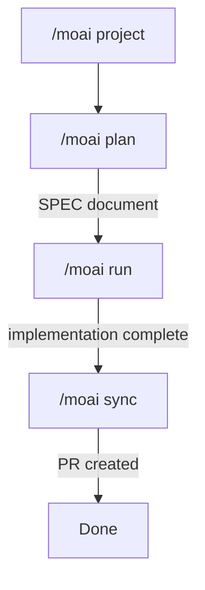
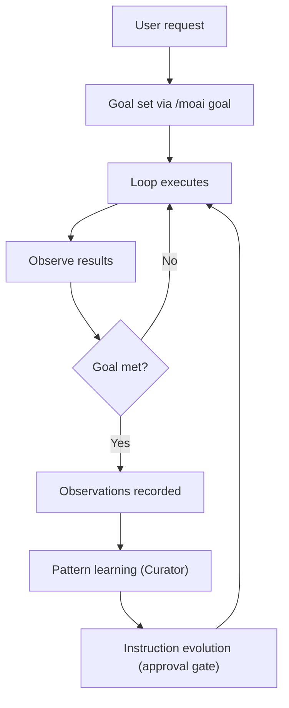
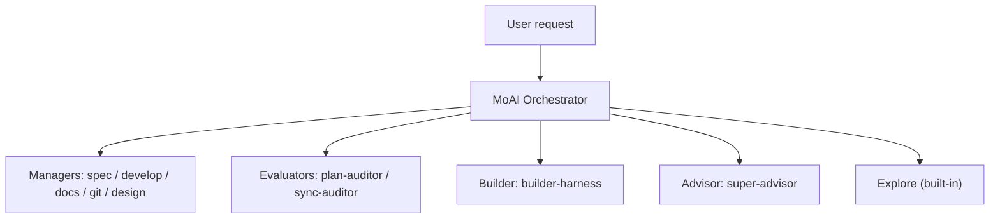
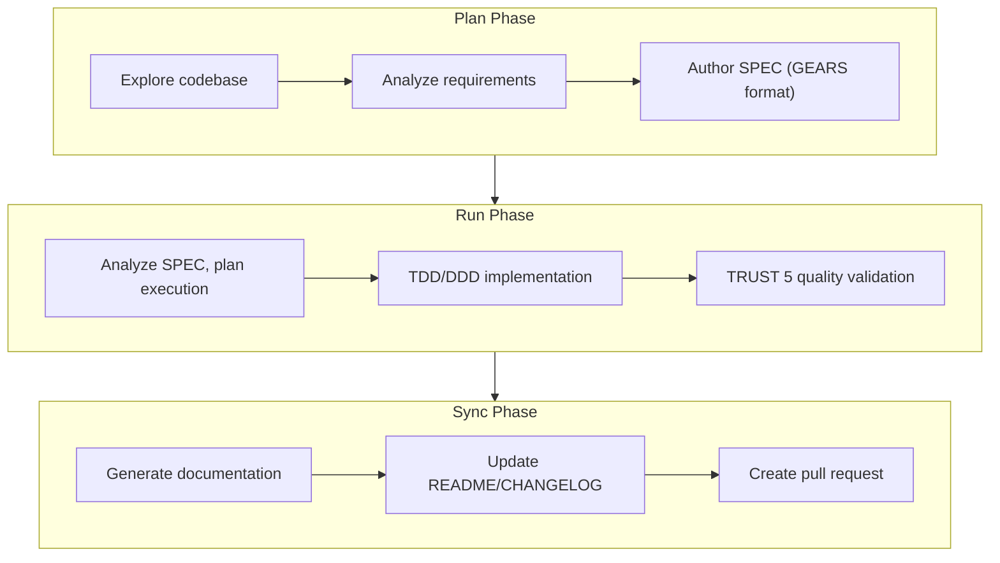
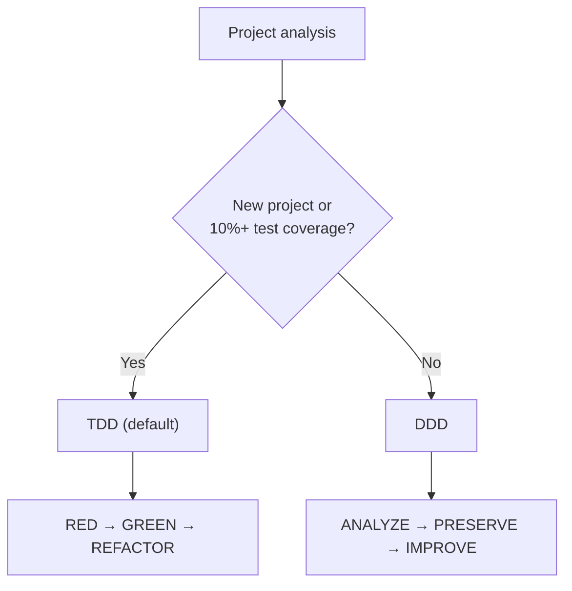

<p align="center">
  
</p>

<h1 align="center">MoAI-ADK</h1>

<p align="center">
  <strong>An Agentic Development Kit built for Tokenomics</strong>
</p>

<p align="center">
  English ·
  <a href="./README.ko.md">한국어</a> ·
  <a href="./README.ja.md">日本語</a> ·
  <a href="./README.zh.md">中文</a>
</p>

<p align="center">
  <a href="https://github.com/modu-ai/moai-adk/actions/workflows/ci.yml"></a>
  <a href="https://github.com/modu-ai/moai-adk/actions/workflows/codeql.yml"></a>
  <a href="https://codecov.io/gh/modu-ai/moai-adk"></a>
  <br>
  <a href="https://go.dev/"></a>
  <a href="https://github.com/modu-ai/moai-adk/releases"></a>
  <a href="./LICENSE"></a>
</p>

<p align="center">
  <a href="https://adk.mo.ai.kr"><strong>Official Documentation</strong></a> ·
  <a href="https://adk.mo.ai.kr/book">Book: Practical Agentic Coding with Claude Code</a> ·
  <a href="https://discord.gg/Z7E7Mdc5aN">Discord</a>
</p>

---

> **"The purpose of vibe coding is not rapid productivity but code quality."**

MoAI-ADK (Agentic Development Kit) is an agentic development kit whose north star is **Tokenomics (Token Economics)**: the same code quality for fewer tokens, and higher quality for the same tokens. Model selection, reasoning depth, and context usage are managed by the system — not left to chance.

A single binary written in Go. Runs instantly on macOS, Linux, and Windows with zero dependencies.

---

## The Bill of Agentic Coding

Agentic coding is fast to start and expensive to sustain. Three costs show up once the novelty wears off:

- **Token spend compounds as sessions grow.** Per-token prices keep falling, but a coding agent's total bill rises anyway — every extra turn re-reads the accumulated context, and long-running work multiplies that base cost across dozens of turns. Cheaper tokens, larger invoices.
- **AI-generated code ships unverified.** The model asserts the change is correct; nothing gates it. Tests, lint, coverage, and security checks are optional afterthoughts, so quality is a claim rather than a property of every merge.
- **Long sessions die at the context limit and lose work.** When the context window fills, the session stalls mid-task. Without a handoff, the work-in-progress and the reasoning behind it are gone, and the next session starts from scratch.

MoAI-ADK treats all three as engineering problems with mechanisms, not as facts of life.

---

## What MoAI-ADK Does About It

Each pain maps to a concrete mechanism with measurable evidence.

| Pain | Mechanism | Evidence |
|------|-----------|----------|
| Implementation token cost | **CG mode** — Claude leader plans and audits; GLM workers do bulk implementation (`moai cg`) | **60-70% cost cut** on implementation-heavy work |
| Runaway spend within a session | **Token Circuit Breaker + budget tracking** — statusline cost/CW% gauge, graceful abort before budget overruns | Halts before blowout instead of after; cost visible every turn |
| Unverified quality | **SPEC 3-phase lifecycle + TRUST 5 gates + independent auditors** (plan-auditor, sync-auditor) | Every merge passes tests / lint / coverage gates; the author never grades its own work |
| Session loss at context limit | **Session-handoff auto-resume** — paste-ready resume at the context-window threshold | One paste after `/clear` restores progress, applied lessons, and preconditions |
| Wrong model for the job | **No-Haiku 3-tier model policy** — declarative model + effort per phase and SPEC size | Opus-class judgment where it matters, cheap models only where safe |

The numbers are earned by the same discipline the tool enforces: from v2.14.0 to v3.0.0-rc12 (**80 days**), **2,373 commits** built **480+ SPEC documents**, **27** template-managed skills, and **36** top-level CLI commands across **16** supported languages — every change driven through the plan → run → sync pipeline below.

---

## Claude Code Alone vs Claude Code + MoAI-ADK

MoAI-ADK is a harness that runs **on top of** Claude Code — it does not replace it. What it adds is structure around the parts Claude Code leaves to you.

| Dimension | Claude Code alone | Claude Code + MoAI-ADK |
|-----------|-------------------|------------------------|
| Model routing | Manual — you pick the model each time | Declarative No-Haiku 3-tier policy (max / medium / low) per phase and SPEC size |
| Quality gate | None enforced | TRUST 5 (Tested / Readable / Unified / Secured / Trackable) on every change |
| Spec / requirements | Ad-hoc prompts | SPEC 3-phase lifecycle (plan → run → sync) with GEARS-format requirements + acceptance criteria |
| Cost control | None | Budget tracking + Token Circuit Breaker + CG hybrid (60-70% savings) |
| Session continuity | Manual re-prompt after `/clear` | Auto handoff — paste-once resume with progress and preconditions |
| Learning | Static across sessions | Self-evolving harness (observation → heuristic → rule → auto-update), always behind an approval gate |
| Multi-agent | Manual, per-prompt | 11-agent catalog with Analyze-First routing and separated planning/auditing roles |

---

## 5-Minute Start

The moment `moai init` finishes, you have a working harness: a statusline cost/context gauge in the Claude Code terminal, TRUST 5 quality gates wired into the workflow, and the full `/moai` command set ready inside chat.

### 1. Installation

#### macOS / Linux / WSL

```bash
curl -fsSL https://raw.githubusercontent.com/modu-ai/moai-adk/main/install.sh | bash
```

#### Windows (PowerShell 7.x+)

> **Recommended**: Use WSL with the Linux installation command above for the best experience.

```powershell
irm https://raw.githubusercontent.com/modu-ai/moai-adk/main/install.ps1 | iex
```

> Requires [Git for Windows](https://gitforwindows.org/) to be installed first.

#### Build from Source (Go 1.26+)

```bash
git clone https://github.com/modu-ai/moai-adk.git
cd moai-adk && make build
```

> Prebuilt binaries are available on the [Releases](https://github.com/modu-ai/moai-adk/releases) page.

### 2. Initialize a Project

```bash
moai init my-project
```

An interactive wizard auto-detects your language, framework, and methodology, selects a model policy, and generates the Claude Code integration files.

### 3. Start Developing with Claude Code

```bash
claude        # launch Claude Code inside the project
```

```text
/moai plan "Add JWT login"      # author a SPEC
/moai run SPEC-AUTH-001         # TDD/DDD implementation
/moai sync SPEC-AUTH-001        # sync docs + create PR
```

You can also just ask in natural language — `/moai "fix the login bug"` goes through intent analysis (Analyze-First routing) and lands on the right workflow, in any conversation language.


```mermaid
flowchart TD
    A["/moai project"] --> B["/moai plan"]
    B -->|"SPEC document"| C["/moai run"]
    C -->|"implementation complete"| D["/moai sync"]
    D -->|"PR created"| E["Done"]
```

### 4. Windows Note: Non-ASCII Username Paths

If your Windows username contains non-ASCII characters (Korean, Chinese, etc.), you may hit `EINVAL` errors caused by Windows 8.3 short-filename conversion. Workarounds:

```powershell
# Option 1: point MoAI at an ASCII-only temp directory
$env:MOAI_TEMP_DIR="C:\temp"
New-Item -ItemType Directory -Path "C:\temp" -Force

# Option 2: disable 8.3 filename generation (requires admin)
fsutil 8dot3name set 1
```

A third option is creating a Windows account with an ASCII-only username.

---

## System Requirements

| Platform | Supported Environments | Notes |
|----------|----------------------|-------|
| macOS | Terminal, iTerm2 | Fully supported |
| Linux | Bash, Zsh | Fully supported |
| Windows | **WSL (recommended)**, PowerShell 7.x+ | Native cmd.exe is not supported |

**Prerequisites:**

- **Git** must be installed on all platforms
- **Claude Code** — MoAI-ADK is a harness for Claude Code
- **Windows users**: [Git for Windows](https://gitforwindows.org/) is **required** (includes Git Bash); legacy Windows PowerShell 5.x and cmd.exe are **not supported**
- **Recommended**: `gh` CLI (PR automation) · `tmux` (CG mode) · your language's lint/test toolchain (e.g. `golangci-lint`)

---

## How It Works

MoAI-ADK rests on three ideas: **Tokenomics** (the right model and reasoning depth per phase, so quality per dollar is maximized), **Agentic Loop Engineering** (recursive self-learning — loops accumulate observations and the harness evolves from them), and the **Agentic Harness** (you design the environment agents work in rather than writing code directly). The rest of this section is how those ideas are built.

### Recursive Self-Learning

Agents learn from their own operation through two motions: loops that accumulate observations, and a harness that evolves from them.


```mermaid
flowchart TD
    A["User request"] --> B["Goal set via /moai goal"]
    B --> C["Loop executes"]
    C --> D["Observe results"]
    D --> E{"Goal met?"}
    E -->|"No"| C
    E -->|"Yes"| F["Observations recorded"]
    F --> G["Pattern learning (Curator)"]
    G --> H["Instruction evolution (approval gate)"]
    H --> C
```

### The Self-Evolving Harness

```
loop runs → observations accumulate (Routing Ledger) → patterns learned (Curator) → instructions evolve (approval gate)
```

- **Routing Observation Ledger** (`internal/harness/routing/`) — records routing decisions and gate evidence as privacy-preserving digests
- **4-tier learning ladder** (`internal/harness/learner.go`) — observation (≥1) → heuristic (≥3) → rule (≥5) → auto-update (≥10, user approval required); confidence floor 0.70
- **5-layer safety pipeline** — observer (`internal/harness/observer.go`) → learner → applier (`internal/harness/applier.go`, snapshot-first bounded edits) → config/marker updaters → user approval gate; every application is reversible via `moai harness rollback`
- Artifacts live under `.moai/harness/` (`usage-log.jsonl`, learned rules)

```bash
moai harness status      # learning state: observations, patterns, proposals
moai harness apply       # apply a proposal (passes the user approval gate)
moai harness rollback    # revert the last application
moai harness disable     # turn learning off
```

### /moai goal — Declarative Agentic Loops

Declare a completion condition and the session keeps working until the condition holds or the turn ceiling (default 30) is reached. Implemented in `internal/goal/` as per-session goal state (`.moai/state/goal/<session-id>.json`) with a hybrid 2-tier Stop-hook evaluator — Tier 1 mechanical checks (exit codes, grep counts, file existence, turn ceiling) and Tier 2 orchestrator self-evaluation via checkpoints.

```text
/moai goal "go test ./... exits 0 and every AC is recorded as PASS"
/moai goal status
/moai goal clear
```

### /moai loop vs /moai fix — Diagnostic Self-Repair

`/moai loop` is a goal-engine preset built on the Ralph Engine (`internal/ralph/engine.go`): it scans with LSP diagnostics + AST-grep + linters in parallel, classifies findings from Level 1 (auto-fixable) to Level 4 (needs a human), and iterates until the queue drains — with convergence detection that switches strategy when the same error repeats, and a hard iteration ceiling as a safety stop.

| Command | Goal | Execution | When to use |
|---------|------|-----------|-------------|
| `/moai fix` | Single-pass repair | One scan-classify-fix-verify pass | Clear errors, quick fixes |
| `/moai loop` | Repeat until done | Diagnose → classify → fix → verify loop | Compound errors, root-cause repair |

### Analyze-First Routing

Language-independent intent analysis is the default `/moai` routing. Requests are classified by meaning — never gated on English keyword matching — so any conversation language works:

1. Intent analysis (language-independent classification)
2. Context-sufficiency check (a Socratic interview fires when context is insufficient)
3. Execution-plan composition (skill / agent / dynamic-workflow chain)
4. Orchestration-mode selection (solo-sequential / parallel-subagents / dynamic-workflow)

### Session Handoff Auto-Resume

At the context-window threshold (50% on 1M-context models, 90% on 200K models), MoAI emits a paste-ready resume message — progress state, applied lessons, and verifiable preconditions included — so the next session continues with a single paste after `/clear`.

→ read more: [Self-Evolving Harness](https://adk.mo.ai.kr/en/advanced/self-evolving) · [Decision Memory](https://adk.mo.ai.kr/en/advanced/decision-memory)

### The 11-Agent Catalog

11 retained agents: 10 MoAI-custom plus the Anthropic built-in `Explore`.

| Category | Agent | Role |
|----------|-------|------|
| **Manager** | manager-spec | Plan-phase SPEC authoring |
| | manager-develop | Run-phase TDD/DDD/autofix implementation |
| | manager-docs | Sync-phase documentation |
| | manager-git | PR creation and routing |
| | manager-design | Design-phase collaboration (Claude Design) |
| **Evaluator** | plan-auditor | Independent plan audit (bias prevention) |
| | sync-auditor | 4-dimension quality scoring (Functionality 40 · Security 25 · Craft 20 · Consistency 15) |
| **Builder** | builder-harness | Scaffolds project-specific agents, skills, commands, and hooks |
| **Advisor** | super-advisor | On-demand high-reasoning consultation (E1-E4 escalation) |
| **Specialist** | e2e-tester | E2E test execution across web/mobile/desktop (CLI-first) |
| **Built-in** | Explore | Read-only codebase exploration |

Planning and auditing are separated by design — the author never grades its own work.


```mermaid
flowchart TD
    U["User request"] --> M["MoAI Orchestrator"]
    M --> MG1["Managers: spec / develop / docs / git / design"]
    M --> EV["Evaluators: plan-auditor / sync-auditor"]
    M --> BD["Builder: builder-harness"]
    M --> AD["Advisor: super-advisor"]
    M --> EX["Explore (built-in)"]
```

### SPEC 3-Phase Lifecycle

```
/moai plan → [plan-auditor audit] → Implementation Kickoff Approval (human gate) → /moai run → /moai sync → [sync-auditor scoring]
```

- The lifecycle is exactly three phases — **plan → run → sync**
- Tier S/M/L size classification decides verification depth and PR routing
- GEARS-format requirements plus acceptance criteria (AC) — completion is judged by evidence, not by "it seems done"


```mermaid
flowchart TB
    subgraph Plan ["Plan Phase"]
        P1["Explore codebase"] --> P2["Analyze requirements"]
        P2 --> P3["Author SPEC (GEARS format)"]
    end

    subgraph Run ["Run Phase"]
        R1["Analyze SPEC, plan execution"] --> R2["TDD/DDD implementation"]
        R2 --> R3["TRUST 5 quality validation"]
    end

    subgraph Sync ["Sync Phase"]
        S1["Generate documentation"] --> S2["Update README/CHANGELOG"]
        S2 --> S3["Create pull request"]
    end

    Plan --> Run
    Run --> Sync
```

### Development Methodology — TDD and DDD

MoAI-ADK selects the methodology from the project's state during `moai init` (`--mode <ddd|tdd>`, default: tdd); change it later via `development_mode` in `.moai/config/sections/quality.yaml`.


```mermaid
flowchart TD
    A["Project analysis"] --> B{"New project or<br/>10%+ test coverage?"}
    B -->|"Yes"| C["TDD (default)"]
    B -->|"No"| D["DDD"]
    C --> F["RED → GREEN → REFACTOR"]
    D --> G["ANALYZE → PRESERVE → IMPROVE"]
```

| Methodology | Cycle | For |
|-------------|-------|-----|
| **TDD** (default) | RED (failing test) → GREEN (minimal pass) → REFACTOR (quality under green tests) | New projects and feature work |
| **DDD** | ANALYZE (dependencies, domain boundaries) → PRESERVE (characterization tests) → IMPROVE (incremental change under test protection) | Existing code with < 10% coverage |

### TRUST 5 Quality Gate

Every code change is validated against five criteria:

| Criterion | Meaning | Validation |
|-----------|---------|------------|
| **T**ested | Tested | 85%+ coverage, characterization tests, unit tests passing |
| **R**eadable | Readable | Clear naming, consistent style, 0 lint errors |
| **U**nified | Unified | Consistent formatting, import ordering, project-structure adherence |
| **S**ecured | Secured | OWASP compliance, input validation, 0 security warnings |
| **T**rackable | Trackable | Conventional commits, issue references, structured logging |

### Harness v4 Builder

```text
/moai harness "build me a harness for CLI template development"
```

A natural-language request goes through domain/goal/constraint extraction and an approval gate, then generates project-specific agents, skills, and commands. `/moai project` generates the project docs (product.md, structure.md, tech.md, codemaps/) and auto-configures a harness alongside them.

### Orchestration Primitives

The static Agent Teams layer was retired in v3. Three orchestration primitives remain, chosen by who holds the plan:

| Primitive | Shape | Best for |
|-----------|-------|----------|
| Sequential sub-agents | Orchestrator delegates turn by turn | Coding-heavy work |
| Parallel fan-out | Multiple read-only `Agent()` calls in one turn | Research, review, audits |
| Dynamic workflows | A script orchestrates dozens of agents; results stay in script variables | Codebase sweeps, large migrations |

The native Claude Code teammate runtime (`moai cg` tmux panes) is unaffected by the retirement.

### Ultracode — xhigh Effort + Automatic Orchestration

```text
/effort ultracode
```

`/effort ultracode` combines `xhigh` reasoning effort with automatic dynamic-workflow orchestration (Claude Code v2.1.154+): for each substantive task in the session, the optimal orchestration primitive is chosen automatically and large fan-outs run as scripts whose intermediate results stay in script variables rather than the session context. Reach for it on large parallel sweeps, audits, and migrations — whole-codebase scans or hundreds of independent tasks — where the fan-out itself is the dominant cost. For a single request, prefix it with the `ultracode` keyword instead of switching the whole session.

→ read more: [Dynamic Workflows and Ultracode](https://adk.mo.ai.kr/en/advanced/ultracode-workflows)

### Decision Memory

MoAI-ADK captures your AskUserQuestion decisions and personalizes future recommendations:

- **3-tier memory** — Core (hot preferences) / Recall (recent sessions) / Archival (28-day TTL with soft delete)
- **Adaptive placement** — questions fire where uncertainty is highest (p ≈ 0.5); recommendations follow your observed statistical majority, not system defaults
- **Decay policy** — power-law weights, `(age+1)^(-0.5)`; using a preference refreshes it
- **Controls** — `moai preference list | decay-scan | toggle`; sensitive security domains get neutral recommendations with disclosure

→ read more: [Harness v4 Builder](https://adk.mo.ai.kr/en/advanced/harness-v4-builder) · [Catalog System](https://adk.mo.ai.kr/en/advanced/catalog-system)

---

## Tool Reference

### `/moai` Slash Subcommands

> **Important distinction**: `moai` (terminal CLI) ≠ `/moai` (Claude Code slash command). The former is the Go binary you run in a shell (`moai init`, `moai doctor`); the latter is the AI workflow router you run inside Claude Code chat (`/moai plan`, `/moai run`). They are different tools.

16 entries — 15 named subcommands plus the natural-language default:

| Subcommand | Role |
|------------|------|
| `plan` / `run` / `sync` | The SPEC 3-phase pipeline |
| `goal` / `loop` / `fix` | Declarative goal loop · iterative repair · single-pass repair |
| `project` / `harness` | Project docs + harness generation · harness lifecycle |
| `review` / `gate` / `clean` | Code review · pre-commit quality gate · dead-code removal |
| `codemaps` / `feedback` | Architecture docs · GitHub issue reporting |
| `e2e` | Multi-platform E2E testing (web/mobile/desktop, CLI-first) |
| *(natural language)* | Analyze-First routing into the autonomous plan → run → sync pipeline |

→ details: [Workflow Commands](https://adk.mo.ai.kr/en/workflow-commands) · [Utility Commands](https://adk.mo.ai.kr/en/utility-commands)

### CLI Commands (36 top-level)

The `moai` binary registers 36 top-level commands across three cobra groups (launch / project / tools). The everyday set:

| Command | Description |
|---------|-------------|
| `moai init` | Interactive project setup (language/framework/methodology auto-detection) |
| `moai doctor` | System health diagnosis and environment verification |
| `moai status` | Project status summary (Git branch, quality metrics) |
| `moai update` | Update to the latest version (automatic rollback support) |
| `moai update -c` | Re-run the init wizard to edit configuration (no template sync) |
| `moai cc` / `moai glm` / `moai cg` | Claude-only / GLM-only / hybrid Claude-leader + GLM-workers sessions |
| `moai worktree <new\|list\|switch\|sync\|remove\|clean\|go>` | Git worktree management for parallel SPEC development |
| `moai session <list\|register\|current>` | Multi-session coordination |
| `moai spec <audit\|archive\|lint\|list\|new>` | SPEC lifecycle tooling |
| `moai goal <arm\|status\|clear>` | Goal engine CLI |
| `moai harness <status\|apply\|rollback\|disable>` | Harness learning lifecycle |
| `moai handoff <save\|list>` | Session handoff records |
| `moai preference <list\|decay-scan\|toggle>` | Decision-memory management |
| `moai hook <event>` | Claude Code hook dispatcher |
| `moai web` | Web Console — 6-tab configuration console with sub-agent 4-color tier badges (en/ko/ja/zh) |
| `moai inventory` | Read-only inventory of sessions, worktrees, and harnesses (`--json` supported) |
| `moai version` | Version, commit hash, and build date |

Also registered: `clean`, `loop`, `lsp`, `ast-grep`, `agent`, `workflow`, `statusline`, `telemetry`, `constitution`, `state`, `tool-policy`, `migrate`, `migration`, `verify`, `profile`, `pr`, `github`, `research`.

→ details: [CLI Reference](https://adk.mo.ai.kr/en/cli-reference) — 11 recently added reference pages cover `goal`, `handoff`, `harness`, `init`, `launchers`, `loop`, `pr`, `session`, `spec`, `tool-policy`, and `worktree`.

### Hooks

All hook events follow the Claude Code hooks protocol with JSON stdin/stdout communication. The `moai hook <event>` dispatcher (one kebab-case subcommand per event) is invoked by shell wrappers (`handle-*.sh`) that Claude Code calls directly:

- **26 event types** (kebab-case) — `session-start`, `pre-tool`, `post-tool`, `stop`, `subagent-start`, `subagent-stop`, `user-prompt-submit`, `notification`, `task-created`, `task-completed`, `teammate-idle`, `config-change`, and more (full list: `moai hook --help`)
- **4 hook types** — command (shell scripts), prompt (LLM evaluation), agent (subagent verification), http (webhook endpoints)
- Task metrics are captured to `.moai/logs/task-metrics.jsonl` for session analytics and cost tracking

→ details: [Hooks Guide](https://adk.mo.ai.kr/en/advanced/hooks-guide) · [Hooks Reference](https://adk.mo.ai.kr/en/advanced/hooks-reference)

### Statusline

MoAI renders a rich statusline at the bottom of the Claude Code terminal via the `moai statusline` command (10-second `refreshInterval`): model tier/effort, MoAI version (with update marker), Git branch and change state, context-window usage (CW%), cache hit rate, and session cost/tokens.

CW% carries a two-stage `/clear` marker — a soft warning at the model-specific threshold (50% on 1M-context models such as Opus 4.8 and GLM-5.2[1m]; 90% on 200K models) and a hard marker at the absolute ceiling. Claude Code misreports GLM-5.2 as a 200K model (upstream Issue #653); MoAI corrects it to 1M in `internal/statusline/memory.go`, so trust the MoAI statusline CW%.

→ details: [Statusline](https://adk.mo.ai.kr/en/advanced/statusline)

### Output Styles

| Style | Character | Audience |
|-------|-----------|----------|
| **MoAI** (expert) | Dense, concise | Experienced developers |
| **MoAI-Easy** (basic) | Friendly, explanatory — the product default | New users |
| **MoAI-Learn** (learn) | Socratic tutor | Learners |

Switch via `/config` (stored in `settings.local.json`, the highest-priority scope). Output style is read once at session start — changes take effect after `/clear` or a new session.

→ details: [Claude Code Guide — Foundations](https://adk.mo.ai.kr/en/claude-code/foundations)

### @MX Tag System

@MX tags are inline code annotations that pass context, invariant contracts, and danger zones between AI agents.

```go
// @MX:ANCHOR: [AUTO] Hook registry dispatch - 5+ callers
// @MX:REASON: [AUTO] Central entry point for all hook events, changes have wide impact
func DispatchHook(event string, data []byte) error {
    // ...
}
```

| Tag | Purpose | Trigger |
|-----|---------|---------|
| `@MX:ANCHOR` | Invariant contracts | fan_in >= 3 — changes have wide impact |
| `@MX:WARN` | Danger zones | goroutines, complexity >= 15, global state mutation |
| `@MX:NOTE` | Context | Magic constants, missing docs, business rules |
| `@MX:TODO` | Incomplete work | Missing tests, unimplemented features |
| `@MX:DEBT` | Deliberate working simplification | Known limit (`@MX:CEILING`) + revisit trigger (`@MX:UPGRADE`) |

The system optimizes signal-to-noise: **only the code AI must notice first gets a tag.** Most code meets no criterion and carries no tag — that is normal and intended. Thresholds and per-file limits are configured in `.moai/config/sections/mx.yaml`; tags are created and maintained automatically inside the plan/run/sync phases.

→ details: [@MX Tags](https://adk.mo.ai.kr/en/advanced/mx-tags)

### Worktree Isolation

`/moai plan --worktree` gives each SPEC an isolated git worktree for parallel development; `moai worktree` manages the lifecycle (`new --tmux` auto-creates a tmux session inside the worktree).

→ details: [Git Worktree Guide](https://adk.mo.ai.kr/en/worktree)

### 16 Supported Languages

go · python · typescript · javascript · rust · java · kotlin · csharp · ruby · php · elixir · cpp · scala · r · flutter · swift — detected via project markers, each running its own standard lint/format/test toolchain. Tools not installed are skipped gracefully.

→ details: [CLI Reference](https://adk.mo.ai.kr/en/cli-reference)

---

## FAQ

### Q: Why doesn't every function have an @MX tag?

**That is normal.** Tags mark only high-fan-in, complex, or dangerous code. Most code in every project qualifies for no tag — an untagged file is not a defect.

### Q: What does the version indicator in the statusline mean?

```
🗿 v3.0.0-rc11 ⬆️ v3.0.0-rc12
```

The first value is the installed MoAI-ADK version; the arrow shows an available update (run `moai update` to clear it). This is separate from Claude Code's own version indicator.

## Contributing

Contributions are welcome! See [CONTRIBUTING.md](CONTRIBUTING.md) for detailed guidelines.

1. Fork the repository
2. Create a feature branch: `git checkout -b feature/my-feature`
3. Write tests (TDD for new code, characterization tests for existing code)
4. Ensure tests, linting, and formatting pass: `make test` · `make lint` · `make fmt`
5. Commit with conventional commit messages and open a pull request

**Code quality requirements**: 85%+ coverage · 0 lint errors · 0 type errors · Conventional commits

### Community

- [Discord](https://discord.gg/Z7E7Mdc5aN) — real-time discussion and tips
- [Issues](https://github.com/modu-ai/moai-adk/issues) — bug reports, feature requests (or `/moai feedback` from inside Claude Code)

---

## License

[Apache License 2.0](./LICENSE) — see the LICENSE file for details.

## Documentation Guide

The [official documentation](https://adk.mo.ai.kr/en) is organized into 12 sections — each linked below with a one-line description.

| Section | What it covers |
|---------|----------------|
| [Getting Started](https://adk.mo.ai.kr/en/getting-started) | Introduction, installation, Windows guide, init wizard, quickstart, CLI primer, FAQ |
| [Core Concepts](https://adk.mo.ai.kr/en/core-concepts) | What MoAI-ADK is, the constitution, harness engineering, SPEC-based dev, DDD, TRUST 5 |
| [Workflow Commands](https://adk.mo.ai.kr/en/workflow-commands) | `plan`, `run`, `sync`, `project`, `harness`, `design` |
| [Utility Commands](https://adk.mo.ai.kr/en/utility-commands) | `fix`, `loop`, `gate`, `review`, `clean`, `codemaps`, `e2e`, `feedback`, `goal`, `moai` |
| [CLI Reference](https://adk.mo.ai.kr/en/cli-reference) | The `moai` binary's commands — status, profile, doctor, worktree, spec, session, goal, harness, and more |
| [Claude Code Guide](https://adk.mo.ai.kr/en/claude-code) | Claude Code foundations, context-memory, agentic, extensibility |
| [Multi-LLM](https://adk.mo.ai.kr/en/multi-llm) | CG mode (Claude × GLM hybrid) and the model-policy reference |
| [Cost Optimization](https://adk.mo.ai.kr/en/cost-optimization) | Prompt caching for lower token cost |
| [Guides](https://adk.mo.ai.kr/en/guides) | CI autonomy and multi-LLM CI recipes |
| [Git Worktree](https://adk.mo.ai.kr/en/worktree) | Worktree guide, examples, and FAQ |
| [Advanced](https://adk.mo.ai.kr/en/advanced) | Tokenomics, token budget, statusline, settings.json, hooks, @MX tags, skills, harness v4 builder, self-evolving, decision memory, security, CLAUDE.md guide, agent guide, and more |
| [Contributing](https://adk.mo.ai.kr/en/contributing) | How to contribute to MoAI-ADK |

## Links

- [Official Documentation](https://adk.mo.ai.kr)
- [Book: Practical Agentic Coding with Claude Code](https://adk.mo.ai.kr/book)
- [CHANGELOG](./CHANGELOG.md)
- [Claude Code](https://docs.anthropic.com/en/docs/claude-code)
- [Discord Community](https://discord.gg/Z7E7Mdc5aN)
