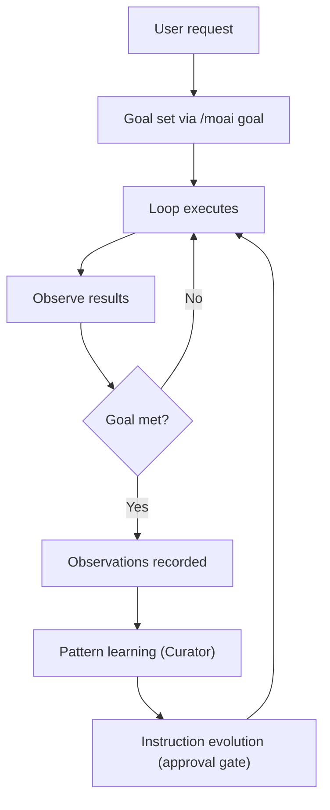
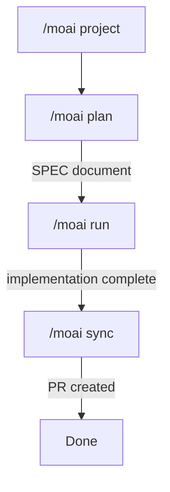
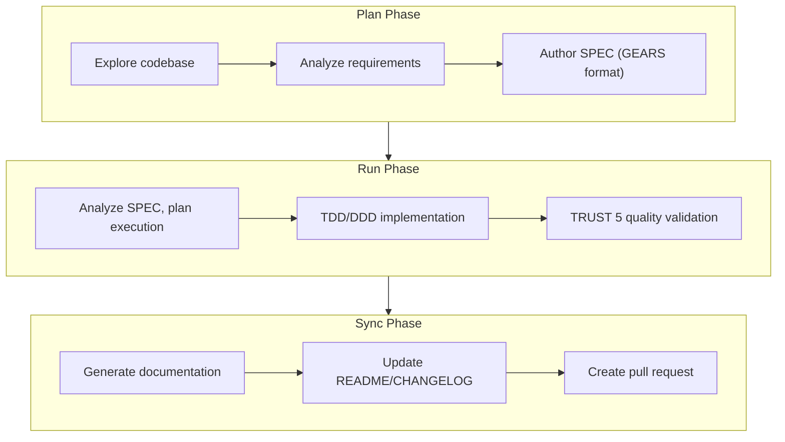
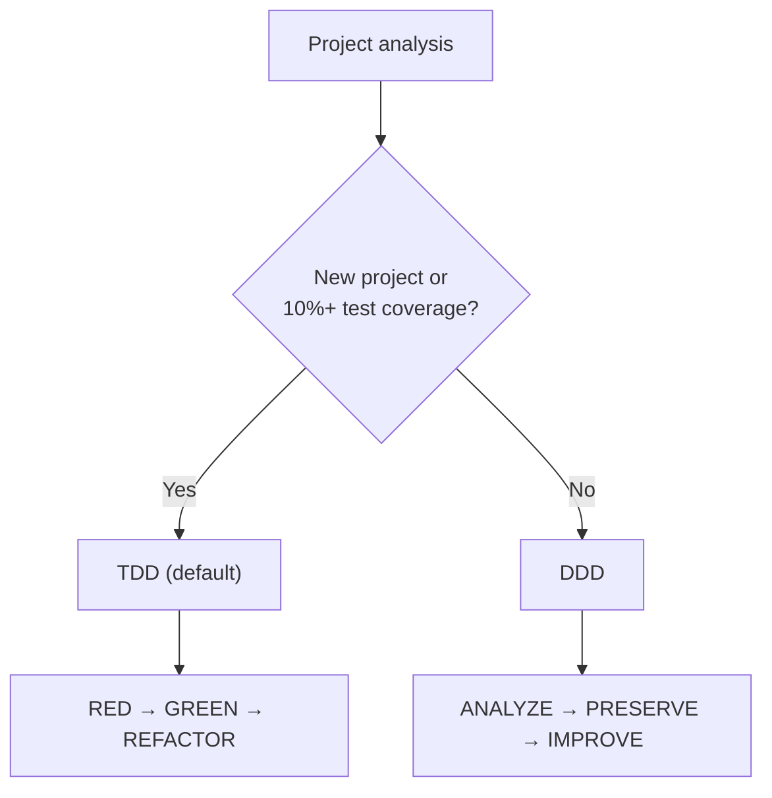
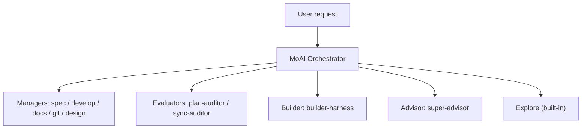

<p align="center">
  
</p>

<h1 align="center">MoAI-ADK</h1>

<p align="center">
  <strong>An Agentic Development Kit designed for Tokenomics</strong>
</p>

<p align="center">
  English ·
  <a href="./README.ko.md">한국어</a> ·
  <a href="./README.ja.md">日本語</a> ·
  <a href="./README.zh.md">中文</a>
</p>

<p align="center">
  <a href="https://github.com/modu-ai/moai-adk/actions/workflows/ci.yml"></a>
  <a href="https://github.com/modu-ai/moai-adk/actions/workflows/codeql.yml"></a>
  <a href="https://codecov.io/gh/modu-ai/moai-adk"></a>
  <br>
  <a href="https://go.dev/"></a>
  <a href="https://github.com/modu-ai/moai-adk/releases"></a>
  <a href="./LICENSE"></a>
</p>

<p align="center">
  <a href="https://adk.mo.ai.kr"><strong>Official Documentation</strong></a> ·
  <a href="https://adk.mo.ai.kr/book">Book: Practical Agentic Coding with Claude Code</a> ·
  <a href="https://discord.gg/Z7E7Mdc5aN">Discord</a>
</p>

---

> **"The purpose of vibe coding is not rapid productivity but code quality."**

---

## What Is MoAI-ADK

MoAI-ADK (Agentic Development Kit) is a harness that sits **on top of** Claude Code. A harness is a system that wraps the model from the outside. The model is a stochastic worker moving token by token — it remembers neither its budget, nor its quality bar, nor where the last session broke off. A cost ceiling, a passing test suite, continuity that survives `/clear` — properties like these cannot be re-seeded by a prompt every turn; the system has to enforce them from the outside. That system is the harness.

Every design decision serves one goal: token economics — the same quality for fewer tokens, higher quality for the same tokens. Which model to use, how deeply to reason, how to spend context — none of this is left to chance turn by turn; the system decides.

It does not replace Claude Code. It only wraps, in structure, the parts Claude Code leaves to you — model routing, quality gates, cost control, session continuity. A single binary written in Go, it runs on macOS, Linux, and Windows with no extra dependencies.

---

## Why MoAI-ADK

Claude Code alone will produce code. The question is whether that code comes out at the same quality every time, at a predictable cost. The case for adopting the harness compresses into three arguments.

### Argument 1 — Quality comes from structure, not prompts

Discipline seeded through prompts evaporates the moment context gets compacted. Standards like "tests first", "85% coverage", "separate the author from the reviewer" cannot be restated every turn — and even when they are, the model cannot prove to itself that it followed them. MoAI-ADK enforces these standards as a pipeline: every change passes the SPEC 3-phase lifecycle (plan → run → sync), the TRUST 5 gate (including 85%+ coverage) demands passing evidence, and the agent that wrote the plan is separated from the agent that audits it, so no one grades their own work. Completion is judged by test output and acceptance criteria — not by "it looks done".

### Argument 2 — Cost is decided by assignment, not model price

As the measurements in [From 2.0 to 3.0](#from-20-to-30) below show, cost per solved task diverges by more than 2× even within the same Claude family — running a weaker model at maximum effort is actually more expensive and scores lower. No human can tune this assignment by hand for every task. MoAI-ADK assigns model and reasoning depth declaratively through a Tier×Phase matrix, diets the context by redirecting verification logs to disk, and defends the budget with the Token Circuit Breaker. Cost control becomes a system property, not a personal habit.

### Argument 3 — Sessions break; work continues

The context window is finite and `/clear` is inevitable. In bare Claude Code, progress, lessons, and preconditions evaporate at every such boundary. MoAI-ADK auto-generates a handoff at session boundaries so the next session continues from a single paste, and observations accumulated by the loops climb the learning ladder into harness guidance. The unit of work becomes the project, not the session.

### Two anticipated objections

- **"Can't good prompting do this?"** — A prompt is a request; a harness is enforcement. The only rules that survive context compaction, session boundaries, and model switches are the rules that exist as files and gates.
- **"Isn't the adoption overhead high?"** — It is one dependency-free Go binary. From the moment `moai init` finishes, the statusline, quality gates, and `/moai` commands are live. It wraps your existing Claude Code workflow rather than replacing it, so nothing you do today changes.

In one line — **Claude Code writes the code; MoAI-ADK makes that code trustworthy and its cost predictable.**

---

## From 2.0 to 3.0

The reason to move to v3 is not a longer feature list. It is that the system now carries two axes — cost and learning — that used to be yours to hold. Where v2 handed you individual levers (cache, GLM), v3 wires those levers into a closed loop and makes them properties of the system.

### The Problem — Token Prices Fell but Costs Rose

Per-token prices keep falling, yet the actual spend on an agentic workload goes up. An agent runs dozens to hundreds of steps to solve a single task, and burns tokens all the way. On pay-as-you-go that is the invoice; on a subscription it eats the weekly quota shared across every model. So token discipline — "which model, run how deep" — becomes the competitive axis. Cheaper unit prices do not solve this.

### The Evidence — Costs Diverge More Than Twofold Within the Same Ecosystem

Even within the same Claude family, at the same top effort (max), the cost of solving one task spreads widely. These are the figures from an internal report consolidating measurements on the DeepSWE leaderboard (113 tasks).

| Model [max] | Pass@1 | Cost per task | $/solved task | Tokens/solved task | Steps |
|---|---|---|---|---|---|
| claude-opus-4.8 | 59% | $13.22 | **$22.4** | 229k | 120 |
| claude-fable-5 | 70% | $21.63 | $30.9 | 170k | 88 |
| claude-sonnet-5 | 54% | $26.40 | $48.9 | 396k | 268 |

The point is that sonnet-5 max is **more expensive than opus-4.8 max ($26.40 vs $13.22 per task) while scoring lower (54% vs 59%)**. The cause is 268 steps and 214k output tokens — at top effort the retry loop runs away. The folk wisdom that "running a weaker model hard is cheap" does not hold; it runs three times the steps and burns more quota. In short, cost is decided not by a model's unit price but by **assigning the right model and reasoning depth to the task**.

### v3's Answer — Cost as a System Property

v3 does not leave that assignment to chance; it closes it with a 4-layer tokenomics stack.

1. **Instrumentation** — per-SPEC token accounting. The statusline surfaces cost, CW%, and cache hit rate every turn, and leaves verification measurements under `.moai/state/verify/`.
2. **Routing** — a Tier (S/M/L) × Phase matrix assigns model and effort declaratively, with a plan_type profile layered on to distinguish pay-as-you-go from subscription. The measurements above become policy directly — the higher model for reasoning, a high ceiling for execution, the cheapest tier for mechanical work.
3. **Verification economy** — verify-diet. Raw verification logs are redirected to disk; only the exit code and a tail summary stay in context.
4. **Budget defense** — the Token Circuit Breaker halts gracefully before the budget is exceeded and produces a handoff.

v2 had the levers too — cache and GLM. v3 binds those levers into instrument → route → diet → defend, making cost not a set-once configuration but a system property maintained every turn.

### The Second Axis — It Gets Better as You Use It

v2's harness stopped where the session ended. In v3 the loops (`/moai goal`, `/moai loop`) accumulate observations, and those observations refine the skill and agent instructions. The 4-tier learning ladder (observation ≥1 → heuristic ≥3 → rule ≥5 → auto-update ≥10, user approval required, confidence floor 0.70) is implemented and running in `internal/harness/learner.go`, and every application can be reverted with `moai harness rollback`. The Curator pipeline that promotes observations into rules is still being refined, but the learning-ladder engine itself is live. The detailed behavior is covered below in the [Recursive Self-Learning](#recursive-self-learning--the-harness-evolves) section.

### So What Changed (Evidence)

Every item in the right column below is new in the v2.14.0 → v3.0.0 window.

| Axis | v2.x | v3.x |
|-----|-------|-------|
| Model policy | Manual selection regardless of phase or size | **No-Haiku 3-tier model policy** (max / medium / low) + plan-aware plan_type profiles |
| Cost control | After-the-fact review | **Token Circuit Breaker** — graceful halt before budget overrun + handoff generation |
| Learning · loops | Static across sessions | **Self-evolving harness** (Routing Ledger + Curator) · **decision memory** · **`/moai goal` condition-declared loop** |
| Agent composition | Many agents, mixed roles | **11-agent catalog** — planning/auditing roles separated, cheaper delegation with fewer agents |
| Multi-LLM | Single backend | **CG mode** (Claude leader + GLM workers) — 60-70% savings on implementation work |
| Terminal UX | Early CLI | **TUX v3** — Charm-based wizards, change previews, live progress display |

### The 8 Themes Behind v3

Grouping the commits piled up since v2.14.0 by theme yields eight strands. The commit counts below are tallied by commit title — a signal of relative scale, not absolute volume.

| Theme | Evidence (SPEC series / keyword commit count) | v3 output |
|------|-----------------------------------|-----------|
| Harness deepening | `harness` 283 · HARNESS-EVOLVE 34 · HARNESS-V4 18 | Self-evolving harness (Ledger+Curator), Harness v4 Builder |
| Web Console | WEB-CONSOLE 134 · WEBCONF-SIMPLIFY 21 · `web` 188 | `moai web` 6-tab configuration console + 4-color tier badges |
| Agent catalog · team retirement | `agent` 182 · AGENT-TEAM-REBUILD 15 · AGENT-TEAM-RETIRE 13 | Catalog cleanup → 11, static Agent Teams retired |
| Session continuity · automation loops | `handoff` 91 · `session` 83 · `loop` 52 · `goal` 38 | auto-resume handoff, `/moai goal` engine, Ralph loop, decision memory |
| CLI/terminal UX | CLI-TUX-V3 56 · `tux` 56 | Charm (huh v2/bubbletea v2) wizards, change previews |
| Tokenomics | `glm` 49 · `token` 44 · `cache` 28 · model-policy 21 · WORKFLOW-CACHE-OPT 12 | No-Haiku 3-tier, plan_type, CG/GLM, Circuit Breaker, prompt cache |
| Docs · i18n rebuild | DOCS-V3-REBUILD 49 · `docs-site` 38 · HUMANIZE 19 | geekdoc migration, 4-locale, docs humanize |
| Security · isolation · neutrality | SEC-HARDEN 41 · TEMPLATE-ISOLATION 23 · `permission` 16 | 8-tier settings merge, OS sandbox, template-neutrality guard |

### v3 by the Numbers

Over the **80 days** from v2.14.0 (2026-04-24) to v3.0.0 (2026-07-16), **2,373 commits** piled up (**feat 816** · fix 252 · docs 581). The result:

- **500** SPEC-document-driven development (`.moai/specs/`)
- **moai-\* 27** template-managed skills · **36** top-level CLI commands · **16** `/moai` subcommands (+ the natural-language default)
- **11-agent** catalog (10 MoAI-custom + built-in Explore) · **16** supported languages

Every one of these changes passed through the plan → run → sync pipeline without exception.

---

## MoAI 3.0's Core Values and Capabilities

Three values drive MoAI 3.0. Under each value are the capabilities that make it real. The commands and tables are covered in detail under [Reference](#reference).

### Tokenomics — the System Manages Cost

Cost is decided by how you operate tokens, not by model price. Assign the right model and reasoning depth per task, diet the context, and let the system defend the budget.

- **No-Haiku 3-tier model policy** — declaratively assigns model and reasoning effort by phase and SPEC size (Tier S/M/L). Three policies — max / medium / low.
- **plan_type profiles** — plan-aware. Applies different Tier × Phase matrices to API pay-as-you-go and subscription plans, and layers an effort overlay on the GLM backend.
- **CG mode** — `moai cg` is a hybrid where a Claude leader plans and audits while GLM workers handle bulk implementation. **60-70% cost savings** on implementation-heavy work.
- **Token Circuit Breaker + statusline** — the statusline shows cost, CW% (context-window usage), and cache hit rate every turn, and halts safely before the budget is exceeded. The two-stage `/clear` marker beside CW% appears at model-specific thresholds (50% on 1M-context models, 90% on 200K models). Claude Code misreports GLM-5.2 as a 200K model (upstream Issue #653), but MoAI corrects it to 1M in `internal/statusline/memory.go`.
- **Context diet + prompt cache** — minimizes always-loaded instructions and redirects verification logs to disk so only a summary stays in context. The cache hit rate is surfaced on the statusline so the diet's effect is measurable immediately.

> → read more: [Model Policy](https://adk.mo.ai.kr/en/multi-llm/model-policy) · [No-Haiku 3-tier](https://adk.mo.ai.kr/en/advanced/no-haiku-3tier) · [plan_type Profiles](https://adk.mo.ai.kr/en/advanced/plan-type-profiles) · [CG Mode](https://adk.mo.ai.kr/en/multi-llm/cg-mode) · [Statusline](https://adk.mo.ai.kr/en/advanced/statusline) · [Token Budget](https://adk.mo.ai.kr/en/advanced/token-budget) · [Prompt Caching](https://adk.mo.ai.kr/en/cost-optimization/prompt-caching)

### Recursive Self-Learning — the Harness Evolves

Agents learn as they work. Loops accumulate observations, and from those observations the harness evolves.


```mermaid
flowchart TD
    A["User request"] --> B["Goal set via /moai goal"]
    B --> C["Loop executes"]
    C --> D["Observe results"]
    D --> E{"Goal met?"}
    E -->|"No"| C
    E -->|"Yes"| F["Observations recorded"]
    F --> G["Pattern learning (Curator)"]
    G --> H["Instruction evolution (approval gate)"]
    H --> C
```

- **Routing Observation Ledger** — records routing decisions and gate evidence as privacy-preserving digests.
- **4-tier learning ladder** — observation (≥1) → heuristic (≥3) → rule (≥5) → auto-update (≥10, user approval required); confidence floor 0.70.
- **Curator + 5-layer safety pipeline** — snapshot-first bounded edits. Every application is reversible via `moai harness rollback`.
- **`/moai goal`** — declare a single completion condition and the session works on its own until the condition holds or the turn ceiling (default 30) is reached. Implemented in `internal/goal/`, with state held in `.moai/state/goal/<session-id>.json` and judgment handled by a 2-tier Stop-hook evaluator (Tier 1 mechanical checks · Tier 2 orchestrator self-evaluation).
- **Session handoff auto-resume** — at the context-window threshold (50% on 1M models / 90% on 200K models), a single paste continues into the next session. Progress state, lessons, and preconditions are included automatically.
- **Decision memory** — 3-tier (Core / Recall / Archival, 28-day TTL). Questions fire where uncertainty is highest (p ≈ 0.5), and recommendations follow the observed statistical majority rather than a system default. The decay policy is power-law weighting `(age+1)^(-0.5)`, controlled via `moai preference list | decay-scan | toggle`.

```bash
moai harness status      # learning state: observations, patterns, proposals
moai harness apply       # apply a proposal (passes the user approval gate)
moai harness rollback    # revert the last application
moai harness disable     # turn learning off
```

```text
/moai goal "go test ./... exits 0 and every AC is recorded as PASS"
/moai goal status
/moai goal clear
```

> → read more: [Self-Evolving Harness](https://adk.mo.ai.kr/en/advanced/self-evolving) · [Decision Memory](https://adk.mo.ai.kr/en/advanced/decision-memory) · [Catalog System](https://adk.mo.ai.kr/en/advanced/catalog-system)

### Agentic Harness — Designing the Environment Agents Work In

Instead of writing code directly, you design an environment where agents work well.

- **SPEC 3-phase lifecycle** — plan → run → sync. Tier S/M/L size classification sets verification depth and PR routing, and GEARS-format requirements + acceptance criteria judge completion by evidence.
- **TRUST 5 quality gate** — Tested (85%+ coverage) · Readable · Unified · Secured · Trackable, applied to every change.
- **11-agent catalog** — 10 MoAI-custom + built-in Explore. Planning and auditing are separated from the design stage, so the side that authored the work never grades its own.
- **Harness v4 Builder** — natural-language request → domain/goal/constraint extraction → approval gate → generation of project-specific agents, skills, and commands.
- **@MX tags** — inline code annotations that pass context, invariant contracts, and danger zones between AI agents.
- **worktree isolation** — `/moai plan --worktree` attaches an isolated worktree per SPEC for parallel development.
- **Web Console** — `moai web` provides a 6-tab console for editing settings in the browser + sub-agent 4-color tier badges (en/ko/ja/zh).
- **OS sandbox + 8-tier settings merge** — isolates tool execution in an OS-level sandbox (Bubblewrap/Seatbelt/Docker), and resolves settings deterministically with an 8-tier priority merge.

> → read more: [Workflow Commands](https://adk.mo.ai.kr/en/workflow-commands) · [Harness v4 Builder](https://adk.mo.ai.kr/en/advanced/harness-v4-builder) · [@MX Tags](https://adk.mo.ai.kr/en/advanced/mx-tags)

---

## Quick Start

The moment `moai init` finishes, the harness runs. A cost/context gauge appears on the Claude Code statusline, TRUST 5 quality gates wire into the workflow, and the full `/moai` command set is available in chat.

### Installation

#### macOS / Linux / WSL

```bash
curl -fsSL https://raw.githubusercontent.com/modu-ai/moai-adk/main/install.sh | bash
```

#### Windows (PowerShell 7.x+)

> **Recommended**: For the smoothest experience, use WSL with the Linux installation command above.

```powershell
irm https://raw.githubusercontent.com/modu-ai/moai-adk/main/install.ps1 | iex
```

> Requires [Git for Windows](https://gitforwindows.org/) to be installed first.

#### Build from Source (Go 1.26+)

```bash
git clone https://github.com/modu-ai/moai-adk.git
cd moai-adk && make build
```

> Prebuilt binaries are available on the [Releases](https://github.com/modu-ai/moai-adk/releases) page.

### Initialize a Project

```bash
moai init my-project
```

An interactive wizard auto-detects your language, framework, and methodology, selects a model policy, and generates the Claude Code integration files.

### First Workflow

```bash
claude        # launch Claude Code inside the project
```

```text
/moai plan "Add JWT login"      # author a SPEC
/moai run SPEC-AUTH-001         # TDD/DDD implementation
/moai sync SPEC-AUTH-001        # sync docs + create PR
```

You can also just ask in natural language. Write `/moai "fix the login bug"` and intent analysis (Analyze-First routing) reads the request and forwards it to the right workflow — in any conversation language.


```mermaid
flowchart TD
    A["/moai project"] --> B["/moai plan"]
    B -->|"SPEC document"| C["/moai run"]
    C -->|"implementation complete"| D["/moai sync"]
    D -->|"PR created"| E["Done"]
```

### System Requirements

| Platform | Supported Environments | Notes |
|----------|----------------------|-------|
| macOS | Terminal, iTerm2 | Fully supported |
| Linux | Bash, Zsh | Fully supported |
| Windows | **WSL (recommended)**, PowerShell 7.x+ | Native cmd.exe is not supported |

**Prerequisites**

- **Git** must be installed on all platforms
- **Claude Code** — MoAI-ADK is a harness for Claude Code
- **Windows users**: [Git for Windows](https://gitforwindows.org/) is **required** (includes Git Bash); legacy Windows PowerShell 5.x and cmd.exe are **not supported**
- **Recommended**: `gh` CLI (PR automation) · `tmux` (CG mode) · your language's lint/test toolchain (e.g. `golangci-lint`)

### Windows Non-ASCII Username Paths

If your Windows username contains non-ASCII characters (Korean, Chinese, etc.), you may hit `EINVAL` errors caused by Windows 8.3 short-filename conversion. Workarounds:

```powershell
# Option 1: point MoAI at an ASCII-only temp directory
$env:MOAI_TEMP_DIR="C:\temp"
New-Item -ItemType Directory -Path "C:\temp" -Force

# Option 2: disable 8.3 filename generation (requires admin)
fsutil 8dot3name set 1
```

A third option is creating a Windows account with an ASCII-only username.

---

## Reference

Everything attached to each value — command tables, pipelines, agents, annotations — is gathered here. Follow the link under each table for the deep-dive docs.

### `/moai` Slash Subcommands

> **Easy to confuse**: `moai` (terminal CLI) and `/moai` (Claude Code slash command) are different tools. The former is a Go binary you run in the shell (`moai init`, `moai doctor`); the latter is an AI workflow router you call inside Claude Code chat (`/moai plan`, `/moai run`).

16 named subcommands + the natural-language default:

| Subcommand | Role |
|------------|------|
| `plan` / `run` / `sync` | The SPEC 3-phase pipeline |
| `project` / `harness` / `design` | Project docs + harness generation · harness lifecycle · Design-phase collaboration |
| `goal` / `loop` / `fix` | Declarative goal loop · iterative repair · single-pass repair |
| `review` / `gate` / `clean` | Code review · pre-commit quality gate · dead-code removal |
| `mx` / `codemaps` / `feedback` | @MX annotations · architecture docs · GitHub issue reporting |
| `e2e` | Multi-platform E2E testing (web/mobile/desktop, CLI-first) |
| *(natural language)* | Analyze-First routing into the autonomous plan → run → sync pipeline |

> → read more: [Workflow Commands](https://adk.mo.ai.kr/en/workflow-commands) · [Utility Commands](https://adk.mo.ai.kr/en/utility-commands)

### CLI Commands (36 top-level)

The `moai` binary registers 36 top-level commands. Starting with the ones you reach for most:

| Command | Description |
|---------|-------------|
| `moai init` | Interactive project setup (language/framework/methodology auto-detection) |
| `moai doctor` | System health diagnosis and environment verification |
| `moai status` | Project status summary (Git branch, quality metrics) |
| `moai update` | Update to the latest version (automatic rollback support) |
| `moai update -c` | Re-run the init wizard to edit configuration (no template sync) |
| `moai cc` / `moai glm` / `moai cg` | Claude-only / GLM-only / hybrid Claude-leader + GLM-workers sessions |
| `moai worktree <new\|list\|switch\|sync\|remove\|clean\|go>` | Git worktree management for parallel SPEC development |
| `moai session <list\|register\|current>` | Multi-session coordination |
| `moai spec <audit\|archive\|lint\|list\|new>` | SPEC lifecycle tooling |
| `moai goal <arm\|status\|clear>` | Goal engine CLI |
| `moai harness <status\|apply\|rollback\|disable>` | Harness learning lifecycle |
| `moai handoff <save\|list>` | Session handoff records |
| `moai preference <list\|decay-scan\|toggle>` | Decision-memory management |
| `moai hook <event>` | Claude Code hook dispatcher |
| `moai web` | Web Console — 6-tab configuration console (identity, language, launch, git_strategy, llm, agentfm) + sub-agent 4-color tier badges (en/ko/ja/zh) |
| `moai inventory` | Read-only inventory of sessions, worktrees, and harnesses (`--json` supported) |
| `moai version` | Version, commit hash, and build date |

The remaining registered commands: `agent`, `ast-grep`, `clean`, `constitution`, `github`, `loop`, `lsp`, `migrate`, `migration`, `mx`, `profile`, `pr`, `research`, `state`, `telemetry`, `tool-policy`, `verify`, `workflow`.

> Each command has its own reference page on the docs-site. In v3 in particular, **11 new CLI reference pages** landed for `goal`, `handoff`, `harness`, `init`, `launchers`, `loop`, `pr`, `session`, `spec`, `tool-policy`, and `worktree`.
> → read more: [CLI Reference](https://adk.mo.ai.kr/en/cli-reference)

### SPEC 3-Phase · Development Methodology · TRUST 5

```
/moai plan → [plan-auditor audit] → Implementation Kickoff Approval (human gate) → /moai run → /moai sync → [sync-auditor scoring]
```

`/moai`'s default routing is language-independent intent analysis — it classifies a request by meaning rather than English keywords, so any conversation language works.

1. Intent analysis (language-independent classification)
2. Context-sufficiency check (a Socratic interview fires when context is insufficient)
3. Execution-plan composition (skill / agent / dynamic-workflow chain)
4. Orchestration-mode selection (solo-sequential / parallel-subagents / dynamic-workflow)


```mermaid
flowchart TB
    subgraph Plan ["Plan Phase"]
        P1["Explore codebase"] --> P2["Analyze requirements"]
        P2 --> P3["Author SPEC (GEARS format)"]
    end

    subgraph Run ["Run Phase"]
        R1["Analyze SPEC, plan execution"] --> R2["TDD/DDD implementation"]
        R2 --> R3["TRUST 5 quality validation"]
    end

    subgraph Sync ["Sync Phase"]
        S1["Generate documentation"] --> S2["Update README/CHANGELOG"]
        S2 --> S3["Create pull request"]
    end

    Plan --> Run
    Run --> Sync
```

The methodology is set by `moai init` based on the project's state (`--mode <ddd|tdd>`, default: tdd). To change it later, edit `development_mode` in `.moai/config/sections/quality.yaml`.


```mermaid
flowchart TD
    A["Project analysis"] --> B{"New project or<br/>10%+ test coverage?"}
    B -->|"Yes"| C["TDD (default)"]
    B -->|"No"| D["DDD"]
    C --> F["RED → GREEN → REFACTOR"]
    D --> G["ANALYZE → PRESERVE → IMPROVE"]
```

| Methodology | Cycle | For |
|-------------|-------|-----|
| **TDD** (default) | RED (failing test) → GREEN (minimal pass) → REFACTOR (quality under green tests) | New projects and feature work |
| **DDD** | ANALYZE (dependencies, domain boundaries) → PRESERVE (characterization tests) → IMPROVE (incremental change under test protection) | Existing code with < 10% coverage |

| Criterion | Meaning | Validation |
|-----------|---------|------------|
| **T**ested | Tested | 85%+ coverage, characterization tests, unit tests passing |
| **R**eadable | Readable | Clear naming, consistent style, 0 lint errors |
| **U**nified | Unified | Consistent formatting, import ordering, project-structure adherence |
| **S**ecured | Secured | OWASP compliance, input validation, 0 security warnings |
| **T**rackable | Trackable | Conventional commits, issue references, structured logging |

`/moai loop` is a goal-engine preset layered on the Ralph Engine (`internal/ralph/engine.go`): it scans LSP diagnostics, AST-grep, and linters in parallel, sorts the findings from Level 1 (auto-fixable) to Level 4 (needs a human), and iterates until the queue drains.

| Command | Goal | Execution | When to use |
|---------|------|-----------|-------------|
| `/moai fix` | Single-pass repair | One scan-classify-fix-verify pass | Clear errors, quick fixes |
| `/moai loop` | Repeat until done | Diagnose → classify → fix → verify loop | Compound errors, root-cause repair |

### The 11-Agent Catalog · Orchestration Primitives

11 retained agents: 10 MoAI-custom + Anthropic built-in `Explore`.

| Category | Agent | Role |
|----------|-------|------|
| **Manager** | manager-spec | Plan-phase SPEC authoring |
| | manager-develop | Run-phase TDD/DDD/autofix implementation |
| | manager-docs | Sync-phase documentation |
| | manager-git | PR creation and routing |
| | manager-design | Design-phase collaboration (Claude Design) |
| **Evaluator** | plan-auditor | Independent plan audit (bias prevention) |
| | sync-auditor | 4-dimension quality scoring (Functionality 40 · Security 25 · Craft 20 · Consistency 15) |
| **Builder** | builder-harness | Scaffolds project-specific agents, skills, commands, and hooks |
| **Advisor** | super-advisor | On-demand high-reasoning consultation (E1-E4 escalation) |
| **Specialist** | e2e-tester | E2E test execution across web/mobile/desktop (CLI-first) |
| **Built-in** | Explore | Read-only codebase exploration |


```mermaid
flowchart TD
    U["User request"] --> M["MoAI Orchestrator"]
    M --> MG1["Managers: spec / develop / docs / git / design"]
    M --> EV["Evaluators: plan-auditor / sync-auditor"]
    M --> BD["Builder: builder-harness"]
    M --> AD["Advisor: super-advisor"]
    M --> EX["Explore (built-in)"]
```

The static Agent Teams layer stepped back in v3. What remains is a set of three orchestration primitives, chosen by who holds the plan.

| Primitive | Shape | Best for |
|-----------|-------|----------|
| Sequential sub-agents | Orchestrator delegates turn by turn | Coding-heavy work |
| Parallel fan-out | Multiple read-only `Agent()` calls in one turn | Research, review, audits |
| Dynamic workflows | A script orchestrates dozens of agents; results stay in script variables | Codebase sweeps, large migrations |

The native Claude Code teammate runtime (`moai cg` tmux panes) keeps running regardless of this retirement. To run a large parallel sweep, audit, or migration in a single request, use `/effort ultracode` (xhigh effort + automatic dynamic-workflow orchestration, Claude Code v2.1.154+), or just prefix the request with the `ultracode` keyword.

> → read more: [Dynamic Workflows and Ultracode](https://adk.mo.ai.kr/en/advanced/ultracode-workflows)

### @MX Tags · Hooks · Output Styles

@MX tags are inline code annotations that pass context, invariant contracts, and danger zones between AI agents.

```go
// @MX:ANCHOR: [AUTO] Hook registry dispatch - 5+ callers
// @MX:REASON: [AUTO] Central entry point for all hook events, changes have wide impact
func DispatchHook(event string, data []byte) error {
    // ...
}
```

| Tag | Purpose | Trigger |
|-----|---------|---------|
| `@MX:ANCHOR` | Invariant contracts | fan_in >= 3 — changes have wide impact |
| `@MX:WARN` | Danger zones | goroutines, complexity >= 15, global state mutation |
| `@MX:NOTE` | Context | Magic constants, missing docs, business rules |
| `@MX:TODO` | Incomplete work | Missing tests, unimplemented features |

The point is signal-to-noise. Only the code AI must notice first gets a tag. Most code meets no criterion and carries no tag — that is not a defect but the intended behavior. Thresholds and per-file limits are tuned in `.moai/config/sections/mx.yaml`, and tags are created and maintained automatically inside the plan/run/sync phases.

Hooks follow the Claude Code hook protocol, exchanging JSON over stdin/stdout.

- **26 event types** — SessionStart, PreToolUse, PostToolUse, SessionEnd, Stop, SubagentStop, PreCompact, PostCompact, TeammateIdle, TaskCompleted, and more
- **4 hook types** — command (shell scripts), prompt (LLM evaluation), agent (subagent verification), http (webhook endpoints)
- Task metrics are recorded to `.moai/logs/task-metrics.jsonl` for session analytics and cost tracking

There are three output styles. Switch with `/config` (the choice is saved to `settings.local.json`, the highest-priority scope), and since it is read only once at session start, it takes effect on `/clear` or in a new session.

| Style | Character | Audience |
|-------|-----------|----------|
| **MoAI** (expert) | Dense, concise | Experienced developers |
| **MoAI-Easy** (basic) | Friendly, explanatory — the product default | New users |
| **MoAI-Learn** (learn) | Socratic tutor | Learners |

**16 supported languages**: go · python · typescript · javascript · rust · java · kotlin · csharp · ruby · php · elixir · cpp · scala · r · flutter · swift — detected by project markers, each running that language's standard lint/format/test toolchain. Tools that are not installed are skipped without complaint.

> → read more: [@MX Tags](https://adk.mo.ai.kr/en/advanced/mx-tags) · [Hooks Guide](https://adk.mo.ai.kr/en/advanced/hooks-guide) · [Hooks Reference](https://adk.mo.ai.kr/en/advanced/hooks-reference) · [Git Worktree Guide](https://adk.mo.ai.kr/en/worktree) · [Advanced Guide](https://adk.mo.ai.kr/en/advanced)

---

## Reading the Statusline

Right after `moai init`, the Claude Code statusline appears as three lines. From the top: session info · usage gauges · repo state.

```
🤖 Opus │ 🧠 xhigh·t │ ♻️ 87% │ 🔅 v2.1.212 │ 🗿 v3.0.0 │ ⏳ 2h 34m │ 💬 MoAI
🪫 CW: ████████░░ 88% (⚠️/clear) │ 🔋 5H: ████░░░░░░ 45% (4h 30m) │ 🪫 7D: ████████░░ 82% (Jan 21)
📁 moai-adk-go │ 🔀 modu-ai/moai-adk | 🅱️ feat/statusline ↑2 +3 │ 💾 +1 M2 ?0 │ 📋 [run SPEC-AUTH-001-run] │ 💌 PR #1042 (⌥approved)
```

| Element | Meaning |
|------|------|
| 🤖 model | The currently active model (e.g. Opus) |
| 🧠 effort | Reasoning effort level — a `·t` suffix when extended thinking is on |
| ♻️ cache hit rate | Prompt-cache hit rate `cache_read / (read + creation)` |
| 🔅 Claude version | Claude Code version |
| 🗿 MoAI version | MoAI-ADK version — shows `-> 🗿 v<new>` when an update is available |
| ⏳ session time | Elapsed time of the current session |
| 💬 output style | Active output style (MoAI / MoAI-Easy / MoAI-Learn) |
| CW: context | Context-window usage + two-stage `/clear` marker (⚠️ soft, 🛑 hard) |
| 5H: 5-hour usage | 5-hour plan usage + time left until reset |
| 7D: 7-day usage | 7-day plan usage + reset date |
| 🔋 / 🪫 battery | Battery icon in front of the gauge — flips to 🪫 above 70% |
| 📁 directory | Project directory name |
| 🔀 repo | GitHub repo identity `owner/name` (17th segment, outside the config schema) |
| 🅱️ branch | Current branch + `↑`ahead `↓`behind + `+`dirty count |
| `[WT]` worktree | Prefix in front of the branch when on an active worktree |
| 💾 git status | staged / modified / untracked counts (`+S M_M ?U`) |
| 📋 task | Active SPEC workflow `[command SPEC-ID-stage]` |
| 💌 PR | Active GitHub PR number + review state (`⌥state`) |

Segments are turned on and off directly via the 16 formal keys — there are no named presets (full/compact/minimal). Each segment silently hides when it has no data to show. Full configuration, data sources, and hide conditions are covered in the [statusline guide](https://adk.mo.ai.kr/en/advanced/statusline).

---

## FAQ

### Q: Why doesn't every function have an @MX tag?

**That is normal.** Tags mark only high-fan-in, complex, or dangerous code. In any project, most code triggers no tag criterion, and an untagged file is not a defect.

### Q: What does the version indicator in the statusline mean?

```
🗿 v3.0.0 ⬆️ v3.0.1
```

The first value is the currently installed MoAI-ADK version; the arrow indicates an available update (running `moai update` clears it). It is separate from Claude Code's own version indicator.

### Q: Can I use Claude only, without GLM?

**You can.** `moai cc` is a Claude-only session. CG mode (`moai cg`, Claude leader + GLM workers) and GLM-only (`moai glm`) are just cost-saving options — the harness, SPEC workflow, and quality gates run identically in all three modes.

### Q: Does it apply to existing projects?

**It does.** `moai init` detects the project's state and picks the methodology — DDD for existing code under 10% coverage (fix behavior with characterization tests, then improve incrementally), TDD for new or sufficiently tested code.

---

## Community and Docs

### Contributing

Contributions are always welcome. See [CONTRIBUTING.md](CONTRIBUTING.md) for the detailed process.

1. Fork the repository
2. Create a feature branch: `git checkout -b feature/my-feature`
3. Write tests (TDD for new code, characterization tests for existing code)
4. Ensure tests, linting, and formatting pass: `make test` · `make lint` · `make fmt`
5. Commit with conventional commit messages and open a pull request

**Code quality requirements**: 85%+ coverage · 0 lint errors · 0 type errors · Conventional commits

### Community

- [Discord](https://discord.gg/Z7E7Mdc5aN) — real-time discussion and tips
- [Issues](https://github.com/modu-ai/moai-adk/issues) — bug reports, feature requests (or `/moai feedback` from inside Claude Code)

### License

[Apache License 2.0](./LICENSE) — see the LICENSE file for details.

### Documentation Guide

The [adk.mo.ai.kr](https://adk.mo.ai.kr/en) online docs are split into 12 sections. Here is what each covers and where to start.

| Section | Description |
|------|------|
| [Getting Started](https://adk.mo.ai.kr/en/getting-started) | Introduction, installation, Windows guide, init wizard, quickstart, CLI primer, FAQ |
| [Core Concepts](https://adk.mo.ai.kr/en/core-concepts) | MoAI-ADK identity, the constitution, harness engineering, SPEC-based dev, DDD, TRUST 5 |
| [Workflow Commands](https://adk.mo.ai.kr/en/workflow-commands) | `plan` · `run` · `sync` · `project` · `harness` · `design` — the backbone of the SPEC pipeline |
| [Utility Commands](https://adk.mo.ai.kr/en/utility-commands) | `fix` · `loop` · `gate` · `review` · `clean` · `codemaps` · `e2e` · `feedback` · `goal` · `moai` |
| [CLI Reference](https://adk.mo.ai.kr/en/cli-reference) | Every command of the terminal `moai` binary — `status`, `profile`, `doctor`, `update`, `web`, `goal`, `handoff`, `harness`, `init`, `worktree`, and more |
| [Claude Code Guide](https://adk.mo.ai.kr/en/claude-code) | Claude Code integration — foundations, context-memory, agentic, extensibility (skills · hooks · plugins) |
| [Multi-LLM](https://adk.mo.ai.kr/en/multi-llm) | CG mode (Claude leader + GLM workers) and the model policy |
| [Cost Optimization](https://adk.mo.ai.kr/en/cost-optimization) | Prompt caching strategy and token-cost reduction |
| [Guides](https://adk.mo.ai.kr/en/guides) | Practical operations recipes — CI autonomy, multi-LLM CI, and more |
| [Git Worktree](https://adk.mo.ai.kr/en/worktree) | Worktree guide, examples, and FAQ for parallel SPEC development |
| [Advanced](https://adk.mo.ai.kr/en/advanced) | Deep-dive topics — tokenomics overview, token budget, statusline, settings.json, hooks, @MX tags, skills guide, Harness v4 Builder, self-evolving, decision memory, catalog system, security notes, CLAUDE.md/agent guide, and more |
| [Contributing](https://adk.mo.ai.kr/en/contributing) | Open-source contribution guide |

### Links

- [Official Documentation](https://adk.mo.ai.kr)
- [Book: Practical Agentic Coding with Claude Code](https://adk.mo.ai.kr/book)
- [CHANGELOG](./CHANGELOG.md)
- [Claude Code](https://docs.anthropic.com/en/docs/claude-code)
- [Discord Community](https://discord.gg/Z7E7Mdc5aN)
