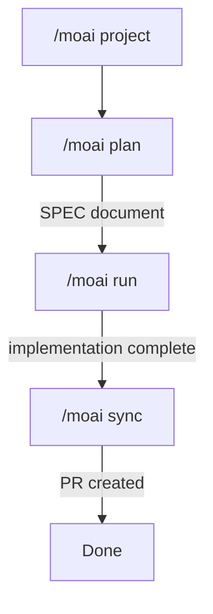
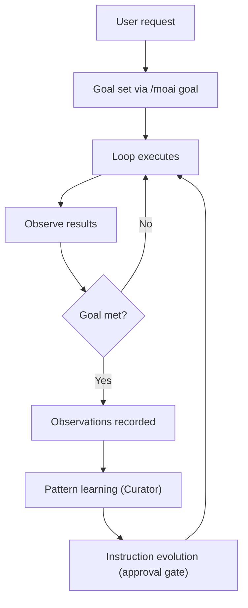
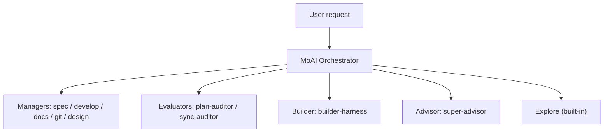
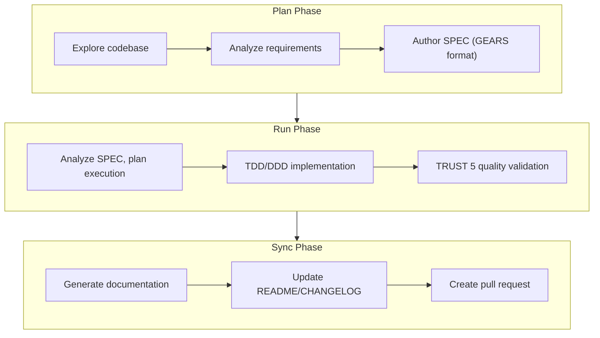
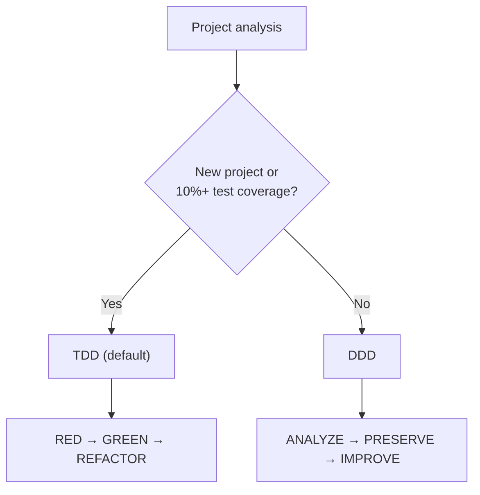

<p align="center">
  
</p>

<h1 align="center">MoAI-ADK</h1>

<p align="center">
  <strong>An Agentic Development Kit built for Tokenomics</strong>
</p>

<p align="center">
  English ·
  <a href="./README.ko.md">한국어</a> ·
  <a href="./README.ja.md">日本語</a> ·
  <a href="./README.zh.md">中文</a>
</p>

<p align="center">
  <a href="https://github.com/modu-ai/moai-adk/actions/workflows/ci.yml"></a>
  <a href="https://github.com/modu-ai/moai-adk/actions/workflows/codeql.yml"></a>
  <a href="https://codecov.io/gh/modu-ai/moai-adk"></a>
  <br>
  <a href="https://go.dev/"></a>
  <a href="https://github.com/modu-ai/moai-adk/releases"></a>
  <a href="./LICENSE"></a>
</p>

<p align="center">
  <a href="https://adk.mo.ai.kr"><strong>Official Documentation</strong></a> ·
  <a href="https://adk.mo.ai.kr/book">Book: Practical Agentic Coding with Claude Code</a> ·
  <a href="https://discord.gg/Z7E7Mdc5aN">Discord</a>
</p>

---

> **"The purpose of vibe coding is not rapid productivity but code quality."**

MoAI-ADK (Agentic Development Kit) is an agentic development kit whose north star is **Tokenomics (Token Economics)**: the same code quality for fewer tokens, and higher quality for the same tokens. Model selection, reasoning depth, and context usage are managed by the system — not left to chance.

A single binary written in Go. Runs instantly on macOS, Linux, and Windows with zero dependencies.

---

## Why Tokenomics

Token prices keep falling, but agentic development burns tokens faster than prices drop. More agents run in parallel, contexts grow longer, and reasoning gets deeper — so your real cost is decided **not by the model's price tag but by how you operate tokens**.

MoAI-ADK's answer comes in three parts:

1. **Assign the right model and reasoning depth to each task** — plan deeply, implement cheaply, verify independently.
2. **Put context on a diet** — minimize always-loaded instructions and measure prompt-cache hit rates.
3. **Let the system guard the budget** — track token usage per agent and stop gracefully before the ceiling, never mid-crash.

---

## The Three Pillars

### Pillar 1 — Tokenomics (Token Economics)

Intelligent resource allocation that maximizes quality per dollar. A No-Haiku 3-tier model policy (max / medium / low), plan-aware tier profiles (API metered vs. subscription plans), a Claude × GLM hybrid (CG mode, 60-70% cost reduction on implementation-heavy work), and a Token Circuit Breaker that aborts gracefully before budget overruns.

### Pillar 2 — Recursive Self-Learning

Loops accumulate observations; the harness learns; the instructions evolve. A Routing Observation Ledger records routing decisions, a Curator turns them into improvement proposals, and a 4-tier learning ladder (observation → heuristic → rule → auto-update) upgrades the harness — always behind a user approval gate.

### Pillar 3 — The Agentic Harness

Instead of writing code directly, you design the environment where agents work well: an 11-agent catalog, a SPEC-based 3-phase workflow (plan → run → sync), the TRUST 5 quality gate, and a Harness v4 Builder that generates project-specific harnesses from a natural-language request.

---

## v3 by the Numbers

From v2.14.0 (2026-04-24) to v3.0.0-rc11 (2026-07-13) — **80 days**:

- **2,373 commits** between the two tags — feat 727 · docs 517 · fix 240
- **9 release candidates** (rc1 → rc11)
- Agent catalog consolidated **22 → 10** (fewer agents, cheaper delegation)
- **480+ SPEC documents** driving spec-first development under `.moai/specs/`
- **27** template-managed `moai-*` skills · **36** top-level CLI commands · **16** programming languages supported

---

## Quick Start

### 1. Installation

#### macOS / Linux / WSL

```bash
curl -fsSL https://raw.githubusercontent.com/modu-ai/moai-adk/main/install.sh | bash
```

#### Windows (PowerShell 7.x+)

> **Recommended**: Use WSL with the Linux installation command above for the best experience.

```powershell
irm https://raw.githubusercontent.com/modu-ai/moai-adk/main/install.ps1 | iex
```

> Requires [Git for Windows](https://gitforwindows.org/) to be installed first.

#### Build from Source (Go 1.26+)

```bash
git clone https://github.com/modu-ai/moai-adk.git
cd moai-adk && make build
```

> Prebuilt binaries are available on the [Releases](https://github.com/modu-ai/moai-adk/releases) page.

### 2. Initialize a Project

```bash
moai init my-project
```

An interactive wizard auto-detects your language, framework, and methodology, selects a model policy, and generates the Claude Code integration files.

### 3. Start Developing with Claude Code

```bash
claude        # launch Claude Code inside the project
```

```text
/moai plan "Add JWT login"      # author a SPEC
/moai run SPEC-AUTH-001         # TDD/DDD implementation
/moai sync SPEC-AUTH-001        # sync docs + create PR
```

You can also just ask in natural language — `/moai "fix the login bug"` goes through intent analysis (Analyze-First routing) and lands on the right workflow, in any conversation language.


```mermaid
flowchart TD
    A["/moai project"] --> B["/moai plan"]
    B -->|"SPEC document"| C["/moai run"]
    C -->|"implementation complete"| D["/moai sync"]
    D -->|"PR created"| E["Done"]
```

### 4. Windows Note: Non-ASCII Username Paths

If your Windows username contains non-ASCII characters (Korean, Chinese, etc.), you may hit `EINVAL` errors caused by Windows 8.3 short-filename conversion. Workarounds:

```powershell
# Option 1: point MoAI at an ASCII-only temp directory
$env:MOAI_TEMP_DIR="C:\temp"
New-Item -ItemType Directory -Path "C:\temp" -Force

# Option 2: disable 8.3 filename generation (requires admin)
fsutil 8dot3name set 1
```

A third option is creating a Windows account with an ASCII-only username.

---

## System Requirements

| Platform | Supported Environments | Notes |
|----------|----------------------|-------|
| macOS | Terminal, iTerm2 | Fully supported |
| Linux | Bash, Zsh | Fully supported |
| Windows | **WSL (recommended)**, PowerShell 7.x+ | Native cmd.exe is not supported |

**Prerequisites:**

- **Git** must be installed on all platforms
- **Claude Code** — MoAI-ADK is a harness for Claude Code
- **Windows users**: [Git for Windows](https://gitforwindows.org/) is **required** (includes Git Bash); legacy Windows PowerShell 5.x and cmd.exe are **not supported**
- **Recommended**: `gh` CLI (PR automation) · `tmux` (CG mode) · your language's lint/test toolchain (e.g. `golangci-lint`)

---

## Design Lineage — Harness Engineering

MoAI-ADK deliberately inherits the harness-engineering framework laid out in Lilian Weng's [**Harness Engineering for Self-Improvement**](https://lilianweng.github.io/posts/2026-07-04-harness/) (2026-07-04), translating its design patterns and self-improvement loop into a working implementation.

> **What is a harness?** — "A harness is the system surrounding a base model that orchestrates execution and decides how the model thinks and plans, calls tools and acts, perceives and manages context, stores artifacts, and evaluates results." — Lilian Weng (2026-07-04)

Weng predicted that the near-term path to recursive self-improvement (RSI) is not "the model editing its own weights" but **improving the training pipeline and the deployment system — the harness**. MoAI-ADK takes exactly this path: it recursively improves the harness (skills and agent instructions), not model weights.

### Inheritance Map — Weng's Framework to MoAI-ADK

| Lilian Weng harness concept | MoAI-ADK implementation |
|---|---|
| **Harness** — the execution/operations layer around a base model | MoAI-ADK = a Claude Code harness (single Go binary + CLAUDE.md orchestrator) |
| **Pattern 1: Workflow Automation** — plan → execute → observe → improve goal loops | `/moai goal` engine, `/moai loop` Ralph Engine, Analyze-First routing |
| **Pattern 2: File-System Persistent Memory** — "durable state in files" | `.moai/specs/`, `progress.md`, `usage-log.jsonl`, `.moai/state/`, session handoff |
| **Pattern 3: Sub-agents & Backend Jobs** — make parallelism explicit and inspectable | 11 retained agents, `Agent()` spawns, dynamic workflows |
| **Self-Harness** — propose-evaluate-accept; bounded edits + regression gates | `internal/harness/` 4-tier ladder + 5-layer safety pipeline (applier = bounded edit, regression gate = verification) |
| **Meta-Harness** — "a harness that optimizes harnesses" | `builder-harness` — the harness builds harnesses; `/moai project` auto-generates one |
| **"Improve the improver"** — RSI's near-term path is deployment-system improvement | Recursive harness evolution — loops accumulate observations; the harness upgrades its own skill/agent instructions |
| **"Evaluators and permissions live outside the loop"** — reward-hacking defense | Layer-5 user approval gate + Implementation Kickoff Approval — human oversight sits outside the evolution loop |
| **"Humans move up the stack, not out of the loop"** | The orchestrator is the single human contact point; AskUserQuestion-gated decisions and SPEC approval gates |

> Weng's warning is honored faithfully: evaluators and permission controls must stay **outside** the harness-evolution loop. MoAI-ADK binds Tier-4 auto-updates to a user approval gate so automated evolution can never run as a closed loop without human oversight.

---

## Tokenomics in Depth

### No-Haiku 3-Tier Model Policy

Models and reasoning depth (effort) are assigned declaratively by work phase and SPEC size (Tier S/M/L). The policy tiers form a closed set — `max`, `medium`, `low` — validated by HARD lint rules in `internal/config/model_routing.go` (closed sets: effort `low/medium/high/xhigh/max`, tier `S/M/L`, phase `plan/run/sync`).

| Policy | Target plan | Character |
|--------|-------------|-----------|
| **max** | Max $200/mo | Highest quality — Opus-class models on planning and audit |
| **medium** | Max $100/mo | Balanced quality and cost |
| **low** | Plus $20/mo | No Opus access — Sonnet-centered routing |

The "No-Haiku" name marks the v3 shift away from routing quality-critical phases to the cheapest model: cheap models are used where they are safe, never where independent judgment is required.

### Plan-Aware Tier Profiles (plan_type)

The same workflow has different optimal allocations under **API metered billing vs. subscription plans**. Plan-aware profiles apply a separate Tier × Phase model/effort matrix per billing plan, with an effort overlay for GLM backends.

### Claude × GLM Hybrid (CG Mode)

`moai cg` runs a Claude leader with GLM workers: strategy, planning, and audits stay on the Claude API while bulk implementation goes to GLM. On implementation-heavy work this cuts costs by **60-70%**.

MoAI-ADK supports **z.ai GLM** as an alternative backend for Claude Code — no code changes required.

| Item | Details |
|------|---------|
| GLM Coding Plan | From **$10/month** ([z.ai](https://z.ai/subscribe?ic=1NDV03BGWU)) |
| Compatibility | Works with Claude Code as-is |
| Models | glm-5.2[1m], glm-4.7, glm-4.5-air, and free models |

**Default model mapping:**

| Claude tier | GLM model | Input (per 1M tokens) | Output (per 1M tokens) |
|-------------|-----------|----------------------|------------------------|
| Opus / Sonnet / Haiku / Fable | glm-5.2[1m] | $2.00 | $8.00 |

> All four Claude tiers are unified onto `glm-5.2[1m]`, a single 1M-context model. Mixing a 1M-context model with 200K-context models across tier slots would break agent-spawn session sharing — a 1M-context session and a 200K-context session cannot be shared.

> The `[1m]` suffix activates Claude Code's 1M-token context mode. Claude Code parses and strips the suffix before calling the upstream z.ai API. The mapping is implemented via the four `ANTHROPIC_DEFAULT_*_MODEL` environment variables (`OPUS`/`SONNET`/`HAIKU`/`FABLE`, the last officially supported since Claude Code v2.1.202), all set to `glm-5.2`.

**Mode comparison:**

| Command | Leader | Workers | tmux | Cost savings | Best for |
|---------|--------|---------|------|--------------|----------|
| `moai cc` | Claude | Claude | No | — | Complex work, maximum quality |
| `moai glm` | GLM | GLM | Recommended | ~70% | Maximum cost savings |
| `moai cg` | Claude | GLM | **Required** | **~60%** | Quality + cost balance |

**CG mode in practice:**

```bash
# 1. Save your GLM API key (once)
moai glm sk-your-glm-api-key

# 2. Make sure you are inside tmux (skip if already there)
tmux new -s moai

# 3. Launch CG mode (starts Claude Code automatically)
moai cg
```

CG mode isolates the leader from workers via tmux session-level environment variables: the GLM config is injected into the tmux session env (workers inherit it in new panes) and removed from `settings.local.json` (the leader pane stays on the Claude API). The session-end hook clears the tmux env automatically.

### Token Circuit Breaker

`internal/runtime/budget.go` tracks per-agent token usage with a warning-first policy: it warns as usage climbs and performs a **graceful abort** (progress saved + handoff message emitted) at the hard threshold. It never auto-clears your session.

### Context Diet + Prompt Caching

- Always-loaded context budget guard — a slimmed CLAUDE.md plus path-scoped rule files keep the fixed per-turn cost down
- A **cache-hit-rate** statusline segment makes the diet's effect measurable in real time
- Verification output rides a file-redirect contract — long logs go to disk; the context carries only exit codes and bounded tails

---

## Recursive Self-Learning

MoAI-ADK's core innovation is a recursive system in which agents learn from their own operation. It consists of two motions: loops that accumulate observations, and a harness that evolves from them.


```mermaid
flowchart TD
    A["User request"] --> B["Goal set via /moai goal"]
    B --> C["Loop executes"]
    C --> D["Observe results"]
    D --> E{"Goal met?"}
    E -->|"No"| C
    E -->|"Yes"| F["Observations recorded"]
    F --> G["Pattern learning (Curator)"]
    G --> H["Instruction evolution (approval gate)"]
    H --> C
```

### The Self-Evolving Harness

```
loop runs → observations accumulate (Routing Ledger) → patterns learned (Curator) → instructions evolve (approval gate)
```

- **Routing Observation Ledger** (`internal/harness/routing/`) — records routing decisions and gate evidence as privacy-preserving digests
- **4-tier learning ladder** (`internal/harness/learner.go`) — observation (≥1) → heuristic (≥3) → rule (≥5) → auto-update (≥10, user approval required); confidence floor 0.70
- **5-layer safety pipeline** — observer (`internal/harness/observer.go`) → learner → applier (`internal/harness/applier.go`, snapshot-first bounded edits) → config/marker updaters → user approval gate; every application is reversible via `moai harness rollback`
- Artifacts live under `.moai/harness/` (`usage-log.jsonl`, learned rules)

```bash
moai harness status      # learning state: observations, patterns, proposals
moai harness apply       # apply a proposal (passes the user approval gate)
moai harness rollback    # revert the last application
moai harness disable     # turn learning off
```

### /moai goal — Declarative Agentic Loops

Declare a completion condition and the session keeps working until the condition holds or the turn ceiling (default 30) is reached. Implemented in `internal/goal/` as per-session goal state (`.moai/state/goal/<session-id>.json`) with a hybrid 2-tier Stop-hook evaluator — Tier 1 mechanical checks (exit codes, grep counts, file existence, turn ceiling) and Tier 2 orchestrator self-evaluation via checkpoints.

```text
/moai goal "go test ./... exits 0 and every AC is recorded as PASS"
/moai goal status
/moai goal clear
```

### /moai loop vs /moai fix — Diagnostic Self-Repair

`/moai loop` is a goal-engine preset built on the Ralph Engine (`internal/ralph/engine.go`): it scans with LSP diagnostics + AST-grep + linters in parallel, classifies findings from Level 1 (auto-fixable) to Level 4 (needs a human), and iterates until the queue drains — with convergence detection that switches strategy when the same error repeats, and a hard iteration ceiling as a safety stop.

| Command | Goal | Execution | When to use |
|---------|------|-----------|-------------|
| `/moai fix` | Single-pass repair | One scan-classify-fix-verify pass | Clear errors, quick fixes |
| `/moai loop` | Repeat until done | Diagnose → classify → fix → verify loop | Compound errors, root-cause repair |

### Analyze-First Routing

Language-independent intent analysis is the default `/moai` routing. Requests are classified by meaning — never gated on English keyword matching — so any conversation language works:

1. Intent analysis (language-independent classification)
2. Context-sufficiency check (a Socratic interview fires when context is insufficient)
3. Execution-plan composition (skill / agent / dynamic-workflow chain)
4. Orchestration-mode selection (solo-sequential / parallel-subagents / dynamic-workflow)

### Session Handoff Auto-Resume

At the context-window threshold (50% on 1M-context models, 90% on 200K models), MoAI emits a paste-ready resume message — progress state, applied lessons, and verifiable preconditions included — so the next session continues with a single paste after `/clear`.

---

## The Agentic Harness

Instead of writing code directly, you build the environment agents work in.

### The 11-Agent Catalog

11 retained agents: 10 MoAI-custom plus the Anthropic built-in `Explore`.

| Category | Agent | Role |
|----------|-------|------|
| **Manager** | manager-spec | Plan-phase SPEC authoring |
| | manager-develop | Run-phase TDD/DDD/autofix implementation |
| | manager-docs | Sync-phase documentation |
| | manager-git | PR creation and routing |
| | manager-design | Design-phase collaboration (Claude Design) |
| **Evaluator** | plan-auditor | Independent plan audit (bias prevention) |
| | sync-auditor | 4-dimension quality scoring (Functionality 40 · Security 25 · Craft 20 · Consistency 15) |
| **Builder** | builder-harness | Scaffolds project-specific agents, skills, commands, and hooks |
| **Advisor** | super-advisor | On-demand high-reasoning consultation (E1-E4 escalation) |
| **Specialist** | e2e-specialist | E2E test execution across web/mobile/desktop (CLI-first) |
| **Built-in** | Explore | Read-only codebase exploration |

Planning and auditing are separated by design — the author never grades its own work.


```mermaid
flowchart TD
    U["User request"] --> M["MoAI Orchestrator"]
    M --> MG1["Managers: spec / develop / docs / git / design"]
    M --> EV["Evaluators: plan-auditor / sync-auditor"]
    M --> BD["Builder: builder-harness"]
    M --> AD["Advisor: super-advisor"]
    M --> EX["Explore (built-in)"]
```

### SPEC 3-Phase Lifecycle

```
/moai plan → [plan-auditor audit] → Implementation Kickoff Approval (human gate) → /moai run → /moai sync → [sync-auditor scoring]
```

- The lifecycle is exactly three phases — **plan → run → sync**
- Tier S/M/L size classification decides verification depth and PR routing
- GEARS-format requirements plus acceptance criteria (AC) — completion is judged by evidence, not by "it seems done"


```mermaid
flowchart TB
    subgraph Plan ["Plan Phase"]
        P1["Explore codebase"] --> P2["Analyze requirements"]
        P2 --> P3["Author SPEC (GEARS format)"]
    end

    subgraph Run ["Run Phase"]
        R1["Analyze SPEC, plan execution"] --> R2["TDD/DDD implementation"]
        R2 --> R3["TRUST 5 quality validation"]
    end

    subgraph Sync ["Sync Phase"]
        S1["Generate documentation"] --> S2["Update README/CHANGELOG"]
        S2 --> S3["Create pull request"]
    end

    Plan --> Run
    Run --> Sync
```

### Development Methodology — TDD and DDD

MoAI-ADK selects the methodology from the project's state during `moai init` (`--mode <ddd|tdd>`, default: tdd); change it later via `development_mode` in `.moai/config/sections/quality.yaml`.


```mermaid
flowchart TD
    A["Project analysis"] --> B{"New project or<br/>10%+ test coverage?"}
    B -->|"Yes"| C["TDD (default)"]
    B -->|"No"| D["DDD"]
    C --> F["RED → GREEN → REFACTOR"]
    D --> G["ANALYZE → PRESERVE → IMPROVE"]
```

| Methodology | Cycle | For |
|-------------|-------|-----|
| **TDD** (default) | RED (failing test) → GREEN (minimal pass) → REFACTOR (quality under green tests) | New projects and feature work |
| **DDD** | ANALYZE (dependencies, domain boundaries) → PRESERVE (characterization tests) → IMPROVE (incremental change under test protection) | Existing code with < 10% coverage |

### TRUST 5 Quality Gate

Every code change is validated against five criteria:

| Criterion | Meaning | Validation |
|-----------|---------|------------|
| **T**ested | Tested | 85%+ coverage, characterization tests, unit tests passing |
| **R**eadable | Readable | Clear naming, consistent style, 0 lint errors |
| **U**nified | Unified | Consistent formatting, import ordering, project-structure adherence |
| **S**ecured | Secured | OWASP compliance, input validation, 0 security warnings |
| **T**rackable | Trackable | Conventional commits, issue references, structured logging |

### Harness v4 Builder

```text
/moai harness "build me a harness for CLI template development"
```

A natural-language request goes through domain/goal/constraint extraction and an approval gate, then generates project-specific agents, skills, and commands. `/moai project` generates the project docs (product.md, structure.md, tech.md, codemaps/) and auto-configures a harness alongside them.

### Orchestration Primitives

The static Agent Teams layer was retired in v3. Three orchestration primitives remain, chosen by who holds the plan:

| Primitive | Shape | Best for |
|-----------|-------|----------|
| Sequential sub-agents | Orchestrator delegates turn by turn | Coding-heavy work |
| Parallel fan-out | Multiple read-only `Agent()` calls in one turn | Research, review, audits |
| Dynamic workflows | A script orchestrates dozens of agents; results stay in script variables | Codebase sweeps, large migrations |

The native Claude Code teammate runtime (`moai cg` tmux panes) is unaffected by the retirement.

### Decision Memory

MoAI-ADK captures your AskUserQuestion decisions and personalizes future recommendations:

- **3-tier memory** — Core (hot preferences) / Recall (recent sessions) / Archival (28-day TTL with soft delete)
- **Adaptive placement** — questions fire where uncertainty is highest (p ≈ 0.5); recommendations follow your observed statistical majority, not system defaults
- **Decay policy** — power-law weights, `(age+1)^(-0.5)`; using a preference refreshes it
- **Controls** — `moai preference list | decay-scan | toggle`; sensitive security domains get neutral recommendations with disclosure

---

## Why Go

The Python-based MoAI-ADK (~73,000 lines) was completely rewritten in Go.

| Aspect | Python Edition | Go Edition |
|--------|---------------|------------|
| Distribution | pip + venv + dependencies | **Single binary**, zero dependencies |
| Startup time | ~800ms interpreter boot | **~5ms** native execution |
| Concurrency | asyncio / threading | **Native goroutines** |
| Type safety | Runtime (mypy optional) | **Compile-time enforced** |
| Cross-platform | Python runtime required | **Prebuilt binaries** (macOS, Linux, Windows) |
| Hook execution | Shell wrapper + Python | **Compiled binary**, JSON protocol |

---

## Tool Reference

### `/moai` Slash Subcommands

> **Important distinction**: `moai` (terminal CLI) ≠ `/moai` (Claude Code slash command). The former is the Go binary you run in a shell (`moai init`, `moai doctor`); the latter is the AI workflow router you run inside Claude Code chat (`/moai plan`, `/moai run`). They are different tools.

16 entries — 15 named subcommands plus the natural-language default:

| Subcommand | Role |
|------------|------|
| `plan` / `run` / `sync` | The SPEC 3-phase pipeline |
| `goal` / `loop` / `fix` | Declarative goal loop · iterative repair · single-pass repair |
| `project` / `harness` | Project docs + harness generation · harness lifecycle |
| `review` / `gate` / `clean` | Code review · pre-commit quality gate · dead-code removal |
| `mx` / `codemaps` / `feedback` | @MX annotations · architecture docs · GitHub issue reporting |
| `e2e` | Multi-platform E2E testing (web/mobile/desktop, CLI-first) |
| *(natural language)* | Analyze-First routing into the autonomous plan → run → sync pipeline |

### CLI Commands (36 top-level)

The `moai` binary registers 36 top-level commands. The everyday set:

| Command | Description |
|---------|-------------|
| `moai init` | Interactive project setup (language/framework/methodology auto-detection) |
| `moai doctor` | System health diagnosis and environment verification |
| `moai status` | Project status summary (Git branch, quality metrics) |
| `moai update` | Update to the latest version (automatic rollback support) |
| `moai update -c` | Re-run the init wizard to edit configuration (no template sync) |
| `moai cc` / `moai glm` / `moai cg` | Claude-only / GLM-only / hybrid Claude-leader + GLM-workers sessions |
| `moai worktree <new\|list\|switch\|sync\|remove\|clean\|go>` | Git worktree management for parallel SPEC development |
| `moai session <list\|register\|current>` | Multi-session coordination |
| `moai spec <audit\|archive\|lint\|list\|new>` | SPEC lifecycle tooling |
| `moai goal <arm\|status\|clear>` | Goal engine CLI |
| `moai harness <status\|apply\|rollback\|disable>` | Harness learning lifecycle |
| `moai handoff <save\|list>` | Session handoff records |
| `moai preference <list\|decay-scan\|toggle>` | Decision-memory management |
| `moai hook <event>` | Claude Code hook dispatcher |
| `moai web` | Web Console — settings CRUD, SPEC board, agent configuration (en/ko/ja/zh) |
| `moai inventory` | Read-only inventory of sessions, worktrees, and harnesses (`--json` supported) |
| `moai version` | Version, commit hash, and build date |

Also registered: `mx`, `clean`, `codemaps`, `feedback`, `loop`, `lsp`, `ast-grep`, `agent`, `workflow`, `statusline`, `telemetry`, `constitution`, `state`, `tool-policy`, `migrate`, `profile`, `pr`, `github`, `research`.

### Hooks

All hook events follow the Claude Code hooks protocol with JSON stdin/stdout communication:

- **27 event types** — SessionStart, PreToolUse, PostToolUse, SessionEnd, Stop, SubagentStop, PreCompact, PostCompact, TeammateIdle, TaskCompleted, and more
- **4 hook types** — command (shell scripts), prompt (LLM evaluation), agent (subagent verification), http (webhook endpoints)
- Task metrics are captured to `.moai/logs/task-metrics.jsonl` for session analytics and cost tracking

### Statusline

MoAI renders a rich statusline at the bottom of the Claude Code terminal: model tier/effort, MoAI version (with update marker), Git branch and change state, context-window usage (CW%), cache hit rate, and session cost/tokens.

CW% carries a two-stage `/clear` marker — a soft warning at the model-specific threshold (50% on 1M-context models such as Opus 4.8 and GLM-5.2[1m]; 90% on 200K models) and a hard marker at the absolute ceiling. Claude Code misreports GLM-5.2 as a 200K model (upstream Issue #653); MoAI corrects it to 1M in `internal/statusline/memory.go`, so trust the MoAI statusline CW%.

### Output Styles

| Style | Character | Audience |
|-------|-----------|----------|
| **MoAI** (expert) | Dense, concise | Experienced developers |
| **MoAI-Easy** (basic) | Friendly, explanatory — the product default | New users |
| **MoAI-Learn** (learn) | Socratic tutor | Learners |

Switch via `/config` (stored in `settings.local.json`, the highest-priority scope). Output style is read once at session start — changes take effect after `/clear` or a new session.

### @MX Tag System

@MX tags are inline code annotations that pass context, invariant contracts, and danger zones between AI agents.

```go
// @MX:ANCHOR: [AUTO] Hook registry dispatch - 5+ callers
// @MX:REASON: [AUTO] Central entry point for all hook events, changes have wide impact
func DispatchHook(event string, data []byte) error {
    // ...
}
```

| Tag | Purpose | Trigger |
|-----|---------|---------|
| `@MX:ANCHOR` | Invariant contracts | fan_in >= 3 — changes have wide impact |
| `@MX:WARN` | Danger zones | goroutines, complexity >= 15, global state mutation |
| `@MX:NOTE` | Context | Magic constants, missing docs, business rules |
| `@MX:TODO` | Incomplete work | Missing tests, unimplemented features |

The system optimizes signal-to-noise: **only the code AI must notice first gets a tag.** Most code meets no criterion and carries no tag — that is normal and intended. Thresholds and per-file limits are configured in `.moai/config/sections/mx.yaml`; scan with `/moai mx --all` (or `--dry`, `--priority P1`).

### Worktree Isolation

`/moai plan --worktree` gives each SPEC an isolated git worktree for parallel development; `moai worktree` manages the lifecycle (`new --tmux` auto-creates a tmux session inside the worktree).

### 16 Supported Languages

go · python · typescript · javascript · rust · java · kotlin · csharp · ruby · php · elixir · cpp · scala · r · flutter · swift — detected via project markers, each running its own standard lint/format/test toolchain. Tools not installed are skipped gracefully.

---

## FAQ

### Q: Why doesn't every function have an @MX tag?

**That is normal.** Tags mark only high-fan-in, complex, or dangerous code. Most code in every project qualifies for no tag — an untagged file is not a defect.

### Q: What does the version indicator in the statusline mean?

```
🗿 v3.0.0-rc10 ⬆️ v3.0.0-rc11
```

The first value is the installed MoAI-ADK version; the arrow shows an available update (run `moai update` to clear it). This is separate from Claude Code's own version indicator.

### Q: Claude Code asks "Allow external CLAUDE.md file imports?"

Select **"No, disable external imports."** Your project's `.moai/config/sections/` already contains these files, project-scoped settings take precedence, and disabling external imports is the more secure choice with no loss of functionality.

---

## Contributing

Contributions are welcome! See [CONTRIBUTING.md](CONTRIBUTING.md) for detailed guidelines.

1. Fork the repository
2. Create a feature branch: `git checkout -b feature/my-feature`
3. Write tests (TDD for new code, characterization tests for existing code)
4. Ensure tests, linting, and formatting pass: `make test` · `make lint` · `make fmt`
5. Commit with conventional commit messages and open a pull request

**Code quality requirements**: 85%+ coverage · 0 lint errors · 0 type errors · Conventional commits

### Community

- [Discord](https://discord.gg/Z7E7Mdc5aN) — real-time discussion and tips
- [Issues](https://github.com/modu-ai/moai-adk/issues) — bug reports, feature requests (or `/moai feedback` from inside Claude Code)

---

## Star History

[](https://www.star-history.com/#modu-ai/moai-adk&type=date&legend=top-left)

---

## License

[Apache License 2.0](./LICENSE) — see the LICENSE file for details.

## Links

- [Official Documentation](https://adk.mo.ai.kr)
- [Book: Practical Agentic Coding with Claude Code](https://adk.mo.ai.kr/book)
- [CHANGELOG](./CHANGELOG.md)
- [Claude Code](https://docs.anthropic.com/en/docs/claude-code)
- [Discord Community](https://discord.gg/Z7E7Mdc5aN)
