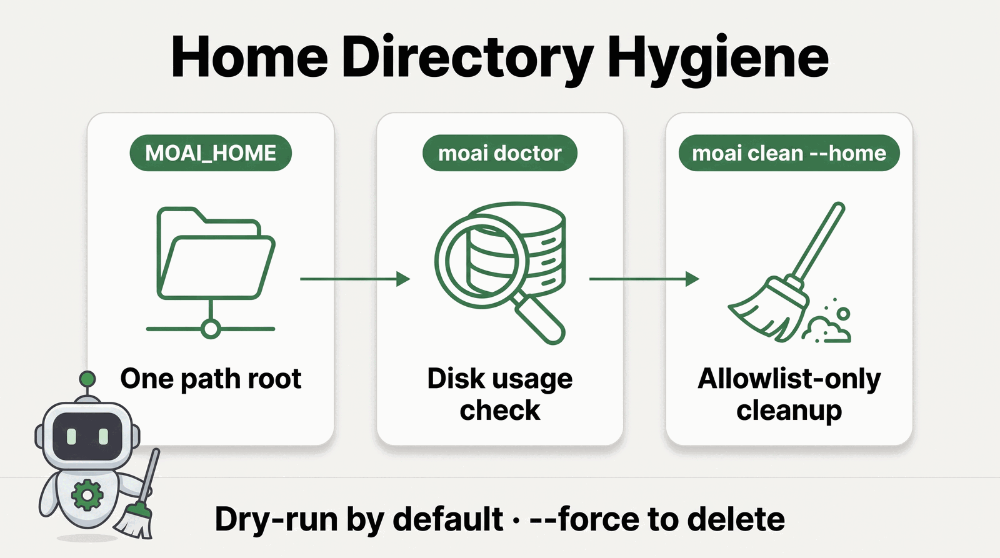
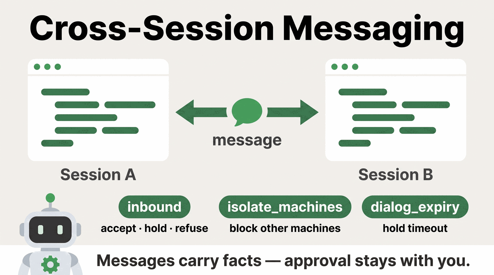
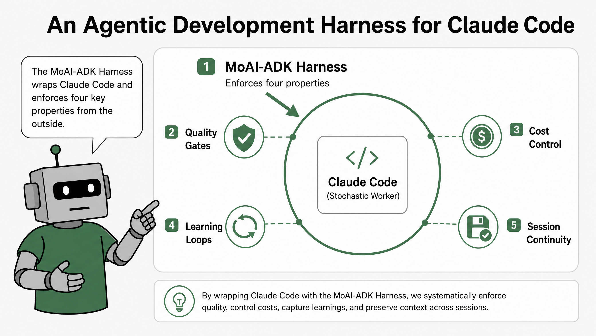
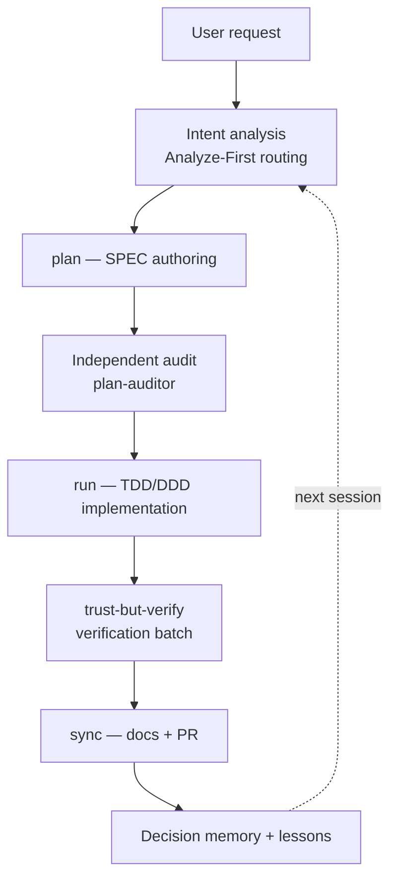
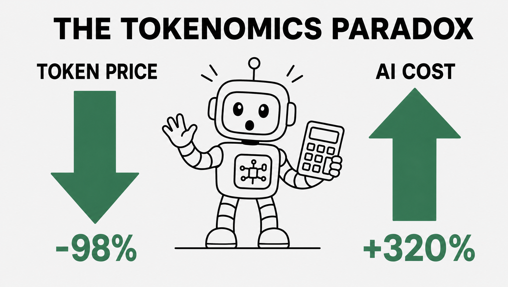
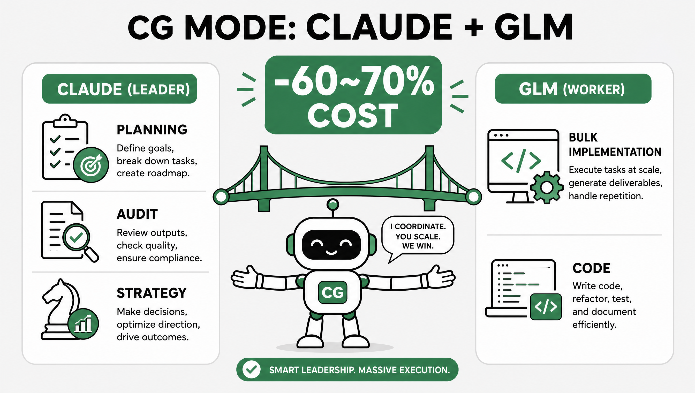
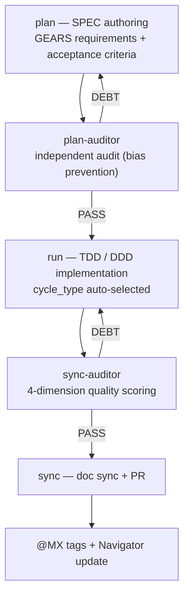
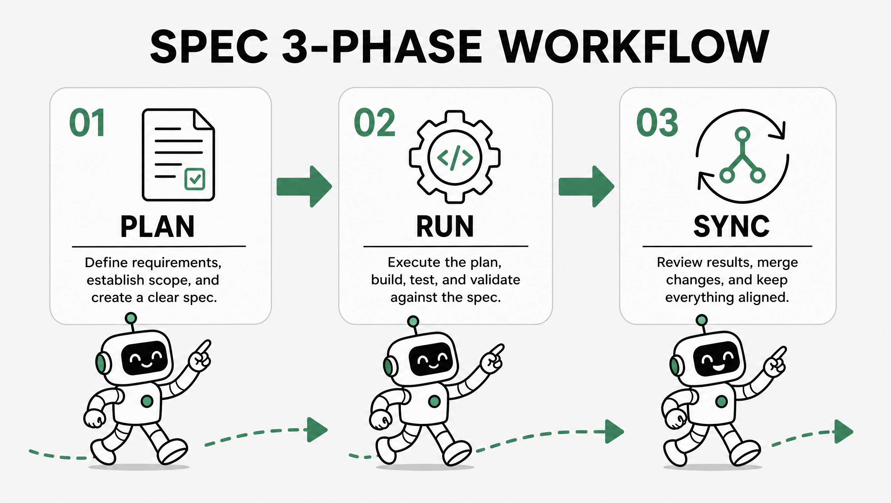
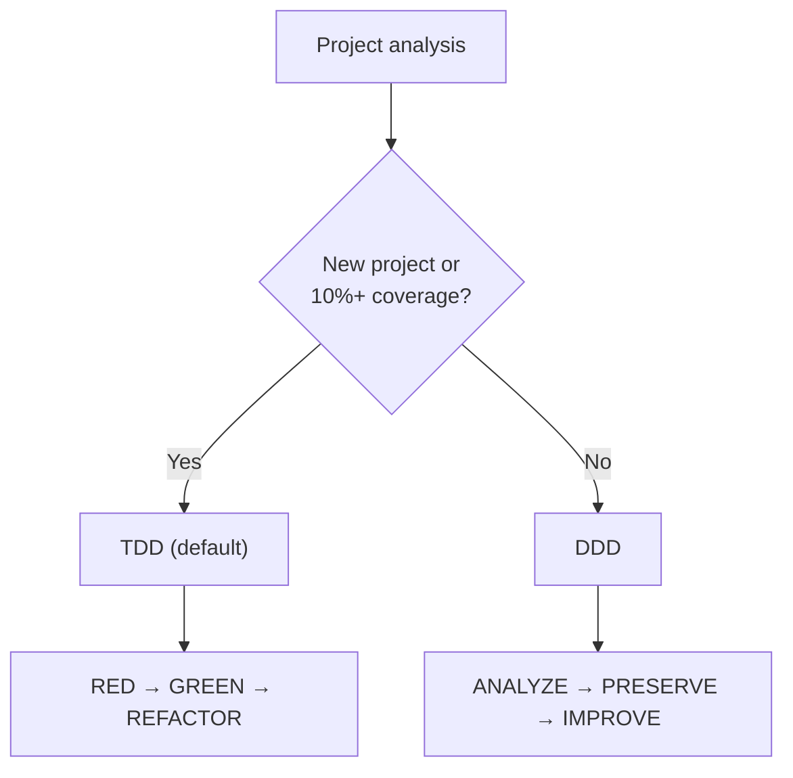
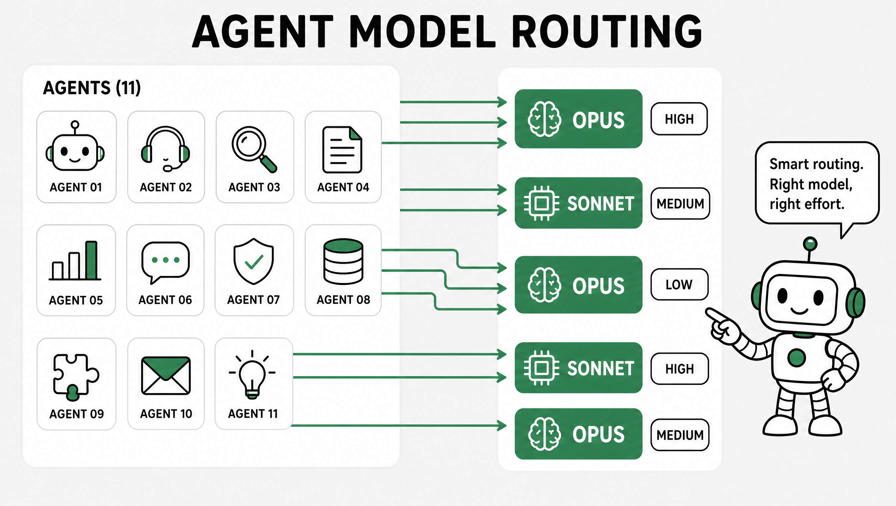

<p align="center">
  
</p>

<h1 align="center">MoAI-ADK</h1>

<p align="center">
  <strong>A verification-driven agent orchestration harness — the structure that makes Claude Code's code trustworthy</strong>
</p>

<p align="center">
  English ·
  <a href="./README.ko.md">한국어</a> ·
  <a href="./README.ja.md">日本語</a> ·
  <a href="./README.zh.md">中文</a>
</p>

<p align="center">
  <a href="https://github.com/modu-ai/moai-adk/actions/workflows/ci.yml"></a>
  <a href="https://github.com/modu-ai/moai-adk/actions/workflows/codeql.yml"></a>
  <a href="https://codecov.io/gh/modu-ai/moai-adk"></a>
  <br>
  <a href="https://go.dev/"></a>
  <a href="https://github.com/modu-ai/moai-adk/releases"></a>
  <a href="./LICENSE"></a>
</p>

<p align="center">
  <a href="https://adk.mo.ai.kr"><strong>Official Documentation</strong></a> ·
  <a href="https://adk.mo.ai.kr/book">Book: Practical Agentic Coding with Claude Code</a> ·
  <a href="https://discord.gg/Z7E7Mdc5aN">Discord</a>
</p>

---

> **"The model is a stochastic worker moving token by token. It cannot remember, turn to turn, what it used this turn and how much, whether the result is good, or how far the last session got. A harness enforces all three from the outside."**

---

## What's New in v3.1 — Kanban Mode

> v3.1 ships on August 15, Liberation Day in Korea. The intent: release work from the old shape of a single session bound to one context limit. The limit itself does not disappear — what actually changes is written down below.

A session holds one context window, and a long SPEC fills it. Everything that comes after carries everything that came before: the plan you no longer need is still in the window while you review, and the review is still there while you write docs. The usual escape is `/clear`, which throws away the thread along with the ballast.

Kanban Mode splits one unit of work across **four terminals instead of one**. A lead session drives the chain; three companion sessions each own a single column — `plan`, `run`, `sync` — and carry **only that column's context**. Review is not a separate column: the sync gate absorbs it, running the review lenses itself to reach the verdict. Nothing is uncapped: each session still has its own limit. What changes is that no session carries three phases' worth of history, so the same budget goes considerably further, and a finished phase is cleared without losing the card.

<p align="center">
  
</p>

Each column can run a different backend and effort level. The run above puts Plan on Opus 5 at high effort, Run on GLM 5.2 at xhigh, and Sync on GLM 5.2 — the depth of reasoning a column needs is not the same in every column.

### Getting started

```bash
moai cc -k                    # lead — announces a run-id, seeds the chain
moai cc -k --name plan        # companion, in its own terminal
moai cc -k --name run
moai cc -k --name sync
```

Companion sessions are launched **by hand, one per terminal** — a session never spawns a peer. Companions are named by their bare role: the run-id stays the lead session's identifier and never rides a companion name; a second live session claiming the same role takes the next free number. Swap `moai cc` for `moai glm` on any column to put just that column on the GLM backend.

### Which backend goes where

When you open a kanban run, the bootstrap notice carries a default recommendation — token availability first: lead on `moai glm -k`, plan on `moai cc -k --name plan`, run on `moai glm -k --name run`, sync on `moai cc -k --name sync`. The reasoning is the kind of thinking each lane needs. Plan and sync turn on judgment and review, so they sit on Claude; run is implementation-heavy, so GLM keeps its cost down. The lead is not the seat that renders verdicts — it watches the queue and moves cards — so GLM, cheap to keep waiting, fits it. When a Claude verdict is needed under a GLM lead, escape through a session named `judge` — the only route by which the GLM lead uses Claude. When one account starts hitting 429s, spreading lanes across accounts is the workable move. This mix is only the default — a different combination, or unifying every session on one backend, is equally fine.

### Factory Mode — many cards at once across N lanes

`-f` opens a factory lead, Kanban's second form. Where a kanban card hops between columns, a factory card goes **whole to one lane**, and that lane carries it through `plan → run → sync` serially in-session, each phase spawned as `Agent()` subagents. Lanes are labelled `lane-1` … `lane-N`.

```bash
moai cc -f                    # lead — one lane (lane-1) by default
moai cc -f 4                  # lead — four lanes
moai cc -f lane-1             # a lane, in its own terminal
moai glm -f lane-3            # …and one lane on the GLM backend
```

Grow a run one lane at a time with `moai cc -f lane-<n>`. That form already names the lane, so passing `--name`/`-n` alongside it is an error. A number is skipped only while a live session holds it — a dead lane's number is released and reused. Which numbers are held is recorded in `.moai/state/factory/workers.json`, and that is where stale claims get cleared. A lane runs up to 10 concurrent `Agent()` subagents, and write-capable spawns are isolated in their own worktree. Never bring every lane up at once — start the first, confirm it is actually producing output, then activate the rest. Cards are never split across lanes. `-k` still drives the three-role kanban chain; one launch takes one entry token, so `-k` with `-f` is an error, and `moai cg` refuses factory mode.

> Details: [Kanban mode — Factory Mode](https://adk.mo.ai.kr/en/advanced/kanban-mode)

The board has five columns, `backlog → plan → run → sync → done`. `backlog` has no owning session by design, so work enters the board only when you put it there:

```text
/moai todo "fix the stale rename hint"   # append a card
/moai todo                               # list the queue
```

Two rules keep the board honest. The lead advances a card **only on evidence it read** from the card's `progress.md` — never on a companion's reply, because a reply is a claim and inter-session delivery is not guaranteed. And when a phase ends, the lead asks for that session to be `/clear`-ed, since `/clear` is user-typed and cannot be sent as an instruction.

### Words the four sessions share

The recurring vocabulary of the kanban docs, gathered into one picture. A **column** is a stage of the board; a **lane** is the pair of a session and its worktree that carries one card through those stages to the end — the difference between a stop and a route.

```text
Operator ── /moai todo ──▶ backlog ─▶ plan ─▶ run ─▶ sync ─▶ done
                          (the lead advances a card only on evidence it read)

Lane — card t0:  run session + worktree t0      ┐ the two flows share one board,
Lane — card t1:  run session + worktree t1      ┘ run side by side, never mix
```

| Term | One-line definition |
|---|---|
| card | One unit of work. Enters via `/moai todo`, addressed by a short id |
| column | One stage of the board — five columns in fixed order |
| backlog | The entrance queue. No owning session, so only a human can add work |
| lane | The session+worktree pair that carries one card to the end. One parallel work stream |
| lead | The coordinating session. Advances cards only on evidence it read; never writes code itself |
| companion | The session seated in a column doing the work. Launched by hand, one per terminal |
| run-id | Short identifier the lead announces at start. It names the lead session; companions never carry it |
| worktree | The card's isolated checkout. The directory carries the card id; the branch carries what the card did (`WT-<slug>`). One carries the card from run through sync |
| dispatch | The instruction the lead sends a companion — a pointer to the work, never a copy |

Full glossary with definitions and examples: [Kanban board terms](https://adk.mo.ai.kr/en/core-concepts/kanban-board-terms)

### Watching the board

`moai web` serves a local console. The Kanban screen shows the kanban chain alongside the SPEC pipeline, plus Overview, Specs, Monitor, and Settings screens.

<p align="center">
  
</p>

Full guide: [Kanban Mode](https://adk.mo.ai.kr/en/advanced/kanban-mode) · [manager-lead Lead Coordinator](https://adk.mo.ai.kr/en/advanced/manager-lead) · [`/moai todo`](https://adk.mo.ai.kr/en/utility-commands/moai-todo)

### What v3.1.1 adds

Kanban Mode aside, here is what else landed in v3.1.1. Each one is covered in full in its own section further down.

**Home directory hygiene.** The longer you use it, the more leftovers from past runs pile up in `~/.moai`. `moai clean --home` clears them out, staying inside an allowlist — it is a dry run by default, so it shows you what would go before anything goes, and actual deletion needs `--force`. How old something has to be before it is swept is set by `state.home_retention_days` (30 days by default, `0` turns it off). To see how far the directory has grown right now, `moai doctor` reports it under Home Disk Usage. The home path itself can be moved with the `MOAI_HOME` environment variable — it takes absolute paths only. Only Go processes read it, though: move the path and the statusline and the shell hooks still look under `$HOME/.moai`. Shell-side credentials like `.env.glm` and the statusline's data stay behind, and your state quietly splits in two.

<p align="center">
  
</p>

**Cross-session messaging settings.** Whether a message from another Claude Code session arrives directly, waits for approval, or is refused outright is decided in `crosssession.yaml`. The switch that requires approval before a message leaves this machine lives there too.

<p align="center">
  
</p>

**Statusline GitLab support.** `statusline.forge` picks whether open work is counted on GitHub or on GitLab. Left empty, it decides from the origin remote's host.

**A bare `/loop` becomes the kanban foreman.** Typing `/loop` with no arguments starts a cycle that watches the backlog queue, dispatches the next card the operator has already marked `picked` to an isolated worker, confirms completion from evidence it read rather than from a claim, and reports. Nobody is watching that seat, so both putting cards in the queue and picking them stay the operator's job — the foreman never picks, it only carries.

---

## Why moai-adk?

The age of agents writing code has arrived, but you cannot take an agent's output on faith. Whether "the tests passed" is the result of actually running the tests or just the agent's guess has been the central problem from the start. moai-adk begins exactly there — it **bans unverified completion claims at the system level** and binds every completion claim to the command actually run and its output as evidence.

moai-adk is a harness that wraps Claude Code from the outside. It does not replace Claude Code; it takes over, in structure, the parts you used to manage by hand — which model to use, how deeply to reason, how to verify results, how to resume when a session breaks, how to keep parallel runs from stepping on each other. Verification integrity, the SPEC lifecycle, autonomous execution with real boundaries, a living codebase navigator, a self-improvement loop, and parallel-safe structure. These six form the identity of moai-adk.

<p align="center">
  
</p>

This identity organizes into three keys: **cost** (tokenomics — the same quality for fewer tokens), **self-improvement** (agentic loop engineering — turning observation into rules so the harness gets better as it runs), and **quality control** (the SPEC lifecycle, TRUST 5 gates, and isolation that prevents rework). No one of them suffices alone — below, why each needs the others.

### Eight differentiators

| Differentiator | What it means |
|---|---|
| **No false verification** | A claim that "tests pass" is always bound to the command actually run and its output. The system forbids presenting an unrun check as a success — verification-claim integrity is bound into every agent and orchestrator surface. |
| **Autonomy with real boundaries** | Declare a completion condition with `/moai goal` and the session works on its own until it holds. Four hard boundaries are attached — a turn limit (default 30), a stagnation guard, a wall-clock budget, and pre-approval gates — so it cannot fall into an infinite loop. |
| **Parallel-safe** | Every SPEC gets its own working tree, a branch-state guard blocks accidental branch switches in the primary checkout, and the gap against the remote is checked before spawning write agents. Two write-capable agents never run at the same time. |
| **Long-horizon continuity** | Work survives `/clear`. Progress stays in `progress.md`, handoff messages in memory, routing decisions in decision memory. The next session starts from what the last one learned, not from bare ground. |
| **Cost-efficient** | Models and reasoning depth are assigned declaratively, matched to work phase and SPEC size. CG mode (Claude leader + GLM workers) cuts 60–70% of cost on implementation-heavy work. Prompt caches are reused and long output is spilled to disk to keep the context light. |
| **Equal support for 16 programming languages** | Go, Python, TypeScript, JavaScript, Rust, Java, Kotlin, C#, Ruby, PHP, Elixir, C++, Scala, R, Flutter, Swift — sixteen programming languages handled as one set via marker-based auto-detection. None receives preferential treatment. |
| **Self-improving** | Recurring failure patterns observed in the wild rise as proposed rule changes. Nothing is applied silently — approval comes first. Routing decisions and gate evidence accumulate in decision memory as material for the next run. |
| **Native-language friendly** | Korean, Japanese, Chinese, and English locales are maintained in the same PR, translationese is banned, and each language gets its own native prose. Users are never forced into English. |

### What's different

| | Claude Code alone | Typical harness | **moai-adk** |
|---|---|---|---|
| Evidence binding of completion claims | You check by hand | Usually absent | Enforced by the system (5-section evidence report format) |
| SPEC lifecycle | None | Limited | plan→run→sync 3-phase + Tier S/M/L |
| Hard boundaries on autonomous loops | N/A | Usually a turn cap only | Turn limit + stagnation guard + wall clock + approval gate |
| Parallel work isolation | Manual | Limited | worktree + branch guard + pre-spawn sync check |
| Session continuity | Broken by `/clear` | Limited | handoff + memory + progress files |
| Equal treatment of 16 programming languages | N/A | N/A | marker auto-detection + per-language toolchains |
| Self-improvement loop | None | Limited | failure observation → rule promotion (approval-gated) |


```mermaid
flowchart TD
    User["User request"] --> Analyze["Intent analysis<br/>Analyze-First routing"]
    Analyze --> Plan["plan — SPEC authoring"]
    Plan --> Audit["Independent audit<br/>plan-auditor"]
    Audit --> Run["run — TDD/DDD implementation"]
    Run --> Verify["trust-but-verify<br/>verification batch"]
    Verify --> Sync["sync — docs + PR"]
    Sync --> Learn["Decision memory + lessons"]
    Learn -.next session.-> Analyze
```

### The three keys hold each other up

Push the cost key alone and quality silently erodes — rework and debug loops follow, and rework is the most expensive token spend of all. Build quality gates with no learning loop and the same mistakes recur every session. Run an autonomous loop with no cost ceiling and a single runaway task drains the quota. The three keys hold each other up — **cost stays economical because quality prevents rework, quality stays enforceable because the loop captures what worked, and the loop stays affordable because cost gates stop it before overage.**

Every design decision serves one of these three keys. Which model to use, how deeply to reason, how to spend context — none of it is left to chance turn by turn. The system decides, and records the decision so the next run is smarter.

<p align="center">
  
</p>

### Cost is determined by assignment, not unit price

Token prices fell **98% over three years** (Linux Foundation), yet enterprise AI spend rose **320%** in the same window. Volume growth overwhelmed the price drop. Agents spin through dozens to hundreds of steps to solve a single task, burning tokens proportionally. In usage-based pricing this becomes the invoice; in subscription, it eats the weekly quota shared by every model.

Uber deployed Claude Code to 5,000 engineers and **burned through a year of coding budget in four months**, then imposed monthly token limits. Meta, Amazon, and Microsoft each walked back unlimited-AI policies. **Tokenomics** — matching the model to the task to raise token efficiency — became the tech industry's new baseline.

Traditional cost control was built for rising unit prices, so it is helpless against this paradox: prices falling while total spend climbs. The bottleneck is not unit price but volume — more precisely, the step count an agent spins before finishing.

The DeepSWE leaderboard (113 tasks, per-effort view) demonstrates this. Within the same Claude family, per-task cost tracks how efficiently a model *finishes* — not what a token costs.

| Model [effort] | Score | Per-task cost | Note |
|---|---|---|---|
| opus-5 [low] | 58%±2 | **$1.66** | |
| opus-5 [medium] | **69%±1** | **$3.29** | **value-for-money knee** |
| opus-5 [high] | 73%±2 | $6.08 | +4pt score, 1.8× cost |
| opus-5 [xhigh] | 73%±3 | $9.07 | **net loss** — ties high, +49% cost only |
| opus-5 [max] | 74%±4 | $11.84 | |
| glm-5.2 [max] | 44%±2 | $3.92 | API-metered disadvantage · valuable under z.ai flat-fee |
| sonnet-5 [max] | 54%±4 | $26.40 | Pareto-dominated by opus-5 [low] |

Opus 5 at its **lowest** effort scores higher than Sonnet 5 at its **highest** (58% vs 54%) while costing one-sixteenth as much per task ($1.66 vs $26.40) — even though Sonnet's per-token price is lower. The cause is 268 steps against 36: retry loops, not token rates, write the invoice. Cost is determined by **assigning the right model and reasoning depth to each task**, not by unit price.

<p align="center">
  
</p>


> Source: [DeepSWE v1.1 leaderboard](https://deepswe.datacurve.ai) (datacurve.ai, 113 tasks, 2026-07-25)

---

## Quick Start

### Install

#### macOS / Linux / WSL

```bash
curl -fsSL https://adk.mo.ai.kr/install.sh | bash
```

#### Windows (PowerShell 7.x+)

```powershell
irm https://adk.mo.ai.kr/install.ps1 | iex
```

#### Build from source (Go 1.26+)

```bash
git clone https://github.com/modu-ai/moai-adk.git
cd moai-adk && make build
```

Already installed? Run `moai update` to move to the latest version. From v3.1.1, before `moai update` wipes a template-managed directory and redeploys it, it first moves any unmanaged file sitting inside to `.moai-backups/<timestamp>/pre-clean/`. If that backup fails it stops right there instead of going on to delete — a file you put there yourself is not quietly swept away by a redeploy.

> 💡 **To cut costs — z.ai GLM recommended**: signing up via [this link](https://z.ai/subscribe?ic=1NDV03BGWU) grants bonus tokens. The link is also a way to sponsor moai-adk open-source development. Free models (GLM-4.7-Flash, GLM-4.5-Flash) exist too — see the [z.ai pricing](https://docs.z.ai/guides/overview/pricing).

### Project initialization

```bash
moai init my-project
cd my-project
```

The interactive wizard auto-detects language, framework, and methodology, walks you through model policy, and generates the Claude Code integration files.

### First workflow

```bash
claude        # or moai cc — run Claude Code inside the project
```

```text
/moai plan "Add JWT login"      # author a SPEC
/moai run SPEC-AUTH-001         # TDD/DDD implementation
/moai sync SPEC-AUTH-001        # sync docs + create PR
```

Natural language works too. `/moai "fix the login bug"` triggers intent analysis (Analyze-First routing) to read the request and route to the appropriate workflow.

### Requirements

| Platform | Supported environments | Notes |
|---|---|---|
| macOS | Terminal, iTerm2 | Full support |
| Linux | Bash, Zsh | Full support |
| Windows | **WSL (recommended)**, PowerShell 7.x+ | Native cmd.exe unsupported |

- **Git** — required on all platforms
- **Claude Code** — moai-adk is a harness for Claude Code
- **Recommended**: `gh` CLI (PR automation), `tmux` (CG mode), your language's lint/test toolchain (e.g. `golangci-lint`)

---

## Core Capabilities

### One entry point: `/moai`

Natural language and 16 subcommands feed the same pipeline. `/moai plan`, `/moai run`, `/moai sync` are the backbone of the SPEC pipeline; `goal`, `loop`, `fix`, `review`, `gate`, `clean`, `codemaps`, `e2e`, `mx`, `feedback`, `project`, `harness`, and `todo` fill out the surroundings.

> Four retired subcommands — `design` · `brain` · `coverage` · `security`. What `security` did is now covered by the `moai-ref-owasp-checklist` + `moai-ref-llm-security` skills.

### MCP server

`moai init` provisions exactly **one** active MCP entry by default — the self-hosted `moai mcp-server` (a local stdio server). It exposes 21 MoAI tools in six groups to Claude Code. Four documented-but-disabled entries (`context7`, `chrome-devtools`, `playwright`, `ast-grep`) are activated via `moai mcp add <name>`. The `moai mcp add|remove|list` CLI manages entries via an atomic-RWM seam — users never hand-edit `.mcp.json`.

| Group | Tools | Purpose |
|-------|-------|---------|
| SPEC lifecycle | `spec_progress`, `spec_audit`, `spec_drift` | Era classification + drift detection |
| Verification | `verify_snapshot`, `verify_trend` | Per-key evidence snapshots |
| Goal + session | `goal_arm`, `goal_status`, `session_list` | Autonomous loop + multi-session coordination |
| Cross-model audit | `audit_multi`, `codex_audit`, `glm_audit`, `audit_cache` | Multi-auditor convergence |
| Codex delegation | `codex_task`, `codex_setup`, `codex_job_*` | Background cross-model jobs |
| GLM delegation | `glm_task`, `glm_job_status`, `glm_job_result`, `glm_job_cancel` | GLM (z.ai) background job delegation |

All backends are fail-open — GLM (`~/.moai/.env.glm`) and codex (`~/.codex/auth.json`) are optional; an unavailable backend returns `inconclusive`, never a hard error.

In the dual harness (`moai init --agent codex|both`), Codex supports only built-in identifier arrays for its status line (`tui.status_line`), so MoAI-specific items (goal, todo, SPEC state) cannot be displayed — a limitation until openai/codex#17827 lands command-backed status lines.

> Details: [MCP Server Guide](https://adk.mo.ai.kr/en/guides/mcp-server) · [Claude Code MCP](https://adk.mo.ai.kr/en/claude-code/extensibility/mcp)

### Goal engine — an autonomous loop with real boundaries

Declare a completion condition and the session works on its own until it holds. A turn limit, a stagnation guard, a wall-clock budget, and pre-approval gates are attached, so it cannot fall into an infinite loop. Mechanical conditions (a command's exit code) and model conditions (a claim in the transcript) are both supported. `--max-turns 0` arms an auto-compact-driven infinite goal — in that case `--max-duration` and the stagnation guard provide the boundary.

### Parallel worktrees

Every SPEC gets its own working tree. Enter with `moai cc -w <name>`; add `--spawn` to open it in a new window while keeping the current session. A branch-state guard blocks accidental branch switches in the primary checkout.

### Kanban mode

`--kanban` (short `-k`) is a session-launcher switch — under the lead session's coordination it drives a single SPEC through `plan → run → sync` with multi-session board coordination. The board's backbone is the **Origin-Trail Chain**: an append-only JSONL lineage tree that tracks worktree ancestry, solves depth amnesia (root-to-leaf chain recovery after `/clear`), and detects dead leader sessions via heartbeat staleness.

| Concept | What it does |
|---------|-------------|
| Origin-Trail Chain | Append-only JSONL event stream at `.moai/state/chain/events.jsonl` |
| WorktreeNode (13 fields) | Per-session state: ID, parent, depth, origin chain, milestone, resume target |
| CWD-collision resolution | `(worktree_path, session_id)` pair disambiguates reused paths |
| Depth ceiling | Caps nesting complexity |

> **Available now**: `moai cc -k` (or `moai glm -k`) starts the lead and `-k --name <role>` joins each companion — launched by hand, one per terminal. `moai chain <status|lineage|back|list|prune>` reads the lineage, and `moai todo` (bare invocation lists the queue; subcommands `add` · `list` · `next` · `done` · `unpick` · `drop` · `undrop` · `edit` · `move`; two or more words become a new card) operates the `backlog` column. The launch sequence is in the "What's New in v3.1 — Kanban Mode" section above.

> Details: [Kanban Mode Guide](https://adk.mo.ai.kr/en/advanced/kanban-mode)

### CG mode — Claude leader + GLM workers

Claude owns strategy, planning, and audits; GLM carries bulk implementation. The two are wired through tmux session-level environment isolation, cutting 60–70% of cost on implementation-heavy work.

<p align="center">
  
</p>

### Equal support for 16 programming languages

Go, Python, TypeScript, JavaScript, Rust, Java, Kotlin, C#, Ruby, PHP, Elixir, C++, Scala, R, Flutter, Swift. Marker-based auto-detection runs each language's standard lint/format/test toolchain.

### Automated quality gates

TRUST 5 (Tested · Readable · Unified · Secured · Trackable) applies to every change. `/moai gate` runs lint + format + type + tests in one pass, and sync-auditor scores across four dimensions: functionality, security, craft, and consistency.

### @MX tags

Inline code annotations that let AI agents exchange context, invariants, and danger zones. Only high-fan-in, complex, or dangerous code gets marked.

### Navigator — a living codebase map

`@NAV:DEC`, `@NAV:SYM`, and `@MX:SPEC` bind into one addressable graph (`nav-graph.json`). Design decisions, SPECs, and code symbols link in both directions — fix the code and the decision's context follows.

### Session handoff

Work survives `/clear`. A 6-block paste-ready resume message carries progress into the next session; in auto-inject mode, one message resumes the session.

### loop / fix — error-driven development

`/moai loop` sweeps LSP diagnostics, AST-grep, and linters in parallel, buckets issues by level, and runs until the queue drains. `/moai fix` is the single-pass variant.

### review --deep

`/moai review --deep` runs a multi-agent adversarial vulnerability scan, backed by OWASP · LLM-security · supply-chain · DevSecOps reference skills.

### 4-locale documentation

Korean, Japanese, Chinese, and English docs are maintained in the same PR. Translationese is banned, each language gets native prose, and a 4-locale parity check is bound into the build gate.

### moai web console

<p align="center">
  
</p>

`moai web` opens a console bound to localhost. Five screens — Overview, Kanban, Specs, Monitor, Settings; the settings screen splits into eleven tabs: Identity, Language, LLM, 3rd Party LLM, Workflow, Git & Worktree, Audit, Agents, Report, MCP, Cross-Session. Profile create/rename/delete lives on the same screen.

### ref / domain skills

Eleven ref skills (`moai-ref-api-patterns`, `moai-ref-owasp-checklist`, `moai-ref-llm-security`, `moai-ref-react-patterns`, `moai-ref-testing-pyramid`, `moai-ref-ui-polish`, `moai-ref-secops`, `moai-ref-supply-chain`, `moai-ref-seo`, `moai-ref-git-workflow`, `moai-ref-cross-model-audit`) and seven domain skills (`moai-domain-backend`, `moai-domain-frontend`, `moai-domain-database`, `moai-domain-design-dna`, `moai-domain-html-report`, `moai-domain-humanize`, `moai-domain-svg-infographic`) inject field knowledge into agents.

### Cross-platform

A single Go binary with no extra dependencies, running on macOS, Linux, and Windows. The hook system enforces gates mechanically, and the statusline surfaces cost and context in real time.

---

## How It Works

### The SPEC 3-phase lifecycle

All work flows through plan → run → sync. Tier S/M/L size classification determines verification depth and PR routing. GEARS-format requirements and acceptance criteria judge completion by evidence.


```mermaid
flowchart TD
    P["plan — SPEC authoring<br/>GEARS requirements + acceptance criteria"] --> PA["plan-auditor<br/>independent audit (bias prevention)"]
    PA -->|PASS| R["run — TDD / DDD implementation<br/>cycle_type auto-selected"]
    PA -->|DEBT| P
    R --> SA["sync-auditor<br/>4-dimension quality scoring"]
    SA -->|PASS| S["sync — doc sync + PR"]
    SA -->|DEBT| R
    S --> MX["@MX tags + Navigator update"]
```

<p align="center">
  
</p>

Project state picks the methodology. `moai init` reads coverage and chooses automatically.


```mermaid
flowchart TD
    A["Project analysis"] --> B{"New project or<br/>10%+ coverage?"}
    B -->|"Yes"| C["TDD (default)"]
    B -->|"No"| D["DDD"]
    C --> F["RED → GREEN → REFACTOR"]
    D --> G["ANALYZE → PRESERVE → IMPROVE"]
```

| Methodology | Cycle | Target |
|-------------|-------|-----|
| **TDD** (default) | RED → GREEN → REFACTOR | New projects and feature work |
| **DDD** | ANALYZE → PRESERVE → IMPROVE | Existing code under 10% coverage |

### The 12-agent catalog

| Category | Agent | Cost | Role |
|----------|-------|------|------|
| **Manager** | manager-spec | 🔴 | Plan-phase SPEC authoring |
| | manager-develop | 🔴 | Run-phase TDD/DDD/autofix implementation |
| | manager-docs | 🔵 | Sync-phase documentation |
| | manager-git | 🩵 | PR creation and routing |
| | manager-design | 🟠 | Design-phase collaboration (Claude Design) |
| | manager-lead | 🔴 | Hierarchical-team Tier L coordination + kanban/factory lead-session dispatch (sole Agent-carrier, depth-2 sealed) |
| **Evaluator** | plan-auditor | 🔴 | Independent plan audit (bias prevention) |
| | sync-auditor | 🔴 | 4-dimensional quality scoring (Functionality 40 · Security 25 · Craft 20 · Consistency 15) |
| **Builder** | builder-harness | 🟠 | Project-specific agents, skills, commands, hooks scaffolding |
| **Advisor** | super-advisor | 🔵 | On-demand high-reasoning consultation (E1-E4 escalation) |
| **Specialist** | e2e-tester | 🟠 | Web/mobile/desktop E2E test execution (CLI-first) |
| **Built-in** | Explore | ⚪ | Read-only codebase exploration |

Cost colors follow the default `medium` profile's model×effort cells (inspect via `moai model profile`): 🔴 opus+high · 🟠 opus+medium · 🔵 opus+low · 🩵 sonnet+low · ⚪ session-model inherit (user-added agents). Assignments shift when switching profiles (`high`/`low`). Authoring and auditing are separated from the start, so the writing side never grades its own work.

Eleven of the twelve are agents moai-adk built; `Explore` is a built-in that already ships with Claude Code. `Explore` carries no model of its own — it inherits the session model — so it has no profile cell. That is why the catalog counts 12 while the model profile section further down counts 11 × 3 = 33 cells: the two numbers are not in conflict, they count different things.

### trust-but-verify — binding evidence to completion claims

When an agent reports "tests passed", the orchestrator does not take the claim at face value; it runs its own verification batch. Seven read-only verifications (tests, coverage, subagent boundaries, sentinel scans, CLI smoke, benchmarks, lint) run in parallel in a single turn, leaving each one's exit code and output as evidence.

The verification-claim integrity rule backs this flow — you must not present an unrun check as a success, must not pass off a previously measured value as a fresh measurement, and must not wave through what was never observed. The 5-section report format (Claim · Evidence · Baseline attribution · Gaps · Residual risk) binds every completion report from every agent and orchestrator.

### Trim verification cost, stop before overage

Verification is necessary; verification output sitting in context is not. Verbose output spills to disk files, leaving only the exit code and a bounded tail (max 50 lines) in context. Prompt-cache reuse (cached reads cost 0.1×) keeps the window light, and a context-diet `/clear` strategy issues recommendations at the thresholds (1M 50% / 200K 90%).

On the budget side, a token circuit breaker stands guard — it aborts at the hard limit (default 90%), saves progress to `progress.md`, and issues a paste-ready resume message. The statusline keeps context usage, cache hit rate, and rate-limit depletion visible at all times, so an overage never passes unnoticed.

### Reading the statusline

```
🤖 Opus | 🧠 xhigh·t | ♻️ 87% | 🔅 v2.1.212 | 🗿 v3.1.2 | ⏳ 2h 34m | 💬 MoAI
🪫 CW: ████████░░ 88% (⚠️/clear) | 🔋 5H: ████░░░░░░ 45% (4h 30m) | 🪫 7D: ████████░░ 82% (Jan 21)
📁 moai-adk-go | 📡 modu-ai/moai-adk, 7/3 | 🅱️ [WT] release/v3.1.2 +3 | 💾 +1 M2 ?0 | 📋 [run SPEC-AUTH-001-run] | 💌 PR #1042 (⌥approved)
🏷️ run | 👤 manager-develop | 🔄 TODO: 1/3
```

| Element | Meaning |
|------|------|
| 🤖 Model | Current active model |
| 🧠 effort | Reasoning effort — `·t` suffix when extended reasoning is active |
| ♻️ Cache hit rate | Prompt cache hit rate |
| CW: Context | Context-window usage + 2-stage `/clear` markers (⚠️ soft, 🛑 hard) |
| 5H / 7D | Plan usage rate + reset time |
| 📁 Directory | Project directory name |
| 📡 Repo | GitHub repo `owner/name` + open issues/PRs pair (`, 7/3`, or `, -/-` when unreadable) |
| 🅱️ Branch | Current branch — `[WT]` marks a worktree, `+` is the dirty count (modified+staged+untracked) |
| 💾 git status | Staged `+` · modified `M` · untracked `?` counts — one 💾 icon in every state |
| 📋 Task | Active SPEC workflow `[command SPEC-ID-phase]` |
| 💌 PR | Active GitHub PR number + review state (`⌥state`) |
| 🏷️ Session line | Conditional last line — session name · 👤 agent · 🔄 `TODO: in progress/queued` backlog |

> Details: [Statusline Guide](https://adk.mo.ai.kr/en/advanced/statusline)

---

## Workflow Examples

### Build a new feature (TDD)

```text
/moai plan "Add user profile image upload"
/moai run SPEC-PROFILE-001
/moai sync SPEC-PROFILE-001
```

New code, or code with sufficient coverage, gets TDD (RED → GREEN → REFACTOR). `moai init` detects project state and picks between TDD and DDD.

### Run long jobs (goal)

```text
/moai plan "Refactor the payment module"
/moai run SPEC-PAY-001
/moai goal "go test ./... exits 0 && lint clean, or stop after 20 turns"
```

Declare the completion condition and the session works on its own until it holds. The turn limit defaults to 30 and the stagnation guard is attached. When context reaches the threshold (1M 50% / 200K 90%), it recommends `/clear` and saves progress to `progress.md`.

### Run in parallel (worktree)

```bash
moai cc -w feature-auth        # open the auth working tree
moai cc -w feature-billing --spawn   # billing in a new window, current session kept
```

```text
# inside the auth tree
/moai run SPEC-AUTH-001

# inside the billing tree
/moai run SPEC-BILL-001
```

Each SPEC gets its own working tree so two agents never step on each other. The branch-state guard blocks accidental branch switches in the primary checkout.

### Cut costs (CG mode)

```bash
moai glm sk-your-glm-api-key   # save the key once
moai cg                        # enter CG mode (Claude leader + GLM workers)
```

```text
/moai run SPEC-DATA-001        # implementation-heavy work → GLM workers carry the bulk
```

CG mode puts a Claude leader over strategy, planning, and audits while GLM workers carry bulk implementation — a 60–70% cost cut on implementation-heavy work. The harness, SPEC workflow, and quality gates behave identically across all three modes.

### Auto-fix bugs (loop)

```text
/moai loop
```

Sweeps LSP diagnostics, AST-grep, and linters in parallel, buckets issues by level, and runs until the queue drains. Single issues end in one `/moai fix` pass.

---

## Configuration and Profiles

### `.moai/config/sections/`

Project configuration splits into YAML section files. `moai init` lays down 33 sections in all; the six below are the ones you end up editing.

| Section | Role |
|---|---|
| `language.yaml` | User name · conversation language · code-comment language · commit-message language |
| `quality.yaml` | Quality gates · dev mode (TDD/DDD) · coverage |
| `harness.yaml` | Harness depth (minimal · standard · thorough) · auto-detection |
| `workflow.yaml` | Workflow behavior |
| `lsp.yaml` | LSP gate thresholds (SSOT) |
| `user.yaml` | User information |

v3.1.1 adds four more sections worth touching.

| Section | Role |
|---|---|
| `crosssession.yaml` | How cross-session messages are handled. `inbound` (empty, `accept`, `hold`, `refuse`), `isolate_machines` (whether a message leaving this machine needs approval), `dialog_expiry` (the deadline on the approval dialog for a held message) |
| `cache.yaml` | The prompt cache settings file. It holds `session_ttl` (`1h`, `5m`, `off`), `spec_ttl`, and the smallest chunk worth caching, and round-trips through the `moai web` settings editor. Nothing currently reads these values, so changing them does not change behavior |
| `state.yaml` | `home_retention_days` — how old something has to be before `moai clean --home` sweeps it. Read from the HOME tier only (`~/.moai/config/sections/state.yaml`); 30 days by default, and `0` turns home cleanup off |
| `statusline.yaml` | A `forge` key joins the existing theme and segment toggles. One of `github`, `gitlab`, or `none`, it decides which host the statusline counts open work on. Left empty it decides from the origin remote's host, so on a self-hosted instance write it in yourself |

`gate.yaml`'s `ast_grep_gate.rules_dir` is not a new key — it is a key whose **default changed**. What used to default to an empty string now defaults to `.moai/config/astgrep-rules`, and `moai init` / `moai update` lay the bundled ruleset down at that path. The fallback path on the code side is gone, so this key is now the only source of truth for where the ruleset lives — move the rules elsewhere and this value has to move with them, or the gate will not find them.

Environment variables override file values. For precedence details and the full section list, see the [CLI reference](https://adk.mo.ai.kr/en/cli-reference).

### Model profiles — high / medium / low

`moai model profile` resolves 11 agents × 3 profiles = 33 cells of `{model, effort}` pairs.

<p align="center">
  
</p>

| Profile | Character | When |
|---|---|---|
| **high** | Opus-heavy, deep reasoning | Complex planning · security audits · hard debugging |
| **medium** (default) | Balanced | Typical SPECs |
| **low** | Sonnet + low effort | Mechanical repetition · docs · one-shot work |

Assignment follows work phase (plan / run / sync) and SPEC size (Tier S / M / L) — deep-reasoning models for planning phases that need inference, lighter models for mechanical implementation phases. Under the No-Haiku 3-tier policy, single-shot input-dominated work goes to Sonnet low, and every multi-turn agentic task goes to Opus.

### settings.json / settings.local.json separation

| File | Role | Template |
|---|---|---|
| `.claude/settings.json` | Rendered from template — project-shared settings | Included |
| `.claude/settings.local.json` | Runtime-managed — per-machine values (tmux pane IDs · API tokens · absolute paths) | **Never included** |

`settings.local.json` is modified at runtime by `moai glm`, `moai cc`, and `moai cg`, and the SessionStart hook fills the environment. If accidentally committed, remove it with `git rm --cached .claude/settings.local.json`.

---

## Runs Anywhere

### Equal support for 16 programming languages

| | | | |
|---|---|---|---|
| Go | Python | TypeScript | JavaScript |
| Rust | Java | Kotlin | C# |
| Ruby | PHP | Elixir | C++ |
| Scala | R | Flutter | Swift |

Each language is auto-detected via project markers, and its standard lint/format/test toolchain runs. Missing tools are skipped quietly. The canonical Dart/Flutter name is "flutter". None receives preferential treatment.

### 4-locale documentation

| Locale | Site |
|---|---|
| 한국어 | adk.mo.ai.kr/ko |
| English | adk.mo.ai.kr/en |
| 日本語 | adk.mo.ai.kr/ja |
| 中文 | adk.mo.ai.kr/zh |

All four locales are maintained in the same PR, with a 4-locale parity check bound into the build gate. Translationese is banned; each language gets native prose.

### Operating systems

| Platform | Status |
|---|---|
| macOS | Full support (Terminal, iTerm2) |
| Linux | Full support (Bash, Zsh) |
| Windows | WSL recommended, PowerShell 7.x+ supported, native cmd.exe unsupported |

### Claude + GLM

z.ai GLM serves as an alternative backend for Claude Code. Switching is environment-variable only — the code stays the same. Three execution modes exist.

| Command | Leader | Workers | tmux | Cost saving |
|---|---|---|---|---|
| `moai cc` | Claude | Claude | not required | — |
| `moai glm` | GLM | GLM | recommended | ~70% |
| `moai cg` | Claude | GLM | **required** | ~60% |

The GLM Coding Plan starts at $10/month. glm-5.3, glm-4.7, glm-4.5-air, and free models (GLM-4.7-Flash, GLM-4.5-Flash) are available.

Each Claude tier maps to a GLM model through the `ANTHROPIC_DEFAULT_*_MODEL` environment variables:

| Claude tier | GLM model | Context |
|---|---|---|
| Opus | glm-5.3 | 1M |
| Sonnet | glm-5.3 | 1M |
| Haiku | glm-5.3 | 1M |
| Fable | glm-5.3 | 1M |

> Details: [Multi-LLM guide](https://adk.mo.ai.kr/en/multi-llm) · [z.ai pricing](https://docs.z.ai/guides/overview/pricing)

---

## Documentation and Learning

### Official documentation — adk.mo.ai.kr

The [adk.mo.ai.kr](https://adk.mo.ai.kr) online documentation is organized into 12 sections.

| Section | Description |
|---|---|
| [Getting Started](https://adk.mo.ai.kr/en/getting-started) | Introduction, installation, Windows guide, init wizard, quickstart, CLI overview, FAQ |
| [Core Concepts](https://adk.mo.ai.kr/en/core-concepts) | moai-adk identity, constitution, harness engineering, SPEC-based development, DDD, TRUST 5 |
| [Workflow Commands](https://adk.mo.ai.kr/en/workflow-commands) | `plan` · `run` · `sync` — SPEC pipeline backbone |
| [Utility Commands](https://adk.mo.ai.kr/en/utility-commands) | `fix` · `loop` · `gate` · `review` · `clean` · `codemaps` · `e2e` · `feedback` · `goal` · `todo` |
| [CLI Reference](https://adk.mo.ai.kr/en/cli-reference) | Every `moai` binary command (49 total) |
| [Claude Code Guide](https://adk.mo.ai.kr/en/claude-code) | Claude Code integration — basics, context·memory, agentic, extensibility |
| [Multi-LLM](https://adk.mo.ai.kr/en/multi-llm) | CG mode and model policy |
| [Cost Optimization](https://adk.mo.ai.kr/en/cost-optimization) | Prompt caching strategies and token cost reduction |
| [Guides](https://adk.mo.ai.kr/en/guides) | CI automation, multi-LLM CI, and other operational recipes |
| [Git Worktree](https://adk.mo.ai.kr/en/worktree) | Worktree guide for parallel SPEC development |
| [Advanced](https://adk.mo.ai.kr/en/advanced) | Tokenomics, token budget, statusline, settings.json, hooks, @MX tags, skill guide, Harness v4 Builder, self-evolution, decision memory |
| [Contributing](https://adk.mo.ai.kr/en/contributing) | Open-source contribution guide |

### Book

[**Practical Agentic Coding with Claude Code**](https://adk.mo.ai.kr/book) — a hands-on harness engineering guide by the moai-adk author. [book.mo.ai.kr](https://book.mo.ai.kr)

### CLI command table (17 frequently used)

| Command | Description |
|---|---|
| `moai init` | Interactive project setup (auto-detects language/framework/methodology) |
| `moai doctor` | System state diagnosis and environment verification — the Home Disk Usage check reports, as advice, how far `~/.moai` has grown |
| `moai status` | Project status summary (Git branch, quality metrics) |
| `moai update` | Update to latest version (pre-deletion backup · auto-rollback supported) |
| `moai graph <build\|query>` | Build/query the codebase graph (edges.jsonl) — caller lookup, blast radius, milestone cross-checks |
| `moai cc` / `moai glm` / `moai cg` | Claude-only / GLM-only / hybrid sessions |
| `moai codex <status\|cli\|app>` | Codex readiness readout and explicit CLI/app launch |
| `moai worktree <sync\|done\|remove\|clean\|recover\|snapshot\|verify\|restore>` | Git worktree maintenance (entering a worktree is the launchers' job) |
| `moai session <list\|register\|current>` | Multi-session coordination |
| `moai spec <audit\|archive\|lint\|list\|new>` | SPEC lifecycle tools |
| `moai goal <arm\|status\|clear>` | Goal engine CLI |
| `moai harness <status\|apply\|rollback\|disable>` | Harness learning lifecycle |
| `moai handoff <save\|list>` | Session handoff records |
| `moai preference <list\|decay-scan\|toggle>` | Decision memory management |
| `moai memory <doctor\|archive>` | Agent memory checks and archiving of stale entries |
| `moai tokens record` | Per-pool token usage ledger records |
| `moai clean [--home]` | Clear leftovers from past runs. With `--home` it sweeps `~/.moai` inside the allowlist. Dry run by default; `--force` to actually delete |
| `moai web` | Web console — 5 screens (Overview · Kanban · Specs · Monitor · Settings), 11-tab settings |

> All 49 commands: [CLI reference](https://adk.mo.ai.kr/en/cli-reference)

### ref / domain skills

**ref (field knowledge) — 11**: `moai-ref-api-patterns`, `moai-ref-owasp-checklist`, `moai-ref-llm-security`, `moai-ref-react-patterns`, `moai-ref-testing-pyramid`, `moai-ref-ui-polish`, `moai-ref-secops`, `moai-ref-supply-chain`, `moai-ref-seo`, `moai-ref-git-workflow`, `moai-ref-cross-model-audit`

**domain (specialist domains) — 7**: `moai-domain-backend`, `moai-domain-frontend`, `moai-domain-database`, `moai-domain-design-dna`, `moai-domain-html-report`, `moai-domain-humanize`, `moai-domain-svg-infographic`

`moai-domain-design-dna` is new in v3.1.1. Hand it one design to work from — a screenshot, a set of images, or a live URL — and it reverse-engineers a single Design DNA JSON covering the measurable values (color, spacing, corners, typography), the feel of that design, and its special rendering effects. Feed the JSON back in and it produces a new artifact carrying the same feel — a route that moves "make it look like this screen" across as values instead of as words.

### CHANGELOG

Recent changes live in [CHANGELOG.md](./CHANGELOG.md).

### Code quality requirements

Every contribution passes the TRUST 5 gate — 85%+ coverage · lint errors 0 · type errors 0 · Conventional commits. Existing code is fixed in behavior by characterization tests then improved incrementally (DDD); new code follows RED → GREEN → REFACTOR (TDD).

---

## FAQ

### Why doesn't every function have an @MX tag?

That's normal. Tags mark high-fan-in, complex, or dangerous code only. In any project, most code never crosses a tag threshold — a file without tags is not a defect.

### What does the statusline version display mean?

```
🗿 v3.1.1 -> 🗿 v3.1.2
```

The first value is the currently installed moai-adk version; the arrow indicates an available update. It disappears after `moai update`.

### Can I use Claude only, without GLM?

Yes. `moai cc` launches a Claude-only session. CG mode (`moai cg`, Claude leader + GLM workers) and GLM-only (`moai glm`) are cost-saving options; the harness, SPEC workflow, and quality gates behave identically across all three modes.

### Does it work on existing projects?

Yes. `moai init` detects project state and selects the methodology — DDD (characterization tests fix behavior, then incremental improvement) for existing code under 10% coverage, TDD for new or well-tested code.

---

## Contribute

### Contributing

Contributions are welcome anytime. Detailed procedures live in [CONTRIBUTING.md](CONTRIBUTING.md).

1. Fork the repository
2. Create a feature branch: `git checkout -b feature/my-feature`
3. Write tests — TDD for new code, characterization tests for existing code
4. Verify tests, lint, format pass: `make test` · `make lint` · `make fmt`
5. Commit with a Conventional commit message and open a pull request

**Code quality requirements**: 85%+ coverage · lint errors 0 · type errors 0 · Conventional commits

### Feedback

Inside Claude Code, `/moai feedback` files bug reports and feature requests straight to GitHub issues. From the terminal, use [GitHub Issues](https://github.com/modu-ai/moai-adk/issues).

### Community

- [Discord](https://discord.gg/Z7E7Mdc5aN) — live discussion and tips
- [GitHub Issues](https://github.com/modu-ai/moai-adk/issues) — bug reports · feature requests

### License

[Apache License 2.0](./LICENSE) — see the LICENSE file for details.

---

## Star History

<a href="https://www.star-history.com/?type=date&repos=modu-ai%2Fmoai-adk">
 <picture>
   <source media="(prefers-color-scheme: dark)" srcset="https://api.star-history.com/chart?repos=modu-ai/moai-adk&type=date&theme=dark&legend=top-left&sealed_token=9wFuBO5GMKxHZsaknxlIW3oypXLJlyW1qqq8T--aTRyfp6j9EK9KTR2vJvyAG8AKSs3Lindw7LUt-m-I6ysz9BoV6kdtrKlJYTViQAYR56A_3ie4ZVOqIw" />
   <source media="(prefers-color-scheme: light)" srcset="https://api.star-history.com/chart?repos=modu-ai/moai-adk&type=date&legend=top-left&sealed_token=9wFuBO5GMKxHZsaknxlIW3oypXLJlyW1qqq8T--aTRyfp6j9EK9KTR2vJvyAG8AKSs3Lindw7LUt-m-I6ysz9BoV6kdtrKlJYTViQAYR56A_3ie4ZVOqIw" />
   
 </picture>
</a>

<p align="center">
  <sub>Built by the MoAI-ADK team · <a href="https://adk.mo.ai.kr">adk.mo.ai.kr</a></sub>
</p>
