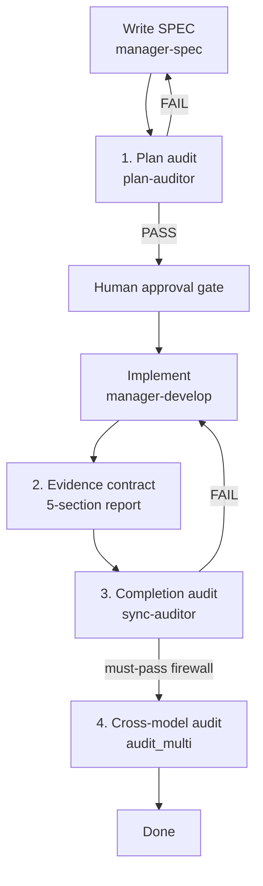

<p align="center">
  
</p>

<h1 align="center">MoAI-ADK</h1>

<p align="center">
  <strong>A Claude Code harness that separates the agent writing the code from the agent judging it</strong>
</p>

<p align="center">
  English ·
  <a href="./README.ko.md">한국어</a> ·
  <a href="./README.ja.md">日本語</a> ·
  <a href="./README.zh.md">中文</a>
</p>

<p align="center">
  <a href="https://book.mo.ai.kr" target="_blank"><strong>Official Book: Practical Agentic Coding with Claude Code</strong></a><br>
  A hands-on harness engineering guide by the MoAI-ADK author — <a href="https://book.mo.ai.kr" target="_blank">book.mo.ai.kr</a>
</p>

<p align="center">
  <a href="https://github.com/modu-ai/moai-adk/actions/workflows/ci.yml"></a>
  <a href="https://github.com/modu-ai/moai-adk/actions/workflows/codeql.yml"></a>
  <a href="https://codecov.io/gh/modu-ai/moai-adk"></a>
  <br>
  <a href="https://go.dev/"></a>
  <a href="https://github.com/modu-ai/moai-adk/releases"></a>
  <a href="./LICENSE"></a>
</p>

<p align="center">
  <a href="https://adk.mo.ai.kr/en"><strong>Documentation</strong></a> ·
  <a href="https://adk.mo.ai.kr/en/getting-started">Getting Started</a> ·
  <a href="https://adk.mo.ai.kr/book">Book</a>
</p>

---

> **"Getting an agent to write code is no longer the hard part. The hard part is who said the code was any good."**

---

## An agent grades its own paper

Hand an agent a feature and you get code back. You get tests too, and a closing line: "all tests pass."

That line is **a claim, not a fact.** The same actor wrote the code and decided the code was fine. It sat the exam and marked its own paper, and nobody reviewed the marking.

A second problem compounds the first. Language models lean structurally toward agreement. The rule MoAI-ADK applies to every auditor agent names that bias outright:

> Resist agreement: the RLHF training gradient biases toward flattery, so treat any urge to PASS without cited evidence as a sycophancy signal, not a verdict.
>
> — `.claude/rules/moai/core/agent-common-protocol.md`

Put self-grading and agreement bias together and the outcome is fixed: **reports of passing will always outnumber actual passes.**

Vibe coding buries the problem under speed. Output arrives fast enough that thin verification is hard to notice. MoAI-ADK goes the other way. It gives up some speed and **pulls the judge apart from the author.**

## Separate the author from the judge

Here is the part that is hard to argue with:

> **One agent's claim that it verified its own work is not verification, because no other party verified the claim.**

This is structural, not a question of model quality — which is why "our model is honest" is not an answer. A better model grades itself more accurately, but it is still grading itself. The problem survives every capability improvement until the judging party is a different party.

MoAI-ADK runs separate agents for writing the SPEC, implementing it, auditing the plan, and auditing the result. An auditor does not read the implementer's report. It runs the commands itself and looks at the output.

## Four layers of cross-checking

Work reaches "done" only after passing four gates, each judged by a different party.


```mermaid
flowchart TD
    A[Write SPEC<br/>manager-spec] --> B[1. Plan audit<br/>plan-auditor]
    B -->|PASS| C[Human approval gate]
    C --> D[Implement<br/>manager-develop]
    D --> E[2. Evidence contract<br/>5-section report]
    E --> F[3. Completion audit<br/>sync-auditor]
    F -->|must-pass firewall| G[4. Cross-model audit<br/>audit_multi]
    G --> H[Done]
    B -->|FAIL| A
    F -->|FAIL| D
```

### 1. Plan audit — before a line is written

`plan-auditor` reviews the SPEC adversarially. The bar scales with scope: 0.75 for Tier S, 0.80 for M, 0.85 for L.

What matters is how it scores.

- **Dimensions are graded independently.** A PASS in one area cannot offset a FAIL in another.
- **A PASS without evidence is demoted automatically.** An unsubstantiated PASS becomes UNVERIFIED, and UNVERIFIED counts as a FAIL against must-pass criteria.
- **A falling score stops the loop.** If a re-audit scores lower than the previous round, the agent emits STOP and asks a human to narrow scope instead of iterating indefinitely.

A defect caught at the planning gate costs far less than the same defect caught after implementation.

### 2. Evidence contract — write down what you did not check

Every verification report fills five sections.

| Section | Contents |
|---|---|
| Claim | What is being asserted |
| Evidence | The command actually run, and **its verbatim output** (a summary will not do) |
| Baseline-attribution | What it was measured against |
| **Gaps** | What was **not** verified |
| Residual-risk | What could still be wrong despite the evidence |

The fourth section carries the format. Forcing the unobserved to be written down stops an unchecked item from drifting past as if it had passed.

The same discipline binds in the opposite direction. Claiming a defect **exists** also requires running the domain's tool. A defect inferred from a text pattern is a hypothesis, not a finding.

More: [verification-claim integrity](https://adk.mo.ai.kr/en/core-concepts/verification-claim-integrity)

### 3. Completion audit — averages cannot hide a weak dimension

`sync-auditor` scores the implementation across four dimensions: Functionality 40%, Security 25%, Craft 20%, Consistency 15%.

Two properties set this gate apart.

- **A must-pass firewall.** Functionality and Security each have to clear their threshold on their own. If either fails, the verdict is FAIL no matter what the other scores are.
- **Harmonic mean, not arithmetic.** One weak dimension drags the whole score down, so strength in one area cannot paper over weakness in another.

The auditor does not take the implementer's word for anything. It runs the test suite itself and checks the output against the SPEC's acceptance-criteria matrix.

### 4. Cross-model audit — ask a model from another vendor

If models in one family share a bias, splitting the work within that family will never surface it. `audit_multi` has Claude, codex, and GLM each reach **an independent verdict**, then converges them — and when the verdicts disagree, it surfaces the disagreement rather than averaging it away.

Losing a backend does not stop the audit. An unavailable backend returns `inconclusive`; it is never an error.

### What holds the four layers up

Cross-checking is not free. More judging parties means more tokens and longer sessions. The following is what keeps that affordable.

| | |
|---|---|
| **Cost control** | Model and reasoning-effort routing per role, plus context budgeting — so adding audit layers does not add cost linearly |
| **16 languages** | Go, Python, TypeScript, Rust, Java and 11 more are detected as equals, each audited with its own standard lint and test tooling |
| **Session continuity** | At the context ceiling, a paste-ready resume message hands the next session the exact point of departure |
| **Parallel safety** | Each agent works in an isolated git worktree, so concurrent judges never overwrite one another's tree |

## How the agents talk to each other

Cross-checking only works if the judging parties live in different contexts. Inside one conversation, a later judgment is coloured by the claims that came before it.

Kanban mode gives each stage **its own session**. A lead session moves a card across six columns (`backlog → plan → run → review → sync → done`), instructing the companion session that owns each column by message.

The lead follows one rule:

> **The lead does not advance a card on a report. It reads the evidence itself.**

A companion answering "done" is not enough to move the card. The lead opens the evidence the stage left behind, and if the file is missing, unreadable, or stale, the card stays where it is and the lead says why. The absence of a failure signal is not a pass.

On larger work, `manager-kanban` additionally triggers peer cross-validation of per-criterion PASS claims.

And no score bypasses the human. The approval gate before implementation stands however high the audit scored.

More: [Kanban mode](https://adk.mo.ai.kr/en/advanced/kanban-mode)

## What changes

| | Claude Code alone | A typical harness | MoAI-ADK |
|---|---|---|---|
| Writes code | Yes | Yes | Yes |
| Who judges quality | The author | The author | **A separate auditor** |
| Planning-stage review | None | Usually none | Per-tier score threshold |
| Evidence required | None | Varies by convention | 5 sections, Gaps mandatory |
| Unverified PASS | Passes | Passes | **Demoted to FAIL** |
| Trade-off between dimensions | N/A | Hidden by averaging | **Must-pass firewall** |
| Checked by another model family | No | Rarely | claude + codex + GLM converge |
| Judges' context | Shared | Usually shared | Separate sessions and worktrees |

MoAI-ADK does not replace Claude Code. It supplies structure for what Claude Code leaves to you — separating the judge, contracting for evidence, gating on audits, carrying state across sessions. It ships as a single Go binary and runs on macOS, Linux, and Windows with no extra dependencies.

## Getting started

### Install

```bash
# macOS / Linux / WSL
curl -fsSL https://adk.mo.ai.kr/install.sh | bash
```

```powershell
# Windows (PowerShell 7.x+)
irm https://adk.mo.ai.kr/install.ps1 | iex
```

```bash
# Build from source (Go 1.26+)
git clone https://github.com/modu-ai/moai-adk.git
cd moai-adk && make build
```

### First project

```bash
moai init my-project
```

An interactive wizard detects your language, framework, and methodology, picks a model policy, and writes the Claude Code integration files.

### First workflow

```bash
claude        # launch Claude Code inside the project
```

```text
/moai plan "Add JWT login"      # author a SPEC, then audit the plan
/moai run SPEC-AUTH-001         # TDD/DDD implementation, evidence recorded
/moai sync SPEC-AUTH-001        # completion audit, docs sync, PR
```

Plain language works too. `/moai "fix the login bug"` analyses the intent and routes it to the right workflow.

### Requirements

- **Git** — required on every platform
- **Claude Code** — MoAI-ADK is a harness around it
- Recommended: `gh` CLI (PR automation) · `tmux` (CG mode) · your project's lint and test tooling

On Windows, **WSL is recommended**. PowerShell 7.x and later is supported; native `cmd.exe` is not.

More: [installation](https://adk.mo.ai.kr/en/getting-started) · [quickstart](https://adk.mo.ai.kr/en/getting-started/quickstart)

## Documentation

The full documentation lives at [adk.mo.ai.kr](https://adk.mo.ai.kr/en).

| What you are after | Where |
|---|---|
| What MoAI-ADK is and why it is built this way | [Core concepts](https://adk.mo.ai.kr/en/core-concepts) |
| From install to your first SPEC | [Getting started](https://adk.mo.ai.kr/en/getting-started) |
| The `plan` · `run` · `sync` pipeline | [Workflow commands](https://adk.mo.ai.kr/en/workflow-commands) |
| `review`, `gate`, `fix` and the rest | [Utility commands](https://adk.mo.ai.kr/en/utility-commands) |
| Every CLI flag and option | [CLI reference](https://adk.mo.ai.kr/en/cli-reference) |
| Worktree isolation for parallel work | [Worktrees](https://adk.mo.ai.kr/en/worktree) |
| Bringing the token bill down | [Cost optimization](https://adk.mo.ai.kr/en/cost-optimization) |
| Running Claude and GLM together | [Multi-LLM](https://adk.mo.ai.kr/en/multi-llm) |
| Customizing agents, hooks, and settings | [Advanced](https://adk.mo.ai.kr/en/advanced) |
| Worked scenarios | [Guides](https://adk.mo.ai.kr/en/guides) |
| Claude Code's own features | [Claude Code](https://adk.mo.ai.kr/en/claude-code) |
| What changed in each release | [Changelog](https://adk.mo.ai.kr/en/changelog) |
| External material and links | [Resources](https://adk.mo.ai.kr/en/resources) |

## Contributing

Issues and pull requests are welcome. The [contributing guide](https://adk.mo.ai.kr/en/contributing) covers how.

- **Bugs and feature requests** — [GitHub Issues](https://github.com/modu-ai/moai-adk/issues)
- **Report from inside a session** — `/moai feedback`
- **License** — [Apache-2.0](./LICENSE)

## Star History

<a href="https://star-history.com/#modu-ai/moai-adk&Date">
  
</a>
