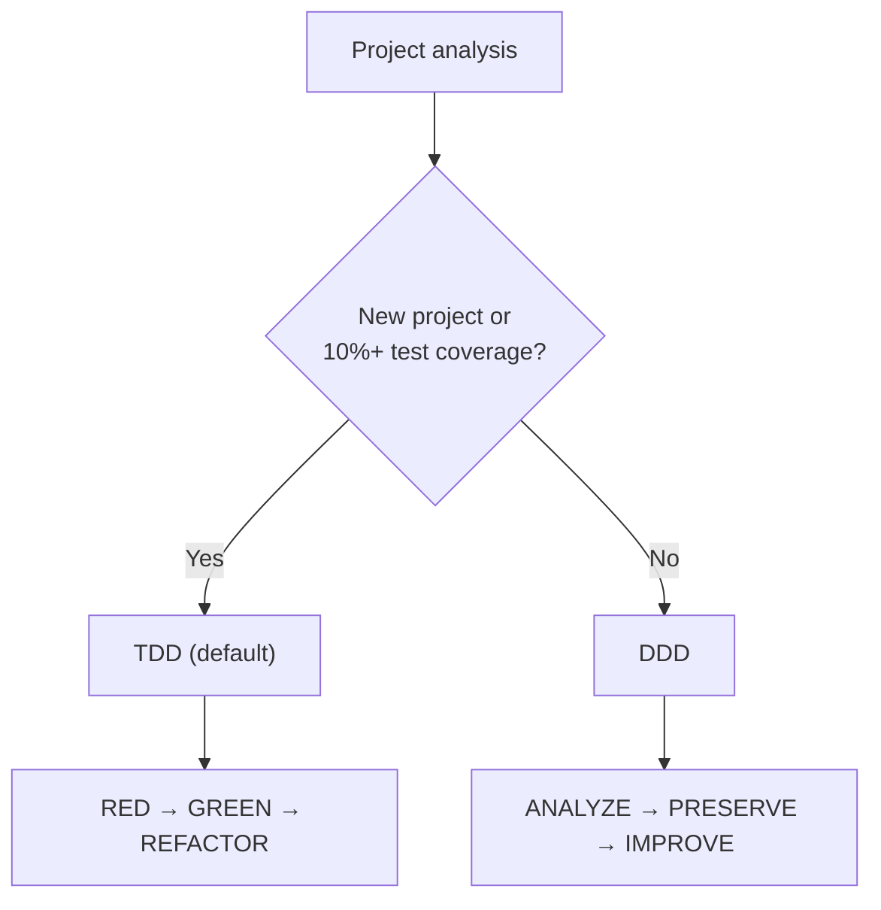

<p align="center">
  
</p>

<h1 align="center">MoAI-ADK</h1>

<p align="center">
  <strong>An Agentic Development Harness for Claude Code</strong>
</p>

<p align="center">
  English ·
  <a href="./README.ko.md">한국어</a> ·
  <a href="./README.ja.md">日本語</a> ·
  <a href="./README.zh.md">中文</a>
</p>

<p align="center">
  <a href="https://book.mo.ai.kr" target="_blank"><strong>Official Book: Practical Agentic Coding with Claude Code</strong></a><br>
  A hands-on harness engineering guide by the MoAI-ADK author — <a href="https://book.mo.ai.kr" target="_blank">book.mo.ai.kr</a>
</p>

<p align="center">
  <a href="https://github.com/modu-ai/moai-adk/actions/workflows/ci.yml"></a>
  <a href="https://github.com/modu-ai/moai-adk/actions/workflows/codeql.yml"></a>
  <a href="https://codecov.io/gh/modu-ai/moai-adk"></a>
  <br>
  <a href="https://go.dev/"></a>
  <a href="https://github.com/modu-ai/moai-adk/releases"></a>
  <a href="./LICENSE"></a>
</p>

<p align="center">
  <a href="https://adk.mo.ai.kr"><strong>Official Documentation</strong></a> ·
  <a href="https://adk.mo.ai.kr/book">Book: Practical Agentic Coding with Claude Code</a> ·
  <a href="https://discord.gg/Z7E7Mdc5aN">Discord</a>
</p>

---

> **"Don't write the code. Design the environment that writes the code."**

---

## What is MoAI-ADK?

MoAI-ADK (Agentic Development Kit) is a harness that wraps Claude Code from the outside, making the model's stochastic output reliable. The model is a worker that moves token by token — it remembers neither budget, nor quality bar, nor where the last session broke off. Cost ceilings, passing test suites, self-improving loops, continuity that survives `/clear` — properties like these cannot be re-seeded by a prompt every turn; the system must enforce them from the outside.

It does not replace Claude Code. It only wraps, in structure, the parts Claude Code leaves to you — model routing, quality gates, cost control, learning loops, and session continuity. A single binary written in Go, it runs on macOS, Linux, and Windows with no extra dependencies.


---

## The Harness, in Three Axes

MoAI-ADK's value rests on three pillars — the same three the [documentation site](https://adk.mo.ai.kr/en/core-concepts) organizes around. Each pillar answers one question about how an agentic system should work.


| Pillar | Key Question |
|---|---|
| 🪙 **Tokenomics** | How do we get the same quality with fewer tokens? |
| 🧠 **Agentic Loop Engineering** | How does the loop work and learn on its own? |
| 🛡️ **Agentic Harness** | How do we design an environment where agents work well? |

### 🪙 Tokenomics — same quality, fewer tokens

Token prices fell **98% over three years** (Linux Foundation), yet enterprise AI spend rose **320%** in the same window. Volume growth overwhelmed the price drop. Agents spin through dozens to hundreds of steps to solve a single task, burning tokens proportionally. In usage-based pricing this becomes the invoice; in subscription, it eats the weekly quota shared by every model.

Uber deployed Claude Code to 5,000 engineers and **burned through a year of coding budget in four months**, then imposed monthly token limits. Meta, Amazon, and Microsoft each walked back unlimited-AI policies. **Tokenomics** — matching the model to the task to raise token efficiency — became the tech industry's new baseline.


Traditional cost control was built for rising unit prices, so it is helpless against this paradox: prices falling while total spend climbs. The bottleneck is not unit price but volume, more precisely the step count an agent spins before finishing.

**Cost is determined by assignment, not unit price.** The DeepSWE leaderboard (113 tasks, per-effort view) demonstrates this. Within the same Claude family, per-task cost tracks how efficiently a model *finishes* — not what a token costs.

| Model [effort] | Pass@1 | Per-task cost | Output tokens | Steps |
|---|---|---|---|---|
| claude-opus-5 [low] | 58% | **$1.66** | 20k | 36 |
| claude-opus-5 [medium] | 69% | $3.29 | 37k | 52 |
| claude-opus-5 [high] | 73% | $6.08 | 64k | 73 |
| claude-opus-5 [max] | 74% | $11.84 | 118k | 99 |
| claude-sonnet-5 [max] | 54% | **$26.40** | 214k | 268 |

Opus 5 at its **lowest** effort scores higher than Sonnet 5 at its **highest** (58% vs 54%) while costing one-sixteenth as much per task ($1.66 vs $26.40) — even though Sonnet's per-token price is lower. The cause is 268 steps against 36: retry loops, not token rates, write the invoice. Cost is determined by **assigning the right model and reasoning depth to each task**, not by unit price.

#### Four stages: measurement → routing → diet → defense

Tokenomics operates in four stages. Each stage owns one face of cost, and together they form a closed loop. Measurement must precede so routing and diet effects can be verified; without defense, a single budget overrun cuts the session off.


**Measurement — per-SPEC token accounting.** Each SPEC's token consumption is accounted for transparently: transcript JSONL usage is summed and recorded in a `progress.md` token-accounting block, queryable via a `moai spec audit` column. This layer is the baseline for the other three.

**Routing — assign the right model and reasoning depth to each task.** Declaratively assign models and reasoning effort (low / medium / high / max) by work phase (plan / run / sync) and SPEC size (Tier S / M / L). Deploy high-reasoning models to planning phases that need deep inference, and light models to implementation phases with mechanical repetition.

- **No-Haiku 3-Tier Policy** — excludes Haiku from the routing set; Sonnet at low effort takes single-shot, input-dominated work, Opus carries every multi-turn agentic row.
- **Profile Matrix** — 11 agents × 3 profiles = 33 cells. `moai model profile` resolves each agent's `{model, effort}` pair.
- **CG Mode** — `moai cg` combines a Claude leader (strategy, planning, audits) with GLM workers (bulk implementation). **60-70% cost savings** on implementation-heavy workloads.


**Measured value-for-money — Opus 5's knee is at medium.** The routing rationale rests on DeepSWE v1.1 (datacurve.ai, 113 tasks · 91 repos · 5 languages, 2026-07-25).

| Model [effort] | Score | Per-task cost | Note |
|---|---|---|---|
| opus-5 [low] | 58%±2 | $1.66 | |
| opus-5 [medium] | **69%±1** | **$3.29** | **value-for-money knee** |
| opus-5 [high] | 73%±2 | $6.08 | +4pt score, 1.8× cost |
| opus-5 [xhigh] | 73%±3 | $9.07 | **net loss** — ties high, +49% cost only |
| opus-5 [max] | 74%±4 | $11.84 | |
| glm-5.2 [max] | 44%±2 | $3.92 | API-metered disadvantage · valuable under z.ai flat-fee |
| sonnet-5 [max] | 54%±4 | $26.40 | Pareto-dominated by opus-5 [low] |


> Source: [DeepSWE v1.1 leaderboard](https://deepswe.datacurve.ai) (datacurve.ai, 113 tasks, 2026-07-25)

`medium` is the default anchor for implementation agents, and `xhigh` was retired from the matrix. Applying the `high` profile captures **cost −33%, quality +3.3pt** together — cheaper and more accurate.

**Verification Economy — diet context, persist evidence to disk.** Redirect verbose verification output to disk files, leaving only exit code and bounded tail (max 50 lines) in context. Prompt-cache reuse (cached reads cost 0.1×) and a context-diet `/clear` strategy (auto-recommendations at 1M 50% / 200K 90% thresholds) keep the window light.

**Budget Defense — stop before overage, resume in the next session.** A Token Circuit Breaker aborts at the hard limit (default 90%), saves progress to `progress.md`, and issues a paste-ready resume message. The statusline keeps context usage, cache hit rate, and rate-limit depletion visible at all times.

### 🧠 Agentic Loop Engineering — the loop that works and learns on its own

A harness is not static structure. The loop runs on its own, observations accumulate along the way, and guidance evolves with each cycle.

**Declarative loops.** `/moai goal "<condition>"` keeps the session working until a declared completion condition is met or the turn limit (default 30) is reached. `/moai loop` scans LSP diagnostics · AST-grep · linter in parallel, buckets issues by level, and runs until the queue drains. The loop is not driven by a prompt each step — it continues toward the declared end-state on its own.

**4-Tier Learning Ladder.** Observations upgrade into guidance along a ladder: Observation (≥1) → Heuristic (≥3) → Rule (≥5) → Auto-update (≥10, user approval required); trust threshold 0.70. Routing decisions and gate evidence are recorded as privacy-preserving digests. All applications revertible via `moai harness rollback`. Harness edits (rule/agent/hook changes) follow a predict–verify discipline: each edit records a falsifiable prediction, must pass held-in/held-out double checks before acceptance, and rejected edits stay on record.

**Decision Memory.** Questions emerge where uncertainty is highest (p ≈ 0.5); recommendations follow observed statistical majority, not system defaults. The harness learns which decisions you tend to make and surfaces the right option rather than a generic default.

### 🛡️ Agentic Harness — designing the environment agents work in

Instead of writing code yourself, you design an environment where agents work well. This pillar is the structure that makes the other two possible.

**SPEC 3-Phase Lifecycle.** plan → run → sync. Tier S/M/L size classification determines verification depth and PR routing. GEARS-format requirements + acceptance criteria judge completion by evidence.


**TRUST 5 Quality Gates.** Tested (85%+ coverage) · Readable · Unified · Secured · Trackable, applied to every change. Gates judge verification, not agents.

**11-Agent Catalog.** MoAI custom 10 + built-in Explore. Separate planning and auditing from the start so the authoring side cannot grade its own work.

**Extension Points.** The Harness v4 Builder turns a natural-language request into project-specific agents · skills · commands · hooks scaffolding. `@MX` tags let AI agents exchange context, invariants, and danger zones inline in code. `worktree` isolation attaches an isolated workspace per SPEC for parallel development via `/moai plan --worktree`.

---

## Quick Start

### Install

#### macOS / Linux / WSL

```bash
curl -fsSL https://raw.githubusercontent.com/modu-ai/moai-adk/main/install.sh | bash
```

#### Windows (PowerShell 7.x+)

```powershell
irm https://raw.githubusercontent.com/modu-ai/moai-adk/main/install.ps1 | iex
```

#### Build from source (Go 1.26+)

```bash
git clone https://github.com/modu-ai/moai-adk.git
cd moai-adk && make build
```

### Project Initialization

```bash
moai init my-project
```

Interactive wizard auto-detects language, framework, and methodology, selects model policy, and generates Claude Code integration files.

### First Workflow

```bash
claude        # launch Claude Code inside the project
```

```text
/moai plan "Add JWT login"      # author a SPEC
/moai run SPEC-AUTH-001         # TDD/DDD implementation
/moai sync SPEC-AUTH-001        # sync docs + create PR
```

Natural language works too. `/moai "fix the login bug"` triggers intent analysis (Analyze-First routing) to read the request and route to the appropriate workflow.

### Requirements

| Platform | Supported Environments | Notes |
|----------|----------------------|-------|
| macOS | Terminal, iTerm2 | Full support |
| Linux | Bash, Zsh | Full support |
| Windows | **WSL (recommended)**, PowerShell 7.x+ | Native cmd.exe unsupported |

**Prerequisites**

- **Git** required on all platforms
- **Claude Code** — MoAI-ADK is a harness for Claude Code
- **Recommended**: `gh` CLI (PR automation) · `tmux` (CG mode) · language linter/test toolchain (e.g., `golangci-lint`)

---

## Reference

### /moai Slash Commands (15)

| Subcommand | Role |
|------------|------|
| `plan` / `run` / `sync` | SPEC 3-phase pipeline |
| `project` / `harness` | Project docs+harness generation · harness lifecycle |
| `goal` / `loop` / `fix` | Declarative goal loops · iterative fixes · single-pass fixes |
| `review` / `gate` / `clean` | Code review (`--deep` for multi-agent adversarial vulnerability scan) · pre-commit quality gates · dead code removal |
| `mx` / `codemaps` / `feedback` | @MX annotations · architecture docs · GitHub issue reporting |
| `e2e` | Multi-platform E2E tests (web/mobile/desktop, CLI-first) |
| *(natural language)* | Analyze-First routing: autonomous plan → run → sync pipeline |

> **4 Retired Subcommands**: `design` · `brain` · `coverage` · `security` (SPEC-SUBCOMMAND-RETIRE-001, status: completed). `security` was replaced by the `moai-ref-owasp-checklist` + `moai-ref-llm-security` skills; `e2e` was revived by E2E-REVIVAL and is currently active.

> → Details: [Workflow Commands](https://adk.mo.ai.kr/en/workflow-commands) · [Utility Commands](https://adk.mo.ai.kr/en/utility-commands)

### CLI Commands (13 frequently used)

| Command | Description |
|---------|-------------|
| `moai init` | Interactive project setup (auto-detects language/framework/methodology) |
| `moai doctor` | System state diagnosis and environment verification |
| `moai status` | Project status summary (Git branch, quality metrics) |
| `moai update` | Update to latest version (auto-rollback supported) |
| `moai cc` / `moai glm` / `moai cg` | Claude-only / GLM-only / hybrid Claude leader + GLM worker sessions |
| `moai worktree <new|list|switch|sync|remove|clean|go>` | Git worktree management for parallel SPEC development |
| `moai session <list|register|current>` | Multi-session coordination |
| `moai spec <audit|archive|lint|list|new>` | SPEC lifecycle tools |
| `moai goal <arm|status|clear>` | Goal engine CLI |
| `moai harness <status|apply|rollback|disable>` | Harness learning lifecycle |
| `moai handoff <save|list>` | Session handoff records |
| `moai preference <list|decay-scan|toggle>` | Decision memory management |
| `moai web` | Web Console — 6-tab settings console |

> Full 36 commands: [CLI Reference](https://adk.mo.ai.kr/en/cli-reference)

### 11-Agent Catalog

| Category | Agent | Cost | Role |
|----------|-------|------|------|
| **Manager** | manager-spec | 🔴 | Plan-phase SPEC authoring |
| | manager-develop | 🔴 | Run-phase TDD/DDD/autofix implementation |
| | manager-docs | 🔵 | Sync-phase documentation |
| | manager-git | 🩵 | PR creation and routing |
| | manager-design | 🟠 | Design-phase collaboration (Claude Design) |
| **Evaluator** | plan-auditor | 🔴 | Independent plan audit (bias prevention) |
| | sync-auditor | 🔴 | 4-dimensional quality scoring (Functionality 40 · Security 25 · Craft 20 · Consistency 15) |
| **Builder** | builder-harness | 🟠 | Project-specific agents, skills, commands, hooks scaffolding |
| **Advisor** | super-advisor | 🔵 | On-demand high-reasoning consultation (E1-E4 escalation) |
| **Specialist** | e2e-tester | 🟠 | Web/mobile/desktop E2E test execution (CLI-first) |
| **Built-in** | Explore | ⚪ | Read-only codebase exploration |

Cost colors follow the default `medium` profile's model×effort cells (inspect via `moai model profile`): 🔴 opus+high · 🟠 opus+medium · 🔵 opus+low · 🩵 sonnet+low · ⚪ session-model inherit (user-added agents). Assignments shift when switching profiles (`high`/`low`). Progress of long-running delegations is recorded on the Task channel and relayed by the orchestrator as an icon Progress Board.

### TRUST 5 Quality Gates

| Criterion | Meaning | Verification |
|-----------|---------|------------|
| **T**ested | Tested | 85%+ coverage, characterization tests, unit tests pass |
| **R**eadable | Readable | Clear naming, consistent style, lint errors 0 |
| **U**nified | Unified | Consistent formatting, import order, project structure compliance |
| **S**ecured | Secured | OWASP compliance, input validation, security warnings 0 |
| **T**rackable | Trackable | Conventional commits, issue references, structured logging |

### Methodology Selection (TDD vs DDD)


```mermaid
flowchart TD
    A["Project analysis"] --> B{"New project or<br/>10%+ test coverage?"}
    B -->|"Yes"| C["TDD (default)"]
    B -->|"No"| D["DDD"]
    C --> F["RED → GREEN → REFACTOR"]
    D --> G["ANALYZE → PRESERVE → IMPROVE"]
```

| Methodology | Cycle | Target |
|-------------|-------|-----|
| **TDD** (default) | RED → GREEN → REFACTOR | New projects and feature work |
| **DDD** | ANALYZE → PRESERVE → IMPROVE | Existing code with <10% coverage |

---

## Reading the Statusline

```
🤖 Opus │ 🧠 xhigh·t │ ♻️ 87% │ 🔅 v2.1.212 │ 🗿 v3.0.0 │ ⏳ 2h 34m │ 💬 MoAI
🪫 CW: ████████░░ 88% (⚠️/clear) │ 🔋 5H: ████░░░░░░ 45% (4h 30m) │ 🪫 7D: ████████░░ 82% (Jan 21)
📁 moai-adk-go │ 🔀 modu-ai/moai-adk | 🅱️ feat/statusline ↑2 +3 │ 💾 +1 M2 ?0 │ 📋 [run SPEC-AUTH-001-run] │ 💌 PR #1042 (⌥approved)
```

| Element | Meaning |
|------|------|
| 🤖 Model | Current active model |
| 🧠 effort | Reasoning effort level — `·t` suffix when extended reasoning active |
| ♻️ Cache hit rate | Prompt cache hit rate |
| CW: Context | Context window usage rate + 2-stage `/clear` markers (⚠️ soft, 🛑 hard) |
| 5H / 7D | Pricing plan usage rate + reset time |
| 📁 Directory | Project directory name |
| 🔀 Repo | GitHub repo identity `owner/name` |
| 🅱️ Branch | Current branch + `↑`ahead `↓`behind + `+`dirty count |
| 💾 git status | staged / modified / untracked counts |
| 📋 Task | Active SPEC workflow `[command SPEC-ID-phase]` |
| 💌 PR | Active GitHub PR number + review state (`⌥state`) |

> Details: [Statusline Guide](https://adk.mo.ai.kr/en/advanced/statusline)

---

## FAQ

### Q: Why doesn't every function have an @MX tag?

Normal. Tags mark high-fan-in, complex, or dangerous code. Most code in any project won't hit any tag threshold, and a file without tags is not a defect.

### Q: What does the statusline version display mean?

```
🗿 v3.0.0 ⬆️ v3.0.1
```

The first value is the currently installed MoAI-ADK version; the arrow indicates an available update. Disappears after running `moai update`.

### Q: Can I use Claude only without GLM?

Yes. `moai cc` launches a Claude-only session. CG mode (`moai cg`, Claude leader + GLM workers) and GLM-only (`moai glm`) are cost-saving options; the harness·SPEC workflow·quality gates work identically across all three modes.

### Q: Does it work on existing projects?

Yes. `moai init` detects project state and selects methodology — DDD (characterization tests fix behavior, then incremental improvement) for existing code with <10% coverage, TDD for new/well-tested code.

---

## Community and Documentation

### Contributing

Contributions are welcome. See [CONTRIBUTING.md](CONTRIBUTING.md) for detailed procedures.

1. Fork the repository
2. Create a feature branch: `git checkout -b feature/my-feature`
3. Write tests (TDD for new code, characterization tests for existing code)
4. Verify tests, lint, format pass: `make test` · `make lint` · `make fmt`
5. Commit with Conventional commit message and open pull request

**Code quality requirements**: 85%+ coverage · lint errors 0 · type errors 0 · Conventional commits

### Community

- [Discord](https://discord.gg/Z7E7Mdc5aN) — Real-time discussion and tips
- [Issues](https://github.com/modu-ai/moai-adk/issues) — Bug reports, feature requests (use `/moai feedback` in Claude Code)

### License

[Apache License 2.0](./LICENSE) — see LICENSE file for details.

### Documentation Guide

[adk.mo.ai.kr](https://adk.mo.ai.kr) online documentation is organized into 12 sections.

| Section | Description |
|---------|-------------|
| [Getting Started](https://adk.mo.ai.kr/en/getting-started) | Introduction, installation, Windows guide, init wizard, quickstart, CLI overview, FAQ |
| [Core Concepts](https://adk.mo.ai.kr/en/core-concepts) | MoAI-ADK identity, constitution, harness engineering, SPEC-based development, DDD, TRUST 5 |
| [Workflow Commands](https://adk.mo.ai.kr/en/workflow-commands) | `plan` · `run` · `sync` — SPEC pipeline backbone |
| [Utility Commands](https://adk.mo.ai.kr/en/utility-commands) | `fix` · `loop` · `gate` · `review` · `clean` · `codemaps` · `e2e` · `feedback` · `goal` |
| [CLI Reference](https://adk.mo.ai.kr/en/cli-reference) | All `moai` binary commands — `status`, `profile`, `doctor`, `update`, `web`, `goal`, `handoff`, `harness`, `init`, `worktree`, etc. |
| [Claude Code Guide](https://adk.mo.ai.kr/en/claude-code) | Claude Code integration — basics, context·memory, agentic, extensibility (skills·hooks·plugins) |
| [Multi-LLM](https://adk.mo.ai.kr/en/multi-llm) | CG mode and model policy |
| [Cost Optimization](https://adk.mo.ai.kr/en/cost-optimization) | Prompt caching strategies and token cost reduction |
| [Guides](https://adk.mo.ai.kr/en/guides) | CI automation, multi-LLM CI, and other operational recipes |
| [Git Worktree](https://adk.mo.ai.kr/en/worktree) | Worktree guide for parallel SPEC development, examples, FAQ |
| [Advanced](https://adk.mo.ai.kr/en/advanced) | Tokenomics overview, token budget, statusline, settings.json, hooks, @MX tags, skill guide, Harness v4 Builder, self-evolution, decision memory, catalog system, security notes, CLAUDE.md/agent guide |
| [Contributing](https://adk.mo.ai.kr/en/contributing) | Open-source contribution guide |

### Links

- [Official Documentation](https://adk.mo.ai.kr)
- [Book: Practical Agentic Coding with Claude Code](https://adk.mo.ai.kr/book)
- [CHANGELOG](./CHANGELOG.md)
- [Claude Code](https://code.claude.com/docs/en)
- [Discord Community](https://discord.gg/Z7E7Mdc5aN)
