```mermaid
flowchart TD
    User[👤 User] -->|Request| Alfred[🎩 Mr.Alfred]
    Alfred -->|Analyze| Plan[📋 Plan Agent]
    Plan -->|Plan| Alfred
    Alfred -->|Delegate| Agents[👥 Specialized Agents]
    Agents -->|Results| Alfred
    Alfred -->|Integrated Report| User

    style Alfred fill:#fff,stroke:#333,stroke-width:2px
    style Agents fill:#fff,stroke:#333,stroke-width:1px,stroke-dasharray: 5 5
```

# 🗿 MoAI-ADK: Agentic AI-Based SPEC-First TDD Development Framework


**Available Languages:** [🇰🇷 한국어](./README.ko.md) | [🇺🇸 English](./README.md) | [🇯🇵 日本語](./README.ja.md) | [🇨🇳 中文](./README.zh.md)

[](https://pypi.org/project/moai-adk/)
[](https://opensource.org/licenses/MIT)
[](https://www.python.org/)

MoAI-ADK (Agentic Development Kit) is an open-source framework that combines **SPEC-First development**, **Test-Driven Development** (TDD), and **AI agents** to deliver a complete and transparent development lifecycle.

---

## 📑 Table of Contents (Quick Navigation)

### PART A: Getting Started (30 minutes)

| Section                                           | Time | Goal                           |
| ------------------------------------------------- | ---- | ------------------------------ |
| [1. Introduction](#1-introduction)                | 2min | Understand what MoAI-ADK is    |
| [2. Installation & Setup](#2-installation--setup) | 10min | Configure basic environment    |
| [3. Quick Start](#3-quick-start)                  | 5min | Complete your first feature    |

### PART B: Core Concepts (45 minutes)

| Section                                              | Time | Goal                      |
| ---------------------------------------------------- | ---- | ------------------------- |
| [4. SPEC and EARS Format](#4-spec-and-ears-format)   | 10min | Understand specifications |
| [5. Mr.Alfred & Agents](#5-mralfred--agents)         | 12min | Understand agent system   |
| [6. Development Workflow](#6-development-workflow)   | 15min | Plan → Run → Sync         |
| [7. Core Commands](#7-core-commands)                 | 8min | `/moai:0-3` commands      |

### PART C: Advanced Learning (2-3 hours)

| Section                                             | Goal                         |
| --------------------------------------------------- | ---------------------------- |
| [8. Agent Guide](#8-agent-guide-26-agents)          | Utilize specialized agents   |
| [9. Skill Library](#9-skill-library-22-skills)      | Explore 22 skills            |
| [10. Composition Patterns](#10-composition-patterns-and-examples) | Real project examples |
| [11. TRUST 5 Quality](#11-trust-5-quality-assurance)| Quality assurance system     |

### PART D: Advanced & Reference (As Needed)

| Section                                       | Purpose                      |
| --------------------------------------------- | ---------------------------- |
| [12. Advanced Configuration](#12-advanced-configuration) | Project customization |
| [13. MCP Servers](#13-mcp-servers)            | External tool integration    |
| [14. FAQ & Quick Reference](#14-faq--quick-reference) | Common questions      |
| [15. Additional Resources](#15-additional-resources) | ai-nano-banana guide   |

---

## 1. Introduction

### 🗿 What is MoAI-ADK?

**MoAI-ADK** (Agentic Development Kit) is a next-generation development framework powered by AI agents. It combines **SPEC-First development methodology**, **TDD** (Test-Driven Development), and **26 specialized AI agents** to deliver a complete and transparent development lifecycle.

### ✨ Why Use MoAI-ADK?


Limitations of traditional development:

- ❌ Frequent rework due to unclear requirements
- ❌ Documentation out of sync with code
- ❌ Quality degradation from postponed testing
- ❌ Repetitive boilerplate code writing

MoAI-ADK solutions:

- ✅ Start with **clear SPEC documents** to eliminate misunderstandings
- ✅ **Automatic documentation sync** keeps everything up-to-date
- ✅ **TDD enforcement** guarantees 85%+ test coverage
- ✅ **AI agents** automate repetitive tasks

### 🎯 Core Features


| Feature                  | Description                                           | Quantitative Impact                                                                                                                                                                              |
| ------------------------ | ----------------------------------------------------- | ------------------------------------------------------------------------------------------------------------------------------------------------------------------------------------------------ |
| **SPEC-First**           | All development starts with clear specifications      | **90% reduction** in rework from requirement changes<br/>Clear SPEC eliminates developer-planner misunderstandings                                                                                |
| **TDD Enforcement**      | Automated Red-Green-Refactor cycle                    | **70% reduction** in bugs (with 85%+ coverage)<br/>**15% shorter** total development time including test writing                                                                                 |
| **AI Orchestration**     | Mr.Alfred commands 26 specialized AI agents (7-Tier)  | **Average token savings**: 5,000 tokens per session (Conditional Auto-load)<br/>**Simple tasks**: 0 tokens (Quick Reference)<br/>**Complex tasks**: 8,470 tokens (Auto-load skill)<br/>**60-70% time savings** vs manual |
| **Auto Documentation**   | Automatic doc sync on code changes (`/moai:3-sync`)   | **100% documentation freshness**<br/>Eliminates manual doc writing<br/>Auto-sync since last commit                                                                                               |
| **TRUST 5 Quality**      | Test, Readable, Unified, Secured, Trackable           | Enterprise-grade quality assurance<br/>**99% reduction** in post-deployment emergency patches                                                                                                    |

---

## 2. Installation & Setup

### 🎯 Basic Installation (10 minutes)

#### Step 1: Install uv (1 minute)

```bash
# macOS / Linux
curl -LsSf https://astral.sh/uv/install.sh | sh

# Windows (PowerShell)
powershell -ExecutionPolicy ByPass -c "irm https://astral.sh/uv/install.ps1 | iex"

# Verify installation
uv --version
```

#### Step 2: Install MoAI-ADK (2 minutes)

```bash
# Install latest version
uv tool install moai-adk

# Update to latest version (if already installed)
uv tool update moai-adk

# Verify installation
moai-adk --version
```

#### Step 3: Initialize Project (3 minutes)

```bash
# Create new project
moai-adk init my-project
cd my-project

# Check project structure
ls -la
```

Generated file structure:

```
my-project/
├── .claude/              # Claude Code configuration
├── .moai/                # MoAI-ADK configuration
├── src/                  # Source code
├── tests/                # Test code
├── .moai/specs/          # SPEC documents
├── README.md
└── pyproject.toml
```

#### Step 4: Run Claude Code (4 minutes)

```bash
# Run Claude Code
claude

# Inside Claude Code
> /moai:0-project
```

Project metadata is automatically generated.

---

## 3. Quick Start

### 🎯 Goal: Complete Your First Feature in 5 Minutes


---

### **Step 1: Plan Your First Feature** ⏱️ 2min

In Claude Code:

```
> /moai:1-plan "Add user login feature"
```

This command:

- Auto-generates SPEC-001 document
- Defines requirements, constraints, success criteria
- Creates test scenarios

---

### **Step 2: Initialize Context** ⏱️ 1min

```
> /clear
```

Clears previous context for token efficiency.

---

### **Step 3: Implementation (Run)** ⏱️ 2min

```
> /moai:2-run SPEC-001
```

This command:

- Writes tests first (Red)
- Implements code (Green)
- Refactors (Refactor)
- Automatically performs TRUST 5 validation

---

### **Step 4: Documentation (Sync)** ⏱️ (Optional)

```
> /moai:3-sync SPEC-001
```

Automatically:

- Generates API documentation
- Creates architecture diagrams
- Updates README
- Prepares for deployment

**Done!** Your first feature is fully implemented. 🎉

---

### 📁 More Details

- **Advanced installation options**: [12. Advanced Configuration](#12-advanced-configuration)
- **Detailed command usage**: [7. Core Commands](#7-core-commands)
- **Development workflow**: [6. Development Workflow](#6-development-workflow)

---

## 4. SPEC and EARS Format

### 📋 SPEC-First Development


**What is SPEC-First?**

All development starts with **clear specifications**. SPECs follow the **EARS (Easy Approach to Requirements Syntax) format** and include:

- **Requirements**: What to build?
- **Constraints**: What are the limitations?
- **Success Criteria**: When is it complete?
- **Test Scenarios**: How to verify?

### 🎯 EARS Format Example

```markdown
# SPEC-001: User Login Feature

## Requirements

- WHEN a user enters email and password and clicks "Login"
- IF credentials are valid
- THEN the system issues a JWT (JSON Web Token) and navigates to dashboard

## Constraints

- Password must be at least 8 characters
- Lock account after 5 consecutive failures (30 minutes)
- Response time must be under 500ms

## Success Criteria

- 100% success rate with valid credentials
- Display clear error messages for invalid credentials
- Response time < 500ms
- Test coverage >= 85%

## Test Scenarios

### TC-1: Successful Login

- Input: email="user@example.com", password="secure123"
- Expected: Token issued, navigate to dashboard

### TC-2: Invalid Password

- Input: email="user@example.com", password="wrong"
- Expected: "Incorrect password" error message

### TC-3: Account Lock

- Input: 5 consecutive failures
- Expected: "Account locked. Try again in 30 minutes"
```

### 💡 5 Types of EARS Format

| Type              | Syntax         | Example                                        |
| ----------------- | -------------- | ---------------------------------------------- |
| **Ubiquitous**    | Always perform | "System shall always log activities"           |
| **Event-driven**  | WHEN...THEN    | "When user logs in, issue token"               |
| **State-driven**  | IF...THEN      | "If account is active, allow login"            |
| **Unwanted**      | shall not      | "System shall not store passwords in plaintext"|
| **Optional**      | where possible | "Provide OAuth login where possible"           |

---

## 5. Mr.Alfred & Agents

### 🎩 Mr. Alfred - Super Agent Orchestrator

**Who is Alfred?**

Mr.Alfred is MoAI-ADK's **chief orchestrator** who analyzes user requests, selects appropriate specialized agents for task delegation, and integrates results.

**Alfred's Roles:**

1. **Understand**: Analyze user requests and clarify ambiguities
2. **Plan**: Establish execution plan through Plan agent
3. **Execute**: Delegate tasks to specialized agents (sequential/parallel)
4. **Integrate**: Collect all results and report to user



### 🔧 Agent System (5-Tier Hierarchy)

MoAI-ADK organizes **26 specialized agents** into **5 tiers** for optimal performance.

**Tier 1: Domain Experts** (7 agents)

- `expert-backend`: Backend architecture, API development
- `expert-frontend`: Frontend, React/Vue implementation
- `expert-database`: Database design, optimization
- `expert-security`: Security analysis, vulnerability scanning
- `expert-devops`: Deployment, infrastructure, CI/CD
- `expert-uiux`: UI/UX design, components
- `expert-debug`: Debugging, error analysis

**Tier 2: Workflow Managers** (8 agents)

- `manager-spec`: SPEC writing (EARS format)
- `manager-tdd`: TDD implementation (RED-GREEN-REFACTOR)
- `manager-docs`: Automatic documentation
- `manager-quality`: Quality verification (TRUST 5)
- `manager-strategy`: Execution strategy planning
- `manager-project`: Project initialization
- `manager-git`: Git workflow
- `manager-claude-code`: Claude Code integration

**Tier 3: Meta-generators** (3 agents)

- `builder-agent`: Create new agents
- `builder-skill`: Create new skills
- `builder-command`: Create new commands

**Tier 4: MCP Integrators** (5 agents)

- `mcp-context7`: Real-time library documentation lookup
- `mcp-sequential-thinking`: Complex reasoning analysis
- `mcp-playwright`: Web automation testing
- `mcp-design`: Figma design system
- `mcp-browser`: Web test automation

**Tier 5: AI Services** (1 agent)

- `ai-nano-banana`: Gemini 3 image generation

---

## 6. Development Workflow

### 🔄 Infinite Plan-Run-Sync Loop

MoAI-ADK development proceeds in a **3-phase infinite loop**:

```mermaid
sequenceDiagram
    participant U as 👤 User
    participant A as 🎩 Alfred
    participant S as 📝 SPEC Builder
    participant T as 💻 TDD Implementer
    participant D as 📚 Docs Manager

    Note over U,D: 🔄 Plan → Run → Sync Loop

    rect rgb(245, 245, 245)
        Note right of U: Phase 1: Plan
        U->>A: /moai:1-plan "login feature"
        A->>S: Request SPEC writing
        S-->>A: SPEC-001 draft
        A-->>U: Request review
        U->>A: Approve
        A->>U: 💡 Recommend /clear
    end

    rect rgb(250, 250, 250)
        Note right of U: Phase 2: Run
        U->>A: /moai:2-run SPEC-001
        A->>T: Request TDD implementation
        T->>T: 🔴 Write tests (fail)
        T->>T: 🟢 Implement code (pass)
        T->>T: 🔵 Refactor & optimize
        T-->>A: Implementation complete (tests pass)
        A-->>U: Confirm completion
    end

    rect rgb(240, 250, 240)
        Note right of U: Phase 3: Sync
        U->>A: /moai:3-sync SPEC-001
        A->>D: Request documentation
        D->>D: Generate API docs
        D->>D: Generate diagrams
        D-->>A: Documentation ready
        A-->>U: Ready for deployment
    end
```



### 📊 Detailed Phase Descriptions

#### Phase 1: Plan (Design, 5-10min)

**Goal**: What to build?

```bash
/moai:1-plan "user login feature"
```

In this phase:

- ✅ Auto-generate SPEC-001 document
- ✅ Define requirements in EARS format
- ✅ Clarify success criteria
- ✅ Write test scenarios

**Output**: `.moai/specs/SPEC-001/spec.md`

---

#### Phase 2: Run (Implementation, 20-40min)

**Goal**: How to build it?

```bash
/clear
/moai:2-run SPEC-001
```

In this phase:

- 🔴 **RED**: Write failing tests
- 🟢 **GREEN**: Pass tests with minimal code
- 🔵 **REFACTOR**: Clean and optimize code

**Automatic verification**:

- Test coverage >= 85%
- Pass code linting
- Pass security checks
- Pass type checking

**Output**: Implementation complete + test code + 85%+ coverage

---

#### Phase 3: Sync (Documentation, 10-15min)

**Goal**: Is it complete?

```bash
/clear
/moai:3-sync SPEC-001
```

In this phase:

- 📚 Auto-generate API documentation
- 📊 Generate architecture diagrams
- 🚀 Write deployment guide
- ✅ Reflect all changes

**Output**: Up-to-date documentation + ready for deployment

---

### 💡 Visual Workflow: "Blog Comment Feature" Example

```mermaid
flowchart LR
    Start([👤 User Request]) -->|"<br/>Can you create<br/>comment feature?<br/>"| Plan["<b>📋 PLAN</b><br/>(Design)<br/>━━━━━━<br/>✨ Write SPEC<br/>✅ Define success criteria<br/>⏱️ 5min"]

    Plan -->|"<br/>SPEC-001<br/>ready<br/>"| Run["<b>💻 RUN</b><br/>(Implementation)<br/>━━━━━━<br/>🔴 Write tests<br/>🟢 Implement code<br/>🔵 Refactor<br/>⏱️ 20min"]

    Run -->|"<br/>Tests pass<br/>Code complete<br/>"| Sync["<b>📚 SYNC</b><br/>(Documentation)<br/>━━━━━━<br/>🔗 Generate API docs<br/>📊 Diagrams<br/>🚀 Deploy ready<br/>⏱️ 10min"]

    Sync -->|"<br/>Fully automated!<br/>"| End([✅ Feature Deployed])

    classDef planStyle fill:#e3f2fd,stroke:#1976d2,stroke-width:3px,color:#000
    classDef runStyle fill:#f3e5f5,stroke:#7b1fa2,stroke-width:3px,color:#000
    classDef syncStyle fill:#e8f5e9,stroke:#388e3c,stroke-width:3px,color:#000
    classDef normalStyle fill:#fafafa,stroke:#666,stroke-width:2px

    class Plan planStyle
    class Run runStyle
    class Sync syncStyle
    class Start,End normalStyle
```



---

## 7. Core Commands

### 🎯 `/moai:0-project` - Project Initialization

**Purpose**: Generate project metadata

**When to use**: When starting a new project

```bash
/moai:0-project
```

**Generated files**:

- `.moai/config/config.json`: Project configuration
- `.moai/memory/`: Project memory
- `.moai/docs/`: Auto-generated documentation

---

### 📋 `/moai:1-plan` - SPEC Writing

**Purpose**: Generate SPEC document in EARS format

**When to use**: Before starting new feature development

```bash
/moai:1-plan "add login feature"
```

**Example**:

```bash
/moai:1-plan "implement user profile page"
# → Creates SPEC-002 (.moai/specs/SPEC-002/spec.md)

/moai:1-plan "develop payment API"
# → Creates SPEC-003
```

**SPEC includes**:

- Requirements
- Constraints
- Success Criteria
- Test Scenarios

**Important**: Must execute `/clear` next

```bash
/moai:1-plan "feature name"
# After completion
/clear
```

---

### 💻 `/moai:2-run` - TDD Implementation

**Purpose**: Implement code with RED-GREEN-REFACTOR cycle

**When to use**: After SPEC writing for implementation

```bash
/moai:2-run SPEC-001
```

**Example**:

```bash
/moai:2-run SPEC-001  # Basic implementation
```

**Automatic execution**:

- 🔴 Write tests first
- 🟢 Pass tests with code
- 🔵 Refactor & optimize
- ✅ TRUST 5 validation (automatic)

**Verification items**:

- Test coverage >= 85%
- Pass linting checks
- Pass type checks
- Pass security checks

---

### 📚 `/moai:3-sync` - Documentation Sync

**Purpose**: Reflect code changes in documentation

**When to use**: After implementation completion

```bash
/moai:3-sync SPEC-001
```

**Example**:

```bash
/moai:3-sync SPEC-001  # All documentation
```

**Auto-generated documentation**:

- API reference
- Architecture diagrams
- Deployment guide
- README updates
- CHANGELOG

---

### 📊 Other Useful Commands

| Command             | Purpose               | When to use           |
| ------------------- | --------------------- | --------------------- |
| `/moai:0-git`       | Git workflow setup    | Project initialization|
| `/moai:9-feedback`  | Submit improvement feedback | When issues found |
| `/clear`            | Context initialization| Token savings after phase |

---

## 8. Agent Guide (26 Agents)

### 🎯 Agent Selection Guide

Each agent has specific domain expertise. Select the right agent for your task.

### Tier 1: Domain Experts

#### expert-backend (Backend Development)

**Expertise**: FastAPI, Django, Node.js backend development
**Use cases**:

- RESTful API design and implementation
- Database query optimization
- Authentication and authorization
- Server performance optimization

```bash
@agent-expert-backend "Develop user authentication API with FastAPI"
```

---

#### expert-frontend (Frontend Development)

**Expertise**: React, Vue, Next.js frontend
**Use cases**:

- UI component implementation
- State management (Redux, Zustand)
- API integration
- Responsive design

```bash
@agent-expert-frontend "Implement dashboard UI with React"
```

---

#### expert-database (Database)

**Expertise**: SQL, NoSQL, ORM, optimization
**Use cases**:

- Database schema design
- Query optimization
- Migration
- Performance tuning

```bash
@agent-expert-database "Optimize large PostgreSQL tables"
```

---

#### expert-security (Security)

**Expertise**: Security analysis, vulnerability scanning, OWASP
**Use cases**:

- Security code review
- Vulnerability analysis
- OWASP Top 10 verification
- Data encryption

```bash
@agent-expert-security "Security audit for login feature"
```

---

#### expert-devops (DevOps)

**Expertise**: Docker, Kubernetes, CI/CD, deployment
**Use cases**:

- Docker image optimization
- Kubernetes configuration
- GitHub Actions CI/CD
- Infrastructure automation

```bash
@agent-expert-devops "Setup Docker deployment for Next.js app"
```

---

#### expert-uiux (UI/UX Design)

**Expertise**: Design systems, components, accessibility
**Use cases**:

- UI component library design
- Design system development
- Accessibility (A11y) verification
- User experience optimization

```bash
@agent-expert-uiux "Build design system based on shadcn/ui"
```

---

#### expert-debug (Debugging)

**Expertise**: Problem analysis, error tracking, performance profiling
**Use cases**:

- Bug analysis
- Performance bottleneck analysis
- Log analysis
- Memory leak detection

```bash
@agent-expert-debug "Analyze slow API response time"
```

---

### Tier 2: Workflow Managers

#### manager-spec (SPEC Writing)

**Purpose**: Generate SPEC documents in EARS format
**Auto-invoked**: When executing `/moai:1-plan`

```bash
@agent-manager-spec "Write SPEC for user profile API"
```

---

#### manager-tdd (TDD Implementation)

**Purpose**: Auto-execute RED-GREEN-REFACTOR
**Auto-invoked**: When executing `/moai:2-run`

```bash
@agent-manager-tdd "Implement SPEC-001"
```

---

#### manager-docs (Documentation Automation)

**Purpose**: Auto-generate API docs, diagrams, guides
**Auto-invoked**: When executing `/moai:3-sync`

```bash
@agent-manager-docs "Generate documentation for login feature"
```

---

#### manager-quality (Quality Verification)

**Purpose**: TRUST 5 verification (Test, Readable, Unified, Secured, Trackable)
**Auto-invoked**: After `/moai:2-run` completion

```bash
@agent-manager-quality "Verify code quality"
```

---

#### manager-strategy (Strategy Planning)

**Purpose**: Establish complex implementation strategies
**Use cases**:

- Microservice architecture design
- Migration planning
- Performance optimization strategy

```bash
@agent-manager-strategy "Plan monolith to microservices migration"
# Or use Built-in agent
@agent-Plan "Plan monolith to microservices migration"
```

---

### Tier 3: Meta-generators

#### builder-agent

**Purpose**: Create new agents
**Use case**: Create organization-specific agents

```bash
@agent-builder-agent "Create data analysis specialist agent"
```

---

#### builder-skill

**Purpose**: Create new skills
**Use case**: Develop team-specific skills

```bash
@agent-builder-skill "Create GraphQL API development skill module"
```

---

#### builder-command

**Purpose**: Create new commands
**Use case**: Custom workflow automation

```bash
@agent-builder-command "Create /moai:deploy command (auto-deployment workflow)"
```

---

### Tier 4: MCP Integrators

#### mcp-context7 (Documentation Lookup)

**Purpose**: Real-time lookup of latest library documentation
**Use cases**:

- Check React latest APIs
- Reference FastAPI documentation
- Verify library compatibility

```bash
@agent-mcp-context7 "Lookup React 19 latest Hooks API"
```

---

#### mcp-sequential-thinking (Advanced Reasoning)

**Purpose**: Multi-step analysis of complex problems
**Auto-activated**: When complexity > medium
**Use cases**:

- Architecture design
- Algorithm optimization
- SPEC analysis

```bash
@agent-mcp-sequential-thinking "Analyze microservices architecture design"
```

---

#### mcp-playwright (Web Automation)

**Purpose**: E2E testing, web automation
**Use cases**:

- E2E test writing
- Visual regression testing
- Cross-browser verification

```bash
@agent-mcp-playwright "Create E2E tests for login feature"
```

---

### Tier 5: AI Services

#### ai-nano-banana (Image Generation)

**Purpose**: Generate high-quality images with Gemini 3
**Use cases**:

- UI/UX mockup generation
- Technical diagram creation
- Marketing materials
- Logo/icon generation

See [15. Additional Resources](#15-additional-resources) for more details

---

## 9. Skill Library (22 Skills)


MoAI-ADK provides **22 specialized skills** in 6 categories. Each skill can be used independently or in combination.

### 📊 Complete Skill List

| Category       | Skill Name                 | Description                                           | Version |
| -------------- | -------------------------- | ----------------------------------------------------- | ------- |
| **Foundation** | moai-foundation-core       | TRUST 5, SPEC-First TDD, agent delegation, token opt  | 2.2.0   |
|                | moai-foundation-uiux       | Design systems, components, accessibility, icons      | 2.0.0   |
|                | moai-foundation-quality    | Proactive quality verification, auto-testing          | 2.0.0   |
|                | moai-foundation-claude     | Agents, slash commands, MCP, hooks, memory, IAM       | 2.0.0   |
|                | moai-foundation-context    | 200K token optimization, session persistence          | 3.0.0   |
| **Platform**   | moai-lang-unified          | 25+ languages (Python, TS, Go, Rust, Java, C++, etc)  | 2.0.0   |
|                | moai-platform-baas         | 9+ BaaS (Auth0, Clerk, Firebase, Supabase, etc)       | 2.0.0   |
| **Library**    | moai-library-shadcn        | shadcn/ui, Radix, Tailwind, React components          | 2.0.0   |
|                | moai-library-toon          | TOON format, token-efficient encoding (40-60% savings)| 3.0.0   |
|                | moai-library-mermaid       | 21 diagram types, Playwright MCP rendering            | 7.0.0   |
|                | moai-library-nextra        | Next.js documentation, MDX, themes, SSG               | 2.0.0   |
| **Connector**  | moai-connector-mcp         | 10+ MCP server integration guide                      | 2.0.0   |
|                | moai-connector-figma       | Design systems, UI kits, design tokens                | 1.0.0   |
|                | moai-connector-notion      | Workspace, databases, content management              | 1.0.0   |
|                | moai-connector-nano-banana | Gemini 3 Pro image generation (Text/Image-to-Image)   | 1.0.1   |
| **Workflow**   | moai-workflow-project      | Project management, language init, template opt       | 2.0.0   |
|                | moai-workflow-docs         | Markdown/Mermaid/Korean validation, reporting         | 2.0.0   |
|                | moai-workflow-templates    | Code boilerplates, feedback templates                 | 3.0.0   |
|                | moai-workflow-testing      | Playwright E2E, visual regression, cross-browser      | 2.0.0   |
|                | moai-workflow-jit-docs     | Intent-based doc auto-search & caching                | 2.0.0   |
|                | moai-toolkit-essentials    | Debugging, refactoring, optimization, review          | 2.0.0   |
| **System**     | moai-system-universal      | 25+ languages + 9+ BaaS + security + compliance       | 2.0.0   |

**Usage frequency**: Foundation (90%+), Platform (80%+), Workflow (85%), Connector (70%), Library (60%), System (40%)

### 🎯 Skill Usage Guide

#### How to Invoke Skills

```python
# Method 1: Direct invocation (developers)
Skill("moai-lang-unified")

# Method 2: Alfred auto-selection (general users)
"Create a FastAPI server in Python"
→ Alfred automatically selects moai-lang-unified + moai-platform-baas
```

#### Skill Composition Patterns

**Backend API**: `moai-foundation-core` + `moai-lang-unified` + `moai-platform-baas`

**Frontend UI**: `moai-foundation-uiux` + `moai-lang-unified` + `moai-library-shadcn`

**Documentation**: `moai-library-nextra` + `moai-workflow-docs` + `moai-library-mermaid`

**Testing**: `moai-lang-unified` + `moai-workflow-testing` + `moai-foundation-quality`

---

## 10. Composition Patterns and Examples

### 🎭 Agent Composition Patterns

MoAI-ADK's 26 agents execute in optimal combinations based on task type.

### Pattern 1: New Feature Development

```text
manager-spec (Generate SPEC)
  ↓
manager-strategy (Execution plan)
  ↓
manager-tdd (TDD implementation)
  ↓
manager-docs (Documentation sync)
```

**Example:**

```bash
/moai:1-plan "user login feature"   # manager-spec
/clear
/moai:2-run SPEC-001               # manager-strategy → manager-tdd
/clear
/moai:3-sync SPEC-001              # manager-docs
```

---

### Pattern 2: Performance Optimization

```text
expert-debug (Problem analysis)
  ↓
mcp-sequential-thinking (Complexity analysis)
  ↓
expert-backend (Optimization implementation)
  ↓
manager-quality (Verification)
```

**Example:**

```bash
@agent-expert-debug "Analyze slow API response"
# → Finds bottleneck (DB query N+1 problem)

@agent-mcp-sequential-thinking "Plan N+1 problem optimization strategy"
# → Suggests ORM query optimization

@agent-expert-backend "Implement ORM query optimization"
# → Applies select_related(), prefetch_related()

@agent-manager-quality "Performance test and verification"
# → Response time 500ms → 50ms (90% improvement)
```

---

### Pattern 3: UI/UX Development

```text
expert-uiux (Design system)
  ↓
expert-frontend (Component implementation)
  ↓
mcp-playwright (E2E testing)
```

**Example:**

```bash
@agent-expert-uiux "Login page design based on shadcn/ui"
# → Combination of Button, Input, Card components

@agent-expert-frontend "Implement React login form"
# → Implementation using shadcn/ui components

@agent-mcp-playwright "E2E test for login scenario"
# → Auto-test success/failure cases
```

---

### Pattern 4: Security Audit

```text
expert-security (Vulnerability scan)
  ↓
expert-backend (Security patch)
  ↓
manager-quality (Re-verification)
```

---

### Pattern 5: Microservices Architecture Design

```bash
@agent-mcp-sequential-thinking "Monolith to microservices migration strategy"
# → Service decomposition strategy, API gateway design

@agent-expert-backend "Develop user service & order service"
# → Service-specific API implementation

@agent-expert-devops "Kubernetes deployment configuration"
# → Auto-generate Docker, K8s manifests

@agent-manager-docs "Service example documentation"
# → Service map, API docs, deployment guide
```

---

## 11. TRUST 5 Quality Assurance


All MoAI-ADK projects comply with the **TRUST 5** quality framework. TRUST 5 consists of 5 core principles: Test-First, Readable, Unified, Secured, Trackable, ensuring enterprise-grade software quality.

### T - Test-First

**Principle**: All implementation starts with tests.

**Verification**:

- Test coverage >= 85%
- Write failing tests first (Red)
- Pass with code (Green)
- Refactor

**Automation**: `manager-tdd` agent automatically executes TDD cycle

---

### R - Readable

**Principle**: Code must be clear and easy to understand.

**Verification**:

- Clear variable names (minimize abbreviations)
- Code comments (complex logic)
- Pass code review
- Pass linter checks

**Automation**: `quality-expert` agent applies style guides

---

### U - Unified

**Principle**: Maintain consistent style across the project.

**Verification**:

- Follow project style guide
- Consistent naming conventions
- Unified error handling
- Standard document format

**Automation**: `quality-expert` agent verifies consistency

---

### S - Secured

**Principle**: All code must pass security verification.

**Verification**:

- OWASP Top 10 checks
- Dependency vulnerability scanning
- Encryption policy compliance
- Access control verification

**Automation**: `expert-security` agent performs automatic security audits

---

### T - Trackable

**Principle**: All changes must be clearly trackable.

**Verification**:

- Clear commit messages
- Issue tracking (GitHub Issues)
- Maintain CHANGELOG
- Code review records

**Automation**: Git and GitHub Actions automation

---

### 🎯 TRUST 5 Verification Process


---

## 12. Advanced Configuration

### 🔧 Configuration File Location

MoAI-ADK uses `.claude/settings.json` file.

### 📋 Main Configuration Items

```json
{
  "user": {
    "name": "GOOS"
  },
  "language": {
    "conversation_language": "en",
    "agent_prompt_language": "en"
  },
  "constitution": {
    "enforce_tdd": true,
    "test_coverage_target": 85
  },
  "git_strategy": {
    "mode": "personal",
    "branch_creation": {
      "prompt_always": true,
      "auto_enabled": false
    }
  },
  "github": {
    "spec_git_workflow": "develop_direct"
  },
  "statusline": {
    "enabled": true,
    "format": "compact",
    "style": "R2-D2"
  }
}
```

### 🌳 Git Strategy (3 Modes)

MoAI-ADK provides 3 Git strategies suited to development environment and team composition.

#### Mode Selection Decision Tree


#### Mode Comparison

| Aspect          | Manual      | Personal     | Team         |
| --------------- | ----------- | ------------ | ------------ |
| **Use Case**    | Personal learning | Personal GitHub | Team projects |
| **GitHub**      | ❌          | ✅           | ✅           |
| **Branches**    | Optional    | Auto feature | Auto feature |
| **Push**        | Manual      | Auto         | Auto         |
| **PR**          | None        | Suggested    | Auto-created |
| **Code Review** | None        | Optional     | **Required** |
| **Deployment**  | Manual      | Manual       | CI/CD auto   |
| **Setup Time**  | **5min**    | 15min        | 25min        |

#### Quick Setup

**Manual** (Local only):

```json
{
  "git_strategy": {
    "mode": "manual",
    "branch_creation": {
      "prompt_always": true,
      "auto_enabled": false
    }
  }
}
```

**Personal** (Personal GitHub):

```json
{
  "git_strategy": {
    "mode": "personal",
    "branch_creation": {
      "prompt_always": false,
      "auto_enabled": true
    }
  }
}
```

**Team** (Team projects):

```json
{
  "git_strategy": {
    "mode": "team",
    "branch_creation": {
      "prompt_always": false,
      "auto_enabled": true
    }
  }
}
```

---

## 13. MCP Servers

MoAI-ADK integrates with external tools through **MCP (Model Context Protocol)** servers.

### 📡 Supported MCP Servers

| MCP Server                    | Purpose                     | Required    | Usage                                    |
| ----------------------------- | --------------------------- | ----------- | ---------------------------------------- |
| **Context7**                  | Latest library docs lookup  | ✅ **Required** | API reference, framework documentation |
| **Sequential-Thinking**       | Complex multi-step reasoning| ✅ **Recommended** | Architecture design, algorithm opt, SPEC |
| **Playwright**                | Browser automation          | Optional    | E2E testing, UI verification             |
| **figma-dev-mode-mcp-server** | Design system integration   | Optional    | Design-to-code conversion                |

### 🧮 Sequential-Thinking MCP (Recommended)

**Purpose**: Accurate analysis through multi-step reasoning of complex problems

**Auto-activation conditions**:

- Complexity > medium (10+ files, architecture changes)
- Dependencies > 3 or more
- SPEC generation or Plan agent invocation
- Keywords like "complex", "design", "optimize", "analyze" in request

**Use scenarios**:

- 🏗️ Microservices architecture design
- 🧩 Complex data structure and algorithm optimization
- 🔄 System integration and migration planning
- 📋 SPEC analysis and requirement definition
- ⚙️ Performance bottleneck analysis

### 🔌 Context7 MCP (Required)

**Purpose**: Real-time lookup of latest library documentation and API references

**Activation method**: Auto-activated during MoAI-ADK installation

**Supported libraries** (examples):

- `/vercel/next.js` - Next.js latest docs
- `/facebook/react` - React latest docs
- `/tiangolo/fastapi` - FastAPI latest docs

---

## 14. FAQ & Quick Reference

### Q1: What's the difference between Skills and Agents?

**Skill:**

- Knowledge module (Knowledge base)
- Patterns, best practices, references for specific domains
- Stored as Markdown files in `.claude/skills/` directory
- Examples: `moai-lang-unified`, `moai-foundation-core`

**Agent:**

- Executor
- Performs tasks utilizing skills
- Invoked with `@agent-agent-name`
- Examples: `@agent-manager-spec`, `@agent-expert-backend`, `@agent-expert-security`

**Relationship:**

```
Agent (expert-backend) + Skill (moai-lang-unified) = FastAPI implementation
```

---

### Q2: Is SPEC always required?

**SPEC generation recommendation criteria:**

| Condition              | SPEC Requirement                          |
| ---------------------- | ----------------------------------------- |
| 1-2 files modified     | Optional (can skip for simple cases)      |
| 3-5 files modified     | Recommended (clarify requirements)        |
| 10+ files modified     | Required (high complexity)                |
| New feature addition   | Recommended                               |
| Bug fix                | Optional                                  |

**Proceed without SPEC:**

```bash
# Skip SPEC and implement directly
@agent-expert-backend "simple bug fix"
```

**Proceed with SPEC:**

```bash
/moai:1-plan "complex feature specification"
/clear
/moai:2-run SPEC-001
```

---

### Q3: Which skill should I learn first?

**Learning sequence (recommended):**

**Level 1: Foundation Principles (30min)**

- `moai-foundation-core`: TRUST 5, SPEC-First TDD, agent orchestration

**Level 2: Languages & Domains (1 hour)**

- `moai-lang-unified`: 25 languages including Python, TypeScript
- `moai-platform-baas`: Supabase, Firebase backend integration

**Level 3: Specialized Tools (2 hours)**

- `moai-foundation-uiux`: UI/UX design systems
- `moai-workflow-testing`: E2E testing
- `moai-workflow-docs`: Documentation validation

**Level 4: Advanced Integration (3+ hours)**

- `moai-connector-mcp`: MCP server utilization
- `moai-library-nextra`: Documentation site generation

---

### Q4: Is MCP server installation required?

**Required MCP servers (2):**

1. **Context7** (Required)

   - Auto-reference latest library API documentation
   - Prevent hallucination during code generation
   - Installation: Automatic (included in `.mcp.json`)

2. **Sequential-Thinking** (Recommended)
   - Complex problem analysis
   - Architecture design, algorithm optimization
   - Installation: Automatic (included in `.mcp.json`)

**Optional MCP servers:**

- Figma MCP: Design-to-code conversion
- Playwright MCP: Web automation testing
- Notion MCP: Documentation management integration

**Verify installation:**

```bash
# Check MCP server list
cat .mcp.json

# Enable/disable MCP servers (save tokens when disabled)
> @
─────────────────────────────────────────────────────────
  ✓ [mcp] context7                enabled (⏎ to toggle)
  ○ [mcp] playwright              disabled (⏎ to toggle)
  ○ [mcp] notion                  disabled (⏎ to toggle)

```

---

### Q5: What's the difference between MoAI-ADK and vanilla Claude Code?

| Aspect        | Vanilla Claude Code    | MoAI-ADK                         |
| ------------- | ---------------------- | -------------------------------- |
| Methodology   | Impromptu conversational coding | SPEC-First TDD systematic approach |
| Agents        | General purpose        | 26 specialized agents (7-Tier)   |
| Skills        | None provided          | 22 domain-specific skills        |
| Quality       | Manual testing         | TRUST 5 automated quality gates  |
| Documentation | Manual writing         | Auto-sync (`/moai:3-sync`)       |

**Conclusion**: MoAI-ADK is an enhanced version of Claude Code, providing enterprise-grade quality and efficiency.

---

### 💡 Core Skills Quick Reference

**Most frequently used skills:**

```python
# 1. Core principles
Skill("moai-foundation-core")

# 2. Language-specific implementation
Skill("moai-lang-unified")

# 3. Quality verification
Skill("moai-foundation-quality")

# 4. UI/UX implementation
Skill("moai-foundation-uiux")

# 5. Documentation
Skill("moai-workflow-docs")
```

---

### 🎯 Core Agents Quick Reference

**Most frequently used agents:**

```bash
# 1. SPEC writing
/moai:1-plan "feature specification"

# 2. TDD implementation
/moai:2-run SPEC-001

# 3. Documentation
/moai:3-sync SPEC-001

# 4. Performance analysis
@agent-expert-debug "Find and fix code bottlenecks"

# 5. Security audit
@agent-expert-security "Security check and fix issues"
```

---

### 📂 Main File Paths

```
my-project/
├── .claude/
│   ├── settings.json          # Project settings
│   ├── skills/                # Skill library
│   └── commands/              # Custom commands
├── .moai/
│   ├── config/config.json     # MoAI configuration
│   ├── specs/                 # SPEC documents
│   ├── memory/                # Project memory
│   └── docs/                  # Auto-generated docs
├── src/                       # Source code
├── tests/                     # Tests
└── README.md
```

---

## 15. 📸 ai-nano-banana Agent Usage Guide

**Purpose**: Professional image generation using Google Gemini 3 Nano Banana Pro

**Core Features**:

- ✅ Generate high-quality images from natural language prompts
- ✅ Real-time AI image generation (token efficient)
- ✅ Generate directly in Claude Code
- ✅ Multiple style support (realistic, artistic, diagram, mockup, etc.)
- ✅ Batch image generation

**Use Scenarios**:

1. **UI/UX Mockups**: Website, app screen designs
2. **Technical Diagrams**: Architecture, flowcharts
3. **Document Images**: README, presentations
4. **Marketing Materials**: SNS content, banners
5. **Logos/Icons**: Project branding

#### Quick Start

```bash
# In Claude Code
@agent-ai-nano-banana "Generate professional login page UI mockup"
```

#### Prompt Engineering

**Effective Prompt Patterns:**

1. **Specify Style**:

   ```
   "Generate [realistic|artistic|minimalist|3D] style image..."
   ```

2. **Set Quality**:

   ```
   "Generate [1024x1024|1920x1080] high-resolution professional image..."
   ```

3. **Specify Layout**:

   ```
   "Generate [dark|light] theme dashboard mockup..."
   ```

4. **Set Background**:

   ```
   "Modern [white|gradient|black] background..."
   ```

5. **Create Storyboard**:

   ```
   "Generate 4-panel storyboard: step1, step2, step3, step4"
   ```

#### Practical Examples (5 types)

**1. Web Login Page Mockup**:

```
Prompt: "Create a modern and clean login page UI mockup with email
and password input fields, login button. Minimalist design with blue
accent color. 1024x768 resolution, white background, professional
and modern feel"
```

**2. Microservices Architecture Diagram**:

```
Prompt: "Create a technical diagram showing 5 microservices:
API Gateway, User Service, Order Service, Payment Service,
Notification Service. Show connections with arrows.
Professional technical diagram style with white background"
```

**3. Mobile App Screen Series**:

```
Prompt: "Create 3-screen mobile app storyboard:
1) Onboarding welcome screen, 2) User profile screen, 3) Settings screen.
iOS style, modern design, clean UI"
```

**4. SNS Banner (1200x630)**:

```
Prompt: "Create a professional LinkedIn banner for AI development company.
Include 'AI-Powered Development' text with modern tech elements.
Dark theme with blue and purple gradient"
```

**5. Icon Set for Documentation**:

```
Prompt: "Create 6 simple and professional flat design icons:
1) Code icon, 2) Database icon, 3) Server icon,
4) Security icon, 5) Testing icon, 6) Deployment icon.
White background, consistent style"
```

#### Advanced Features

- **Batch Generation**: Generate multiple images simultaneously
- **Iterative Requests**: Generate multiple versions with fine-tuned prompts
- **Image Integration**: Auto-insert generated images in docs/presentations
- **Style Consistency**: Generate multiple images in same style

#### Best Practices

✅ DO:

- Specify concrete style (realistic, minimalist, 3d, etc.)
- Clear color descriptions (blue, gradient, dark theme, etc.)
- Specify resolution (1024x1024, 1920x1080, etc.)
- Provide context (professional, presentation, etc.)
- Generate versions with multiple prompts

❌ DON'T:

- Too abstract descriptions
- Content with legal/rights issues
- Real person portraits (use synthetic faces)
- Copyrighted brand logos
- Negative content

#### Gemini 3 Nano Banana Pro Specs

- Model: Google Gemini 3
- Response time: 5-30 seconds
- Max resolution: 2048x2048
- Token efficiency: ~1,000-2,000 tokens per image

#### Troubleshooting

| Problem         | Cause           | Solution              |
| --------------- | --------------- | --------------------- |
| Generation fails| API error       | Simplify prompt       |
| Low quality     | Unclear prompt  | Add specific details  |
| Style mismatch  | Style not specified | Specify "realistic" etc. |
| Timeout         | Complex request | Start with smaller requests |

#### References

- Skill: `moai-connector-nano-banana`
- Official usage: `/help` → "ai-nano-banana"
- Examples: 5 practical examples in this guide
- Gemini docs: <https://ai.google.dev/>

---

## 15. Additional Resources

### 🆘 Support

**Email Support:**

- Technical support: [support@mo.ai.kr](mailto:support@mo.ai.kr)

### 📊 Star History

[](https://star-history.com/#modu-ai/moai-adk&Date)

---

## 📝 License

MoAI-ADK is licensed under the [MIT License](./LICENSE).

```text
MIT License

Copyright (c) 2025 MoAI-ADK Team

Permission is hereby granted, free of charge, to any person obtaining a copy
of this software and associated documentation files (the "Software"), to deal
in the Software without restriction, including without limitation the rights
to use, copy, modify, merge, publish, distribute, sublicense, and/or sell
copies of the Software, and to permit persons to whom the Software is
furnished to do so, subject to the following conditions:

The above copyright notice and this permission notice shall be included in all
copies or substantial portions of the Software.

THE SOFTWARE IS PROVIDED "AS IS", WITHOUT WARRANTY OF ANY KIND, EXPRESS OR
IMPLIED, INCLUDING BUT NOT LIMITED TO THE WARRANTIES OF MERCHANTABILITY,
FITNESS FOR A PARTICULAR PURPOSE AND NONINFRINGEMENT. IN NO EVENT SHALL THE
AUTHORS OR COPYRIGHT HOLDERS BE LIABLE FOR ANY CLAIM, DAMAGES OR OTHER
LIABILITY, WHETHER IN AN ACTION OF CONTRACT, TORT OR OTHERWISE, ARISING FROM,
OUT OF OR IN CONNECTION WITH THE SOFTWARE OR THE USE OR OTHER DEALINGS IN THE
SOFTWARE.
```

---

### Made with ❤️ by MoAI-ADK Team

**Version:** 0.30.2
**Last Updated:** 2025-11-27
**Philosophy**: SPEC-First TDD + Agent Orchestration + 85% Token Efficiency
**MoAI**: MoAI stands for "Modu-ui AI" (AI for Everyone). Our goal is to make AI accessible to everyone.
