# MoAI-ADK: AI-Powered SPEC-First TDD Development Framework

[](https://pypi.org/project/moai-adk/)
[](https://opensource.org/licenses/MIT)
[](https://www.python.org/)
[](https://github.com/modu-ai/moai-adk/actions/workflows/moai-gitflow.yml)
[](https://codecov.io/gh/modu-ai/moai-adk)
[](https://github.com/modu-ai/moai-adk)

> **Build trustworthy, maintainable software with AI assistance. Complete automation from requirements to documentation in perfect sync.**

MoAI-ADK (Agentic Development Kit) is an open-source framework that combines **SPEC-First development**, **Test-Driven Development (TDD)**, and **AI agents** to create a complete, transparent development lifecycle. Every artifact—from requirements to code to documentation—is automatically traceable, tested, and synchronized.

---

## 🎯 The Problem We Solve

### Traditional AI-Powered Development Challenges

| Problem | Impact |
|---------|--------|
| **Unclear requirements** | Developers spend 40% of time re-clarifying vague requirements |
| **Missing tests** | Production bugs from untested code paths |
| **Drifting documentation** | Docs fall out of sync with implementation |
| **Lost context** | Repeated explanations across team members |
| **Impossible impact analysis** | Can't determine what code is affected by requirement changes |
| **Quality inconsistency** | Manual QA gates miss edge cases |

### How MoAI-ADK Solves It

✅ **SPEC-First**: Clear, structured requirements BEFORE any code
✅ **Guaranteed Testing**: 87.84%+ test coverage through automated TDD
✅ **Living Documentation**: Auto-synced docs that never drift
✅ **Persistent Context**: Alfred remembers project history and patterns
✅ **Complete Traceability**: `@TAG` system links every artifact
✅ **Quality Automation**: TRUST 5 principles enforced throughout

---

## ⚡ Key Features

### 1. SPEC-First Development
- **EARS-format specifications** for structured, unambiguous requirements
- **Pre-implementation clarity** preventing costly rework
- **Automatic traceability** from requirements to code to tests

### 2. Automated TDD Workflow
- **RED → GREEN → REFACTOR** cycle fully orchestrated
- **Test-first guarantee**: No code without tests
- **87.84%+ coverage** achieved through systematic testing

### 3. Alfred SuperAgent
- **19 specialized AI agents** (spec-builder, code-builder, doc-syncer, etc.)
- **73+ production-ready skills** covering all development domains
- **Adaptive learning** based on your project patterns
- **Smart context management** understanding project structure and dependencies

### 4. @TAG System
Complete traceability system linking all artifacts:
```
@SPEC:AUTH-001 (Requirements)
    ↓
@TEST:AUTH-001 (Tests)
    ↓
@CODE:AUTH-001:SERVICE (Implementation)
    ↓
@DOC:AUTH-001 (Documentation)
```

### 5. Living Documentation
- **Real-time synchronization** between code and docs
- **Zero manual updates** required
- **Multi-language support** (Python, TypeScript, Go, Rust, etc.)
- **Automatic diagram generation** from code structure

### 6. Quality Assurance
- **TRUST 5 principles**: Test-first, Readable, Unified, Secured, Trackable
- **Automated code quality gates** (linting, type checking, security)
- **Pre-commit validation** preventing violations
- **Comprehensive reporting** with actionable metrics

---

## 🚀 Getting Started

### Installation

#### Recommended: uv tool (CLI - Global Access)

```bash
# Install moai-adk as a globally available command using uv tool
uv tool install moai-adk

# Verify installation
moai-adk --version

# Initialize a new project (available everywhere)
moai-adk init my-awesome-project
cd my-awesome-project
```

#### Alternative: Using pip

```bash
# Traditional pip installation
pip install moai-adk

# Initialize a new project
moai-adk init my-awesome-project
cd my-awesome-project
```

#### Upgrade to Latest Version

```bash
# Update using uv tool (recommended)
uv tool upgrade moai-adk

# Or reinstall
uv tool install --force moai-adk
```

#### ⚠️ Important: Setup Optimization

After installation or upgrade, you **MUST** run setup optimization to configure your project:

```bash
# Configure project settings and optimize for your environment
/alfred:0-project
```

This command initializes project metadata, language settings, and development configuration. Run this first before starting any development!

### 5-Minute Quick Start

```bash
# 0. Create and initialize a new project
moai-adk init my-awesome-project
cd my-awesome-project

# 1. Optimize project configuration
/alfred:0-project

# 2. Create a SPEC for a feature
/alfred:1-plan "User authentication with JWT"

# 3. Implement with automated TDD
/alfred:2-run AUTH-001

# 4. Sync documentation automatically
/alfred:3-sync
```

That's it! You now have:
- ✅ Clear SPEC document
- ✅ Comprehensive tests
- ✅ Implementation code
- ✅ Updated documentation
- ✅ Git history with @TAG references

### Next Steps

- 📖 **Learn the workflow**: [4-Step Development Process](#how-alfred-processes-your-instructions)
- 🏗️ **Understand architecture**: [Core Architecture](#-core-architecture)
- 💡 **See examples**: [Example Projects](https://adk.mo.ai.kr/examples)

---

## 🧠 How Alfred Processes Your Instructions - Detailed Workflow Analysis

Alfred orchestrates the complete development lifecycle through a systematic 4-step workflow. Here's how Alfred understands, plans, executes, and validates your requests:

### Step 1: Intent Understanding

**Goal**: Clarify user intent before any action

**How it works:**
- Alfred evaluates request clarity:
  - **HIGH clarity**: Technical stack, requirements, scope all specified → Skip to Step 2
  - **MEDIUM/LOW clarity**: Multiple interpretations possible → Alfred uses `AskUserQuestion` to clarify

**When Alfred asks clarifying questions:**
- Ambiguous requests (multiple interpretations)
- Architecture decisions needed
- Technology stack selections required
- Business/UX decisions involved

**Example:**
```
User: "Add authentication to the system"

Alfred's Analysis:
- Is it JWT, OAuth, or session-based? (UNCLEAR)
- Which authentication flow? (UNCLEAR)
- Multi-factor authentication needed? (UNCLEAR)

Action: Ask clarifying questions via AskUserQuestion
```

### Step 2: Plan Creation

**Goal**: Create a pre-approved execution strategy

**Process:**
1. **Mandatory Plan Agent Invocation**: Alfred calls the Plan agent to:
   - Decompose tasks into structured steps
   - Identify dependencies between tasks
   - Determine single vs parallel execution opportunities
   - Specify exactly which files will be created/modified/deleted
   - Estimate work scope and expected time

2. **User Plan Approval**: Alfred presents the plan via AskUserQuestion:
   - Share the complete file change list in advance
   - Explain implementation approach clearly
   - Disclose risk factors in advance

3. **TodoWrite Initialization**: Create task list based on approved plan:
   - List all task items explicitly
   - Define clear completion criteria for each task

**Example Plan for Authentication SPEC:**
```markdown
## Plan for SPEC-AUTH-001

### Files to be Created
- .moai/specs/SPEC-AUTH-001/spec.md
- .moai/specs/SPEC-AUTH-001/plan.md
- .moai/specs/SPEC-AUTH-001/acceptance.md

### Implementation Phases
1. RED: Write failing authentication tests
2. GREEN: Implement JWT token service
3. REFACTOR: Improve error handling and security
4. SYNC: Update documentation

### Risks
- Third-party service integration latency
- Token storage security considerations
```

### Step 3: Task Execution (Strict TDD Compliance)

**Goal**: Execute tasks following TDD principles with transparent progress tracking

**TDD Execution Cycle:**

**1. RED Phase** - Write failing tests first
- Write test code ONLY
- Tests should fail (intentionally)
- No implementation code changes
- Track progress: `TodoWrite: "RED: Write failing tests" → in_progress`

**2. GREEN Phase** - Minimal code to make tests pass
- Add ONLY minimal code necessary for test passing
- No over-engineering
- Focus on making tests pass
- Track progress: `TodoWrite: "GREEN: Minimal implementation" → in_progress`

**3. REFACTOR Phase** - Improve code quality
- Improve design while maintaining test passing
- Remove code duplication
- Enhance readability and maintainability
- Track progress: `TodoWrite: "REFACTOR: Improve code quality" → in_progress`

**TodoWrite Rules:**
- Each task: `content` (imperative), `activeForm` (present continuous), `status` (pending/in_progress/completed)
- **Exactly ONE task in_progress** at any time
- **Real-time Update Obligation**: Immediate status change on task start/completion
- **Strict Completion Criteria**: Mark completed only when tests pass, implementation complete, and error-free

**Forbidden during execution:**
- ❌ Implementation code changes during RED phase
- ❌ Over-engineering during GREEN phase
- ❌ Task execution without TodoWrite tracking
- ❌ Code generation without tests

**Real-World Example - Agent Model Directive Change:**

*Context:* User requested changing all agent model directives from `sonnet` to `inherit` to enable dynamic model selection

**Plan Approval:**
- 26 files to change (13 local + 13 template files)
- Files clearly identified: `implementation-planner.md`, `spec-builder.md`, etc.
- Risk: Merge conflicts on develop branch → Mitigated with `-X theirs` strategy

**RED Phase:**
- Write tests validating all agent files have `model: inherit`
- Verify template files match local files

**GREEN Phase:**
- Update 13 local agent files: `model: sonnet` → `model: inherit`
- Update 13 template agent files using Python script for portability
- Verify no other model directives changed

**REFACTOR Phase:**
- Review agent file consistency
- Ensure no orphaned changes
- Validate pre-commit hook passes

**Result:**
- All 26 files successfully updated
- Pre-commit @TAG validation passed
- Feature branch merged to develop with clean history

### Step 4: Report & Commit

**Goal**: Document work and create git history on demand

**Configuration Compliance First:**
- Check `.moai/config.json` `report_generation` settings
- If `enabled: false` → Provide status reports only, NO file generation
- If `enabled: true` AND user explicitly requests → Generate documentation files

**Git Commit:**
- Call git-manager for all Git operations
- Follow TDD commit cycle: RED → GREEN → REFACTOR
- Each commit message captures the workflow phase and purpose

**Example Commit Sequence:**

```bash
# RED: Write failing tests
commit 1: "test: Add authentication integration tests"

# GREEN: Minimal implementation
commit 2: "feat: Implement JWT token service (minimal)"

# REFACTOR: Improve quality
commit 3: "refactor: Enhance JWT error handling and security"

# Merge to develop
commit 4: "merge: Merge SPEC-AUTH-001 to develop"
```

**Project Cleanup:**
- Delete unnecessary temporary files
- Remove excessive backups
- Keep workspace organized and clean

---

### Visual Workflow Overview

```mermaid
flowchart TD
    Start["👤 USER REQUEST<br/>Add JWT authentication<br/>to the system"]

    Step1["🧠 STEP 1: UNDERSTAND<br/>Intent Clarity?"]

    HighClarity{"Request<br/>Clarity?"}

    LowClarity["❓ Ask Clarifying Qs<br/>AskUserQuestion"]
    UserRespond["💬 User Responds"]

    Step2["📋 STEP 2: PLAN<br/>• Call Plan Agent<br/>• Get User Approval<br/>• Init TodoWrite"]

    UserApprove["✅ User Approves Plan"]

    Step3["⚙️ STEP 3: EXECUTE<br/>RED → GREEN → REFACTOR<br/>Real-time TodoWrite<br/>Complete Tests"]

    TasksComplete["✓ All Tasks Done"]

    Step4["📝 STEP 4: REPORT<br/>• Check Config<br/>• Git Commit<br/>• Cleanup Files"]

    Done["✨ COMPLETE"]

    Start --> Step1
    Step1 --> HighClarity

    HighClarity -->|HIGH| Step2
    HighClarity -->|MEDIUM/LOW| LowClarity

    LowClarity --> UserRespond
    UserRespond --> Step2

    Step2 --> UserApprove
    UserApprove --> Step3

    Step3 --> TasksComplete
    TasksComplete --> Step4

    Step4 --> Done

    classDef nodeStyle stroke:#333,stroke-width:2px,color:#000

    class Start,Step1,Step2,Step3,Step4,HighClarity,LowClarity,UserRespond,UserApprove,TasksComplete,Done nodeStyle
```



---

### Key Decision Points

| Scenario | Alfred's Action | Outcome |
|----------|-----------------|---------|
| Clear, specific request | Skip to Step 2 (Plan) | Fast execution |
| Ambiguous request | AskUserQuestion in Step 1 | Correct understanding |
| Large multi-file changes | Plan Agent identifies all files | Complete visibility |
| Test failures during GREEN | Continue REFACTOR → Investigate | Quality maintained |
| Configuration conflicts | Check `.moai/config.json` first | Respect user settings |

---

### Quality Validation

After all 4 steps complete, Alfred validates:

✅ **Intent Understanding**: User intent clearly defined and approved?
✅ **Plan Creation**: Plan Agent plan created and user approved?
✅ **TDD Compliance**: RED-GREEN-REFACTOR cycle strictly followed?
✅ **Real-time Tracking**: All tasks transparently tracked with TodoWrite?
✅ **Configuration Compliance**: `.moai/config.json` settings strictly followed?
✅ **Quality Assurance**: All tests pass and code quality guaranteed?
✅ **Cleanup Complete**: Unnecessary files cleaned and project in clean state?

---

## 🏗️ Core Architecture

### System Components

```mermaid
graph TD
    Alfred["🎩 Alfred SuperAgent<br/>Central Orchestrator"]

    subgraph Agents["⚙️ Agents Layer - 19 Specialists"]
        A1["spec-builder<br/>code-builder"]
        A2["test-engineer<br/>doc-syncer"]
        A3["git-manager<br/>security-expert"]
        A4["backend/frontend/database<br/>devops-expert + 9 more"]
    end

    subgraph Skills["📚 Skills Layer - 73+ Capsules"]
        S1["Foundation<br/>SPEC·TDD·TAGs"]
        S2["Essentials<br/>Testing·Debug·Perf"]
        S3["Domain<br/>Backend·Frontend·DB"]
        S4["Language<br/>Python·TS·Go·Rust<br/>Alfred·Operations"]
    end

    subgraph Hooks["🛡️ Hooks Layer - Safety Guards"]
        H1["SessionStart"]
        H2["PreToolUse"]
        H3["PostToolUse"]
        H4["Validation"]
    end

    Alfred -->|Manages| Agents
    Alfred -->|Activates| Skills
    Alfred -->|Enforces| Hooks

    classDef alfredNode stroke:#333,stroke-width:3px,color:#000
    classDef layerNode stroke:#333,stroke-width:2px,color:#000
    classDef componentNode stroke:#666,stroke-width:1px,color:#000

    class Alfred alfredNode
    class Agents,Skills,Hooks layerNode
    class A1,A2,A3,A4,S1,S2,S3,S4,H1,H2,H3,H4 componentNode
```



### Key Components

**Alfred SuperAgent**
- Central orchestrator managing 19 specialized agents
- Adaptive learning from project patterns
- Context-aware decision making
- Transparent progress tracking

**Specialized Agents** (19 total)
- **spec-builder**: Requirements engineering with EARS format
- **code-builder**: TDD-driven implementation
- **test-engineer**: Comprehensive test coverage
- **doc-syncer**: Documentation generation and sync
- **git-manager**: Version control automation
- **security-expert**: Security analysis and compliance
- **backend-expert**: Server-side architecture
- **frontend-expert**: UI/component design
- **database-expert**: Schema and query optimization
- **devops-expert**: Deployment and infrastructure
- **And 9 more domain specialists...**

**Claude Skills** (73+ total)
Organized across 6 tiers:
- **Foundation**: Core development patterns (SPEC, TDD, TAGs)
- **Essentials**: Testing, debugging, performance, security
- **Domain-specific**: Backend, frontend, database, mobile, ML, DevOps
- **Language-specific**: Python, TypeScript, Go, Rust, PHP, Ruby, etc.
- **Alfred-specific**: Workflow, orchestration, decision trees
- **Operations**: Deployment, monitoring, incident response

---

## 📊 Statistics & Metrics

| Metric | Value |
|--------|-------|
| **Test Coverage** | 87.84%+ guaranteed |
| **Specialized Agents** | 19 team members |
| **Production Skills** | 73+ capabilities |
| **Supported Languages** | 12+ (Python, TypeScript, Go, Rust, PHP, Ruby, Java, Kotlin, R, Bash, Shell) |
| **SPEC Patterns** | 5+ EARS formats |
| **Quality Gates** | TRUST 5 + additional checks |
| **Git Automation** | Complete GitFlow support |

---

## 💡 Why Choose MoAI-ADK?

### For Individual Developers
- **Reduce context switching**: Alfred remembers your entire project
- **Better code quality**: Automated TDD prevents bugs before production
- **Save time**: Automatic documentation means no manual updates
- **Learn patterns**: Adaptive learning from your codebase

### For Teams
- **Unified standards**: TRUST 5 principles enforced across team
- **Transparent workflow**: Complete audit trail with @TAGs
- **Collaboration**: Shared context and clear requirements
- **Onboarding**: New team members understand patterns instantly

### For Organizations
- **Compliance ready**: Security and audit trails built-in
- **Maintainability**: Code is documented, tested, and traceable
- **Scalability**: Patterns grow with your codebase
- **Investment protection**: Complete traceability prevents technical debt

---

## 📚 Documentation & Resources

| Resource | Link |
|----------|------|
| **Online Documentation** | [adk.mo.ai.kr](https://adk.mo.ai.kr) |
| **Quick Start Guide** | [Installation & Setup](https://adk.mo.ai.kr/getting-started) |
| **API Reference** | [Commands & Skills](https://adk.mo.ai.kr/api) |
| **Example Projects** | [Tutorials](https://adk.mo.ai.kr/examples) |
| **Troubleshooting** | [FAQ & Help](https://adk.mo.ai.kr/troubleshooting) |
| **GitHub Repository** | [modu-ai/moai-adk](https://github.com/modu-ai/moai-adk) |
| **Issue Tracker** | [GitHub Issues](https://github.com/modu-ai/moai-adk/issues) |
| **Community** | [GitHub Discussions](https://github.com/modu-ai/moai-adk/discussions) |

---

## 📋 License

MIT License - see [LICENSE](LICENSE) for details.

**Summary**: Use MoAI-ADK in commercial and private projects. Attribution is appreciated but not required.

---

## 📞 Support & Community

- **🐛 Issue Tracker**: Report bugs and request features
- **📧 Email**: support@mo.ai.kr
- **🌐 Website**: [adk.mo.ai.kr](https://adk.mo.ai.kr)
- **💬 Community**: [mo.ai.kr](https://mo.ai.kr) (Coming in November - In Development)

---

## 🙏 Acknowledgments

MoAI-ADK is built on years of research into AI-assisted development, test-driven development, and software engineering best practices. Special thanks to the open-source community and all contributors.

---

**Made with ❤️ by the MoAI Team**

[📖 Read the Full Documentation →](https://adk.mo.ai.kr)
