# MoAI-ADK (Agentic Development Kit)

[](https://pypi.org/project/moai-adk/)
[](https://opensource.org/licenses/MIT)
[](https://www.python.org/)
[](https://github.com/modu-ai/moai-adk/actions/workflows/moai-gitflow.yml)
[](https://codecov.io/gh/modu-ai/moai-adk)
[](https://github.com/modu-ai/moai-adk)

## MoAI-ADK: Agentic Coding Development Framework

**🌏 Languages**: [🇰🇷 한국어](./README.ko.md) | 🇺🇸 English | [🇯🇵 日本語](./README.ja.md) | [🇨🇳 中文](./README.zh.md) | [🇹🇭 ไทย](./README.th.md)


> **"No SPEC, No CODE."**

---

## What is MoAI-ADK?

MoAI-ADK is a universal development toolkit that enables **SPEC-First TDD methodology** with AI-powered development assistance. It provides a complete framework for building high-quality software through:

- 🎯 **SPEC-First Development**: Every feature starts with a clear specification
- 🧪 **Test-Driven Development**: Tests before implementation, always
- 🏷️ **@TAG Traceability**: Complete tracking from SPEC → TEST → CODE → DOC
- 🤖 **Alfred SuperAgent**: AI agent orchestrator managing 18+ specialized agents
- 🌍 **Universal Language Support**: Works with 20+ programming languages
- 🔒 **TRUST 5 Principles**: Automated quality assurance

---

## The Problem We Solve

### AI Coding Reality

- **"AI-generated code is unmaintainable..."**
  - Same feature implemented differently each time
  - Inconsistent code style across files
  - No tests, many bugs

- **"Same question, different answers every time..."**
  - No memory of previous conversations
  - Hard to maintain consistent architecture
  - Missing project-wide context

- **"Lots of code, no documentation, untraceable..."**
  - Unknown why code was written this way
  - Cannot track code change history
  - Requirements and code disconnected

- **"Spending all day on prompt engineering..."**
  - Dozens of attempts to find perfect prompts
  - Repeating same constraints to AI
  - Manual code quality verification

### MoAI-ADK Solution

```mermaid
%%{init: {'theme':'neutral'}}%%
flowchart TD
    Problem["■ Problem: Frankenstein Code"] --> Solution["MoAI-ADK"]
    Solution --> SPEC["SPEC First<br/>No code without specification"]
    Solution --> TDD["TDD Enforced<br/>No implementation without tests"]
    Solution --> TAG["@TAG Tracking<br/>All code linked to SPEC"]

    SPEC --> Result["Result"]
    TDD --> Result
    TAG --> Result

    Result --> Quality["High Quality<br/>TRUST 5 principles auto-verified"]
    Result --> Track["Perfect Traceability<br/>SPEC→TEST→CODE→DOC"]
    Result --> Maintain["Easy Maintenance<br/>Complete change history"]
```



---

## Meet Alfred - AI Agent Ecosystem

Hello, I'm **Alfred**, the MoAI SuperAgent!


I'm the SuperAgent and central orchestrator of MoAI-ADK. I coordinate an **AI Agent Team** (Alfred + multiple specialized agents) to provide perfect development support in Claude Code environment.

### ▶ Interesting Fact: AI-Built AI Development Tool

This project's code is **100% AI-written**.

- **AI Collaborative Design**: GPT-5 Pro and Claude 4.1 Opus designed the architecture together
- **Agentic Coding Applied**: AI agent team (Alfred + specialized agents) autonomously performs SPEC writing, TDD implementation, and documentation sync
- **Transparency**: Open source that openly improves imperfections with the community

---

## Quick Start (3 minutes)

### Installation

```bash
# Install via pip
pip install moai-adk

# Verify installation
moai-adk --version
```

### Initialize Your First Project

```bash
# Initialize in current directory
moai-adk init

# Follow interactive prompts:
# - Project name
# - Description
# - Primary language (Python, TypeScript, Java, Go, Rust, etc.)
# - Mode (Personal/Team)
# - Locale (ko/en/ja/zh/th)
```

### 3-Stage Workflow

```bash
# 1. Write SPEC (EARS method)
/alfred:1-spec "User authentication system"
→ Creates SPEC document
→ Creates feature branch
→ Creates Draft PR

# 2. Implement TDD (RED → GREEN → REFACTOR)
/alfred:2-build AUTH-001
→ RED: Write failing tests
→ GREEN: Minimal implementation
→ REFACTOR: Improve code quality

# 3. Sync Documentation (TAG chain validation)
/alfred:3-sync
→ Updates Living Document
→ Verifies @TAG chain integrity
→ Transitions PR to Ready
```

---

## Core Features

### 1. SPEC-First TDD Methodology

Every development starts with a SPEC document:

```yaml
---
id: AUTH-001
version: 0.0.1
status: draft
created: 2025-10-20
priority: high
---

# @SPEC:AUTH-001: JWT Authentication System

## Requirements (EARS Format)

### Ubiquitous
- System SHALL provide JWT-based authentication

### Event-driven
- WHEN user provides valid credentials, System SHALL issue JWT token
- WHEN token expires, System SHALL return 401 error

### Constraints
- Access token expiration MUST NOT exceed 30 minutes
```

### 2. @TAG Traceability System

```
@SPEC:AUTH-001 → @TEST:AUTH-001 → @CODE:AUTH-001 → @DOC:AUTH-001
```

All code elements are tracked back to SPEC through @TAG system.

### 3. TRUST 5 Principles

- **T**est First: Language-specific optimal tools (Jest/Vitest, pytest, go test, cargo test, JUnit, flutter test)
- **R**eadable: Language-specific linters (ESLint/Biome, ruff, golint, clippy, dart analyze)
- **U**nified: Type safety or runtime validation
- **S**ecured: Language-specific security tools and static analysis
- **T**rackable: CODE-FIRST @TAG system (direct code scanning)

### 4. Universal Language Support

**20+ Programming Languages**:
- Python, TypeScript, JavaScript, Java, Go, Rust
- Dart, Swift, Kotlin, PHP, Ruby, Elixir
- Scala, Clojure, C++, C, C#, Haskell, Shell, Lua

**Each language has optimized toolchain**:
- Dedicated test frameworks
- Linters and formatters
- Package managers
- Build systems

---

## 18 Specialized Agents

Alfred coordinates 18 specialized agents:

### Core Agents (9)
| Agent | Role | Expertise | Command |
|-------|------|-----------|---------|
| **spec-builder** 🏗️ | System Architect | SPEC writing, EARS | `/alfred:1-spec` |
| **code-builder** 💎 | Lead Developer | TDD implementation | `/alfred:2-build` |
| **doc-syncer** 📖 | Technical Writer | Doc synchronization | `/alfred:3-sync` |
| **tag-agent** 🏷️ | Knowledge Manager | TAG traceability | `@agent-tag-agent` |
| **git-manager** 🚀 | Release Engineer | Git workflow | `@agent-git-manager` |
| **debug-helper** 🔬 | Troubleshooting Expert | Error diagnosis | `@agent-debug-helper` |
| **trust-checker** ✅ | QA Lead | TRUST validation | `@agent-trust-checker` |
| **cc-manager** 🛠️ | DevOps Engineer | Claude Code setup | `@agent-cc-manager` |
| **project-manager** 📋 | Project Manager | Project initialization | `/alfred:0-project` |

### 0-project Sub-agents (6, NEW in v0.4.0)
| Agent | Role | Expertise |
|-------|------|-----------|
| **language-detector** 🔍 | Tech Analyst | Language/framework detection |
| **backup-merger** 📦 | Data Engineer | Smart backup file merging |
| **project-interviewer** 💬 | Business Analyst | Requirements gathering |
| **document-generator** 📝 | Technical Writer | Auto documentation |
| **feature-selector** 🎯 | Architect | Skill selection (3-9 of 49) |
| **template-optimizer** ⚙️ | DevOps Engineer | Template optimization |

### Built-in Agents (3, Claude Code Provided)
| Agent | Expertise | Use Case |
|-------|-----------|----------|
| **Explore** 🔍 | Codebase exploration | Large codebase navigation |
| **general-purpose** | General tasks | Fallback agent |

---

## Documentation

- **Quick Start**: [Getting Started Guide](./docs/getting-started.md)
- **SPEC Writing**: [EARS Method Guide](./docs/spec-guide.md)
- **TDD Implementation**: [Development Guide](./.moai/memory/development-guide.md)
- **@TAG System**: [TAG Specification](./.moai/memory/spec-metadata.md)
- **CLI Reference**: [Command Reference](./docs/cli-reference.md)
- **API Documentation**: [API Docs](./docs/api/)

---

## Contributing

We welcome contributions! Please see [CONTRIBUTING.md](./CONTRIBUTING.md) for details.

---

## License

MIT License - see [LICENSE](./LICENSE) for details.

---

## Support

- **GitHub Issues**: [Report bugs or request features](https://github.com/modu-ai/moai-adk/issues)
- **GitHub Discussions**: [Ask questions or share ideas](https://github.com/modu-ai/moai-adk/discussions)
- **Documentation**: [Official Docs](./docs/)

---

**Made with ❤️ by MoAI Research Lab**

*MoAI-ADK is part of the "(Tentative) Agentic Coding" book project by MoAI Research Lab.*
