# 🗿 MoAI-ADK: AI-Driven SPEC-First TDD Development Framework

**Available Languages:** [🇰🇷 한국어](./README.ko.md) | [🇺🇸 English](./README.md) | [🇯🇵 日本語](./README.ja.md) | [🇨🇳 中文](./README.zh.md)

[](https://pypi.org/project/moai-adk/)
[](https://opensource.org/licenses/MIT)
[](https://www.python.org/)

MoAI-ADK (Agentic Development Kit) is an open-source framework that combines **SPEC-First Development**, **Test-Driven Development (TDD)**, and **AI Agents** to provide a complete and transparent development lifecycle.

---

## 🚀 Installation & Update

We recommend using the `uv` tool to install and manage MoAI-ADK.

### Install uv (Prerequisite)

**macOS / Linux:**

```bash
curl -LsSf https://astral.sh/uv/install.sh | sh
```

**Windows:**

```powershell
powershell -ExecutionPolicy ByPass -c "irm https://astral.sh/uv/install.ps1 | iex"
```

### Package Installation (Global)

```bash
uv tool install moai-adk

# Create a new project
moai-adk init project-name
cd project-name
claude

# Initialize in an existing project
cd existing-project
moai-adk init .
claude
```

### Package Update (Global)

```bash
uv tool update moai-adk
```

### Project Update

To update an existing project's configuration to the latest version, run the following command in the project root:

```bash
cd project-name
moai-adk update
claude
```

---

## ⚙️ Configuration

Manage all settings in the `.moai/config/config.json` file in your project root.

### Key Configuration Items

- **`user.name`**: User name (e.g., "GOOS") - _The name Mr.Alfred calls you by._
- **`language.conversation_language`**: Conversation language (e.g., "en") - _All messages, SPECs, and documents are generated in this language._
- **`language.agent_prompt_language`**: Agent reasoning language (Recommended: "en") - _We recommend keeping this as English for best performance._
- **`constitution.enforce_tdd`**: Enforce TDD (Default: true)

---

## 🚀 Optional: TOON Format for Token Optimization

MoAI-ADK includes **TOON (Token-Oriented Object Notation)** utilities for optimizing token usage when sending large datasets to LLMs.

### Quick Example

```python
from moai_adk.utils import toon_encode

# Optimize large dataset for LLM processing
large_data = {'records': [{'id': i, 'name': f'Item{i}'} for i in range(10000)]}
optimized = toon_encode(large_data)  # ~35-40% token savings

# Use in prompts
prompt = f"Analyze: {optimized}"
```

### Features

- ✅ `toon_encode()` / `toon_decode()` - String conversion
- ✅ `toon_save()` / `toon_load()` - File I/O
- ✅ `validate_roundtrip()` - Verify data integrity
- ✅ `compare_formats()` - Efficiency comparison

### Documentation

For detailed usage and API reference, see [`.moai/docs/toon-integration-guide.md`](./.moai/docs/toon-integration-guide.md)

---

## 🍌 Nano Banana Pro Skill: Professional Image Generation

MoAI-ADK includes the **Nano Banana Pro Skill** for enterprise-grade AI image generation and editing using Google's Gemini 3 Pro Image Preview API. This skill enables professional asset production with advanced text rendering, real-world grounding via Google Search, and sophisticated multi-modal composition.

### 🎯 Core Capabilities

| Feature | Description | Use Case |
|---------|-------------|----------|
| **Text-to-Image** | Convert detailed prompts to 1K/2K/4K resolution images | Marketing assets, concept art, product visualization |
| **Image-to-Image** | Style transfer, object manipulation, element editing | Brand consistency, photo enhancement, creative transformations |
| **Real-time Grounding** | Google Search integration for factual, up-to-date content | News imagery, product shots, location-based scenes |
| **Advanced Composition** | Up to 14 reference images, sophisticated text rendering | Complex designs, multi-element compositions |
| **Enterprise Ready** | Production-grade error handling, SynthID watermarking | Commercial deployment, compliance, audit trails |

### 📦 Installation & Setup

**Prerequisites:**
- Python 3.9+ (or JavaScript/TypeScript runtime)
- Google API Key ([Get one here](https://ai.google.dev/))
- No external dependencies (uses Python standard library)

**Installation:**

```bash
# Set up API key (never commit this!)
export GOOGLE_API_KEY="your-api-key-here"

# Skills are included in MoAI-ADK installation
# No additional packages required
```

**Skill Location:**
```
.claude/skills/moai-domain-nano-banana/  # Full documentation and examples
.claude/skills/nano-banana/              # Core implementation modules
```

### 🚀 Quick Start (60 seconds)

**Generate your first image:**

```python
from google import genai

# Initialize client
client = genai.Client(api_key="YOUR_API_KEY")

# Generate professional image
response = client.models.generate_content(
    model="gemini-3-pro-image-preview",
    contents=[{
        "parts": [{
            "text": """A modern minimalist workspace with a MacBook,
            coffee cup, and succulent plant on a wooden desk.
            Soft natural lighting from left window. Clean, professional
            photography. 4K quality, 16:9 aspect ratio."""
        }]
    }],
    config={
        "imageConfig": {
            "aspectRatio": "16:9",
            "imageSize": "2K"
        },
        "thinking": {"budgetTokens": 3000},  # Auto-optimize composition
        "tools": [{"google_search": {}}]      # Enable real-time grounding
    }
)

# Save the generated image
import base64
for part in response.candidates[0].content.parts:
    if part.inline_data:
        with open("workspace.png", "wb") as f:
            f.write(base64.b64decode(part.inline_data.data))
        print("Image saved to workspace.png")
        break
```

**Result:** High-quality 2K image (1408x768 pixels, ~800KB PNG with SynthID watermark)

### 🎨 Usage Scenarios

#### 1. Text-to-Image Generation

**Basic Usage:**
```python
# Detailed narrative prompt (NOT keywords!)
prompt = """
A golden retriever with soft, shiny fur enjoying a peeled banana
on a sunny beach. Golden hour lighting illuminates the scene with
warm tones. Shot with 85mm portrait lens, shallow depth of field
creating beautiful bokeh. Joyful, serene mood. Professional
photography quality, 16:9 aspect ratio.
"""

# Generate
response = client.models.generate_content(
    model="gemini-3-pro-image-preview",
    contents=[{"parts": [{"text": prompt}]}],
    config={"imageConfig": {"imageSize": "2K", "aspectRatio": "16:9"}}
)
```

**Supported Resolutions:**
- **1K** - Web thumbnails, quick previews (10-20s generation time)
- **2K** - Web images, social media (20-35s generation time) ⭐ Recommended
- **4K** - Print materials, high-detail posters (40-60s generation time)

**Supported Aspect Ratios:**
`1:1`, `16:9`, `21:9`, `2:3`, `3:2`, `3:4`, `4:3`, `4:5`, `5:4`, `9:16`

#### 2. Multilingual Prompt Support

Nano Banana Pro understands natural language prompts in multiple languages:

```python
# Korean prompt
prompt_ko = """
석양빛이 비치는 한옥 마당. 기와지붕과 정원의 나무들이
황금빛으로 물들어 있습니다. 전통적이면서도 평화로운 분위기.
고품질 사진, 16:9 비율.
"""

# Japanese prompt
prompt_ja = """
夕暮れの富士山を背景に咲く満開の桜。柔らかい光が
桜の花びらを照らしています。プロフェッショナル写真、
16:9アスペクト比。
"""

# Chinese prompt
prompt_zh = """
现代咖啡厅内景，暖色调灯光，木质家具，落地窗外
是繁忙的城市街道。温馨舒适的氛围。专业摄影质量，
16:9比例。
"""
```

#### 3. Image-to-Image Editing

**Style Transfer:**
```python
import base64

# Read original image
with open("original-photo.jpg", "rb") as f:
    image_bytes = f.read()
image_base64 = base64.b64encode(image_bytes).decode("utf-8")

# Apply artistic transformation
response = client.models.generate_content(
    model="gemini-3-pro-image-preview",
    contents=[{
        "parts": [
            {
                "inline_data": {
                    "mime_type": "image/jpeg",
                    "data": image_base64
                }
            },
            {
                "text": """Transform this photograph into the artistic
                style of Vincent van Gogh's 'Starry Night'. Use swirling,
                impasto brushstrokes, deep blues and bright yellows,
                while preserving the original composition."""
            }
        ]
    }],
    config={"imageConfig": {"imageSize": "2K"}}
)
```

**Object Manipulation:**
```python
# Add/remove elements
instruction = """
Remove the background distractions and replace them with a
clean, professional studio backdrop. Maintain the subject's
lighting and position.
"""

# Edit existing image
response = client.models.generate_content(
    model="gemini-3-pro-image-preview",
    contents=[{
        "parts": [
            {"inline_data": {"mime_type": "image/png", "data": image_base64}},
            {"text": instruction}
        ]
    }]
)
```

#### 4. Advanced Features: Google Search Grounding

Enable real-time web information integration:

```python
# Generate images based on current events/trends
response = client.models.generate_content(
    model="gemini-3-pro-image-preview",
    contents=[{
        "parts": [{
            "text": """The latest iPhone model displayed on a modern
            tech store counter, with accurate design details and
            current branding. Professional product photography."""
        }]
    }],
    config={
        "imageConfig": {"imageSize": "2K"},
        "tools": [{"google_search": {}}]  # Enable grounding
    }
)
```

**What Grounding Enables:**
- Recent events and news visualization
- Current fashion trends and styles
- Latest technology products with accurate details
- Real-world locations and conditions
- Factual information from the web

**Privacy Note:** Image-based search results are excluded for copyright protection.

### 📊 Prompt Engineering Best Practices

#### Anatomy of a Great Prompt

```
🎬 SCENE LAYER (Foundation)
A [emotional adjective] [subject] [action].
The setting is [specific location] with [environmental details].

📸 PHOTOGRAPHIC LAYER (Technique)
Lighting: [light type] from [direction], creating [mood].
Camera: [camera type/angle], [lens details], [depth of field].
Composition: [framing], [perspective], [balance].

🎨 COLOR & STYLE LAYER (Aesthetic)
Color palette: [specific colors].
Art style: [reference or technique].
Mood/Atmosphere: [emotional quality].

✨ QUALITY LAYER (Standards)
Quality: [professional standard].
Aspect ratio: [ratio].
```

#### Examples: Bad vs. Good Prompts

| ❌ Bad (Vague) | ✅ Good (Detailed) |
|---------------|-------------------|
| "dog eating banana" | "A golden retriever with soft, shiny fur enjoying a peeled banana on a sunny beach. Golden hour lighting illuminates the scene. Shot with 85mm portrait lens, shallow depth of field (bokeh). Warm, joyful mood. Professional photography quality, 16:9 aspect ratio." |
| "nice landscape" | "A dramatic mountain vista at golden hour, with snow-capped peaks reflecting in a pristine alpine lake. Stormy clouds parting above, rays of sunlight breaking through. Wide-angle landscape shot, deep depth of field. Majestic, awe-inspiring atmosphere. 4K nature photography, 21:9 cinematic ratio." |
| "office space" | "A modern co-working space with floor-to-ceiling windows, natural light flooding oak desks. Minimalist Scandinavian design, potted plants, ergonomic chairs. Mid-afternoon soft lighting. Shot with 35mm lens, balanced composition. Clean, productive atmosphere. Professional architectural photography, 16:9 ratio." |

#### Photographic Elements Reference

| Element | Examples |
|---------|----------|
| **Lighting** | Golden hour, harsh shadows, soft diffuse, neon glow, candlelight, studio lighting, backlit, rim light |
| **Camera Angle** | Wide shot, close-up, overhead (bird's eye), low angle, Dutch angle, eye-level, worm's eye view |
| **Lens** | 35mm (standard), 50mm (portrait), 85mm (headshot), 24mm (landscape), 14mm (ultra-wide), macro 100mm |
| **Depth of Field** | Shallow DoF (f/1.8), Deep DoF (f/16), bokeh effect, tack-sharp focus, selective focus |
| **Mood** | Serene, dramatic, chaotic, intimate, majestic, eerie, nostalgic, futuristic, cozy, mysterious |
| **Color Palette** | Warm tones, cool palette, high-contrast, muted pastels, vibrant saturation, monochrome, complementary |

### 🛠️ Error Handling & Troubleshooting

#### Common Issues & Solutions

| Issue | Cause | Solution |
|-------|-------|----------|
| **"API key not found"** | Missing environment variable | Set `export GOOGLE_API_KEY="your-key"` |
| **"Quota exceeded"** | Rate limit reached | Reduce resolution to 1K, wait for quota reset, or upgrade plan |
| **"Safety rating triggered"** | Prompt violates content policy | Restructure prompt, avoid violence/explicit content |
| **"Timeout error"** | Complex prompt, high resolution | Simplify prompt, reduce to 2K/1K, increase timeout setting |
| **"Invalid aspect ratio"** | Unsupported ratio | Use supported ratios: 1:1, 16:9, 21:9, 2:3, 3:2, 3:4, 4:3, 4:5, 5:4, 9:16 |

#### Automatic Error Handling Pattern

The Nano Banana Pro skill includes robust error handling:

```python
# Built-in retry logic with exponential backoff
max_retries = 3
retry_delay = 1  # seconds

for attempt in range(max_retries):
    try:
        response = client.models.generate_content(...)
        break  # Success
    except Exception as e:
        if "RESOURCE_EXHAUSTED" in str(e):
            print(f"Quota exceeded. Try reducing resolution to 1K.")
        elif "SAFETY_RATING" in str(e):
            print(f"Safety filter triggered. Restructure your prompt.")
        elif "DEADLINE_EXCEEDED" in str(e):
            print(f"Timeout. Simplify prompt or reduce resolution.")

        if attempt < max_retries - 1:
            time.sleep(retry_delay * (2 ** attempt))  # Exponential backoff
        else:
            raise
```

### 📈 Performance & Cost Optimization

#### Resolution Selection Guide

| Resolution | Use Case | Processing Time | Token Cost | Output Quality | File Size |
|-----------|----------|-----------------|-----------|-----------------|-----------|
| **1K** | Web thumbnails, quick previews, iterations | 10-20s | ~1-2K | Good | ~300-500KB |
| **2K** | Web images, social media, presentations | 20-35s | ~2-4K | Excellent ⭐ | ~600-900KB |
| **4K** | Print materials, high-detail posters, professional assets | 40-60s | ~4-8K | Studio-grade | ~1.5-2.5MB |

#### Cost Optimization Strategies

1. **Use 1K for iterations** - Test composition and style with 1K, upgrade to 2K/4K for final output
2. **Batch similar requests** - Process multiple variations in sequence to maximize throughput
3. **Reuse reference images** - Upload reference images once, use across multiple generations
4. **Enable caching** - Frequently used prompt patterns can benefit from response caching
5. **Monitor quota** - Track API usage to avoid unexpected rate limits

#### Real-World Performance Data

**Test Configuration:** Medium-complexity prompts, 2K resolution
- **API Connection:** ✅ Success (100% uptime)
- **Image Generation:** ✅ Working (873.8 KB JPEG)
- **Token Usage:** 36 input + 1232 output = 1493 total
- **Image Quality:** 1408x768 pixels, 300 DPI
- **SynthID Watermark:** ✅ Automatically applied
- **Generation Time:** ~25 seconds average

### 🔐 Security & Best Practices

#### 1. API Key Management

```bash
# ✅ Correct: Environment variable
export GOOGLE_API_KEY="your-api-key-here"

# ✅ Correct: .env file (add to .gitignore!)
echo "GOOGLE_API_KEY=your-api-key" >> .env
echo ".env" >> .gitignore

# ❌ Wrong: Never commit API keys
# config.py:
# API_KEY = "AIza..."  # DON'T DO THIS!
```

#### 2. Input Validation

```python
# Validate prompt length
MAX_PROMPT_LENGTH = 2000
if len(prompt) > MAX_PROMPT_LENGTH:
    raise ValueError(f"Prompt too long: {len(prompt)} chars (max {MAX_PROMPT_LENGTH})")

# Sanitize user input
import re
def sanitize_prompt(prompt: str) -> str:
    # Remove potential injection patterns
    sanitized = re.sub(r'[<>{}]', '', prompt)
    return sanitized.strip()
```

#### 3. Output Handling

```python
# All outputs include SynthID watermark (automatic)
# Store metadata for audit trails
metadata = {
    "timestamp": datetime.now().isoformat(),
    "prompt": prompt,
    "resolution": "2K",
    "model": "gemini-3-pro-image-preview",
    "watermark": "SynthID embedded",
    "user_id": current_user.id
}

# Save with metadata
with open("metadata.json", "w") as f:
    json.dump(metadata, f, indent=2)
```

#### 4. Content Policy Compliance

**Prohibited Content:**
- Violence, gore, explicit content
- Illegal activities or dangerous behavior
- Misleading medical/legal information
- Deepfakes or identity impersonation
- Copyright infringement

**Recommended Practices:**
- Review generated images before public distribution
- Disclose AI-generated content where appropriate
- Respect copyright and intellectual property
- Follow Google's Terms of Service

### 🧪 Testing & Validation

The Nano Banana Pro skill includes comprehensive test coverage:

**Test Statistics:**
- ✅ 86 unit tests (100% pass rate)
- ✅ Integration tests (API, image generation, editing)
- ✅ Error handling tests (quota, safety, timeout scenarios)
- ✅ Real-world API validation

**Run Tests:**
```bash
# Unit tests
uv run pytest .claude/skills/nano-banana/tests/

# With coverage
uv run pytest .claude/skills/nano-banana/tests/ --cov

# Real API test (requires GOOGLE_API_KEY)
uv run pytest .claude/skills/nano-banana/tests/test_integration.py
```

### 📚 Advanced Examples

#### Example 1: Batch Image Generation

```python
from concurrent.futures import ThreadPoolExecutor
import time

prompts = [
    "A serene forest at dawn with morning mist",
    "A bustling Tokyo street at night with neon signs",
    "An industrial cityscape with modern architecture"
]

def generate_image(prompt, index):
    result = client.models.generate_content(
        model="gemini-3-pro-image-preview",
        contents=[{"parts": [{"text": prompt}]}],
        config={"imageConfig": {"imageSize": "2K"}}
    )
    # Save with unique filename
    filename = f"batch_{index:03d}.png"
    # ... save logic
    return filename

# Process with rate limiting
with ThreadPoolExecutor(max_workers=3) as executor:
    futures = [
        executor.submit(generate_image, prompt, i)
        for i, prompt in enumerate(prompts)
    ]
    results = [f.result() for f in futures]

print(f"Generated {len(results)} images")
```

#### Example 2: Interactive Refinement Loop

```python
# Multi-turn conversation for iterative improvement
conversation = []

# Turn 1: Initial generation
initial_prompt = "A cozy coffee shop interior"
response_1 = client.models.generate_content(
    model="gemini-3-pro-image-preview",
    contents=[{"parts": [{"text": initial_prompt}]}]
)
conversation.append({"role": "user", "content": initial_prompt})
conversation.append({"role": "assistant", "image": response_1})

# Turn 2: Refinement
refinement = "Add more plants and natural lighting from windows"
response_2 = client.models.generate_content(
    model="gemini-3-pro-image-preview",
    contents=[{
        "parts": [
            {"inline_data": {"mime_type": "image/png", "data": image_1_base64}},
            {"text": refinement}
        ]
    }]
)

# Turn 3: Final polish
final = "Enhance colors, increase saturation slightly, add subtle bokeh"
response_3 = client.models.generate_content(...)

# Result: Progressively refined image through conversation
```

#### Example 3: Style Library

```python
# Reusable style presets
STYLES = {
    "cinematic": """Cinematic composition, dramatic lighting,
        color grading like a Hollywood film, anamorphic lens flare,
        depth of field, 21:9 aspect ratio""",

    "vintage": """1970s film photography aesthetic, warm color
        grading, slight grain, soft focus, nostalgic mood""",

    "minimalist": """Minimalist composition, clean lines,
        negative space, neutral colors, modern aesthetic,
        Scandinavian design influence""",

    "dramatic": """High contrast, dramatic shadows,
        chiaroscuro lighting, intense mood, bold composition"""
}

def generate_with_style(subject: str, style: str) -> dict:
    prompt = f"{subject}. {STYLES[style]}"
    return client.models.generate_content(
        model="gemini-3-pro-image-preview",
        contents=[{"parts": [{"text": prompt}]}]
    )

# Usage
result = generate_with_style(
    subject="A modern smartphone on a desk",
    style="minimalist"
)
```

### 🔗 Resources & Documentation

**Official Documentation:**
- [Google Nano Banana Pro Announcement](https://blog.google/intl/ko-kr/company-news/technology/nano-banana-pro/)
- [Gemini API Image Generation Guide](https://ai.google.dev/gemini-api/docs/image-generation)
- [Google AI Studio](https://aistudio.google.com/) - Interactive testing playground

**Skill Documentation:**
- Full Skill Reference: `.claude/skills/moai-domain-nano-banana/skill.md`
- Code Examples: `.claude/skills/nano-banana/modules/`
- Test Suite: `.claude/skills/nano-banana/tests/`

**Context7 Integration:**
- Library ID: `/googleapis/js-genai` (JavaScript SDK)
- Library ID: `/googleapis/go-genai` (Go SDK)
- Topic: "image generation, Gemini API, multi-modal"

### 🎓 Learning Path

**Beginner (Week 1):**
1. Set up API key and environment
2. Generate first text-to-image (basic prompts)
3. Experiment with different resolutions
4. Learn prompt structure (scene, lighting, style)

**Intermediate (Week 2-3):**
1. Master prompt engineering techniques
2. Explore image-to-image editing
3. Use Google Search grounding for factual content
4. Implement error handling and retries

**Advanced (Week 4+):**
1. Build batch processing pipelines
2. Create custom style libraries
3. Implement multi-turn refinement workflows
4. Integrate with production systems (Vertex AI)
5. Optimize costs and performance

### 🎯 Use Cases & Success Stories

**Marketing & Advertising:**
- Product visualization for e-commerce
- Social media content creation
- Ad creative generation and A/B testing
- Brand campaign concept development

**Content Creation:**
- Blog post featured images
- Video thumbnail generation
- Presentation slide graphics
- Educational material illustrations

**Design & Prototyping:**
- UI/UX concept visualization
- Mood board creation
- Style exploration and iteration
- Client presentation mockups

**Enterprise Applications:**
- Report cover images
- Internal communication graphics
- Training material illustrations
- Corporate event visuals

---

## 🐳 Docker Environment Support

### System Requirements for Docker

When using MoAI-ADK in Docker containers, especially minimal images like `debian:bookworm-slim`, additional system dependencies may be required:

#### Docker Setup Examples

**Base Dockerfile:**
```dockerfile
FROM python:3.13-slim

# Install system dependencies required by MoAI-ADK
RUN apt-get update && apt-get install -y \
    procps \
    && rm -rf /var/lib/apt/lists/*

# Install uv and moai-adk
RUN pip install uv
RUN uv tool install moai-adk

WORKDIR /workspace
```

**Docker Compose:**
```yaml
version: '3.8'
services:
  moai-adk:
    build: .
    volumes:
      - .:/workspace
    working_dir: /workspace
    environment:
      - PYTHONUNBUFFERED=1
```

#### Known Docker Issues & Solutions

**Issue**: stdin blocking in non-interactive containers
**✅ Status**: Fixed in v0.27.0+ - All hooks now properly handle TTY detection

**Issue**: Missing `procps` dependency
**📋 Solution**: Install `procps` package as shown above

**Issue**: Non-interactive session handling
**✅ Status**: Fixed in v0.27.0+ - Safe stdin handling implemented

---

## 🤖 Agent Delegation & Token Efficiency (2M Token Utilization)

### 💡 The Magic of 200k \* 10 = 2M Tokens

While Claude Code's conversation session is limited to **200k tokens**, MoAI-ADK can operate **up to 10 agents in parallel**.
Since each agent has an independent 200k token context, this theoretically achieves the effect of utilizing a **2,000,000 (2M) token** context.

```mermaid
flowchart TD
    User[👤 User] -->|Request| Alfred[🎩 Mr.Alfred]
    Alfred -->|Delegate| Agent1[📝 Spec Builder<br/>200k Context]
    Alfred -->|Delegate| Agent2[💻 TDD Implementer<br/>200k Context]
    Alfred -->|Delegate| Agent3[🛡️ Security Expert<br/>200k Context]
    Alfred -->|Delegate| Agent4[📚 Docs Manager<br/>200k Context]

    Agent1 -->|Result| Alfred
    Agent2 -->|Result| Alfred
    Agent3 -->|Result| Alfred
    Agent4 -->|Result| Alfred

    Alfred -->|Integrated Result| User

    style Alfred fill:#fff,stroke:#333,stroke-width:2px
    style Agent1 fill:#fff,stroke:#333,stroke-width:1px,stroke-dasharray: 5 5
    style Agent2 fill:#fff,stroke:#333,stroke-width:1px,stroke-dasharray: 5 5
    style Agent3 fill:#fff,stroke:#333,stroke-width:1px,stroke-dasharray: 5 5
    style Agent4 fill:#fff,stroke:#333,stroke-width:1px,stroke-dasharray: 5 5
```



### 🎯 Explicit Agent Delegation

While automatic triggering works, explicit delegation is often the most precise and efficient method, especially for complex tasks.

**Usage Examples:**

> **"@agent-docs-manager Translate README.md to Korean README.ko.md"**

> **"@agent-tdd-implementer Implement login functionality based on SPEC-001"**

> **"@agent-spec-builder Analyze requirements for user auth system and write a SPEC"**

---

## 🔌 MCP Server Configuration

MoAI-ADK utilizes MCP (Model Context Protocol) servers for enhanced capabilities.
Type `@` in the chat to check the MCP server status and toggle them on/off.

```text
> @
───────────────────────────────────────────────────────────
  ✓ [mcp] context7                   enabled  (⏎ to toggle)
  ○ [mcp] playwright                 disabled (⏎ to toggle)
  ○ [mcp] figma-dev-mode-mcp-server  disabled (⏎ to toggle)
```

- **context7 (Required)**: Provides latest library documentation and best practices. Keep this enabled.
- **playwright**: Used for browser automation and E2E testing. Enable only when needed.
- **figma-dev-mode-mcp-server**: Used when Figma design page work is required.

---

## 🔄 Development Workflow (Interaction with Alfred)

Development in MoAI-ADK proceeds in an infinite loop of **Plan -> Run -> Sync**.
Mr.Alfred understands your intent during this process and orchestrates specialized agents to complete the work.

### 1. Plan (`/moai:1-plan`)

Converts vague user ideas into clear **EARS-formatted SPEC documents**.
Alfred instructs the `spec-builder` to analyze requirements, ask clarifying questions, and create a complete specification.

### 2. Run (`/moai:2-run`)

Executes the **TDD (Red-Green-Refactor)** cycle based on the confirmed SPEC.
Alfred instructs the `tdd-implementer` to write failing tests, implement code that passes the tests, and then refactor for quality.

### 3. Sync (`/moai:3-sync`)

Analyzes the implemented code to **update documentation and diagrams**.
Alfred uses the `docs-manager` to ensure documentation is automatically synchronized whenever code changes.

### MoAI-ADK Agentic Workflow

```mermaid
sequenceDiagram
    participant User as 👤 User
    participant Alfred as 🎩 Mr.Alfred (Orchestrator)
    participant SpecAgent as 📝 spec-builder
    participant TddAgent as 💻 tdd-implementer
    participant DocsAgent as 📚 docs-manager

    Note over User, DocsAgent: 🔄 Development Loop (Plan -> Run -> Sync)

    rect rgb(245, 245, 245)
        Note right of User: 1. Plan Phase
        User->>Alfred: /moai:1-plan "Develop login feature"
        Alfred->>SpecAgent: Analyze requirements & Instruct SPEC writing
        SpecAgent-->>Alfred: Draft SPEC-001
        Alfred-->>User: Request SPEC Review (Clarify if needed)
        User->>Alfred: Approve
        Alfred->>User: 💡 Recommend /clear (Save tokens)
    end

    rect rgb(250, 250, 250)
        Note right of User: 2. Run Phase
        User->>Alfred: /moai:2-run SPEC-001
        Alfred->>TddAgent: Instruct TDD Cycle Execution
        loop Red-Green-Refactor
            TddAgent->>TddAgent: 🔴 Write Failing Test
            TddAgent->>TddAgent: 🟢 Implement Code
            TddAgent->>TddAgent: 🔵 Refactor
        end
        TddAgent-->>Alfred: Report Implementation Complete & Tests Passed
        Alfred-->>User: Report Implementation Result
    end

    rect rgb(245, 245, 245)
        Note right of User: 3. Sync Phase
        User->>Alfred: /moai:3-sync SPEC-001
        Alfred->>DocsAgent: Instruct Docs & Diagram Update
        DocsAgent-->>Alfred: Docs Sync Complete
        Alfred-->>User: Task Complete (Ready for next feature)
    end
```



---

## 💻 Commands

### 1. `/moai:0-project` (Project Initialization)

- **Purpose**: Initialize new project structure and detect settings.
- **Execution**: Create `.moai` directory, config files, setup Git repo.
- **Delegation**: `project-manager`

### 2. `/moai:1-plan` (Generate Specification)

- **Purpose**: Analyze user requirements and generate EARS-formatted SPEC documents.
- **Usage**: `/moai:1-plan "User auth system with JWT"`
- **Delegation**: `spec-builder`
- **Important**: Must execute `/clear` after completion to empty context (saves 45-50k tokens).

### 3. `/moai:2-run` (TDD Implementation)

- **Purpose**: Execute Red-Green-Refactor TDD cycle based on generated SPEC.
- **Usage**: `/moai:2-run SPEC-001`
- **Delegation**: `tdd-implementer`

### 4. `/moai:3-sync` (Documentation Sync)

- **Purpose**: Analyze implemented code to auto-generate and sync docs, diagrams, and API specs.
- **Usage**: `/moai:3-sync SPEC-001`
- **Delegation**: `docs-manager`

### 5. `/moai:9-feedback` (Feedback & Improvement)

- **Purpose**: Used when user requests improvements or reports bugs. Analyzes code reviews or test results to derive improvements.
- **Delegation**: `quality-gate`, `debug-helper`

---

## 🕵️ Agents & Skills

MoAI-ADK possesses 35 specialized agents and over 135 skills.

### 📋 Planning & Design

| Agent                    | Role & Description                                                 | Key Skills                                                |
| :----------------------- | :----------------------------------------------------------------- | :-------------------------------------------------------- |
| **`spec-builder`**       | Analyzes user requirements to write EARS-formatted SPEC documents. | `moai-foundation-ears`, `moai-foundation-specs`           |
| **`api-designer`**       | Designs REST/GraphQL API architecture, endpoints, and schemas.     | `moai-domain-api`, `moai-domain-microservices`            |
| **`component-designer`** | Designs reusable UI component structures and design systems.       | `moai-domain-design-systems`, `moai-domain-ui-components` |
| **`ui-ux-expert`**       | Handles User Experience (UX) flow and Interface (UI) design.       | `moai-domain-ux-research`, `moai-domain-wireframing`      |

### 💻 Implementation

| Agent                 | Role & Description                                                     | Key Skills                                                        |
| :-------------------- | :--------------------------------------------------------------------- | :---------------------------------------------------------------- |
| **`tdd-implementer`** | Implements code strictly following the TDD cycle (Red-Green-Refactor). | `moai-foundation-trust`, `moai-essentials-testing`                |
| **`backend-expert`**  | Implements server logic, database integration, and business logic.     | `moai-domain-backend`, `moai-lang-python`, `moai-lang-go`, etc.   |
| **`frontend-expert`** | Implements web frontend, state management, and UI interactions.        | `moai-domain-frontend`, `moai-lang-react`, `moai-lang-typescript` |
| **`database-expert`** | Performs DB schema design, query optimization, and migrations.         | `moai-domain-database`, `moai-domain-etl`                         |

### 🛡️ Quality & Security

| Agent                      | Role & Description                                                                   | Key Skills                                                                |
| :------------------------- | :----------------------------------------------------------------------------------- | :------------------------------------------------------------------------ |
| **`security-expert`**      | Checks vulnerabilities, ensures OWASP compliance, and provides secure coding guides. | `moai-domain-security`, `moai-security-oauth`, `moai-essentials-security` |
| **`quality-gate`**         | Final validation of code quality, coverage, and TRUST 5 principles.                  | `moai-core-quality-gates`, `moai-core-compliance`                         |
| **`test-engineer`**        | Establishes unit/integration/E2E test strategies and enhances test code.             | `moai-essentials-testing`, `mcp-playwright-integration`                   |
| **`accessibility-expert`** | Diagnoses and improves Web Accessibility (WCAG) compliance.                          | `moai-domain-accessibility`                                               |
| **`format-expert`**        | Applies code style guides and linting rules.                                         | `moai-core-validation`                                                    |
| **`debug-helper`**         | Analyzes root causes of runtime errors and suggests solutions.                       | `moai-essentials-debugging`, `moai-essentials-profiling`                  |

### 🚀 DevOps & Management

| Agent                      | Role & Description                                                              | Key Skills                                                      |
| :------------------------- | :------------------------------------------------------------------------------ | :-------------------------------------------------------------- |
| **`devops-expert`**        | Handles CI/CD pipelines, cloud infrastructure (IaC), and deployment automation. | `moai-domain-devops`, `moai-domain-cloud`, `docker-integration` |
| **`monitoring-expert`**    | Sets up system monitoring, logging, and alerting systems.                       | `moai-domain-monitoring`, `moai-core-monitoring`                |
| **`performance-engineer`** | Analyzes system performance bottlenecks and applies optimizations.              | `moai-essentials-performance`, `moai-essentials-profiling`      |
| **`docs-manager`**         | Generates, updates, and manages project documentation.                          | `moai-essentials-documentation`, `moai-foundation-specs`        |
| **`git-manager`**          | Handles Git branch strategies, PR management, and version tagging.              | `moai-essentials-git`, `moai-essentials-versioning`             |
| **`project-manager`**      | Coordinates and manages overall project progress.                               | `moai-essentials-agile`, `moai-essentials-collaboration`        |

### 🛠️ Specialized Tools

| Agent               | Role & Description                                    | Key Skills                  |
| :------------------ | :---------------------------------------------------- | :-------------------------- |
| **`agent-factory`** | Creates and configures new custom agents.             | `moai-core-agent-factory`   |
| **`skill-factory`** | Defines new MoAI skills and adds them to the library. | `moai-core-task-delegation` |

---

## 📍 Claude Code Statusline Integration

The MoAI-ADK statusline displays **real-time development status** in the Claude Code terminal status bar. Check model, version, Git branch, and file changes at a glance.

### 📊 Statusline Format

**Compact Mode** (Default, ≤80 chars):

```
🤖 Haiku 4.5 (v2.0.46) | 🗿 v0.26.0 | 📊 +0 M0 ?0 | 💬 R2-D2 | 🔀 develop
```

| Item        | Icon | Meaning                     | Example                                   |
| ----------- | ---- | --------------------------- | ----------------------------------------- |
| **Model**   | 🤖   | Claude Model + Code Version | Haiku 4.5 (v2.0.46), Sonnet 4.0 (v4.0.15) |
| **Version** | 🗿   | MoAI-ADK Version            | v0.26.0                                   |
| **Changes** | 📊   | Git File Status             | +0 M0 ?0                                  |
| **Style**   | 💬   | Selected UI/UX Style        | R2-D2, Yoda, default                      |
| **Branch**  | 🔀   | Current Working Branch      | develop, feature/SPEC-001                 |

### 📝 Change Notation

```
Changes: +staged Mmodified ?untracked

📊 +0  = Staged files (git added)
📊 M0  = Modified files (not yet added)
📊 ?0  = Untracked new files
```

### 💡 Examples

| Situation | Display       | Meaning                                    |
| --------- | ------------- | ------------------------------------------ |
| Clean     | `📊 +0 M0 ?0` | All changes committed                      |
| Modified  | `📊 +0 M2 ?0` | 2 files modified (needs git add)           |
| New File  | `📊 +0 M0 ?1` | 1 new file (needs git add)                 |
| Staged    | `📊 +3 M0 ?0` | 3 files staged (ready to commit)           |
| Mixed     | `📊 +2 M1 ?1` | Mixed: 2 staged + 1 modified + 1 untracked |

---

## 📚 Documents & Resources

For detailed information, refer to the following memory files:

- **`.moai/memory/agents.md`**: Detailed description of 35 agents
- **`.moai/memory/commands.md`**: 6 commands execution process
- **`.moai/memory/skills.md`**: 135 skills catalog
- **`.moai/memory/delegation-patterns.md`**: Agent delegation patterns
- **`.moai/memory/token-optimization.md`**: Token optimization strategy

---

## 📋 License

MoAI-ADK is distributed under the [MIT License](LICENSE).

---

## 📞 Support & Community

- **GitHub Issues**: [Report bugs & Request features](https://github.com/modu-ai/moai-adk/issues)
- **GitHub Discussions**: [Ask questions & Share ideas](https://github.com/modu-ai/moai-adk/discussions)
- **Email**: <support@mo.ai.kr>

---

## ⭐ Star History

[](https://star-history.com/#modu-ai/moai-adk&Date)

---

**Project**: MoAI-ADK
**Version**: 0.26.0
**Last Updated**: 2025-11-20
**Philosophy**: SPEC-First TDD + Agent Orchestration + 85% Token Efficiency
**MoAI**: MoAI stands for "Modu-ui AI" (AI for Everyone). Our goal is to make AI accessible to everyone.

Copyleft 2025 MoAI (<https://mo.ai.kr> , coming soon)
