# 🗿 MoAI-ADK: Agentic AI-Based SPEC-First TDD Development Framework


**Available Languages:** [🇰🇷 한국어](./README.ko.md) | [🇺🇸 English](./README.md) | [🇯🇵 日本語](./README.ja.md) | [🇨🇳 中文](./README.zh.md)

[](https://pypi.org/project/moai-adk/)
[](https://opensource.org/licenses/MIT)
[](https://www.python.org/)

MoAI-ADK (Agentic Development Kit) is an open-source framework that combines **SPEC-First development**, **Test-Driven Development** (TDD), and **AI agents** to deliver a complete and transparent development lifecycle.

---

## 🏗️ MoAI-ADK Architecture Overview

```mermaid
flowchart TB
    subgraph User["👤 Developer"]
        Request[User Request]
    end

    subgraph Alfred["🎩 Mr. Alfred - Orchestrator"]
        Analyze[Analyze Request]
        Route[Route to Agent]
        Integrate[Integrate Results]
    end

    subgraph Agents["🤖 20 Specialized Agents"]
        subgraph Tier1["Tier 1: Domain Experts - 8 Agents"]
            Backend[expert-backend]
            Frontend[expert-frontend]
            Security[expert-security]
            DevOps[expert-devops]
        end
        subgraph Tier2["Tier 2: Workflow Managers - 8 Agents"]
            Spec[manager-spec]
            TDD[manager-tdd]
            Docs[manager-docs]
            Quality[manager-quality]
        end
        subgraph Tier3["Tier 3: Meta-Generators - 4 Agents"]
            BuilderAgent[builder-agent]
            BuilderSkill[builder-skill]
            BuilderCommand[builder-command]
            BuilderPlugin[builder-plugin]
        end
    end

    subgraph Skills["📚 48 Skills Library"]
        Foundation[5 Foundation Skills]
        Domain[4 Domain Skills]
        Language[16 Language Skills]
        Platform[10 Platform Skills]
        Workflow[7 Workflow Skills]
        Library[4 Library Skills]
        Tool[2 Tool Skills]
    end

    subgraph MCP["🔌 MCP Integrators"]
        Context7[mcp-context7]
        Sequential[mcp-sequential-thinking]
        Playwright[mcp-playwright]
    end

    Request --> Analyze
    Analyze --> Route
    Route --> Tier1
    Route --> Tier2
    Route --> Tier3
    Tier1 --> Skills
    Tier2 --> Skills
    Tier3 --> Skills
    Tier1 --> MCP
    Tier2 --> MCP
    Tier1 --> Integrate
    Tier2 --> Integrate
    Tier3 --> Integrate
    Integrate --> User

    style Alfred fill:#fff,stroke:#333,stroke-width:2px
    style Skills fill:#e8f5e9,stroke:#4caf50,stroke-width:1px
    style MCP fill:#e3f2fd,stroke:#2196f3,stroke-width:1px
```



---

## 📑 Table of Contents (Quick Navigation)

### PART A: Getting Started (30 minutes)

| Section                                           | Time  | Goal                        |
| ------------------------------------------------- | ----- | --------------------------- |
| [1. Introduction](#1-introduction)                | 2min  | Understand what MoAI-ADK is |
| [2. Installation & Setup](#2-installation--setup) | 10min | Configure basic environment |
| [3. Quick Start](#3-quick-start)                  | 5min  | Complete your first feature |

### PART B: Core Concepts (45 minutes)

| Section                                            | Time  | Goal                      |
| -------------------------------------------------- | ----- | ------------------------- |
| [4. SPEC and EARS Format](#4-spec-and-ears-format) | 10min | Understand specifications |
| [5. Mr.Alfred & Agents](#5-mralfred--agents)       | 12min | Understand agent system   |
| [6. Development Workflow](#6-development-workflow) | 15min | Plan → Run → Sync         |
| [7. Core Commands](#7-core-commands)               | 8min  | `> /moai:0-3` commands    |

### PART C: Advanced Learning (2-3 hours)

| Section                                                           | Goal                                   |
| ----------------------------------------------------------------- | -------------------------------------- |
| [8. Agent Guide](#8-agent-guide-20-agents)                        | Utilize specialized agents             |
| [9. Skill Library](#9-skill-library-48-skills)                    | Explore 48 skills                      |
| [10. Composition Patterns](#10-composition-patterns-and-examples) | Real project examples                  |
| [11. TRUST 5 Quality](#11-trust-5-quality-assurance)              | Quality assurance system               |
| [12. Advanced Features](#12-advanced-features)                    | Git Worktree, Log Management, MoAI Rank |

### PART D: Advanced & Reference (As Needed)

| Section                                                                             | Purpose                   |
| ----------------------------------------------------------------------------------- | ------------------------- |
| [13. Advanced Configuration](#13-advanced-configuration)                            | Project customization     |
| [14. FAQ & Quick Reference](#14-faq--quick-reference)                               | Common questions          |
| [15. AST-Grep Integration](#12-ast-grep-integration)                                | Structural code analysis  |
| [16. GLM Integration with z.ai](#16-glm-integration-with-zai-cost-effective-alternative) | Cost-effective alternative |
| [17. Simplified Installation (v0.41+)](#17-simplified-installation-experience-v041) | New interactive wizard    |
| [18. Additional Resources](#18-additional-resources)                                | Support & information     |

---

## 1. Introduction

### 🗿 What is MoAI-ADK?

**MoAI-ADK** (Agentic Development Kit) is a next-generation development framework powered by AI agents. It combines **SPEC-First development methodology**, **TDD** (Test-Driven Development), and **20 specialized AI agents** to deliver a complete and transparent development lifecycle.

### ✨ Why Use MoAI-ADK?


Limitations of traditional development:

- ❌ Frequent rework due to unclear requirements
- ❌ Documentation out of sync with code
- ❌ Quality degradation from postponed testing
- ❌ Repetitive boilerplate code writing

MoAI-ADK solutions:

- ✅ Start with **clear SPEC documents** to eliminate misunderstandings
- ✅ **Automatic documentation sync** keeps everything up-to-date
- ✅ **TDD enforcement** guarantees 85%+ test coverage
- ✅ **AI agents** automate repetitive tasks

### 🎯 Core Features


| Feature                  | Description                                                | Quantitative Impact                                                                                                                                                                                                      |
| ------------------------ | ---------------------------------------------------------- | ------------------------------------------------------------------------------------------------------------------------------------------------------------------------------------------------------------------------ |
| **SPEC-First**           | All development starts with clear specifications           | **90% reduction** in rework from requirement changes<br/>Clear SPEC eliminates developer-planner misunderstandings                                                                                                       |
| **TDD Enforcement**      | Automated Red-Green-Refactor cycle                         | **70% reduction** in bugs (with 85%+ coverage)<br/>**15% shorter** total development time including test writing                                                                                                         |
| **AI Orchestration**     | Mr.Alfred commands 20 specialized AI agents (3-Tier + MCP) | **Average token savings**: 5,000 tokens per session (Conditional Auto-load)<br/>**Simple tasks**: 0 tokens (Quick Reference)<br/>**Complex tasks**: 8,470 tokens (Auto-load skill)<br/>**60-70% time savings** vs manual |
| **Multilingual Routing** | Automatic agent selection in 4 languages (EN/KO/JA/ZH)     | **100% language coverage** for agent invocation<br/>XLT (Cross-Lingual Thought) protocol for semantic matching<br/>Works with Korean, Japanese, Chinese requests                                                         |
| **AST-Grep Integration** | Structural code search, security scanning, and refactoring | **Pattern-based code analysis** (not text-based regex)<br/>Support for **40+ programming languages**<br/>**Automatic security scanning** on code changes<br/>**Large-scale refactoring** with expert-refactoring agent   |
| **Auto Documentation**   | Automatic doc sync on code changes (`> /moai:3-sync`)      | **100% documentation freshness**<br/>Eliminates manual doc writing<br/>Auto-sync since last commit                                                                                                                       |
| **TRUST 5 Quality**      | Test, Readable, Unified, Secured, Trackable                | Enterprise-grade quality assurance<br/>**99% reduction** in post-deployment emergency patches                                                                                                                            |

---

## 2. Installation & Setup

### 🎯 Basic Installation (10 minutes)

#### Step 1: Install uv (1 minute)

```bash
# macOS / Linux
curl -LsSf https://astral.sh/uv/install.sh | sh

# Windows (PowerShell)
powershell -ExecutionPolicy ByPass -c "irm https://astral.sh/uv/install.ps1 | iex"

# Verify installation
uv --version
```

#### Step 2: Install MoAI-ADK (2 minutes)

```bash
# Install latest version
uv tool install moai-adk

# Verify installation
moai-adk --version
```

#### Step 3A: Initialize New Project (3 minutes)

```bash
# Create new project
moai-adk init my-project
cd my-project

# Check project structure
ls -la
```

Generated file structure:

```text
my-project/
├── .claude/              # Claude Code configuration
├── .moai/                # MoAI-ADK configuration
├── src/                  # Source code
├── tests/                # Test code
├── .moai/specs/          # SPEC documents
├── README.md
└── pyproject.toml
```

---

#### Step 3B: Setup Existing Project (5 minutes)

**For existing projects, integrate MoAI-ADK in 3 simple steps:**

```bash
# Navigate to your existing project
cd your-existing-project

# Initialize MoAI-ADK in current directory
moai-adk init .

# Verify MoAI-ADK integration
ls -la .claude/ .moai/
```

**What gets added to your project:**

```text
your-existing-project/
├── .claude/              # Claude Code configuration (added)
│   ├── agents/           # MoAI-ADK agents
│   ├── commands/         # Custom commands
│   ├── hooks/             # Automated workflows
│   └── settings.json     # Project settings
├── .moai/                # MoAI-ADK configuration (added)
│   ├── config/           # Project configuration
│   ├── memory/           # Session memory
│   ├── specs/            # SPEC documents
│   └── docs/             # Auto-generated docs
├── src/                  # Your existing source code (unchanged)
├── tests/                # Your existing tests (unchanged)
└── README.md             # Your existing README (unchanged)
```

**Important:** Your existing files remain untouched. MoAI-ADK only adds configuration files.

---

#### Step 4: Run Claude Code & Initialize Project Metadata

```bash
# Run Claude Code in your project directory
claude

# Inside Claude Code, initialize project metadata
> /moai:0-project
```

**What `> /moai:0-project` does:**

- ✅ Analyzes your project structure
- ✅ Detects programming language and framework
- ✅ Generates project metadata in `.moai/config/config.json`
- ✅ Sets up default Git workflow configuration
- ✅ Creates session memory system
- ✅ Configures quality assurance standards

**Expected output:**

```
✓ Project analyzed: Python project detected
✓ Metadata generated: .moai/config/config.json
✓ Git strategy: Manual mode configured
✓ Quality gates: 85% test coverage target
✓ Project initialized successfully
```

Project metadata and environment are now ready for SPEC-First TDD development!

---

## 3. Quick Start

### 🎯 Goal: Complete Your First Feature in 5 Minutes


---

### **Step 1: Plan Your First Feature** ⏱️ 2min

In Claude Code:

```
> /moai:1-plan "Add user login feature"
```

This command:

- Auto-generates SPEC-001 document
- Defines requirements, constraints, success criteria
- Creates test scenarios

---

### **Step 2: Initialize Context** ⏱️ 1min

```
> /clear
```

Clears previous context for token efficiency.

---

### **Step 3: Implementation (Run)** ⏱️ 2min

```
> /moai:2-run SPEC-001
```

This command:

- Writes tests first (Red)
- Implements code (Green)
- Refactors (Refactor)
- Automatically performs TRUST 5 validation

---

### **Step 4: Documentation (Sync)** ⏱️ (Optional)

```
> /moai:3-sync SPEC-001
```

Automatically:

- Generates API documentation
- Creates architecture diagrams
- Updates README
- Prepares for deployment

**Done!** Your first feature is fully implemented. 🎉

---

### 📁 More Details

- **Advanced installation options**: [13. Advanced Configuration](#13-advanced-configuration)
- **Detailed command usage**: [7. Core Commands](#7-core-commands)
- **Development workflow**: [6. Development Workflow](#6-development-workflow)

---

## 4. SPEC and EARS Format

### 📋 SPEC-First Development


**What is SPEC-First?**

All development starts with **clear specifications**. SPECs follow the **EARS (Easy Approach to Requirements Syntax) format** and include:

- **Requirements**: What to build?
- **Constraints**: What are the limitations?
- **Success Criteria**: When is it complete?
- **Test Scenarios**: How to verify?

### 🎯 EARS Format Example

```markdown
# SPEC-001: User Login Feature

## Requirements

- WHEN a user enters email and password and clicks "Login"
- IF credentials are valid
- THEN the system issues a JWT (JSON Web Token) and navigates to dashboard

## Constraints

- Password must be at least 8 characters
- Lock account after 5 consecutive failures (30 minutes)
- Response time must be under 500ms

## Success Criteria

- 100% success rate with valid credentials
- Display clear error messages for invalid credentials
- Response time < 500ms
- Test coverage >= 85%

## Test Scenarios

### TC-1: Successful Login

- Input: email="user@example.com", password="secure123"
- Expected: Token issued, navigate to dashboard

### TC-2: Invalid Password

- Input: email="user@example.com", password="wrong"
- Expected: "Incorrect password" error message

### TC-3: Account Lock

- Input: 5 consecutive failures
- Expected: "Account locked. Try again in 30 minutes"
```

### 💡 5 Types of EARS Format

| Type             | Syntax         | Example                                         |
| ---------------- | -------------- | ----------------------------------------------- |
| **Ubiquitous**   | Always perform | "System shall always log activities"            |
| **Event-driven** | WHEN...THEN    | "When user logs in, issue token"                |
| **State-driven** | IF...THEN      | "If account is active, allow login"             |
| **Unwanted**     | shall not      | "System shall not store passwords in plaintext" |
| **Optional**     | where possible | "Provide OAuth login where possible"            |

---

## 5. Mr.Alfred & Agents

### 🎩 Mr. Alfred - Super Agent Orchestrator

**Who is Alfred?**

Mr.Alfred is MoAI-ADK's **chief orchestrator** who analyzes user requests, selects appropriate specialized agents for task delegation, and integrates results.

**Alfred's Roles:**

1. **Understand**: Analyze user requests and clarify ambiguities
2. **Plan**: Establish execution plan through Plan agent
3. **Execute**: Delegate tasks to specialized agents (sequential/parallel)
4. **Integrate**: Collect all results and report to user

### 🌐 Multilingual Agent Routing (NEW in v0.40.0)

**Supported Languages:** English (EN), Korean (KO), Japanese (JA), Chinese (ZH)

Alfred now automatically routes requests in **any supported language** to the correct agent:

**How It Works:**

1. **Keyword Detection**: Each agent has multilingual trigger keywords
2. **XLT Protocol**: Cross-Lingual Thought processing for semantic matching
3. **Automatic Delegation**: Alfred invokes the appropriate agent

**Example:**

| Request Language | User Request                | Agent Invoked  |
| ---------------- | --------------------------- | -------------- |
| English          | "Design backend API"        | expert-backend |
| Korean           | "백엔드 API 설계해줘"       | expert-backend |
| Japanese         | "バックエンドAPIを設計して" | expert-backend |
| Chinese          | "设计后端API"               | expert-backend |

**Multilingual Keyword Examples:**

- **Backend**: backend, 백엔드, バックエンド, 后端
- **Frontend**: frontend, 프론트엔드, フロントエンド, 前端
- **Testing**: test, 테스트, テスト, 测试
- **Security**: security, 보안, セキュリティ, 安全

```mermaid
flowchart TD
    User[👤 User] -->|Request| Alfred[🎩 Mr.Alfred]
    Alfred -->|Analyze| Plan[📋 Plan Agent]
    Plan -->|Plan| Alfred
    Alfred -->|Delegate| Agents[👥 Specialized Agents]
    Agents -->|Results| Alfred
    Alfred -->|Integrated Report| User

    style Alfred fill:#fff,stroke:#333,stroke-width:2px
    style Agents fill:#fff,stroke:#333,stroke-width:1px,stroke-dasharray: 5 5
```



### 🔧 Agent System (3-Tier + MCP)

MoAI-ADK organizes **20 specialized agents** into **3 tiers** for optimal performance, plus optional MCP integrators.

**Tier 1: Domain Experts** (8 agents)

- `expert-backend`: Backend architecture, API development, database design
- `expert-frontend`: Frontend, React/Vue implementation, UI/UX design
- `expert-security`: Security analysis, vulnerability scanning
- `expert-devops`: Deployment, infrastructure, CI/CD
- `expert-debug`: Debugging, error analysis
- `expert-performance`: Performance profiling, optimization
- `expert-refactoring`: Code refactoring, AST-grep based transforms
- `expert-testing`: Test strategy, coverage optimization

**Tier 2: Workflow Managers** (8 agents)

- `manager-spec`: SPEC writing (EARS format)
- `manager-tdd`: TDD implementation (RED-GREEN-REFACTOR)
- `manager-docs`: Automatic documentation
- `manager-quality`: Quality verification (TRUST 5)
- `manager-strategy`: Execution strategy planning
- `manager-project`: Project initialization
- `manager-git`: Git workflow
- `manager-claude-code`: Claude Code integration

**Tier 3: Meta-generators** (4 agents)

- `builder-agent`: Create new agents
- `builder-skill`: Create new skills
- `builder-command`: Create new commands
- `builder-plugin`: Create new plugins

**MCP Integrators** (Optional - 5 integrators)

- `mcp-context7`: Real-time library documentation lookup
- `mcp-sequential-thinking`: Complex reasoning analysis
- `mcp-playwright`: Web automation testing
- `mcp-figma`: Figma design system
- `mcp-notion`: Notion workspace management

---

## 6. Development Workflow

### 🔄 Infinite Plan-Run-Sync Loop

MoAI-ADK development proceeds in a **3-phase infinite loop**:

```mermaid
sequenceDiagram
    participant U as 👤 User
    participant A as 🎩 Alfred
    participant S as 📝 SPEC Builder
    participant T as 💻 TDD Implementer
    participant D as 📚 Docs Manager

    Note over U,D: 🔄 Plan → Run → Sync Loop

    rect rgb(245, 245, 245)
        Note right of U: Phase 1: Plan
        U->>A: > /moai:1-plan "login feature"
        A->>S: Request SPEC writing
        S-->>A: SPEC-001 draft
        A-->>U: Request review
        U->>A: Approve
        A->>U: 💡 Recommend /clear
    end

    rect rgb(250, 250, 250)
        Note right of U: Phase 2: Run
        U->>A: > /moai:2-run SPEC-001
        A->>T: Request TDD implementation
        T->>T: 🔴 Write tests (fail)
        T->>T: 🟢 Implement code (pass)
        T->>T: 🔵 Refactor & optimize
        T-->>A: Implementation complete (tests pass)
        A-->>U: Confirm completion
    end

    rect rgb(240, 250, 240)
        Note right of U: Phase 3: Sync (Automation)
        U->>A: > /moai:3-sync SPEC-001
        A->>D: Request documentation
        D->>D: 🔴 Final testing
        D->>D: 📊 Coverage verification
        D->>D: 🔍 Code quality check
        D->>D: 📝 Auto commit generation
        D->>D: 📚 Documentation update
        D-->>A: All complete (automation)
        A-->>U: Ready for merge
    end
```



### 📊 Detailed Phase Descriptions

#### Phase 1: Plan (Design, 5-10min)

**Goal**: What to build?

```bash
> /moai:1-plan "user login feature"
```

In this phase:

- ✅ Auto-generate SPEC-001 document
- ✅ Define requirements in EARS format
- ✅ Clarify success criteria
- ✅ Write test scenarios

**Output**: `.moai/specs/SPEC-001/spec.md`

---

#### Phase 2: Run (Implementation, 20-40min)

**Goal**: How to build it?

```bash
> /clear
> /moai:2-run SPEC-001
```

In this phase:

- 🔴 **RED**: Write failing tests
- 🟢 **GREEN**: Pass tests with minimal code
- 🔵 **REFACTOR**: Clean and optimize code

**Automatic verification**:

- Test coverage >= 85%
- Pass code linting
- Pass security checks
- Pass type checking

**Output**: Implementation complete + test code + 85%+ coverage

---

#### Phase 3: Sync (Automation, 5-10min)

**Goal**: Is it complete? (Automation)

```bash
> /clear
> /moai:3-sync SPEC-001
```

This phase automatically executes:

- 🔍 **Phase 0.5: Quality Verification** _(NEW)_
  - Auto-detect project language (16 languages supported)
  - Run language-specific test runner, linter, and type checker
  - Execute code-review via manager-quality agent
  - Coverage target from config (`constitution.test_coverage_target`)
- 🔴 **Final test execution**: Auto-run all tests
- 📊 **Coverage verification**: Auto-guarantee configured coverage target
- 🔍 **Code quality check**: Language-specific linting (ruff/eslint/clippy/etc.)
- 📝 **Auto commit generation**: Auto-create "Ready for merge" commit
- 📚 **Documentation update**: Auto-update API docs, README
- 🚀 **Merge readiness**: Claude Code auto-completes merge preparation

**Supported Languages for Phase 0.5**:
Python, TypeScript, JavaScript, Go, Rust, Ruby, Java, PHP, Kotlin, Swift, C#, C++, Elixir, R, Flutter/Dart, Scala

**Output**: Tests pass + documentation complete + merge ready

---

### 💡 Visual Workflow: "Blog Comment Feature" Example

```mermaid
flowchart LR
    Start([👤 User Request]) -->|"<br/>Can you create<br/>comment feature?<br/>"| Plan["<b>📋 PLAN</b><br/>(Design)<br/>━━━━━━<br/>✨ Write SPEC<br/>✅ Define success criteria<br/>⏱️ 5min"]

    Plan -->|"<br/>SPEC-001<br/>ready<br/>"| Run["<b>💻 RUN</b><br/>(Implementation)<br/>━━━━━━<br/>🔴 Write tests<br/>🟢 Implement code<br/>🔵 Refactor<br/>⏱️ 20min"]

    Run -->|"<br/>Tests pass<br/>Code complete<br/>"| Sync["<b>📚 SYNC</b><br/>(Automation)<br/>━━━━━━<br/>🔴 Final testing<br/>📊 Coverage verification<br/>🔍 Code quality check<br/>📝 Auto commit generation<br/>🚀 Merge ready<br/>⏱️ 5min"]

    Sync -->|"<br/>Fully automated complete!<br/>🚀 Merge ready<br/>"| End([✅ Feature Deployed])

    classDef planStyle fill:#e3f2fd,stroke:#1976d2,stroke-width:3px,color:#000
    classDef runStyle fill:#f3e5f5,stroke:#7b1fa2,stroke-width:3px,color:#000
    classDef syncStyle fill:#fff8e1,stroke:#ff9800,stroke-width:3px,color:#000
    classDef normalStyle fill:#fafafa,stroke:#666,stroke-width:2px

    class Plan planStyle
    class Run runStyle
    class Sync syncStyle
    class Start,End normalStyle
```



---

## 7. Core Commands

### 🎯 `> /moai:0-project` - Project Initialization

**Purpose**: Generate project metadata

**When to use**: When starting a new project

```bash
> /moai:0-project
```

**Generated files**:

- `.moai/config/config.json`: Project configuration
- `.moai/memory/`: Project memory
- `.moai/docs/`: Auto-generated documentation

---

### 📋 `> /moai:1-plan` - SPEC Writing

**Purpose**: Generate SPEC document in EARS format

**When to use**: Before starting new feature development

```bash
> /moai:1-plan "add login feature"
```

**Example**:

```bash
> /moai:1-plan "implement user profile page"
# → Creates SPEC-002 (.moai/specs/SPEC-002/spec.md)

> /moai:1-plan "develop payment API"
# → Creates SPEC-003
```

**SPEC includes**:

- Requirements
- Constraints
- Success Criteria
- Test Scenarios

**Important**: Must execute `> /clear` next

```bash
> /moai:1-plan "feature name"
# After completion
> /clear
```

---

### 💻 `> /moai:2-run` - TDD Implementation

**Purpose**: Implement code with RED-GREEN-REFACTOR cycle

**When to use**: After SPEC writing for implementation

```bash
> /moai:2-run SPEC-001
```

**Example**:

```bash
> /moai:2-run SPEC-001  # Basic implementation
```

**Automatic execution**:

- 🔴 Write tests first
- 🟢 Pass tests with code
- 🔵 Refactor & optimize
- ✅ TRUST 5 validation (automatic)

**Verification items**:

- Test coverage >= 85%
- Pass linting checks
- Pass type checks
- Pass security checks

---

### 📚 `> /moai:3-sync` - Documentation Sync

**Purpose**: Reflect code changes in documentation

**When to use**: After implementation completion

```bash
> /moai:3-sync SPEC-001
```

**Example**:

```bash
> /moai:3-sync SPEC-001  # All documentation
```

**Auto-generated documentation**:

- API reference
- Architecture diagrams
- Deployment guide
- README updates
- CHANGELOG

---

### 🌳 **moai-worktree** - Git Worktree Management for Parallel SPEC Development

#### Why moai-worktree? The Problem It Solves

In modern software development, especially when following SPEC-First TDD methodology, developers frequently face the challenge of working on multiple features simultaneously. Traditional Git workflow forces developers to:

- **Context Switch Hell**: Constantly switch branches in the same workspace, losing context and risking incomplete work
- **Sequential Development**: Work on one SPEC at a time, reducing productivity
- **Environment Conflicts**: Different SPECs may require different dependencies, database states, or configurations

**moai-worktree solves these problems** by providing isolated workspaces for each SPEC, enabling true parallel development without context switching overhead.

#### Core Concept: SPEC-Based Parallel Development

**What is a Git Worktree?**

A Git worktree is a separate working directory linked to the same Git repository, allowing you to check out different branches into different working directories simultaneously. Each worktree has its own:

- Independent file system
- Separate working directory state
- Isolated build artifacts and dependencies
- Own staging area and unstaged changes

**moai-worktree Architecture:**

```
Main Repository/
├── .git/                    # Shared Git repository
├── src/                     # Main branch files
└── worktrees/               # Auto-created worktrees
    ├── SPEC-001/
    │   ├── .git             # Worktree-specific git file
    │   ├── src/             # SPEC-001 implementation
    │   └── tests/           # SPEC-001 tests
    ├── SPEC-002/
    │   ├── .git             # Worktree-specific git file
    │   ├── src/             # SPEC-002 implementation
    │   └── tests/           # SPEC-002 tests
    └── SPEC-003/
        ├── .git             # Worktree-specific git file
        ├── src/             # SPEC-003 implementation
        └── tests/           # SPEC-003 tests
```

#### Key Benefits for SPEC-First Development

**1. Zero Context Switching**

- Each SPEC has its own dedicated workspace
- Never lose work context when switching between SPECs
- Maintain mental focus on specific requirements

**2. True Parallel Development**

- Work on SPEC-001 implementation while SPEC-002 tests run
- Debug SPEC-003 while SPEC-004 documentation syncs
- No waiting for other processes to complete

**3. Isolated Environments**

- Different SPECs can use different dependency versions
- Separate database states and configurations
- No cross-SPEC contamination

**4. SPEC Completion Tracking**

- Clear visual indication of which SPECs are active
- Easy to identify abandoned or incomplete SPECs
- Systematic cleanup of completed work

#### Advanced Features

**Smart Synchronization**

```bash
# Sync all worktrees with latest main branch
moai-worktree sync --all

# Sync specific worktree with conflict resolution
moai-worktree sync SPEC-001 --auto-resolve
```

**Intelligent Cleanup**

```bash
# Auto-remove worktrees for merged branches
moai-worktree clean --merged-only

# Safe cleanup with confirmation prompts
moai-worktree clean --interactive
```

**Performance Optimization**

- **Concurrent Operations**: Multiple worktrees can be modified simultaneously
- **Shared History**: All worktrees share the same Git object database
- **Selective Sync**: Only sync changes when needed, not entire repositories

#### When to Use moai-worktree

**Ideal Scenarios:**

- **Multiple Active SPECs**: Working on 3+ SPECs simultaneously
- **Long-running Tasks**: SPEC implementation takes days or weeks
- **Team Collaboration**: Multiple developers working on different SPECs
- **Feature Branching**: Each SPEC becomes its own feature branch
- **Environment Isolation**: Different SPECs require different configurations

#### Complete Development Workflow (Start to Merge)

**Step 1: SPEC Creation and Worktree Setup**

```bash
# Method 1: Automatic worktree creation with SPEC creation
> /moai:1-plan 'Implement user authentication system' --worktree
# → Auto-create SPEC-AUTH-001 and setup worktree

# Method 2: Manual worktree creation
> /moai:1-plan 'Implement user authentication system'
# SPEC-AUTH-001 created
moai-worktree new SPEC-AUTH-001
# → Create isolated worktree environment
```

**Step 2: Navigate to Worktree and Start Development**

```bash
# Navigate to worktree (opens new shell)
moai-worktree go SPEC-AUTH-001
# → Opens new shell in ~/moai/worktrees/MoAI-ADK/SPEC-AUTH-001
```

**Step 3: Develop in Isolated Environment**

```bash
# TDD development within worktree
> /moai:2-run SPEC-AUTH-001
# → Execute RED → GREEN → REFACTOR cycle

# Check status during development
moai-worktree status
git status
git log --oneline -5

# Intermediate save
git add .
git commit -m "Auth: Implement user login endpoint"
```

**Step 4: Synchronization and Conflict Resolution**

```bash
# Get main branch changes
moai-worktree sync SPEC-AUTH-001

# Sync with automatic conflict resolution
moai-worktree sync SPEC-AUTH-001 --auto-resolve

# Sync all worktrees
moai-worktree sync --all --auto-resolve
```

**Step 5: Development Completion and Testing (Automation)**

```bash
# MoAI workflow sync - automatically run tests, quality checks, commits
> /moai:3-sync SPEC-AUTH-001
# → Auto final testing, coverage verification, code quality checks, final commit complete
```

**Step 6: Merge Preparation (Automation + Direct Commands)**

**Option A: Claude Code Automation (Beginner Friendly)**

```bash
# Claude Code automatically handles merge preparation
# User just needs to request:
> Prepare SPEC-AUTH-001 for merge to main branch

# Claude Code automatically executes:
# - Fetch worktree branch
# - Local merge testing
# - Conflict check and resolution suggestions
# - Merge preparation complete report
```

**Option B: Direct Git Commands (Advanced Users)**

```bash
# 1. Navigate from worktree to main
moai-worktree go SPEC-AUTH-001  # or cd /path/to/main/repo

# 2. Fetch worktree branch
git fetch origin feature/SPEC-AUTH-001
git checkout -b merge/SPEC-AUTH-001 origin/feature/SPEC-AUTH-001

# 3. Local merge testing
git merge main --no-ff  # Merge changes from main

# 4. Manual resolution if conflicts exist
git status  # Check conflict files
# After editing conflict files:
git add .
git commit -m "Resolve: Merge conflicts in SPEC-AUTH-001"

# 5. Confirm merge preparation complete
git log --oneline -5
git status  # Confirm clean working directory
```

**Direct Command Collection for Conflict Resolution:**

```bash
# Strategic approach when conflicts occur
git checkout --ours conflicted_file.py    # Prioritize main branch
git checkout --theirs conflicted_file.py  # Prioritize worktree changes

# Cancel merge and retry
git merge --abort
git merge main --no-ff

# Change overall merge strategy
git rebase main  # Use rebase instead
```

**Step 7: Completion and Cleanup (Automation + Direct Commands)**

**Option A: Claude Code Automation (Beginner Friendly)**

```bash
# Worktree cleanup (request Claude Code auto-processing)
> Clean up SPEC-AUTH-001 worktree

# README.ko.md update (request Claude Code auto-processing)
> Add completed SPEC-AUTH-001 feature to README.ko.md

# Claude Code automatically executes:
# - Check worktree status
# - Document completed features
# - README update
# - Cleanup complete report
```

**Option B: Direct moai-worktree Commands (Advanced Users)**

```bash
# 1. Final worktree status check
moai-worktree status
# Output example:
# SPEC-AUTH-001
#   Branch: feature/SPEC-AUTH-001
#   Status: completed
#   Path:   ~/moai/worktrees/MoAI-ADK/SPEC-AUTH-001

# 2. Worktree cleanup (safe method)
moai-worktree clean --merged-only
# → Auto-remove worktrees for merged branches only

# 3. Or interactive cleanup (optional removal)
moai-worktree clean --interactive
# → Select worktrees to remove

# 4. Direct removal of specific worktree (force)
moai-worktree remove SPEC-AUTH-001 --force

# 5. Overall worktree status check
moai-worktree list
# or
moai-worktree status
```

**Practical Worktree Management Command Collection:**

```bash
# Daily worktree management
moai-worktree list                    # List all worktrees
moai-worktree status                  # Detailed status check
moai-worktree sync SPEC-AUTH-001      # Sync specific worktree
moai-worktree sync --all              # Sync all worktrees

# Worktree navigation
moai-worktree go SPEC-001             # Open worktree in new shell

# Automatic conflict resolution
moai-worktree sync SPEC-AUTH-001 --auto-resolve

# Settings check
moai-worktree config get              # View current settings
moai-worktree config root             # Check worktree root path
```

**Mixed Workflow Recommended Pattern:**

```bash
# Steps 1-5: Claude Code automation (fast development)
> /moai:1-plan "feature name"
> /moai:2-run SPEC-XXX
> /moai:3-sync SPEC-XXX

# Steps 6-7: Direct commands (precise control)
moai-worktree sync SPEC-XXX --auto-resolve  # Auto conflict resolution
moai-worktree clean --merged-only           # Cleanup completed worktrees
```

---

### 🔧 Manual Command Reference (Manual Command Reference)

This section details direct commands that can be used alongside Claude Code automation.

#### **Basic moai-worktree Commands**

| Command                | Purpose             | Usage Example                   | Description                            |
| ---------------------- | ------------------- | ------------------------------- | -------------------------------------- |
| `moai-worktree new`    | Create new worktree | `moai-worktree new SPEC-001`    | Create isolated workspace for SPEC-001 |
| `moai-worktree list`   | List worktrees      | `moai-worktree list`            | Display all active worktrees           |
| `moai-worktree go`     | Go to worktree      | `moai-worktree go SPEC-001`     | Open worktree in new shell             |
| `moai-worktree remove` | Remove worktree     | `moai-worktree remove SPEC-001` | Delete specific worktree               |
| `moai-worktree status` | Check status        | `moai-worktree status`          | Display all worktree statuses          |

#### **Synchronization Commands**

| Command                             | Purpose                  | Usage Example                                | Description                      |
| ----------------------------------- | ------------------------ | -------------------------------------------- | -------------------------------- |
| `moai-worktree sync`                | Sync specific worktree   | `moai-worktree sync SPEC-001`                | Sync changes with main branch    |
| `moai-worktree sync --all`          | Sync all worktrees       | `moai-worktree sync --all`                   | Sync all worktrees at once       |
| `moai-worktree sync --auto-resolve` | Auto conflict resolution | `moai-worktree sync SPEC-001 --auto-resolve` | Auto-attempt conflict resolution |
| `moai-worktree sync --rebase`       | Rebase-based sync        | `moai-worktree sync SPEC-001 --rebase`       | Use rebase instead of merge      |

#### **Cleanup Commands**

| Command                             | Purpose                | Usage Example                       | Description                          |
| ----------------------------------- | ---------------------- | ----------------------------------- | ------------------------------------ |
| `moai-worktree clean`               | Clean worktrees        | `moai-worktree clean`               | Clean all worktrees                  |
| `moai-worktree clean --merged-only` | Clean merged worktrees | `moai-worktree clean --merged-only` | Remove worktrees for merged branches |
| `moai-worktree clean --interactive` | Interactive cleanup    | `moai-worktree clean --interactive` | Select worktrees to remove           |

#### **Settings Commands**

| Command                     | Purpose         | Usage Example               | Description                        |
| --------------------------- | --------------- | --------------------------- | ---------------------------------- |
| `moai-worktree config`      | View settings   | `moai-worktree config`      | Display current worktree settings  |
| `moai-worktree config root` | Check root path | `moai-worktree config root` | Check worktree root directory path |

#### **Advanced Usage Patterns**

**1. Multi-SPEC Parallel Development**

```bash
# Create multiple SPECs simultaneously
moai-worktree new SPEC-AUTH-001    # User authentication
moai-worktree new SPEC-PAY-002     # Payment system
moai-worktree new SPEC-UI-003      # UI improvement

# Check each worktree status
moai-worktree status

# Sync all worktrees
moai-worktree sync --all --auto-resolve
```

**2. Auto Conflict Resolution Workflow**

```bash
# Step 1: Attempt auto sync
moai-worktree sync SPEC-001 --auto-resolve

# Step 2: Manual intervention if auto resolution fails
moai-worktree go SPEC-001
git status  # Check conflict files

# Step 3: Select conflict resolution strategy
git checkout --ours conflicted_file.py    # Prioritize main branch
# or
git checkout --theirs conflicted_file.py  # Prioritize worktree changes

# Step 4: Complete resolution and commit
git add conflicted_file.py
git commit -m "Resolve: Auto-resolved conflicts in SPEC-001"
```

**3. Regular Worktree Maintenance**

```bash
# Recommended to run daily
moai-worktree status                      # Check current status
moai-worktree sync --all                  # Sync all worktrees

# Recommended to run weekly
moai-worktree clean --merged-only         # Clean completed worktrees

# Recommended to run monthly
moai-worktree clean --interactive         # Interactive cleanup of unnecessary worktrees
```

#### **Claude Code and Command Combination Guide**

**Beginner Users:**

```bash
# Steps 1-3: Claude Code automation for quick start
/moai:1-plan "user login feature"
/moai:2-run SPEC-001
/moai:3-sync SPEC-001

# Steps 4-5: Direct commands for basic management
moai-worktree status                      # Check status
moai-worktree sync SPEC-001               # Sync
moai-worktree clean --merged-only         # Cleanup
```

**Intermediate Users:**

```bash
# Steps 1-2: Claude Code automation
> /moai:1-plan "payment system development"
> /moai:2-run SPEC-PAY-001

# Step 3: Direct commands for precise control
moai-worktree go SPEC-PAY-001
# Direct development and testing
git add .
git commit -m "Pay: Implement core payment processing"

# Steps 4-5: Mixed approach
> /moai:3-sync SPEC-PAY-001                 # Automation for quality verification
moai-worktree sync SPEC-PAY-001 --auto-resolve  # Direct sync
```

**Advanced Users:**

```bash
# Control entire process with direct commands
moai-worktree new SPEC-ADV-001
moai-worktree go SPEC-ADV-001
# Complete manual development process
git add .
git commit -m "Adv: Complex feature implementation"
moai-worktree sync SPEC-ADV-001 --rebase
moai-worktree clean --interactive
```

**Productivity Tips:**

1. **Alias Setup** (add to ~/.zshrc or ~/.bashrc):

```bash
alias wt-new='moai-worktree new'
alias wt-go='moai-worktree go'
alias wt-list='moai-worktree list'
alias wt-status='moai-worktree status'
alias wt-sync='moai-worktree sync'
alias wt-clean='moai-worktree clean'
```

2. **Quick Workflow Functions**:

```bash
# Quick worktree creation and navigation
wt-dev() {
    moai-worktree new "SPEC-$1"
    moai-worktree go "SPEC-$1"
}

# Usage: wt-dev AUTH-001
```

---

### 🎯 **Perfect Combination of Automation and Direct Control**

MoAI-ADK is designed to leverage the benefits of both **Claude Code automation** and **direct command control**.

#### **When to Use What**

| Situation                 | Recommended Approach   | Reason                                         |
| ------------------------- | ---------------------- | ---------------------------------------------- |
| **Start new feature**     | Claude Code automation | Fast SPEC creation and initial setup           |
| **Complex algorithms**    | Direct control         | Step-by-step debugging and optimization needed |
| **Daily synchronization** | Direct commands        | Fast execution and precise control             |
| **Quality verification**  | Claude Code automation | Automated testing and verification             |
| **Conflict resolution**   | Mixed approach         | Auto detection + manual resolution             |
| **Cleanup & maintenance** | Direct commands        | Optional control and safe cleanup              |

#### **Recommended Combination Workflows**

##### Beginners: Automation-focused (70% automation + 30% direct control)

```bash
# Step 1: Quick start with automation
> /moai:1-plan "feature development"
> /moai:2-run SPEC-001

# Step 2: Basic management with direct commands
moai-worktree status
moai-worktree sync SPEC-001
moai-worktree clean --merged-only

# Step 3: Complete with automation
> /moai:3-sync SPEC-001
```

##### Intermediate: Balanced approach (50% automation + 50% direct control)

```bash
# Step 1: Plan with automation
> /moai:1-plan "complex feature"

# Step 2: Detailed implementation with direct control
moai-worktree new SPEC-001
moai-worktree go SPEC-001
# Detailed development work

# Step 3: Quality assurance with automation
> /moai:3-sync SPEC-001
```

##### Advanced: Direct control-focused (30% automation + 70% direct control)

```bash
# Control entire process with direct commands but use automation when needed
moai-worktree new SPEC-001
moai-worktree go SPEC-001
# Complete manual development
# Use > /moai:3-sync for quality verification when needed
```

#### Merge Conflict Resolution Strategies

##### 1. Auto Resolution (Recommended)

```bash
# Auto resolution trying all strategies
moai-worktree sync SPEC-AUTH-001 --auto-resolve
```

##### 2. Manual Resolution

```bash
# Navigate to worktree
moai-worktree go SPEC-AUTH-001

# Check conflict status
git status

# Edit conflict files
# <<<<<<< HEAD
# Main branch content
# =======
# Worktree branch content
# >>>>>>> feature/SPEC-AUTH-001

# Mark as resolved after editing
git add conflict_file.py
git commit -m "Resolve: Merge conflicts in auth system"
```

##### 3. Strategic Approach

```bash
# Prioritize main branch when conflicts occur
git checkout --ours conflict_file.py
git add conflict_file.py
git commit

# Or prioritize worktree changes
git checkout --theirs conflict_file.py
git add conflict_file.py
git commit
```

#### Completion Checklist

##### Before Development Completion

- [ ] All tests pass (>= 95% coverage)
- [ ] Pass code quality checks (ruff, mypy)
- [ ] Security review complete
- [ ] Documentation updated
- [ ] Local merge testing

##### After Merge Completion

- [ ] Push to remote repository
- [ ] Create and approve Pull Request
- [ ] Merge to main branch
- [ ] Worktree cleanup complete
- [ ] Run > /moai:3-sync
- [ ] Deployment testing

#### Parallel Development Tips

##### Multiple SPECs Simultaneous Work

```bash
# Work on first SPEC
moai-worktree go SPEC-AUTH-001
> /moai:2-run SPEC-AUTH-001

# Work on second SPEC in different terminal
moai-worktree go SPEC-PAY-002
> /moai:2-run SPEC-PAY-002

# Work on third SPEC
moai-worktree go SPEC-UI-003
> /moai:2-run SPEC-UI-003

# Regularly sync all worktrees
moai-worktree sync --all --auto-resolve
```

##### Work Without Context Switching

- Each worktree is completely isolated environment
- Independent Git state
- Allow different dependency versions
- Enable simultaneous development of multiple features

##### Real Example Workflow

```bash
# Morning: Start new SPEC
moai-worktree new SPEC-005 "User Profile Enhancement"
moai-worktree go SPEC-005

# Implement SPEC-005 while other SPECs complete
> /moai:2-run SPEC-005

# Afternoon: Check all SPEC statuses
moai-worktree status
# Output:
# ✓ SPEC-001: Complete (ready for merge)
# ✓ SPEC-002: Testing in progress
# ⏳ SPEC-003: Implementation phase
# 🔄 SPEC-005: Active development

# Evening: Clean completed SPECs
moai-worktree clean --merged-only
```

#### Technical Benefits

##### Memory Efficiency: Shared Git object database means minimal memory overhead compared to multiple full repositories

##### Disk Space Optimization: Worktrees share repository history, using only additional space for working files

##### Atomic Operations: Each worktree operation is atomic, preventing repository corruption

##### Git Native: Uses standard Git worktree functionality, ensuring compatibility with all Git tools

#### Integration with MoAI-ADK Workflow

moai-worktree seamlessly integrates with the MoAI-ADK Plan-Run-Sync cycle:

1. **Plan Phase**: `moai-worktree new SPEC-XXX` creates dedicated workspace
2. **Run Phase**: Work in isolation without affecting other SPECs
3. **Sync Phase**: `moai-worktree sync SPEC-XXX` ensures clean integration
4. **Cleanup Phase**: `moai-worktree clean` removes completed worktrees

This integration provides a complete, systematic approach to managing multiple SPECs simultaneously while maintaining the SPEC-First TDD methodology principles.

##### Important Note: Local files excluded from Git (such as .CLAUDE.local.md, .env, .claude/settings.local.json, etc.) are not automatically synchronized between worktrees. These files must be manually copied to each worktree directory after creation to ensure consistent development environment configuration

##### Command Overview

```bash
# List available commands
moai-worktree --help

# Create new worktree for SPEC development
moai-worktree new SPEC-001

# List all active worktrees
moai-worktree list

# Go to worktree (opens new shell)
moai-worktree go SPEC-001

# Sync worktree with base branch
moai-worktree sync SPEC-001

# Remove specific worktree
moai-worktree remove SPEC-001

# Clean merged branch worktrees
moai-worktree clean

# Show worktree status and configuration
moai-worktree status

# Configure worktree settings
moai-worktree config get
moai-worktree config set <key> <value>
```

---

### 🔄 **Ralph Engine Commands** - Intelligent Code Quality Automation

MoAI Ralph Engine combines LSP (Language Server Protocol), AST-grep, and autonomous feedback loops to provide intelligent code quality assurance.

#### `> /moai:alfred` - One-Click Automation

**Purpose**: Execute complete SPEC workflow in one command

**When to use**: For end-to-end feature development automation

```bash
> /moai:alfred "implement user authentication"
```

**Workflow**:

1. Creates SPEC document (`/moai:1-plan`)
2. Implements with TDD (`/moai:2-run`)
3. Syncs documentation (`/moai:3-sync`)

**Options**:

- `--branch`: Create feature branch
- `--pr`: Create Pull Request after completion

---

#### `> /moai:moai-loop` - Ralph-Style Feedback Loop

**Purpose**: Start autonomous error correction loop

**When to use**: For iterative quality improvement

```bash
> /moai:moai-loop "fix all type errors"
```

**Features**:

- Combines LSP diagnostics + AST-grep scanning
- Automatically feeds results to Claude for fixes
- Continues until completion condition is met
- Default max iterations: 10

---

#### `> /moai:moai-fix` - Auto-Fix Current Issues

**Purpose**: Automatically fix current LSP errors and AST-grep warnings

**When to use**: Quick one-time fix for detected issues

```bash
> /moai:moai-fix
```

**What it fixes**:

- LSP diagnostics (type errors, warnings)
- AST-grep security warnings
- Code quality issues

---

#### `> /moai:cancel-loop` - Cancel Active Loop

**Purpose**: Cancel an active Ralph feedback loop

**When to use**: To stop a running moai-loop

```bash
> /moai:cancel-loop
```

---

## 8. Agent Guide (20 Agents)

### 🎯 Agent Selection Guide

Each agent has specific domain expertise. Select the right agent for your task.

### Tier 1: Domain Experts (Domain Experts)

#### expert-backend (Backend Development)

**Expertise**: FastAPI, Django, Node.js backend development, database design
**Use cases**:

- RESTful API design and implementation
- Database schema design and query optimization
- Authentication and authorization
- Server performance optimization

```bash
> Use the expert-backend subagent to"Develop user authentication API with FastAPI"
```

---

#### expert-frontend (Frontend Development)

**Expertise**: React, Vue, Next.js frontend, UI/UX design
**Use cases**:

- UI component implementation
- State management (Redux, Zustand)
- Design systems and accessibility
- Responsive design

```bash
> Use the expert-frontend subagent to"Implement dashboard UI with React"
```

---

#### expert-security (Security)

**Expertise**: Security analysis, vulnerability scanning, OWASP
**Use cases**:

- Security code review
- Vulnerability analysis
- OWASP Top 10 verification
- Data encryption

```bash
> Use the expert-security subagent to"Security audit for login feature"
```

---

#### expert-devops (DevOps)

**Expertise**: Docker, Kubernetes, CI/CD, deployment
**Use cases**:

- Docker image optimization
- Kubernetes configuration
- GitHub Actions CI/CD
- Infrastructure automation

```bash
> Use the expert-devops subagent to"Setup Docker deployment for Next.js app"
```

---

#### expert-debug (Debugging)

**Expertise**: Problem analysis, error tracking, performance profiling
**Use cases**:

- Bug analysis
- Performance bottleneck analysis
- Log analysis
- Memory leak detection

```bash
> Use the expert-debug subagent to"Analyze slow API response time"
```

---

#### expert-performance (Performance Optimization)

**Expertise**: Performance profiling, load testing, optimization strategies
**Use cases**:

- Application performance optimization
- Memory usage analysis
- Database query optimization
- Caching strategies

```bash
> Use the expert-performance subagent to"Optimize application response time"
```

---

#### expert-testing (Testing Strategy)

**Expertise**: Test planning, test automation, quality assurance
**Use cases**:

- Test strategy design
- Test automation framework setup
- Performance testing
- Integration testing

```bash
> Use the expert-testing subagent to"Design comprehensive test strategy"
```

---

### Tier 2: Workflow Managers (8 Managers)

#### manager-spec (SPEC Writing)

**Purpose**: Generate SPEC documents in EARS format
**Auto-invoked**: When executing `> /moai:1-plan`

```bash
> Use the manager-spec subagent to"Write SPEC for user profile API"
```

---

#### manager-tdd (TDD Implementation)

**Purpose**: Auto-execute RED-GREEN-REFACTOR
**Auto-invoked**: When executing `> /moai:2-run`

```bash
> Use the manager-tdd subagent to"Implement SPEC-001"
```

---

#### manager-docs (Documentation Automation)

**Purpose**: Auto-generate API docs, diagrams, guides
**Auto-invoked**: When executing `> /moai:3-sync`

```bash
> Use the manager-docs subagent to"Generate documentation for login feature"
```

---

#### manager-quality (Quality Verification)

**Purpose**: TRUST 5 verification (Test, Readable, Unified, Secured, Trackable)
**Auto-invoked**: After `> /moai:2-run` completion

```bash
> Use the manager-quality subagent to"Verify code quality"
```

---

#### manager-strategy (Strategy Planning)

**Purpose**: Establish complex implementation strategies
**Use cases**:

- Microservice architecture design
- Migration planning
- Performance optimization strategy

```bash
> Use the manager-strategy subagent to"Plan monolith to microservices migration"
# Or use Built-in agent
> Use the Plan subagent to"Plan monolith to microservices migration"
```

---

#### manager-claude-code (Claude Code Integration)

**Purpose**: Claude Code configuration, optimization, and integration management
**Use cases**:

- Claude Code settings optimization
- Hook configuration and management
- MCP server integration
- Performance tuning

```bash
> Use the manager-claude-code subagent to"Optimize Claude Code configuration"
```

---

#### manager-git (Git Workflow)

**Purpose**: Git workflow management, branch strategies, and automation
**Use cases**:

- Git workflow setup
- Branch strategy design
- Commit message optimization
- Merge request automation

```bash
> Use the manager-git subagent to"Setup Git workflow for team collaboration"
```

---

#### manager-project (Project Management)

**Purpose**: Project initialization, metadata management, and template optimization
**Auto-invoked**: When executing `> /moai:0-project`

```bash
> Use the manager-project subagent to"Initialize project with optimal settings"
```

---

### Tier 3: Meta-generators (4 Generators)

#### builder-agent

**Purpose**: Create new agents
**Use case**: Create organization-specific agents

```bash
> Use the builder-agent subagent to "Create data analysis specialist agent"
```

---

#### builder-skill

**Purpose**: Create new skills
**Use case**: Develop team-specific skills

```bash
> Use the builder-skill subagent to"Create GraphQL API development skill module"
```

---

#### builder-command

**Purpose**: Create new commands
**Use case**: Custom workflow automation

```bash
> Use the builder-command subagent to"Create > /moai:deploy command (auto-deployment workflow)"
```

---

#### builder-plugin

**Purpose**: Create and manage Claude Code plugins
**Use case**: Plugin creation (Standalone/MoAI-Integrated modes), validation, migration, and marketplace setup
**New in v0.40**: Standalone mode for MoAI-independent plugins, comprehensive testing section

```bash
> Use the builder-plugin subagent to"Create security-tools plugin with commands, agents, and hooks"
> Use the builder-plugin subagent to"Create standalone plugin for public distribution"
```

---

### MCP Integrators (Optional - 5 Integrators)

#### mcp-context7 (Documentation Lookup)

**Purpose**: Real-time lookup of latest library documentation
**Use cases**:

- Check React latest APIs
- Reference FastAPI documentation
- Verify library compatibility

```bash
> Use the mcp-context7 subagent to"Lookup React 19 latest Hooks API"
```

---

#### mcp-sequential-thinking (Advanced Reasoning)

**Purpose**: Multi-step analysis of complex problems
**Auto-activated**: When complexity > medium
**Use cases**:

- Architecture design
- Algorithm optimization
- SPEC analysis

```bash
> Use the mcp-sequential-thinking subagent to"Analyze microservices architecture design"
```

---

#### mcp-playwright (Web Automation)

**Purpose**: E2E testing, web automation
**Use cases**:

- E2E test writing
- Visual regression testing
- Cross-browser verification

```bash
> Use the mcp-playwright subagent to"Create E2E tests for login feature"
```

---

#### mcp-figma (Design Integration)

**Purpose**: Figma design system integration, UI components extraction
**Use cases**:

- Design system analysis
- UI component extraction
- Design token management
- Design-to-code workflow

```bash
> Use the mcp-figma subagent to"Extract design system from Figma file"
```

---

#### mcp-notion (Workspace Management)

**Purpose**: Notion workspace management, database operations, content management
**Use cases**:

- Documentation management
- Database operations
- Content synchronization
- Knowledge base organization

```bash
> Use the mcp-notion subagent to"Sync project documentation with Notion"
```

---

## 9. Skill Library (48 Skills)


MoAI-ADK provides **48 specialized skills** in 7 categories. Each skill can be used independently or in combination.

### 📚 Skill Library Structure

```mermaid
graph TB
    subgraph Skills["📚 48 Skills Library"]
        subgraph Foundation["🏗️ Foundation - 5 Skills"]
            FC[moai-foundation-core]
            FCX[moai-foundation-context]
            FCL[moai-foundation-claude]
            FQ[moai-foundation-quality]
            FP[moai-plugin-builder]
        end

        subgraph Domain["🎯 Domain - 4 Skills"]
            DB[moai-domain-backend]
            DF[moai-domain-frontend]
            DD[moai-domain-database]
            DU[moai-domain-uiux]
        end

        subgraph Language["💻 Language - 16 Skills"]
            LP[Python/TypeScript/Go]
            LR[Rust/Java/C#/Swift]
            LK[Kotlin/Ruby/PHP]
            LE[Elixir/Scala/C++]
            LF[Flutter/R/JavaScript]
        end

        subgraph Platform["🚀 Platform - 10 Skills"]
            PS[Supabase/Neon/Convex]
            PA[Auth0/Clerk/Firebase]
            PV[Vercel/Railway]
        end

        subgraph Workflow["📋 Workflow - 7 Skills"]
            WS[moai-workflow-spec]
            WT[moai-workflow-testing]
            WP[moai-workflow-project]
            WD[moai-workflow-docs]
            WW[moai-worktree]
        end

        subgraph Library["📚 Library - 4 Skills"]
            LS[moai-library-shadcn]
            LM[moai-library-mermaid]
            LN[moai-library-nextra]
            LFD[moai-formats-data]
        end

        subgraph Tool["🛠️ Tool - 2 Skills"]
            TA[moai-tool-ast-grep]
            TO[moai-tool-opencode]
        end
    end

    Agent[🤖 Agent Request] --> Skills
    Skills --> Result[📦 Skill-Enhanced Response]

    classDef foundationStyle fill:#e3f2fd,stroke:#1976d2,stroke-width:2px
    classDef domainStyle fill:#f3e5f5,stroke:#7b1fa2,stroke-width:2px
    classDef langStyle fill:#e8f5e9,stroke:#388e3c,stroke-width:2px
    classDef platformStyle fill:#fff3e0,stroke:#f57c00,stroke-width:2px

    class Foundation foundationStyle
    class Domain domainStyle
    class Language langStyle
    class Platform platformStyle
```



### 🏗️ Foundation

Core philosophy and execution rules foundation skills.

- **moai-foundation-core**
  - TRUST 5, SPEC-First TDD, agent delegation patterns, token optimization
  - Execution rules for building all AI-powered development workflows

- **moai-foundation-context**
  - Enterprise context management with token budget optimization and state persistence
  - Session memory system and efficient token utilization strategies

- **moai-foundation-claude**
  - Skill authoring kit aligned with Claude Code official documentation
  - Agents, sub-agent templates, slash commands, hooks, memory, IAM rules

- **moai-foundation-quality**
  - TRUST 5 validation, proactive analysis, automated best practices enforcement
  - Enterprise-grade code quality assurance system

- **moai-plugin-builder**
  - Claude Code plugin development patterns, templates, and best practices
  - Plugin structure, component generation, validation, and migration guides
  - Standalone mode for MoAI-independent plugins, marketplace creation support

### 🎯 Domain

Deep expertise for specific technology domains.

- **moai-domain-backend**
  - Framework-agnostic backend design, 13+ framework expertise
  - API design, database integration, microservices architecture

- **moai-domain-frontend**
  - Modern UI/UX patterns including React 19, Next.js 16, Vue 3.5
  - Component architecture, state management, responsive design

- **moai-domain-database**
  - Database expertise including PostgreSQL, MongoDB, Redis
  - Query performance optimization, data modeling, database strategies

- **moai-domain-uiux**
  - Enterprise design systems, component architecture, accessibility
  - WCAG compliance, design tokens, icons, theming system

### 💻 Language (16 Skills)

Support for various programming languages and frameworks.

- **moai-lang-python**
  - Python 3.13+ for FastAPI, Django, async patterns, data science
  - Testing with pytest, modern Python features and async programming

- **moai-lang-javascript** _(NEW)_
  - ES2024+, Node.js 22 LTS, Deno, Bun runtimes
  - Express, Fastify, Hono frameworks; Vitest/Jest testing; ESLint 9 flat config

- **moai-lang-typescript**
  - React 19, Next.js 16 App Router, type-safe APIs with tRPC
  - Zod validation, modern TypeScript 5.9+ patterns and frontend

- **moai-lang-go**
  - High-performance microservices with Fiber, Gin, GORM
  - Go 1.23+ concurrency patterns and cloud-native applications

- **moai-lang-rust**
  - Memory-safe systems programming with Axum, Tokio, SQLx
  - Rust 1.91+ for WebAssembly and high-performance applications

- **moai-lang-java**
  - Spring Boot 3.3, virtual threads, Java 21 LTS enterprise patterns
  - Microservices, Android apps, Akka actor systems

- **moai-lang-csharp**
  - C# 12/.NET 8 for ASP.NET Core, Entity Framework, Blazor
  - Enterprise applications and MAUI cross-platform development

- **moai-lang-swift**
  - iOS/macOS development with SwiftUI, Combine, Swift 6 concurrency
  - Apple ecosystem and modern Swift language features

- **moai-lang-kotlin**
  - Kotlin 2.0 for Ktor, coroutines, Compose Multiplatform
  - Android 15, KMP cross-platform and Kotlin-idiomatic patterns

- **moai-lang-ruby**
  - Ruby 3.3+ for Ruby on Rails 8, ActiveRecord, Hotwire/Turbo
  - Modern Ruby patterns and web development automation

- **moai-lang-php**
  - PHP 8.3+ for Laravel 11, Symfony 7, Eloquent ORM
  - Modern PHP architecture and web application development

- **moai-lang-elixir**
  - Elixir 1.17+ development with Phoenix 1.7, LiveView, Ecto
  - Real-time applications, distributed systems, OTP patterns

- **moai-lang-scala**
  - Scala 3.4+ for Akka, Cats Effect, ZIO, Spark
  - Distributed systems and big data applications

- **moai-lang-cpp**
  - C++23/20 with RAII, smart pointers, concepts, modules
  - High-performance systems, game engines, embedded systems

- **moai-lang-flutter**
  - Flutter 3.24+/Dart 3.5+ development with Riverpod, go_router
  - Cross-platform mobile apps and desktop applications

- **moai-lang-r**
  - R 4.4+ data analysis with tidyverse, ggplot2, Shiny
  - Statistical modeling, data visualization, interactive web apps

### 🚀 Platform (10 Skills)

Integration with major cloud platforms and BaaS services.

- **moai-platform-supabase**
  - Supabase with PostgreSQL 16, pgvector, RLS, real-time subscriptions
  - Serverless functions, auto-sync, Edge Functions deployment

- **moai-platform-auth0**
  - Auth0 security specialist: Attack Protection, MFA, Token Security, DPoP/mTLS
  - SSO, SAML, OIDC, organizations, FAPI/GDPR/HIPAA compliance

- **moai-platform-clerk**
  - Clerk for WebAuthn, passkeys, passwordless authentication
  - Modern user management and beautiful UI components

- **moai-platform-neon**
  - Neon with auto-scaling, database branching, PITR
  - Serverless PostgreSQL and connection pooling optimization

- **moai-platform-firebase-auth**
  - Firebase Authentication with social auth, phone auth, anonymous login
  - Google ecosystem and mobile-first authentication patterns

- **moai-platform-firestore**
  - NoSQL data modeling, real-time sync, offline support
  - Mobile-first apps and Security Rules configuration

- **moai-platform-vercel**
  - Vercel for Edge Functions, Next.js optimization, ISR
  - Edge-first deployment and preview deployment strategies

- **moai-platform-railway**
  - Railway for Docker, multi-service architectures, persistent volumes
  - Containerized full-stack applications and auto-scaling

- **moai-platform-convex**
  - Convex for TypeScript-first reactive patterns, optimistic updates
  - Real-time collaborative apps and server functions

### 🛠️ Tool (2 Skills)

Developer tools and code analysis utilities.

- **moai-tool-ast-grep**
  - AST-based structural code search, security scanning, refactoring
  - 40+ language support with pattern matching and code transformation

- **moai-tool-opencode**
  - OpenCode.ai open-source AI coding agent reference
  - TUI, CLI, IDE integration, MCP servers, plugins, and SDK development

### 📋 Workflow (7 Skills)

Workflow skills for automating and optimizing development processes.

- **moai-workflow-spec**
  - EARS format, requirements clarification, Plan-Run-Sync integration
  - SPEC workflow orchestration and acceptance criteria definition

- **moai-workflow-testing**
  - TDD, debugging, performance optimization, code review integration
  - Comprehensive development workflows and quality assurance

- **moai-workflow-project**
  - Project management, documentation, language initialization modules
  - Integrated project system and template optimization

- **moai-workflow-templates**
  - Code boilerplates, feedback templates, project optimization
  - Enterprise template management and asset reuse maximization

- **moai-workflow-jit-docs**
  - Intent-based intelligent document search and caching
  - Real-time API documentation access and version compatibility checks

- **moai-workflow-docs**
  - Nextra documentation system, technical writing, API documentation
  - Automated documentation generation and knowledge base management

- **moai-worktree**
  - Git worktree management for parallel SPEC development
  - Isolated workspaces, automatic registration, MoAI-ADK integration

### 📚 Library (4 Skills)

Skills specialized for specific libraries and frameworks.

- **moai-library-shadcn**
  - Professional implementation guide for shadcn/ui, Radix, Tailwind CSS
  - React components and modern UI design systems

- **moai-library-mermaid**
  - Enterprise Mermaid diagramming with MCP Playwright
  - 21 diagram types and visual workflow documentation

- **moai-library-nextra**
  - Next.js-based enterprise documentation framework
  - Markdown optimization and dynamic documentation generation

- **moai-formats-data**
  - TOON encoding, JSON/YAML optimization, data serialization
  - Data validation and processing for modern applications

### 🎯 Skill Usage Guide

#### How to Invoke Skills

```python
# Method 1: Direct invocation (developers)
Skill("moai-lang-python")

# Method 2: Alfred auto-selection (general users)
"Create a FastAPI server in Python"
→ Alfred automatically selects moai-lang-python + moai-platform-supabase
```

#### Skill Composition Patterns

**Backend API**: `moai-foundation-core` + `moai-lang-python` + `moai-platform-supabase`

**Frontend UI**: `moai-domain-uiux` + `moai-lang-typescript` + `moai-library-shadcn`

**Documentation**: `moai-library-nextra` + `moai-workflow-docs` + `moai-library-mermaid`

**Testing**: `moai-lang-python` + `moai-workflow-testing` + `moai-foundation-quality`

**Data Analysis**: `moai-lang-r` + `moai-domain-database` + `moai-formats-data`

---

## 10. Composition Patterns and Examples

### 🎭 Agent Composition Patterns

MoAI-ADK's 20 agents execute in optimal combinations based on task type.

### Pattern 1: New Feature Development

```text
manager-spec (Generate SPEC)
  ↓
manager-strategy (Execution plan)
  ↓
manager-tdd (TDD implementation)
  ↓
manager-docs (Documentation sync)
```

**Example**:

```bash
> /moai:1-plan "user login feature"   # manager-spec
> /clear
> /moai:2-run SPEC-001               # manager-strategy → manager-tdd
> /clear
> /moai:3-sync SPEC-001              # manager-docs
```

---

### Pattern 2: Performance Optimization

```text
expert-debug (Problem analysis)
  ↓
mcp-sequential-thinking (Complexity analysis)
  ↓
expert-backend (Optimization implementation)
  ↓
manager-quality (Verification)
```

**Example**:

```bash
> Use the expert-debug subagent to"Analyze slow API response"
# → Finds bottleneck (DB query N+1 problem)

> Use the mcp-sequential-thinking subagent to"Plan N+1 problem optimization strategy"
# → Suggests ORM query optimization

> Use the expert-backend subagent to"Implement ORM query optimization"
# → Applies select_related(), prefetch_related()

> Use the manager-quality subagent to"Performance test and verification"
# → Response time 500ms → 50ms (90% improvement)
```

---

### Pattern 3: UI/UX Development

```text
expert-frontend (Design system + Component implementation)
  ↓
mcp-playwright (E2E testing)
```

**Example**:

```bash
> Use the expert-frontend subagent to"Login page design based on shadcn/ui"
# → Combination of Button, Input, Card components

> Use the expert-frontend subagent to"Implement React login form"
# → Implementation using shadcn/ui components

> Use the mcp-playwright subagent to"E2E test for login scenario"
# → Auto-test success/failure cases
```

---

### Pattern 4: Security Audit

```text
expert-security (Vulnerability scan)
  ↓
expert-backend (Security patch)
  ↓
manager-quality (Re-verification)
```

---

### Pattern 5: Microservices Architecture Design

```bash
> Use the mcp-sequential-thinking subagent to"Monolith to microservices migration strategy"
# → Service decomposition strategy, API gateway design

> Use the expert-backend subagent to"Develop user service & order service"
# → Service-specific API implementation

> Use the expert-devops subagent to"Kubernetes deployment configuration"
# → Auto-generate Docker, K8s manifests

> Use the manager-docs subagent to"Service example documentation"
# → Service map, API docs, deployment guide
```

---

## 11. TRUST 5 Quality Assurance


All MoAI-ADK projects comply with the **TRUST 5** quality framework. TRUST 5 consists of 5 core principles: Test-First, Readable, Unified, Secured, Trackable, ensuring enterprise-grade software quality.

### 🏆 TRUST 5 Quality Framework Diagram

```mermaid
graph TD
    subgraph TRUST5["🏆 TRUST 5 Quality Framework"]
        T1["🔴 T: Test-First<br/>━━━━━━━━<br/>• TDD Red-Green-Refactor<br/>• 85%+ Test Coverage<br/>• Automated Testing"]
        R["📖 R: Readable<br/>━━━━━━━━<br/>• Clear Naming<br/>• Code Comments<br/>• Linter Compliance"]
        U["🔄 U: Unified<br/>━━━━━━━━<br/>• Consistent Style<br/>• Standard Patterns<br/>• Error Handling"]
        S["🔒 S: Secured<br/>━━━━━━━━<br/>• OWASP Top 10<br/>• Vulnerability Scan<br/>• Encryption Policy"]
        T2["📋 T: Trackable<br/>━━━━━━━━<br/>• Clear Commits<br/>• Issue Tracking<br/>• CHANGELOG"]
    end

    T1 --> R
    R --> U
    U --> S
    S --> T2
    T2 -->|Quality Gate| Deploy["✅ Production Ready"]

    classDef trustStyle fill:#e8f5e9,stroke:#4caf50,stroke-width:2px
    classDef deployStyle fill:#c8e6c9,stroke:#2e7d32,stroke-width:3px

    class T1,R,U,S,T2 trustStyle
    class Deploy deployStyle
```



### T - Test-First

**Principle**: All implementation starts with tests.

**Verification**:

- Test coverage >= 85%
- Write failing tests first (Red)
- Pass with code (Green)
- Refactor

**Automation**: `manager-tdd` agent automatically executes TDD cycle

---

### R - Readable

**Principle**: Code must be clear and easy to understand.

**Verification**:

- Clear variable names (minimize abbreviations)
- Code comments (complex logic)
- Pass code review
- Pass linter checks

**Automation**: `quality-expert` agent applies style guides

---

### U - Unified

**Principle**: Maintain consistent style across the project.

**Verification**:

- Follow project style guide
- Consistent naming conventions
- Unified error handling
- Standard document format

**Automation**: `quality-expert` agent verifies consistency

---

### S - Secured

**Principle**: All code must pass security verification.

**Verification**:

- OWASP Top 10 checks
- Dependency vulnerability scanning
- Encryption policy compliance
- Access control verification

**Automation**: `expert-security` agent performs automatic security audits

---

### T - Trackable

**Principle**: All changes must be clearly trackable.

**Verification**:

- Clear commit messages
- Issue tracking (GitHub Issues)
- Maintain CHANGELOG
- Code review records

**Automation**: Git and GitHub Actions automation

---

### 🎯 TRUST 5 Verification Process


---

## 12. AST-Grep Integration

### 🔍 What is AST-Grep?

**AST-Grep** (sg CLI) is a structural code search and refactoring tool that uses Abstract Syntax Tree (AST) pattern matching instead of text-based regex. This enables:

- **Precise code analysis** (understands code structure, not just text)
- **Language-aware patterns** (works with 40+ programming languages)
- **Safe refactoring** (AST-level transformations preserve semantics)
- **Security vulnerability detection** (pattern-based security scanning)

### 🎯 Core Capabilities

| Capability                    | Description                                       | Example Use Cases                                |
| ----------------------------- | ------------------------------------------------- | ------------------------------------------------ |
| **Structural Search**         | Find code patterns by AST structure, not text     | Find all SQL queries without parameterization    |
| **Security Scanning**         | Automatic vulnerability detection on code changes | Detect SQL injection, XSS, hardcoded secrets     |
| **Pattern-Based Refactoring** | Safe code transformations using AST patterns      | Rename variables across files, extract functions |
| **Multi-Language Support**    | Works with 40+ programming languages              | Python, TypeScript, Go, Rust, Java, C++, etc.    |

### 🔧 How It Works in MoAI-ADK

#### Automatic Security Scanning

Every time you write or edit code, MoAI-ADK automatically runs AST-Grep security scanning:

```bash
# After any Write or Edit operation
$ ast-grep scan --rule .claude/skills/moai-tool-ast-grep/rules/security/
```

**Detected vulnerabilities:**

- SQL injection (SQL queries without parameterization)
- XSS vulnerabilities (unsafe HTML rendering)
- Hardcoded secrets (API keys, passwords in code)
- Insecure deserialization
- Path traversal vulnerabilities

#### Large-Scale Refactoring

Use the `expert-refactoring` agent for complex code transformations:

```bash
# Rename a variable across the entire codebase
> Use the expert-refactoring subagent to"Rename all occurrences of 'userName' to 'username'"

# Extract repeated code into a function
> Use the expert-refactoring subagent to"Extract this authentication logic into a separate function"

# Apply design patterns
> Use the expert-refactoring subagent to"Apply Singleton pattern to DatabaseConnection class"
```

### 📁 AST-Grep Components in MoAI-ADK

```
.claude/
├── skills/moai-tool-ast-grep/       # AST-Grep skill
│   ├── SKILL.md                     # Main skill documentation
│   ├── modules/                     # Pattern modules
│   │   ├── pattern-syntax.md        # Pattern syntax guide
│   │   ├── security-rules.md        # Security rule definitions
│   │   ├── refactoring-patterns.md  # Refactoring patterns
│   │   └── language-specific.md     # Language-specific patterns
│   └── rules/                       # Rule files
│       ├── sgconfig.yml             # Global configuration
│       ├── security/                # Security rules
│       │   ├── sql-injection.yml
│       │   ├── xss.yml
│       │   └── hardcoded-secrets.yml
│       ├── quality/                 # Quality rules
│       │   ├── code-duplication.yml
│       │   └── naming-convention.yml
│       └── languages/               # Language-specific rules
│           ├── python.yml
│           ├── typescript.yml
│           └── go.yml
├── agents/moai/expert-refactoring.md # Refactoring agent
└── hooks/moai/post_tool__ast_grep_scan.py # Auto-scan hook
```

### 🚀 Quick Start

#### Basic Structural Search

```bash
# Find all SQL queries in Python code
sg -p 'sql_query($$$)' --lang python

# Find all React useEffect hooks
sg -p 'useEffect($$$, $$$)' --lang typescript
```

#### Security Scanning

```bash
# Scan for security vulnerabilities
ast-grep scan -r .claude/skills/moai-tool-ast-grep/rules/security/

# Scan specific files
ast-grep scan src/auth.py -r .claude/skills/moai-tool-ast-grep/rules/security/sql-injection.yml
```

#### Refactoring with AST-Grep

```bash
# Rename variable across project
ast-grep rewrite --pattern 'old_name' --rewrite 'new_name' src/

# Apply custom refactoring rule
ast-grep rewrite -r .claude/skills/moai-tool-ast-grep/rules/refactoring/extract-function.yml
```

### 🔐 Security Rule Examples

**SQL Injection Detection Rule** (`sql-injection.yml`):

```yaml
id: sql-injection
message: SQL query uses string formatting (potential injection)
severity: error
language: python
rule:
  pattern: execute($$$)
  inside:
    pattern: function($X, $$$)
    has:
      pattern: format($$$)
      stopBy: end
```

**Hardcoded Secrets Detection** (`hardcoded-secrets.yml`):

```yaml
id: hardcoded-secrets
message: Hardcoded secret detected in code
severity: warning
language: generic
rule:
  any:
    - pattern: password = $S
      metavariable:
        S:
          regex: '["\'].*["\']'
    - pattern: api_key = $S
      metavariable:
        S:
          regex: '["\'].*["\']'
```

### 🎯 Expert-Refactoring Agent

The `expert-refactoring` agent specializes in large-scale code transformations:

**Use Cases:**

1. **Variable/Function Renaming**: Safe renaming across files
2. **Code Extraction**: Extract repeated logic into functions
3. **Design Pattern Application**: Apply patterns (Singleton, Factory, etc.)
4. **API Migration**: Upgrade API versions across codebase
5. **Dead Code Removal**: Find and remove unused code

**Example Session:**

```bash
> Use the expert-refactoring subagent to"I need to extract user authentication logic into a separate module"

# Agent will:
# 1. Analyze current authentication code structure
# 2. Identify repeated authentication patterns
# 3. Create new auth module with extracted functions
# 4. Update all callers to use new module
# 5. Run tests to verify transformation
# 6. Report changes made
```

### 📊 Benefits

| Benefit               | Description                                  | Impact                                                 |
| --------------------- | -------------------------------------------- | ------------------------------------------------------ |
| **Early Detection**   | Security issues detected immediately         | **95% reduction** in security bugs reaching production |
| **Safe Refactoring**  | AST-level transformations preserve semantics | **99% reduction** in refactoring-induced bugs          |
| **Language Coverage** | Supports 40+ programming languages           | **Unified tool** across polyglot codebases             |
| **Automation**        | Automatic scanning on every code change      | **Zero manual effort** for security checks             |

### 🔗 Integration with MoAI-ADK Workflow

AST-Grep integrates seamlessly with the Plan-Run-Sync cycle:

```
Plan (SPEC) → Run (TDD + AST-Grep Scan) → Sync (Documentation)
                     ↓
            [Automatic Security Scanning]
                     ↓
            [Instant Vulnerability Feedback]
```

**During TDD Phase:**

- Write test (Red)
- Implement code (Green)
- **AST-Grep automatically scans for security issues**
- Refactor with confidence (Refactor)

**If vulnerability detected:**

```bash
⚠️  AST-Grep: Potential SQL injection detected in src/auth.py:47
   Pattern: execute(f"SELECT * FROM users WHERE id={user_id}")
   Suggestion: Use parameterized query: execute("SELECT * FROM users WHERE id=%s", (user_id,))
```

### 📚 Additional Resources

- **AST-Grep Documentation**: https://ast-grep.github.io/
- **Rule Writing Guide**: `.claude/skills/moai-tool-ast-grep/modules/pattern-syntax.md`
- **Security Rules**: `.claude/skills/moai-tool-ast-grep/rules/security/`
- **Expert-Refactoring Agent**: `.claude/agents/moai/expert-refactoring.md`

---

## 13. Advanced Features

### 🌳 Git Worktree CLI (Parallel Development)

**Overview**: Manage multiple Git worktrees for parallel SPEC development without context switching.

#### Quick Start

```bash
# Create a new worktree for a SPEC
moai worktree create SPEC-001 feature/user-auth

# List all worktrees
moai worktree list

# Go to worktree
moai worktree go SPEC-001

# Remove completed worktree
moai worktree remove SPEC-001
```

#### Key Benefits

- **Parallel Development**: Work on multiple SPECs simultaneously
- **Context Isolation**: Each worktree has its own git state
- **Fast Switching**: Instant context change between features
- **Clean Main**: Keep main branch always stable

#### Workflow Example

```bash
# Main development worktree (main branch)
cd ~/project-main
> /moai:1-plan "user authentication"  # Creates SPEC-001

# Create parallel worktree for SPEC-001
moai worktree create SPEC-001 feature/auth
cd ~/project-worktrees/SPEC-001

# Work on authentication without affecting main
> /moai:2-run SPEC-001
# ... implement authentication ...

# Go back to main for new feature
moai worktree go main
> /moai:1-plan "user dashboard"     # Creates SPEC-002
```

---

### 🔧 Enhanced Log Management

**New unified log structure**:

```
.moai/
├── logs/              # JSON logs only (runtime data)
│   ├── sessions/     # Session execution logs
│   ├── errors/       # Error logs
│   ├── execution/    # Command execution logs
│   └── archive/      # Historical logs
└── docs/              # Documentation only (user-facing)
    ├── reports/       # Analysis reports
    ├── analytics/     # Analytics results
    └── sync/          # Synchronization records
```

**Automatic migration**: Existing logs automatically reorganized on `moai-adk update`.

---

### 🏆 MoAI Rank (Token Usage Leaderboard)

**Overview**: Track your Claude Code token usage and compete on the global leaderboard. MoAI Rank automatically collects session data and provides insights into your coding patterns.

#### Quick Start

```bash
# Register via GitHub OAuth
moai rank register

# Check your current rank and statistics
moai rank status

# View the leaderboard
moai rank leaderboard

# View weekly leaderboard (default)
moai rank leaderboard --period weekly

# View top 20 users
moai rank leaderboard --limit 20
```

#### Key Features

- **Automatic Session Tracking**: Global hook automatically submits session data after each Claude Code session
- **Multi-Period Rankings**: Daily, weekly, monthly, and all-time leaderboards
- **Dashboard Analytics**: Tool usage, model usage, and code metrics visualization
- **Privacy Controls**: Exclude specific projects from tracking

#### Commands Reference

| Command                     | Description                          |
| --------------------------- | ------------------------------------ |
| `moai rank register`        | Connect GitHub account via OAuth     |
| `moai rank status`          | Show your current rank & statistics  |
| `moai rank leaderboard`     | Display leaderboard                  |
| `moai rank verify`          | Verify API key validity              |
| `moai rank logout`          | Remove stored credentials            |
| `moai rank exclude [path]`  | Exclude project from tracking        |
| `moai rank include [path]`  | Re-include excluded project          |
| `moai rank list-excluded`   | List all excluded projects           |
| `moai rank hook-status`     | Check global hook installation       |

#### Privacy & Project Exclusion

```bash
# Exclude current project from tracking
moai rank exclude

# Exclude specific project path
moai rank exclude /path/to/private-project

# Exclude with wildcard pattern
moai rank exclude "*/confidential/*"

# Re-include a project
moai rank include /path/to/project

# List all excluded projects
moai rank list-excluded
```

#### Dashboard Data Collection

MoAI Rank collects the following anonymized metrics for the dashboard:

| Metric            | Description                                              |
| ----------------- | -------------------------------------------------------- |
| **Token Usage**   | Input/output tokens, cache tokens per session            |
| **Tool Usage**    | Count of each tool used (Read, Edit, Bash, etc.)         |
| **Model Usage**   | Per-model token breakdown (Opus, Sonnet, Haiku)          |
| **Code Metrics**  | Lines added/deleted, files modified/created              |
| **Session Info**  | Duration, turn count, timestamps                         |

**Privacy Note**: Only numerical metrics are collected. File paths, code content, and project names are never transmitted.

#### Vibe Coding Style Analysis

Based on your tool usage patterns, MoAI Rank identifies your coding style:

| Style         | Characteristics                                                  |
| ------------- | ---------------------------------------------------------------- |
| **Explorer**  | Heavy use of Read, Grep, Glob - focuses on understanding code   |
| **Creator**   | Heavy use of Write - builds new features from scratch            |
| **Refactorer**| Heavy use of Edit, MultiEdit - improves existing code            |
| **Automator** | Heavy use of Bash, Task - automates workflows and processes      |

Visit [rank.mo.ai.kr](https://rank.mo.ai.kr) for the full web dashboard.

---

## 14. Advanced Configuration

### 🔧 Configuration File Location

MoAI-ADK uses `.claude/settings.json` file.

### 📋 Main Configuration Items

```json
{
  "user": {
    "name": "GOOS"
  },
  "language": {
    "conversation_language": "en",
    "agent_prompt_language": "en"
  },
  "constitution": {
    "enforce_tdd": true,
    "test_coverage_target": 85
  },
  "git_strategy": {
    "mode": "personal",
    "branch_creation": {
      "prompt_always": true,
      "auto_enabled": false
    }
  },
  "github": {
    "spec_git_workflow": "develop_direct"
  },
  "statusline": {
    "enabled": true,
    "format": "compact",
    "style": "R2-D2"
  }
}
```

### 🌳 Git Strategy (3 Modes)

MoAI-ADK provides 3 Git strategies suited to development environment and team composition.

#### Mode Selection Decision Tree


#### 3 Modes Comparison

| Aspect          | Manual            | Personal                             | Team          |
| --------------- | ----------------- | ------------------------------------ | ------------- |
| **Use Case**    | Personal learning | Personal GitHub                      | Team projects |
| **GitHub**      | ❌                | ✅                                   | ✅            |
| **Branches**    | Optional          | Optional creation or<br>Feature auto | Feature auto  |
| **Push**        | Manual            | Auto                                 | Auto          |
| **PR**          | None              | Suggested                            | Auto-created  |
| **Code Review** | None              | Optional                             | **Required**  |
| **Deployment**  | Manual            | Manual                               | CI/CD auto    |
| **Setup Time**  | **5min**          | 15min                                | 25min         |

#### Quick Setup (.moai/config/config.json)

**Manual** (Local only):

```json
{
  "git_strategy": {
    "mode": "manual",
    "branch_creation": {
      "prompt_always": true,
      "auto_enabled": false
    }
  }
}
```

**Personal** (Personal GitHub):

```json
{
  "git_strategy": {
    "mode": "personal",
    "branch_creation": {
      "prompt_always": false,
      "auto_enabled": true
    }
  }
}
```

**Team** (Team projects):

```json
{
  "git_strategy": {
    "mode": "team",
    "branch_creation": {
      "prompt_always": false,
      "auto_enabled": true
    }
  }
}
```

---

## 15. FAQ & Quick Reference

### Q1: Is SPEC always required?

**SPEC generation recommendation criteria:**

| Condition            | SPEC Requirement                     |
| -------------------- | ------------------------------------ |
| 1-2 files modified   | Optional (can skip for simple cases) |
| 3-5 files modified   | Recommended (clarify requirements)   |
| 10+ files modified   | Required (high complexity)           |
| New feature addition | Recommended                          |
| Bug fix              | Optional                             |

**Proceed without SPEC:**

```bash
# Skip SPEC and implement directly
> Use the expert-backend subagent to"simple bug fix"
```

**Proceed with SPEC:**

```bash
> /moai:1-plan "complex feature specification"
> /clear
> /moai:2-run SPEC-001
```

---

### Q2: Is MCP server installation required?

**Required MCP servers (2):**

1. **Context7** (Required)
   - Auto-reference latest library API documentation
   - Prevent hallucination during code generation
   - Installation: Automatic (included in `.mcp.json`)

2. **Sequential-Thinking** (Recommended)
   - Complex problem analysis
   - Architecture design, algorithm optimization
   - Installation: Automatic (included in `.mcp.json`)

**Optional MCP servers:**

- Figma MCP: Design-to-code conversion
- Playwright MCP: Web automation testing
- Notion MCP: Documentation management integration

**Verify installation:**

```bash
# Check MCP server list
cat .mcp.json

# Enable/disable MCP servers (save tokens when disabled)
> @
─────────────────────────────────────────────────────────
  ✓ [mcp] context7                enabled (⏎ to toggle)
  ○ [mcp] playwright              disabled (⏎ to toggle)
  ○ [mcp] notion                  disabled (⏎ to toggle)

```

---

## 16. 🚀 GLM Integration with z.ai (Cost-Effective Alternative)

### Overview

For developers concerned about Claude Code usage costs, MoAI-ADK supports **GLM 4.7** integration through **z.ai** at a fraction of the cost. This configuration provides full compatibility with Claude Code while offering significant cost savings.

### 💡 Why Choose GLM over Claude?

| Feature           | Claude Code                    | z.ai GLM 4.7                |
| ----------------- | ------------------------------ | --------------------------- |
| **Cost**          | $20/month (Pro plan)           | **$6-$60/month (Flexible)** |
| **Models**        | Claude 4.5 Sonnet, Opus, Haiku | GLM 4.7, GLM 4.5-air        |
| **Compatibility** | Native                         | **100% Claude Compatible**  |
| **Token Limits**  | Limited                        | **Unlimited on paid plans** |
| **API Access**    | Included                       | **Full API access**         |
| **Speed**         | Fast                           | **Comparable performance**  |

### 🎯 GLM Coding Plan Subscription

**Exclusive Invitation Link**:
🚀 **You've been invited to join the GLM Coding Plan! Enjoy full support for Claude Code, Cline, and 10+ top coding tools. Starting from $3/month.**

👉 **Subscribe here**: https://z.ai/subscribe?ic=1NDV03BGWU
By subscribing through this link, you'll receive a 10% additional discount and dedicated credits from Z.AI to support MoAI-ADK open source development.

#### Subscription Plans:

| Plan           | Price                                        | Features                                                                                                | Best For                               |
| -------------- | -------------------------------------------- | ------------------------------------------------------------------------------------------------------- | -------------------------------------- |
| **Lite**       | First month $3<br/>From 2nd month $6/month   | • 3x Claude Pro usage<br/>• GLM-4.7 powered<br/>• 10+ coding tools compatible                           | Lightweight workloads, getting started |
| **Pro**        | First month $15<br/>From 2nd month $30/month | • All Lite benefits<br/>• 5× Lite plan usage<br/>• 40-60% faster<br/>• Vision, Web Search, Web Reader   | Professional developers, teams         |
| **Max**        | First month $30<br/>From 2nd month $60/month | • All Pro benefits<br/>• 4× Pro plan usage<br/>• Guaranteed peak performance<br/>• Early feature access | High-volume workloads, power users     |
| **Enterprise** | Custom                                       | • Custom pricing<br/>• Dedicated support<br/>• SLA guarantees                                           | Large organizations, custom needs      |

#### Benefits for GLM Coding Plan Subscribers:

1. **Massive Cost Savings**: Lite plan at $6/month (3x Claude Pro usage)
2. **Full Tool Compatibility**: Supports Claude Code, Roo Code, Cline, Kilo Code, OpenCode, Crush, Goose, and more
3. **High-Performance Models**: Powered by GLM-4.7 (comparable to Claude 4.5 Sonnet)
4. **Flexible Pricing**: From $6 Lite to $60 Max (scales with your needs)
5. **Performance Options**: Pro plan 40-60% faster, Max plan with guaranteed peak performance
6. **Advanced Features**: Vision Understanding, Web Search, Web Reader MCP (Pro+)
7. **Support MoAI-ADK**: A portion of your subscription supports continued MoAI-ADK development

#### **🌟 Recommended Upgrade Path**

**Step 1: Start with Lite Plan ($6/month)**

- Get 3x Claude Pro usage at just $6/month
- Try GLM-4.7 with your actual projects for 2-3 weeks
- Experience compatibility with 10+ coding tools

**Step 2: Upgrade Based on Usage**

- **For regular development**: Upgrade to **Pro ($30/month)** for 40-60% faster performance
- **For heavy workloads**: Choose **Max ($60/month)** for guaranteed peak performance
- **Power users benefit**: Pro gives 5× Lite usage, Max gives 20× Lite usage

**Why This Approach Works:**

- **Low barrier entry**: Only $6/month to start with professional AI coding
- **Scale as needed**: Upgrade only when your workload requires it
- **Performance gains**: Pro plan significantly faster for complex tasks
- **Advanced features**: Vision, Web Search, and Web Reader MCP available on Pro+

#### Campaign Details (Credit Rules):

- 📋 **Official Rules**: https://docs.z.ai/devpack/credit-campaign-rules
- 🎁 **Special Offer**: MoAI-ADK users receive additional credits
- 💝 **Community Support**: Your subscription helps fund MoAI-ADK development
- 🔄 **Flexible Usage**: Credits roll over monthly

### ⚙️ Quick Setup: GLM Configuration

#### Step 1: Subscribe to GLM Coding Plan

1. Visit: https://z.ai/subscribe?ic=1NDV03BGWU
2. Choose a plan:
   - **Lite (First month $3, from 2nd month $6/month)**: Perfect for getting started, 3x Claude Pro usage
   - **Pro (First month $15, from 2nd month $30/month)**: 40-60% faster, includes Vision and Web features
   - **Max (First month $30, from 2nd month $60/month)**: Guaranteed performance, early feature access
   - **Enterprise**: Custom pricing for large organizations
3. Complete registration and payment
4. Note your API token from the dashboard

**💡 Pro Tip**: Start with the $6 Lite plan to test GLM-4.7, then upgrade to Pro for faster performance or Max for high-volume workloads!

#### Step 2: Configure MoAI-ADK for GLM

In Claude Code, run:

```bash
# Configure GLM with your API token
> /moai:0-project --glm-on YOUR_API_TOKEN

# Or without token (will prompt for input)
> /moai:0-project --glm-on
```

**What happens during configuration:**

✅ **API Token Setup**: Securely stores your GLM API token
✅ **Endpoint Configuration**: Sets up z.ai API endpoints
✅ **Model Mapping**: Maps GLM 4.7 to Claude model tiers
✅ **Verification**: Tests connection and model availability
✅ **Fallback Ready**: Keeps Claude as backup option

#### Step 3: Verify Configuration

```bash
# Check current configuration
> cat .claude/settings.local.json

# Expected output:
{
  "env": {
    "ANTHROPIC_AUTH_TOKEN": "your_glm_token_here",
    "ANTHROPIC_BASE_URL": "https://api.z.ai/api/anthropic",
    "ANTHROPIC_DEFAULT_HAIKU_MODEL": "glm-4.5-air",
    "ANTHROPIC_DEFAULT_SONNET_MODEL": "glm-4.7",
    "ANTHROPIC_DEFAULT_OPUS_MODEL": "glm-4.7"
  }
}
```

#### Step 4: Restart Claude Code

```bash
# Exit Claude Code and restart
> /exit
# Then
claude
```

GLM 4.7 is now active and ready to use!

### 🔄 Managing GLM Configuration

#### Switch Backend with CLI:

```bash
# Check current backend status
moai switch status

# Switch to GLM backend (cost-effective)
moai switch glm

# Switch to Claude backend (default)
moai switch claude
```

#### How It Works:

The `moai switch` command modifies `.claude/settings.local.json` to:
- **GLM mode**: Add GLM environment variables (API URL, model mappings)
- **Claude mode**: Remove GLM environment variables (restores default)

**Note**: Restart Claude Code after switching to apply changes.

### 📊 Performance Comparison

Based on real-world testing with MoAI-ADK:

| Task                        | Claude 4.5 Sonnet | GLM 4.7                                   | Performance Gap         |
| --------------------------- | ----------------- | ----------------------------------------- | ----------------------- |
| **Code Generation**         | Excellent         | **Excellent**                             | < 5% difference         |
| **TDD Implementation**      | Excellent         | **Very Good**                             | 10% faster              |
| **Documentation Writing**   | Very Good         | **Good**                                  | 15% faster              |
| **Complex Problem Solving** | Excellent         | **Very Good**                             | Comparable              |
| **API Rate Limits**         | Moderate          | **Higher**                                | 3x-20x more usage       |
| **Performance Speed**       | Fast              | **40-60% faster (Pro+)**                  | Significant improvement |
| **Advanced Features**       | Basic             | **Vision, Web Search, Web Reader (Pro+)** | Enhanced capabilities   |
| **Cost Efficiency**         | $20-$200/month    | **$6-$60/month**                          | **Save up to 70%**      |

### ✅ Recommended Usage Scenarios

#### **GLM Lite ($6/month) Usage:**

- **Getting Started**: 3x Claude Pro usage at 70% less cost
- **Lightweight Workloads**: Small projects, occasional coding
- **Learning Projects**: Practice, tutorials, experiments
- **Budget-Conscious**: Professional AI coding at just $6/month

#### **GLM Pro ($30/month) Usage:**

- **Professional Developers**: 40-60% faster performance for complex tasks
- **Daily Development**: 5× Lite usage limit with advanced features
- **Team Collaboration**: Vision understanding, web search capabilities
- **Power Users**: Faster responses for complex problem solving

#### **GLM Max ($60/month) Usage:**

- **High-Volume Workloads**: 20× Lite usage for intensive development
- **Enterprise Teams**: Guaranteed peak-hour performance
- **Continuous Integration**: No rate limits for automated workflows
- **Early Adopters**: First access to new features and improvements

#### **Consider Claude for:**

- **Enterprise Production**: Mission-critical deployments
- **Complex Research**: Advanced reasoning tasks
- **Large-Scale Migration**: Complex system transformations
- **Compliance Requirements**: Specific model certifications

### 🛠️ Troubleshooting

| Issue                  | Solution                                                          |
| ---------------------- | ----------------------------------------------------------------- |
| **Token not working**  | Verify token from z.ai dashboard, ensure Coding Plan subscription |
| **Model errors**       | Check endpoint URL: `https://api.z.ai/api/anthropic`              |
| **Slow responses**     | GLM may have higher latency during peak hours                     |
| **Connection refused** | Firewall may block z.ai domain, check network settings            |
| **Fallback needed**    | Use `--glm-off` to switch back to Claude temporarily              |

### 🔗 Useful Links

- **GLM Coding Plan**: https://z.ai/subscribe?ic=1NDV03BGWU
- **Credit Campaign Rules**: https://docs.z.ai/devpack/credit-campaign-rules
- **GLM Documentation**: https://docs.z.ai/
- **MoAI-ADK GLM Guide**: https://github.com/modu-ai/moai-adk/docs/glm-integration
- **Support**: support@z.ai

### 💬 Community & Support

- **Discord**: Join the z.ai community for tips and updates
- **GitHub**: Report issues and request features
- **Email**: support@z.ai for technical assistance
- **MoAI-ADK**: github.com/modu-ai/moai-adk for framework-specific help

---

**Start saving today while maintaining full development productivity!** 🚀

## 17. Simplified Installation Experience (v0.41+)

### 🚀 New Interactive Installation Wizard

Starting from MoAI-ADK v0.41, we've introduced a streamlined **interactive installation wizard** that makes getting started easier than ever.

```bash
moai-adk init my-project
```

The interactive wizard guides you through:

1. **🌐 Language Selection** - Choose your preferred language (Korean/English/Japanese/Chinese)
2. **👤 User Name Setup** - Configure your user name for personalized greetings
3. **🎨 Output Style Selection** - Choose your AI assistant persona (R2-D2/Yoda)
4. **📦 Project Template Setup** - Automatic project structure generation

All configurations are automatically saved to `.moai/config/` and `.claude/` directories.

### 📊 Installation Flow Diagram

```mermaid
flowchart LR
    subgraph Step1["Step 1: Install"]
        UV[Install uv] --> MOAI[Install moai-adk]
    end

    subgraph Step2["Step 2: Initialize"]
        MOAI --> Init["moai-adk init my-project"]
        Init --> Wizard{Interactive Wizard}
    end

    subgraph Step3["Step 3: Configure"]
        Wizard --> Lang["🌐 Language<br/>KO/EN/JA/ZH"]
        Wizard --> User["👤 User Name"]
        Wizard --> Style["🎨 Output Style<br/>R2-D2/Yoda"]
        Wizard --> Template["📦 Template"]
    end

    subgraph Step4["Step 4: Ready"]
        Lang --> Config[".moai/config/"]
        User --> Config
        Style --> Claude[".claude/"]
        Template --> Claude
        Config --> Ready["✅ Ready to Code!"]
        Claude --> Ready
    end

    classDef stepStyle fill:#e3f2fd,stroke:#1976d2,stroke-width:2px
    classDef configStyle fill:#fff8e1,stroke:#ff9800,stroke-width:2px

    class Step1,Step2 stepStyle
    class Step3,Step4 configStyle
```



### 🎯 Key Features of v0.41+ Installation

| Feature | Description | Benefit |
|---------|-------------|---------|
| **One Command Setup** | `moai-adk init` handles everything | No manual configuration needed |
| **Multilingual Support** | 4 languages out of the box | Use MoAI-ADK in your native language |
| **Persona Selection** | R2-D2 (technical) or Yoda (philosophical) | Customized AI interaction style |
| **Auto-Detection** | Detects existing project structure | Safe integration with existing projects |
| **Config Separation** | Modular config in sections/ | Easy to customize individual settings |

### 🔧 Quick Setup Commands

```bash
# New project (full wizard experience)
moai-adk init my-new-project

# Existing project (preserves your files)
cd your-existing-project
moai-adk init .

# After initialization, run Claude Code
claude

# Initialize project metadata
> /moai:0-project
```

### 📁 Generated Configuration Structure

```text
my-project/
├── .claude/                      # Claude Code configuration
│   ├── agents/moai/              # 20 specialized agents
│   ├── commands/moai/            # Slash commands (/moai:*)
│   ├── hooks/moai/               # Automation hooks
│   ├── skills/                   # 48 skill modules
│   ├── output-styles/moai/       # R2-D2 & Yoda personas
│   └── settings.json             # Claude Code settings
├── .moai/                        # MoAI-ADK configuration
│   ├── config/
│   │   └── sections/             # Modular config files
│   │       ├── user.yaml         # User settings
│   │       ├── language.yaml     # Language preferences
│   │       ├── project.yaml      # Project metadata
│   │       ├── git-strategy.yaml # Git workflow
│   │       └── quality.yaml      # TDD settings
│   ├── specs/                    # SPEC documents
│   ├── memory/                   # Session memory
│   └── docs/                     # Auto-generated docs
├── CLAUDE.md                     # Alfred execution directives
└── README.md
```

---

## 18. Additional Resources

### 🌐 Community & Developer Resources

**Join Our Community:**

- **Discord (Official)**: [https://discord.gg/umywNygN](https://discord.gg/umywNygN) - Join the MoAI-ADK community for discussions, support, and updates
- **Developer Blog**: [https://goos.kim](https://goos.kim) - Technical articles, tutorials, and development insights

### 🆘 Support (Support)

**Email Support:**

- Technical support: [support@mo.ai.kr](mailto:support@mo.ai.kr)

### 📊 Star History

[](https://star-history.com/#modu-ai/moai-adk&Date)

---

## 📝 License

MoAI-ADK is licensed under the [MIT License](./LICENSE).

```text
MIT License

Copyright (c) 2025 MoAI-ADK Team

Permission is hereby granted, free of charge, to any person obtaining a copy
of this software and associated documentation files (the "Software"), to deal
in the Software without restriction, including without limitation the rights
to use, copy, modify, merge, publish, distribute, sublicense, and/or sell
copies of the Software, and to permit persons to whom the Software is
furnished to do so, subject to the following conditions:

The above copyright notice and this permission notice shall be included in all
copies or substantial portions of the Software.

THE SOFTWARE IS PROVIDED "AS IS", WITHOUT WARRANTY OF ANY KIND, EXPRESS OR
IMPLIED, INCLUDING BUT NOT LIMITED TO THE WARRANTIES OF MERCHANTABILITY,
FITNESS FOR A PARTICULAR PURPOSE AND NONINFRINGEMENT. IN NO EVENT SHALL THE
AUTHORS OR COPYRIGHT HOLDERS BE LIABLE FOR ANY CLAIM, DAMAGES OR OTHER
LIABILITY, WHETHER IN AN ACTION OF CONTRACT, TORT OR OTHERWISE, ARISING FROM,
OUT OF OR IN CONNECTION WITH THE SOFTWARE OR THE USE OR OTHER DEALINGS IN THE
SOFTWARE.
```

---

### Made with ❤️ by MoAI-ADK Team

**Version:** 0.41.2
**Last Updated:** 2026-01-10
**Philosophy**: SPEC-First TDD + Agent Orchestration + 85% Token Efficiency
**MoAI**: MoAI stands for "Modu-ui AI" (AI for Everyone). Our goal is to make AI accessible to everyone.
