# 🗿 MoAI-ADK: Agentic AI Development Framework


**Available Languages:** [🇰🇷 한국어](./README.ko.md) | [🇺🇸 English](./README.md) | [🇯🇵 日本語](./README.ja.md) | [🇨🇳 中文](./README.zh.md)

[](https://pypi.org/project/moai-adk/)
[](./LICENSE)
[](https://www.python.org/)

> **"The purpose of vibe coding is not rapid productivity but code quality."**

MoAI-ADK provides an **AI development environment for quality code**. SPEC-First TDD, test-driven development, continuous refactoring, and 20 specialized AI agents work together.

---

## 🎁 MoAI-ADK Sponsor: z.ai GLM 4.7

**💎 Optimal Solution for Cost-Effective AI Development**

MoAI-ADK partners with **z.ai GLM 4.7** to provide developers with an economical AI development environment.

### 🚀 GLM 4.7 Special Benefits

| Benefit | Description |
|--------|-------------|
| **💰 70% Cost Savings** | 1/7 the price of Claude with equivalent performance |
| **⚡ Fast Response Speed** | Low-latency responses with optimized infrastructure |
| **🔄 Compatibility** | Fully compatible with Claude Code, no code modification needed |
| **📈 Unlimited Usage** | Use freely without daily/weekly token limits |

### 🎁 Sign-Up Special Discount

**👉 [GLM 4.7 Sign Up (10% Additional Discount)](https://z.ai/subscribe?ic=1NDV03BGWU)**

By signing up through this link:

- ✅ **Additional 10% discount** benefit
- ✅ **Contribute to MoAI open source development** (reward credits are used for open source projects)

### 💡 Usage Guide

```bash
# 1. Get GLM API Key
Sign up at the link above and get your API key

# 2. Configure GLM in MoAI-ADK
moai glm YOUR_API_KEY
```

> **💡 Tip**: Using GLM 4.7 in a Worktree environment allows you to design with Opus and implement in bulk with GLM, saving up to 70% on costs.

---

## 🌟 Core Values

- **🎯 SPEC-First**: 90% reduction in rework with clear specifications
- **🔴 TDD Enforcement**: Automatic guarantee of 85%+ test coverage
- **🤖 AI Orchestration**: 20 specialized agents + 48 skills
- **🌐 Multilingual Routing**: Automatic support for Korean/English/Japanese/Chinese
- **🌳 Worktree Parallel Development**: Unlimited parallel work in completely isolated environments
- **🏆 MoAI Rank**: Motivation through vibe coding leaderboard

---

## 1. 30-Second Installation

### 🚀 Method 1: Quick Install (Recommended)

```bash
curl -LsSf https://moai-adk.github.io/MoAI-ADK/install.sh | sh
```

### 🔧 Method 2: Manual Install

```bash
# Step 1: Install uv (macOS/Linux)
curl -LsSf https://astral.sh/uv/install.sh | sh

# Step 2: Install MoAI-ADK
uv tool install moai-adk
```

### 🎨 Interactive Setup Wizard

Running `moai init` starts a **9-step interactive wizard**:


---

#### Step 1: Language Selection

Select your conversation language. All subsequent instructions will be displayed in your chosen language.

```
🌐 Language Selection
❯ Select your conversation language: [↑↓] Navigate  [Enter] Select
❯ Korean (한국어)
  English
  Japanese (日本語)
  Chinese (中文)
```

---

#### Step 2: Name Input

Enter your user name. AI will provide personalized responses.

```
👤 User Settings
❯ Enter your user name (optional):
```

---

#### Step 3: GLM API Key Input

Enter your GLM API key from Z.AI.

```
🔑 API Key Input
GLM CodePlan API key (optional - press Enter to skip)

✓ Found existing GLM API key: 99c1a2df...
Press Enter to keep existing key, or enter new key to replace

? Enter your GLM API key:
```

> 🎁 **GLM Sign-Up Benefit**: If you don't have a GLM account, sign up using the link below!
>
> **👉 [GLM Sign Up (10% Additional Discount)](https://z.ai/subscribe?ic=1NDV03BGWU)**
>
> By signing up through this link, you'll receive an **additional 10% discount**.
> Also, rewards generated from link sign-ups are used for **MoAI open source development**. 🙏

---

#### Step 4: Project Setup

Enter your project name.

```
📁 Project Setup
❯ Project name: MoAI-ADK
```

---

#### Step 5: Git Setup

Select your Git mode.

```
🔀 Git Setup
❯ Select your Git mode: [↑↓] Navigate  [Enter] Select
❯ manual (local only) - Use local repository only
  personal (GitHub personal) - Use GitHub personal account
  team (GitHub team) - Use GitHub team/organization
```

---

#### Step 6: GitHub Username

For personal/team selection, enter your GitHub username.

```
❯ GitHub username:
```

---

#### Step 7: Commit Message Language

Select the language for Git commit messages.

```
🗣️ Output Language Settings
❯ Commit message language: [↑↓] Navigate  [Enter] Select
  English
❯ Korean (한국어)
  Japanese (日本語)
  Chinese (中文)
```

---

#### Step 8: Code Comment Language

Select the language for code comments.

```
❯ Code comment language: [↑↓] Navigate  [Enter] Select
  English
❯ Korean (한국어)
  Japanese (日本語)
  Chinese (中文)
```

---

#### Step 9: Documentation Language

Select the language for documentation.

```
❯ Documentation language: [↑↓] Navigate  [Enter] Select
  English
❯ Korean (한국어)
  Japanese (日本語)
  Chinese (中文)
```

> 💡 **Token Optimization Strategy**: Internal prompts for agent instructions are **fixed in English**.
>
> **Reason**: Non-English languages consume **12-20% additional tokens** in Claude. When infinite agent loops are frequent, this significantly impacts costs and weekly token limits, so MoAI fixes internal agent instructions in English and **provides user conversations only in the user's language**.
>
> This is MoAI's **effort to reduce token waste**.

---

#### Installation Complete

When all settings are complete, 5-phase installation runs automatically:

```
🚀 Starting installation...

Phase 1: Preparation and backup...        ████████████████ 100%
Phase 2: Creating directory structure...  ████████████████ 100%
Phase 3: Installing resources...          ████████████████ 100%
Phase 4: Generating configurations...     ████████████████ 100%
Phase 5: Validation and finalization...   ████████████████ 100%

✅ Initialization Completed Successfully!
────────────────────────────────────────────────────────────────

📊 Summary:
  📁 Location:   /path/to/my-project
  🌐 Language:   Auto-detect (use /moai:0-project)
  🔀 Git:        manual (github-flow, branch: manual)
  🌍 Locale:     ko
  📄 Files:      47 created
  ⏱️  Duration:   1234ms

🚀 Next Steps:
  1. Run cd my-project to enter the project
  2. Run /moai:0-project in Claude Code for full setup
  3. Start developing with MoAI-ADK!
```

### Add to Existing Project

```bash
cd your-existing-project
moai init .
# Existing files are preserved
```

---

### 🔄 MoAI-ADK Update

Update existing projects to the latest version.

```bash
moai update
```

**3-Phase Smart Update Workflow**:

```
Stage 1: 📦 Package Version Check
         └─ Check latest version from PyPI → Auto-upgrade if needed

Stage 2: 🔍 Config Version Comparison
         └─ Compare package template vs project config
         └─ Skip if same (70-80% performance improvement)

Stage 3: 📄 Template Synchronization
         └─ Create backup → Update template → Restore user settings
```

**Key Options**:

```bash
# Check version only (no update)
moai update --check

# Synchronize templates only (skip package upgrade)
moai update --templates-only

# Config edit mode (re-run init wizard)
moai update --config
moai update -c

# Force update without backup
moai update --force

# All is well~ Auto mode (auto-approve all confirmations)
moai update --yes
```

**Merge Strategy Selection**:

```
🔀 Choose merge strategy:
  [1] Auto-merge (default)
      → Automatically preserve template + user changes
  [2] Manual merge
      → Create backup + merge guide (direct control)
```

```bash
# Force auto-merge (default)
moai update --merge

# Force manual merge
moai update --manual
```

**Automatically Preserved Items**:

| Item | Description |
|------|-------------|
| **User Settings** | `.claude/settings.local.json` (MCP, GLM settings) |
| **Custom Agents** | User-created agents not in template |
| **Custom Commands** | User-defined slash commands |
| **Custom Skills** | User-defined skills |
| **Custom Hooks** | User-defined hook scripts |
| **SPEC Documents** | Entire `.moai/specs/` folder |
| **Reports** | Entire `.moai/reports/` folder |

> 💡 **Update Tip**: You can change language, API key, and Git settings anytime with `moai update -c`.
> It's recommended to create your commands, agents, skills, and hooks in folders other than moai.

---

## 2. Project Documentation Generation (Optional)

For new or existing projects, you can automatically generate **project documentation to help Claude Code understand your project**:

```
> /moai:0-project
```

### 3 Generated Files

| File | Purpose | Key Content |
|------|---------|-------------|
| `.moai/project/product.md` | **Product Overview** | Project name/description, target users, core features, use cases |
| `.moai/project/structure.md` | **Structure Analysis** | Directory tree, main folder purposes, core file locations, module composition |
| `.moai/project/tech.md` | **Tech Stack** | Technologies used, framework selection reasons, dev environment, build/deployment settings |

### Why Do You Need This?

- **Context Provision**: Claude Code quickly grasps project context
- **Consistency Maintenance**: Share project understanding among team members
- **Onboarding Acceleration**: Reduce new developer project ramp-up time
- **AI Collaboration Optimization**: More accurate code suggestions and reviews

> 💡 **Tip**: Running `/moai:0-project` at project start or after structure changes updates documentation to the latest state.

---

## 3. Core Commands Collection

### 🎯 `/moai:0-project` - Project Initialization

```bash
> /moai:0-project
```

Automatically analyzes your project's current state and configures the optimal development environment. Detects programming languages and frameworks, and automatically sets up Git workflows and quality assurance standards. Once all configuration is complete, you're ready to start development immediately.

**Tasks**:

- ✅ Project structure analysis
- ✅ Programming language/framework detection
- ✅ `.moai/config/config.yaml` creation
- ✅ Git workflow setup
- ✅ Session memory system configuration
- ✅ Quality assurance standards setup

---

### 📋 `/moai:1-plan` - SPEC Writing

```bash
> /moai:1-plan "feature description"
```

Automatically generates unambiguous specifications using EARS format. Includes requirements definition, success criteria, and test scenarios to clearly present development direction. The generated SPEC serves as a single source of truth that the development team and AI share the same understanding.

**Auto-generated**:

- EARS format specification
- Requirements definition
- Success criteria
- Test scenarios

**Example**:

```bash
> /moai:1-plan "user profile page"
# → Creates SPEC-002

> /moai:1-plan "payment API"
# → Creates SPEC-003
```

**Important**: Must execute `> /clear` next

---

### 💻 `/moai:2-run` - TDD Implementation

```bash
> /moai:2-run SPEC-001
```

Through the Red-Green-Refactor cycle, writes tests first and implements code to pass them. All implementations must pass 85%+ test coverage, linting, type checking, and security checks. Automatically validates TRUST 5 quality principles to ensure only stable code is committed.

**Auto-executed**:

- 🔴 Write tests first (Red)
- 🟢 Pass tests with code (Green)
- 🔵 Refactor (Refactor)
- ✅ TRUST 5 validation

**Verification items**:

- Test coverage >= 85%
- Pass linting
- Pass type checking
- Pass security checks

---

### 📚 `/moai:3-sync` - Documentation Sync

```bash
> /moai:3-sync SPEC-001
```

Performs quality verification followed by documentation synchronization, Git commits, and PR automation. Automatically generates API documentation, architecture diagrams, README, and CHANGELOG, keeping them up to date. Automatically commits changes and converts PRs from Draft to Ready in team mode.

**Auto-executed tasks**:

1. **Phase 1: Quality Verification**
   - Run tests (pytest, jest, go test, etc.)
   - Linter checks (ruff, eslint, golangci-lint, etc.)
   - Type checkers (mypy, tsc, go vet, etc.)
   - Code review (manager-quality)

2. **Phase 2-3: Documentation Sync**
   - Auto-generate API documentation
   - Update architecture diagrams
   - Update README
   - Sync SPEC documents

3. **Phase 4: Git Automation**
   - Commit changes
   - PR Draft → Ready conversion
   - (Optional) Auto-merge

**Execution modes**:

- `auto` (default): Selective sync of changed files only
- `force`: Regenerate all documentation
- `status`: Perform status check only
- `project`: Sync entire project

**Details**: Refer to command file

---

### 🚀 `/moai:alfred` - Fully Autonomous Automation

```bash
> /moai:alfred "feature description"
```

User presents the goal and AI autonomously performs exploration, planning, implementation, and verification. Analyzes codebase through parallel exploration and self-corrects issues through autonomous loops. Automatically terminates when completion marker (`<promise>DONE</promise>`) is detected, so developer only needs to verify final result.

**Single Execution**:

1. **Phase 0**: Parallel exploration (Explore + Research + Quality)
2. **Phase 1**: SPEC generation (EARS format)
3. **Phase 2**: TDD implementation (autonomous loop)
4. **Phase 3**: Documentation sync

**Options**:

- `--loop`: Enable autonomous iterative fixes (AI self-resolves issues)
- `--max N`: Specify max iterations (default: 100)
- `--parallel`: Enable parallel exploration (faster analysis)
- `--branch`: Auto-create feature branch
- `--pr`: Create Pull Request after completion
- `--resume SPEC`: Resume work

**Example**:

```bash
# Basic autonomous execution
> /moai:alfred "Add JWT authentication"

# Auto loop + parallel exploration
> /moai:alfred "JWT authentication" --loop --parallel

# Resume
> /moai:alfred resume SPEC-AUTH-001
```

---

### 🔁 `/moai:loop` - Autonomous Iterative Fixing

```bash
> /moai:loop
```

AI autonomously diagnoses and fixes LSP errors, test failures, and coverage deficiencies. Parallel diagnosis executes LSP, AST-grep, Tests, and Coverage simultaneously, resolving issues 3-4x faster. Runs autonomously until completion marker is detected or max iterations reached.

**Autonomous Loop Flow**:

```text
Parallel diagnosis → TODO creation → Fix execution → Verification → Repeat
    ↓
Completion marker detected → <promise>DONE</promise>
```

**Options**:

- `--max N`: Maximum iterations (default: 100)
- `--auto`: Enable auto-fix (Level 1-3)
- `--parallel`: Parallel diagnosis execution (recommended)
- `--errors`: Fix errors only
- `--coverage`: Include coverage (85% target)
- `--resume ID`: Restore snapshot

**Example**:

```bash
# Basic autonomous loop
> /moai:loop

# Parallel + auto-fix
> /moai:loop --parallel --auto

# Max 50 iterations
> /moai:loop --max 50

# Restore snapshot
> /moai:loop --resume latest
```

---

### 🔧 `/moai:fix` - One-Shot Auto Fix

```bash
> /moai:fix
```

Scans LSP errors and linting issues in parallel and fixes them at once. Level 1-2 fixes immediately, Level 3 fixes after user approval, Level 4 reports as requiring manual fix. Use `--dry` option to preview before applying actual fixes.

**Parallel Scan**:

```text
LSP ├─┐
    ├─→ Combined result (3.75x faster)
AST ├─┤
    ├─┘
Linter
```

**Fix Levels**:

| Level | Description | Approval | Example |
|-------|-------------|----------|---------|
| 1 | Immediate fix | Not needed | import sorting, whitespace |
| 2 | Safe fix | Log only | variable names, type addition |
| 3 | Approval needed | Needed | logic changes, API modification |
| 4 | Manual needed | Impossible | security, architecture |

**Options**:

- `--dry`: Preview only (no actual fixes)
- `--parallel`: Parallel scan (recommended)
- `--level N`: Max fix level (default: 3)
- `--errors`: Fix errors only
- `--security`: Include security check
- `--no-fmt`: Skip formatting

**Example**:

```bash
# Basic fix
> /moai:fix

# Parallel scan
> /moai:fix --parallel

# Preview
> /moai:fix --dry

# Specific files
> /moai:fix src/auth.py
```

---

### ⏹️ `/moai:cancel-loop` - Cancel Loop

```bash
> /moai:cancel-loop
```

Safely cancels running autonomous loop and saves all progress state as snapshot. On cancel, TODO status, fix history, and iteration count are all preserved for later resumption. Use `--list` option to view previous snapshots and restore to specific point.

**Options**:

- `--force`: Cancel without confirmation
- `--snapshot`: Save snapshot
- `--keep`: Preserve state file
- `--reason TEXT`: Record cancellation reason
- `--list`: List snapshots

**Restore**:

```bash
# Restore latest snapshot
> /moai:loop --resume latest

# Restore specific snapshot
> /moai:loop --resume cancel-20240111-105230
```

**Example**:

```bash
# Basic cancel (after confirmation)
> /moai:cancel-loop

# Force cancel
> /moai:cancel-loop --force

# Save snapshot
> /moai:cancel-loop --snapshot

# List snapshots
> /moai:cancel-loop --list
```

**Actual Output Result**:

```

⏺ ✅ Loop Cancel Complete

  Status Report

  ═══════════════════════════════════════════════════════
           Loop: Cancelled (No Active Loop)
  ═══════════════════════════════════════════════════════

  ### Status
  - Running loop: None
  - Completed tasks: 100%
  - Remaining TODO: 0

  ### Completed Tasks
  ✅ README.ko.md "3. 핵심 명령어 모음" 섹션 업데이트
  ✅ Fenced code blocks 언어 지정 추가 (MD040) - 9건
  ✅ Emphasis → Heading 변경 (MD036) - 2건
  ✅ Table column style 수정 (MD060) - 2건

  ### Changes Summary
  - 명령어 개수: 4개 → 8개 (loop, fix, cancel-loop 추가)
  - 설명 스타일: 간단 목록 → 3문장 이상 상세 설명
  - Markdown linting: 13건 이슈 → 0건

  ═══════════════════════════════════════════════════════

  Final File Status

  README.ko.md:
  - 모든 markdown linting 이슈 해결
  - 8개 핵심 명령어 상세 설명 완료
  - 표준 markdown 형식 준수

  ---
  모든 작업이 성공적으로 완료되었습니다! 🎉
```


---

## 4. Mr.Alfred and Sub-Agents

### 🎩 Mr.Alfred - Super Agent (Chief Orchestrator)

**Role**: Analyze user requests and delegate to appropriate specialized agents

**Workflow**:

1. **Understand**: Request analysis and clarification
2. **Plan**: Establish execution plan via Plan agent
3. **Execute**: Delegate tasks to specialized agents (sequential/parallel)
4. **Integrate**: Integrate results and report to user

### 🌐 Multilingual Automatic Routing (NEW)

Alfred automatically recognizes 4 language requests and invokes the correct agent:

| Request Language | Example | Agent Invoked |
|------------------|---------|---------------|
| English | "Design backend API" | expert-backend |
| Korean | "백엔드 API 설계해줘" | expert-backend |
| Japanese | "バックエンドAPIを設計して" | expert-backend |
| Chinese | "设计后端API" | expert-backend |

---

### 🔧 Tier 1: Domain Experts (8)

| Agent | Expertise | Usage Example |
|-------|-----------|---------------|
| **expert-backend** | FastAPI, Django, DB design | API design, query optimization |
| **expert-frontend** | React, Vue, Next.js | UI components, state management |
| **expert-security** | Security analysis, OWASP | Security audit, vulnerability analysis |
| **expert-devops** | Docker, K8s, CI/CD | Deployment automation, infrastructure |
| **expert-debug** | Bug analysis, performance | Problem diagnosis, bottleneck resolution |
| **expert-performance** | Profiling, optimization | Response time improvement |
| **expert-refactoring** | Code refactoring, AST-Grep | Large-scale code transformation |
| **expert-testing** | Test strategy, E2E | Test planning, coverage |

---

### 🎯 Tier 2: Workflow Managers (8)

| Agent | Role | Auto Invocation Timing |
|-------|------|----------------------|
| **manager-spec** | SPEC writing (EARS) | `/moai:1-plan` |
| **manager-tdd** | TDD auto execution | `/moai:2-run` |
| **manager-docs** | Documentation auto generation | `/moai:3-sync` |
| **manager-quality** | TRUST 5 verification | After implementation completion |
| **manager-strategy** | Execution strategy establishment | Complex planning |
| **manager-project** | Project initialization | `/moai:0-project` |
| **manager-git** | Git workflow | Branch/PR management |
| **manager-claude-code** | Claude Code integration | Settings optimization |

---

### 🏗️ Tier 3: Claude Code Builder (4)

| Agent | Role | Usage Example |
|-------|------|--------------|
| **builder-agent** | Create new agent | Organization specialist agent |
| **builder-skill** | Create new skill | Team-specific skill module |
| **builder-command** | Create new command | Custom workflow |
| **builder-plugin** | Create plugin | Distribution plugin |

---

## 5. Agent-Skills

### 📚 Skill Library Structure

```text
🏗️ Foundation (5)    → Core philosophy, execution rules
🎯 Domain (4)        → Domain expertise
💻 Language (16)     → 16 programming languages
🚀 Platform (10)     → Cloud/BaaS integration
📋 Workflow (7)      → Automation workflows
📚 Library (4)       → Special libraries
🛠️ Tool (2)          → Development tools
```

### Frequently Used Skill Combinations

| Purpose | Skill Combination |
|---------|-------------------|
| **Backend API** | `moai-lang-python` + `moai-domain-backend` + `moai-platform-supabase` |
| **Frontend UI** | `moai-lang-typescript` + `moai-domain-frontend` + `moai-library-shadcn` |
| **Documentation** | `moai-library-nextra` + `moai-workflow-docs` + `moai-library-mermaid` |
| **Testing** | `moai-lang-python` + `moai-workflow-testing` + `moai-foundation-quality` |

### Skill Usage

```python
# Method 1: Direct call (Agent)
Skill("moai-lang-python")

# Method 2: Alfred auto selection (general user)
"FastAPI server 만들어줘"
→ Alfred automatically selects moai-lang-python
```

---

## 5. TRUST 5 Quality Principles

All MoAI-ADK projects follow the **TRUST 5** quality framework.

### 🏆 TRUST 5 = Test + Readable + Unified + Secured + Trackable

```mermaid
graph TD
    T1["🔴 T: Test-First<br/>━━━━━━━━<br/>• TDD Red-Green-Refactor<br/>• 85%+ coverage<br/>• Automated testing"]
    R["📖 R: Readable<br/>━━━━━━━━<br/>• Clear naming<br/>• Code comments<br/>• Linter compliance"]
    U["🔄 U: Unified<br/>━━━━━━━━<br/>• Consistent style<br/>• Standard patterns<br/>• Error handling"]
    S["🔒 S: Secured<br/>━━━━━━━━<br/>• OWASP Top 10<br/>• Vulnerability scan<br/>• Encryption policy"]
    T2["📋 T: Trackable<br/>━━━━━━━━<br/>• Clear commits<br/>• Issue tracking<br/>• CHANGELOG"]

    T1 --> R --> U --> S --> T2 --> Deploy["✅ Production Ready"]
```



### T - Test-First

**Principle**: All implementation starts with tests

**Verification**:

- Test coverage >= 85%
- Write failing tests first (Red)
- Pass tests with code (Green)
- Refactor

### R - Readable

**Principle**: Code must be clear and easy to understand

**Verification**:

- Clear variable names
- Comments on complex logic
- Pass code review
- Pass linter checks

### U - Unified

**Principle**: Maintain consistent style across project

**Verification**:

- Follow project style guide
- Consistent naming conventions
- Unified error handling
- Standard document format

### S - Secured

**Principle**: All code must pass security verification

**Verification**:

- OWASP Top 10 checks
- Dependency vulnerability scanning
- Encryption policy compliance
- Access control verification

### T - Trackable

**Principle**: All changes must be clearly trackable

**Verification**:

- Clear commit messages
- Issue tracking (GitHub Issues)
- Maintain CHANGELOG
- Code review records

---

## 6. Automated Quality Checks

### 🔍 AST-Grep Based Structural Inspection

**AST-Grep** analyzes **code structure** not text:

| Feature | Description | Example |
|---------|-------------|---------|
| **Structural Search** | AST pattern matching | Find unparameterized SQL queries |
| **Security Scan** | Auto vulnerability detection | SQL Injection, XSS, hardcoded secrets |
| **Pattern Refactoring** | Safe code transformation | Bulk variable rename, function extraction |
| **Multi-language Support** | 40+ languages | Python, TypeScript, Go, Rust... |

### Auto Inspection Flow

```text
Code writing
    ↓
[Hook] AST-Grep auto scan
    ↓
⚠️  Immediate alert on vulnerability detection
    ↓
✅ Refactor to safe code
```

**Detection Example**:

```bash
⚠️  AST-Grep: Potential SQL injection in src/auth.py:47
   Pattern: execute(f"SELECT * FROM users WHERE id={user_id}")
   Suggestion: execute("SELECT * FROM users WHERE id=%s", (user_id,))
```

---

## 7. 🌳 Worktree Parallel Development

MoAI-ADK's core innovation: **Worktree for complete isolation, unlimited parallel development**

### 💡 Why Worktree?

**Problem**: Changing LLMs with `moai glm`/`moai cc` applies to **all open sessions**. Changing models in the same session leads to authentication errors, making continuation difficult.

**Solution**: Git Worktree completely isolates each SPEC to maintain independent LLM settings

---

### 📦 Worktree Workflow

```text
┌─────────────────────────────────────────────────────────────────┐
│  Terminal 1 (Claude Opus) - SPEC Design Only                    │
│  ━━━━━━━━━━━━━━━━━━━━━━━━━━━━━━━━━━━━━━━━━━━━━━━━━━━━━━━━━━━━━  │
│  $ cd my-project                                                │
│  $ claude                                                        │
│                                                                  │
│  > /moai:1-plan "사용자 인증 시스템" --worktree                   │
│  ✅ SPEC-AUTH-001 생성 완료                                      │
│  ✅ Worktree 생성: ~/moai/worktrees/my-project/SPEC-AUTH-001     │
│  ✅ Branch: feature/SPEC-AUTH-001                                │
│                                                                  │
│  > /moai:1-plan "결제 시스템" --worktree                          │
│  ✅ SPEC-PAY-002 생성 완료                                       │
│  ✅ Worktree 생성: ~/moai/worktrees/my-project/SPEC-PAY-002      │
│                                                                  │
│  > /moai:1-plan "대시보드 UI" --worktree                         │
│  ✅ SPEC-UI-003 생성 완료                                        │
│  ✅ Worktree 생성: ~/moai/worktrees/my-project/SPEC-UI-003       │
│                                                                  │
│  💡 Opus로 모든 SPEC 계획 완료 (세션 유지 중...)                  │
└─────────────────────────────────────────────────────────────────┘

┌─────────────────────────────────────────────────────────────────┐
│  Terminal 2 - SPEC-AUTH-001 Worktree (GLM 4.7)                    │
│  ━━━━━━━━━━━━━━━━━━━━━━━━━━━━━━━━━━━━━━━━━━━━━━━━━━━━━━━━━━━━━  │
│  $ moai-worktree go SPEC-AUTH-001                                │
│  # Or shortcut: moai-wt go SPEC-AUTH-001                          │
│                                                                  │
│  📁 Current location: ~/moai/worktrees/my-project/SPEC-AUTH-001        │
│  🔀 Branch: feature/SPEC-AUTH-001                                │
│                                                                  │
│  $ moai glm                                                       │
│  ✅ Switched to GLM backend                                      │
│                                                                  │
│  $ claude                                                        │
│  > /moai:2-run SPEC-AUTH-001                                     │
│  🔄 TDD 실행 중... (Red → Green → Refactor)                       │
│  ✅ 구현 완료!                                                   │
│  ✅ 테스트 통과 (Coverage: 92%)                                  │
│                                                                  │
│  > /moai:3-sync SPEC-AUTH-001                                    │
│  ✅ 문서 동기화 완료                                             │
│                                                                  │
│  # After completion, merge                                       │
│  $ git checkout main                                             │
│  $ git merge feature/SPEC-AUTH-001                               │
│  $ moai-worktree clean --merged-only                             │
└─────────────────────────────────────────────────────────────────┘

┌─────────────────────────────────────────────────────────────────┐
│  Terminal 3 - SPEC-PAY-002 Worktree (GLM 4.7)                     │
│  ━━━━━━━━━━━━━━━━━━━━━━━━━━━━━━━━━━━━━━━━━━━━━━━━━━━━━━━━━━━━━  │
│  $ moai-wt go SPEC-PAY-002                                       │
│  $ moai glm                                                       │
│  $ claude                                                        │
│                                                                  │
│  > /moai:alfred SPEC-PAY-002                                     │
│  🔄 Plan → Run → Sync 자동 실행                                  │
│  ✅ 완료!                                                        │
│                                                                  │
│  $ git checkout main && git merge feature/SPEC-PAY-002           │
└─────────────────────────────────────────────────────────────────┘

┌─────────────────────────────────────────────────────────────────┐
│  Terminal 4 - SPEC-UI-003 Worktree (GLM 4.7)                      │
│  ━━━━━━━━━━━━━━━━━━━━━━━━━━━━━━━━━━━━━━━━━━━━━━━━━━━━━━━━━━━━━  │
│  $ moai-wt go SPEC-UI-003                                        │
│  $ moai glm                                                       │
│  $ claude                                                        │
│  > /moai:alfred SPEC-UI-003                                      │
│  ✅ 완료!                                                        │
└─────────────────────────────────────────────────────────────────┘
```

---

### 🎯 Core Workflow

#### Phase 1: Plan with Claude 4.5 Opus (Terminal 1)

```bash
/moai:1-plan "feature description" --worktree
```

- ✅ SPEC document generation
- ✅ Worktree auto creation
- ✅ Feature branch auto creation

#### Phase 2: Implement with GLM 4.7 (Terminals 2, 3, 4...)

```bash
moai-wt go SPEC-ID
moai glm
claude
> /moai:2-run SPEC-ID
> /moai:3-sync SPEC-ID
```

- ✅ Isolated work environment
- ✅ GLM cost efficiency
- ✅ Conflict-free parallel development

#### Phase 3: Merge and Cleanup

```bash
git checkout main
git merge feature/SPEC-ID
moai-wt clean --merged-only
```

---

### ✨ Worktree Benefits

| Benefit | Description |
|---------|-------------|
| **Complete Isolation** | Each SPEC has independent Git state, no file conflicts |
| **LLM Independence** | Separate LLM settings per Worktree |
| **Unlimited Parallel** | Unlimited SPEC parallel development without dependencies |
| **Safe Merge** | Only completed SPECs sequentially merge to main |

---

### 📊 Worktree Commands

| Command | Description | Usage Example |
|---------|-------------|---------------|
| `moai-wt new SPEC-ID` | Create new Worktree | `moai-wt new SPEC-AUTH-001` |
| `moai-wt go SPEC-ID` | Enter Worktree (open new shell) | `moai-wt go SPEC-AUTH-001` |
| `moai-wt list` | List Worktrees | `moai-wt list` |
| `moai-wt remove SPEC-ID` | Remove Worktree | `moai-wt remove SPEC-AUTH-001` |
| `moai-wt status` | Check Worktree status and registry | `moai-wt status` |
| `moai-wt sync [SPEC-ID]` | Synchronize Worktree | `moai-wt sync --all` |
| `moai-wt clean` | Clean merged Worktrees | `moai-wt clean --merged-only` |
| `moai-wt recover` | Recover registry from disk | `moai-wt recover` |
| `moai-wt config` | Check Worktree settings | `moai-wt config root` |

---

## 8. MoAI Rank Introduction

**A new dimension of agentic coding**: Track your coding journey and compete with global developers!

### Why MoAI Rank?

| Feature | Description |
|---------|-------------|
| **📊 Token Tracking** | Automatic AI usage tracking per session |
| **🏆 Global Leaderboard** | Daily/Weekly/Monthly/All-time rankings |
| **🎭 Coding Style Analysis** | Discover your unique development patterns |
| **📈 Dashboard** | Visualized statistics and insights |

---

### 🚀 CLI Commands

```bash
❯ moai rank
Usage: moai rank [OPTIONS] COMMAND [ARGS]...

  MoAI Rank - Token usage leaderboard.

  Track your Claude Code token usage and compete on the leaderboard.
  Visit https://rank.mo.ai.kr for the web dashboard.

Commands:
  register   Register with MoAI Rank via GitHub OAuth.
  status     Show your current rank and statistics.
  exclude    Exclude a project from session tracking.
  include    Re-include a previously excluded project.
  logout     Remove stored MoAI Rank credentials.
```

---

### Step 1: GitHub OAuth Registration

```bash
❯ moai rank register

╭──────────────────────────── Registration ────────────────────────────╮
│ MoAI Rank Registration                                               │
│                                                                      │
│ This will open your browser to authorize with GitHub.                │
│ After authorization, your API key will be stored securely.           │
╰──────────────────────────────────────────────────────────────────────╯

Opening browser for GitHub authorization...
Waiting for authorization (timeout: 5 minutes)...

╭───────────────────────── Registration Complete ──────────────────────╮
│ Successfully registered as your-github-id                            │
│                                                                      │
│ API Key: moai_rank_a9011fac_c...                                     │
│ Stored in: ~/.moai/rank/credentials.json                             │
╰──────────────────────────────────────────────────────────────────────╯

╭───────────────────────── Global Hook Installed ──────────────────────╮
│ Session tracking hook installed globally.                            │
│                                                                      │
│ Your Claude Code sessions will be automatically tracked.             │
│ Hook location: ~/.claude/hooks/moai/session_end__rank_submit.py      │
│                                                                      │
│ To exclude specific projects:                                        │
│   moai rank exclude /path/to/project                                 │
╰──────────────────────────────────────────────────────────────────────╯
```

---

### Step 2: Check Your Rank

```bash
❯ moai rank status

╭────────────────────────────── MoAI Rank ─────────────────────────────╮
│ your-github-id                                                       │
│                                                                      │
│ 🏆 Global Rank: #42                                                  │
╰──────────────────────────────────────────────────────────────────────╯
╭───── Daily ──────╮  ╭───── Weekly ─────╮  ╭──── Monthly ─────╮  ╭──── All Time ────╮
│ #12              │  │ #28              │  │ #42              │  │ #156             │
╰──────────────────╯  ╰──────────────────╯  ╰──────────────────╯  ╰──────────────────╯
╭─────────────────────────── Token Usage ──────────────────────────────╮
│ 1,247,832 total tokens                                               │
│                                                                      │
│ Input  ██████████████░░░░░░ 847,291 (68%)                            │
│ Output ██████░░░░░░░░░░░░░░ 400,541 (32%)                            │
│                                                                      │
│ Sessions: 47                                                         │
╰──────────────────────────────────────────────────────────────────────╯

● Hook: Installed  |  https://rank.mo.ai.kr
```

---

### Step 3: Web Dashboard


**[https://rank.mo.ai.kr](https://rank.mo.ai.kr)**

On the dashboard:

- Token usage trends
- Tool usage statistics
- Model-specific usage analysis
- Weekly/monthly reports

📖 **Details**: Refer to [modu-ai/moai-rank](https://github.com/modu-ai/moai-rank) repository.

---

### Step 4: Collected Metrics

| Metric | Description |
|--------|-------------|
| **Token Usage** | Input/output tokens, cache tokens |
| **Tool Usage** | Read, Edit, Bash usage counts |
| **Model Usage** | Opus, Sonnet, Haiku breakdown |
| **Code Metrics** | Added/deleted lines, modified files |
| **Session Info** | Duration, turn count, timestamps |

### 🔒 Privacy Protection

```bash
# Exclude current project
moai rank exclude

# Exclude specific path
moai rank exclude /path/to/private

# Wildcard pattern
moai rank exclude "*/confidential/*"

# List excluded
moai rank list-excluded
```

**Guarantee**: Collected data is **numeric metrics only** (code content, file paths not transmitted)

---

## 9. FAQ 5 Questions

### Q1: Is SPEC Always Required?

| Condition | SPEC Required |
|-----------|---------------|
| 1-2 files modified | Optional (can skip) |
| 3-5 files modified | Recommended |
| 10+ files modified | Required |
| New feature addition | Recommended |
| Bug fix | Optional |

### Q2: Is MCP Server Installation Required?

**Required (2)**:

- **Context7**: For latest library documentation and Skill reference generation

**Optional**:

- claude-in-chrome: Use Claude in browser and web automation testing
- Playwright: Web automation testing
- Figma: Design system

### Q3: Does MoAI Rank Cost Money?

It's free. Only automatically collects session data.

### Q4: Is GLM Configuration Required?

No. You can use Claude only. However, it's recommended for cost savings.

### Q5: Can It Be Applied to Existing Projects?

Yes. `moai init .` preserves existing files.

---

## 17. Community & Support

### 🌐 Participate

- **Discord (Official)**: [https://discord.gg/umywNygN](https://discord.gg/umywNygN)
- **GitHub**: [https://github.com/modu-ai/moai-adk](https://github.com/modu-ai/moai-adk)
- **Developer Blog**: [https://goos.kim](https://goos.kim)

### 🆘 Support

- Email: [support@mo.ai.kr](mailto:support@mo.ai.kr)
- Documentation: [https://adk.mo.ai.kr](https://adk.mo.ai.kr)

---

## 📝 License

Copyleft License (COPYLEFT-3.0) - [LICENSE](./LICENSE)

---

## 🙏 Made with ❤️ by MoAI-ADK Team

**Last Updated:** 2026-01-11
**Philosophy**: SPEC-First TDD + Agent Orchestration + Hybrid LLM
**MoAI**: MoAI means "Modu-ui AI" (AI for Everyone).

> **"Infinite Possibilism - AI for All"**
