# 🗿 MoAI-ADK: AI-Driven SPEC-First TDD Development Framework

**Available Languages:** [🇰🇷 한국어](./README.ko.md) | [🇺🇸 English](./README.md) | [🇯🇵 日本語](./README.ja.md) | [🇨🇳 中文](./README.zh.md)

[](https://pypi.org/project/moai-adk/)
[](https://opensource.org/licenses/MIT)
[](https://www.python.org/)

MoAI-ADK (Agentic Development Kit) is an open-source framework that combines **SPEC-First Development**, **Test-Driven Development (TDD)**, and **AI Agents** to provide a complete and transparent development lifecycle.

---

## 🚀 Installation & Update

We recommend using the `uv` tool to install and manage MoAI-ADK.

### Install uv (Prerequisite)

**macOS / Linux:**

```bash
curl -LsSf https://astral.sh/uv/install.sh | sh
```

**Windows:**

```powershell
powershell -ExecutionPolicy ByPass -c "irm https://astral.sh/uv/install.ps1 | iex"
```

### Package Installation (Global)

```bash
uv tool install moai-adk

# Create a new project
moai-adk init project-name
cd project-name
claude

# Initialize in an existing project
cd existing-project
moai-adk init .
claude
```

### Package Update (Global)

```bash
uv tool update moai-adk
```

### Project Update

To update an existing project's configuration to the latest version, run the following command in the project root:

```bash
cd project-name
moai-adk update
claude
```

#### moai-adk update - Custom Files Backup & Restore

The `moai-adk update` command provides intelligent backup and selective restoration of custom files during project updates. When you update MoAI-ADK, any custom commands, agents, or hooks you've created are safely detected and can be restored with a single command.

**Key Features:**
- **Automatic Detection**: Detects custom commands (`.md` files in `.claude/commands/moai/`), agents (files in `.claude/agents/`), and hooks (`.py` files in `.claude/hooks/moai/`)
- **Selective Restoration**: Interactive questionary UI lets you choose exactly which custom files to restore
- **Safe Mode**: The `--yes` flag skips restoration by default, ensuring you review changes first
- **Grouped Organization**: Custom files are grouped by type for easier selection and review
- **Zero Data Loss**: All custom files are backed up before any update operations

**Use Cases:**

1. **Interactive Restoration (Recommended)**
   ```bash
   # Review and select custom files to restore
   moai-adk update
   # → Displays checklist of detected custom files
   # → Select which files to restore interactively
   # → Safe and transparent process
   ```

2. **Skip Restoration (CI/CD Mode)**
   ```bash
   # Update without prompting for custom file restoration
   moai-adk update --yes
   # → Detects custom files but skips restoration
   # → Useful for automated pipelines and CI/CD
   # → You can restore manually later if needed
   ```

3. **Team Workflow**
   ```bash
   # Developer A: Creates custom command
   .claude/commands/moai/my-custom-command.md

   # Developer B: Runs update
   moai-adk update
   # → Detects Developer A's custom command
   # → Prompts to restore it
   # → Entire team stays in sync
   ```

4. **Troubleshooting**
   ```bash
   # If files don't restore properly
   moai-adk update --verbose
   # → Shows detailed logs of detection and restoration
   # → Helps diagnose issues
   ```

5. **Multiple Custom Files**
   ```bash
   # Project with many customizations
   moai-adk update
   # → Detects all 3 types: commands (5), agents (2), hooks (3)
   # → Shows organized checklist
   # → Select subset to restore or all at once
   ```

**Command Syntax:**
```bash
moai-adk update [OPTIONS]

Options:
  --yes                Skip restoration prompts (CI/CD mode)
  --verbose            Show detailed logs during update
  --help               Display help information
```

**Example Output:**
```
MoAI-ADK Update Process
━━━━━━━━━━━━━━━━━━━━━━━━━━━━━━━━━━━━━━━━━━━━━━━━━━━━━━━━━━━━

✓ Syncing package files...
✓ Backing up custom files...
✓ Detecting custom files...

Found 10 custom files to restore:

  Custom Commands (5 files)
    ☐ my-custom-command.md
    ☐ team-helper.md
    ☐ project-specific.md
    ☐ local-utility.md
    ☐ automation-task.md

  Custom Agents (2 files)
    ☐ specialist-agent.py
    ☐ domain-expert.py

  Custom Hooks (3 files)
    ☐ pre-commit-validator.py
    ☐ code-formatter.py
    ☐ security-checker.py

Select files to restore (use SPACE to toggle, ENTER to confirm):
  [✓] my-custom-command.md
  [✓] specialist-agent.py
  [ ] pre-commit-validator.py

✓ Restoring 2 selected files...
✓ Update complete! Your custom files are restored.
```

**For Detailed Information:**
See [moai-adk update Guide](./.moai/docs/update-guide.md) for comprehensive documentation including:
- Architecture overview of the backup/restore system
- Integration with CI/CD pipelines
- Troubleshooting common issues
- API reference for developers extending the update system

---

## ⚙️ Configuration

Manage all settings in the `.moai/config/config.json` file in your project root.

### Key Configuration Items

- **`user.name`**: User name (e.g., "GOOS") - _The name Mr.Alfred calls you by._
- **`language.conversation_language`**: Conversation language (e.g., "en") - _All messages, SPECs, and documents are generated in this language._
- **`language.agent_prompt_language`**: Agent reasoning language (Recommended: "en") - _We recommend keeping this as English for best performance._
- **`constitution.enforce_tdd`**: Enforce TDD (Default: true)

---

## 🚀 Optional: TOON Format for Token Optimization

MoAI-ADK includes **TOON (Token-Oriented Object Notation)** utilities for optimizing token usage when sending large datasets to LLMs.

### Quick Example

```python
from moai_adk.utils import toon_encode

# Optimize large dataset for LLM processing
large_data = {'records': [{'id': i, 'name': f'Item{i}'} for i in range(10000)]}
optimized = toon_encode(large_data)  # ~35-40% token savings

# Use in prompts
prompt = f"Analyze: {optimized}"
```

### Features

- ✅ `toon_encode()` / `toon_decode()` - String conversion
- ✅ `toon_save()` / `toon_load()` - File I/O
- ✅ `validate_roundtrip()` - Verify data integrity
- ✅ `compare_formats()` - Efficiency comparison

### Documentation

For detailed usage and API reference, see [`.moai/docs/toon-integration-guide.md`](./.moai/docs/toon-integration-guide.md)

---

## 🐳 Docker Environment Support

### System Requirements for Docker

When using MoAI-ADK in Docker containers, especially minimal images like `debian:bookworm-slim`, additional system dependencies may be required:

#### Docker Setup Examples

**Base Dockerfile:**
```dockerfile
FROM python:3.13-slim

# Install system dependencies required by MoAI-ADK
RUN apt-get update && apt-get install -y \
    procps \
    && rm -rf /var/lib/apt/lists/*

# Install uv and moai-adk
RUN pip install uv
RUN uv tool install moai-adk

WORKDIR /workspace
```

**Docker Compose:**
```yaml
version: '3.8'
services:
  moai-adk:
    build: .
    volumes:
      - .:/workspace
    working_dir: /workspace
    environment:
      - PYTHONUNBUFFERED=1
```

#### Known Docker Issues & Solutions

**Issue**: stdin blocking in non-interactive containers
**✅ Status**: Fixed in v0.27.0+ - All hooks now properly handle TTY detection

**Issue**: Missing `procps` dependency
**📋 Solution**: Install `procps` package as shown above

**Issue**: Non-interactive session handling
**✅ Status**: Fixed in v0.27.0+ - Safe stdin handling implemented

---

## 🤖 Agent Delegation & Token Efficiency (2M Token Utilization)

### 💡 The Magic of 200k \* 10 = 2M Tokens

While Claude Code's conversation session is limited to **200k tokens**, MoAI-ADK can operate **up to 10 agents in parallel**.
Since each agent has an independent 200k token context, this theoretically achieves the effect of utilizing a **2,000,000 (2M) token** context.

```mermaid
flowchart TD
    User[👤 User] -->|Request| Alfred[🎩 Mr.Alfred]
    Alfred -->|Delegate| Agent1[📝 Spec Builder<br/>200k Context]
    Alfred -->|Delegate| Agent2[💻 TDD Implementer<br/>200k Context]
    Alfred -->|Delegate| Agent3[🛡️ Security Expert<br/>200k Context]
    Alfred -->|Delegate| Agent4[📚 Docs Manager<br/>200k Context]

    Agent1 -->|Result| Alfred
    Agent2 -->|Result| Alfred
    Agent3 -->|Result| Alfred
    Agent4 -->|Result| Alfred

    Alfred -->|Integrated Result| User

    style Alfred fill:#fff,stroke:#333,stroke-width:2px
    style Agent1 fill:#fff,stroke:#333,stroke-width:1px,stroke-dasharray: 5 5
    style Agent2 fill:#fff,stroke:#333,stroke-width:1px,stroke-dasharray: 5 5
    style Agent3 fill:#fff,stroke:#333,stroke-width:1px,stroke-dasharray: 5 5
    style Agent4 fill:#fff,stroke:#333,stroke-width:1px,stroke-dasharray: 5 5
```



### 🎯 Explicit Agent Delegation

While automatic triggering works, explicit delegation is often the most precise and efficient method, especially for complex tasks.

**Usage Examples:**

> **"@agent-docs-manager Translate README.md to Korean README.ko.md"**

> **"@agent-tdd-implementer Implement login functionality based on SPEC-001"**

> **"@agent-spec-builder Analyze requirements for user auth system and write a SPEC"**

---

## 🔌 MCP Server Configuration

MoAI-ADK utilizes MCP (Model Context Protocol) servers for enhanced capabilities.
Type `@` in the chat to check the MCP server status and toggle them on/off.

```text
> @
───────────────────────────────────────────────────────────
  ✓ [mcp] context7                   enabled  (⏎ to toggle)
  ✓ [mcp] sequential-thinking        enabled  (⏎ to toggle)
  ○ [mcp] playwright                 disabled (⏎ to toggle)
  ○ [mcp] figma-dev-mode-mcp-server  disabled (⏎ to toggle)
```

- **context7 (Required)**: Provides latest library documentation and best practices. Keep this enabled.
- **sequential-thinking (Required)**: Enables complex reasoning for architecture design, algorithm optimization, and performance analysis. Auto-activates for complex tasks (10+ files, architectural changes).
- **playwright**: Used for browser automation and E2E testing. Enable only when needed.
- **figma-dev-mode-mcp-server**: Used when Figma design page work is required.

### Sequential-Thinking Use Cases

The sequential-thinking MCP server automatically activates for:
- **Architecture Design**: System redesign, component refactoring, microservices planning
- **Algorithm Optimization**: Performance analysis, data structure selection, complexity reduction
- **SPEC Analysis**: Requirements decomposition, dependency mapping, risk assessment
- **Integration Planning**: System integration, migration strategies, API versioning
- **Security Analysis**: Threat modeling, vulnerability assessment, security architecture

Configure in `.mcp.json` (automatically included in MoAI-ADK projects).

---

## 🔄 Development Workflow (Interaction with Alfred)

Development in MoAI-ADK proceeds in an infinite loop of **Plan -> Run -> Sync**.
Mr.Alfred understands your intent during this process and orchestrates specialized agents to complete the work.

### 1. Plan (`/moai:1-plan`)

Converts vague user ideas into clear **EARS-formatted SPEC documents**.
Alfred instructs the `spec-builder` to analyze requirements, ask clarifying questions, and create a complete specification.

### 2. Run (`/moai:2-run`)

Executes the **TDD (Red-Green-Refactor)** cycle based on the confirmed SPEC.
Alfred instructs the `tdd-implementer` to write failing tests, implement code that passes the tests, and then refactor for quality.

### 3. Sync (`/moai:3-sync`)

Analyzes the implemented code to **update documentation and diagrams**.
Alfred uses the `docs-manager` to ensure documentation is automatically synchronized whenever code changes.

### MoAI-ADK Agentic Workflow

```mermaid
sequenceDiagram
    participant User as 👤 User
    participant Alfred as 🎩 Mr.Alfred (Orchestrator)
    participant SpecAgent as 📝 spec-builder
    participant TddAgent as 💻 tdd-implementer
    participant DocsAgent as 📚 docs-manager

    Note over User, DocsAgent: 🔄 Development Loop (Plan -> Run -> Sync)

    rect rgb(245, 245, 245)
        Note right of User: 1. Plan Phase
        User->>Alfred: /moai:1-plan "Develop login feature"
        Alfred->>SpecAgent: Analyze requirements & Instruct SPEC writing
        SpecAgent-->>Alfred: Draft SPEC-001
        Alfred-->>User: Request SPEC Review (Clarify if needed)
        User->>Alfred: Approve
        Alfred->>User: 💡 Recommend /clear (Save tokens)
    end

    rect rgb(250, 250, 250)
        Note right of User: 2. Run Phase
        User->>Alfred: /moai:2-run SPEC-001
        Alfred->>TddAgent: Instruct TDD Cycle Execution
        loop Red-Green-Refactor
            TddAgent->>TddAgent: 🔴 Write Failing Test
            TddAgent->>TddAgent: 🟢 Implement Code
            TddAgent->>TddAgent: 🔵 Refactor
        end
        TddAgent-->>Alfred: Report Implementation Complete & Tests Passed
        Alfred-->>User: Report Implementation Result
    end

    rect rgb(245, 245, 245)
        Note right of User: 3. Sync Phase
        User->>Alfred: /moai:3-sync SPEC-001
        Alfred->>DocsAgent: Instruct Docs & Diagram Update
        DocsAgent-->>Alfred: Docs Sync Complete
        Alfred-->>User: Task Complete (Ready for next feature)
    end
```



---

## 💻 Commands

### 1. `/moai:0-project` (Project Initialization)

- **Purpose**: Initialize new project structure and detect settings.
- **Execution**: Create `.moai` directory, config files, setup Git repo.
- **Delegation**: `project-manager`

### 2. `/moai:1-plan` (Generate Specification)

- **Purpose**: Analyze user requirements and generate EARS-formatted SPEC documents.
- **Usage**: `/moai:1-plan "User auth system with JWT"`
- **Delegation**: `spec-builder`
- **Important**: Must execute `/clear` after completion to empty context (saves 45-50k tokens).

### 3. `/moai:2-run` (TDD Implementation)

- **Purpose**: Execute Red-Green-Refactor TDD cycle based on generated SPEC.
- **Usage**: `/moai:2-run SPEC-001`
- **Delegation**: `tdd-implementer`

### 4. `/moai:3-sync` (Documentation Sync)

- **Purpose**: Analyze implemented code to auto-generate and sync docs, diagrams, and API specs.
- **Usage**: `/moai:3-sync SPEC-001`
- **Delegation**: `docs-manager`

### 5. `/moai:9-feedback` (Feedback & Improvement)

- **Purpose**: Used when user requests improvements or reports bugs. Analyzes code reviews or test results to derive improvements.
- **Delegation**: `quality-gate`, `debug-helper`

---

## 🤖 Optional: AI-Powered Code Generation (Codex & Gemini)

MoAI-ADK supports **optional** integration with external AI models for enhanced code generation. You can use MoAI-ADK fully with native Claude Code - AI agents are completely optional.

### When to Use AI Agents

**Use `ai-codex` (OpenAI Codex) for Backend**:
- 🔧 Complex backend API implementation (FastAPI, Django, Express)
- 🔧 Database query optimization and schema design
- 🔧 Algorithm optimization and complex business logic
- 🔧 Large-scale refactoring and microservice architecture
- ⏱️ Faster code generation for backend heavy tasks

**Use `ai-gemini` (Google Gemini) for Frontend**:
- 🎨 React/Next.js component creation
- 🎨 UI/UX design and responsive layouts
- 🎨 Tailwind CSS styling and design system
- 🎨 Accessibility improvements (WCAG compliance)
- 🎨 Mobile-friendly design and prototyping

**Example - Auto-Detection**:
```bash
# /moai:2-run automatically detects SPEC type
/moai:2-run SPEC-001

# Backend SPEC-001 → Codex automatically generates backend code
# Frontend SPEC-002 → Gemini automatically generates frontend code
```

### Installation & Setup

#### Step 1: Install CLI Tools (Required Once)

**OpenAI Codex CLI** (Uses haiku model for cost efficiency):
```bash
npm install -g @openai/codex-cli
codex --version  # Verify installation
```

**Google Gemini CLI** (Uses haiku model for cost efficiency):
```bash
npm install -g @google/gemini-cli
gemini --version  # Verify installation
```

#### Step 2: Authenticate in Terminal (Required Once)

**Codex Authentication**:
```bash
# Interactive browser login (recommended)
codex login

# Or use API key (get from https://platform.openai.com/api-keys)
export OPENAI_API_KEY="sk-..."
codex whoami  # Verify authentication
```

**Gemini Authentication**:
```bash
# OAuth login (recommended)
gemini auth login

# Or API key (get from https://aistudio.google.com/apikey)
export GEMINI_API_KEY="AIza..."
gemini whoami  # Verify authentication
```

#### Step 3: Verify Installation (Optional Confirmation)

After authentication, verify both CLIs work with JSON output:

**Codex verification** (uses gpt-5.1-codex-max for optimal performance):
```bash
codex --json "Hello, Codex" -m gpt-5.1-codex-max
# Should output JSONL format with events
```

**Gemini verification** (uses gemini-3-pro for optimal performance):
```bash
gemini "Hello, Gemini" -m gemini-3-pro -o json
# Should output JSON with response and stats including token counts
```

### Real Usage Examples

**Example 1: Direct CLI Usage with JSON Output**

**Codex (Backend)** - Uses gpt-5.1-codex-max (2025-11-18) with enhanced features:
```bash
# Generate backend code with JSON output for token tracking
codex exec --json "Implement FastAPI REST API with JWT authentication" -m gpt-5.1-codex-max

# Output includes JSONL with token usage:
# {"type":"turn.completed","usage":{"input_tokens":3477,"cached_input_tokens":3072,"output_tokens":128}}
# Features: 24h+ continuous work, context window compression, 30% fewer thinking tokens
```

**Gemini (Frontend)** - Uses gemini-3-pro (2025-11-18) with dynamic thinking:
```bash
# Generate frontend code with JSON output
gemini "Create React dashboard with charts using Tailwind CSS" -m gemini-3-pro -o json

# Output includes stats with token tracking:
# {"stats": {"models": {"gemini-3-pro": {"tokens": {"input": 150, "output": 450}}}}}
# Features: Dynamic thinking enabled, multimodal reasoning, $2/M input, $12/M output
```

**Example 2: MoAI-ADK Works Best with Native Claude**
```bash
# MoAI-ADK's default workflow uses native Claude Code
# (AI agents are completely optional)

# Create SPEC for backend feature
/moai:1-plan "User authentication with OAuth2"

# Run TDD cycle with native Claude
/moai:2-run SPEC-001
# → RED phase: Native Claude (accurate tests)
# → GREEN phase: Native Claude (reliable code generation)
# → REFACTOR phase: Native Claude (safe refactoring)

# Sync documentation
/moai:3-sync SPEC-001
```

**Example 2b: Optional - Using AI Agents when Needed**
```bash
# If you want to use AI agents for specific complex tasks:
codex exec --json "Optimize database queries for performance" -m gpt-5.1-codex-max
gemini "Design responsive mobile UI for the dashboard" -m gemini-3-pro -o json

# Results include JSON output with token tracking for cost analysis
```

**Example 3: When NOT to Use AI Agents**
```bash
# Simple utility functions → Native Claude Code (faster, no API cost)
# Writing tests → Native Claude Code (more accurate)
# Debugging errors → Native Claude Code (better error analysis)
# Documentation → Native Claude Code (more precise)
```

### Pricing & Costs (Latest Models - November 2025)

| Provider | Model | Free Tier | Pricing | Cost per Request |
|----------|-------|-----------|---------|------------------|
| **OpenAI Codex** (gpt-5.1-codex-max) | 2025-11-18 | None | ~$0.001 / 1K tokens | $0.001-0.002 |
| **Google Gemini** (gemini-3-pro) | 2025-11-18 | 60 req/min | $2/M input, $12/M output | $0.00002-0.00012 |
| **Native Claude Code** | - | - | Included in subscription | Free ✅ |

**Token Tracking for Cost Analysis**:
- **Codex JSON output** includes `usage` object with `input_tokens`, `cached_input_tokens`, `output_tokens`
- **Gemini JSON output** includes `stats.models.gemini-3-pro.tokens` with `input` and `output` counts
- Use JSON output (`--json` or `-o json`) to track exact token usage and calculate costs

**Model Features (November 2025 Release)**:
- **gpt-5.1-codex-max**: 24h+ continuous work, context compression, 30% fewer thinking tokens
- **gemini-3-pro**: Dynamic thinking enabled, multimodal reasoning, faster inference

### Troubleshooting

**Issue: "CLI not found"**
```bash
# Re-install CLI tools
npm install -g @openai/codex-cli
npm install -g @google/gemini-cli
```

**Issue: "Authentication failed"**
```bash
# Codex: Re-authenticate
codex login

# Gemini: Fresh login
gemini auth logout
gemini auth login
```

**Issue: "Rate limit exceeded"**
- Codex: Upgrade API plan
- Gemini: Use free tier (60 requests/minute) or upgrade
- MoAI-ADK automatically falls back to native Claude Code

**Issue: "Command not found after installation"**
```bash
# Add npm global bin to PATH
export PATH="$PATH:$(npm bin -g)"

# Or verify installation
npm list -g @openai/codex-cli
npm list -g @google/gemini-cli
```

---

## 🕵️ Agents & Skills

MoAI-ADK possesses 35 specialized agents and over 135 skills.

### 📋 Planning & Design

| Agent                    | Role & Description                                                 | Key Skills                                                |
| :----------------------- | :----------------------------------------------------------------- | :-------------------------------------------------------- |
| **`spec-builder`**       | Analyzes user requirements to write EARS-formatted SPEC documents. | `moai-foundation-ears`, `moai-foundation-specs`           |
| **`api-designer`**       | Designs REST/GraphQL API architecture, endpoints, and schemas.     | `moai-domain-api`, `moai-domain-microservices`            |
| **`component-designer`** | Designs reusable UI component structures and design systems.       | `moai-domain-design-systems`, `moai-domain-ui-components` |
| **`ui-ux-expert`**       | Handles User Experience (UX) flow and Interface (UI) design.       | `moai-domain-ux-research`, `moai-domain-wireframing`      |

### 💻 Implementation

| Agent                 | Role & Description                                                     | Key Skills                                                        |
| :-------------------- | :--------------------------------------------------------------------- | :---------------------------------------------------------------- |
| **`tdd-implementer`** | Implements code strictly following the TDD cycle (Red-Green-Refactor). | `moai-foundation-trust`, `moai-essentials-testing`                |
| **`backend-expert`**  | Implements server logic, database integration, and business logic.     | `moai-domain-backend`, `moai-lang-python`, `moai-lang-go`, etc.   |
| **`frontend-expert`** | Implements web frontend, state management, and UI interactions.        | `moai-domain-frontend`, `moai-lang-react`, `moai-lang-typescript` |
| **`database-expert`** | Performs DB schema design, query optimization, and migrations.         | `moai-domain-database`, `moai-domain-etl`                         |

### 🛡️ Quality & Security

| Agent                      | Role & Description                                                                   | Key Skills                                                                |
| :------------------------- | :----------------------------------------------------------------------------------- | :------------------------------------------------------------------------ |
| **`security-expert`**      | Checks vulnerabilities, ensures OWASP compliance, and provides secure coding guides. | `moai-domain-security`, `moai-security-oauth`, `moai-essentials-security` |
| **`quality-gate`**         | Final validation of code quality, coverage, and TRUST 5 principles.                  | `moai-core-quality-gates`, `moai-core-compliance`                         |
| **`test-engineer`**        | Establishes unit/integration/E2E test strategies and enhances test code.             | `moai-essentials-testing`, `mcp-playwright-integration`                   |
| **`accessibility-expert`** | Diagnoses and improves Web Accessibility (WCAG) compliance.                          | `moai-domain-accessibility`                                               |
| **`format-expert`**        | Applies code style guides and linting rules.                                         | `moai-core-validation`                                                    |
| **`debug-helper`**         | Analyzes root causes of runtime errors and suggests solutions.                       | `moai-essentials-debugging`, `moai-essentials-profiling`                  |

### 🚀 DevOps & Management

| Agent                      | Role & Description                                                              | Key Skills                                                      |
| :------------------------- | :------------------------------------------------------------------------------ | :-------------------------------------------------------------- |
| **`devops-expert`**        | Handles CI/CD pipelines, cloud infrastructure (IaC), and deployment automation. | `moai-domain-devops`, `moai-domain-cloud`, `docker-integration` |
| **`monitoring-expert`**    | Sets up system monitoring, logging, and alerting systems.                       | `moai-domain-monitoring`, `moai-core-monitoring`                |
| **`performance-engineer`** | Analyzes system performance bottlenecks and applies optimizations.              | `moai-essentials-performance`, `moai-essentials-profiling`      |
| **`docs-manager`**         | Generates, updates, and manages project documentation.                          | `moai-essentials-documentation`, `moai-foundation-specs`        |
| **`git-manager`**          | Handles Git branch strategies, PR management, and version tagging.              | `moai-essentials-git`, `moai-essentials-versioning`             |
| **`project-manager`**      | Coordinates and manages overall project progress.                               | `moai-essentials-agile`, `moai-essentials-collaboration`        |

### 🛠️ Specialized Tools

| Agent               | Role & Description                                    | Key Skills                  |
| :------------------ | :---------------------------------------------------- | :-------------------------- |
| **`agent-factory`** | Creates and configures new custom agents.             | `moai-core-agent-factory`   |
| **`skill-factory`** | Defines new MoAI skills and adds them to the library. | `moai-core-task-delegation` |

---

## 🎯 Skills Portfolio Optimization Achievement

As of November 24, 2025, the MoAI-ADK Skills Portfolio has been comprehensively optimized and standardized:

### Portfolio Statistics

- **Total Skills**: 147 (127 tiered + 20 special)
- **10-Tier Categorization**: Organized from languages to specialized libraries
- **100% Metadata Compliance**: All skills include YAML frontmatter with 7 required fields
- **1,270 Auto-Trigger Keywords**: Enable intelligent skill selection from user requests
- **94% Agent-Skill Coverage**: 33 of 35 agents have explicit skill references

### Key Achievements

1. **Systematic Organization**: 32 fragmented domains consolidated into 10 logical tiers
2. **Skill Consolidation**: 7 duplicate skills merged (docs, testing, security)
3. **5 New Essential Skills**: Added code-templates, api-versioning, testing-integration, performance-profiling, accessibility-wcag3
4. **100% Quality Compliance**: All skills pass TRUST 5 quality gates
5. **Semantic Versioning**: All 147 skills use X.Y.Z version tracking
6. **Metadata Standardization**: All 127 skills include standardized YAML frontmatter with version, compliance scores, and auto-trigger keywords
7. **AI Integration**: Context7 MCP references and AI model integration documented across relevant skills

### Tier Structure

- **Tier 1-2**: Foundation (Languages, Domains) - 26 skills
- **Tier 3-5**: Core Architecture (Security, Core, Foundation) - 24 skills
- **Tier 6-7**: Platform Integration (Claude Code, BaaS) - 17 skills
- **Tier 8-10**: Applied Workflows (Essentials, Project, Library) - 11 skills
- **Special Skills**: Non-tiered utilities (20 skills)

### Documentation

Comprehensive portfolio documentation available at:
- [Skills Portfolio Overview](./docs/skills-portfolio-overview.md) - Executive summary
- [Skills Tier System Guide](./moai-project/skills-tier-system.md) - Detailed tier documentation
- [Agent-Skill Coverage Matrix](./docs/agent-skill-coverage-matrix.md) - Agent integration mapping
- [Skills Statistics & Metrics](./docs/skills-statistics-and-metrics.md) - Quantitative analysis

---

## 📍 Claude Code Statusline Integration

The MoAI-ADK statusline displays **real-time development status** in the Claude Code terminal status bar. Check model, version, Git branch, and file changes at a glance.

### 📊 Statusline Format

**Compact Mode** (Default, ≤80 chars):

```
🤖 Haiku 4.5 (v2.0.46) | 🗿 v0.26.0 | 📊 +0 M0 ?0 | 💬 R2-D2 | 🔀 develop
```

| Item        | Icon | Meaning                     | Example                                   |
| ----------- | ---- | --------------------------- | ----------------------------------------- |
| **Model**   | 🤖   | Claude Model + Code Version | Haiku 4.5 (v2.0.46), Sonnet 4.0 (v4.0.15) |
| **Version** | 🗿   | MoAI-ADK Version            | v0.26.0                                   |
| **Changes** | 📊   | Git File Status             | +0 M0 ?0                                  |
| **Style**   | 💬   | Selected UI/UX Style        | R2-D2, Yoda, default                      |
| **Branch**  | 🔀   | Current Working Branch      | develop, feature/SPEC-001                 |

### 📝 Change Notation

```
Changes: +staged Mmodified ?untracked

📊 +0  = Staged files (git added)
📊 M0  = Modified files (not yet added)
📊 ?0  = Untracked new files
```

### 💡 Examples

| Situation | Display       | Meaning                                    |
| --------- | ------------- | ------------------------------------------ |
| Clean     | `📊 +0 M0 ?0` | All changes committed                      |
| Modified  | `📊 +0 M2 ?0` | 2 files modified (needs git add)           |
| New File  | `📊 +0 M0 ?1` | 1 new file (needs git add)                 |
| Staged    | `📊 +3 M0 ?0` | 3 files staged (ready to commit)           |
| Mixed     | `📊 +2 M1 ?1` | Mixed: 2 staged + 1 modified + 1 untracked |

---

## 📚 Documents & Resources

For detailed information, refer to the following memory files:

- **`.moai/memory/agents.md`**: Detailed description of 35 agents
- **`.moai/memory/commands.md`**: 6 commands execution process
- **`.moai/memory/skills.md`**: 135 skills catalog
- **`.moai/memory/delegation-patterns.md`**: Agent delegation patterns
- **`.moai/memory/token-optimization.md`**: Token optimization strategy

---

## 📋 License

MoAI-ADK is distributed under the [MIT License](LICENSE).

---

## 📞 Support & Community

- **GitHub Issues**: [Report bugs & Request features](https://github.com/modu-ai/moai-adk/issues)
- **GitHub Discussions**: [Ask questions & Share ideas](https://github.com/modu-ai/moai-adk/discussions)
- **Email**: <support@mo.ai.kr>

---

## ⭐ Star History

[](https://star-history.com/#modu-ai/moai-adk&Date)

---

**Project**: MoAI-ADK
**Version**: 0.27.2
**Last Updated**: 2025-11-24
**Philosophy**: SPEC-First TDD + Agent Orchestration + 85% Token Efficiency
**MoAI**: MoAI stands for "Modu-ui AI" (AI for Everyone). Our goal is to make AI accessible to everyone.
