# 🗿 MoAI-ADK: AI-Driven SPEC-First TDD Development Framework

**Available Languages:** [🇰🇷 한국어](./README.ko.md) | [🇺🇸 English](./README.md) | [🇯🇵 日本語](./README.ja.md) | [🇨🇳 中文](./README.zh.md)

[](https://pypi.org/project/moai-adk/)
[](https://opensource.org/licenses/MIT)
[](https://www.python.org/)

MoAI-ADK (Agentic Development Kit) is an open-source framework that combines **SPEC-First Development**, **Test-Driven Development (TDD)**, and **AI Agents** to provide a complete and transparent development lifecycle.

---

## 🚀 Installation & Update

We recommend using the `uv` tool to install and manage MoAI-ADK.

### Install uv (Prerequisite)

**macOS / Linux:**

```bash
curl -LsSf https://astral.sh/uv/install.sh | sh
```

**Windows:**

```powershell
powershell -ExecutionPolicy ByPass -c "irm https://astral.sh/uv/install.ps1 | iex"
```

### Package Installation (Global)

```bash
uv tool install moai-adk

# Create a new project
moai-adk init project-name
cd project-name
claude

# Initialize in an existing project
cd existing-project
moai-adk init .
claude
```

### Package Update (Global)

```bash
uv tool update moai-adk
```

### Project Update

To update an existing project's configuration to the latest version, run the following command in the project root:

```bash
cd project-name
moai-adk update
claude
```

---

## ⚙️ Configuration

Manage all settings in the `.moai/config/config.json` file in your project root.

### Key Configuration Items

- **`user.name`**: User name (e.g., "GOOS") - _The name Mr.Alfred calls you by._
- **`language.conversation_language`**: Conversation language (e.g., "en") - _All messages, SPECs, and documents are generated in this language._
- **`language.agent_prompt_language`**: Agent reasoning language (Recommended: "en") - _We recommend keeping this as English for best performance._
- **`constitution.enforce_tdd`**: Enforce TDD (Default: true)

---

## 🚀 Optional: TOON Format for Token Optimization

MoAI-ADK includes **TOON (Token-Oriented Object Notation)** utilities for optimizing token usage when sending large datasets to LLMs.

### Quick Example

```python
from moai_adk.utils import toon_encode

# Optimize large dataset for LLM processing
large_data = {'records': [{'id': i, 'name': f'Item{i}'} for i in range(10000)]}
optimized = toon_encode(large_data)  # ~35-40% token savings

# Use in prompts
prompt = f"Analyze: {optimized}"
```

### Features

- ✅ `toon_encode()` / `toon_decode()` - String conversion
- ✅ `toon_save()` / `toon_load()` - File I/O
- ✅ `validate_roundtrip()` - Verify data integrity
- ✅ `compare_formats()` - Efficiency comparison

### Documentation

For detailed usage and API reference, see [`.moai/docs/toon-integration-guide.md`](./.moai/docs/toon-integration-guide.md)

---

## 🐳 Docker Environment Support

### System Requirements for Docker

When using MoAI-ADK in Docker containers, especially minimal images like `debian:bookworm-slim`, additional system dependencies may be required:

#### Docker Setup Examples

**Base Dockerfile:**
```dockerfile
FROM python:3.13-slim

# Install system dependencies required by MoAI-ADK
RUN apt-get update && apt-get install -y \
    procps \
    && rm -rf /var/lib/apt/lists/*

# Install uv and moai-adk
RUN pip install uv
RUN uv tool install moai-adk

WORKDIR /workspace
```

**Docker Compose:**
```yaml
version: '3.8'
services:
  moai-adk:
    build: .
    volumes:
      - .:/workspace
    working_dir: /workspace
    environment:
      - PYTHONUNBUFFERED=1
```

#### Known Docker Issues & Solutions

**Issue**: stdin blocking in non-interactive containers
**✅ Status**: Fixed in v0.27.0+ - All hooks now properly handle TTY detection

**Issue**: Missing `procps` dependency
**📋 Solution**: Install `procps` package as shown above

**Issue**: Non-interactive session handling
**✅ Status**: Fixed in v0.27.0+ - Safe stdin handling implemented

---

## 🤖 Agent Delegation & Token Efficiency (2M Token Utilization)

### 💡 The Magic of 200k \* 10 = 2M Tokens

While Claude Code's conversation session is limited to **200k tokens**, MoAI-ADK can operate **up to 10 agents in parallel**.
Since each agent has an independent 200k token context, this theoretically achieves the effect of utilizing a **2,000,000 (2M) token** context.

```mermaid
flowchart TD
    User[👤 User] -->|Request| Alfred[🎩 Mr.Alfred]
    Alfred -->|Delegate| Agent1[📝 Spec Builder<br/>200k Context]
    Alfred -->|Delegate| Agent2[💻 TDD Implementer<br/>200k Context]
    Alfred -->|Delegate| Agent3[🛡️ Security Expert<br/>200k Context]
    Alfred -->|Delegate| Agent4[📚 Docs Manager<br/>200k Context]

    Agent1 -->|Result| Alfred
    Agent2 -->|Result| Alfred
    Agent3 -->|Result| Alfred
    Agent4 -->|Result| Alfred

    Alfred -->|Integrated Result| User

    style Alfred fill:#fff,stroke:#333,stroke-width:2px
    style Agent1 fill:#fff,stroke:#333,stroke-width:1px,stroke-dasharray: 5 5
    style Agent2 fill:#fff,stroke:#333,stroke-width:1px,stroke-dasharray: 5 5
    style Agent3 fill:#fff,stroke:#333,stroke-width:1px,stroke-dasharray: 5 5
    style Agent4 fill:#fff,stroke:#333,stroke-width:1px,stroke-dasharray: 5 5
```



### 🎯 Explicit Agent Delegation

While automatic triggering works, explicit delegation is often the most precise and efficient method, especially for complex tasks.

**Usage Examples:**

> **"@agent-docs-manager Translate README.md to Korean README.ko.md"**

> **"@agent-tdd-implementer Implement login functionality based on SPEC-001"**

> **"@agent-spec-builder Analyze requirements for user auth system and write a SPEC"**

---

## 🔌 MCP Server Configuration

MoAI-ADK utilizes MCP (Model Context Protocol) servers for enhanced capabilities.
Type `@` in the chat to check the MCP server status and toggle them on/off.

```text
> @
───────────────────────────────────────────────────────────
  ✓ [mcp] context7                   enabled  (⏎ to toggle)
  ○ [mcp] playwright                 disabled (⏎ to toggle)
  ○ [mcp] figma-dev-mode-mcp-server  disabled (⏎ to toggle)
```

- **context7 (Required)**: Provides latest library documentation and best practices. Keep this enabled.
- **playwright**: Used for browser automation and E2E testing. Enable only when needed.
- **figma-dev-mode-mcp-server**: Used when Figma design page work is required.

---

## 🔄 Development Workflow (Interaction with Alfred)

Development in MoAI-ADK proceeds in an infinite loop of **Plan -> Run -> Sync**.
Mr.Alfred understands your intent during this process and orchestrates specialized agents to complete the work.

### 1. Plan (`/moai:1-plan`)

Converts vague user ideas into clear **EARS-formatted SPEC documents**.
Alfred instructs the `spec-builder` to analyze requirements, ask clarifying questions, and create a complete specification.

### 2. Run (`/moai:2-run`)

Executes the **TDD (Red-Green-Refactor)** cycle based on the confirmed SPEC.
Alfred instructs the `tdd-implementer` to write failing tests, implement code that passes the tests, and then refactor for quality.

### 3. Sync (`/moai:3-sync`)

Analyzes the implemented code to **update documentation and diagrams**.
Alfred uses the `docs-manager` to ensure documentation is automatically synchronized whenever code changes.

### MoAI-ADK Agentic Workflow

```mermaid
sequenceDiagram
    participant User as 👤 User
    participant Alfred as 🎩 Mr.Alfred (Orchestrator)
    participant SpecAgent as 📝 spec-builder
    participant TddAgent as 💻 tdd-implementer
    participant DocsAgent as 📚 docs-manager

    Note over User, DocsAgent: 🔄 Development Loop (Plan -> Run -> Sync)

    rect rgb(245, 245, 245)
        Note right of User: 1. Plan Phase
        User->>Alfred: /moai:1-plan "Develop login feature"
        Alfred->>SpecAgent: Analyze requirements & Instruct SPEC writing
        SpecAgent-->>Alfred: Draft SPEC-001
        Alfred-->>User: Request SPEC Review (Clarify if needed)
        User->>Alfred: Approve
        Alfred->>User: 💡 Recommend /clear (Save tokens)
    end

    rect rgb(250, 250, 250)
        Note right of User: 2. Run Phase
        User->>Alfred: /moai:2-run SPEC-001
        Alfred->>TddAgent: Instruct TDD Cycle Execution
        loop Red-Green-Refactor
            TddAgent->>TddAgent: 🔴 Write Failing Test
            TddAgent->>TddAgent: 🟢 Implement Code
            TddAgent->>TddAgent: 🔵 Refactor
        end
        TddAgent-->>Alfred: Report Implementation Complete & Tests Passed
        Alfred-->>User: Report Implementation Result
    end

    rect rgb(245, 245, 245)
        Note right of User: 3. Sync Phase
        User->>Alfred: /moai:3-sync SPEC-001
        Alfred->>DocsAgent: Instruct Docs & Diagram Update
        DocsAgent-->>Alfred: Docs Sync Complete
        Alfred-->>User: Task Complete (Ready for next feature)
    end
```



---

## 💻 Commands

### 1. `/moai:0-project` (Project Initialization)

- **Purpose**: Initialize new project structure and detect settings.
- **Execution**: Create `.moai` directory, config files, setup Git repo.
- **Delegation**: `project-manager`

### 2. `/moai:1-plan` (Generate Specification)

- **Purpose**: Analyze user requirements and generate EARS-formatted SPEC documents.
- **Usage**: `/moai:1-plan "User auth system with JWT"`
- **Delegation**: `spec-builder`
- **Important**: Must execute `/clear` after completion to empty context (saves 45-50k tokens).

### 3. `/moai:2-run` (TDD Implementation)

- **Purpose**: Execute Red-Green-Refactor TDD cycle based on generated SPEC.
- **Usage**: `/moai:2-run SPEC-001`
- **Delegation**: `tdd-implementer`

### 4. `/moai:3-sync` (Documentation Sync)

- **Purpose**: Analyze implemented code to auto-generate and sync docs, diagrams, and API specs.
- **Usage**: `/moai:3-sync SPEC-001`
- **Delegation**: `docs-manager`

### 5. `/moai:9-feedback` (Feedback & Improvement)

- **Purpose**: Used when user requests improvements or reports bugs. Analyzes code reviews or test results to derive improvements.
- **Delegation**: `quality-gate`, `debug-helper`

---

## 🕵️ Agents & Skills

MoAI-ADK possesses 35 specialized agents and over 135 skills.

### 📋 Planning & Design

| Agent                    | Role & Description                                                 | Key Skills                                                |
| :----------------------- | :----------------------------------------------------------------- | :-------------------------------------------------------- |
| **`spec-builder`**       | Analyzes user requirements to write EARS-formatted SPEC documents. | `moai-foundation-ears`, `moai-foundation-specs`           |
| **`api-designer`**       | Designs REST/GraphQL API architecture, endpoints, and schemas.     | `moai-domain-api`, `moai-domain-microservices`            |
| **`component-designer`** | Designs reusable UI component structures and design systems.       | `moai-domain-design-systems`, `moai-domain-ui-components` |
| **`ui-ux-expert`**       | Handles User Experience (UX) flow and Interface (UI) design.       | `moai-domain-ux-research`, `moai-domain-wireframing`      |

### 💻 Implementation

| Agent                 | Role & Description                                                     | Key Skills                                                        |
| :-------------------- | :--------------------------------------------------------------------- | :---------------------------------------------------------------- |
| **`tdd-implementer`** | Implements code strictly following the TDD cycle (Red-Green-Refactor). | `moai-foundation-trust`, `moai-essentials-testing`                |
| **`backend-expert`**  | Implements server logic, database integration, and business logic.     | `moai-domain-backend`, `moai-lang-python`, `moai-lang-go`, etc.   |
| **`frontend-expert`** | Implements web frontend, state management, and UI interactions.        | `moai-domain-frontend`, `moai-lang-react`, `moai-lang-typescript` |
| **`database-expert`** | Performs DB schema design, query optimization, and migrations.         | `moai-domain-database`, `moai-domain-etl`                         |

### 🛡️ Quality & Security

| Agent                      | Role & Description                                                                   | Key Skills                                                                |
| :------------------------- | :----------------------------------------------------------------------------------- | :------------------------------------------------------------------------ |
| **`security-expert`**      | Checks vulnerabilities, ensures OWASP compliance, and provides secure coding guides. | `moai-domain-security`, `moai-security-oauth`, `moai-essentials-security` |
| **`quality-gate`**         | Final validation of code quality, coverage, and TRUST 5 principles.                  | `moai-core-quality-gates`, `moai-core-compliance`                         |
| **`test-engineer`**        | Establishes unit/integration/E2E test strategies and enhances test code.             | `moai-essentials-testing`, `mcp-playwright-integration`                   |
| **`accessibility-expert`** | Diagnoses and improves Web Accessibility (WCAG) compliance.                          | `moai-domain-accessibility`                                               |
| **`format-expert`**        | Applies code style guides and linting rules.                                         | `moai-core-validation`                                                    |
| **`debug-helper`**         | Analyzes root causes of runtime errors and suggests solutions.                       | `moai-essentials-debugging`, `moai-essentials-profiling`                  |

### 🚀 DevOps & Management

| Agent                      | Role & Description                                                              | Key Skills                                                      |
| :------------------------- | :------------------------------------------------------------------------------ | :-------------------------------------------------------------- |
| **`devops-expert`**        | Handles CI/CD pipelines, cloud infrastructure (IaC), and deployment automation. | `moai-domain-devops`, `moai-domain-cloud`, `docker-integration` |
| **`monitoring-expert`**    | Sets up system monitoring, logging, and alerting systems.                       | `moai-domain-monitoring`, `moai-core-monitoring`                |
| **`performance-engineer`** | Analyzes system performance bottlenecks and applies optimizations.              | `moai-essentials-performance`, `moai-essentials-profiling`      |
| **`docs-manager`**         | Generates, updates, and manages project documentation.                          | `moai-essentials-documentation`, `moai-foundation-specs`        |
| **`git-manager`**          | Handles Git branch strategies, PR management, and version tagging.              | `moai-essentials-git`, `moai-essentials-versioning`             |
| **`project-manager`**      | Coordinates and manages overall project progress.                               | `moai-essentials-agile`, `moai-essentials-collaboration`        |

### 🛠️ Specialized Tools

| Agent               | Role & Description                                    | Key Skills                  |
| :------------------ | :---------------------------------------------------- | :-------------------------- |
| **`agent-factory`** | Creates and configures new custom agents.             | `moai-core-agent-factory`   |
| **`skill-factory`** | Defines new MoAI skills and adds them to the library. | `moai-core-task-delegation` |

---

## 🎯 Skills Portfolio Optimization Achievement

As of November 22, 2025, the MoAI-ADK Skills Portfolio has been comprehensively optimized and standardized:

### Portfolio Statistics

- **Total Skills**: 147 (127 tiered + 20 special)
- **10-Tier Categorization**: Organized from languages to specialized libraries
- **100% Metadata Compliance**: All skills include YAML frontmatter with 7 required fields
- **1,270 Auto-Trigger Keywords**: Enable intelligent skill selection from user requests
- **94% Agent-Skill Coverage**: 33 of 35 agents have explicit skill references

### Key Achievements

1. **Systematic Organization**: 32 fragmented domains consolidated into 10 logical tiers
2. **Skill Consolidation**: 7 duplicate skills merged (docs, testing, security)
3. **5 New Essential Skills**: Added code-templates, api-versioning, testing-integration, performance-profiling, accessibility-wcag3
4. **100% Quality Compliance**: All skills pass TRUST 5 quality gates
5. **Semantic Versioning**: All 147 skills use X.Y.Z version tracking

### Tier Structure

- **Tier 1-2**: Foundation (Languages, Domains) - 26 skills
- **Tier 3-5**: Core Architecture (Security, Core, Foundation) - 24 skills
- **Tier 6-7**: Platform Integration (Claude Code, BaaS) - 17 skills
- **Tier 8-10**: Applied Workflows (Essentials, Project, Library) - 11 skills
- **Special Skills**: Non-tiered utilities (20 skills)

### Documentation

Comprehensive portfolio documentation available at:
- [Skills Portfolio Overview](./docs/skills-portfolio-overview.md) - Executive summary
- [Skills Tier System Guide](./moai-project/skills-tier-system.md) - Detailed tier documentation
- [Agent-Skill Coverage Matrix](./docs/agent-skill-coverage-matrix.md) - Agent integration mapping
- [Skills Statistics & Metrics](./docs/skills-statistics-and-metrics.md) - Quantitative analysis

---

## 📍 Claude Code Statusline Integration

The MoAI-ADK statusline displays **real-time development status** in the Claude Code terminal status bar. Check model, version, Git branch, and file changes at a glance.

### 📊 Statusline Format

**Compact Mode** (Default, ≤80 chars):

```
🤖 Haiku 4.5 (v2.0.46) | 🗿 v0.26.0 | 📊 +0 M0 ?0 | 💬 R2-D2 | 🔀 develop
```

| Item        | Icon | Meaning                     | Example                                   |
| ----------- | ---- | --------------------------- | ----------------------------------------- |
| **Model**   | 🤖   | Claude Model + Code Version | Haiku 4.5 (v2.0.46), Sonnet 4.0 (v4.0.15) |
| **Version** | 🗿   | MoAI-ADK Version            | v0.26.0                                   |
| **Changes** | 📊   | Git File Status             | +0 M0 ?0                                  |
| **Style**   | 💬   | Selected UI/UX Style        | R2-D2, Yoda, default                      |
| **Branch**  | 🔀   | Current Working Branch      | develop, feature/SPEC-001                 |

### 📝 Change Notation

```
Changes: +staged Mmodified ?untracked

📊 +0  = Staged files (git added)
📊 M0  = Modified files (not yet added)
📊 ?0  = Untracked new files
```

### 💡 Examples

| Situation | Display       | Meaning                                    |
| --------- | ------------- | ------------------------------------------ |
| Clean     | `📊 +0 M0 ?0` | All changes committed                      |
| Modified  | `📊 +0 M2 ?0` | 2 files modified (needs git add)           |
| New File  | `📊 +0 M0 ?1` | 1 new file (needs git add)                 |
| Staged    | `📊 +3 M0 ?0` | 3 files staged (ready to commit)           |
| Mixed     | `📊 +2 M1 ?1` | Mixed: 2 staged + 1 modified + 1 untracked |

---

## 📚 Documents & Resources

For detailed information, refer to the following memory files:

- **`.moai/memory/agents.md`**: Detailed description of 35 agents
- **`.moai/memory/commands.md`**: 6 commands execution process
- **`.moai/memory/skills.md`**: 135 skills catalog
- **`.moai/memory/delegation-patterns.md`**: Agent delegation patterns
- **`.moai/memory/token-optimization.md`**: Token optimization strategy

---

## 📋 License

MoAI-ADK is distributed under the [MIT License](LICENSE).

---

## 📞 Support & Community

- **GitHub Issues**: [Report bugs & Request features](https://github.com/modu-ai/moai-adk/issues)
- **GitHub Discussions**: [Ask questions & Share ideas](https://github.com/modu-ai/moai-adk/discussions)
- **Email**: <support@mo.ai.kr>

---

## ⭐ Star History

[](https://star-history.com/#modu-ai/moai-adk&Date)

---

**Project**: MoAI-ADK
**Version**: 0.26.0
**Last Updated**: 2025-11-20
**Philosophy**: SPEC-First TDD + Agent Orchestration + 85% Token Efficiency
**MoAI**: MoAI stands for "Modu-ui AI" (AI for Everyone). Our goal is to make AI accessible to everyone.
