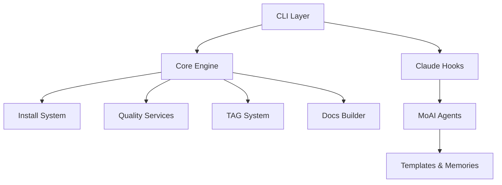

# MoAI-ADK (Modu-AI Agentic Development Kit)

[](https://github.com/modu-ai/moai-adk/releases)
[](LICENSE)
[](https://www.python.org/)
[](https://docs.anthropic.com/claude-code)
[](https://github.com/astral-sh/uv)

> 🇺🇸 English README is in progress. 영어판 README는 곧 추가됩니다.

---

## 📌 프로젝트 한눈에 보기

MoAI-ADK는 Claude Code 환경에서 SDD + TDD를 자동화하는 **모두의AI**에서 개발한 **Agentic Development Kit**입니다.

| 범주 | 핵심 내용 |
| --- | --- |
| 개발 철학 | 명세 우선 작성 → 테스트 → 구현 → 문서 동기화 |
| 자동화 수준 | 4단계 `/moai:*` 파이프라인 + 5종 `/moai:git:*` 워크플로우 |
| 품질 보증 | GuidelineChecker 기반 TRUST 게이트, 91.7% 기준 커버리지 |
| 추적성 | **100% @TAG 커버리지** + 16-Core @TAG 체계 + SQLite 인덱스 + sync 리포트 |
| 국제화 | 전역 영어화 완료, 추가 언어는 템플릿으로 확장 가능 |

---

## ⚡ 빠른 시작

```bash
# 1. 설치 (Python 3.11+ 필요)
uv pip install moai-adk               # 또는 pip install moai-adk

# 2. 새 프로젝트 초기화
moai init awesome-project
cd awesome-project

# 3. Claude Code에서 4단계 파이프라인 실행
/moai:0-project                     # 프로젝트 콘텍스트 문서화
/moai:1-spec                        # EARS 기반 스펙 도출
/moai:2-build                       # 테스트 우선 구현 (RED→GREEN→REFACTOR)
/moai:3-sync                        # 문서·TAG·PR 동기화
```

---

## 🏛️ 아키텍처 개요



- **CLI Layer**: `moai` 명령과 `/moai:*` 파이프라인을 제공하는 인터페이스
- **Core Engine**: config, quality, tag 시스템 등 도메인 로직을 구성
- **Claude Extensions**: `.claude/agents`, `hooks`, `commands`로 시나리오별 자동화를 담당
- **Docs Builder**: MkDocs + Material 기반 Living Documentation 파이프라인을 유지

---

## 🧭 Spec-First TDD 파이프라인


| 단계 | 핵심 작업 | 산출물 | 담당 에이전트 |
| --- | --- | --- | --- |
| `/moai:0-project` | 제품·구조·기술 인터뷰 | `.moai/project/*.md`, CLAUDE 메모리 | project-manager |
| `/moai:1-spec` | 요구사항 정제, 브랜치 전략 수립 | SPEC 문서 또는 Issue/PR 템플릿 | spec-builder |
| `/moai:2-build` | 테스트 우선 구현, 체크포인트 관리 | 테스트 코드, 구현, 자동 커밋 | code-builder |
| `/moai:3-sync` | 문서/릴리스 노트/TAG 동기화 | sync-report, docs 업데이트 | doc-syncer |

---

## 🤖 에이전트 생태계

| 에이전트 | 역할 | 대표 산출물 |
| --- | --- | --- |
| project-manager | 프로젝트 초기 인터뷰 및 구조화 | product/structure/tech 문서 |
| spec-builder | EARS 기반 SPEC 도출 및 ISSUE/PR 템플릿 생성 | SPEC, 브랜치 네이밍 |
| code-builder | RED→GREEN→REFACTOR 사이클 관리 | 테스트 & 구현 커밋, 체크포인트 |
| doc-syncer | Living Document와 TAG 갱신 | sync-report, release 노트 |
| cc-manager | Claude Code 설정/권한 최적화 | `.claude/settings.json` 유지 |
| git-manager | Git 자동화 5종 명령 제공 | checkpoint/rollback/worktree |

사용자는 `.claude/agents/` 아래에 도메인 맞춤 에이전트를 추가하여 자신만의 자동화를 확장할 수 있습니다.

---

## 🔐 TRUST 5원칙 요약

| 원칙 | 의미 | 실천 요소 |
| --- | --- | --- |
| Test First | 테스트가 명세를 검증하고 구현을 이끕니다. | Red-Green-Refactor, 회귀 테스트, 85% 이상 커버리지 |
| Readable | 누구나 이해 가능한 코드와 문서를 지향합니다. | 함수 ≤50 LOC, 명시적 네이밍, 구조화 주석 |
| Unified | 단일 책임과 낮은 결합을 유지합니다. | 모듈 ≤300 LOC, 계층 분리, 명확한 인터페이스 |
| Secured | 안전한 입출력과 로깅을 보장합니다. | 구조화 로깅, 민감 정보 마스킹, 입력 검증 |
| Trackable | 모든 변경을 추적 가능하게 기록합니다. | **100% @TAG 커버리지**, 16-Core TAG 시스템, sync-report, 의미 있는 커밋 |

GuidelineChecker가 코드 변경 시 위 원칙을 자동 점검하며, 위반 시 CLI에서 즉시 피드백합니다.

---

## 🏷️ 16-Core @TAG 추적 시스템

| 체인 | 태그 | 설명 |
| --- | --- | --- |
| Primary | `@REQ → @DESIGN → @TASK → @TEST` | 요구사항에서 테스트까지 필수 연계 |
| Steering | `@VISION → @STRUCT → @TECH → @ADR` | 방향성과 의사결정 기록 |
| Implementation | `@FEATURE → @API → @UI → @DATA` | 구현 세부 항목 추적 |
| Quality | `@PERF → @SEC → @DOCS → @TAG` | 성능·보안·문서·추적 품질 |

`/moai:3-sync`는 `.moai/indexes/tags.db`과 `.moai/reports/sync-report.md`를 갱신하여 요구사항 ↔ 구현 ↔ 테스트를 끊김 없이 연결합니다.

---

## 🧰 현대적 도구체인

| 언어/스택 | 자동 선택 도구 | 특징 |
| --- | --- | --- |
| Python | uv, ruff, pytest | 초고속 패키지 관리, 100배 빠른 린팅 |
| JavaScript/TypeScript | pnpm, biome, vitest | 워크스페이스 지원, AST 기반 포매터 |
| Go | go mod, golangci-lint, go test | 병렬 정적 분석, 모듈 캐시 활용 |
| Rust | cargo, clippy, cargo test | 표준 도구 연동, 린트/테스트 일관화 |
| Dart/Flutter | dart, flutter format/analyze/test | 모바일/크로스플랫폼 UI 테스트 자동화 |
| 기타 (Java, .NET, Swift 등) | 환경 감지 후 해당 언어 표준 도구 | 프로젝트 구성에 따른 자동 추천 |

`make -f Makefile.modern`을 사용하면 품질 검사, 벤치마크, 도구 정보 확인을 단일 명령으로 처리할 수 있습니다.

---

## 🛠️ 개발 환경 설정과 워크플로우

### 기본 설정 절차

```bash
# 리포지토리 클론 및 의존성 설치
git clone https://github.com/modu-ai/moai-adk.git
cd moai-adk
uv pip install -e .             # uv 권장
# 또는 pip install -e .

# 핵심 점검
make -f Makefile.modern quality  # 린트 + 타입 + 포맷 병렬 검사
make test                         # 통합 테스트 실행
make -f Makefile.modern benchmark # 도구체인 성능 확인
```

테스트 디렉터리는 `unit`, `integration`, `e2e`로 분리되어 있으며, 각 모듈 리팩토링 결과를 검증하는 전용 스위트를 제공합니다.

### Make 기반 자동화 명령

| 범주 | 주요 명령어 | 설명 |
| --- | --- | --- |
| Build | `make build`, `make build-force`, `make build-clean`, `make status` | 통합 Python 빌드 시스템 실행 및 산출물 검사 |
| Quality & Test | `make test`, `make test-coverage`, `make test-ci`, `make test-hooks`, `make test-build` | 전 범위 테스트, 커버리지 리포트, Hook/빌드 검증 |
| 환경 구성 | `make setup`, `make permissions`, `make deps`, `make validate`, `make help` | 개발 환경 초기화, 권한 및 설정 검증, 도움말 출력 |
| 버전 자동화 | `make version-check`, `make version-sync`, `make version-bump-{patch,minor,major}`, `make version-bump-*-auto`, `make version-status` | 통합 버전 일관성 검사, 동기화, 자동 재설치까지 포함한 버전 상승 |
| 패키지 검증 | `make test-package`, `make test-tools`, `make test-cross-platform`, `make test-full-compatibility` | 설치된 `moai` CLI, 도구 체인, 플랫폼 호환성을 단계별로 확인 |
| 릴리스 | `make release` | 빌드→테스트→검증 전체 파이프라인을 실행해 배포 가능 상태를 보장 |

`make version-*` 명령은 `scripts/version_manager.py`를 호출해 소스 코드, 패키지 메타데이터, 문서 버전을 동시에 갱신하며 `version-bump-*-auto`는 새로운 버전을 즉시 개발 모드로 재설치해 후속 작업을 빠르게 이어갈 수 있습니다.

---

## 📚 문서 & 참고 자료

- [MoAI-ADK Development Guide](docs/MOAI-ADK-GUIDE.md)
- [온라인 문서 사이트](https://moai-adk.github.io) — MkDocs Material 기반 Living Docs
- `docs/reference/` — API 문서 자동 생성 (85개 모듈 기준)
- `.moai/memory/development-guide.md` — TRUST 가이드와 Waiver 정책
- 예제 SPEC: `examples/specs/README.md`

---

## 🤝 기여 방법

1. GitHub Issue로 버그 또는 아이디어를 공유합니다.
2. Fork → 기능 개발 → 테스트 추가 → Pull Request를 생성합니다.
3. PR에는 TRUST 체크리스트, TAG 링크, sync-report 스냅샷을 포함하면 리뷰가 원활합니다.

컨트리뷰션 규칙은 `docs/CONTRIBUTING.md`에서 상세히 확인할 수 있습니다.

---

## 📝 라이선스

본 프로젝트는 [MIT License](LICENSE)를 따릅니다. 모든 기여 사항은 동일한 라이선스로 배포됩니다.

---

**"명세가 없으면 코드도 없다. 테스트가 없으면 구현도 없다."**

MoAI-ADK와 함께 Spec-First TDD 문화를 팀 전체로 확장해 보세요.
