# MoAI-ADK (Agentic Development Kit)

**SPEC-First TDD with AI SuperAgent & Complete Skills**

[](https://pypi.org/project/moai-adk/)
[](https://opensource.org/licenses/MIT)
[](https://www.python.org/)
[](https://github.com/modu-ai/moai-adk/actions/workflows/moai-gitflow.yml)
[](https://codecov.io/gh/modu-ai/moai-adk)
[](https://github.com/modu-ai/moai-adk)

> **A complete AI-powered development ecosystem that delivers SPEC → TEST → CODE → DOCUMENTATION in perfect sync.**

---

## 🌐 Quick Links

- **📚 Comprehensive Documentation**: [https://adk.mo.ai.kr](https://adk.mo.ai.kr)
- **🚀 Quick Start**: [Installation Guide](https://adk.mo.ai.kr/getting-started)
- **📖 API Reference**: [Commands & Skills](https://adk.mo.ai.kr/api)
- **💡 Examples & Tutorials**: [Learn More](https://adk.mo.ai.kr/examples)
- **🐛 Troubleshooting**: [Help Guide](https://adk.mo.ai.kr/troubleshooting)

---

## 🎯 Core Philosophy

**"No code without SPEC, no tests without code, no documentation without implementation"**

MoAI-ADK is an open-source framework that revolutionizes AI-powered development with a **SPEC-First TDD** approach. Led by the Alfred SuperAgent and a team of specialized AI agents, MoAI-ADK ensures every piece of code is traceable, tested, and documented.

---

## Key Features

### 🎯 SPEC-First Development
- Clear requirements before implementation
- EARS format for structured specifications
- Complete traceability from requirements to code

### 🧪 Auto TDD Workflow
- RED → GREEN → REFACTOR automatically
- 87.84%+ test coverage guaranteed
- Quality gates with TRUST 5 principles

### 🏷️ @TAG System
- Complete traceability from requirements to code
- Automatic impact analysis
- Orphan detection and chain validation

### 🤖 Alfred SuperAgent
- AI team that remembers your project context
- 19 specialized agents with 73+ production-ready skills
- Progressive skill loading for optimal performance

### 📚 Living Documentation
- Auto-synced docs that never drift from code
- Real-time documentation generation
- Multi-language support (Python, TypeScript, Go, Rust, etc.)

---

## 🚀 Getting Started

### Installation

```bash
# Install using uv (recommended)
uv install moai-adk

# Or using pip
pip install moai-adk
```

### 5-Minute Quick Start

```bash
# 1. Initialize your project
moai-adk init my-project

# 2. Create a specification
/alfred:1-plan "user authentication system"

# 3. Implement with TDD
/alfred:2-run AUTH-001

# 4. Sync documentation
/alfred:3-sync
```

---

## 🎯 The 4-Step Development Workflow

MoAI-ADK follows a simple 4-step workflow:

1. **`/alfred:0-project`** - Project setup and configuration
2. **`/alfred:1-plan`** - Create specifications using EARS format
3. **`/alfred:2-run`** - TDD implementation (RED → GREEN → REFACTOR)
4. **`/alfred:3-sync`** - Synchronize documentation and validate

---

## 🧠 How Alfred Processes Your Instructions - Detailed Workflow Analysis

Alfred orchestrates the complete development lifecycle through a systematic 4-step workflow. Here's how Alfred understands, plans, executes, and validates your requests:

### Step 1: Intent Understanding

**Goal**: Clarify user intent before any action

**How it works:**
- Alfred evaluates request clarity:
  - **HIGH clarity**: Technical stack, requirements, scope all specified → Skip to Step 2
  - **MEDIUM/LOW clarity**: Multiple interpretations possible → Alfred uses `AskUserQuestion` to clarify

**When Alfred asks clarifying questions:**
- Ambiguous requests (multiple interpretations)
- Architecture decisions needed
- Technology stack selections required
- Business/UX decisions involved

**Example:**
```
User: "Add authentication to the system"

Alfred's Analysis:
- Is it JWT, OAuth, or session-based? (UNCLEAR)
- Which authentication flow? (UNCLEAR)
- Multi-factor authentication needed? (UNCLEAR)

Action: Ask clarifying questions via AskUserQuestion
```

### Step 2: Plan Creation

**Goal**: Create a pre-approved execution strategy

**Process:**
1. **Mandatory Plan Agent Invocation**: Alfred calls the Plan agent to:
   - Decompose tasks into structured steps
   - Identify dependencies between tasks
   - Determine single vs parallel execution opportunities
   - Specify exactly which files will be created/modified/deleted
   - Estimate work scope and expected time

2. **User Plan Approval**: Alfred presents the plan via AskUserQuestion:
   - Share the complete file change list in advance
   - Explain implementation approach clearly
   - Disclose risk factors in advance

3. **TodoWrite Initialization**: Create task list based on approved plan:
   - List all task items explicitly
   - Define clear completion criteria for each task

**Example Plan for Authentication SPEC:**
```markdown
## Plan for SPEC-AUTH-001

### Files to be Created
- .moai/specs/SPEC-AUTH-001/spec.md
- .moai/specs/SPEC-AUTH-001/plan.md
- .moai/specs/SPEC-AUTH-001/acceptance.md

### Implementation Phases
1. RED: Write failing authentication tests
2. GREEN: Implement JWT token service
3. REFACTOR: Improve error handling and security
4. SYNC: Update documentation

### Risks
- Third-party service integration latency
- Token storage security considerations
```

### Step 3: Task Execution (Strict TDD Compliance)

**Goal**: Execute tasks following TDD principles with transparent progress tracking

**TDD Execution Cycle:**

**1. RED Phase** - Write failing tests first
- Write test code ONLY
- Tests should fail (intentionally)
- No implementation code changes
- Track progress: `TodoWrite: "RED: Write failing tests" → in_progress`

**2. GREEN Phase** - Minimal code to make tests pass
- Add ONLY minimal code necessary for test passing
- No over-engineering
- Focus on making tests pass
- Track progress: `TodoWrite: "GREEN: Minimal implementation" → in_progress`

**3. REFACTOR Phase** - Improve code quality
- Improve design while maintaining test passing
- Remove code duplication
- Enhance readability and maintainability
- Track progress: `TodoWrite: "REFACTOR: Improve code quality" → in_progress`

**TodoWrite Rules:**
- Each task: `content` (imperative), `activeForm` (present continuous), `status` (pending/in_progress/completed)
- **Exactly ONE task in_progress** at any time
- **Real-time Update Obligation**: Immediate status change on task start/completion
- **Strict Completion Criteria**: Mark completed only when tests pass, implementation complete, and error-free

**Forbidden during execution:**
- ❌ Implementation code changes during RED phase
- ❌ Over-engineering during GREEN phase
- ❌ Task execution without TodoWrite tracking
- ❌ Code generation without tests

**Real-World Example - Agent Model Directive Change:**

*Context:* User requested changing all agent model directives from `sonnet` to `inherit` to enable dynamic model selection

**Plan Approval:**
- 26 files to change (13 local + 13 template files)
- Files clearly identified: `implementation-planner.md`, `spec-builder.md`, etc.
- Risk: Merge conflicts on develop branch → Mitigated with `-X theirs` strategy

**RED Phase:**
- Write tests validating all agent files have `model: inherit`
- Verify template files match local files

**GREEN Phase:**
- Update 13 local agent files: `model: sonnet` → `model: inherit`
- Update 13 template agent files using Python script for portability
- Verify no other model directives changed

**REFACTOR Phase:**
- Review agent file consistency
- Ensure no orphaned changes
- Validate pre-commit hook passes

**Result:**
- All 26 files successfully updated
- Pre-commit @TAG validation passed
- Feature branch merged to develop with clean history

### Step 4: Report & Commit

**Goal**: Document work and create git history on demand

**Configuration Compliance First:**
- Check `.moai/config.json` `report_generation` settings
- If `enabled: false` → Provide status reports only, NO file generation
- If `enabled: true` AND user explicitly requests → Generate documentation files

**Git Commit:**
- Call git-manager for all Git operations
- Follow TDD commit cycle: RED → GREEN → REFACTOR
- Each commit message captures the workflow phase and purpose

**Example Commit Sequence:**

```bash
# RED: Write failing tests
commit 1: "test: Add authentication integration tests"

# GREEN: Minimal implementation
commit 2: "feat: Implement JWT token service (minimal)"

# REFACTOR: Improve quality
commit 3: "refactor: Enhance JWT error handling and security"

# Merge to develop
commit 4: "merge: Merge SPEC-AUTH-001 to develop"
```

**Project Cleanup:**
- Delete unnecessary temporary files
- Remove excessive backups
- Keep workspace organized and clean

---

### Visual Workflow Overview

```mermaid
flowchart TD
    Start["👤 USER REQUEST<br/>Add JWT authentication<br/>to the system"]

    Step1["🧠 STEP 1: UNDERSTAND<br/>Intent Clarity?"]

    HighClarity{"Request<br/>Clarity?"}

    LowClarity["❓ Ask Clarifying Qs<br/>AskUserQuestion"]
    UserRespond["💬 User Responds"]

    Step2["📋 STEP 2: PLAN<br/>• Call Plan Agent<br/>• Get User Approval<br/>• Init TodoWrite"]

    UserApprove["✅ User Approves Plan"]

    Step3["⚙️ STEP 3: EXECUTE<br/>RED → GREEN → REFACTOR<br/>Real-time TodoWrite<br/>Complete Tests"]

    TasksComplete["✓ All Tasks Done"]

    Step4["📝 STEP 4: REPORT<br/>• Check Config<br/>• Git Commit<br/>• Cleanup Files"]

    Done["✨ COMPLETE"]

    Start --> Step1
    Step1 --> HighClarity

    HighClarity -->|HIGH| Step2
    HighClarity -->|MEDIUM/LOW| LowClarity

    LowClarity --> UserRespond
    UserRespond --> Step2

    Step2 --> UserApprove
    UserApprove --> Step3

    Step3 --> TasksComplete
    TasksComplete --> Step4

    Step4 --> Done

    classDef inputStyle fill:#e5e5e5,stroke:#333,stroke-width:2px,color:#000
    classDef processStyle fill:#d3d3d3,stroke:#333,stroke-width:2px,color:#000
    classDef decisionStyle fill:#c0c0c0,stroke:#333,stroke-width:2px,color:#000
    classDef completeStyle fill:#a9a9a9,stroke:#333,stroke-width:2px,color:#000

    class Start inputStyle
    class Step1,Step2,Step3,Step4 processStyle
    class HighClarity,LowClarity,UserRespond,UserApprove,TasksComplete decisionStyle
    class Done completeStyle
```



---

### Key Decision Points

| Scenario | Alfred's Action | Outcome |
|----------|-----------------|---------|
| Clear, specific request | Skip to Step 2 (Plan) | Fast execution |
| Ambiguous request | AskUserQuestion in Step 1 | Correct understanding |
| Large multi-file changes | Plan Agent identifies all files | Complete visibility |
| Test failures during GREEN | Continue REFACTOR → Investigate | Quality maintained |
| Configuration conflicts | Check `.moai/config.json` first | Respect user settings |

---

### Quality Validation

After all 4 steps complete, Alfred validates:

✅ **Intent Understanding**: User intent clearly defined and approved?
✅ **Plan Creation**: Plan Agent plan created and user approved?
✅ **TDD Compliance**: RED-GREEN-REFACTOR cycle strictly followed?
✅ **Real-time Tracking**: All tasks transparently tracked with TodoWrite?
✅ **Configuration Compliance**: `.moai/config.json` settings strictly followed?
✅ **Quality Assurance**: All tests pass and code quality guaranteed?
✅ **Cleanup Complete**: Unnecessary files cleaned and project in clean state?

---

## The @TAG System

Every artifact in your project gets a unique `@TAG` identifier:

```
@SPEC:AUTH-001 (Requirements)
    ↓
@TEST:AUTH-001 (Tests)
    ↓
@CODE:AUTH-001:SERVICE (Implementation)
    ↓
@DOC:AUTH-001 (Documentation)
```

This creates complete traceability, allowing you to:
- Find all code affected by requirement changes
- Ensure no orphaned code or missing tests
- Navigate between related artifacts instantly

---

## 🏗️ Core Architecture

### Alfred SuperAgent
The orchestrator that manages 19 specialized agents and 73+ skills, ensuring consistent, high-quality development.

### Specialized Agents
- **spec-builder**: Creates detailed specifications
- **code-builder**: Implements TDD workflows
- **test-engineer**: Ensures comprehensive testing
- **git-manager**: Handles version control workflows
- **doc-syncer**: Manages documentation synchronization
- And 15+ domain-specific experts

### Claude Skills
73+ specialized capabilities that provide:
- Domain expertise (UI/UX, backend, security)
- Technical skills (testing, documentation, deployment)
- Quality assurance (linting, validation, compliance)
- Language-specific support (Python, TypeScript, Go, Rust, etc.)

---

## 🚀 Why MoAI-ADK?

### Traditional AI Development Problems
- ❌ Unclear requirements leading to wrong implementations
- ❌ Missing tests causing production bugs
- ❌ Documentation drifting from code
- ❌ Lost context and repeated explanations
- ❌ Impossible impact analysis

### MoAI-ADK Solutions
- ✅ **Clear SPECs** before any code is written
- ✅ **85%+ test coverage** guaranteed through TDD
- ✅ **Auto-synced documentation** that never drifts
- ✅ **Persistent context** remembered by Alfred
- ✅ **Instant impact analysis** with @TAG system

---

## 🌐 Community & Support

| Resource | Description |
|----------|-------------|
| **📚 Online Documentation** | [https://adk.mo.ai.kr](https://adk.mo.ai.kr) - Comprehensive guides and tutorials |
| **🏠 GitHub Repository** | [https://github.com/modu-ai/moai-adk](https://github.com/modu-ai/moai-adk) - Source code and issues |
| **🐛 Issues & Discussions** | [https://github.com/modu-ai/moai-adk/issues](https://github.com/modu-ai/moai-adk/issues) - Bug reports and feature requests |
| **📦 PyPI Package** | [https://pypi.org/project/moai-adk/](https://pypi.org/project/moai-adk/) - Installation |

---

## 📋 License

MIT License - see [LICENSE](LICENSE) file for details.

---

**MoAI-ADK** — SPEC-First TDD with AI SuperAgent

> Build trustworthy AI-powered software with complete traceability, guaranteed testing, and living documentation.

> **🚀 Get started now: `uv install moai-adk` and explore [https://adk.mo.ai.kr](https://adk.mo.ai.kr)**