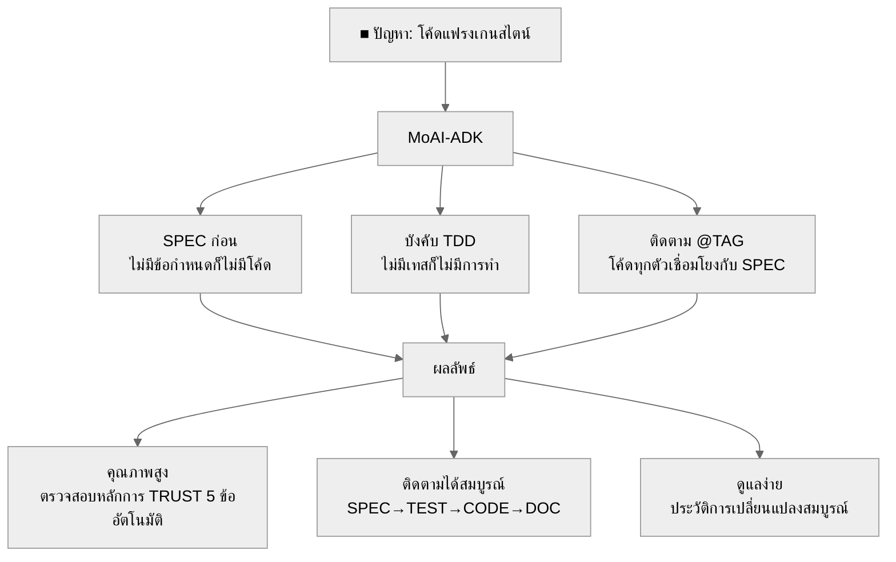

# MoAI-ADK (Agentic Development Kit)

[](https://pypi.org/project/moai-adk/)
[](https://opensource.org/licenses/MIT)
[](https://www.python.org/)
[](https://github.com/modu-ai/moai-adk/actions/workflows/moai-gitflow.yml)
[](https://codecov.io/gh/modu-ai/moai-adk)
[](https://github.com/modu-ai/moai-adk)

## MoAI-ADK: เฟรมเวิร์กพัฒนาโค้ดด้วย AI

**🌏 Languages**: [🇰🇷 한국어](./README.ko.md) | [🇺🇸 English](./README.md) | [🇯🇵 日本語](./README.ja.md) | [🇨🇳 中文](./README.zh.md) | 🇹🇭 ไทย


> **"ไม่มี SPEC ก็ไม่มี CODE"**

---

## MoAI-ADK คืออะไร?

MoAI-ADK เป็นชุดเครื่องมือพัฒนาซอフต์แวร์สากลที่ช่วยให้สามารถใช้ **วิธีการ SPEC-First TDD** ด้วยความช่วยเหลือจาก AI ซึ่งมอบเฟรมเวิร์กที่สมบูรณ์สำหรับการสร้างซอฟต์แวร์คุณภาพสูงผ่าน:

- 🎯 **การพัฒนาแบบ SPEC-First**: ทุกฟีเจอร์เริ่มต้นด้วยข้อกำหนดที่ชัดเจน
- 🧪 **การพัฒนาแบบ Test-Driven**: เขียนเทสก่อนเสมอ
- 🏷️ **การติดตาม @TAG**: ติดตามได้อย่างสมบูรณ์จาก SPEC → TEST → CODE → DOC
- 🤖 **Alfred SuperAgent**: ตัวจัดการ AI Agent ที่คอยควบคุม 18+ เอเจนต์ผู้เชี่ยวชาญ
- 🌍 **รองรับหลายภาษา**: ใช้ได้กับภาษาโปรแกรมมิ่งกว่า 20 ภาษา
- 🔒 **หลักการ TRUST 5 ข้อ**: การรับประกันคุณภาพอัตโนมัติ

---

## ปัญหาที่เราแก้ไข

### ความเป็นจริงของการเขียนโค้ดด้วย AI

- **"โค้ดที่ AI สร้างไม่สามารถดูแลรักษาได้..."**
  - ฟีเจอร์เดียวกันถูกทำต่างกันทุกครั้ง
  - สไตล์โค้ดไม่สอดคล้องกันในแต่ละไฟล์
  - ไม่มีเทส มีแต่บัก

- **"คำถามเดิม คำตอบต่างกันทุกครั้ง..."**
  - ไม่จำการสนทนาก่อนหน้า
  - ยากต่อการรักษาสถาปัตยกรรมที่สอดคล้อง
  - ขาดบริบทในระดับโปรเจกต์

- **"โค้ดเยอะ ไม่มีเอกสาร ติดตามไม่ได้..."**
  - ไม่รู้ว่าทำไมเขียนแบบนี้
  - ติดตามประวัติการเปลี่ยนแปลงโค้ดไม่ได้
  - ความต้องการและโค้ดไม่เชื่อมโยงกัน

- **"ใช้เวลาทั้งวันทำ prompt engineering..."**
  - ลองหลายสิบครั้งเพื่อหา prompt ที่สมบูรณ์แบบ
  - ต้องอธิบายข้อจำกัดเดิมซ้ำๆ ให้ AI ฟัง
  - ต้องตรวจสอบคุณภาพโค้ดด้วยตัวเอง

### โซลูชันจาก MoAI-ADK



---

## Alfred - ระบบนิเวศ AI Agent

สวัสดีครับ ผม **Alfred** MoAI SuperAgent!


ผมคือ SuperAgent และตัวจัดการกลางของ MoAI-ADK ผมประสานงาน **ทีม AI Agent** (Alfred + เอเจนต์ผู้เชี่ยวชาญหลายตัว) เพื่อให้การสนับสนุนการพัฒนาที่สมบูรณ์แบบในสภาพแวดล้อม Claude Code

### ▶ ข้อเท็จจริงที่น่าสนใจ: เครื่องมือพัฒนา AI ที่สร้างโดย AI

โค้ดของโปรเจกต์นี้ **เขียนด้วย AI 100%**

- **การออกแบบร่วมกันของ AI**: GPT-5 Pro และ Claude 4.1 Opus ออกแบบสถาปัตยกรรมร่วมกัน
- **ใช้ Agentic Coding**: ทีม AI agent (Alfred + เอเจนต์ผู้เชี่ยวชาญ) ทำการเขียน SPEC, ทำ TDD และซิงค์เอกสารด้วยตัวเอง
- **ความโปร่งใส**: โอเพนซอร์สที่ไม่ซ่อนส่วนที่ไม่สมบูรณ์ และปรับปรุงร่วมกับชุมชน

---

## เริ่มต้นด่วน (3 นาที)

### การติดตั้ง

```bash
# ติดตั้งผ่าน pip
pip install moai-adk

# ตรวจสอบการติดตั้ง
moai-adk --version
```

### เริ่มต้นโปรเจกต์แรกของคุณ

```bash
# เริ่มต้นในไดเรกทอรีปัจจุบัน
moai-adk init

# ทำตามพรอมต์แบบโต้ตอบ:
# - ชื่อโปรเจกต์
# - คำอธิบาย
# - ภาษาหลัก (Python, TypeScript, Java, Go, Rust ฯลฯ)
# - โหมด (Personal/Team)
# - ภาษา (ko/en/ja/zh/th)
```

### เวิร์กโฟลว์ 3 ขั้นตอน

```bash
# 1. เขียน SPEC (วิธี EARS)
/alfred:1-spec "ระบบการยืนยันตัวตนผู้ใช้"
→ สร้างเอกสาร SPEC
→ สร้าง feature branch
→ สร้าง Draft PR

# 2. ทำ TDD (RED → GREEN → REFACTOR)
/alfred:2-build AUTH-001
→ RED: เขียนเทสที่ล้มเหลว
→ GREEN: ทำขั้นต่ำให้ผ่าน
→ REFACTOR: ปรับปรุงคุณภาพโค้ด

# 3. ซิงค์เอกสาร (ตรวจสอบ TAG chain)
/alfred:3-sync
→ อัปเดต Living Document
→ ตรวจสอบความสมบูรณ์ของ @TAG chain
→ เปลี่ยน PR เป็น Ready
```

---

## ฟีเจอร์หลัก

### 1. วิธีการ SPEC-First TDD

การพัฒนาทุกอย่างเริ่มต้นด้วยเอกสาร SPEC:

```yaml
---
id: AUTH-001
version: 0.0.1
status: draft
created: 2025-10-20
priority: high
---

# @SPEC:AUTH-001: ระบบการยืนยันตัวตน JWT

## ความต้องการ (รูปแบบ EARS)

### Ubiquitous
- ระบบต้องให้บริการการยืนยันตัวตนแบบ JWT

### Event-driven
- WHEN ผู้ใช้ให้ข้อมูลรับรองที่ถูกต้อง ระบบต้องออก JWT token
- WHEN token หมดอายุ ระบบต้องส่งคืน error 401

### Constraints
- เวลาหมดอายุของ access token ต้องไม่เกิน 30 นาที
```

### 2. ระบบติดตาม @TAG

```
@SPEC:AUTH-001 → @TEST:AUTH-001 → @CODE:AUTH-001 → @DOC:AUTH-001
```

องค์ประกอบโค้ดทั้งหมดติดตามกลับไปยัง SPEC ผ่านระบบ @TAG

### 3. หลักการ TRUST 5 ข้อ

- **T**est First: เครื่องมือที่เหมาะสมสำหรับแต่ละภาษา (Jest/Vitest, pytest, go test, cargo test, JUnit, flutter test)
- **R**eadable: linter เฉพาะภาษา (ESLint/Biome, ruff, golint, clippy, dart analyze)
- **U**nified: ความปลอดภัยของประเภทหรือการตรวจสอบรันไทม์
- **S**ecured: เครื่องมือรักษาความปลอดภัยเฉพาะภาษาและการวิเคราะห์แบบ static
- **T**rackable: ระบบ @TAG แบบ CODE-FIRST (สแกนโค้ดโดยตรง)

### 4. รองรับภาษาสากล

**20+ ภาษาโปรแกรมมิ่ง**:
- Python, TypeScript, JavaScript, Java, Go, Rust
- Dart, Swift, Kotlin, PHP, Ruby, Elixir
- Scala, Clojure, C++, C, C#, Haskell, Shell, Lua

**แต่ละภาษามีชุดเครื่องมือที่ปรับแต่ง**:
- เฟรมเวิร์กทดสอบเฉพาะ
- Linter และ formatter
- ตัวจัดการแพ็กเกจ
- ระบบบิลด์

---

## 18 เอเจนต์ผู้เชี่ยวชาญ

Alfred ประสานงาน 18 เอเจนต์ผู้เชี่ยวชาญ:

### เอเจนต์หลัก (9)
| เอเจนต์ | บทบาท | ความเชี่ยวชาญ | คำสั่ง |
|-------|------|-----------|---------|
| **spec-builder** 🏗️ | สถาปนิกระบบ | การเขียน SPEC, EARS | `/alfred:1-spec` |
| **code-builder** 💎 | นักพัฒนาหลัก | การทำ TDD | `/alfred:2-build` |
| **doc-syncer** 📖 | นักเขียนเทคนิค | การซิงค์เอกสาร | `/alfred:3-sync` |
| **tag-agent** 🏷️ | ผู้จัดการความรู้ | การติดตาม TAG | `@agent-tag-agent` |
| **git-manager** 🚀 | วิศวกรปล่อยเวอร์ชัน | เวิร์กโฟลว์ Git | `@agent-git-manager` |
| **debug-helper** 🔬 | ผู้เชี่ยวชาญแก้ปัญหา | การวินิจฉัยข้อผิดพลาด | `@agent-debug-helper` |
| **trust-checker** ✅ | หัวหน้า QA | การตรวจสอบ TRUST | `@agent-trust-checker` |
| **cc-manager** 🛠️ | วิศวกร DevOps | การตั้งค่า Claude Code | `@agent-cc-manager` |
| **project-manager** 📋 | ผู้จัดการโปรเจกต์ | การเริ่มต้นโปรเจกต์ | `/alfred:0-project` |

### เอเจนต์ย่อย 0-project (6, ใหม่ใน v0.4.0)
| เอเจนต์ | บทบาท | ความเชี่ยวชาญ |
|-------|------|-------------|
| **language-detector** 🔍 | นักวิเคราะห์เทคโนโลยี | การตรวจจับภาษา/เฟรมเวิร์ก |
| **backup-merger** 📦 | วิศวกรข้อมูล | การรวมไฟล์สำรองอัจฉริยะ |
| **project-interviewer** 💬 | นักวิเคราะห์ธุรกิจ | การรวบรวมความต้องการ |
| **document-generator** 📝 | นักเขียนเทคนิค | การสร้างเอกสารอัตโนมัติ |
| **feature-selector** 🎯 | สถาปนิก | การเลือกสกิล (3-9 จาก 49) |
| **template-optimizer** ⚙️ | วิศวกร DevOps | การปรับแต่งเทมเพลต |

### เอเจนต์ในตัว (3, มาจาก Claude Code)
| เอเจนต์ | ความเชี่ยวชาญ | กรณีการใช้งาน |
|-------|------------|-------------|
| **Explore** 🔍 | การสำรวจโค้ดเบส | การนำทางโค้ดเบสขนาดใหญ่ |
| **general-purpose** | งานทั่วไป | เอเจนต์สำรอง |

---

## เอกสาร

- **เริ่มต้นด่วน**: [คู่มือเริ่มต้น](./docs/getting-started.md)
- **การเขียน SPEC**: [คู่มือวิธี EARS](./docs/spec-guide.md)
- **การทำ TDD**: [คู่มือการพัฒนา](./.moai/memory/development-guide.md)
- **ระบบ @TAG**: [ข้อกำหนด TAG](./.moai/memory/spec-metadata.md)
- **อ้างอิง CLI**: [อ้างอิงคำสั่ง](./docs/cli-reference.md)
- **เอกสาร API**: [API Docs](./docs/api/)

---

## การมีส่วนร่วม

เรายินดีรับการมีส่วนร่วม! โปรดดู [CONTRIBUTING.md](./CONTRIBUTING.md) สำหรับรายละเอียด

---

## ใบอนุญาต

MIT License - ดูรายละเอียดได้ที่ [LICENSE](./LICENSE)

---

## การสนับสนุน

- **GitHub Issues**: [รายงานบัคหรือขอฟีเจอร์](https://github.com/modu-ai/moai-adk/issues)
- **GitHub Discussions**: [ถามคำถามหรือแชร์ไอเดีย](https://github.com/modu-ai/moai-adk/discussions)
- **เอกสาร**: [เอกสารอย่างเป็นทางการ](./docs/)

---

**Made with ❤️ by MoAI Research Lab**

*MoAI-ADK เป็นส่วนหนึ่งของโปรเจกต์หนังสือ "(ชั่วคราว) Agentic Coding" โดย MoAI Research Lab*
