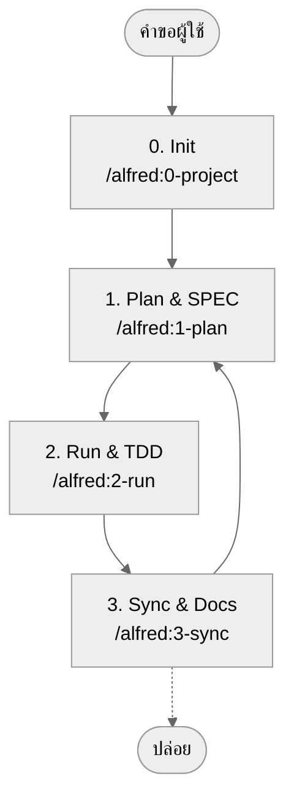

# MoAI-ADK (Agentic Development Kit)

[English](README.md) | [한국어](README.ko.md) | [ไทย](README.th.md) | [日本語](README.ja.md) | [中文](README.zh.md) | [हिन्दी](README.hi.md)

[](https://pypi.org/project/moai-adk/)
[](https://opensource.org/licenses/MIT)
[](https://www.python.org/)
[](https://github.com/modu-ai/moai-adk/actions/workflows/moai-gitflow.yml)
[](https://codecov.io/gh/modu-ai/moai-adk)
[](https://github.com/modu-ai/moai-adk)

> **MoAI-ADK นำเสนอเวิร์กโฟลว์การพัฒนาที่เชื่อมโยง SPEC → TDD → CODE → DOC อย่างเป็นธรรมชาติร่วมกับ AI**

---

## 1. MoAI-ADK สรุปแบบเข้าใจง่าย

MoAI-ADK ปฏิวัติการพัฒนาซอฟต์แวร์ร่วมกับ AI ด้วย 3 หลักการสำคัญ ใช้เมนูด้านล่างเพื่อข้ามไปยังส่วนที่เหมาะกับคุณ

หากคุณ**เพิ่งรู้จัก MoAI-ADK** เริ่มจาก "MoAI-ADK คืออะไร"
**หากต้องการเริ่มต้นอย่างรวดเร็ว** ข้ามไปที่ "Quick Start 5 นาที"
**หากติดตั้งแล้วและต้องการเข้าใจแนวคิด** แนะนำ "ทำความเข้าใจแนวคิดหลักอย่างง่าย"

| คำถาม                            | ข้ามไปที่                                                  |
| ------------------------------- | ------------------------------------------------------- |
| เพิ่งรู้จัก MoAI-ADK คืออะไร?         | [MoAI-ADK คืออะไร](#moai-adk-คืออะไร)                     |
| เริ่มต้นอย่างไร?                    | [Quick Start 5 นาที](#quick-start-5-นาที)                 |
| เวิร์กโฟลว์พื้นฐานคืออะไร?            | [เวิร์กโฟลว์พื้นฐาน (0 → 3)](#เวิร์กโฟลว์พื้นฐาน-0--3)            |
| คำสั่ง Plan / Run / Sync ทำอะไรบ้าง? | [สรุปคำสั่งหลัก](#สรุปคำสั่งหลัก)                                 |
| SPEC·TDD·TAG คืออะไร?            | [ทำความเข้าใจแนวคิดหลักอย่างง่าย](#ทำความเข้าใจแนวคิดหลักอย่างง่าย) |
| อยากรู้เรื่อง Agent/Skills          | [ภาพรวม Sub-agent & Skills](#ภาพรวม-sub-agent--skills)  |
| Claude Code Hooks ทำงานอย่างไร?   | [Claude Code Hooks คู่มือ](#claude-code-hooks-คู่มือ) |
| อยากทำโปรเจกต์ฝึก 4 สัปดาห์        | [แบบฝึกหัดที่สอง: Mini Kanban Board](#แบบฝึกหัดที่สอง-mini-kanban-board) |
| ต้องการศึกษาเพิ่มเติม                | [แหล่งข้อมูลเพิ่มเติม](#แหล่งข้อมูลเพิ่มเติม)                       |

---

## MoAI-ADK คืออะไร?

### ปัญหา: วิกฤตความน่าเชื่อถือในการพัฒนาด้วย AI

นักพัฒนาจำนวนมากต้องการความช่วยเหลือจาก Claude หรือ ChatGPT แต่ไม่สามารถหลุดพ้นจากข้อสงสัยพื้นฐานได้ **"โค้ดที่ AI สร้างนี้เชื่อถือได้จริงหรือไม่?"**

ความเป็นจริงคือ เมื่อบอก AI ให้ "สร้างฟีเจอร์ล็อกอิน" โค้ดที่ได้จะถูกต้องทางไวยากรณ์อย่างสมบูรณ์แบบ แต่ปัญหาเหล่านี้เกิดขึ้นซ้ำแล้วซ้ำเล่า:

- **ข้อกำหนดไม่ชัดเจน**: คำถามพื้นฐาน "ต้องสร้างอะไรกันแน่?" ไม่ได้รับคำตอบ ล็อกอินด้วยอีเมล/รหัสผ่าน? OAuth? 2FA? ทุกอย่างพึ่งการคาดเดา
- **ขาดการทดสอบ**: AI ส่วนใหญ่ทดสอบเฉพาะ "happy path" รหัสผ่านผิดล่ะ? เกิดเครือข่ายขัดข้องล่ะ? บั๊กจะแสดงตัวในโปรดักชันหลัง 3 เดือน
- **เอกสารไม่ตรงกัน**: แม้โค้ดจะแก้ไขแล้ว เอกสารยังเหมือนเดิม "ทำไมโค้ดนี้ถึงอยู่ที่นี่?" ถามซ้ำไปซ้ำมา
- **สูญเสียบริบท**: แม้ในโปรเจกต์เดียวกัน ก็ต้องอธิบายจากเริ่มต้นทุกครั้ง โครงสร้างโปรเจกต์ เหตุผลของการตัดสินใจ ความพยายามในอดีตไม่ถูกบันทึก
- **ไม่สามารถติดตามผลกระทบจากการเปลี่ยนแปลง**: เมื่อข้อกำหนดเปลี่ยน ไม่สามารถติดตามว่าโค้ดส่วนไหนได้รับผลกระทบ

### วิธีแก้: SPEC-First TDD with Alfred SuperAgent

**MoAI-ADK** (MoAI Agentic Development Kit) คือเฟรมเวิร์กโอเพนซอร์สที่ออกแบบมาเพื่อ**แก้ปัญหาเหล่านี้อย่างเป็นระบบ**

หลักการหลักง่าย แต่ทรงพลัง:

> **"ไม่มีโค้ดก็ไม่มีการทดสอบ ไม่มีการทดสอบก็ไม่มี SPEC"**

หรือแม่นยำกว่านั้น เรียงย้อนกลับ:

> **"SPEC มาก่อน ไม่มี SPEC ก็ไม่มีการทดสอบ ไม่มีการทดสอบและโค้ดก็ไม่มีเอกสารที่สมบูรณ์"**

เมื่อทำตามลำดับนี้ สิ่งมหัศจรรย์จะเกิดขึ้น:

**1️⃣ ข้อกำหนดที่ชัดเจน**
ใช้คำสั่ง `/alfred:1-plan` เพื่อเขียน SPEC ก่อน คำขอที่คลุมเครือ "ฟีเจอร์ล็อกอิน" จะถูกแปลงเป็น**ข้อกำหนดที่ชัดเจน** เช่น "WHEN มีการส่งข้อมูลรับรองที่ถูกต้อง ระบบต้องออก JWT token" spec-builder ของ Alfred ใช้ไวยากรณ์ EARS สร้าง SPEC ระดับมืออาชีพภายใน 3 นาที

**2️⃣ การรับประกันการทดสอบ**
`/alfred:2-run` ดำเนินการพัฒนาแบบ Test-Driven (TDD) โดยอัตโนมัติ ผ่านลำดับ RED (ทดสอบที่ล้มเหลว) → GREEN (การสร้างขั้นต่ำ) → REFACTOR (ปรับปรุงโค้ด) **รับประกันความครอบคลุมการทดสอบ 85% ขึ้นไป** ไม่มี "ทดสอบทีหลัง" อีกต่อไป การทดสอบนำทางการเขียนโค้ด

**3️⃣ ซิงค์เอกสารอัตโนมัติ**
คำสั่ง `/alfred:3-sync` เพียงคำสั่งเดียว ทำให้โค้ด การทดสอบ และเอกสารทั้งหมด**ซิงค์เป็นเวอร์ชันล่าสุด** README, CHANGELOG, เอกสาร API และ Living Document อัปเดตโดยอัตโนมัติ หลัง 6 เดือน โค้ดและเอกสารยังตรงกัน

**4️⃣ ติดตามด้วยระบบ @TAG**
ติด `@TAG:ID` ในโค้ด การทดสอบ และเอกสารทั้งหมด หากข้อกำหนดเปลี่ยนภายหลัง เพียงคำสั่ง `rg "@SPEC:AUTH-001"` สามารถ**ค้นหาการทดสอบ การสร้าง และเอกสารที่เกี่ยวข้องทั้งหมด** เพิ่มความมั่นใจในการรีแฟกเตอร์

**5️⃣ Alfred จำบริบทได้**
AI ตัวแทน  ทำงานร่วมกันเพื่อ**จดจำโครงสร้างโปรเจกต์ เหตุผลของการตัดสินใจ และประวัติการทำงานทั้งหมด** ไม่ต้องถามซ้ำ

### สัญญา 3 ประการของ MoAI-ADK

เพื่อให้ผู้เริ่มต้นจำได้ง่าย มูลค่าของ MoAI-ADK สรุปได้ 3 ข้อ:

**ประการแรก SPEC มาก่อนโค้ด**
เริ่มด้วยการกำหนดอย่างชัดเจนว่าจะสร้างอะไร การเขียน SPEC ทำให้พบปัญหาก่อนการสร้าง ลดต้นทุนการสื่อสารกับทีมงานอย่างมาก

**ประการที่สอง การทดสอบนำทางโค้ด (TDD)**
เขียนการทดสอบก่อนการสร้าง (RED) สร้างขั้นต่ำเพื่อผ่านการทดสอบ (GREEN) แล้วปรับปรุงโค้ด (REFACTOR) ผลลัพธ์: บั๊กน้อย มั่นใจในการรีแฟกเตอร์ โค้ดที่ทุกคนเข้าใจได้

**ประการที่สาม เอกสารและโค้ดตรงกันเสมอ**
คำสั่ง `/alfred:3-sync` เพียงคำสั่งเดียว ทำให้เอกสารทั้งหมดอัปเดตอัตโนมัติ README, CHANGELOG, เอกสาร API, Living Document ซิงค์กับโค้ดเสมอ หายไปหมดสิ้นความสิ้นหวังเมื่อต้องแก้ไขโค้ดเก่า 6 เดือน

---

## ทำไมต้องใช้?

### ความท้าทายจริงของการพัฒนาด้วย AI

การพัฒนาร่วมกับ AI สมัยใหม่เผชิญกับความท้าทายหลากหลาย MoAI-ADK **แก้ปัญหาทั้งหมดเหล่านี้อย่างเป็นระบบ**:

| ความกังวล             | ปัญหาของวิธีเดิม                           | วิธีแก้ของ MoAI-ADK                                   |
| -------------------- | -------------------------------------- | -------------------------------------------------- |
| "ไม่เชื่อโค้ด AI"        | การสร้างโดยไม่มีการทดสอบ วิธีตรวจสอบไม่ชัดเจน | บังคับลำดับ SPEC → TEST → CODE รับประกันความครอบคลุม 85%+ |
| "ต้องอธิบายซ้ำทุกครั้ง"     | สูญเสียบริบท ไม่บันทึกประวัติโปรเจกต์           | Alfred จำข้อมูลทั้งหมด ทีม AI 19 คนทำงานร่วมกัน             |
| "ยากต่อการเขียนพรอมต์"  | ไม่รู้วิธีสร้างพรอมต์ที่ดี                       | คำสั่ง `/alfred` มีพรอมต์มาตรฐานให้โดยอัตโนมัติ             |
| "เอกสารเก่าเสมอ"      | ลืมอัปเดตเอกสารหลังแก้โค้ด                  | `/alfred:3-sync` คำสั่งเดียวซิงค์อัตโนมัติ                  |
| "ไม่รู้แก้ไขตรงไหน"      | ค้นหาโค้ดยาก เจตนาไม่ชัดเจน                | เชื่อมโยง SPEC → TEST → CODE → DOC ด้วยเชน @TAG       |
| "ออนบอร์ดทีมใช้เวลานาน" | สมาชิกใหม่เข้าใจบริบทโค้ดไม่ได้               | อ่าน SPEC เข้าใจเจตนาได้ทันที                           |

### ประโยชน์ที่สัมผัสได้ทันทีตั้งแต่เริ่มใช้

จากการใช้ MoAI-ADK คุณจะรู้สึกได้ทันที:

- **เพิ่มความเร็วในการพัฒนา**: SPEC ที่ชัดเจนลดเวลาอธิบายไปมา
- **ลดบั๊ก**: การทดสอบจาก SPEC พบปัญหาล่วงหน้า
- **เพิ่มความเข้าใจโค้ด**: เข้าใจเจตนาทันทีด้วย @TAG และ SPEC
- **ลดต้นทุนการบำรุงรักษา**: โค้ดและเอกสารตรงกันเสมอ
- **เพิ่มประสิทธิภาพการทำงานร่วมกัน**: สื่อสารชัดเจนด้วย SPEC และ TAG

---

## Quick Start 5 นาที

มาเริ่มโปรเจกต์แรกด้วย MoAI-ADK กันเถอะ ทำตาม 5 ขั้นตอนด้านล่าง **ภายใน 5 นาที** โปรเจกต์ที่เชื่อมโยง SPEC, TDD และเอกสารสมบูรณ์

### ขั้นตอน 1: ติดตั้ง uv (ประมาณ 30 วินาที)

ติดตั้ง `uv` ก่อน `uv` คือตัวจัดการแพ็คเกจ Python ความเร็วสูงที่เขียนด้วย Rust **เร็วกว่า `pip` เดิมมากกว่า 10 เท่า** และใช้งานได้สมบูรณ์แบบกับ MoAI-ADK

```bash
# macOS/Linux
curl -LsSf https://astral.sh/uv/install.sh | sh

# Windows (PowerShell)
powershell -c "irm https://astral.sh/uv/install.ps1 | iex"

# ตรวจสอบการติดตั้ง
uv --version
# ผลลัพธ์: uv 0.x.x
```

**ทำไมต้อง uv?** MoAI-ADK ได้รับการปรับให้ใช้ประโยชน์จากความเร็วในการติดตั้งและความเสถียรของ uv การแยกโปรเจกต์สมบูรณ์แบบจึงไม่กระทบสภาพแวดล้อม Python อื่น

### ขั้นตอน 2: ติดตั้ง MoAI-ADK (ประมาณ 1 นาที)

ติดตั้ง MoAI-ADK เป็นเครื่องมือทั่วโลก ไม่กระทบการพึ่งพาโปรเจกต์

```bash
# ติดตั้งในโหมด tool (แนะนำ: ทำงานในสภาพแวดล้อมแยก)
uv tool install moai-adk

# ตรวจสอบการติดตั้ง
moai-adk --version
# ผลลัพธ์: MoAI-ADK v0.4.6
```

หลังจากติดตั้ง คำสั่ง `moai-adk` ใช้ได้ทุกที่

### ขั้นตอน 3: สร้างโปรเจกต์ (ประมาณ 1 นาที)

**หากต้องการเริ่มโปรเจกต์ใหม่:**
```bash
moai-adk init my-project
cd my-project
```

**หากต้องการเพิ่มในโปรเจกต์ที่มีอยู่:**
```bash
cd your-existing-project
moai-adk init .
```

คำสั่งเดียวนี้สร้างโดยอัตโนมัติ:

```
my-project/
├── .moai/                   # การตั้งค่าโปรเจกต์ MoAI-ADK
│   ├── config.json
│   ├── project/             # ข้อมูลโปรเจกต์
│   ├── specs/               # ไฟล์ SPEC
│   └── reports/             # รายงานการวิเคราะห์
├── .claude/                 # การทำงานอัตโนมัติของ Claude Code
│   ├── agents/              # ทีม AI 19 คน
│   ├── commands/            # คำสั่ง /alfred
│   ├── skills/              # 
│   └── settings.json
├── src/                     # โค้ดการสร้าง
├── tests/                   # โค้ดการทดสอบ
├── docs/                    # เอกสารสร้างอัตโนมัติ
└── README.md
```

### ขั้นตอน 4: เริ่ม Alfred ใน Claude Code (ประมาณ 2 นาที)

เรียกใช้ Claude Code และเรียก Alfred SuperAgent:

```bash
# เรียกใช้ Claude Code
claude
```

จากนั้นพิมพ์ในช่องคำสั่งของ Claude Code:

```
/alfred:0-project
```

คำสั่งนี้ทำสิ่งต่อไปนี้:

1. **รวบรวมข้อมูลโปรเจกต์**: "ชื่อโปรเจกต์?", "เป้าหมาย?", "ภาษาหลัก?"
2. **ตรวจจับเทคโนโลยีอัตโนมัติ**: ตรวจจับ Python/JavaScript/Go ฯลฯ โดยอัตโนมัติ
3. **วาง Skill Pack**: เตรียม Skills ที่จำเป็นจาก 56 Skills ตามภาษา
4. **สร้างรายงานเริ่มต้น**: โครงสร้างโปรเจกต์ แนะนำขั้นตอนถัดไป

### ขั้นตอน 5: เขียน SPEC แรก (ประมาณ 1 นาที)

หลังจากเริ่มต้นโปรเจกต์ เขียนฟีเจอร์แรกเป็น SPEC:

```
/alfred:1-plan "ฟีเจอร์ลงทะเบียนผู้ใช้"
```

สิ่งที่สร้างโดยอัตโนมัติ:
- `@SPEC:USER-001` - กำหนด ID ไม่ซ้ำ
- `.moai/specs/SPEC-USER-001/spec.md` - SPEC ระดับมืออาชีพในรูปแบบ EARS
- `feature/spec-user-001` - สร้างสาขา Git อัตโนมัติ

### ขั้นตอน 6: การสร้างแบบ TDD (ประมาณ 3 นาที)

เมื่อเขียน SPEC แล้ว สร้างด้วยวิธี TDD:

```
/alfred:2-run USER-001
```

คำสั่งนี้ดำเนินการ:
- 🔴 **RED**: เขียนการทดสอบที่ล้มเหลวโดยอัตโนมัติ (`@TEST:USER-001`)
- 🟢 **GREEN**: ผ่านการทดสอบด้วยการสร้างขั้นต่ำ (`@CODE:USER-001`)
- ♻️ **REFACTOR**: ปรับปรุงคุณภาพโค้ด

### ขั้นตอน 7: ซิงค์เอกสาร (ประมาณ 1 นาที)

สุดท้ายซิงค์เอกสารทั้งหมดอัตโนมัติ:

```
/alfred:3-sync
```

สิ่งที่สร้าง/อัปเดตโดยอัตโนมัติ:
- Living Document (เอกสาร API)
- อัปเดต README
- สร้าง CHANGELOG
- ตรวจสอบเชน @TAG

### เสร็จสิ้น!

หลังจาก 7 ขั้นตอน ทุกอย่างพร้อม:

✅ เอกสารข้อกำหนด (SPEC)
✅ โค้ดการทดสอบ (ความครอบคลุม 85%+)
✅ โค้ดการสร้าง (ติดตามด้วย @TAG)
✅ เอกสาร API (สร้างอัตโนมัติ)
✅ ประวัติการเปลี่ยนแปลง (CHANGELOG)
✅ ประวัติ Git commit (RED/GREEN/REFACTOR)

**ทั้งหมดสำเร็จภายใน 15 นาที!**

### ตรวจสอบผลลัพธ์ที่สร้าง

ตรวจสอบว่าผลลัพธ์ที่สร้างถูกต้องจริง:

```bash
# 1. ตรวจสอบเชน TAG (SPEC → TEST → CODE → DOC)
rg '@(SPEC|TEST|CODE):USER-001' -n

# 2. เรียกใช้การทดสอบ
pytest tests/ -v

# 3. ตรวจสอบเอกสารที่สร้าง
cat docs/api/user.md
cat README.md
```

> 🔍 **คำสั่งตรวจสอบ**: `moai-adk doctor` — ตรวจสอบเวอร์ชัน Python/uv โครงสร้าง `.moai/` ว่า agent/Skills พร้อมหรือไม่
> ```bash
> moai-adk doctor
> ```
> หากเครื่องหมายถูกสีเขียวทั้งหมด คุณพร้อมสมบูรณ์แบบ!

---

## รักษา MoAI-ADK เป็นเวอร์ชันล่าสุด

### ตรวจสอบเวอร์ชัน
```bash
# ตรวจสอบเวอร์ชันที่ติดตั้งปัจจุบัน
moai-adk --version

# ตรวจสอบเวอร์ชันล่าสุดจาก PyPI
uv tool list  # ตรวจสอบเวอร์ชันปัจจุบันของ moai-adk
```

### อัปเกรด

#### วิธีที่ 1: คำสั่งอัปเดต moai-adk เอง (ง่ายที่สุด)
```bash
# คำสั่งอัปเดต MoAI-ADK เอง - อัปเดตทั้งเทมเพลต agent/Skills
moai-adk update

# หลังอัปเดต ใช้เทมเพลตใหม่กับโปรเจกต์ (ตัวเลือก)
moai-adk init .
```

#### วิธีที่ 2: อัปเกรดด้วยคำสั่ง uv tool

**อัปเกรดเฉพาะเครื่องมือหนึ่งตัว (แนะนำ)**
```bash
# อัปเกรดเฉพาะ moai-adk เป็นเวอร์ชันล่าสุด
uv tool upgrade moai-adk
```

**อัปเกรดเครื่องมือที่ติดตั้งทั้งหมด**
```bash
# อัปเกรดเครื่องมือ uv tool ทั้งหมดเป็นเวอร์ชันล่าสุด
uv tool update
```

**ติดตั้งเวอร์ชันเฉพาะ**
```bash
# ติดตั้งเวอร์ชันเฉพาะใหม่ (เช่น 0.4.2)
uv tool install moai-adk==0.4.2
```

### ตรวจสอบหลังอัปเดต
```bash
# 1. ตรวจสอบเวอร์ชันที่ติดตั้ง
moai-adk --version

# 2. ตรวจสอบโปรเจกต์ทำงานปกติ
moai-adk doctor

# 3. ใช้เทมเพลตใหม่กับโปรเจกต์ที่มีอยู่ (หากจำเป็น)
cd your-project
moai-adk init .  # รักษาโค้ดเดิม อัปเดตเฉพาะโครงสร้าง .moai/ และเทมเพลต

# 4. ตรวจสอบฟีเจอร์ใหม่ที่อัปเดตใน Alfred
cd your-project
claude
/alfred:0-project  # ตรวจสอบฟีเจอร์ใหม่เช่นการเลือกภาษา
```

> 💡 **คำแนะนำ**:
> - `moai-adk update`: อัปเดตเวอร์ชันแพ็คเกจ MoAI-ADK + ซิงค์เทมเพลต agent/Skills
> - `moai-adk init .`: ใช้เทมเพลตใหม่กับโปรเจกต์ที่มีอยู่ (รักษาโค้ดอย่างปลอดภัย)
> - ใช้ทั้งสองคำสั่งร่วมกันเพื่ออัปเดตสมบูรณ์
> - เมื่อมีการอัปเดตหลัก (minor/major) ใช้ขั้นตอนข้างต้นเพื่อใช้งาน agent/Skills ใหม่

---

## เวิร์กโฟลว์พื้นฐาน (0 → 3)

Alfred ใช้สี่คำสั่งเพื่อพัฒนาโปรเจกต์แบบวนซ้ำ



### 0. INIT — เตรียมโปรเจกต์
- ถามข้อมูลโปรเจกต์ เป้าหมาย ภาษา โหมด (locale)
- สร้าง `.moai/config.json`, `.moai/project/*` เอกสาร 5 ไฟล์อัตโนมัติ
- ตรวจจับภาษา วาง Skill Pack ที่แนะนำ (Foundation + Essentials + Domain/Language)
- ปรับเทมเพลต ตรวจสอบ Git/สำรองเริ่มต้น

### 1. PLAN — ตกลงสิ่งที่จะสร้าง
- เขียน SPEC ด้วยเทมเพลต EARS (รวม `@SPEC:ID`)
- จัดระเบียบ Plan Board ไอเดียการสร้าง ปัจจัยเสี่ยง
- หากโหมด Team สร้างสาขา/Draft PR เริ่มต้นอัตโนมัติ

### 2. RUN — การพัฒนาแบบ Test-Driven (TDD)
- Phase 1 `implementation-planner`: ออกแบบไลบรารี โฟลเดอร์ TAG
- Phase 2 `tdd-implementer`: RED (ทดสอบล้มเหลว) → GREEN (สร้างขั้นต่ำ) → REFACTOR (ปรับปรุง)
- quality-gate ตรวจสอบหลักการ TRUST 5 ข้อ การเปลี่ยนแปลงความครอบคลุม

### 3. SYNC — จัดเรียงเอกสาร & PR
- ซิงค์เอกสาร Living Document, README, CHANGELOG ฯลฯ
- ตรวจสอบเชน TAG และกู้คืน orphan TAG
- สร้าง Sync Report แปลง Draft → Ready for Review รองรับตัวเลือก `--auto-merge`

---

## สรุปคำสั่งหลัก

| คำสั่ง                       | ทำอะไร?                                            | ผลลัพธ์หลัก                                                           |
| ------------------------- | ------------------------------------------------- | ------------------------------------------------------------------ |
| `/alfred:0-project`       | รวบรวมคำอธิบายโปรเจกต์ สร้างการตั้งค่า·เอกสาร แนะนำ Skill | `.moai/config.json`, `.moai/project/*`, รายงานเริ่มต้น                |
| `/alfred:1-plan <คำอธิบาย>` | วิเคราะห์ข้อกำหนด ร่าง SPEC เขียน Plan Board            | `.moai/specs/SPEC-*/spec.md`, เอกสาร plan/acceptance, สาขา feature |
| `/alfred:2-run <SPEC-ID>` | ดำเนินการ TDD ทดสอบ/สร้าง/รีแฟกเตอร์ ตรวจสอบคุณภาพ      | `tests/`, การสร้าง `src/`, รายงานคุณภาพ เชื่อมโยง TAG                  |
| `/alfred:3-sync`          | ซิงค์เอกสาร/README/CHANGELOG จัดสถานะ TAG/PR         | `docs/`, `.moai/reports/sync-report.md`, Ready PR                  |

> ❗ คำสั่งทั้งหมดรักษาโครงสร้างแบบวน **Phase 0(ตัวเลือก) → Phase 1 → Phase 2 → Phase 3** Alfred รายงานสถานะและแนะนำขั้นตอนถัดไปโดยอัตโนมัติระหว่างดำเนินการ

---

## ทำความเข้าใจแนวคิดหลักอย่างง่าย

MoAI-ADK ประกอบด้วย 5 แนวคิดหลัก แต่ละแนวคิดเชื่อมโยงกัน เมื่อทำงานร่วมกันจะสร้างระบบพัฒนาที่ทรงพลัง

### แนวคิดหลัก 1: SPEC-First (ข้อกำหนดมาก่อน)

**คำเปรียบเทียบ**: เช่นเดียวกับการสร้างอาคารโดยไม่มีสถาปนิก ห้ามเขียนโค้ดโดยไม่มีพิมพ์เขียว

**หัวใจ**: ก่อนการสร้าง **กำหนดอย่างชัดเจนว่า "จะสร้างอะไร"** นี่ไม่ใช่แค่เอกสารธรรมดา แต่เป็น**สเปกที่ดำเนินการได้**ที่ทั้งทีมและ AI สามารถเข้าใจร่วมกัน

**5 รูปแบบของไวยากรณ์ EARS**:

1. **Ubiquitous** (ฟีเจอร์พื้นฐาน): "ระบบต้องมีการรับรองความถูกต้องแบบ JWT"
2. **Event-driven** (ตามเงื่อนไข): "WHEN มีการส่งข้อมูลรับรองที่ถูกต้อง ระบบต้องออก token"
3. **State-driven** (ในระหว่างสถานะ): "WHILE ผู้ใช้ได้รับการรับรองแล้ว ระบบต้องอนุญาตให้เข้าถึงทรัพยากรที่ป้องกัน"
4. **Optional** (ตัวเลือก): "WHERE มี refresh token ระบบสามารถออก token ใหม่"
5. **Constraints** (ข้อจำกัด): "เวลาหมดอายุ token ต้องไม่เกิน 15 นาที"

**อย่างไร?** คำสั่ง `/alfred:1-plan` สร้าง SPEC ระดับมืออาชีพในรูปแบบ EARS โดยอัตโนมัติ

**สิ่งที่ได้รับ**:
- ✅ ข้อกำหนดที่ชัดเจนที่ทุกคนในทีมเข้าใจ
- ✅ กรณีทดสอบจาก SPEC (กำหนดแล้วว่าจะทดสอบอะไร)
- ✅ เมื่อข้อกำหนดเปลี่ยน ติดตามโค้ดที่ได้รับผลกระทบทั้งหมดด้วย TAG `@SPEC:ID`

---

### แนวคิดหลัก 2: TDD (Test-Driven Development)

**คำเปรียบเทียบ**: เช่นเดียวกับการกำหนดจุดหมายก่อนหาเส้นทาง กำหนดเป้าหมายด้วยการทดสอบแล้วเขียนโค้ด

**หัวใจ**: เขียนการทดสอบก่อน**ก่อน**การสร้าง เหมือนกับการตรวจสอบวัตถุดิบก่อนทำอาหาร ทำให้ชัดเจนว่าข้อกำหนดคืออะไรก่อนการสร้าง

**วงจร 3 ขั้นตอน**:

1. **🔴 RED**: เขียนการทดสอบที่ล้มเหลวก่อน
   - แต่ละข้อกำหนดของ SPEC กลายเป็นกรณีทดสอบ
   - เนื่องจากยังไม่มีการสร้าง ต้องล้มเหลว
   - Git commit: `test(AUTH-001): add failing test`

2. **🟢 GREEN**: สร้างขั้นต่ำเพื่อผ่านการทดสอบ
   - ผ่านการทดสอบด้วยวิธีที่ง่ายที่สุด
   - การผ่านมาก่อนความสมบูรณ์แบบ
   - Git commit: `feat(AUTH-001): implement minimal solution`

3. **♻️ REFACTOR**: ปรับปรุงและเพิ่มประสิทธิภาพโค้ด
   - ใช้หลักการ TRUST 5 ข้อ
   - ลดการซ้ำซ้อน เพิ่มความสามารถในการอ่าน
   - การทดสอบยังต้องผ่าน
   - Git commit: `refactor(AUTH-001): improve code quality`

**อย่างไร?** คำสั่ง `/alfred:2-run` ดำเนินการ 3 ขั้นตอนนี้โดยอัตโนมัติ

**สิ่งที่ได้รับ**:
- ✅ รับประกันความครอบคลุม 85% ขึ้นไป (ไม่มีโค้ดโดยไม่มีการทดสอบ)
- ✅ มั่นใจในการรีแฟกเตอร์ (ตรวจสอบด้วยการทดสอบได้ทุกเมื่อ)
- ✅ ประวัติ Git ที่ชัดเจน (ติดตามกระบวนการ RED → GREEN → REFACTOR)

---

### แนวคิดหลัก 3: ระบบ @TAG

**คำเปรียบเทียบ**: เช่นเดียวกับใบส่งพัสดุ ต้องสามารถติดตามเส้นทางของโค้ด

**หัวใจ**: ติด `@TAG:ID` ทุก SPEC การทดสอบ โค้ด เอกสาร เพื่อสร้าง**การจับคู่แบบหนึ่งต่อหนึ่ง**

**เชน TAG**:
```
@SPEC:AUTH-001 (ข้อกำหนด)
    ↓
@TEST:AUTH-001 (การทดสอบ)
    ↓
@CODE:AUTH-001 (การสร้าง)
    ↓
@DOC:AUTH-001 (เอกสาร)
```

**กฎ TAG ID**: `<โดเมน>-<ตัวเลข 3 หลัก>`
- AUTH-001, AUTH-002, AUTH-003...
- USER-001, USER-002...
- เมื่อกำหนดแล้ว **ห้ามเปลี่ยนแปลง**

**วิธีใช้?** เมื่อข้อกำหนดเปลี่ยน:
```bash
# ค้นหาทุกอย่างที่เกี่ยวข้องกับ AUTH-001
rg '@TAG:AUTH-001' -n

# ผลลัพธ์: แสดง SPEC, TEST, CODE, DOC ทั้งหมดพร้อมกัน
# → ชัดเจนว่าต้องแก้ไขตรงไหน
```

**อย่างไร?** คำสั่ง `/alfred:3-sync` ตรวจสอบเชน TAG และตรวจจับ orphan TAG (TAG ที่ไม่ตรงกัน)

**สิ่งที่ได้รับ**:
- ✅ เจตนาของโค้ดทุกชิ้นชัดเจน (อ่าน SPEC เข้าใจว่าทำไมมีโค้ดนี้)
- ✅ ระบุโค้ดที่ได้รับผลกระทบทั้งหมดได้ทันทีเมื่อรีแฟกเตอร์
- ✅ เข้าใจโค้ดได้แม้หลัง 3 เดือน (ติดตาม TAG → SPEC)

---

### แนวคิดหลัก 4: หลักการ TRUST 5 ข้อ

**คำเปรียบเทียบ**: เช่นเดียวกับร่างกายที่แข็งแรง โค้ดที่ดีต้องตอบสนองทั้ง 5 องค์ประกอบ

**หัวใจ**: โค้ดทั้งหมดต้องปฏิบัติตามหลักการ 5 ข้อต่อไปนี้ `/alfred:3-sync` ตรวจสอบโดยอัตโนมัติ

1. **🧪 Test First** (การทดสอบมาก่อน)
   - ความครอบคลุมการทดสอบ ≥ 85%
   - โค้ดทั้งหมดได้รับการป้องกันด้วยการทดสอบ
   - เพิ่มฟีเจอร์ = เพิ่มการทดสอบ

2. **📖 Readable** (โค้ดอ่านง่าย)
   - ฟังก์ชัน ≤ 50 บรรทัด ไฟล์ ≤ 300 บรรทัด
   - ชื่อตัวแปรแสดงเจตนา
   - ผ่าน linter (ESLint/ruff/clippy)

3. **🎯 Unified** (โครงสร้างสอดคล้อง)
   - รักษาสถาปัตยกรรมจาก SPEC
   - รูปแบบเดียวกันซ้ำ (ลดเส้นโค้งการเรียนรู้)
   - ความปลอดภัยของประเภทหรือการตรวจสอบรันไทม์

4. **🔒 Secured** (ความปลอดภัย)
   - ตรวจสอบอินพุต (ป้องกัน XSS, SQL Injection)
   - การแฮชรหัสผ่าน (bcrypt, Argon2)
   - ป้องกันข้อมูลละเอียดอ่อน (ตัวแปรสภาพแวดล้อม)

5. **🔗 Trackable** (ติดตามได้)
   - ใช้ระบบ @TAG
   - รวม TAG ใน Git commit
   - การตัดสินใจทั้งหมดบันทึกเป็นเอกสาร

**อย่างไร?** คำสั่ง `/alfred:3-sync` ดำเนินการตรวจสอบ TRUST โดยอัตโนมัติ

**สิ่งที่ได้รับ**:
- ✅ รับประกันโค้ดคุณภาพระดับโปรดักชัน
- ✅ ทีมทั้งหมดพัฒนาด้วยมาตรฐานเดียวกัน
- ✅ ลดบั๊ก ป้องกันช่องโหว่ด้านความปลอดภัยล่วงหน้า

---

### แนวคิดหลัก 5: Alfred SuperAgent

**คำเปรียบเทียบ**: เช่นเดียวกับผู้ช่วยส่วนตัว Alfred จัดการงานที่ซับซ้อนทั้งหมด

**หัวใจ**: **AI ตัวแทน** ทำงานร่วมกันเพื่อทำกระบวนการพัฒนาทั้งหมดโดยอัตโนมัติ:

**องค์ประกอบตัวแทน**:
- **Alfred SuperAgent**: การจัดการทั้งหมด (1 ตัว)
- **Core Sub-agent**: งานเฉพาะทางเช่นการเขียน SPEC การสร้าง TDD การซิงค์เอกสาร (10 ตัว)
- **Zero-project Specialist**: การเริ่มต้นโปรเจกต์ การตรวจจับภาษา ฯลฯ (6 ตัว)
- **Built-in Agent**: คำถามทั่วไป สำรวจโค้ดเบส (2 ตัว)

****:
- **Foundation** (6): หลักการ TRUST/TAG/SPEC/Git/EARS
- **Essentials** (4): การดีบั๊ก ประสิทธิภาพ การรีแฟกเตอร์ การตรวจสอบโค้ด
- **Alfred** (11): การทำงานอัตโนมัติของเวิร์กโฟลว์
- **Domain** (10): แบ็กเอนด์ ฟรอนต์เอนด์ ความปลอดภัย ฯลฯ
- **Language** (24): Python, JavaScript, Go, Rust ฯลฯ
- **Ops** (1): การจัดการเซสชัน Claude Code

**อย่างไร?** คำสั่ง `/alfred:*` เปิดใช้งานทีมผู้เชี่ยวชาญที่จำเป็นโดยอัตโนมัติ

**สิ่งที่ได้รับ**:
- ✅ ไม่ต้องเขียนพรอมต์ (ใช้คำสั่งมาตรฐาน)
- ✅ จำบริบทโปรเจกต์อัตโนมัติ (ไม่ต้องถามซ้ำ)
- ✅ สร้างทีมผู้เชี่ยวชาญที่ดีที่สุดอัตโนมัติ (เปิดใช้งาน Sub-agent ตามสถานการณ์)

> **ต้องการศึกษาเพิ่มเติม?** ตรวจสอบกฎโดยละเอียดใน `.moai/memory/development-guide.md`

---

## การฝึกปฏิบัติครั้งแรก: ตัวอย่าง Todo API

ตอนนี้มาสัมผัส**เวิร์กโฟลว์ทั้งหมดของ MoAI-ADK โดยตรง** สร้าง "Todo Management API" ง่ายๆ และดูว่า SPEC, TDD และเอกสารเชื่อมโยงกันอย่างไร

### ขั้นตอน 1: PLAN - เขียน SPEC (ประมาณ 3 นาที)

```bash
/alfred:1-plan "Todo เพิ่ม ดู แก้ไข ลบ API"
```

**ผลลัพธ์การดำเนินการ**:

**spec-builder** ของ Alfred สร้างโดยอัตโนมัติ:

```yaml
# .moai/specs/SPEC-TODO-001/spec.md

---
id: TODO-001
version: 0.0.1
status: draft
created: 2025-10-22
updated: 2025-10-22
author: @user
priority: high
---

# @SPEC:TODO-001: Todo Management API

## Ubiquitous Requirements
- ระบบต้องสามารถเพิ่ม Todo
- ระบบต้องสามารถดู Todo ทั้งหมด
- ระบบต้องสามารถแก้ไข Todo เฉพาะ
- ระบบต้องสามารถลบ Todo

## Event-driven Requirements
- WHEN มีการร้องขอ Todo ใหม่ทาง POST /todos ระบบต้องบันทึก Todo และตอบกลับ 201
- WHEN มีการร้องขอ GET /todos/{id} ด้วย ID Todo ที่มีอยู่ ระบบต้องคืนค่า Todo นั้น
- WHEN มีการร้องขอ GET ด้วย ID Todo ที่ไม่มีอยู่ ระบบต้องตอบกลับข้อผิดพลาด 404

## Constraints
- ชื่อ Todo ต้องมีอย่างน้อย 1 ตัวอักษร สูงสุด 200 ตัวอักษร
- Todo แต่ละรายการต้องบันทึกเวลาสร้างอัตโนมัติ
```

**นอกจากนี้ยังสร้างโดยอัตโนมัติ**:
- 📋 `Plan Board`: ไอเดียการสร้าง ปัจจัยเสี่ยง กลยุทธ์การแก้ปัญหา
- ✅ `Acceptance Criteria`: เกณฑ์การตรวจสอบ
- 🌿 สาขา Git `feature/spec-todo-001`

### ขั้นตอน 2: RUN - การสร้างแบบ TDD (ประมาณ 5 นาที)

```bash
/alfred:2-run TODO-001
```

**Phase 1: กำหนดกลยุทธ์การสร้าง**

Sub-agent **implementation-planner** ตัดสินใจ:
- 📚 ไลบรารี: FastAPI + SQLAlchemy
- 📁 โครงสร้างโฟลเดอร์: `src/todo/`, `tests/todo/`
- 🏷️ การออกแบบ TAG: `@CODE:TODO-001:API`, `@CODE:TODO-001:MODEL`, `@CODE:TODO-001:REPO`

**Phase 2: RED → GREEN → REFACTOR**

**🔴 RED: เขียนการทดสอบก่อน**

```python
# tests/test_todo_api.py
# @TEST:TODO-001 | SPEC: SPEC-TODO-001.md

import pytest
from src.todo.api import create_todo, get_todos

def test_create_todo_should_return_201_with_todo_id():
    """WHEN มีการร้องขอ Todo ใหม่ทาง POST /todos
    ระบบต้องบันทึก Todo และตอบกลับ 201"""
    response = create_todo({"title": "Buy groceries"})
    assert response.status_code == 201
    assert "id" in response.json()
    assert response.json()["title"] == "Buy groceries"

def test_get_todos_should_return_all_todos():
    """ระบบต้องสามารถดู Todo ทั้งหมด"""
    create_todo({"title": "Task 1"})
    create_todo({"title": "Task 2"})

    response = get_todos()
    assert response.status_code == 200
    assert len(response.json()) >= 2

def test_get_todo_with_invalid_id_should_return_404():
    """WHEN มีการร้องขอ GET ด้วย ID Todo ที่ไม่มีอยู่
    ระบบต้องตอบกลับข้อผิดพลาด 404"""
    response = get_todo(999)
    assert response.status_code == 404
```

**ดำเนินการ**: `pytest tests/test_todo_api.py -v`
**ผลลัพธ์**: ❌ ล้มเหลวทั้งหมด (create_todo ไม่ได้กำหนด)

**Git commit**:
```bash
git commit -m "🔴 test(TODO-001): add failing API tests"
```

**🟢 GREEN: การสร้างขั้นต่ำ**

```python
# src/todo/api.py
# @CODE:TODO-001:API | SPEC: SPEC-TODO-001.md | TEST: tests/test_todo_api.py

from fastapi import FastAPI, HTTPException
from pydantic import BaseModel
import uuid

app = FastAPI()
todos_db = {}

class TodoRequest(BaseModel):
    title: str

@app.post("/todos", status_code=201)
def create_todo(todo: TodoRequest):
    """@CODE:TODO-001:API - POST endpoint"""
    todo_id = str(uuid.uuid4())
    todos_db[todo_id] = {"id": todo_id, "title": todo.title}
    return todos_db[todo_id]

@app.get("/todos")
def get_todos():
    """@CODE:TODO-001:API - GET all endpoint"""
    return list(todos_db.values())

@app.get("/todos/{todo_id}")
def get_todo(todo_id: str):
    """@CODE:TODO-001:API - GET by ID endpoint"""
    if todo_id not in todos_db:
        raise HTTPException(status_code=404, detail="Todo not found")
    return todos_db[todo_id]
```

**ดำเนินการ**: `pytest tests/test_todo_api.py -v`
**ผลลัพธ์**: ✅ ผ่านทั้งหมด!

**Git commit**:
```bash
git commit -m "🟢 feat(TODO-001): implement minimal Todo API"
```

**♻️ REFACTOR: ปรับปรุงโค้ด**

```python
# src/todo/models.py
# @CODE:TODO-001:MODEL | SPEC: SPEC-TODO-001.md

from datetime import datetime
from sqlalchemy import Column, String, DateTime
from sqlalchemy.ext.declarative import declarative_base

Base = declarative_base()

class Todo(Base):
    """@CODE:TODO-001:MODEL - โมเดลข้อมูล Todo"""
    __tablename__ = "todos"

    id = Column(String, primary_key=True)
    title = Column(String(200), nullable=False, index=True)  # ข้อจำกัด: สูงสุด 200 ตัวอักษร
    created_at = Column(DateTime, default=datetime.utcnow)   # เวลาสร้างอัตโนมัติ

    def validate(self):
        """@CODE:TODO-001:MODEL - การตรวจสอบ"""
        if not self.title or len(self.title) > 200:
            raise ValueError("Title must be 1-200 characters")
```

**ดำเนินการ**: `pytest tests/test_todo_api.py -v`
**ผลลัพธ์**: ✅ ยังผ่านทั้งหมด!

**Git commit**:
```bash
git commit -m "♻️ refactor(TODO-001): add database models and validation"
```

**Phase 3: การตรวจสอบคุณภาพ**

```bash
# การตรวจสอบ TRUST
✅ Test First: ความครอบคลุม 87%
✅ Readable: ฟังก์ชันทั้งหมด < 50 บรรทัด
✅ Unified: รูปแบบ API สอดคล้อง
✅ Secured: การตรวจสอบอินพุตสำเร็จ
✅ Trackable: โค้ดทั้งหมดมี @TAG:TODO-001
```

### ขั้นตอน 3: SYNC - ซิงค์เอกสาร (ประมาณ 1 นาที)

```bash
/alfred:3-sync
```

**สิ่งที่ดำเนินการอัตโนมัติ**:

1. **การตรวจสอบเชน TAG**
   ```bash
   ✅ @SPEC:TODO-001 → .moai/specs/SPEC-TODO-001/spec.md
   ✅ @TEST:TODO-001 → tests/test_todo_api.py
   ✅ @CODE:TODO-001 → src/todo/ (3 ไฟล์)
   ✅ @DOC:TODO-001 → docs/api/todo.md (สร้างอัตโนมัติ)

   TAG Chain Integrity: 100%
   Orphan TAGs: None
   ```

2. **สร้าง Living Document**
   ```markdown
   # @DOC:TODO-001: Todo Management API

   ## Overview
   REST API สำหรับจัดการงานด้วยการดำเนินการ CRUD

   ## Endpoints

   ### Create Todo
   - Method: POST
   - URL: /todos
   - Request: {"title": "string (1-200 chars)"}
   - Response: 201 Created with todo object
   - Implemented in: @CODE:TODO-001:API
   - Tested in: @TEST:TODO-001

   ### Get All Todos
   - Method: GET
   - URL: /todos
   - Response: 200 OK with array of todos

   [... etc ...]
   ```

3. **อัปเดต README**
   ```markdown
   ## Features

   - ✅ Todo Management API (AUTH-001)
   ```

4. **สร้าง CHANGELOG**
   ```markdown
   # Changelog

   ## [0.1.0] - 2025-10-22

   ### Added
   - Todo Management API with CRUD operations (@SPEC:TODO-001)
     - Create new todos
     - List all todos
     - Update existing todos
     - Delete todos

   ### Implementation Details
   - SPEC: .moai/specs/SPEC-TODO-001/spec.md
   - Tests: tests/test_todo_api.py (87% coverage)
   - Code: src/todo/ with models, API, repository layers
   ```

### ขั้นตอน 4: การตรวจสอบ (ประมาณ 1 นาที)

ตรวจสอบว่าสิ่งที่สร้างทั้งหมดเชื่อมโยงกันอย่างถูกต้อง:

```bash
# 1️⃣ ตรวจสอบเชน TAG
rg '@(SPEC|TEST|CODE|DOC):TODO-001' -n

# ผลลัพธ์:
# .moai/specs/SPEC-TODO-001/spec.md:1: # @SPEC:TODO-001: Todo Management API
# tests/test_todo_api.py:2: # @TEST:TODO-001 | SPEC: SPEC-TODO-001.md
# src/todo/api.py:5: # @CODE:TODO-001:API | SPEC: SPEC-TODO-001.md
# src/todo/models.py:5: # @CODE:TODO-001:MODEL | SPEC: SPEC-TODO-001.md
# docs/api/todo.md:1: # @DOC:TODO-001: Todo Management API


# 2️⃣ เรียกใช้การทดสอบ
pytest tests/test_todo_api.py -v
# ✅ test_create_todo_should_return_201_with_todo_id PASSED
# ✅ test_get_todos_should_return_all_todos PASSED
# ✅ test_get_todo_with_invalid_id_should_return_404 PASSED
# ✅ 3 passed in 0.05s


# 3️⃣ ตรวจสอบเอกสารที่สร้าง
cat docs/api/todo.md              # เอกสาร API สร้างอัตโนมัติ
cat README.md                      # เพิ่ม Todo API
cat CHANGELOG.md                   # บันทึกประวัติการเปลี่ยนแปลง


# 4️⃣ ตรวจสอบประวัติ Git
git log --oneline | head -5
# a1b2c3d ✅ sync(TODO-001): update docs and changelog
# f4e5d6c ♻️ refactor(TODO-001): add database models
# 7g8h9i0 🟢 feat(TODO-001): implement minimal API
# 1j2k3l4 🔴 test(TODO-001): add failing tests
# 5m6n7o8 🌿 Create feature/spec-todo-001 branch
```

### หลัง 15 นาที: ระบบสมบูรณ์

```
✅ เขียน SPEC (3 นาที)
   └─ กำหนด TAG @SPEC:TODO-001
   └─ ข้อกำหนดที่ชัดเจนในรูปแบบ EARS

✅ การสร้างแบบ TDD (5 นาที)
   └─ 🔴 RED: เขียนการทดสอบก่อน
   └─ 🟢 GREEN: การสร้างขั้นต่ำ
   └─ ♻️ REFACTOR: ปรับปรุงคุณภาพ
   └─ กำหนด TAG @TEST:TODO-001, @CODE:TODO-001
   └─ ความครอบคลุม 87%, ตรวจสอบหลักการ TRUST 5 ข้อ

✅ ซิงค์เอกสาร (1 นาที)
   └─ สร้าง Living Document อัตโนมัติ
   └─ อัปเดต README, CHANGELOG
   └─ ตรวจสอบเชน TAG สำเร็จ
   └─ กำหนด TAG @DOC:TODO-001
   └─ สถานะ PR: Draft → Ready for Review

ผลลัพธ์:
- 📋 SPEC ที่ชัดเจน (SPEC-TODO-001.md)
- 🧪 ความครอบคลุมการทดสอบ 85% ขึ้นไป (test_todo_api.py)
- 💎 โค้ดคุณภาพระดับโปรดักชัน (src/todo/)
- 📖 เอกสาร API สร้างอัตโนมัติ (docs/api/todo.md)
- 📝 ติดตามประวัติการเปลี่ยนแปลง (CHANGELOG.md)
- 🔗 ทุกอย่างเชื่อมโยงด้วย TAG
```

> **นี่คือพลังที่แท้จริงของ MoAI-ADK** ไม่ใช่แค่การสร้าง API ง่ายๆ
> แต่เป็น**สิ่งประดิษฐ์การพัฒนาที่สมบูรณ์**ที่เชื่อมโยงทุกอย่างจาก SPEC ไปจนถึงการทดสอบ โค้ด และเอกสารอย่างสอดคล้อง!

---

## ภาพรวม Sub-agent & Skills

Alfred ทำงานร่วมกับ**19 ตัวแทน** (SuperAgent 1 + Core Sub-agent 10 + 0-project Sub-agent 6 + Built-in 2) และ****

### Core Sub-agents (Plan → Run → Sync)

| Sub-agent         | โมเดล  | บทบาท                                                             |
| ----------------- | ------ | ----------------------------------------------------------------- |
| project-manager 📋 | Sonnet | การเริ่มต้นโปรเจกต์ สัมภาษณ์ข้อมูลเมตา                                    |
| spec-builder 🏗️    | Sonnet | เขียน Plan board, EARS SPEC                                        |
| code-builder 💎    | Sonnet | ดำเนินการ TDD ทั้งหมดด้วย `implementation-planner` + `tdd-implementer` |
| doc-syncer 📖      | Haiku  | ซิงค์ Living Doc, README, CHANGELOG                                 |
| tag-agent 🏷️       | Haiku  | คลัง TAG ตรวจจับ orphan                                             |
| git-manager 🚀     | Haiku  | GitFlow, Draft/Ready, Auto Merge                                  |
| debug-helper 🔍    | Sonnet | วิเคราะห์ความล้มเหลว กลยุทธ์ fix-forward                               |
| trust-checker ✅   | Haiku  | เกตคุณภาพ TRUST 5 ข้อ                                               |
| quality-gate 🛡️    | Haiku  | ตรวจสอบการเปลี่ยนแปลงความครอบคลุม เงื่อนไขปิดกั้นการปล่อย                  |
| cc-manager 🛠️      | Sonnet | ปรับเซสชัน Claude Code ใช้งาน Skill                                  |

### Skills (Progressive Disclosure - v0.4 ใหม่!)

Alfred จัดระเบียบ**** ด้วยสถาปัตยกรรม 4-tier และใช้วิธี **Progressive Disclosure** ที่โหลดแบบ Just-In-Time เฉพาะเมื่อจำเป็น แต่ละ Skill คือคำแนะนำระดับโปรดักชันมากกว่า 1,000 บรรทัดที่เก็บไว้ในไดเรกทอรี `.claude/skills/`

#### Foundation Tier (6)
Skills พื้นฐานที่มีหลักการ TRUST/TAG/SPEC/Git/EARS/Language

| Skill                   | คำอธิบาย                                                                      |
| ----------------------- | --------------------------------------------------------------------------- |
| `moai-foundation-trust` | ตรวจสอบหลักการ TRUST 5 ข้อ (Test 85%+, Readable, Unified, Secured, Trackable) |
| `moai-foundation-tags`  | สแกนเครื่องหมาย @TAG และสร้างคลัง (หลักการ CODE-FIRST)                           |
| `moai-foundation-specs` | ตรวจสอบ frontmatter YAML ของ SPEC (7 ฟิลด์บังคับ) และส่วน HISTORY                |
| `moai-foundation-ears`  | คำแนะนำการเขียนข้อกำหนด EARS (Easy Approach to Requirements Syntax)              |
| `moai-foundation-git`   | การทำงานอัตโนมัติของเวิร์กโฟลว์ Git (branching, TDD commits, การจัดการ PR)          |
| `moai-foundation-langs` | ตรวจจับภาษา/เฟรมเวิร์กโปรเจกต์อัตโนมัติ (package.json, pyproject.toml ฯลฯ)         |

#### Essentials Tier (4)
เครื่องมือหลักที่จำเป็นสำหรับงานพัฒนาประจำวัน

| Skill                      | คำอธิบาย                                                             |
| -------------------------- | ------------------------------------------------------------------ |
| `moai-essentials-debug`    | การวิเคราะห์ stack trace ตรวจจับรูปแบบข้อผิดพลาด รองรับการวินิจฉัยอย่างรวดเร็ว |
| `moai-essentials-perf`     | การสร้างโปรไฟล์ประสิทธิภาพ ตรวจจับจุดคอขวด กลยุทธ์การปรับแต่ง                |
| `moai-essentials-refactor` | คำแนะนำการรีแฟกเตอร์ รูปแบบการออกแบบ กลยุทธ์การปรับปรุงโค้ด                  |
| `moai-essentials-review`   | การตรวจสอบโค้ดอัตโนมัติ หลักการ SOLID ตรวจจับกลิ่นโค้ด                      |

#### Alfred Tier (11)
Skills การจัดการเวิร์กโฟลว์ภายใน MoAI-ADK

| Skill                                  | คำอธิบาย                                                                              |
| -------------------------------------- | ----------------------------------------------------------------------------------- |
| `moai-alfred-code-reviewer`            | การตรวจสอบโค้ดอัตโนมัติพร้อมแนวปฏิบัติที่ดีที่สุดของแต่ละภาษา หลักการ SOLID ข้อเสนอแนะการปรับปรุง      |
| `moai-alfred-debugger-pro`             | การวิเคราะห์ stack trace ตรวจจับรูปแบบข้อผิดพลาด แปลข้อผิดพลาดรันไทม์ที่ซับซ้อน                   |
| `moai-alfred-ears-authoring`           | การตรวจสอบไวยากรณ์ EARS คำแนะนำรูปแบบข้อกำหนด 5 รูปแบบ                                     |
| `moai-alfred-git-workflow`             | การทำงานอัตโนมัติตามธรรมเนียม MoAI-ADK (feature branch, TDD commits, Draft PR)           |
| `moai-alfred-language-detection`       | ตรวจจับภาษา/รันไทม์โปรเจกต์ แนะนำเครื่องมือทดสอบพื้นฐาน                                       |
| `moai-alfred-performance-optimizer`    | การสร้างโปรไฟล์ประสิทธิภาพ ตรวจจับคอขวด การปรับให้เหมาะสมตามภาษา                           |
| `moai-alfred-refactoring-coach`        | คำแนะนำการรีแฟกเตอร์ รูปแบบการออกแบบ แผนการปรับปรุงทีละขั้นตอน                                |
| `moai-alfred-spec-metadata-validation` | ตรวจสอบความสอดคล้องของ frontmatter YAML ของ SPEC (7 ฟิลด์) และส่วน HISTORY              |
| `moai-alfred-tag-scanning`             | สแกนเครื่องหมาย @TAG ทั้งหมดและสร้างคลัง (หลักการ CODE-FIRST)                              |
| `moai-alfred-trust-validation`         | ตรวจสอบการปฏิบัติตามหลักการ TRUST 5 ข้อ (Test 85%+, constraints, security, trackability) |

---

## Claude Code Hooks คู่มือ

MoAI-ADK มี Claude Code Hooks 5 ตัวที่รวมกับเวิร์กโฟลว์อย่างราบรื่น ทำงานอัตโนมัติเมื่อเริ่ม/จบเซสชัน ก่อน/หลังใช้เครื่องมือ และตอนส่งพรอมป์ต เพื่อทำ Checkpoint โหลดคอนเท็กซ์แบบ JIT และจัดการเซสชัน

### Hooks คืออะไร?

สคริปต์แบบ event-driven ที่ทริกเกอร์อัตโนมัติในเหตุการณ์สำคัญของ Claude Code โดยไม่รบกวนการทำงาน

### Hooks ที่ติดตั้ง (5 รายการ)

| Hook | สถานะ | ฟีเจอร์ |
|------|-------|---------|
| SessionStart | ✅ ใช้งาน | สรุปสถานะโปรเจกต์ (ภาษา/Git/ความคืบหน้า SPEC/เช็คพอยต์) |
| PreToolUse | ✅ ใช้งาน | ตรวจความเสี่ยง + สร้างเช็คพอยต์อัตโนมัติ (ลบ/รวม/แก้หลายไฟล์/ไฟล์สำคัญ) |
| UserPromptSubmit | ✅ ใช้งาน | โหลดคอนเท็กซ์แบบ JIT (โหลด SPEC/ทดสอบ/โค้ด/เอกสารที่เกี่ยวข้องอัตโนมัติ) |
| PostToolUse | ✅ ใช้งาน | รันทดสอบอัตโนมัติหลังแก้โค้ด (Python/TS/JS/Go/Rust/Java ฯลฯ) |
| SessionEnd | ✅ ใช้งาน | เก็บกวาดและบันทึกสถานะเซสชัน |

### รายละเอียดทางเทคนิค

- ที่อยู่: `.claude/hooks/alfred/`
- ตัวแปรแวดล้อม: `$CLAUDE_PROJECT_DIR` (อ้างอิงรูทโปรเจกต์แบบไดนามิก)
- ประสิทธิภาพ: แต่ละ Hook ใช้เวลา <100ms
- ล็อก: ข้อผิดพลาดส่งไป stderr (stdout ใช้สำหรับ JSON)

### ปิดการทำงานชั่วคราว

แก้ไข `.claude/settings.json`:

```json
{
  "hooks": {
    "SessionStart": [],
    "PreToolUse": ["risk-detector", "checkpoint-maker"]
  }
}
```

### แก้ปัญหา

- ไม่ทำงาน: ตรวจ `.claude/settings.json` / ติดตั้ง `uv` / ให้สิทธิ์รัน `chmod +x .claude/hooks/alfred/alfred_hooks.py`
- ช้าลง: ตรวจว่าเกิน 100ms หรือไม่ / ปิด Hooks ที่ไม่จำเป็น / ดู stderr
- เช็คพอยต์มากเกิน: ปรับเงื่อนไข/threshold ของ PreToolUse (`core/checkpoint.py`)
| `moai-alfred-interactive-questions`    | มาตรฐานเมนู TUI ของ Claude Code Tools AskUserQuestion                                |

#### Domain Tier (10)
ความเชี่ยวชาญเฉพาะด้านเฉพาะ

| Skill                      | คำอธิบาย                                                                             |
| -------------------------- | ---------------------------------------------------------------------------------- |
| `moai-domain-backend`      | สถาปัตยกรรมแบ็กเอนด์ การออกแบบ API คำแนะนำการปรับขนาด                                    |
| `moai-domain-cli-tool`     | การพัฒนาเครื่องมือ CLI การแยกวิเคราะห์อาร์กิวเมนต์ ความสอดคล้องกับ POSIX ข้อความช่วยเหลือที่เป็นมิตร |
| `moai-domain-data-science` | การวิเคราะห์ข้อมูล การแสดงภาพ การสร้างแบบจำลองทางสถิติ เวิร์กโฟลว์การวิจัยที่สามารถทำซ้ำได้           |
| `moai-domain-database`     | การออกแบบฐานข้อมูล การปรับให้เหมาะสมของสคีมา กลยุทธ์การสร้างดัชนี การจัดการการย้ายถิ่น           |
| `moai-domain-devops`       | ไปป์ไลน์ CI/CD การสร้างคอนเทนเนอร์ Docker การจัดการ Kubernetes IaC                      |
| `moai-domain-frontend`     | การพัฒนา React/Vue/Angular การจัดการสถานะ การปรับให้เหมาะสมด้านประสิทธิภาพ การเข้าถึง       |
| `moai-domain-ml`           | การฝึกอบรม การประเมิน การใช้งานโมเดล Machine Learning เวิร์กโฟลว์ MLOps                  |
| `moai-domain-mobile-app`   | การพัฒนา Flutter/React Native การจัดการสถานะ การผสานรวมเนทีฟ                          |
| `moai-domain-security`     | OWASP Top 10 การวิเคราะห์แบบคงที่ (SAST) ความปลอดภัยของการพึ่งพา การจัดการ secrets         |
| `moai-domain-web-api`      | รูปแบบการออกแบบ REST API, GraphQL การรับรองความถูกต้อง การจัดเวอร์ชัน เอกสาร OpenAPI      |

#### Language Tier (24)
แนวปฏิบัติที่ดีที่สุดตามภาษาโปรแกรม

| Skill                  | คำอธิบาย                                                      |
| ---------------------- | ----------------------------------------------------------- |
| `moai-lang-python`     | pytest, mypy, ruff, black, การจัดการแพ็คเกจ uv                |
| `moai-lang-typescript` | Vitest, Biome, strict typing, npm/pnpm                      |
| `moai-lang-javascript` | Jest, ESLint, Prettier, การจัดการแพ็คเกจ npm                  |
| `moai-lang-go`         | go test, golint, gofmt, ไลบรารีมาตรฐาน                       |
| `moai-lang-rust`       | cargo test, clippy, rustfmt, ownership/borrow checker       |
| `moai-lang-java`       | JUnit, Maven/Gradle, Checkstyle, รูปแบบ Spring Boot          |
| `moai-lang-kotlin`     | JUnit, Gradle, ktlint, coroutines, extension functions      |
| `moai-lang-swift`      | XCTest, SwiftLint, รูปแบบการพัฒนา iOS/macOS                   |
| `moai-lang-dart`       | flutter test, dart analyze, รูปแบบ Flutter widget            |
| `moai-lang-csharp`     | xUnit, .NET tooling, LINQ, รูปแบบ async/await                |
| `moai-lang-cpp`        | Google Test, clang-format, C++ สมัยใหม่ (C++17/20)            |
| `moai-lang-c`          | Unity test framework, cppcheck, ระบบบิลด์ Make                |
| `moai-lang-scala`      | ScalaTest, sbt, รูปแบบการโปรแกรมเชิงฟังก์ชัน                     |
| `moai-lang-ruby`       | RSpec, RuboCop, Bundler, รูปแบบ Rails                        |
| `moai-lang-php`        | PHPUnit, Composer, มาตรฐาน PSR                              |
| `moai-lang-sql`        | เฟรมเวิร์กการทดสอบ การปรับให้เหมาะสมของการสืบค้น การจัดการการย้ายถิ่น |
| `moai-lang-shell`      | bats, shellcheck, ความสอดคล้องกับ POSIX                       |
| `moai-lang-haskell`    | HUnit, Stack/Cabal, การโปรแกรมเชิงฟังก์ชันบริสุทธิ์                 |
| `moai-lang-elixir`     | ExUnit, Mix, รูปแบบ OTP                                      |
| `moai-lang-clojure`    | clojure.test, Leiningen, โครงสร้างข้อมูลที่ไม่เปลี่ยนแปลง           |
| `moai-lang-lua`        | busted, luacheck, รูปแบบการเขียนสคริปต์แบบฝัง                    |
| `moai-lang-julia`      | Test stdlib, ตัวจัดการ Pkg รูปแบบการคำนวณทางวิทยาศาสตร์           |
| `moai-lang-r`          | testthat, lintr, รูปแบบการวิเคราะห์ข้อมูล                        |
| `moai-lang-kotlin`     | JUnit, Gradle, ktlint, coroutines, extension functions      |

#### Claude Code Ops (1)
การจัดการเซสชัน Claude Code

| Skill              | คำอธิบาย                                                                            |
| ------------------ | --------------------------------------------------------------------------------- |
| `moai-claude-code` | การสร้างโครงและการเฝ้าดู agents, commands, skills, plugins, settings ของ Claude Code |

> **ฟีเจอร์ใหม่ v0.4.6**:  จัดระเบียบด้วยสถาปัตยกรรม 4-tier (สมบูรณ์ 100% ใน v0.4.6) แต่ละ Skill โหลดเฉพาะเมื่อจำเป็นผ่าน Progressive Disclosure เพื่อลดต้นทุนบริบทให้เหลือน้อยที่สุด จัดเป็น Foundation → Essentials → Alfred → Domain/Language/Ops layers โดยทุก Skill มีเอกสารทางการมากกว่า 1,000 บรรทัดและตัวอย่าง TDD 300+ ที่ดำเนินการได้

---

## คำแนะนำการเลือก AI Model

| สถานการณ์                                         | โมเดลเริ่มต้น            | เหตุผล                                   |
| ------------------------------------------------ | --------------------- | --------------------------------------- |
| การเขียนข้อกำหนด/การออกแบบ/การรีแฟกเตอร์/การแก้ปัญหา    | **Claude 4.5 Sonnet** | เหมาะกับการให้เหตุผลลึกและการเขียนที่มีโครงสร้าง |
| การซิงค์เอกสาร การตรวจสอบ TAG การทำงานอัตโนมัติของ Git | **Claude 4.5 Haiku**  | เหมาะกับงานซ้ำๆ ที่รวดเร็ว การประมวลผลสตริง    |

- เริ่มด้วย Haiku สำหรับงานที่มีรูปแบบ สลับไป Sonnet เมื่อต้องการการตัดสินใจที่ซับซ้อน
- หากเปลี่ยนโมเดลด้วยตนเอง บันทึก "ทำไมเปลี่ยน" ในล็อกจะช่วยในการทำงานร่วมกัน

---

## คำถามที่พบบ่อย (FAQ)

- **ถาม: ติดตั้งในโปรเจกต์ที่มีอยู่ได้หรือไม่?**
  - ตอบ: ได้ เรียกใช้ `moai-adk init .` จะเพิ่มเฉพาะโครงสร้าง `.moai/` โดยไม่แตะโค้ดเดิม
- **ถาม: การทดสอบเรียกใช้อย่างไร?**
  - ตอบ: `/alfred:2-run` เรียกใช้ก่อน หากจำเป็นให้เรียกใช้คำสั่งตามภาษาเช่น `pytest`, `pnpm test` อีกครั้ง
- **ถาม: วิธีตรวจสอบว่าเอกสารเป็นเวอร์ชันล่าสุดเสมอ?**
  - ตอบ: `/alfred:3-sync` สร้าง Sync Report ตรวจสอบรายงานใน Pull Request
- **ถาม: สามารถดำเนินการด้วยตนเองได้หรือไม่?**
  - ตอบ: ได้ แต่ต้องปฏิบัติตามลำดับ SPEC → TEST → CODE → DOC และต้องใส่ TAG

---

## การอัปเดต v0.4 Series (ใหม่!)

| เวอร์ชัน     | ฟีเจอร์หลัก                                                                         | วันที่        |
| ---------- | -------------------------------------------------------------------------------- | ---------- |
| **v0.4.6** | 🎉 Skills v2.0 สมบูรณ์แบบ (100% Production-Ready) + 85,000 บรรทัดเอกสารทางการ + 300+ ตัวอย่าง TDD | 2025-10-22 |
| **v0.4.5** | ✅ แก้ไข CI/CD + README หลายภาษา + การจัดระเบียบการปรับใช้                             | 2025-10-22 |
| **v0.4.4** | การรองรับภาษาเกาหลี                                                                | 2025-10-21 |
| **v0.4.3** | เครื่องมือคำถามแบบโต้ตอบ (เมนู TUI)                                                    | 2025-10-21 |
| **v0.4.1** | การแปลเป็นท้องถิ่นของ Skills                                                         | 2025-10-21 |
| **v0.4.0** | **55 Claude Skills** + ทีม AI 19 คน + เวิร์กโฟลว์ 4 ขั้นตอน                            | 2025-10-21 |

> 📦 **ติดตั้งตอนนี้**: `pip install moai-adk==0.4.6` หรือ `uv tool install moai-adk==0.4.6`

---

## แบบฝึกหัดที่สอง: Mini Kanban Board

## แบบฝึกหัดที่สอง: Mini Kanban Board

ส่วนนี้ต่อยอดจากตัวอย่าง Todo API แรก ไปสู่โครงการ Full‑Stack แบบ 4 สัปดาห์ครบวงจร

มาสร้างเว็บแอป Mini Kanban Board ที่ออกแบบมาเพื่อให้คุณเชี่ยวชาญ MoAI‑ADK อย่างเป็นระบบ โครงการนี้ช่วยให้คุณสัมผัสทุกขั้นของ SPEC‑First TDD

### ภาพรวมโครงการ

- Backend: FastAPI + Pydantic v2 + uv + WebSocket (Python)
- Frontend: React 19 + TypeScript 5.9 + Vite + Zustand + TanStack Query
- Real-time: ซิงก์หลายไคลเอนต์ผ่าน WebSocket
- Storage: ระบบไฟล์ท้องถิ่น (.moai/specs/)
- DevOps: Docker Compose + GitHub Actions CI/CD + Playwright E2E

### ไทม์ไลน์ 4 สัปดาห์

```mermaid
gantt
    title Mini Kanban Board — แผน 4 สัปดาห์
    dateFormat YYYY-MM-DD

    section ระยะที่ 1: พื้นฐาน Backend
    CH07: กำหนด SPEC-001~004           :active, ch07-spec, 2025-11-03, 1d
    CH07: พัฒนา SpecScanner (TDD)       :active, ch07-impl, 2025-11-04, 1d

    section ระยะที่ 2: Backend ขั้นสูง
    CH08: พัฒนา REST API                :active, ch08-api, 2025-11-05, 1d
    CH08: WebSocket + File Watch        :active, ch08-ws, 2025-11-06, 1d

    section ระยะที่ 3: พื้นฐาน Frontend
    CH09: เริ่ม React + SPEC-009~012    :active, ch09-spec, 2025-11-10, 1d
    CH09: Kanban Board (TDD)            :active, ch09-impl, 2025-11-11, 1d

    section ระยะที่ 4: ขั้นสูง + ดีพลอย
    CH10: E2E + CI/CD                   :active, ch10-e2e, 2025-11-12, 1d
    CH10: Docker Compose + ปรับแต่ง     :active, ch10-deploy, 2025-11-13, 1d
```

### แผนที่ทาง SPEC ทั้ง 16 รายการ

| ระยะ | SPEC | หัวข้อ | สแต็ก | เวลา | สถานะ |
|------|------|--------|-------|------|-------|
| พื้นฐาน Backend | SPEC-001 | สแกนไฟล์ SPEC | FastAPI + pathlib + YAML | 1h | 📋 |
|  | SPEC-002 | พาร์สเมทาดาทา YAML | Pydantic v2 validation | 1h | 📋 |
|  | SPEC-003 | GET /api/specs (รายการ) | FastAPI router | 0.5h | 📋 |
|  | SPEC-004 | GET /api/specs/{id} (รายละเอียด) | FastAPI router | 0.5h | 📋 |
| Backend ขั้นสูง | SPEC-005 | PATCH /api/specs/{id}/status | FastAPI + update | 1h | 📋 |
|  | SPEC-006 | GET /api/specs/summary | สรุปข้อมูล | 0.5h | 📋 |
|  | SPEC-007 | เฝ้าดูไฟล์ | watchdog + async | 1h | 📋 |
|  | SPEC-008 | อีเวนต์ WebSocket | FastAPI WebSocket | 1.5h | 📋 |
| พื้นฐาน Frontend | SPEC-009 | เลย์เอาต์ Kanban | React + CSS Grid | 1.5h | 📋 |
|  | SPEC-010 | คอมโพเนนต์การ์ด SPEC | React + TypeScript | 1h | 📋 |
|  | SPEC-011 | รวม TanStack Query | useQuery + useMutation | 1.5h | 📋 |
|  | SPEC-012 | ลาก‑วาง | React Beautiful DnD | 1.5h | 📋 |
| ขั้นสูง + ดีพลอย | SPEC-013 | ทดสอบอัตโนมัติ E2E | Playwright | 1.5h | 📋 |
|  | SPEC-014 | GitHub Actions CI/CD | ทดสอบ + ปล่อย | 1h | 📋 |
|  | SPEC-015 | ดีพลอยด้วย Docker Compose | หลายคอนเทนเนอร์ | 1h | 📋 |
|  | SPEC-016 | ปรับแต่งประสิทธิภาพ + ขยายฟีเจอร์ | แคช + ปรับ WS | 1.5h | 📋 |
|  |  | รวม |  | 20h |  |

### สถาปัตยกรรมระบบ

```
┌─────────────────────────────────────────────────────────────┐
│              Mini Kanban Board — สถาปัตยกรรม                │
└─────────────────────────────────────────────────────────────┘

┌──────────────────────┐         ┌────────────────────────┐
│   📱 Frontend        │         │   🖥️ Backend Server   │
│  (React 19 + Vite)   │◄───────►│ (FastAPI + Pydantic)   │
│                      │  REST   │                        │
│ ┌──────────────────┐ │ API +   │ ┌──────────────────┐   │
│ │ DashboardHeader  │ │WebSocket│ │ GET /api/specs   │   │
│ ├──────────────────┤ │         │ ├──────────────────┤   │
│ │ KanbanBoard      │ │         │ │ PATCH /api/specs/{id}││
│ │ ┌──────────────┐ │ │         │ │ /status          │   │
│ │ │ Column: Draft│ │ │         │ ├──────────────────┤   │
│ │ │ Column: Active││ │         │ │ WebSocket        │   │
│ │ │ Column: Done │ │ │         │ │ /ws              │   │
│ │ └──────────────┘ │ │         │ │                  │   │
│ ├──────────────────┤ │         │ ├──────────────────┤   │
│ │ SpecCard (DnD)   │ │         │ │ SpecScanner      │   │
│ ├──────────────────┤ │         │ │ (.moai/specs/)   │   │
│ │ SearchBar        │ │         │ ├──────────────────┤   │
│ └──────────────────┘ │         │ │ YAML Parser      │   │
│                      │         │ │ (Pydantic v2)    │   │
│ Zustand Store:       │         │ └──────────────────┘   │
│ • filterStore        │         │                        │
│ • uiStore            │         │ File System:           │
│                      │         │ .moai/specs/           │
│ TanStack Query:      │         │ SPEC-001/              │
│ • useQuery           │         │ SPEC-002/              │
│ • useMutation        │         │ ...                    │
└──────────────────────┘         └────────────────────────┘
         │                                    │
         │            WebSocket               │
         └────────────────────────────────────┘
              (Real-time Sync)
```

### รายละเอียดแต่ละระยะ

#### ระยะที่ 1: Backend พื้นฐาน (SPEC-001~004)

เป้าหมาย: สร้างบริการสแกนข้อมูลหลักด้วย FastAPI + Pydantic v2 + uv

```bash
# 1) เริ่มโปรเจกต์
/alfred:0-project
# → สร้าง .moai/, backend/, frontend/
# → ตั้งค่า .moai/config.json

# 2) เขียน SPEC (SPEC-001~004)
/alfred:1-plan
# → SPEC-001: สแกนไฟล์ SPEC
# → SPEC-002: พาร์สเมทาดาทา YAML
# → SPEC-003: GET /api/specs
# → SPEC-004: GET /api/specs/{id}

# 3) TDD (RED → GREEN → REFACTOR)
/alfred:2-run SPEC-001
/alfred:2-run SPEC-002
/alfred:2-run SPEC-003
/alfred:2-run SPEC-004
```

หัวข้อสำคัญ:
- โครงสร้างโปรเจกต์ FastAPI
- การตรวจข้อมูลด้วย Pydantic v2
- การพาร์ส YAML Front Matter
- Dependency Injection
- วงจร TDD แรกเสร็จสมบูรณ์

#### ระยะที่ 2: Backend ขั้นสูง (SPEC-005~008)

เป้าหมาย: เฝ้าดูไฟล์และอีเวนต์แบบเรียลไทม์ผ่าน WebSocket

```bash
# REST endpoints
/alfred:2-run SPEC-005  # PATCH /api/specs/{id}/status
/alfred:2-run SPEC-006  # GET /api/specs/summary

# WebSocket + File Watcher
/alfred:2-run SPEC-007  # เฝ้าดูไฟล์ (watchdog)
/alfred:2-run SPEC-008  # กระจายเหตุการณ์ผ่าน WebSocket

# ตรวจ TRUST 5
/alfred:3-sync
```

หัวข้อสำคัญ:
- เฝ้าดูระบบไฟล์ (watchdog)
- FastAPI WebSocket endpoint
- กระจายอีเวนต์แบบอะซิงก์
- ตรวจ TRUST 5 อัตโนมัติ

#### ระยะที่ 3: Frontend พื้นฐาน (SPEC-009~012)

เป้าหมาย: สร้าง UI Kanban ด้วย React 19 + TypeScript + Vite

```bash
# เริ่ม React + Vite
cd frontend
npm create vite@latest . -- --template react-ts

# ติดตั้ง TanStack Query + Zustand
npm install @tanstack/react-query zustand

# SPEC
/alfred:1-plan SPEC-009  # เลย์เอาต์
/alfred:1-plan SPEC-010  # คอมโพเนนต์การ์ด
/alfred:1-plan SPEC-011  # รวม TanStack Query
/alfred:1-plan SPEC-012  # ลาก‑วาง

# TDD
/alfred:2-run SPEC-009
/alfred:2-run SPEC-010
/alfred:2-run SPEC-011
/alfred:2-run SPEC-012
```

หัวข้อสำคัญ:
- React 19 Hooks (useState, useEffect, useContext)
- TypeScript 5.9 โหมด strict
- TanStack Query (useQuery, useMutation)
- Zustand จัดการสถานะ
- React Beautiful DnD ลาก‑วาง

#### ระยะที่ 4: ขั้นสูง + ดีพลอย (SPEC-013~016)

เป้าหมาย: ทดสอบ E2E, CI/CD, ดีพลอย Docker, ปรับประสิทธิภาพ

```bash
/alfred:2-run SPEC-013  # E2E (Playwright)
/alfred:2-run SPEC-014  # GitHub Actions
/alfred:2-run SPEC-015  # Docker Compose
/alfred:2-run SPEC-016  # ปรับแต่งประสิทธิภาพ
```

หัวข้อสำคัญ:
- Playwright ทดสอบอัตโนมัติ
- เวิร์กโฟลว์ GitHub Actions
- Docker multi‑stage builds
- ปรับประสิทธิภาพโปรดักชัน

### คู่มือเริ่มต้นแบบเร็ว

#### ขั้นที่ 1: เริ่มโปรเจกต์

```bash
pip install moai-adk==0.4.6
mkdir mini-kanban-board && cd mini-kanban-board
git init
/alfred:0-project
```

#### ขั้นที่ 2: เขียน SPEC

```bash
/alfred:1-plan
# - ชื่อ: Mini Kanban Board
# - สแต็ก: FastAPI + React 19
# - ระยะเวลา: 4 สัปดาห์
```

#### ขั้นที่ 3: เริ่ม TDD

```bash
/alfred:2-run SPEC-001
/alfred:2-run SPEC-005
/alfred:2-run SPEC-006
/alfred:2-run SPEC-007
/alfred:2-run SPEC-008
cd frontend
/alfred:2-run SPEC-009
/alfred:2-run SPEC-010
/alfred:2-run SPEC-011
/alfred:2-run SPEC-012
/alfred:2-run SPEC-013
/alfred:2-run SPEC-014
/alfred:2-run SPEC-015
/alfred:2-run SPEC-016
```

### ขั้นตอนการตั้งค่าโปรเจกต์

#### 1) สร้างโปรเจกต์

```bash
moai-adk init mini-kanban
cd mini-kanban

# ตัวเลือก: สร้างโฟลเดอร์ frontend/backend
mkdir -p backend frontend
```

#### 2) เขียน SPEC

```bash
# เริ่ม Planning
/alfred:1-plan

# ตอบคำถาม:
# - ชื่อโปรเจกต์: Mini Kanban Board
# - เทคโนโลยี: FastAPI + React 19
# - ระยะเวลา: โครงการฝึก 4 สัปดาห์
```

#### 3) เริ่ม TDD

```bash
# ระยะที่ 1 (Backend พื้นฐาน)
/alfred:2-run SPEC-001

# ระยะที่ 2 (Backend ขั้นสูง)
/alfred:2-run SPEC-005
/alfred:2-run SPEC-006
/alfred:2-run SPEC-007
/alfred:2-run SPEC-008

# ระยะที่ 3 (Frontend พื้นฐาน)
cd frontend
/alfred:2-run SPEC-009
/alfred:2-run SPEC-010
/alfred:2-run SPEC-011
/alfred:2-run SPEC-012

# ระยะที่ 4 (ขั้นสูง + ดีพลอย)
/alfred:2-run SPEC-013
/alfred:2-run SPEC-014
/alfred:2-run SPEC-015
/alfred:2-run SPEC-016
```

#### 4) ซิงก์เอกสารและดีพลอย

```bash
# ซิงก์ทุกการเปลี่ยนแปลง
/alfred:3-sync

# รันด้วย Docker
docker-compose up -d

# เปิดในเบราว์เซอร์
open http://localhost:3000
```

### TRUST 5 หลักการ

| หลักการ | เกณฑ์ | ในโปรเจกต์นี้ |
|---------|-------|---------------|
| Test First | ความครอบคลุม ≥ 85% | pytest (backend), Vitest (frontend) + ตรวจ TRUST อัตโนมัติ |
| Readable | 300 LOC/ไฟล์, 50 LOC/ฟังก์ชัน | ruff format + Biome formatting |
| Unified | Type‑safety | mypy --strict (backend), TypeScript strict (frontend) |
| Secured | ตรวจอินพุต + วิเคราะห์สถิต | Pydantic validation + eslint‑plugin‑security |
| Trackable | @TAG ครอบคลุมโค้ด | @SPEC:001~016 → @TEST → @CODE → @DOC เชื่อมครบ |

### สิ่งที่จะเรียนรู้

- วิธีการ SPEC‑First TDD
- ออกแบบ Backend API ด้วย FastAPI + Pydantic v2
- พัฒนา Frontend ด้วย React 19 + TypeScript + Vite
- ซิงก์แบบเรียลไทม์ด้วย WebSocket
- ทดสอบ E2E ด้วย Playwright
- CI/CD ด้วย GitHub Actions
- ดีพลอยหลายคอนเทนเนอร์ด้วย Docker Compose
- ติดตามงานได้ครบด้วยระบบ @TAG
- ตรวจ TRUST 5 อัตโนมัติ
- ทำงานร่วมกับทีม AI 19 ตัวแทน

---

## แหล่งข้อมูลเพิ่มเติม

| วัตถุประสงค์                   | ทรัพยากร                                                              |
| --------------------------- | -------------------------------------------------------------------- |
| โครงสร้างโดยละเอียดของ Skills | ไดเรกทอรี `.claude/skills/` (56 Skills)                               |
| รายละเอียด Sub-agent         | ไดเรกทอรี `.claude/agents/alfred/`                                    |
| คำแนะนำเวิร์กโฟลว์               | `.claude/commands/alfred/` (คำสั่ง 0-3)                                 |
| แนวทางการพัฒนา               | `.moai/memory/development-guide.md`, `.moai/memory/spec-metadata.md` |
| บันทึกการปล่อย                 | GitHub Releases: https://github.com/modu-ai/moai-adk/releases        |

---

## ชุมชน & การสนับสนุน

| ช่องทาง                   | ลิงก์                                                     |
| ------------------------ | ------------------------------------------------------- |
| **GitHub Repository**    | https://github.com/modu-ai/moai-adk                     |
| **Issues & Discussions** | https://github.com/modu-ai/moai-adk/issues              |
| **PyPI Package**         | https://pypi.org/project/moai-adk/ (ล่าสุด: v0.4.6)       |
| **Latest Release**       | https://github.com/modu-ai/moai-adk/releases/tag/v0.4.6 |
| **Documentation**        | ดูที่ `.moai/`, `.claude/`, `docs/` ในโปรเจกต์              |

---

## 🚀 ปรัชญาของ MoAI-ADK

> **"ไม่มี SPEC ก็ไม่มี CODE"**

MoAI-ADK ไม่ใช่แค่เครื่องมือสร้างโค้ด Alfred SuperAgent กับทีม 19 คน และ  ร่วมกันรับประกัน:

- ✅ **ความสอดคล้องของ SPEC → TDD → CODE → DOC**
- ✅ **ติดตามประวัติทั้งหมดด้วยระบบ @TAG**
- ✅ **รับประกันความครอบคลุม 87.84% ขึ้นไป**
- ✅ **การพัฒนาแบบวนซ้ำด้วยเวิร์กโฟลว์ 4 ขั้นตอน (0-project → 1-plan → 2-run → 3-sync)**
- ✅ **วัฒนธรรมการพัฒนาที่โปร่งใสและติดตามได้ โดยทำงานร่วมกับ AI**

เริ่มประสบการณ์ใหม่ของ**การพัฒนาด้วย AI ที่เชื่อถือได้**กับ Alfred! 🤖

---

**MoAI-ADK v0.4.6** — SPEC-First TDD with AI SuperAgent & Complete Skills v2.0
- 📦 PyPI: https://pypi.org/project/moai-adk/
- 🏠 GitHub: https://github.com/modu-ai/moai-adk
- 📝 License: MIT
- ⭐ Skills: 56/56 Complete (100% Production-Ready)

---
