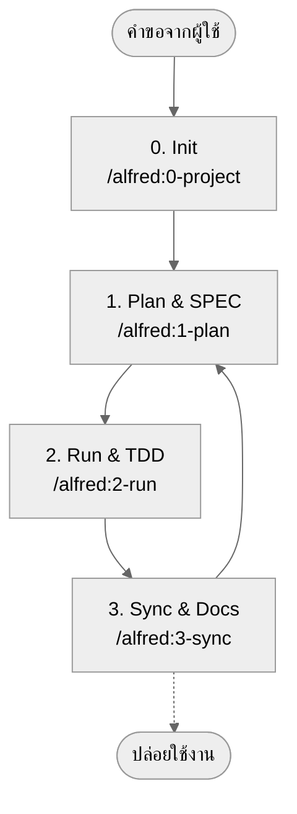

# MoAI-ADK (Agentic Development Kit)

[](https://pypi.org/project/moai-adk/)
[](https://opensource.org/licenses/MIT)
[](https://www.python.org/)
[](https://github.com/modu-ai/moai-adk/actions/workflows/moai-gitflow.yml)
[](https://codecov.io/gh/modu-ai/moai-adk)
[](https://github.com/modu-ai/moai-adk)

> **MoAI-ADK มอบเวิร์กโฟลว์การพัฒนาที่เชื่อม SPEC → TEST (TDD) → โค้ด → เอกสารเข้าด้วยกันอย่างไร้รอยต่อ โดยมี AI เป็นผู้ช่วย**

---

## 1. ภาพรวมของ MoAI-ADK

| คำถาม | ลัดไปอ่าน |
| --- | --- |
| เพิ่งรู้จัก โครงการนี้คืออะไร? | [MoAI-ADK คืออะไร?](#moai-adk-คืออะไร) |
| จะเริ่มต้นอย่างไรดี? | [เริ่มต้นเร็วใน 5 นาที](#เริ่มต้นเร็วใน-5-นาที) |
| อยากเห็นภาพรวมเวิร์กโฟลว์ | [เวิร์กโฟลว์หลัก (0 → 3)](#เวิร์กโฟลว์หลัก-0--3) |
| คำสั่ง Plan / Run / Sync ทำอะไรบ้าง? | [สรุปคำสั่งหลัก](#สรุปคำสั่งหลัก) |
| SPEC, TDD, TAG คืออะไร? | [ทำความเข้าใจแนวคิดสำคัญ](#ทำความเข้าใจแนวคิดสำคัญ) |
| สนใจข้อมูลเอเยนต์/สกิล | [ภาพรวม Sub-agent และ Skills](#ภาพรวม-sub-agent-และ-skills) |
| อยากศึกษาเพิ่มเติม | [แหล่งข้อมูลเพิ่มเติม](#แหล่งข้อมูลเพิ่มเติม) |

---

## MoAI-ADK คืออะไร?

MoAI-ADK (MoAI Agentic Development Kit) คือ **ทูลคิตโอเพ่นซอร์สที่พา AI เข้าไปช่วยทุกขั้นตอนของเวิร์กโฟลว์พัฒนา** Alfred SuperAgent จะช่วยย้ำหลักการ “วาง SPEC ก่อน ตรวจสอบด้วยเทสต์ (TDD) แล้วทำให้เอกสารกับโค้ดสอดคล้องกัน” แทนคุณ

สำหรับมือใหม่ แค่จำ 3 เรื่องนี้ไว้ก็พอ

1. บอกให้ชัดเจนก่อนว่า **จะสร้างอะไร (SPEC)**
2. **เขียนเทสต์ก่อนเสมอ (TDD)** แล้วค่อยเติมโค้ด
3. ปล่อยให้ระบบ **อัปเดตเอกสาร/README/CHANGELOG** ให้อัตโนมัติ

ทำขั้นตอนนี้ซ้ำด้วยคำสั่ง `/alfred` ทั้งสี่ และโปรเจ็กต์ของคุณจะคงความสอดคล้องตั้งแต่ต้นจนจบ

---

## ทำไมต้องใช้?

| Pain Point | MoAI-ADK ช่วยอย่างไร |
| --- | --- |
| “ไม่มั่นใจกับโค้ดที่ AI เขียน” | เชื่อม SPEC → TEST → IMPLEMENTATION → DOCS ด้วย TAG |
| “ไม่มีบริบทเลยต้องถามซ้ำ” | Alfred จำเอกสารหลักและประวัติ พร้อมพาย้อนกลับไปให้ |
| “การเขียนพรอมต์ยากจัง” | คำสั่ง `/alfred` และแพ็ก Skills จัดพรอมต์มาตรฐานให้ |
| “เอกสารกับโค้ดไม่ตรงกัน” | `/alfred:3-sync` จัด README/CHANGELOG/Living Doc ให้ตรงเสมอ |

---

## เริ่มต้นเร็วใน 5 นาที

```bash
# 1. (เลือกได้) ติดตั้ง uv — ตัวจัดการแพ็กเกจ Python ที่เร็วกว่า pip มาก
curl -LsSf https://astral.sh/uv/install.sh | sh

# 2. ติดตั้ง MoAI-ADK (โหมด tool: รันแยกแบบ global)
uv tool install moai-adk

# 3. เริ่มโปรเจ็กต์ใหม่
moai-adk init my-project
cd my-project

# 4. เรียก Alfred จาก Claude Code (หรือ CLI)
claude  # เปิด Claude Code แล้วใช้คำสั่งด้านล่าง
/alfred:0-project "ชื่อโปรเจ็กต์"
```

> 🔍 คำสั่งตรวจสอบ: `moai-adk doctor` — เช็กเวอร์ชัน Python/uv โครงสร้าง `.moai/` และการพร้อมใช้งานของเอเยนต์/สกิล

---

## รักษา MoAI-ADK ให้ทันสมัย

### ตรวจสอบเวอร์ชันปัจจุบัน
```bash
# ตรวจสอบเวอร์ชันที่ติดตั้งไว้
moai-adk --version

# ดูเวอร์ชันล่าสุดบน PyPI
uv tool list  # เช็กเวอร์ชันของ moai-adk ที่ใช้อยู่
```

### อัปเกรด

#### วิธีที่ 1: อัปเกรดเฉพาะเครื่องมือเดียว (แนะนำ)
```bash
# อัปเกรด moai-adk เป็นเวอร์ชันล่าสุด
uv tool upgrade moai-adk
```

#### วิธีที่ 2: อัปเกรดเครื่องมือทั้งหมดที่ติดตั้ง
```bash
# อัปเดตเครื่องมือใน uv tool ให้เป็นเวอร์ชันล่าสุดทั้งหมด
uv tool update
```

#### วิธีที่ 3: ติดตั้งเวอร์ชันที่ระบุ
```bash
# ติดตั้งเวอร์ชันที่ต้องการ (เช่น 0.4.2)
uv tool install moai-adk==0.4.2
```

### ตรวจสอบหลังอัปเดต
```bash
# เช็กเวอร์ชันที่ติดตั้งแล้ว
moai-adk --version

# ตรวจว่าทุกอย่างยังทำงานได้
moai-adk doctor

# นำเท็มเพลตใหม่มาใช้กับโปรเจ็กต์เดิม (เลือกได้)
moai-adk init .  # ไม่แตะโค้ดเดิม รีเฟรชเฉพาะโครงสร้าง .moai/
```

> 💡 **Tip**: เมื่อมีอัปเดตใหญ่ (minor/major) ให้รัน `moai-adk init .` เพื่อดึงเอเยนต์/สกิล/เท็มเพลตล่าสุด โปรเจ็กต์และการปรับแต่งเดิมยังปลอดภัย

---

## เวิร์กโฟลว์หลัก (0 → 3)

Alfred ขับเคลื่อนโปรเจ็กต์ของคุณด้วย 4 คำสั่ง



### 0. INIT — เตรียมโปรเจ็กต์
- สัมภาษณ์ข้อมูลแนะนำ กลุ่มเป้าหมาย ภาษา โหมด (locale)
- สร้าง `.moai/config.json` และเอกสาร `.moai/project/*` 5 รายการให้อัตโนมัติ
- ตรวจภาษาและจัดชุด Skill แนะนำ (Foundation + Essentials + Domain/Language)
- เก็บกวาดเท็มเพลต ตรวจเช็ก Git/การสำรองข้อมูลเบื้องต้น

### 1. PLAN — สร้างความเข้าใจตรงกัน
- `/alfred:1-plan` สร้าง SPEC รูปแบบ EARS (พร้อม `@SPEC:ID`)
- จัดทำ Plan Board ไอเดียการพัฒนา และการประเมินความเสี่ยง
- โหมดทีมจะสร้างสาขาและ Draft PR ให้อัตโนมัติ

### 2. RUN — พัฒนาแบบทดสอบนำทาง
- Phase 1 `implementation-planner`: ออกแบบไลบรารี โฟลเดอร์ และการกระจาย TAG
- Phase 2 `tdd-implementer`: เดินขั้น RED (เทสต์ล้ม) → GREEN (โค้ดขั้นต่ำ) → REFACTOR
- `quality-gate` ตรวจหลักการ TRUST 5 และความเปลี่ยนแปลงของ coverage

### 3. SYNC — จัดเอกสารและ PR
- ซิงก์ Living Doc, README, CHANGELOG และเอกสารอื่น
- ตรวจสอบสายโซ่ TAG และกู้คืน TAG ที่ขาดการเชื่อม
- สร้าง Sync Report เปลี่ยนสถานะ Draft → Ready for Review รองรับ `--auto-merge`

---

## สรุปคำสั่งหลัก

| คำสั่ง | ทำอะไร | ผลลัพธ์สำคัญ |
| --- | --- | --- |
| `/alfred:0-project` | รวบรวมคำอธิบายโปรเจ็กต์ สร้างไฟล์ตั้งค่า/เอกสาร แนะนำ Skills | `.moai/config.json`, `.moai/project/*`, รายงานเริ่มต้น |
| `/alfred:1-plan <คำอธิบาย>` | วิเคราะห์ความต้องการ ร่าง SPEC จัดทำ Plan Board | `.moai/specs/SPEC-*/spec.md`, เอกสาร plan/acceptance, สร้างสาขา |
| `/alfred:2-run <SPEC-ID>` | รัน TDD ดูแลเทสต์/โค้ด/รีแฟกเตอร์ ตรวจคุณภาพ | `tests/`, โค้ดใน `src/`, รายงานคุณภาพ, การเชื่อม TAG |
| `/alfred:3-sync` | ซิงก์เอกสาร/README/CHANGELOG รวมสถานะ TAG/PR | `docs/`, `.moai/reports/sync-report.md`, PR พร้อมรีวิว |

> ❗ ทุกคำสั่งเดินตามลูป **Phase 0 (ตัวเลือก) → Phase 1 → Phase 2 → Phase 3** Alfred จะรายงานสถานะปัจจุบันและขั้นถัดไปให้อัตโนมัติ

---

## ทำความเข้าใจแนวคิดสำคัญ

### SPEC-First
- **ทำไม?** เหมือนสร้างบ้านต้องมีแบบก่อน จัดความต้องการให้พร้อมก่อนลงมือ
- **อย่างไร?** `/alfred:1-plan` สร้าง SPEC รูปแบบ EARS ที่มีโครง “WHEN… THEN…”
- **ผลลัพธ์:** เอกสารที่ติด `@SPEC:ID` + Plan Board + เกณฑ์ยอมรับงาน

### TDD (Test-Driven Development)
- **RED**: เขียนเทสต์ที่ต้องล้มก่อน
- **GREEN**: เขียนโค้ดที่ง่ายที่สุดให้เทสต์ผ่าน
- **REFACTOR**: ปรับโครงสร้างและลดความซ้ำซ้อน
- `/alfred:2-run` ทำขั้นตอนนี้ให้อัตโนมัติและสร้างล็อก RED/GREEN/REFACTOR

### ระบบ TAG
- เชื่อม `@SPEC:ID` → `@TEST:ID` → `@CODE:ID` → `@DOC:ID`
- ค้นหา TAG จุดใดก็เห็น SPEC เทสต์ และเอกสารที่เกี่ยวข้องทันที
- `/alfred:3-sync` ตรวจคลัง TAG และแจ้ง TAG ที่ถูกทิ้ง

### หลัก TRUST 5
1. **Test First** — เขียนเทสต์ก่อนเสมอ
2. **Readable** — ฟังก์ชันสั้น กระชับ สไตล์สม่ำเสมอ
3. **Unified** — สถาปัตยกรรม ประเภทข้อมูล และสัญญาต้องสอดคล้อง
4. **Secured** — ตรวจสอบอินพุต ปกป้องความลับ รัน static analysis
5. **Trackable** — TAG, ประวัติ Git และเอกสารเดินไปด้วยกัน

> อ่านกฎละเอียดได้ที่ `.moai/memory/development-guide.md`

---

## แบบฝึกหัดแรก: ตัวอย่าง Todo API

1. **Plan**
   ```bash
   /alfred:1-plan "API สำหรับเพิ่ม แสดง แก้ไข ลบงานที่ต้องทำ"
   ```
   Alfred สร้าง SPEC (`.moai/specs/SPEC-TODO-001/spec.md`) พร้อมเอกสาร plan/acceptance

2. **Run**
   ```bash
   /alfred:2-run TODO-001
   ```
   ระบบสร้างเทสต์ (`tests/test_todo_api.py`) โค้ด (`src/todo/`) และรายงานให้อัตโนมัติ

3. **Sync**
   ```bash
   /alfred:3-sync
   ```
   อัปเดต `docs/api/todo.md`, สายโซ่ TAG และ Sync Report

4. **คำสั่งตรวจสอบ**
   ```bash
   rg '@(SPEC|TEST|CODE|DOC):TODO-001' -n
   pytest tests/test_todo_api.py -v
   cat docs/api/todo.md
   ```

> ใช้เวลาเพียง 15 นาทีก็ได้ Todo API ที่เชื่อม SPEC → TDD → เอกสารครบถ้วน

---

## ภาพรวม Sub-agent และ Skills

Alfred ประกอบด้วย **ทีม 19 คน** (SuperAgent 1 + Core Sub-agent 10 + Sub-agent สำหรับ init 6 + ตัวช่วยในตัว 2) และ **Claude Skills 44 รายการ**

### Core Sub-agents (Plan → Run → Sync)

| Sub-agent | โมเดล | หน้าที่ |
| --- | --- | --- |
| project-manager 📋 | Sonnet | เตรียมโปรเจ็กต์ สัมภาษณ์เมทาดาทา |
| spec-builder 🏗️ | Sonnet | สร้าง Plan Board และ SPEC รูปแบบ EARS |
| code-builder 💎 | Sonnet | รัน `implementation-planner` + `tdd-implementer` ทำ TDD ครบวงจร |
| doc-syncer 📖 | Haiku | ซิงก์ Living Doc, README, CHANGELOG |
| tag-agent 🏷️ | Haiku | ดูแลคลัง TAG และตรวจหา TAG ที่ขาด |
| git-manager 🚀 | Haiku | จัดการ GitFlow, Draft/Ready, Auto Merge |
| debug-helper 🔍 | Sonnet | วิเคราะห์ความล้มเหลว เสนอแนวทาง fix-forward |
| trust-checker ✅ | Haiku | ตรวจเงื่อนไขคุณภาพตาม TRUST 5 |
| quality-gate 🛡️ | Haiku | ตรวจการเปลี่ยน coverage และตัวปิดกั้นการปล่อย |
| cc-manager 🛠️ | Sonnet | ปรับแต่งเซสชัน Claude Code และจัดการ Skills |

### Skills (Progressive Disclosure)
- **Foundation (6)**: TRUST, TAG, SPEC, EARS, Git, ตรวจจับภาษา
- **Essentials (4)**: Debug, Refactor, Review, Performance
- **Domain (10)**: Backend, Web API, Security, Data, Mobile ฯลฯ
- **Language (23)**: Python, TypeScript, Go, Rust, Java, Swift และอื่น ๆ
- **Claude Code Ops (1)**: ตั้งค่าเซสชัน จัดรูปแบบเอาต์พุต

> Skills อยู่ใน `.claude/skills/` เป็นคู่มือสั้นไม่เกิน 500 คำ โหลดเฉพาะตอนจำเป็นเพื่อลดค่า context

---

## คู่มือเลือกโมเดล AI

| สถานการณ์ | โมเดลพื้นฐาน | เหตุผล |
| --- | --- | --- |
| การเขียนสเป็ก ออกแบบ รีแฟกเตอร์ แก้ปัญหา | **Claude 4.5 Sonnet** | เก่งด้านการให้เหตุผลลึกและเรียบเรียงอย่างมีโครงสร้าง |
| ซิงก์เอกสาร ตรวจ TAG จัดการ Git อัตโนมัติ | **Claude 4.5 Haiku** | เหมาะกับงานวนซ้ำเร็วและจัดการสตริงจำนวนมาก |

- งานที่เป็นแพทเทิร์นเริ่มด้วย Haiku แล้วค่อยสลับเป็น Sonnet เมื่อสหวิชาการ
- หากเปลี่ยนโมเดลเอง อย่าลืมจดเหตุผลไว้เพื่อให้ทีมตามทัน

---

## คำถามที่พบบ่อย (FAQ)

- **ถาม: ติดตั้งในโปรเจ็กต์เดิมได้ไหม?**  
  ตอบ: ได้ รัน `moai-adk init .` เพื่อเพิ่มโครงสร้าง `.moai/` โดยไม่แตะโค้ด
- **ถาม: รันเทสต์อย่างไร?**  
  ตอบ: `/alfred:2-run` จะรันก่อน จากนั้นค่อยรัน `pytest`, `pnpm test` ฯลฯ ตามต้องการ
- **ถาม: แน่ใจได้อย่างไรว่าเอกสารทันสมัย?**  
  ตอบ: `/alfred:3-sync` สร้าง Sync Report ดูได้ใน Pull Request
- **ถาม: ทำงานด้วยมือเองได้ไหม?**  
  ตอบ: ได้ แต่ต้องรักษาลำดับ SPEC → TEST → CODE → DOC และใส่ TAG ทุกครั้ง

---

## แหล่งข้อมูลเพิ่มเติม

| เป้าหมาย | แหล่งข้อมูล |
| --- | --- |
| โครงสร้าง Skills | `docs/skills/overview.md` และเอกสารตาม Tier |
| รายละเอียด Sub-agent | `docs/agents/overview.md` |
| คู่มือเวิร์กโฟลว์ | `docs/guides/workflow/` (Plan/Run/Sync) |
| แนวทางการพัฒนา | `.moai/memory/development-guide.md`, `.moai/memory/spec-metadata.md` |
| แผนการอัปเดต | `CHANGELOG.md`, `UPDATE-PLAN-0.4.0.md` |

---

## ชุมชนและการสนับสนุน

- GitHub Repo: <https://github.com/modu-ai/moai-adk>
- Issues & Discussions: ยินดีรับรายงานบั๊ก ฟีเจอร์ และไอเดีย
- PyPI: <https://pypi.org/project/moai-adk/>
- ติดต่อ: ดูแนวทางที่ `CONTRIBUTING.md`

> 🙌 “ไม่มี SPEC ก็ไม่มี CODE” มาร่วมสร้างวัฒนธรรมการพัฒนาที่สอดคล้องกับ AI ไปกับ Alfred กันเถอะ

