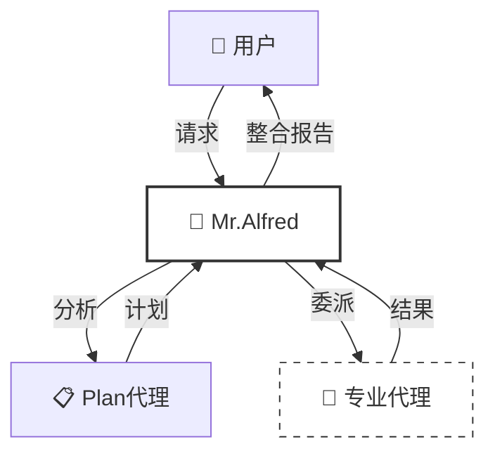
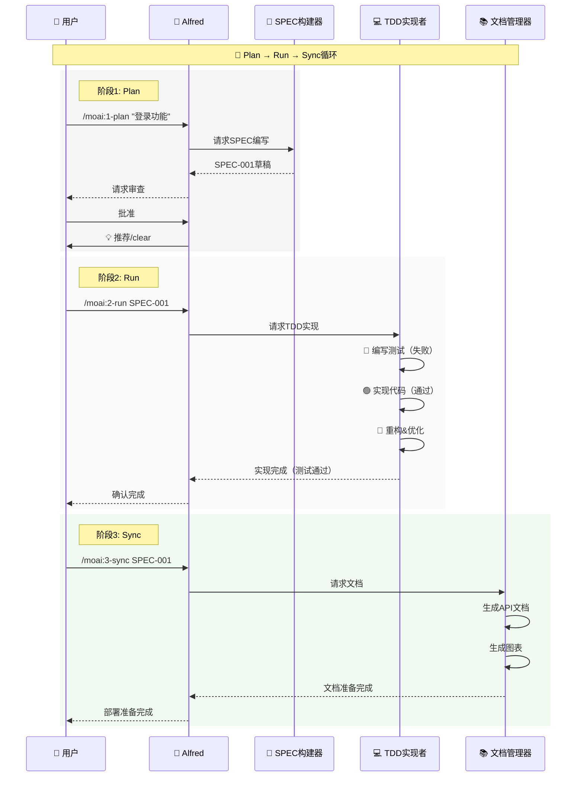
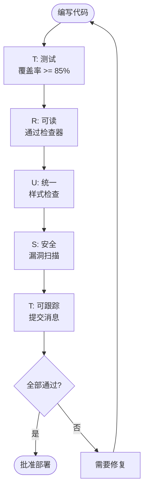
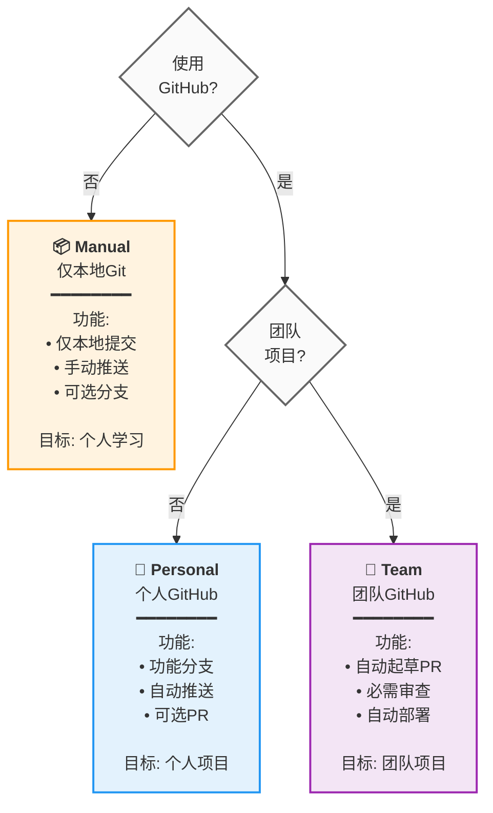

# 🗿 MoAI-ADK: 基于 AI 的 SPEC-First TDD 开发框架


**可用语言:** [🇰🇷 한국어](./README.ko.md) | [🇺🇸 English](./README.md) | [🇯🇵 日本語](./README.ja.md) | [🇨🇳 中文](./README.zh.md)

[](https://pypi.org/project/moai-adk/)
[](https://opensource.org/licenses/MIT)
[](https://www.python.org/)

MoAI-ADK (Agentic Development Kit) 是一个结合 **SPEC-First 开发**、**测试驱动开发**（TDD）和 **AI 代理**的开源框架，提供完整且透明的开发生命周期。

---

## 📑 目录（快速导航）

### A部分：入门（30分钟）

| 章节                               | 时间 | 目标                     |
| ---------------------------------- | ---- | ------------------------ |
| [1. 介绍](#1-介绍)                  | 2分钟 | 了解 MoAI-ADK 是什么      |
| [2. 安装和设置](#2-安装和设置)     | 10分钟 | 配置基础环境             |
| [3. 快速开始](#3-快速开始)          | 5分钟 | 完成第一个功能            |

### B部分：核心概念（45分钟）

| 章节                                      | 时间 | 目标                     |
| ----------------------------------------- | ---- | ------------------------ |
| [4. SPEC 和 EARS 格式](#4-spec和ears格式) | 10分钟 | 理解规格文档编写        |
| [5. Mr.Alfred 和代理](#5-mralfred和代理)   | 12分钟 | 理解代理系统            |
| [6. 开发工作流](#6-开发工作流)          | 15分钟 | Plan → Run → Sync        |
| [7. 核心命令](#7-核心命令)                | 8分钟  | `/moai:0-3` 命令         |

### C部分：高级学习（2-3小时）

| 章节                                  | 目标               |
| ------------------------------------- | ------------------ |
| [8. 代理指南](#8-代理指南-26个)       | 专业代理利用         |
| [9. 技能库](#9-技能库-22个)           | 22个技能探索         |
| [10. 组合模式和示例](#10-组合模式和示例) | 实际项目示例         |
| [11. TRUST 5 质量保证](#11-trust-5-质量保证) | 质量保证系统         |

### D部分：高级和参考（需要时）

| 章节                                   | 目的                  |
| -------------------------------------- | --------------------- |
| [12. 高级配置](#12-高级配置)          | 项目自定义           |
| [13. MCP 服务器](#13-mcp-服务器)        | 外部工具集成          |
| [14. FAQ 和快速参考](#14-faq-和快速参考) | 常见问题              |
| [15. 附加资源](#15-附加资源)           | ai-nano-banana 指南   |

---

## 1. 介绍

### 🗿 MoAI-ADK 是什么？

**MoAI-ADK**（Agentic Development Kit）是下一代开发框架，由 AI 代理驱动。它结合 **SPEC-First 开发方法论**、**TDD**（测试驱动开发）和 **26 个专业 AI 代理**，提供完整且透明的开发生命周期。

### ✨ 为什么使用 MoAI-ADK？


传统开发的局限性：

- ❌ 由于需求不明确而频繁返工
- ❌ 文档与代码不同步
- ❌ 推迟测试导致质量下降
- ❌ 重复的样板代码编写

MoAI-ADK 的解决方案：

- ✅ 从**清晰的 SPEC 文档**开始，消除误解
- ✅ **自动文档同步**始终保持最新状态
- ✅ **TDD 强制**保证 85%+ 测试覆盖率
- ✅ **AI 代理**自动化重复任务

### 🎯 核心功能


| 功能                   | 描述                                           | 定量影响                                                                                                                                                                                             |
| --------------------- | --------------------------------------------- | ----------------------------------------------------------------------------------------------------------------------------------------------------------------------------------------------------- |
| **SPEC-First**        | 所有开发都从清晰的规格开始            | 由于需求变更导致的返工**减少 90%**<br/>清晰的 SPEC 消除开发者-规划者之间的误解                                                                                                                      |
| **TDD 强制**           | 自动 Red-Green-Refactor 循环           | （85%+ 覆盖率）错误**减少 70%**<br/>包括测试编写的总开发时间**减少 15%**                                                                                                                    |
| **AI 编排**           | Mr.Alfred 指挥 26 个专业 AI 代理（7层）  | 平均令牌节省：每会话 5,000 令牌（条件性自动加载）<br/>**简单任务**：0 令牌（快速参考）<br/>**复杂任务**：8,470 令牌（自动技能加载）<br/>相比手动**60-70% 时间节省** |
| **自动文档**           | 代码更改时自动文档同步（`/moai:3-sync`） | **100% 文档新鲜度**<br/>消除手动文档编写<br/>最后一次提交以来的自动同步                                                                                                        |
| **TRUST 5 质量**       | Test, Readable, Unified, Secured, Trackable   | 企业级质量保证<br/>部署后紧急补丁**减少 99%**                                                                                                                                                           |

---

## 2. 安装和设置

### 🎯 基本安装（10分钟）

#### 步骤1：安装 uv（1分钟）

```bash
# macOS / Linux
curl -LsSf https://astral.sh/uv/install.sh | sh

# Windows (PowerShell)
powershell -ExecutionPolicy ByPass -c "irm https://astral.sh/uv/install.ps1 | iex"

# 验证安装
uv --version
```

#### 步骤2：安装 MoAI-ADK（2分钟）

```bash
# 安装最新版本
uv tool install moai-adk

# 更新到最新版本（如果已安装）
uv tool update moai-adk

# 验证安装
moai-adk --version
```

#### 步骤3：初始化项目（3分钟）

```bash
# 创建新项目
moai-adk init my-project
cd my-project

# 检查项目结构
ls -la
```

生成的文件结构：

```
my-project/
├── .claude/              # Claude Code 配置
├── .moai/                # MoAI-ADK 配置
├── src/                  # 源代码
├── tests/                # 测试代码
├── .moai/specs/          # SPEC 文档
├── README.md
└── pyproject.toml
```

#### 步骤4：运行 Claude Code（4分钟）

```bash
# 运行 Claude Code
claude

# Claude Code 内
> /moai:0-project
```

现在项目元数据和环境已准备就绪，可以进行SPEC-First TDD开发！

---

## 3. 快速开始

### 🎯 目标：5分钟完成第一个功能


---

### **步骤1：规划第一个功能** ⏱️ 2分钟

在 Claude Code 内：

```
> /moai:1-plan "添加用户登录功能"
```

这个命令将：

- 自动生成 SPEC-001 文档
- 定义需求、约束、成功标准
- 创建测试场景

---

### **步骤2：初始化上下文** ⏱️ 1分钟

```
> /clear
```

为了令牌效率，清除之前的上下文。

---

### **步骤3：实现（Run）** ⏱️ 2分钟

```
> /moai:2-run SPEC-001
```

这个命令将：

- 首先编写测试（Red）
- 实现代码（Green）
- 重构（Refactor）
- 自动执行 TRUST 5 验证

---

### **步骤4：文档（Sync）** ⏱️ （可选）

```
> /moai:3-sync SPEC-001
```

自动地：

- 生成 API 文档
- 创建架构图
- 更新 README
- 准备部署

**完成！** 第一个功能已完全实现。🎉

---

### 📁 更多信息

- **高级安装选项**: [12. 高级配置](#12-高级配置)
- **详细命令使用**: [7. 核心命令](#7-核心命令)
- **开发工作流**: [6. 开发工作流](#6-开发工作流)

---

## 4. SPEC 和 EARS 格式

### 📋 SPEC-First 开发


**什么是 SPEC-First？**

所有开发都从**清晰的规格**开始。SPEC 遵循 **EARS（Easy Approach to Requirements Syntax）格式**，包含：

- **需求**: 要构建什么？
- **约束**: 有哪些限制？
- **成功标准**: 何时完成？
- **测试场景**: 如何验证？

### 🎯 EARS 格式示例

```markdown
# SPEC-001: 用户登录功能

## 需求

- 当用户输入邮箱和密码并点击"登录"时
- 如果凭证有效
- 系统应发放 JWT (JSON Web Token) 并导航到仪表板

## 约束

- 密码必须至少 8 个字符
- 连续 5 次失败后锁定账户（30分钟）
- 响应时间必须在 500ms 以内

## 成功标准

- 有效凭证登录成功率 100%
- 对无效凭证显示清晰的错误消息
- 响应时间 < 500ms
- 测试覆盖率 >= 85%

## 测试场景

### TC-1: 成功登录

- 输入: email="user@example.com", password="secure123"
- 期待结果: 发放令牌，导航到仪表板

### TC-2: 无效密码

- 输入: email="user@example.com", password="wrong"
- 期待结果: "密码不正确"错误消息

### TC-3: 账户锁定

- 输入: 连续 5 次失败
- 期待结果: "账户已锁定。30分钟后重试"
```

### 💡 EARS 格式的 5 种类型

| 类型              | 语法           | 示例                                        |
| ----------------- | -------------- | ------------------------------------------- |
| **Ubiquitous**    | 总是执行       | "系统应始终记录活动"                        |
| **Event-driven**  | WHEN...THEN    | "当用户登录时，发放令牌"                    |
| **State-driven**  | IF...THEN      | "如果账户处于活动状态，则允许登录"          |
| **Unwanted**      | shall not      | "系统不得以明文形式存储密码"                |
| **Optional**      | where possible | "在可能的情况下提供 OAuth 登录"             |

---

## 5. Mr.Alfred 和代理

### 🎩 Mr.Alfred - 超级代理编排者

**Mr.Alfred 是什么？**

Mr.Alfred 是 MoAI-ADK 的**首席编排者**，分析用户请求，选择合适的专业代理来委派任务，并整合结果。

**Alfred 的角色：**

1. **理解**: 分析用户请求并澄清模糊性
2. **规划**: 通过 Plan 代理建立执行计划
3. **执行**: 将任务委派给专业代理（顺序/并行）
4. **整合**: 收集所有结果并向用户报告



### 🔧 代理系统（5层层次结构）

MoAI-ADK 将**26个专业代理**组织成**5层**以提供最佳性能。

**第1层：领域专家**（7个代理）

- `expert-backend`: 后端架构、API开发
- `expert-frontend`: 前端、React/Vue实现
- `expert-database`: 数据库设计、优化
- `expert-security`: 安全分析、漏洞扫描
- `expert-devops`: 部署、基础设施、CI/CD
- `expert-uiux`: UI/UX设计、组件
- `expert-debug`: 调试、错误分析

**第2层：工作流管理器**（8个代理）

- `manager-spec`: SPEC编写（EARS格式）
- `manager-tdd`: TDD实现（RED-GREEN-REFACTOR）
- `manager-docs`: 自动文档
- `manager-quality`: 质量验证（TRUST 5）
- `manager-strategy`: 执行策略规划
- `manager-project`: 项目初始化
- `manager-git`: Git工作流
- `manager-claude-code`: Claude Code集成

**第3层：元生成器**（3个代理）

- `builder-agent`: 创建新代理
- `builder-skill`: 创建新技能
- `builder-command`: 创建新命令

**第4层：MCP集成器**（5个代理）

- `mcp-context7`: 实时库文档查找
- `mcp-sequential-thinking`: 复杂推理分析
- `mcp-playwright`: Web自动化测试
- `mcp-design`: Figma设计系统
- `mcp-browser`: Web测试自动化

**第5层：AI服务**（1个代理）

- `ai-nano-banana`: Gemini 3图像生成

---

## 6. 开发工作流

### 🔄 无限 Plan-Run-Sync 循环

MoAI-ADK 开发以**3阶段无限循环**进行：



### 📊 详细阶段说明

#### 阶段1: Plan（设计，5-10分钟）

**目标**: 要构建什么？

```bash
/moai:1-plan "用户登录功能"
```

在这个阶段：

- ✅ 自动生成SPEC-001文档
- ✅ 以EARS格式定义需求
- ✅ 明确成功标准
- ✅ 编写测试场景

**输出**: `.moai/specs/SPEC-001/spec.md`

---

#### 阶段2: Run（实现，20-40分钟）

**目标**: 如何构建？

```bash
/clear
/moai:2-run SPEC-001
```

在这个阶段：

- 🔴 **RED**: 首先编写失败的测试
- 🟢 **GREEN**: 通过代码让测试通过
- 🔵 **REFACTOR**: 清理和优化代码

**自动验证**:

- 测试覆盖率 >= 85%
- 通过代码检查
- 通过安全检查
- 通过类型检查

**输出**: 实现完成 + 测试代码 + 85%+ 覆盖率

---

#### 阶段3: Sync（文档，10-15分钟）

**目标**: 是否完成？

```bash
/clear
/moai:3-sync SPEC-001
```

在这个阶段：

- 📚 自动生成API文档
- 📊 生成架构图
- 🚀 编写部署指南
- ✅ 反映所有更改

**输出**: 最新文档 + 部署准备完成

---

### 💡 可视化工作流："博客评论功能"示例

```mermaid
flowchart LR
    Start([👤 用户请求]) -->|\"<br/>能创建<br/>评论功能吗？<br/>\"| Plan[\"<b>📋 PLAN</b><br/>（设计）<br/>━━━━━━<br/>✨ 编写SPEC<br/>✅ 定义成功标准<br/>⏱️ 5分钟\"]

    Plan -->|\"<br/>SPEC-001<br/>准备完成<br/>\"| Run[\"<b>💻 RUN</b><br/>（实现）<br/>━━━━━━<br/>🔴 编写测试<br/>🟢 实现代码<br/>🔵 重构<br/>⏱️ 20分钟\"]

    Run -->|\"<br/>测试通过<br/>代码完成<br/>\"| Sync[\"<b>📚 SYNC</b><br/>（文档）<br/>━━━━━━<br/>🔗 生成API文档<br/>📊 图表<br/>🚀 部署准备<br/>⏱️ 10分钟\"]

    Sync -->|\"<br/>完全自动化！<br/>\"| End([✅ 功能已部署])

    classDef planStyle fill:#e3f2fd,stroke:#1976d2,stroke-width:3px,color:#000
    classDef runStyle fill:#f3e5f5,stroke:#7b1fa2,stroke-width:3px,color:#000
    classDef syncStyle fill:#e8f5e9,stroke:#388e3c,stroke-width:3px,color:#000
    classDef normalStyle fill:#fafafa,stroke:#666,stroke-width:2px

    class Plan planStyle
    class Run runStyle
    class Sync syncStyle
    class Start,End normalStyle
```

---

## 7. 核心命令

### 🎯 `/moai:0-project` - 项目初始化

**目的**: 生成项目元数据

**使用时机**: 开始新项目时

```bash
/moai:0-project
```

**生成的文件**:

- `.moai/config/config.json`: 项目配置
- `.moai/memory/`: 项目内存
- `.moai/docs/`: 自动生成文档

---

### 📋 `/moai:1-plan` - SPEC编写

**目的**: 以EARS格式生成SPEC文档

**使用时机**: 新功能开发开始前

```bash
/moai:1-plan "添加登录功能"
```

**示例**:

```bash
/moai:1-plan "实现用户档案页面"
# → 创建 SPEC-002 (.moai/specs/SPEC-002/spec.md)

/moai:1-plan "开发支付API"
# → 创建 SPEC-003
```

**SPEC包括**:

- 需求
- 约束
- 成功标准
- 测试场景

**重要**: 接下来必须执行`/clear`

```bash
/moai:1-plan "功能名"
# 完成后
/clear
```

---

### 💻 `/moai:2-run` - TDD实现

**目的**: 以RED-GREEN-REFACTOR循环实现代码

**使用时机**: SPEC编写后的实现时

```bash
/moai:2-run SPEC-001
```

**示例**:

```bash
/moai:2-run SPEC-001  # 基本实现
```

**自动执行**:

- 🔴 首先编写测试
- 🟢 通过代码让测试通过
- 🔵 重构&优化
- ✅ TRUST 5验证（自动）

**验证项**:

- 测试覆盖率 >= 85%
- 通过代码检查
- 通过类型检查
- 通过安全检查

---

### 📚 `/moai:3-sync` - 文档同步

**目的**: 在文档中反映代码更改

**使用时机**: 实现完成后

```bash
/moai:3-sync SPEC-001
```

**示例**:

```bash
/moai:3-sync SPEC-001  # 所有文档
```

**自动生成文档**:

- API参考
- 架构图
- 部署指南
- README更新
- CHANGELOG

---

### 📊 其他有用命令

| 命令             | 目的               | 使用时机           |
| ----------------- | ----------------- | ----------------- |
| `/moai:0-git`     | Git工作流设置     | 项目初始化         |
| `/moai:9-feedback`| 提交改进反馈      | 发现问题时         |
| `/clear`          | 上下文初始化       | 阶段后令牌节省     |

---

### 🌳 **moai-worktree** - 并行SPEC开发的Git工作树管理

#### 为什么选择moai-worktree？解决的问题

在现代软件开发中，特别是遵循SPEC-First TDD方法论时，开发者经常面临同时处理多个功能的挑战。传统Git工作流迫使开发者：

- **上下文切换地狱**: 在同一工作空间中不断切换分支，失去上下文并面临未完成工作的风险
- **顺序开发**: 一次只能处理一个SPEC，降低生产力
- **环境冲突**: 不同的SPEC可能需要不同的依赖、数据库状态或配置

**moai-worktree解决了这些问题**。它为每个SPEC提供隔离的工作空间，实现无上下文切换开销的真正并行开发。

#### 核心概念：基于SPEC的并行开发

**什么是Git工作树？**

Git工作树是链接到同一Git仓库的独立工作目录，允许在不同工作目录中同时检出不同的分支。每个工作树具有：
- 独立的文件系统
- 分离的工作目录状态
- 隔离的构建工件和依赖
- 独立的暂存区和未暂存更改

**moai-worktree架构**:

```
主仓库/
├── .git/                    # 共享Git仓库
├── src/                     # 主分支文件
└── worktrees/               # 自动创建的工作树
    ├── SPEC-001/
    │   ├── .git             # 工作树特定git文件
    │   ├── src/             # SPEC-001实现
    │   └── tests/           # SPEC-001测试
    ├── SPEC-002/
    │   ├── .git             # 工作树特定git文件
    │   ├── src/             # SPEC-002实现
    │   └── tests/           # SPEC-002测试
    └── SPEC-003/
        ├── .git             # 工作树特定git文件
        ├── src/             # SPEC-003实现
        └── tests/           # SPEC-003测试
```

#### SPEC-First开发的主要优势

**1. 零上下文切换**
- 每个SPEC都有专用工作空间
- 切换SPEC时永远不会失去工作上下文
- 保持对特定需求的精神专注

**2. 真正的并行开发**
- SPEC-002测试运行时处理SPEC-001实现
- SPEC-004文档同步时处理SPEC-003调试
- 无需等待其他进程完成

**3. 隔离环境**
- 不同SPEC可以使用不同依赖版本
- 分离的数据库状态和配置
- 无SPEC间污染

**4. SPEC完成跟踪**
- 清晰地视觉显示哪些SPEC处于活动状态
- 轻松识别中断或未完成的SPEC
- 完成工作的系统清理

#### 高级功能

**智能同步**
```bash
# 将所有工作树与最新主分支同步
moai-worktree sync --all

# 使用冲突解决同步特定工作树
moai-worktree sync SPEC-001 --auto-resolve
```

**智能清理**
```bash
# 自动删除已合并分支的工作树
moai-worktree clean --merged-only

# 带确认提示的安全清理
moai-worktree clean --interactive
```

**性能优化**
- **并发操作**: 可以同时修改多个工作树
- **共享历史**: 所有工作树共享相同的Git对象数据库
- **选择性同步**: 仅同步需要的更改，而不是整个仓库

#### 何时使用moai-worktree

**理想场景**:
- **多个活动SPEC**: 同时处理3个或更多SPEC
- **长期运行任务**: SPEC实现需要数天或数周
- **团队协作**: 多个开发者在不同SPEC上工作
- **功能分支**: 每个SPEC成为自己的功能分支
- **环境隔离**: 不同SPEC需要不同配置

**实际示例工作流**:

```bash
# 上午：开始新SPEC
moai-worktree new SPEC-005 "用户档案改进"
cd $(moai-worktree go SPEC-005)

# 其他SPEC完成时实现SPEC-005
/moai:2-run SPEC-005

# 下午：检查所有SPEC状态
moai-worktree status
# 输出:
# ✓ SPEC-001: 完成（准备合并）
# ✓ SPEC-002: 测试进行中
# ⏳ SPEC-003: 实现阶段
# 🔄 SPEC-005: 活动开发

# 晚上：清理已完成的SPEC
moai-worktree clean --merged-only
```

#### 技术优势

**内存效率**: 与多个完整仓库相比，使用共享Git对象数据库以最小内存开销

**磁盘空间优化**: 工作树共享仓库历史，仅使用工作文件的额外空间

**原子操作**: 每个工作树操作都是原子的，防止仓库损坏

**Git原生**: 使用标准Git工作树功能，确保与所有Git工具的兼容性

#### 与MoAI-ADK工作流的集成

moai-worktree与MoAI-ADK Plan-Run-Sync周期无缝集成：

1. **Plan阶段**: `moai-worktree new SPEC-XXX`创建专用工作空间
2. **Run阶段**: 在隔离环境中工作，不影响其他SPEC
3. **Sync阶段**: `moai-worktree sync SPEC-XXX`确保干净的集成
4. **Cleanup阶段**: `moai-worktree clean`删除已完成的工作树

这种集成为同时管理多个SPEC提供了完整且系统化的方法，同时保持SPEC-First TDD方法论的原则。

**命令概览**:

```bash
# 列出可用命令
moai-worktree --help

# 为SPEC开发创建新工作树
moai-worktree new SPEC-001

# 列出所有活动工作树
moai-worktree list

# 导航到特定工作树
moai-worktree go SPEC-001

# 切换到工作树（打开新shell）
moai-worktree switch SPEC-001

# 将工作树与基础分支同步
moai-worktree sync SPEC-001

# 删除特定工作树
moai-worktree remove SPEC-001

# 清理已合并分支的工作树
moai-worktree clean

# 显示工作树状态和配置
moai-worktree status

# 配置工作树设置
moai-worktree config get
moai-worktree config set <key> <value>
```

---

## 8. 代理指南（26个）

### 🎯 代理选择指南

每个代理都有特定的领域专业知识。为任务选择合适的代理。

### 第1层：领域专家

#### expert-backend（后端开发）

**专业知识**: FastAPI、Django、Node.js后端开发
**使用示例**:

- RESTful API设计和实现
- 数据库查询优化
- 身份验证和授权
- 服务器性能优化

```bash
@agent-expert-backend "使用FastAPI开发用户认证API"
```

---

#### expert-frontend（前端开发）

**专业知识**: React、Vue、Next.js前端
**使用示例**:

- UI组件实现
- 状态管理（Redux、Zustand）
- API集成
- 响应式设计

```bash
@agent-expert-frontend "使用React实现仪表板UI"
```

---

#### expert-database（数据库）

**专业知识**: SQL、NoSQL、ORM、优化
**使用示例**:

- 数据库模式设计
- 查询优化
- 迁移
- 性能调优

```bash
@agent-expert-database "优化大型PostgreSQL表"
```

---

#### expert-security（安全）

**专业知识**: 安全分析、漏洞扫描、OWASP
**使用示例**:

- 安全代码审查
- 漏洞分析
- OWASP Top 10验证
- 数据加密

```bash
@agent-expert-security "登录功能安全审计"
```

---

#### expert-devops（DevOps）

**专业知识**: Docker、Kubernetes、CI/CD、部署
**使用示例**:

- Docker镜像优化
- Kubernetes配置
- GitHub Actions CI/CD
- 基础设施自动化

```bash
@agent-expert-devops "为Next.js应用程序设置Docker部署"
```

---

#### expert-uiux（UI/UX设计）

**专业知识**: 设计系统、组件、可访问性
**使用示例**:

- UI组件库设计
- 设计系统开发
- 可访问性（A11y）验证
- 用户体验优化

```bash
@agent-expert-uiux "基于shadcn/ui构建设计系统"
```

---

#### expert-debug（调试）

**专业知识**: 问题分析、错误跟踪、性能分析
**使用示例**:

- 错误分析
- 性能瓶颈分析
- 日志分析
- 内存泄漏检测

```bash
@agent-expert-debug "分析慢速API响应时间"
```

---

### 第2层：工作流管理器

#### manager-spec（SPEC编写）

**目的**: 以EARS格式生成SPEC文档
**自动调用**: `/moai:1-plan`执行时

```bash
@agent-manager-spec "为用户档案API编写SPEC"
```

---

#### manager-tdd（TDD实现）

**目的**: 自动执行RED-GREEN-REFACTOR
**自动调用**: `/moai:2-run`执行时

```bash
@agent-manager-tdd "实现SPEC-001"
```

---

#### manager-docs（文档自动化）

**目的**: 自动生成API文档、图表、指南
**自动调用**: `/moai:3-sync`执行时

```bash
@agent-manager-docs "生成登录功能文档"
```

---

#### manager-quality（质量验证）

**目的**: TRUST 5验证（Test, Readable, Unified, Secured, Trackable）
**自动调用**: `/moai:2-run`完成后

```bash
@agent-manager-quality "验证代码质量"
```

---

#### manager-strategy（策略规划）

**目的**: 建立复杂实现策略
**使用示例**:

- 微服务架构设计
- 迁移规划
- 性能优化策略

```bash
@agent-manager-strategy "规划单体到微服务的迁移"
# 或使用内置代理
@agent-Plan "规划单体到微服务的迁移"
```

---

### 第3层：元生成器

#### builder-agent

**目的**: 创建新代理
**使用示例**: 创建组织特定代理

```bash
@agent-builder-agent "创建数据分析专家代理"
```

---

#### builder-skill

**目的**: 创建新技能
**使用示例**: 开发团队特定技能

```bash
@agent-builder-skill "创建GraphQL API开发技能模块"
```

---

#### builder-command

**目的**: 创建新命令
**使用示例**: 自定义工作流自动化

```bash
@agent-builder-command "创建/moai:deploy命令（自动部署工作流）"
```

---

### 第4层：MCP集成器

#### mcp-context7（文档搜索）

**目的**: 最新库文档的实时搜索
**使用示例**:

- 检查React最新API
- 参考FastAPI文档
- 验证库兼容性

```bash
@agent-mcp-context7 "搜索React 19最新Hooks API"
```

---

#### mcp-sequential-thinking（高级推理）

**目的**: 复杂问题的多阶段分析
**自动激活**: 复杂性 > 中等时
**使用示例**:

- 架构设计
- 算法优化
- SPEC分析

```bash
@agent-mcp-sequential-thinking "分析微服务架构设计"
```

---

#### mcp-playwright（Web自动化）

**目的**: E2E测试、Web自动化
**使用示例**:

- E2E测试编写
- 视觉回归测试
- 跨浏览器验证

```bash
@agent-mcp-playwright "创建登录功能的E2E测试"
```

---

### 第5层：AI服务

#### ai-nano-banana（图像生成）

**目的**: 使用Gemini 3生成高质量图像
**使用示例**:

- UI/UX模型生成
- 技术图表创建
- 营销材料
- 徽标/图标生成

详细信息请参见[15. 附加资源](#15-附加资源)

---

## 9. 技能库（22个）


MoAI-ADK在6个类别中提供**22个专业技能**。每个技能可以独立或组合使用。

### 📊 完整技能列表

| 类别       | 技能名                 | 描述                                           | 版本   |
| -------------- | ------------------------ | --------------------------------------------- | ------ |
| **Foundation** | moai-foundation-core     | TRUST 5、SPEC-First TDD、代理委派、令牌优化 | 2.2.0  |
|                | moai-foundation-uiux     | 设计系统、组件、可访问性、图标              | 2.0.0  |
|                | moai-foundation-quality  | 主动质量验证、自动测试                      | 2.0.0  |
|                | moai-foundation-claude   | 代理、斜杠命令、MCP、钩子、内存、IAM         | 2.0.0  |
|                | moai-foundation-context  | 200K令牌优化、会话持久性                    | 3.0.0  |
| **Platform**   | moai-lang-unified        | 25+语言（Python、TS、Go、Rust、Java、C++等）| 2.0.0  |
|                | moai-platform-baas       | 9+ BaaS（Auth0、Clerk、Firebase、Supabase等）| 2.0.0  |
| **Library**    | moai-library-shadcn      | shadcn/ui、Radix、Tailwind、React组件       | 2.0.0  |
|                | moai-library-toon        | TOON格式、令牌高效编码（40-60%节省）       | 3.0.0  |
|                | moai-library-mermaid     | 21图表类型、Playwright MCP渲染            | 7.0.0  |
|                | moai-library-nextra      | Next.js文档、MDX、主题、SSG                | 2.0.0  |
| **Connector**  | moai-connector-mcp       | 10+ MCP服务器集成指南                      | 2.0.0  |
|                | moai-connector-figma     | 设计系统、UI工具包、设计令牌                | 1.0.0  |
|                | moai-connector-notion    | 工作空间、数据库、内容管理                  | 1.0.0  |
|                | moai-connector-nano-banana | Gemini 3 Pro图像生成（文本/图像到图像）    | 1.0.1  |
| **Workflow**   | moai-workflow-project    | 项目管理、语言初始化、模板优化              | 2.0.0  |
|                | moai-workflow-docs       | Markdown/Mermaid/韩语验证、报告生成        | 2.0.0  |
|                | moai-workflow-templates  | 代码样板、反馈模板                          | 3.0.0  |
|                | moai-workflow-testing    | Playwright E2E、视觉回归、跨浏览器         | 2.0.0  |
|                | moai-workflow-jit-docs   | 意图基础文档自动搜索&缓存                  | 2.0.0  |
|                | moai-toolkit-essentials  | 调试、重构、优化、审查                      | 2.0.0  |
| **System**     | moai-system-universal    | 25+语言 + 9+ BaaS + 安全 + 合规             | 2.0.0  |

**使用频率**: Foundation（90%+）、Platform（80%+）、Workflow（85%）、Connector（70%）、Library（60%）、System（40%）

### 🎯 技能使用指南

#### 如何调用技能

```python
# 方法1：直接调用（开发者）
Skill("moai-lang-unified")

# 方法2：Alfred自动选择（一般用户）
"在Python中创建FastAPI服务器"
→ Alfred自动选择moai-lang-unified + moai-platform-baas
```

#### 技能组合模式

**后端API**: `moai-foundation-core` + `moai-lang-unified` + `moai-platform-baas`

**前端UI**: `moai-foundation-uiux` + `moai-lang-unified` + `moai-library-shadcn`

**文档**: `moai-library-nextra` + `moai-workflow-docs` + `moai-library-mermaid`

**测试**: `moai-lang-unified` + `moai-workflow-testing` + `moai-foundation-quality`

---

## 10. 组合模式和示例

### 🎭 代理组合模式

MoAI-ADK的26个代理根据任务类型以最佳组合执行。

### 模式1: 新功能开发

```text
manager-spec (SPEC生成)
  ↓
manager-strategy (执行计划)
  ↓
manager-tdd (TDD实现)
  ↓
manager-docs (文档同步)
```

**示例**:

```bash
/moai:1-plan "用户登录功能"   # manager-spec
/clear
/moai:2-run SPEC-001               # manager-strategy → manager-tdd
/clear
/moai:3-sync SPEC-001              # manager-docs
```

---

### 模式2: 性能优化

```text
expert-debug (问题分析)
  ↓
mcp-sequential-thinking (复杂性分析)
  ↓
expert-backend (优化实现)
  ↓
manager-quality (验证)
```

**示例**:

```bash
@agent-expert-debug "分析慢速API响应"
# → 发现瓶颈（DB查询N+1问题）

@agent-mcp-sequential-thinking "规划N+1问题优化策略"
# → 建议ORM查询优化

@agent-expert-backend "实现ORM查询优化"
# → 应用select_related()、prefetch_related()

@agent-manager-quality "性能测试和验证"
# → 响应时间500ms → 50ms（90%改进）
```

---

### 模式3: UI/UX开发

```text
expert-uiux (设计系统)
  ↓
expert-frontend (组件实现)
  ↓
mcp-playwright (E2E测试)
```

**示例**:

```bash
@agent-expert-uiux "基于shadcn/ui的登录页面设计"
# → Button、Input、Card组件组合

@agent-expert-frontend "实现React登录表单"
# → 使用shadcn/ui组件的实现

@agent-mcp-playwright "登录场景的E2E测试"
# → 成功/失败案例的自动测试
```

---

### 模式4: 安全审计

```text
expert-security (漏洞扫描)
  ↓
expert-backend (安全补丁)
  ↓
manager-quality (重新验证)
```

---

### 模式5: 微服务架构设计

```bash
@agent-mcp-sequential-thinking "单体到微服务的迁移策略"
# → 服务分解策略、API网关设计

@agent-expert-backend "开发用户服务和订单服务"
# → 服务特定的API实现

@agent-expert-devops "Kubernetes部署配置"
# → 自动生成Docker、K8s清单

@agent-manager-docs "服务示例文档"
# → 服务映射、API文档、部署指南
```

---

## 11. TRUST 5 质量保证


所有MoAI-ADK项目都遵循**TRUST 5**质量框架。TRUST 5由5个核心原则组成：Test-First、Readable、Unified、Secured、Trackable，确保企业级软件质量。

### T - Test-First（测试优先）

**原则**: 所有实现都从测试开始。

**验证**:

- 测试覆盖率 >= 85%
- 首先编写失败的测试（Red）
- 通过代码实现（Green）
- 重构

**自动化**: `manager-tdd`代理自动执行TDD循环

---

### R - Readable（可读）

**原则**: 代码必须清晰且易于理解。

**验证**:

- 清晰的变量名（最小化缩写）
- 代码注释（复杂逻辑）
- 通过代码审查
- 通过代码检查

**自动化**: `quality-expert`代理应用样式指南

---

### U - Unified（统一）

**原则**: 在整个项目中保持一致的样式。

**验证**:

- 遵循项目样式指南
- 一致的命名约定
- 统一的错误处理
- 标准化的文档格式

**自动化**: `quality-expert`代理验证一致性

---

### S - Secured（安全）

**原则**: 所有代码都必须通过安全验证。

**验证**:

- OWASP Top 10检查
- 依赖漏洞扫描
- 加密策略合规
- 访问控制验证

**自动化**: `expert-security`代理执行自动安全审计

---

### T - Trackable（可跟踪）

**原则**: 所有更改都必须清晰可跟踪。

**验证**:

- 清晰的提交消息
- 问题跟踪（GitHub Issues）
- 维护CHANGELOG
- 代码审查记录

**自动化**: Git和GitHub Actions自动化

---

### 🎯 TRUST 5验证流程



---

## 12. 高级配置

### 🔧 配置文件位置

MoAI-ADK使用`.claude/settings.json`文件。

### 📋 主要配置项

```json
{
  "user": {
    "name": "USER_NAME"
  },
  "language": {
    "conversation_language": "zh",
    "agent_prompt_language": "zh"
  },
  "constitution": {
    "enforce_tdd": true,
    "test_coverage_target": 85
  },
  "git_strategy": {
    "mode": "personal",
    "branch_creation": {
      "prompt_always": true,
      "auto_enabled": false
    }
  },
  "github": {
    "spec_git_workflow": "develop_direct"
  },
  "statusline": {
    "enabled": true,
    "format": "compact",
    "style": "R2-D2"
  }
}
```

### 🌳 Git策略（3种模式）

MoAI-ADK提供适合开发环境和团队组成的3种Git策略。

#### 模式选择决策树



#### 模式比较

| 方面          | Manual      | Personal     | Team         |
| ------------- | ----------- | ------------ | ------------ |
| **使用案例**    | 个人学习    | 个人GitHub    | 团队项目     |
| **GitHub**     | ❌          | ✅           | ✅           |
| **分支**       | 可选        | 自动功能     | 自动功能     |
| **推送**       | 手动        | 自动         | 自动         |
| **PR**         | 无          | 建议         | 自动创建     |
| **代码审查**   | 无          | 可选         | **必需**     |
| **部署**       | 手动        | 手动         | CI/CD自动    |
| **设置时间**   | **5分钟**   | 15分钟       | 25分钟       |

#### 快速设置

**Manual**（仅本地）:

```json
{
  "git_strategy": {
    "mode": "manual",
    "branch_creation": {
      "prompt_always": true,
      "auto_enabled": false
    }
  }
}
```

**Personal**（个人GitHub）:

```json
{
  "git_strategy": {
    "mode": "personal",
    "branch_creation": {
      "prompt_always": false,
      "auto_enabled": true
    }
  }
}
```

**Team**（团队项目）:

```json
{
  "git_strategy": {
    "mode": "team",
    "branch_creation": {
      "prompt_always": false,
      "auto_enabled": true
    }
  }
}
```

---

## 13. MCP服务器

MoAI-ADK通过**MCP（Model Context Protocol）**服务器与外部工具集成。

### 📡 支持的MCP服务器

| MCP服务器                   | 目的                     | 必需    | 使用方法                                      |
| -------------------------- | ----------------------- | ------- | --------------------------------------------- |
| **Context7**               | 最新库文档搜索         | ✅ **必需** | API参考、框架文档                            |
| **Sequential-Thinking**    | 复杂多阶段推理          | ✅ **推荐** | 架构设计、算法优化、SPEC                      |
| **Playwright**             | 浏览器自动化            | 可选    | E2E测试、UI验证                               |
| **figma-dev-mode-mcp-server** | 设计系统集成           | 可选    | 设计到代码转换                               |

### 🧮 Sequential-Thinking MCP（推荐）

**目的**: 通过复杂问题的多阶段推理实现准确分析

**自动激活条件**:

- 复杂性 > 中等（10+文件、架构更改）
- 依赖关系 > 3个以上
- SPEC生成或Plan代理调用
- 请求中包含"复杂"、"设计"、"优化"、"分析"等关键词

**使用场景**:

- 🏗️ 微服务架构设计
- 🧩 复杂数据结构和算法优化
- 🔄 系统集成和迁移规划
- 📋 SPEC分析和需求定义
- ⚙️ 性能瓶颈分析

### 🔌 Context7 MCP（必需）

**目的**: 最新库文档和API参考的实时搜索

**激活方法**: MoAI-ADK安装时自动激活

**支持的库**（示例）:

- `/vercel/next.js` - Next.js最新文档
- `/facebook/react` - React最新文档
- `/tiangolo/fastapi` - FastAPI最新文档

---

## 14. FAQ 和快速参考

### Q1: 技能和代理的区别是什么？

**技能**:

- 知识模块（知识库）
- 特定领域的模式、最佳实践、参考
- 在`.claude/skills/`目录中以Markdown文件保存
- 示例: `moai-lang-unified`、`moai-foundation-core`

**代理**:

- 执行者
- 利用技能执行任务
- 通过`@agent-代理名`调用
- 示例: `@agent-manager-spec`、`@agent-expert-backend`、`@agent-expert-security`

**关系**:

```
代理（expert-backend） + 技能（moai-lang-unified） = FastAPI实现
```

---

### Q2: SPEC总是必需的吗？

**SPEC生成推荐标准**:

| 条件               | SPEC要求                           |
| ----------------- | ---------------------------------- |
| 1-2个文件更改      | 可选（简单情况可以跳过）            |
| 3-5个文件更改      | 推荐（明确需求）                    |
| 10+个文件更改      | 必需（高复杂性）                      |
| 新功能添加         | 推荐                              |
| 错误修复           | 可选                              |

**跳过SPEC进行**:

```bash
# 跳过SPEC直接实现
@agent-expert-backend "简单错误修复"
```

**包含SPEC进行**:

```bash
/moai:1-plan "复杂功能规格"
/clear
/moai:2-run SPEC-001
```

---

### Q3: 应该首先学习哪个技能？

**学习序列（推荐）**:

**级别1: 基本原则（30分钟）**

- `moai-foundation-core`: TRUST 5、SPEC-First TDD、代理编排

**级别2: 语言和领域（1小时）**

- `moai-lang-unified`: Python、TypeScript等25种语言
- `moai-platform-baas`: Supabase、Firebase后端集成

**级别3: 专业工具（2小时）**

- `moai-foundation-uiux`: UI/UX设计系统
- `moai-workflow-testing`: E2E测试
- `moai-workflow-docs`: 文档验证

**级别4: 高级集成（3+小时）**

- `moai-connector-mcp`: MCP服务器使用
- `moai-library-nextra`: 文档站点生成

---

### Q4: MCP服务器安装是必需的吗？

**必需MCP服务器（2个）**:

1. **Context7**（必需）

   - 自动引用最新库API文档
   - 防止代码生成时的幻觉
   - 安装: 自动（包含在`.mcp.json`中）

2. **Sequential-Thinking**（推荐）

   - 复杂问题分析
   - 架构设计、算法优化
   - 安装: 自动（包含在`.mcp.json`中）

**可选MCP服务器**:

- Figma MCP: 设计到代码转换
- Playwright MCP: Web自动化测试
- Notion MCP: 文档管理集成

**安装验证**:

```bash
# 检查MCP服务器列表
cat .mcp.json

# 启用/禁用MCP服务器（禁用时节省令牌）
> @
─────────────────────────────────────────────────────────────────
  ✓ [mcp] context7                enabled (⏎ to toggle)
  ○ [mcp] playwright              disabled (⏎ to toggle)
  ○ [mcp] notion                  disabled (⏎ to toggle)

```

---

### Q5: MoAI-ADK和普通Claude Code的区别是什么？

| 方面        | 普通Claude Code    | MoAI-ADK                         |
| ----------- | ------------------ | -------------------------------- |
| 方法论      | 即兴对话式编程     | SPEC-First TDD系统性方法       |
| 代理        | 一般用途          | 26个专业代理（7层）             |
| 技能        | 无                | 22个领域特定技能                 |
| 质量        | 手动测试          | TRUST 5自动质量门               |
| 文档        | 手动编写          | 自动同步（`/moai:3-sync`）      |

**结论**: MoAI-ADK是Claude Code的增强版，提供企业级质量和效率。

---

### 💡 核心技能快速参考

**最常使用的技能**:

```python
# 1. 基本原则
Skill("moai-foundation-core")

# 2. 语言特定实现
Skill("moai-lang-unified")

# 3. 质量验证
Skill("moai-foundation-quality")

# 4. UI/UX实现
Skill("moai-foundation-uiux")

# 5. 文档
Skill("moai-workflow-docs")
```

---

### 🎯 核心代理快速参考

**最常使用的代理**:

```bash
# 1. SPEC编写
/moai:1-plan "功能规格"

# 2. TDD实现
/moai:2-run SPEC-001

# 3. 文档
/moai:3-sync SPEC-001

# 4. 性能分析
@agent-expert-debug "发现并修复代码瓶颈"

# 5. 安全审计
@agent-expert-security "安全检查和修复问题"
```

---

### 📂 主要文件路径

```
my-project/
├── .claude/
│   ├── settings.json          # 项目设置
│   ├── skills/                # 技能库
│   └── commands/              # 自定义命令
├── .moai/
│   ├── config/config.json     # MoAI配置
│   ├── specs/                 # SPEC文档
│   ├── memory/                # 项目内存
│   └── docs/                  # 自动生成文档
├── src/                       # 源代码
├── tests/                     # 测试
└── README.md
```

---

## 15. 📸 ai-nano-banana代理使用指南

**目的**: 使用Google Gemini 3 Nano Banana Pro进行专业图像生成

**核心功能**:

- ✅ 从自然语言提示生成高质量图像
- ✅ 实时AI图像生成（令牌高效）
- ✅ 在Claude Code中直接生成
- ✅ 多种风格支持（真实、艺术、图表、模型等）
- ✅ 批量图像生成

**使用场景**:

1. **UI/UX模型**: 网站、应用程序屏幕设计
2. **技术图表**: 架构、流程图
3. **文档图像**: README、演示文稿
4. **营销材料**: 社交媒体内容、横幅
5. **徽标/图标**: 项目品牌化

#### 快速开始

```bash
# Claude Code内
@agent-ai-nano-banana "生成专业登录页面UI模型"
```

#### 提示工程

**有效提示模式**:

1. **指定风格**:

   ```
   "生成[真实|艺术|极简|3D]风格图像..."
   ```

2. **设置质量**:

   ```
   "生成[1024x1024|1920x1080]高分辨率专业图像..."
   ```

3. **指定布局**:

   ```
   "生成[深色|浅色]主题仪表板模型..."
   ```

4. **设置背景**:

   ```
   "现代[白色|渐变|黑色]背景..."
   ```

5. **创建故事板**:

   ```
   "生成4面板故事板: step1, step2, step3, step4"
   ```

#### 实用示例（5种类型）

**1. Web登录页面模型**:

```
提示: "创建带有邮箱和密码输入字段、登录按钮的
现代简洁登录页面UI模型。极简设计，蓝色
强调色。1024x768分辨率，白色背景，专业和
现代感觉"
```

**2. 微服务架构图表**:

```
提示: "创建显示5个微服务的技术图表：
API Gateway、User Service、Order Service、Payment Service、
Notification Service。显示连接的箭头。
专业技术图表风格，白色背景"
```

**3. 移动应用屏幕系列**:

```
提示: "创建3屏移动应用故事板：
1) 欢迎屏幕，2) 用户档案屏幕，3) 设置屏幕。
iOS风格，现代设计，简洁UI"
```

**4. SNS横幅（1200x630）**:

```
提示: "为AI开发公司创建专业LinkedIn横幅。
包含"AI-Powered Development"文本，带有现代技术元素。
深色主题，蓝紫渐变"
```

**5. 文档图标集**:

```
提示: "创建6个简单、专业、扁平设计图标：
1) 代码图标，2) 数据库图标，3) 服务器图标，
4) 安全图标，5) 测试图标，6) 部署图标。
白色背景，一致风格"
```

#### 高级功能

- **批量生成**: 同时生成多个图像
- **迭代请求**: 使用微调提示生成多个版本
- **图像集成**: 自动将生成的图像插入文档/演示文稿
- **风格一致性**: 以相同风格生成多个图像

#### 最佳实践

✅ 推荐:

- 指定具体风格（真实、极简、3d等）
- 明确的颜色描述（蓝色、渐变、深色主题等）
- 指定分辨率（1024x1024、1920x1080等）
- 提供上下文（专业、演示文稿等）
- 使用多个提示生成版本

❌ 不推荐:

- 过于抽象的描述
- 法律/权利问题的内容
- 真人肖像（使用合成面孔）
- 版权品牌徽标
- 负面内容

#### Gemini 3 Nano Banana Pro规格

- 模型: Google Gemini 3
- 响应时间: 5-30秒
- 最大分辨率: 2048x2048
- 令牌效率: 每张图像约1,000-2,000令牌

#### 故障排除

| 问题         | 原因         | 解决方案              |
| ------------ | ------------ | ------------------- |
| 生成失败     | API错误      | 简化提示             |
| 低质量       | 不明确的提示  | 添加具体细节          |
| 风格不匹配   | 未指定风格   | 指定"真实"等         |
| 超时         | 复杂请求     | 从小请求开始          |

#### 参考

- 技能: `moai-connector-nano-banana`
- 官方用法: `/help` → "ai-nano-banana"
- 示例: 本指南内5个实用示例
- Gemini文档: <https://ai.google.dev/>

---

## 15. 附加资源

### 🆘 支持

**邮件支持**:

- 技术支持: [support@mo.ai.kr](mailto:support@mo.ai.kr)

### 📊 星标历史

[](https://star-history.com/#modu-ai/moai-adk&Date)

---

## 📝 许可证

MoAI-ADK在[MIT许可证](./LICENSE)下获得许可。

```text
MIT License

Copyright (c) 2025 MoAI-ADK Team

Permission is hereby granted, free of charge, to any person obtaining a copy
of this software and associated documentation files (the "Software"), to deal
in the Software without restriction, including without limitation the rights
to use, copy, modify, merge, publish, distribute, sublicense, and/or sell
copies of the Software, and to permit persons to whom the Software is
furnished to do so, subject to the following conditions:

The above copyright notice and this permission notice shall be included in all
copies or substantial portions of the Software.

THE SOFTWARE IS PROVIDED "AS IS", WITHOUT WARRANTY OF ANY KIND, EXPRESS OR
IMPLIED, INCLUDING BUT NOT LIMITED TO THE WARRANTIES OF MERCHANTABILITY,
FITNESS FOR A PARTICULAR PURPOSE AND NONINFRINGEMENT. IN NO EVENT SHALL THE
AUTHORS OR COPYRIGHT HOLDERS BE LIABLE FOR ANY CLAIM, DAMAGES OR OTHER
LIABILITY, WHETHER IN AN ACTION OF CONTRACT, TORT OR OTHERWISE, ARISING FROM,
OUT OF OR IN CONNECTION WITH THE SOFTWARE OR THE USE OR OTHER DEALINGS IN THE
SOFTWARE.
```

---

### ❤️ by MoAI-ADK团队创建

**版本**: 0.30.2
**最后更新**: 2025-11-27
**理念**: SPEC-First TDD + 代理编排 + 85%令牌效率
**MoAI**: MoAI意为"每个人的AI (Modu-ui AI)"。我们的目标是让每个人都能使用AI。