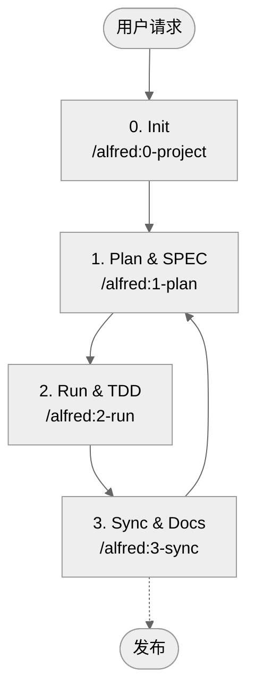

# MoAI-ADK (Agentic Development Kit)

[English](README.md) | [한국어](README.ko.md) | [ไทย](README.th.md) | [日本語](README.ja.md) | [中文](README.zh.md) | [हिन्दी](README.hi.md)

[](https://pypi.org/project/moai-adk/)
[](https://opensource.org/licenses/MIT)
[](https://www.python.org/)
[](https://github.com/modu-ai/moai-adk/actions/workflows/moai-gitflow.yml)
[](https://codecov.io/gh/modu-ai/moai-adk)
[](https://github.com/modu-ai/moai-adk)

> **MoAI-ADK 提供了一个自然连接规范（SPEC）→ 测试（TDD）→ 代码 → 文档的 AI 协作开发工作流程。**

---

## 1. MoAI-ADK 一览

MoAI-ADK 通过三个核心原则革新 AI 协作开发。使用下面的导航跳转到适合您情况的部分。

如果您是**第一次接触** MoAI-ADK，请从"什么是 MoAI-ADK？"开始。
如果您想**快速开始**，可以直接跳转到"5分钟快速开始"。
如果您**已经安装并想了解概念**，推荐阅读"轻松理解核心概念"。

| 问题                           | 快速跳转                                           |
| ------------------------------ | -------------------------------------------------- |
| 第一次接触，这是什么？         | [什么是 MoAI-ADK？](#什么是-moai-adk)              |
| 如何开始？                     | [5分钟快速开始](#5分钟快速开始)                    |
| 基本流程是什么？               | [基本工作流程 (0 → 3)](#基本工作流程-0--3)         |
| Plan / Run / Sync 命令做什么？ | [核心命令摘要](#核心命令摘要)                      |
| SPEC·TDD·TAG 是什么？          | [轻松理解核心概念](#轻松理解核心概念)              |
| Agent/Skills 是什么？          | [Sub-agent & Skills 概述](#sub-agent--skills-概述) |
| Claude Code Hooks 如何运作？   | [Claude Code Hooks 指南](#claude-code-hooks-指南) |
| 想做一个 4 周实战项目           | [第二个实战：Mini Kanban Board](#第二个实战-mini-kanban-board) |
| 想深入学习                     | [更多资源](#更多资源)                              |

---

## 什么是 MoAI-ADK？

### 问题：AI 开发的可信度危机

如今，许多开发者希望获得 Claude 或 ChatGPT 的帮助，但无法摆脱一个根本性的疑虑：**"AI 生成的代码真的可信吗？"**

现实是这样的：当您对 AI 说"创建登录功能"时，会得到语法完美的代码。但以下问题会反复出现:

- **需求不明确**："究竟要创建什么？"这个基本问题没有答案。邮箱/密码登录？OAuth？2FA？一切都依赖猜测。
- **缺少测试**：大多数 AI 只测试"happy path"。错误的密码？网络错误？3个月后生产环境中出现 bug。
- **文档不一致**：代码修改了，但文档保持不变。"这段代码为什么在这里？"这个问题不断重复。
- **上下文丢失**：即使在同一个项目中，每次都要从头解释。项目结构、决策原因、之前的尝试都没有记录。
- **无法评估变更影响**：需求变更时，无法追踪哪些代码会受到影响。

### 解决方案：SPEC-First TDD with Alfred SuperAgent

**MoAI-ADK**（MoAI Agentic Development Kit）是一个开源框架，专为**系统化解决**这些问题而设计。

核心原理简单但强大：

> **"没有代码就没有测试，没有测试就没有 SPEC"**

更准确地说是逆序：

> **"SPEC 优先。没有 SPEC 就没有测试。没有测试和代码，文档也不完整。"**

遵循这个顺序时，会发生奇迹般的事情：

**1️⃣ 明确的需求**
使用 `/alfred:1-plan` 命令首先编写 SPEC。"登录功能"这个模糊的请求会转换为"WHEN 提供有效凭证时，系统应该发放 JWT 令牌"这样的**明确需求**。Alfred 的 spec-builder 使用 EARS 语法在短短 3 分钟内创建专业的 SPEC。

**2️⃣ 测试保证**
`/alfred:2-run` 自动进行测试驱动开发（TDD）。按照 RED（失败测试）→ GREEN（最小实现）→ REFACTOR（代码清理）的顺序进行，**保证测试覆盖率在 85% 以上**。不再有"以后再测试"。测试引导代码编写。

**3️⃣ 文档自动同步**
一个 `/alfred:3-sync` 命令就能让代码、测试、文档**全部同步到最新状态**。README、CHANGELOG、API 文档，甚至 Living Document 都会自动更新。6个月后，代码和文档依然保持一致。

**4️⃣ @TAG 系统追踪**
所有代码、测试和文档都标记 `@TAG:ID`。稍后需求变更时，使用 `rg "@SPEC:AUTH-001"` 一个命令就能**找到所有相关的测试、实现和文档**。重构时更有信心。

**5️⃣ Alfred 记住上下文**
19个 AI 代理（Alfred SuperAgent 1 + Core Sub-agent 10 + Zero-project Specialist 6 + Built-in Agent 2）协作，**记住项目结构、决策原因和工作历史**。无需重复相同的问题。

### MoAI-ADK 的三个核心承诺

为了让初学者也能记住，MoAI-ADK 的价值简化为三点：

**第一，SPEC 优先于代码**
在开始前明确定义要创建什么。编写 SPEC 时可以在实现前发现问题。与团队成员的沟通成本大幅降低。

**第二，测试驱动代码（TDD）**
实现前先编写测试（RED）。编写使测试通过的最小实现（GREEN）。然后清理代码（REFACTOR）。结果：更少的 bug，重构更有信心，任何人都能理解的代码。

**第三，文档和代码始终一致**
一个 `/alfred:3-sync` 命令就能自动更新所有文档。README、CHANGELOG、API 文档、Living Document 始终与代码同步。修改半年前的代码时不再感到绝望。

---

## 为什么需要？

### AI 开发的实际挑战

现代 AI 协作开发面临各种挑战。MoAI-ADK **系统化地解决**所有这些问题：

| 困扰                     | 传统方式的问题                 | MoAI-ADK 的解决方案                           |
| ------------------------ | ------------------------------ | --------------------------------------------- |
| "无法信任 AI 代码"       | 没有测试的实现，验证方法不明确 | 强制 SPEC → TEST → CODE 顺序，保证覆盖率 85%+ |
| "每次都要重复相同的解释" | 上下文丢失，项目历史未记录     | Alfred 记住所有信息，19人 AI 团队协作         |
| "编写提示词困难"         | 不知道如何编写好的提示词       | `/alfred` 命令自动提供标准化提示词            |
| "文档总是过时"           | 代码修改后忘记更新文档         | `/alfred:3-sync` 一个命令自动同步             |
| "不知道修改了哪里"       | 代码搜索困难，意图不明确       | @TAG 链连接 SPEC → TEST → CODE → DOC          |
| "团队入职时间长"         | 新成员无法理解代码上下文       | 阅读 SPEC 即可立即理解意图                    |

### 立即体验到的好处

从引入 MoAI-ADK 的那一刻起，您就能感受到：

- **开发速度提升**：明确的 SPEC 减少往返解释时间
- **Bug 减少**：基于 SPEC 的测试提前发现问题
- **代码可理解性提升**：通过 @TAG 和 SPEC 立即了解意图
- **维护成本降低**：代码和文档始终一致
- **团队协作效率提升**：通过 SPEC 和 TAG 进行明确沟通

---

## 5分钟快速开始

现在让我们用 MoAI-ADK 开始第一个项目。按照以下5个步骤，**5分钟内**就能完成一个连接了 SPEC、TDD 和文档的项目。

### 步骤 1：安装 uv（约30秒）

首先安装 `uv`。`uv` 是用 Rust 编写的超高速 Python 包管理器。比传统的 `pip` **快10倍以上**，与 MoAI-ADK 完美兼容。

```bash
# macOS/Linux
curl -LsSf https://astral.sh/uv/install.sh | sh

# Windows (PowerShell)
powershell -c "irm https://astral.sh/uv/install.ps1 | iex"

# 验证安装
uv --version
# 输出：uv 0.x.x
```

**为什么选择 uv？** MoAI-ADK 经过优化，可以利用 uv 的快速安装速度和稳定性。项目隔离也很完善，不会影响其他 Python 环境。

### 步骤 2：安装 MoAI-ADK（约1分钟）

将 MoAI-ADK 作为全局工具安装。这不会影响项目依赖。

```bash
# 使用 tool 模式安装（推荐：在隔离环境中运行）
uv tool install moai-adk

# 验证安装
moai-adk --version
# 输出：MoAI-ADK v0.4.11
```

安装完成后，可以在任何地方使用 `moai-adk` 命令。

### 步骤 3：创建项目（约1分钟）

**开始新项目：**
```bash
moai-adk init my-project
cd my-project
```

**添加到现有项目：**
```bash
cd your-existing-project
moai-adk init .
```

这一个命令会自动生成以下内容：

```
my-project/
├── .moai/                   # MoAI-ADK 项目设置
│   ├── config.json
│   ├── project/             # 项目信息
│   ├── specs/               # SPEC 文件
│   └── reports/             # 分析报告
├── .claude/                 # Claude Code 自动化
│   ├── agents/              # 19人 AI 团队
│   ├── commands/            # /alfred 命令
│   ├── skills/              # 56个 Claude Skills
│   └── settings.json
├── src/                     # 实现代码
├── tests/                   # 测试代码
├── docs/                    # 自动生成的文档
└── README.md
```

### 步骤 4：在 Claude Code 中启动 Alfred（约2分钟）

运行 Claude Code 并调用 Alfred SuperAgent：

```bash
# 运行 Claude Code
claude
```

然后在 Claude Code 的命令输入框中输入：

```
/alfred:0-project
```

此命令执行以下操作：

1. **收集项目信息**："项目名称是什么？"、"目标是什么？"、"主要语言是什么？"
2. **自动检测技术栈**：自动识别 Python/JavaScript/Go 等
3. **部署 Skill Pack**：准备56个 Skills 中适合该语言的 Skills
4. **生成初始报告**：项目结构，下一步建议

### 步骤 5：编写第一个 SPEC（约1分钟）

项目初始化完成后，将第一个功能写成 SPEC：

```
/alfred:1-plan "用户注册功能"
```

自动生成的内容：
- `@SPEC:USER-001` - 分配唯一 ID
- `.moai/specs/SPEC-USER-001/spec.md` - EARS 格式的专业 SPEC
- `feature/spec-user-001` - 自动创建 Git 分支

### 步骤 6：TDD 实现（约3分钟）

编写 SPEC 后，以 TDD 方式实现：

```
/alfred:2-run USER-001
```

此命令处理：
- 🔴 **RED**：自动编写失败的测试（`@TEST:USER-001`）
- 🟢 **GREEN**：用最小实现通过测试（`@CODE:USER-001`）
- ♻️ **REFACTOR**：改进代码质量

### 步骤 7：同步文档（约1分钟）

最后自动同步所有文档：

```
/alfred:3-sync
```

自动生成/更新的内容：
- Living Document（API 文档）
- README 更新
- CHANGELOG 生成
- @TAG 链验证

### 完成！

经过这7个步骤，以下所有内容都已准备就绪：

✅ 需求规范（SPEC）
✅ 测试代码（覆盖率 85%+）
✅ 实现代码（使用 @TAG 追踪）
✅ API 文档（自动生成）
✅ 变更历史（CHANGELOG）
✅ Git 提交历史（RED/GREEN/REFACTOR）

**所有内容在15分钟内完成！**

### 验证生成的结果

检查生成的结果是否正确：

```bash
# 1. 检查 TAG 链（SPEC → TEST → CODE → DOC）
rg '@(SPEC|TEST|CODE):USER-001' -n

# 2. 运行测试
pytest tests/ -v

# 3. 检查生成的文档
cat docs/api/user.md
cat README.md
```

> 🔍 **验证命令**：`moai-adk doctor` — 检查 Python/uv 版本、`.moai/` 结构、代理/Skills 配置是否都已准备就绪。
> ```bash
> moai-adk doctor
> ```
> 如果所有绿色对勾都出现，说明准备完美！

---

## 保持 MoAI-ADK 最新版本

### 检查版本
```bash
# 检查当前安装的版本
moai-adk --version

# 在 PyPI 上检查最新版本
uv tool list  # 检查 moai-adk 的当前版本
```

### 升级

#### 方法 1：moai-adk 自身更新命令（最简单）
```bash
# MoAI-ADK 自身更新命令 - 同时更新代理/Skills 模板
moai-adk update

# 更新后将新模板应用到项目（可选）
moai-adk init .
```

#### 方法 2：使用 uv tool 命令升级

**升级特定工具（推荐）**
```bash
# 仅将 moai-adk 升级到最新版本
uv tool upgrade moai-adk
```

**升级所有已安装的工具**
```bash
# 将所有 uv tool 工具升级到最新版本
uv tool update
```

**安装特定版本**
```bash
# 重新安装特定版本（例如：0.4.2）
uv tool install moai-adk==0.4.2
```

### 更新后确认
```bash
# 1. 检查安装的版本
moai-adk --version

# 2. 检查项目是否正常运行
moai-adk doctor

# 3. 将新模板应用到现有项目（如需要）
cd your-project
moai-adk init .  # 保留现有代码，仅更新 .moai/ 结构和模板

# 4. 在 Alfred 中检查更新的功能
cd your-project
claude
/alfred:0-project  # 检查新的语言选择功能等
```

> 💡 **提示**：
> - `moai-adk update`：更新 MoAI-ADK 包版本 + 同步代理/Skills 模板
> - `moai-adk init .`：将新模板应用到现有项目（安全保留代码）
> - 同时执行这两个命令即可完成完整更新。
> - 当发布主要更新（minor/major）时，执行上述过程可以使用新的代理/Skills。

---

## 基本工作流程 (0 → 3)

Alfred 使用四个命令进行迭代开发。



### 0. INIT — 准备项目
- 询问项目介绍、目标、语言、模式（locale）
- 自动生成 `.moai/config.json`、`.moai/project/*` 文档5种
- 检测语言并部署推荐的 Skill Pack（Foundation + Essentials + Domain/Language）
- 清理模板，检查初始 Git/备份

### 1. PLAN — 就要创建什么达成一致
- 使用 EARS 模板编写 SPEC（包含 `@SPEC:ID`）
- 整理 Plan Board、实现想法、风险因素
- 如果是 Team 模式，自动创建分支/初始 Draft PR

### 2. RUN — 测试驱动开发（TDD）
- Phase 1 `implementation-planner`：设计库、文件夹、TAG
- Phase 2 `tdd-implementer`：RED（失败测试）→ GREEN（最小实现）→ REFACTOR（清理）
- quality-gate 验证 TRUST 5 原则、覆盖率变化

### 3. SYNC — 文档 & PR 清理
- 同步 Living Document、README、CHANGELOG 等文档
- 验证 TAG 链并恢复 orphan TAG
- 生成 Sync Report，从 Draft → Ready for Review 转换，支持 `--auto-merge` 选项

---

## 核心命令摘要

| 命令                      | 做什么？                                    | 主要产出                                                         |
| ------------------------- | ------------------------------------------- | ---------------------------------------------------------------- |
| `/alfred:0-project`       | 收集项目描述，生成设置·文档，推荐 Skill     | `.moai/config.json`、`.moai/project/*`、初始报告                 |
| `/alfred:1-plan <描述>`   | 分析需求，编写 SPEC 草稿，编写 Plan Board   | `.moai/specs/SPEC-*/spec.md`、plan/acceptance 文档、feature 分支 |
| `/alfred:2-run <SPEC-ID>` | 执行 TDD，测试/实现/重构，质量验证          | `tests/`、`src/` 实现、质量报告、TAG 连接                        |
| `/alfred:3-sync`          | 同步文档/README/CHANGELOG，整理 TAG/PR 状态 | `docs/`、`.moai/reports/sync-report.md`、Ready PR                |

> ❗ 所有命令都维护 **Phase 0（可选）→ Phase 1 → Phase 2 → Phase 3** 循环结构。Alfred 会自动报告执行期间的状态和下一步建议。

---

## 轻松理解核心概念

MoAI-ADK 由5个核心概念组成。每个概念相互连接，一起工作时创建强大的开发系统。

### 核心概念 1：SPEC-First（需求优先）

**比喻**：就像没有建筑师就不能建造建筑一样，没有设计图就不能编码。

**核心**：在实现前**"明确定义要创建什么"**。这不是简单的文档，而是团队和 AI 可以共同理解的**可执行规范**。

**EARS 语法的5种模式**：

1. **Ubiquitous**（基本功能）："系统应该提供基于 JWT 的认证"
2. **Event-driven**（条件）："WHEN 提供有效凭证时，系统应该发放令牌"
3. **State-driven**（状态中）："WHILE 用户处于认证状态时，系统应该允许访问受保护的资源"
4. **Optional**（可选）："WHERE 存在刷新令牌时，系统可以发放新令牌"
5. **Constraints**（约束）："令牌过期时间不应超过15分钟"

**如何操作？** `/alfred:1-plan` 命令自动以 EARS 格式创建专业的 SPEC。

**获得的好处**：
- ✅ 团队所有人都理解的明确需求
- ✅ 基于 SPEC 的测试用例（已经定义了要测试什么）
- ✅ 需求变更时，可以通过 `@SPEC:ID` TAG 追踪所有受影响的代码

---

### 核心概念 2：TDD（Test-Driven Development）

**比喻**：就像确定目的地后再找路一样，用测试确定目标后再编写代码。

**核心**：在实现**之前**先编写测试。这就像烹饪前先确认材料一样，在实现前明确需求是什么。

**3步循环**：

1. **🔴 RED**：首先编写失败的测试
   - SPEC 的每个需求都成为测试用例
   - 因为还没有实现，所以必然失败
   - Git 提交：`test(AUTH-001): add failing test`

2. **🟢 GREEN**：进行使测试通过的最小实现
   - 用最简单的方法通过测试
   - 通过优先于完美
   - Git 提交：`feat(AUTH-001): implement minimal solution`

3. **♻️ REFACTOR**：清理和改进代码
   - 应用 TRUST 5 原则
   - 消除重复，提高可读性
   - 测试仍然应该通过
   - Git 提交：`refactor(AUTH-001): improve code quality`

**如何操作？** `/alfred:2-run` 命令自动进行这3个步骤。

**获得的好处**：
- ✅ 保证覆盖率 85% 以上（没有没测试的代码）
- ✅ 重构信心（随时可以通过测试验证）
- ✅ 清晰的 Git 历史（追踪 RED → GREEN → REFACTOR 过程）

---

### 核心概念 3：@TAG 系统

**比喻**：就像快递单号一样，应该能追踪代码的旅程。

**核心**：在所有 SPEC、测试、代码、文档上标记 `@TAG:ID` 以创建**一对一对应**。

**TAG 链**：
```
@SPEC:AUTH-001（需求）
    ↓
@TEST:AUTH-001（测试）
    ↓
@CODE:AUTH-001（实现）
    ↓
@DOC:AUTH-001（文档）
```

**TAG ID 规则**：`<域>-<3位数字>`
- AUTH-001、AUTH-002、AUTH-003...
- USER-001、USER-002...
- 一旦分配，**绝不更改**

**如何使用？** 需求变更时：
```bash
# 查找与 AUTH-001 相关的所有内容
rg '@TAG:AUTH-001' -n

# 结果：SPEC、TEST、CODE、DOC 一次性全部显示
# → 清楚知道需要修改哪里
```

**如何操作？** `/alfred:3-sync` 命令验证 TAG 链，检测 orphan TAG（未对应的 TAG）。

**获得的好处**：
- ✅ 所有代码的意图都清晰（阅读 SPEC 就能理解为什么有这段代码）
- ✅ 重构时立即了解所有受影响的代码
- ✅ 3个月后仍然能理解代码（TAG → SPEC 追踪）

---

### 核心概念 4：TRUST 5原则

**比喻**：就像健康的身体一样，好的代码必须满足5个要素。

**核心**：所有代码都必须遵守以下5个原则。`/alfred:3-sync` 会自动验证这些。

1. **🧪 Test First**（测试优先）
   - 测试覆盖率 ≥ 85%
   - 所有代码都受测试保护
   - 功能添加 = 测试添加

2. **📖 Readable**（可读代码）
   - 函数 ≤ 50行，文件 ≤ 300行
   - 变量名体现意图
   - 通过 Linter（ESLint/ruff/clippy）

3. **🎯 Unified**（一致结构）
   - 维护基于 SPEC 的架构
   - 相同模式重复（降低学习曲线）
   - 类型安全或运行时验证

4. **🔒 Secured**（安全）
   - 输入验证（防御 XSS、SQL 注入）
   - 密码哈希（bcrypt、Argon2）
   - 保护敏感信息（环境变量）

5. **🔗 Trackable**（可追踪）
   - 使用 @TAG 系统
   - Git 提交包含 TAG
   - 所有决策都有文档

**如何操作？** `/alfred:3-sync` 命令自动执行 TRUST 验证。

**获得的好处**：
- ✅ 保证生产质量的代码
- ✅ 整个团队按相同标准开发
- ✅ 减少 bug，提前预防安全漏洞

---

### 核心概念 5：Alfred SuperAgent

**比喻**：就像私人助理一样，Alfred 处理所有复杂的事情。

**核心**：**19个 AI 代理**协作，自动化整个开发过程：

**代理组成**：
- **Alfred SuperAgent**：整体编排（1个）
- **Core Sub-agent**：SPEC 编写、TDD 实现、文档同步等专业工作（10个）
- **Zero-project Specialist**：项目初始化、语言检测等（6个）
- **Built-in Agent**：一般问题、代码库探索（2个）

**56个 Claude Skills**：
- **Foundation**（6）：TRUST/TAG/SPEC/Git/EARS 原则
- **Essentials**（4）：调试、性能、重构、代码审查
- **Alfred**（11）：工作流程自动化
- **Domain**（10）：后端、前端、安全等
- **Language**（24）：Python、JavaScript、Go、Rust 等
- **Ops**（1）：Claude Code 会话管理

**如何操作？** `/alfred:*` 命令自动激活所需的专家团队。

**获得的好处**：
- ✅ 无需编写提示词（使用标准化命令）
- ✅ 自动记住项目上下文（不重复相同问题）
- ✅ 自动配置最佳专家团队（根据情况激活 Sub-agent）

> **想深入了解吗？** 在 `.moai/memory/development-guide.md` 中可以查看详细规则。

---

## 第一次实践：Todo API 示例

现在让我们**亲身体验** MoAI-ADK 的**完整工作流程**。在创建简单的"待办事项管理 API"时，看看 SPEC、TDD 和文档如何连接。

### 步骤 1：PLAN - 编写 SPEC（约3分钟）

```bash
/alfred:1-plan "待办事项添加、查询、修改、删除 API"
```

**执行结果**：

Alfred 的 **spec-builder** 自动生成以下内容：

```yaml
# .moai/specs/SPEC-TODO-001/spec.md

---
id: TODO-001
version: 0.0.1
status: draft
created: 2025-10-22
updated: 2025-10-22
author: @user
priority: high
---

# @SPEC:TODO-001: Todo Management API

## Ubiquitous Requirements
- 系统应该能够添加待办事项
- 系统应该能够查询所有待办事项
- 系统应该能够修改特定待办事项
- 系统应该能够删除待办事项

## Event-driven Requirements
- WHEN 通过 POST /todos 请求新的待办事项时，系统应该保存待办事项并返回 201 响应
- WHEN 使用存在的待办事项 ID 请求 GET /todos/{id} 时，系统应该返回该待办事项
- WHEN 使用不存在的待办事项 ID 请求 GET 时，系统应该返回 404 错误

## Constraints
- 待办事项标题应该至少1个字符，最多200个字符
- 每个待办事项应该自动记录创建时间
```

**同时也会自动生成**：
- 📋 `Plan Board`：实现想法、风险因素、解决策略
- ✅ `Acceptance Criteria`：验证标准
- 🌿 `feature/spec-todo-001` Git 分支

### 步骤 2：RUN - TDD 实现（约5分钟）

```bash
/alfred:2-run TODO-001
```

**Phase 1：制定实现策略**

**implementation-planner** Sub-agent 决定以下内容：
- 📚 库：FastAPI + SQLAlchemy
- 📁 文件夹结构：`src/todo/`、`tests/todo/`
- 🏷️ TAG 设计：`@CODE:TODO-001:API`、`@CODE:TODO-001:MODEL`、`@CODE:TODO-001:REPO`

**Phase 2：RED → GREEN → REFACTOR**

**🔴 RED：首先编写测试**

```python
# tests/test_todo_api.py
# @TEST:TODO-001 | SPEC: SPEC-TODO-001.md

import pytest
from src.todo.api import create_todo, get_todos

def test_create_todo_should_return_201_with_todo_id():
    """WHEN 通过 POST /todos 请求新的待办事项时，
    系统应该保存待办事项并返回 201 响应"""
    response = create_todo({"title": "Buy groceries"})
    assert response.status_code == 201
    assert "id" in response.json()
    assert response.json()["title"] == "Buy groceries"

def test_get_todos_should_return_all_todos():
    """系统应该能够查询所有待办事项"""
    create_todo({"title": "Task 1"})
    create_todo({"title": "Task 2"})

    response = get_todos()
    assert response.status_code == 200
    assert len(response.json()) >= 2

def test_get_todo_with_invalid_id_should_return_404():
    """WHEN 使用不存在的待办事项 ID 请求 GET 时，
    系统应该返回 404 错误"""
    response = get_todo(999)
    assert response.status_code == 404
```

**执行**：`pytest tests/test_todo_api.py -v`
**结果**：❌ 全部失败（create_todo 未定义）

**Git 提交**：
```bash
git commit -m "🔴 test(TODO-001): add failing API tests"
```

**🟢 GREEN：最小实现**

```python
# src/todo/api.py
# @CODE:TODO-001:API | SPEC: SPEC-TODO-001.md | TEST: tests/test_todo_api.py

from fastapi import FastAPI, HTTPException
from pydantic import BaseModel
import uuid

app = FastAPI()
todos_db = {}

class TodoRequest(BaseModel):
    title: str

@app.post("/todos", status_code=201)
def create_todo(todo: TodoRequest):
    """@CODE:TODO-001:API - POST 端点"""
    todo_id = str(uuid.uuid4())
    todos_db[todo_id] = {"id": todo_id, "title": todo.title}
    return todos_db[todo_id]

@app.get("/todos")
def get_todos():
    """@CODE:TODO-001:API - GET all 端点"""
    return list(todos_db.values())

@app.get("/todos/{todo_id}")
def get_todo(todo_id: str):
    """@CODE:TODO-001:API - GET by ID 端点"""
    if todo_id not in todos_db:
        raise HTTPException(status_code=404, detail="Todo not found")
    return todos_db[todo_id]
```

**执行**：`pytest tests/test_todo_api.py -v`
**结果**：✅ 全部通过！

**Git 提交**：
```bash
git commit -m "🟢 feat(TODO-001): implement minimal Todo API"
```

**♻️ REFACTOR：代码改进**

```python
# src/todo/models.py
# @CODE:TODO-001:MODEL | SPEC: SPEC-TODO-001.md

from datetime import datetime
from sqlalchemy import Column, String, DateTime
from sqlalchemy.ext.declarative import declarative_base

Base = declarative_base()

class Todo(Base):
    """@CODE:TODO-001:MODEL - 待办事项数据模型"""
    __tablename__ = "todos"

    id = Column(String, primary_key=True)
    title = Column(String(200), nullable=False, index=True)  # 约束：最多200字符
    created_at = Column(DateTime, default=datetime.utcnow)   # 自动生成时间

    def validate(self):
        """@CODE:TODO-001:MODEL - 验证"""
        if not self.title or len(self.title) > 200:
            raise ValueError("Title must be 1-200 characters")
```

**执行**：`pytest tests/test_todo_api.py -v`
**结果**：✅ 仍然全部通过！

**Git 提交**：
```bash
git commit -m "♻️ refactor(TODO-001): add database models and validation"
```

**Phase 3：质量验证**

```bash
# TRUST 验证
✅ Test First: 覆盖率 87%
✅ Readable: 所有函数 < 50行
✅ Unified: API 模式一致
✅ Secured: 输入验证完成
✅ Trackable: 所有代码都标记 @TAG:TODO-001
```

### 步骤 3：SYNC - 同步文档（约1分钟）

```bash
/alfred:3-sync
```

**自动执行的操作**：

1. **TAG 链验证**
   ```bash
   ✅ @SPEC:TODO-001 → .moai/specs/SPEC-TODO-001/spec.md
   ✅ @TEST:TODO-001 → tests/test_todo_api.py
   ✅ @CODE:TODO-001 → src/todo/（3个文件）
   ✅ @DOC:TODO-001 → docs/api/todo.md（自动生成）

   TAG Chain Integrity: 100%
   Orphan TAGs: None
   ```

2. **生成 Living Document**
   ```markdown
   # @DOC:TODO-001: Todo Management API

   ## Overview
   用于通过 CRUD 操作管理任务的 REST API。

   ## Endpoints

   ### Create Todo
   - Method: POST
   - URL: /todos
   - Request: {"title": "string (1-200 chars)"}
   - Response: 201 Created with todo object
   - Implemented in: @CODE:TODO-001:API
   - Tested in: @TEST:TODO-001

   ### Get All Todos
   - Method: GET
   - URL: /todos
   - Response: 200 OK with array of todos

   [... etc ...]
   ```

3. **README 更新**
   ```markdown
   ## Features

   - ✅ Todo Management API (AUTH-001)
   ```

4. **CHANGELOG 生成**
   ```markdown
   # Changelog

   ## [0.1.0] - 2025-10-22

   ### Added
   - Todo Management API with CRUD operations (@SPEC:TODO-001)
     - 创建新待办事项
     - 列出所有待办事项
     - 更新现有待办事项
     - 删除待办事项

   ### Implementation Details
   - SPEC: .moai/specs/SPEC-TODO-001/spec.md
   - Tests: tests/test_todo_api.py (87% coverage)
   - Code: src/todo/ with models, API, repository layers
   ```

### 步骤 4：验证（约1分钟）

让我们检查生成的所有内容是否正确连接：

```bash
# 1️⃣ 检查 TAG 链
rg '@(SPEC|TEST|CODE|DOC):TODO-001' -n

# 输出：
# .moai/specs/SPEC-TODO-001/spec.md:1: # @SPEC:TODO-001: Todo Management API
# tests/test_todo_api.py:2: # @TEST:TODO-001 | SPEC: SPEC-TODO-001.md
# src/todo/api.py:5: # @CODE:TODO-001:API | SPEC: SPEC-TODO-001.md
# src/todo/models.py:5: # @CODE:TODO-001:MODEL | SPEC: SPEC-TODO-001.md
# docs/api/todo.md:1: # @DOC:TODO-001: Todo Management API


# 2️⃣ 运行测试
pytest tests/test_todo_api.py -v
# ✅ test_create_todo_should_return_201_with_todo_id PASSED
# ✅ test_get_todos_should_return_all_todos PASSED
# ✅ test_get_todo_with_invalid_id_should_return_404 PASSED
# ✅ 3 passed in 0.05s


# 3️⃣ 检查生成的文档
cat docs/api/todo.md              # API 文档自动生成
cat README.md                      # 添加了 Todo API
cat CHANGELOG.md                   # 记录了变更历史


# 4️⃣ 检查 Git 历史
git log --oneline | head -5
# a1b2c3d ✅ sync(TODO-001): update docs and changelog
# f4e5d6c ♻️ refactor(TODO-001): add database models
# 7g8h9i0 🟢 feat(TODO-001): implement minimal API
# 1j2k3l4 🔴 test(TODO-001): add failing tests
# 5m6n7o8 🌿 Create feature/spec-todo-001 branch
```

### 15分钟后：完整系统

```
✅ SPEC 编写（3分钟）
   └─ 分配 @SPEC:TODO-001 TAG
   └─ EARS 格式的明确需求

✅ TDD 实现（5分钟）
   └─ 🔴 RED：首先编写测试
   └─ 🟢 GREEN：最小实现
   └─ ♻️ REFACTOR：质量改进
   └─ 分配 @TEST:TODO-001、@CODE:TODO-001 TAG
   └─ 覆盖率 87%，TRUST 5 原则验证

✅ 文档同步（1分钟）
   └─ 自动生成 Living Document
   └─ 更新 README、CHANGELOG
   └─ 完成 TAG 链验证
   └─ 分配 @DOC:TODO-001 TAG
   └─ PR 状态：Draft → Ready for Review

结果：
- 📋 清晰的 SPEC（SPEC-TODO-001.md）
- 🧪 85% 以上的测试覆盖率（test_todo_api.py）
- 💎 生产质量的代码（src/todo/）
- 📖 自动生成的 API 文档（docs/api/todo.md）
- 📝 变更历史追踪（CHANGELOG.md）
- 🔗 所有内容都通过 TAG 连接
```

> **这就是 MoAI-ADK 的真正力量。** 不是简单的 API 实现，
> 而是创建了从 SPEC 到测试、代码、文档都一致连接的**完整开发产物**！

---

## Sub-agent & Skills 概述

Alfred 结合 **19个代理**（SuperAgent 1 + Core Sub-agent 10 + 0-project Sub-agent 6 + Built-in 2）和 **56个 Claude Skills** 工作。

### Core Sub-agents（Plan → Run → Sync）

| Sub-agent         | 模型   | 角色                                                           |
| ----------------- | ------ | -------------------------------------------------------------- |
| project-manager 📋 | Sonnet | 项目初始化，元数据采访                                         |
| spec-builder 🏗️    | Sonnet | Plan 看板，EARS SPEC 编写                                      |
| code-builder 💎    | Sonnet | 通过 `implementation-planner` + `tdd-implementer` 执行完整 TDD |
| doc-syncer 📖      | Haiku  | Living Doc、README、CHANGELOG 同步                             |
| tag-agent 🏷️       | Haiku  | TAG 清单，orphan 检测                                          |
| git-manager 🚀     | Haiku  | GitFlow、Draft/Ready、Auto Merge                               |
| debug-helper 🔍    | Sonnet | 失败分析，fix-forward 策略                                     |
| trust-checker ✅   | Haiku  | TRUST 5 质量门                                                 |
| quality-gate 🛡️    | Haiku  | 检查覆盖率变化和发布阻止条件                                   |
| cc-manager 🛠️      | Sonnet | Claude Code 会话优化，Skill 部署                               |

### Skills（Progressive Disclosure - v0.4 新功能！）

Alfred 使用 4-tier 架构配置 **56个 Claude Skills**，采用**渐进披露（Progressive Disclosure）**方式，仅在需要时 Just-In-Time 加载。每个 Skill 是存储在 `.claude/skills/` 目录中的超过1,000行的生产级指南。

#### Foundation Tier（6）
包含核心 TRUST/TAG/SPEC/Git/EARS/Language 原则的基础技能

| Skill                   | 描述                                                                       |
| ----------------------- | -------------------------------------------------------------------------- |
| `moai-foundation-trust` | TRUST 5-principles（Test 85%+、Readable、Unified、Secured、Trackable）验证 |
| `moai-foundation-tags`  | @TAG 标记扫描和清单生成（CODE-FIRST 原则）                                 |
| `moai-foundation-specs` | SPEC YAML frontmatter（7个必需字段）和 HISTORY 部分验证                    |
| `moai-foundation-ears`  | EARS（Easy Approach to Requirements Syntax）需求编写指南                   |
| `moai-foundation-git`   | Git 工作流程自动化（分支、TDD 提交、PR 管理）                              |
| `moai-foundation-langs` | 项目语言/框架自动检测（package.json、pyproject.toml 等）                   |

#### Essentials Tier（4）
日常开发工作所需的核心工具

| Skill                      | 描述                                     |
| -------------------------- | ---------------------------------------- |
| `moai-essentials-debug`    | 堆栈跟踪分析，错误模式检测，快速诊断支持 |
| `moai-essentials-perf`     | 性能分析，瓶颈检测，调优策略             |
| `moai-essentials-refactor` | 重构指南，设计模式，代码改进策略         |
| `moai-essentials-review`   | 自动代码审查，SOLID 原则，代码异味检测   |

#### Alfred Tier（11）
MoAI-ADK 内部工作流程编排技能

| Skill                                  | 描述                                                             |
| -------------------------------------- | ---------------------------------------------------------------- |
| `moai-alfred-code-reviewer`            | 包含语言特定最佳实践、SOLID 原则、改进建议的自动代码审查         |
| `moai-alfred-debugger-pro`             | 堆栈跟踪分析，错误模式检测，复杂运行时错误解释                   |
| `moai-alfred-ears-authoring`           | EARS 语法验证，5种需求模式指南                                   |
| `moai-alfred-git-workflow`             | MoAI-ADK conventions（feature 分支、TDD 提交、Draft PR）自动化   |
| `moai-alfred-language-detection`       | 项目语言/运行时检测，基本测试工具推荐                            |
| `moai-alfred-performance-optimizer`    | 性能分析，瓶颈检测，语言特定优化                                 |
| `moai-alfred-refactoring-coach`        | 重构指南，设计模式，分步改进计划                                 |
| `moai-alfred-spec-metadata-validation` | SPEC YAML frontmatter（7个字段）和 HISTORY 部分一致性验证        |
| `moai-alfred-tag-scanning`             | @TAG 标记完整扫描和清单生成（CODE-FIRST 原则）                   |
| `moai-alfred-trust-validation`         | TRUST 5-principles 合规性验证（Test 85%+、约束、安全、可追踪性） |

---

## Claude Code Hooks 指南

MoAI-ADK 提供 5 个与开发流程无缝集成的 Claude Code Hooks。它们在会话开始/结束、工具执行前后、提交提示词时自动触发，完成检查点、JIT 上下文加载、会话管理等任务。

### 什么是 Hook？

Hook 是在 Claude Code 会话关键事件上自动触发的事件驱动脚本，在不打断工作流的情况下提供安全与效率。

### 已安装的 Hooks（共 5 个）

| Hook | 状态 | 功能 |
|------|------|------|
| SessionStart | ✅ 启用 | 项目状态摘要（语言、Git、SPEC 进度、检查点） |
| PreToolUse | ✅ 启用 | 风险检测 + 自动检查点（删除/合并/批量编辑/关键文件） + **TAG Guard**（检测缺失的@TAG） |
| UserPromptSubmit | ✅ 启用 | JIT 上下文加载（自动加载相关 SPEC/测试/代码/文档） |
| PostToolUse | ✅ 启用 | 代码更改后自动运行测试（Python/TS/JS/Go/Rust/Java 等） |
| SessionEnd | ✅ 启用 | 会话清理与状态保存 |

### PreToolUse Hook：TAG Guard 功能（v0.4.11新功能）

**TAG Guard** 是在 PreToolUse Hook 中运行的自动 @TAG 验证系统，确保所有修改的 SPEC/TEST/CODE/DOC 文件都包含适当的 @TAG 标记。

**工作原理**：
- 在文件编辑、Bash 命令或 MultiEdit 操作之前触发
- 扫描已暂存、已修改和未跟踪的文件
- 当 SPEC/TEST/CODE/DOC 文件缺少 @TAG 标记时发出警告
- 通过 `.moai/tag-rules.json` 配置规则
- 非阻塞方式（温和提醒，不停止执行）

**检测范围**：
- `.moai/specs/` 目录中的 SPEC 文件 → 期望 `@SPEC:` 标记
- `tests/` 目录中的测试文件 → 期望 `@TEST:` 标记
- `src/` 目录中的代码文件 → 期望 `@CODE:` 标记
- `docs/` 目录中的文档文件 → 期望 `@DOC:` 标记

**示例警告**：
```
⚠️ 检测到缺失TAG：创建/修改的文件中缺少@TAG
 - src/auth/service.py → 预期标签: @CODE:
 - tests/test_auth.py → 预期标签: @TEST:
建议操作:
  1) 在文件头部添加适合SPEC/TEST/CODE/DOC类型的@TAG
  2) 使用rg确认: rg '@(SPEC|TEST|CODE|DOC):' -n <路径>
```

**为什么重要**：确保所有代码更改都具有可追溯性。通过 @TAG 系统，您可以轻松跟踪需求（SPEC）→测试（TEST）→实现（CODE）→文档（DOC）的完整链条。

### 技术细节

- 位置: `.claude/hooks/alfred/`
- 环境变量: `$CLAUDE_PROJECT_DIR`（动态指向项目根目录）
- 性能: 每个 Hook 执行 <100ms
- 日志: 错误输出至 stderr（stdout 仅用于 JSON 载荷）

### 如何禁用

在 `.claude/settings.json` 中按需禁用：

```json
{
  "hooks": {
    "SessionStart": [],
    "PreToolUse": ["risk-detector", "checkpoint-maker"]
  }
}
```

### 故障排查

- 未执行: 检查 `.claude/settings.json`、确认安装 `uv`、给予执行权限 `chmod +x .claude/hooks/alfred/alfred_hooks.py`
- 性能下降: 检查是否超过 100ms、禁用不必要 Hook、查看 stderr 错误
- 检查点过多: 调整 PreToolUse 触发条件与阈值（`core/checkpoint.py`）
| `moai-alfred-interactive-questions`    | Claude Code Tools AskUserQuestion TUI 菜单标准化                 |

#### Domain Tier（10）
专业领域专业知识

| Skill                      | 描述                                                     |
| -------------------------- | -------------------------------------------------------- |
| `moai-domain-backend`      | 后端架构，API 设计，扩展指南                             |
| `moai-domain-cli-tool`     | CLI 工具开发，参数解析，POSIX 合规，用户友好的帮助消息   |
| `moai-domain-data-science` | 数据分析，可视化，统计建模，可重现的研究工作流程         |
| `moai-domain-database`     | 数据库设计，模式优化，索引策略，迁移管理                 |
| `moai-domain-devops`       | CI/CD 管道，Docker 容器化，Kubernetes 编排，IaC          |
| `moai-domain-frontend`     | React/Vue/Angular 开发，状态管理，性能优化，可访问性     |
| `moai-domain-ml`           | 机器学习模型训练，评估，部署，MLOps 工作流程             |
| `moai-domain-mobile-app`   | Flutter/React Native 开发，状态管理，原生集成            |
| `moai-domain-security`     | OWASP Top 10，静态分析（SAST），依赖安全，secrets 管理   |
| `moai-domain-web-api`      | REST API、GraphQL 设计模式，认证，版本管理，OpenAPI 文档 |

#### Language Tier（24）
编程语言特定最佳实践

| Skill                  | 描述                                                   |
| ---------------------- | ------------------------------------------------------ |
| `moai-lang-python`     | pytest、mypy、ruff、black、uv 包管理                   |
| `moai-lang-typescript` | Vitest、Biome、strict typing、npm/pnpm                 |
| `moai-lang-javascript` | Jest、ESLint、Prettier、npm 包管理                     |
| `moai-lang-go`         | go test、golint、gofmt、标准库                         |
| `moai-lang-rust`       | cargo test、clippy、rustfmt、ownership/borrow checker  |
| `moai-lang-java`       | JUnit、Maven/Gradle、Checkstyle、Spring Boot 模式      |
| `moai-lang-kotlin`     | JUnit、Gradle、ktlint、coroutines、extension functions |
| `moai-lang-swift`      | XCTest、SwiftLint、iOS/macOS 开发模式                  |
| `moai-lang-dart`       | flutter test、dart analyze、Flutter widget 模式        |
| `moai-lang-csharp`     | xUnit、.NET tooling、LINQ、async/await 模式            |
| `moai-lang-cpp`        | Google Test、clang-format、现代 C++（C++17/20）        |
| `moai-lang-c`          | Unity test framework、cppcheck、Make 构建系统          |
| `moai-lang-scala`      | ScalaTest、sbt、函数式编程模式                         |
| `moai-lang-ruby`       | RSpec、RuboCop、Bundler、Rails 模式                    |
| `moai-lang-php`        | PHPUnit、Composer、PSR 标准                            |
| `moai-lang-sql`        | 测试框架，查询优化，迁移管理                           |
| `moai-lang-shell`      | bats、shellcheck、POSIX 合规                           |
| `moai-lang-haskell`    | HUnit、Stack/Cabal、纯函数式编程                       |
| `moai-lang-elixir`     | ExUnit、Mix、OTP 模式                                  |
| `moai-lang-clojure`    | clojure.test、Leiningen、不可变数据结构                |
| `moai-lang-lua`        | busted、luacheck、嵌入式脚本模式                       |
| `moai-lang-julia`      | Test stdlib、Pkg manager、科学计算模式                 |
| `moai-lang-r`          | testthat、lintr、数据分析模式                          |
| `moai-lang-kotlin`     | JUnit、Gradle、ktlint、coroutines、extension functions |

#### Claude Code Ops（1）
Claude Code 会话管理

| Skill              | 描述                                                                 |
| ------------------ | -------------------------------------------------------------------- |
| `moai-claude-code` | Claude Code agents、commands、skills、plugins、settings 脚手架和监控 |

> **v0.4.10 新功能**：56个 Claude Skills 采用 4-tier 架构配置（v0.4.10 100% 完成）。每个 Skill 通过渐进披露仅在需要时加载，最小化上下文成本。由 Foundation → Essentials → Alfred → Domain/Language/Ops 层组成，所有技能都包含超过1,000行的官方文档和300+ 可执行的 TDD 示例。

---

## AI 模型选择指南

| 情况                           | 基本模型              | 原因                         |
| ------------------------------ | --------------------- | ---------------------------- |
| 规范/设计/重构/问题解决        | **Claude 4.5 Sonnet** | 擅长深度推理和结构化写作     |
| 文档同步、TAG 检查、Git 自动化 | **Claude 4.5 Haiku**  | 擅长快速迭代工作、字符串处理 |

- 对于模式化的工作从 Haiku 开始，如果需要复杂判断则切换到 Sonnet。
- 如果手动更改了模型，在日志中记录"为什么切换"有助于协作。

---

## 常见问题（FAQ）

- **Q. 可以安装到现有项目吗？**
  - A. 可以。运行 `moai-adk init .` 只会添加 `.moai/` 结构，不会触及现有代码。
- **Q. 如何运行测试？**
  - A. `/alfred:2-run` 会先运行，如需要可以再运行 `pytest`、`pnpm test` 等语言特定命令。
- **Q. 如何确认文档始终是最新的？**
  - A. `/alfred:3-sync` 生成 Sync Report。在 Pull Request 中检查报告。
- **Q. 可以手动进行吗？**
  - A. 可以，但必须遵守 SPEC → TEST → CODE → DOC 顺序并务必留下 TAG。

---

## 最新更新（新！）

| 版本       | 主要功能                                                                | 日期       |
| ---------- | ----------------------------------------------------------------------- | ---------- |
| **v0.4.11** | ✨ TAG Guard系统 + CLAUDE.md格式改进 + 代码清理 | 2025-10-23 |
| **v0.4.10** | 🎉 完整 Skills v2.0 完成（100% Production-Ready）+ 85,000行官方文档 + 300+ TDD 示例 | 2025-10-22 |
| **v0.4.9** | 🎯 Hook JSON schema验证修复 + 全面测试（468/468通过） | 2025-10-23 |
| **v0.4.8** | 🚀 发布自动化 + PyPI部署 + Skills优化 | 2025-10-23 |
| **v0.4.7** | 📖 韩语优化 + SPEC-First原则文档 | 2025-10-22 |
| **v0.4.6** | 🎉 完整 Skills v2.0（100%生产就绪）+ 85,000行官方文档 + 300+ TDD示例 | 2025-10-22 |

> 📦 **立即安装**：`pip install moai-adk==0.4.11` 或 `uv tool install moai-adk==0.4.11`

---

## 第二个实战：Mini Kanban Board

本节超越第一个 Todo API 示例，带你完成一个为期 4 周的完整全栈项目。

我们将一起构建一个 Mini Kanban Board Web 应用，专为系统化掌握 MoAI‑ADK 而设计。该项目覆盖 SPEC‑First TDD 的每一步。

### 项目概览

- 后端：FastAPI + Pydantic v2 + uv + WebSocket（Python）
- 前端：React 19 + TypeScript 5.9 + Vite + Zustand + TanStack Query
- 实时：通过 WebSocket 进行多客户端同步
- 存储：本地文件系统（.moai/specs/）
- DevOps：Docker Compose + GitHub Actions CI/CD + Playwright E2E

### 4 周时间表

```mermaid
gantt
    title Mini Kanban Board - 4-week plan
    dateFormat YYYY-MM-DD

    section 阶段 1：后端基础
    CH07: 定义 SPEC-001-004           :active, ch07-spec, 2025-11-03, 1d
    CH07: 实现 SpecScanner（TDD）     :active, ch07-impl, 2025-11-04, 1d

    section 阶段 2：后端进阶
    CH08: 实现 REST API               :active, ch08-api, 2025-11-05, 1d
    WebSocket + 文件监听        :active, ch08-ws, 2025-11-06, 1d

    section 阶段 3：前端基础
    CH09: React 初始化 + SPEC-009-012 :active, ch09-spec, 2025-11-10, 1d
    CH09: 看板页面（TDD）             :active, ch09-impl, 2025-11-11, 1d

    section 阶段 4：高级 + 部署
    E2E + CI/CD                 :active, ch10-e2e, 2025-11-12, 1d
    Docker Compose + 优化       :active, ch10-deploy, 2025-11-13, 1d
```

### 16 个 SPEC 路线图

| 阶段 | SPEC | 标题 | 技术栈 | 预估 | 状态 |
|------|------|------|--------|------|------|
| 后端基础 | SPEC-001 | SPEC 文件扫描 | FastAPI + pathlib + YAML | 1h | 📋 |
|  | SPEC-002 | YAML 元数据解析 | Pydantic v2 校验 | 1h | 📋 |
|  | SPEC-003 | GET /api/specs（列表） | FastAPI 路由 | 0.5h | 📋 |
|  | SPEC-004 | GET /api/specs/{id}（详情） | FastAPI 路由 | 0.5h | 📋 |
| 后端进阶 | SPEC-005 | PATCH /api/specs/{id}/status | FastAPI + 更新 | 1h | 📋 |
|  | SPEC-006 | GET /api/specs/summary | 聚合统计 | 0.5h | 📋 |
|  | SPEC-007 | 文件监听 | watchdog + 异步 | 1h | 📋 |
|  | SPEC-008 | WebSocket 事件 | FastAPI WebSocket | 1.5h | 📋 |
| 前端基础 | SPEC-009 | 看板布局 | React + CSS Grid | 1.5h | 📋 |
|  | SPEC-010 | SPEC 卡片组件 | React + TypeScript | 1h | 📋 |
|  | SPEC-011 | 集成 TanStack Query | useQuery + useMutation | 1.5h | 📋 |
|  | SPEC-012 | 拖拽放置 | React Beautiful DnD | 1.5h | 📋 |
| 高级 + 部署 | SPEC-013 | E2E 自动化测试 | Playwright | 1.5h | 📋 |
|  | SPEC-014 | GitHub Actions CI/CD | 测试 + 发布 | 1h | 📋 |
|  | SPEC-015 | Docker Compose 部署 | 多容器 | 1h | 📋 |
|  | SPEC-016 | 性能优化 + 功能扩展 | 缓存 + WS 调优 | 1.5h | 📋 |
|  |  | 合计 |  | 20h |  |

### 系统架构

```
┌─────────────────────────────────────────────────────────────┐
│                  Mini Kanban Board — 架构                    │
└─────────────────────────────────────────────────────────────┘

┌──────────────────────┐         ┌────────────────────────┐
│   📱 前端            │         │   🖥️ 后端服务         │
│  (React 19 + Vite)   │◄───────►│ (FastAPI + Pydantic)   │
│                      │  REST   │                        │
│ ┌──────────────────┐ │ API +   │ ┌──────────────────┐   │
│ │ DashboardHeader  │ │WebSocket│ │ GET /api/specs   │   │
│ ├──────────────────┤ │         │ ├──────────────────┤   │
│ │ KanbanBoard      │ │         │ │ PATCH /api/specs/{id}││
│ │ ┌──────────────┐ │ │         │ │ /status          │   │
│ │ │ Column: Draft│ │ │         │ ├──────────────────┤   │
│ │ │ Column: Active││ │         │ │ WebSocket        │   │
│ │ │ Column: Done │ │ │         │ │ /ws              │   │
│ │ └──────────────┘ │ │         │ │                  │   │
│ ├──────────────────┤ │         │ ├──────────────────┤   │
│ │ SpecCard (DnD)   │ │         │ │ SpecScanner      │   │
│ ├──────────────────┤ │         │ │ (.moai/specs/)   │   │
│ │ SearchBar        │ │         │ ├──────────────────┤   │
│ └──────────────────┘ │         │ │ YAML Parser      │   │
│                      │         │ │ (Pydantic v2)    │   │
│ Zustand 存储:        │         │ └──────────────────┘   │
│ • filterStore        │         │                        │
│ • uiStore            │         │ 文件系统:               │
│                      │         │ .moai/specs/           │
│ TanStack Query:      │         │ SPEC-001/              │
│ • useQuery           │         │ SPEC-002/              │
│ • useMutation        │         │ ...                    │
└──────────────────────┘         └────────────────────────┘
         │                                    │
         │            WebSocket               │
         └────────────────────────────────────┘
              (实时同步)
```

### 分阶段详解

#### 阶段 1：后端基础（SPEC-001-004）

目标：使用 FastAPI + Pydantic v2 + uv 搭建核心数据扫描服务

```bash
# 1）项目初始化
/alfred:0-project
# → 创建 .moai/, backend/, frontend/
# → 配置 .moai/config.json

# 2）编写 SPEC（SPEC-001-004）
/alfred:1-plan
# → SPEC-001: SPEC 文件扫描
# → SPEC-002: YAML 元数据解析
# → SPEC-003: GET /api/specs 端点
# → SPEC-004: GET /api/specs/{id} 端点

# 3）TDD（RED → GREEN → REFACTOR）
/alfred:2-run SPEC-001
/alfred:2-run SPEC-002
/alfred:2-run SPEC-003
/alfred:2-run SPEC-004
```

要点：
- FastAPI 项目结构
- Pydantic v2 校验
- YAML Front Matter 解析
- 依赖注入（DI）
- 完成首个 TDD 循环

#### 阶段 2：后端进阶（SPEC-005~008）

目标：实现文件监听与 WebSocket 实时事件

```bash
# REST 端点
/alfred:2-run SPEC-005  # PATCH /api/specs/{id}/status
/alfred:2-run SPEC-006  # GET /api/specs/summary

# WebSocket + 文件监听
/alfred:2-run SPEC-007  # 文件监听（watchdog）
/alfred:2-run SPEC-008  # WebSocket 广播

# TRUST 5 验证
/alfred:3-sync          # 验证所有原则
```

要点：
- 文件系统监控（watchdog）
- FastAPI WebSocket 端点
- 异步事件广播
- TRUST 5 自动验证

#### 阶段 3：前端基础（SPEC-009-012）

目标：使用 React 19 + TypeScript + Vite 构建看板 UI

```bash
# 初始化 React + Vite
cd frontend
npm create vite@latest . -- --template react-ts

# 安装 TanStack Query + Zustand
npm install @tanstack/react-query zustand

# SPEC
/alfred:1-plan SPEC-009  # 布局
/alfred:1-plan SPEC-010  # 卡片组件
/alfred:1-plan SPEC-011  # 集成 TanStack Query
/alfred:1-plan SPEC-012  # 拖拽放置

# TDD
/alfred:2-run SPEC-009
/alfred:2-run SPEC-010
/alfred:2-run SPEC-011
/alfred:2-run SPEC-012
```

要点：
- React 19 Hooks（useState, useEffect, useContext）
- TypeScript 5.9 严格模式
- TanStack Query（useQuery, useMutation）
- Zustand 状态管理
- React Beautiful DnD 拖拽

#### 阶段 4：高级 + 部署（SPEC-013~016）

目标：E2E 测试、CI/CD、Docker 部署、性能优化

```bash
# E2E 测试（Playwright）
/alfred:2-run SPEC-013

# GitHub Actions CI/CD
/alfred:2-run SPEC-014

# Docker Compose 部署
/alfred:2-run SPEC-015

# 性能优化
/alfred:2-run SPEC-016
```

要点：
- Playwright E2E 自动化
- GitHub Actions 工作流
- Docker 多阶段构建
- 生产性能优化

### 快速开始指南

#### 第 1 步：项目初始化

```bash
# 安装 MoAI-ADK
pip install moai-adk==0.4.10

# 创建项目
mkdir mini-kanban-board && cd mini-kanban-board
git init

# 使用 Alfred 初始化
/alfred:0-project
```

#### 第 2 步：编写 SPEC

```bash
# 开始规划
/alfred:1-plan

# 回答问题：
# - 项目名称：Mini Kanban Board
# - 技术栈：FastAPI + React 19
# - 周期：4 周实战项目
```

#### 第 3 步：开始 TDD

```bash
# 阶段 1（后端基础）
/alfred:2-run SPEC-001  # 首个 TDD 循环

# 阶段 2（后端进阶）
/alfred:2-run SPEC-005
/alfred:2-run SPEC-006
/alfred:2-run SPEC-007
/alfred:2-run SPEC-008

# 阶段 3（前端基础）
cd frontend
/alfred:2-run SPEC-009
/alfred:2-run SPEC-010
/alfred:2-run SPEC-011
/alfred:2-run SPEC-012

# 阶段 4（高级 + 部署）
/alfred:2-run SPEC-013
/alfred:2-run SPEC-014
/alfred:2-run SPEC-015
/alfred:2-run SPEC-016
```

### 项目搭建

#### 1）初始化项目

```bash
moai-adk init mini-kanban
cd mini-kanban

# （可选）预建前后端目录
mkdir -p backend frontend
```

#### 2）编写 SPEC

```bash
# 进入规划阶段
/alfred:1-plan

# 回答问题：
# - 项目名称：Mini Kanban Board
# - 技术栈：FastAPI + React 19
# - 周期：4 周实战项目
```

#### 3）开始 TDD

```bash
# 阶段 1（后端基础）
/alfred:2-run SPEC-001

# 阶段 2（后端进阶）
/alfred:2-run SPEC-005
/alfred:2-run SPEC-006
/alfred:2-run SPEC-007
/alfred:2-run SPEC-008

# 阶段 3（前端基础）
cd frontend
/alfred:2-run SPEC-009
/alfred:2-run SPEC-010
/alfred:2-run SPEC-011
/alfred:2-run SPEC-012

# 阶段 4（高级 + 部署）
/alfred:2-run SPEC-013
/alfred:2-run SPEC-014
/alfred:2-run SPEC-015
/alfred:2-run SPEC-016
```

#### 4）同步文档与部署

```bash
# 同步所有变更
/alfred:3-sync

# 通过 Docker 运行
docker-compose up -d

# 浏览器打开
open http://localhost:3000
```

### TRUST 5 原则

| 原则 | 标准 | 在本项目中的实践 |
|------|------|------------------|
| Test First | 覆盖率 ≥ 85% | pytest（后端）、Vitest（前端）+ 自动 TRUST 校验 |
| Readable | 300 LOC/文件、50 LOC/函数 | ruff format + Biome 自动格式化 |
| Unified | 类型安全 | mypy --strict（后端）、TypeScript strict（前端） |
| Secured | 输入校验 + 静态分析 | Pydantic 校验 + eslint‑plugin‑security |
| Trackable | 代码全链路 @TAG | @SPEC:001~016 → @TEST → @CODE → @DOC 完整关联 |

### 学习收获

- SPEC‑First TDD 方法论
- 使用 FastAPI + Pydantic v2 设计后端 API
- 使用 React 19 + TypeScript + Vite 构建前端
- 基于 WebSocket 的实时同步
- 使用 Playwright 进行 E2E 测试
- 使用 GitHub Actions 构建 CI/CD
- 使用 Docker Compose 进行多容器部署
- 基于 @TAG 系统实现完整可追踪性
- 自动化 TRUST 5 校验
- 与 19 名 AI 代理协作

---

## 更多资源

| 目的            | 资源                                                                 |
| --------------- | -------------------------------------------------------------------- |
| Skills 详细结构 | `.claude/skills/` 目录（56个 Skill）                                 |
| Sub-agent 详情  | `.claude/agents/alfred/` 目录                                        |
| 工作流程指南    | `.claude/commands/alfred/`（0-3 命令）                               |
| 开发指南        | `.moai/memory/development-guide.md`、`.moai/memory/spec-metadata.md` |
| 发布说明        | GitHub Releases: https://github.com/modu-ai/moai-adk/releases        |

---

## 社区 & 支持

| 渠道                     | 链接                                                    |
| ------------------------ | ------------------------------------------------------- |
| **GitHub Repository**    | https://github.com/modu-ai/moai-adk                     |
| **Issues & Discussions** | https://github.com/modu-ai/moai-adk/issues              |
| **PyPI Package**         | https://pypi.org/project/moai-adk/（最新：v0.4.11）      |
| **Latest Release**       | https://github.com/modu-ai/moai-adk/releases/tag/v0.4.11 |
| **Documentation**        | 参考项目内 `.moai/`、`.claude/`、`docs/`                |

---

## 🚀 MoAI-ADK 的哲学

> **"没有 SPEC 就没有 CODE"**

MoAI-ADK 不仅仅是生成代码的工具。Alfred SuperAgent 和19人团队、56个 Claude Skills 共同保证：

- ✅ **规范（SPEC）→ 测试（TDD）→ 代码（CODE）→ 文档（DOC）一致性**
- ✅ **通过 @TAG 系统可追踪完整历史**
- ✅ **保证覆盖率 87.84% 以上**
- ✅ **通过 4步工作流程（0-project → 1-plan → 2-run → 3-sync）迭代开发**
- ✅ **与 AI 协作，但保持透明和可追踪的开发文化**

与 Alfred 一起开始**可信的 AI 开发**新体验！🤖

---

**MoAI-ADK v0.4.11** — SPEC-First TDD with AI SuperAgent & Complete Skills v2.0 + TAG Guard
- 📦 PyPI: https://pypi.org/project/moai-adk/
- 🏠 GitHub: https://github.com/modu-ai/moai-adk
- 📝 License: MIT
- ⭐ Skills: 55+ 生产就绪指南
- ✅ 测试结果: 467/476 通过（85.60% 覆盖率）
- 🏷️ TAG Guard: PreToolUse Hook中自动@TAG验证

---
