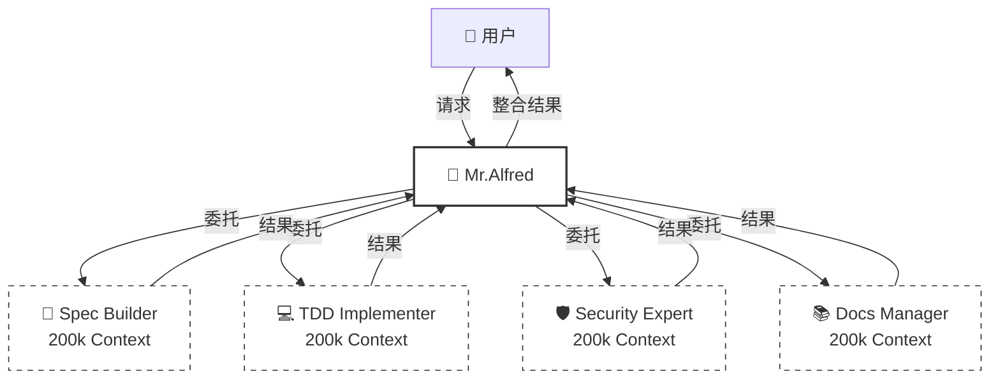
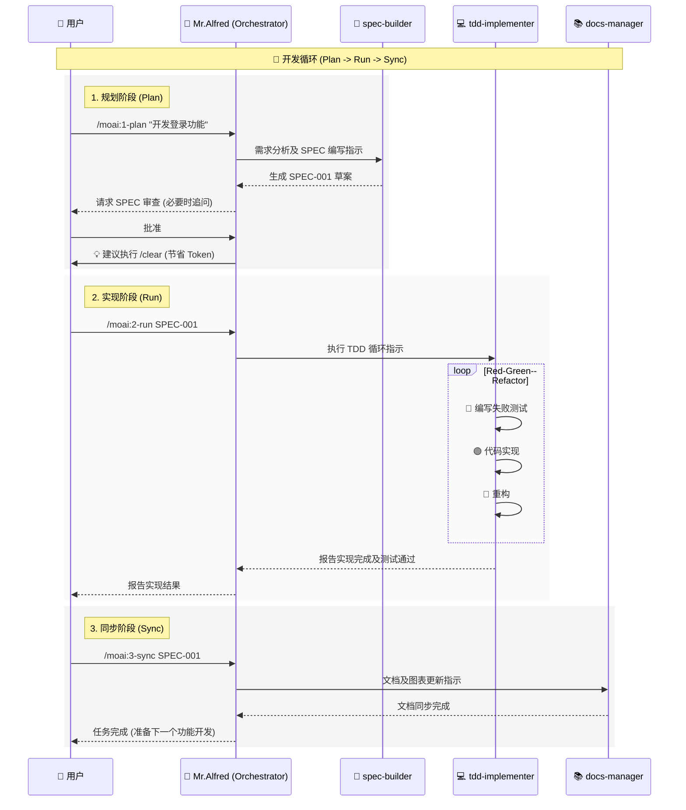

# 🗿 MoAI-ADK: AI 驱动的 SPEC-First TDD 开发框架

**可用语言:** [🇰🇷 한국어](./README.ko.md) | [🇺🇸 English](./README.md) | [🇯🇵 日本語](./README.ja.md) | [🇨🇳 中文](./README.zh.md)

[](https://pypi.org/project/moai-adk/)
[](https://opensource.org/licenses/MIT)
[](https://www.python.org/)

MoAI-ADK (Agentic Development Kit) 是一个开源框架，结合了 **SPEC-First 开发**、**测试驱动开发 (TDD)** 和 **AI 智能体**，提供完整且透明的开发生命周期。

---

## 🚀 安装与更新

我们建议使用 `uv` 工具来安装和管理 MoAI-ADK。

### uv 安装 (前置准备)

**macOS / Linux:**

```bash
curl -LsSf https://astral.sh/uv/install.sh | sh
```

**Windows:**

```powershell
powershell -ExecutionPolicy ByPass -c "irm https://astral.sh/uv/install.ps1 | iex"
```

### 包安装 (Global)

```bash
uv tool install moai-adk

# 创建新项目
moai-adk init project-name
cd project-name
claude

# 在现有项目中初始化
cd existing-project
moai-adk init .
claude
```

### 包更新 (Global)

```bash
uv tool update moai-adk
```

### 项目更新

要将现有项目的配置更新到最新版本，请在项目根目录下运行以下命令：

```bash
cd project-name
moai-adk update
claude
```

---

## ⚙️ 配置 (Configuration)

在项目根目录的 `.moai/config/config.json` 文件中管理所有设置。

### 主要配置项

- **`user.name`**: 用户名 (例如: "GOOS") - _Mr.Alfred 称呼您的名字。_
- **`language.conversation_language`**: 对话语言 (例如: "zh") - _所有消息、SPEC 和文档都将以此语言生成。_
- **`language.agent_prompt_language`**: 智能体推理语言 (推荐: "en") - _为了获得最佳性能，建议保持为英语。_
- **`constitution.enforce_tdd`**: 强制 TDD (默认: true)

---

## 🤖 智能体委托与 Token 效率 (2M Token 利用)

### 💡 200k \* 10 = 2M Token 的魔法

虽然 Claude Code 的对话会话限制为 **200k Token**，但 MoAI-ADK 可以并行运行 **最多 10 个智能体**。
由于每个智能体都有独立的 200k Token 上下文，理论上可以达到利用 **2,000,000 (2M) Token** 上下文的效果。



### 🎯 显式智能体委托 (多语言用户必读)

虽然自动触发有效，但在使用中文等非英语语言时，**显式委托** 是最准确和高效的。

**使用示例:**

> **"@agent-docs-manager 将 README.md 翻译成中文 README.zh.md"**

> **"@agent-tdd-implementer 基于 SPEC-001 规范实现登录功能"**

> **"@agent-spec-builder 分析用户认证系统的需求并编写 SPEC"**

---

## 🔌 MCP 服务器设置

MoAI-ADK 利用 MCP (Model Context Protocol) 服务器来增强功能。
在聊天中输入 `@` 可以查看 MCP 服务器状态并开启/关闭它们。

```text
> @
───────────────────────────────────────────────────────────
  ✓ [mcp] context7                   enabled  (⏎ to toggle)
  ○ [mcp] playwright                 disabled (⏎ to toggle)
  ○ [mcp] figma-dev-mode-mcp-server  disabled (⏎ to toggle)
```

- **context7 (必须)**: 提供最新的库文档和最佳实践。请始终保持开启。
- **playwright**: 用于浏览器自动化和 E2E 测试。仅在需要时开启。
- **figma-dev-mode-mcp-server**: 需要 Figma 设计页面工作时使用。

---

## 🔄 开发工作流 (与 Alfred 交互)

MoAI-ADK 的开发在 **Plan (规划) -> Run (运行) -> Sync (同步)** 的无限循环中进行。
Mr.Alfred 在此过程中理解您的意图，并指挥专业智能体完成工作。

### 1. Plan (`/moai:1-plan`)

将用户模糊的想法转化为清晰的 **EARS 格式 SPEC 文档**。
Alfred 指示 `spec-builder` 分析需求，询问缺失部分，并创建完美的规范书。

### 2. Run (`/moai:2-run`)

基于确定的 SPEC 执行 **TDD (Red-Green-Refactor)** 循环。
Alfred 指示 `tdd-implementer` 编写测试，实现通过测试的代码，然后为了质量进行重构。

### 3. Sync (`/moai:3-sync`)

分析实现的代码以 **更新文档和图表**。
Alfred 通过 `docs-manager` 确保每次代码更改时文档都会自动同步。

### MoAI-ADK Agentic Workflow



---

## 💻 命令用法 (Commands)

### 1. `/moai:0-project` (项目初始化)

- **目的**: 初始化新项目结构并检测设置。
- **执行**: 创建 `.moai` 目录、配置文件、Git 仓库设置。
- **委托**: `project-manager`

### 2. `/moai:1-plan` (生成规范书)

- **目的**: 分析用户需求并生成 EARS 格式的 SPEC 文档。
- **用法**: `/moai:1-plan "基于 JWT Token 的用户认证系统"`
- **委托**: `spec-builder`
- **重要**: 执行后必须运行 `/clear` 以清空上下文 (节省 45-50k Token)。

### 3. `/moai:2-run` (TDD 实现)

- **目的**: 基于生成的 SPEC 执行 Red-Green-Refactor TDD 循环。
- **用法**: `/moai:2-run SPEC-001`
- **委托**: `tdd-implementer`

### 4. `/moai:3-sync` (文档同步)

- **目的**: 分析实现的代码，自动生成并同步文档、图表和 API 规范。
- **用法**: `/moai:3-sync SPEC-001`
- **委托**: `docs-manager`

### 5. `/moai:9-feedback` (反馈与改进)

- **目的**: 用户请求功能改进或报告 Bug 时使用。分析代码审查或测试结果以得出改进点。
- **委托**: `quality-gate`, `debug-helper`

---

## 🕵️ 智能体与技能 (Agents & Skills)

MoAI-ADK 拥有 35 个专业智能体和 135 个以上的技能。

### 📋 规划与设计 (Planning & Design)

| 智能体                   | 角色与说明                                 | 主要技能 (Skills)                                         |
| :----------------------- | :----------------------------------------- | :-------------------------------------------------------- |
| **`spec-builder`**       | 分析用户需求并编写 EARS 格式的 SPEC 文档。 | `moai-foundation-ears`, `moai-foundation-specs`           |
| **`api-designer`**       | 设计 REST/GraphQL API 架构、端点和模式。   | `moai-domain-api`, `moai-domain-microservices`            |
| **`component-designer`** | 设计可重用的 UI 组件结构和设计系统。       | `moai-domain-design-systems`, `moai-domain-ui-components` |
| **`ui-ux-expert`**       | 负责用户体验 (UX) 流程和界面 (UI) 设计。   | `moai-domain-ux-research`, `moai-domain-wireframing`      |

### 💻 实现 (Implementation)

| 智能体                | 角色与说明                                          | 主要技能 (Skills)                                                 |
| :-------------------- | :-------------------------------------------------- | :---------------------------------------------------------------- |
| **`tdd-implementer`** | 严格遵守 TDD 循环 (Red-Green-Refactor) 并实现代码。 | `moai-foundation-trust`, `moai-essentials-testing`                |
| **`backend-expert`**  | 实现服务器逻辑、数据库集成和业务逻辑。              | `moai-domain-backend`, `moai-lang-python`, `moai-lang-go` 等      |
| **`frontend-expert`** | 实现 Web 前端、状态管理和 UI 交互。                 | `moai-domain-frontend`, `moai-lang-react`, `moai-lang-typescript` |
| **`database-expert`** | 执行 DB 模式设计、查询优化和迁移。                  | `moai-domain-database`, `moai-domain-etl`                         |

### 🛡️ 质量与安全 (Quality & Security)

| 智能体                     | 角色与说明                                          | 主要技能 (Skills)                                                         |
| :------------------------- | :-------------------------------------------------- | :------------------------------------------------------------------------ |
| **`security-expert`**      | 检查安全漏洞、确保 OWASP 合规性并提供安全编码指南。 | `moai-domain-security`, `moai-security-oauth`, `moai-essentials-security` |
| **`quality-gate`**         | 最终验证代码质量、覆盖率和 TRUST 5 原则遵守情况。   | `moai-core-quality-gates`, `moai-core-compliance`                         |
| **`test-engineer`**        | 制定单元/集成/E2E 测试策略并优化测试代码。          | `moai-essentials-testing`, `mcp-playwright-integration`                   |
| **`accessibility-expert`** | 诊断并改进 Web 无障碍 (WCAG) 标准合规性。           | `moai-domain-accessibility`                                               |
| **`format-expert`**        | 应用代码风格指南和 Lint 规则。                      | `moai-core-validation`                                                    |
| **`debug-helper`**         | 分析运行时错误的根本原因并提出解决方案。            | `moai-essentials-debugging`, `moai-essentials-profiling`                  |

### 🚀 DevOps 与管理 (DevOps & Management)

| 智能体                     | 角色与说明                                         | 主要技能 (Skills)                                               |
| :------------------------- | :------------------------------------------------- | :-------------------------------------------------------------- |
| **`devops-expert`**        | 负责 CI/CD 流水线、云基础设施 (IaC) 和部署自动化。 | `moai-domain-devops`, `moai-domain-cloud`, `docker-integration` |
| **`monitoring-expert`**    | 建立系统监控、日志设置和警报系统。                 | `moai-domain-monitoring`, `moai-core-monitoring`                |
| **`performance-engineer`** | 分析系统性能瓶颈并应用优化方案。                   | `moai-essentials-performance`, `moai-essentials-profiling`      |
| **`docs-manager`**         | 生成、更新和管理项目文档。                         | `moai-essentials-documentation`, `moai-foundation-specs`        |
| **`git-manager`**          | 执行 Git 分支策略、PR 管理和版本标记。             | `moai-essentials-git`, `moai-essentials-versioning`             |
| **`project-manager`**      | 协调和管理项目整体进度。                           | `moai-essentials-agile`, `moai-essentials-collaboration`        |

### 🛠️ 特殊工具 (Specialized Tools)

| 智能体              | 角色与说明                           | 主要技能 (Skills)           |
| :------------------ | :----------------------------------- | :-------------------------- |
| **`agent-factory`** | 创建并配置新的自定义智能体。         | `moai-core-agent-factory`   |
| **`skill-factory`** | 定义新的 MoAI 技能并将其添加到库中。 | `moai-core-task-delegation` |

---

## 📍 Claude Code 状态栏集成

MoAI-ADK 状态栏在 Claude Code 终端状态栏中显示 **实时开发状态**。一目了然地查看模型、版本、Git 分支和文件更改。

### 📊 状态栏格式

**紧凑模式** (默认, ≤80 字符):

```
🤖 Haiku 4.5 (v2.0.46) | 🗿 v0.26.0 | 📊 +0 M0 ?0 | 💬 R2-D2 | 🔀 develop
```

| 项目     | 图标 | 含义                    | 示例                                      |
| -------- | ---- | ----------------------- | ----------------------------------------- |
| **模型** | 🤖   | Claude 模型 + Code 版本 | Haiku 4.5 (v2.0.46), Sonnet 4.0 (v4.0.15) |
| **版本** | 🗿   | MoAI-ADK 版本           | v0.26.0                                   |
| **更改** | 📊   | Git 文件状态            | +0 M0 ?0                                  |
| **样式** | 💬   | 选定的 UI/UX 样式       | R2-D2, Yoda, default                      |
| **分支** | 🔀   | 当前工作分支            | develop, feature/SPEC-001                 |

### 📝 更改符号说明

```
更改: +staged Mmodified ?untracked

📊 +0  = 已暂存文件数 (git add)
📊 M0  = 已修改文件数 (尚未 git add)
📊 ?0  = 未跟踪的新文件数
```

### 💡 示例

| 情况       | 显示          | 含义                                       |
| ---------- | ------------- | ------------------------------------------ |
| 干净状态   | `📊 +0 M0 ?0` | 所有更改已提交                             |
| 文件修改   | `📊 +0 M2 ?0` | 2 个文件已修改 (需 git add)                |
| 新文件     | `📊 +0 M0 ?1` | 1 个新文件 (需 git add)                    |
| 准备提交   | `📊 +3 M0 ?0` | 3 个文件已暂存 (准备提交)                  |
| 工作进行中 | `📊 +2 M1 ?1` | 混合状态: 2 个暂存 + 1 个修改 + 1 个未跟踪 |

---

## 📚 文档与资源

详细信息请参阅以下记忆文件。

- **`.moai/memory/agents.md`**: 35 个智能体的详细说明
- **`.moai/memory/commands.md`**: 6 个命令的执行流程
- **`.moai/memory/skills.md`**: 135 个技能目录
- **`.moai/memory/delegation-patterns.md`**: 智能体委托模式
- **`.moai/memory/token-optimization.md`**: Token 优化策略

---

## 📋 许可证

MoAI-ADK 根据 [MIT 许可证](LICENSE) 分发。

---

## 📞 支持与社区

- **GitHub Issues**: [报告 Bug 及请求功能](https://github.com/modu-ai/moai-adk/issues)
- **GitHub Discussions**: [提问及分享想法](https://github.com/modu-ai/moai-adk/discussions)
- **Email**: <support@mo.ai.kr>

---

## ⭐ Star History

[](https://star-history.com/#modu-ai/moai-adk&Date)

---

**项目**: MoAI-ADK
**版本**: 0.26.0
**最后更新**: 2025-11-20
**理念**: SPEC-First TDD + 智能体编排 + 85% Token 效率
**MoAI**: 大家的 AI (Modu-ui AI)。我们的目标是让每个人都能使用 AI。

Copyleft 2025 MoAI (https://mo.ai.kr, coming soon)
