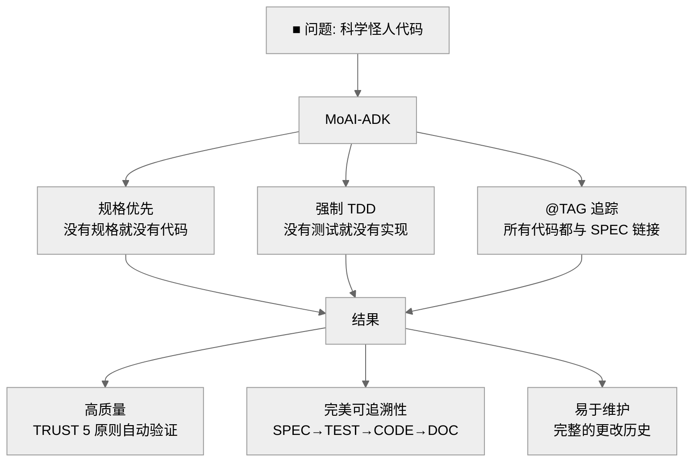

# MoAI-ADK (Agentic Development Kit)

[](https://pypi.org/project/moai-adk/)
[](https://opensource.org/licenses/MIT)
[](https://www.python.org/)
[](https://github.com/modu-ai/moai-adk/actions/workflows/moai-gitflow.yml)
[](https://codecov.io/gh/modu-ai/moai-adk)
[](https://github.com/modu-ai/moai-adk)

## MoAI-ADK: 智能编程开发框架

**🌏 Languages**: [🇰🇷 한국어](./README.ko.md) | [🇺🇸 English](./README.md) | [🇯🇵 日本語](./README.ja.md) | 🇨🇳 中文 | [🇹🇭 ไทย](./README.th.md)


> **"没有规格说明，就没有代码"**

---

## 什么是 MoAI-ADK？

MoAI-ADK 是一个通用开发工具包，通过 AI 辅助开发实现**规格优先 TDD 方法论**。它提供了一个完整的框架，用于构建高质量软件：

- 🎯 **规格优先开发**：每个功能都从清晰的规格说明开始
- 🧪 **测试驱动开发**：始终先测试，后实现
- 🏷️ **@TAG 可追溯性**：SPEC → TEST → CODE → DOC 的完整追踪
- 🤖 **Alfred SuperAgent**：管理 18+ 专业代理的 AI 代理编排器
- 🌍 **通用语言支持**：支持 20+ 种编程语言
- 🔒 **TRUST 5 原则**：自动质量保证

---

## 我们解决的问题

### AI 编程的现实

- **"AI 生成的代码无法维护..."**
  - 每次实现相同功能的方式都不同
  - 文件之间代码风格不一致
  - 没有测试代码，错误众多

- **"相同的问题，每次不同的答案..."**
  - 不记得之前的对话内容
  - 难以维护一致的架构
  - 缺少项目整体上下文

- **"大量代码，没有文档，无法追踪..."**
  - 不知道为什么这样实现
  - 无法追踪代码更改历史
  - 需求和代码脱节

- **"整天都在做提示工程..."**
  - 为了找到完美的提示尝试数十次
  - 每次都要向 AI 重复相同的约束
  - 手动验证代码质量

### MoAI-ADK 解决方案



---

## Alfred - AI 代理生态系统

你好，我是 MoAI SuperAgent **Alfred**！


我是 MoAI-ADK 的 SuperAgent 和中央编排器。我协调 **AI 代理团队**（Alfred + 多个专业代理）在 Claude Code 环境中提供完美的开发支持。

### ▶ 有趣的事实：AI 构建的 AI 开发工具

这个项目的代码是 **100% 由 AI 编写的**。

- **AI 协作设计**：GPT-5 Pro 和 Claude 4.1 Opus 共同设计架构
- **应用智能编程**：AI 代理团队（Alfred + 专业代理）自主执行 SPEC 编写、TDD 实现和文档同步
- **透明度**：不隐藏不完美的部分，与社区一起改进的开源项目

---

## 快速开始（3 分钟）

### 安装

```bash
# 通过 pip 安装
pip install moai-adk

# 验证安装
moai-adk --version
```

### 初始化您的第一个项目

```bash
# 在当前目录初始化
moai-adk init

# 按照交互式提示：
# - 项目名称
# - 描述
# - 主要语言（Python、TypeScript、Java、Go、Rust 等）
# - 模式（Personal/Team）
# - 语言环境（ko/en/ja/zh/th）
```

### 3 阶段工作流程

```bash
# 1. 编写 SPEC（EARS 方法）
/alfred:1-spec "用户认证系统"
→ 创建 SPEC 文档
→ 创建功能分支
→ 创建草稿 PR

# 2. 实现 TDD（RED → GREEN → REFACTOR）
/alfred:2-build AUTH-001
→ RED: 编写失败的测试
→ GREEN: 最小实现
→ REFACTOR: 改进代码质量

# 3. 同步文档（TAG 链验证）
/alfred:3-sync
→ 更新 Living Document
→ 验证 @TAG 链完整性
→ 将 PR 转换为 Ready
```

---

## 核心功能

### 1. 规格优先 TDD 方法论

每个开发都从 SPEC 文档开始：

```yaml
---
id: AUTH-001
version: 0.0.1
status: draft
created: 2025-10-20
priority: high
---

# @SPEC:AUTH-001: JWT 认证系统

## 需求（EARS 格式）

### Ubiquitous
- 系统应提供基于 JWT 的认证

### Event-driven
- WHEN 用户提供有效凭据时，系统应发放 JWT 令牌
- WHEN 令牌过期时，系统应返回 401 错误

### Constraints
- 访问令牌的过期时间不得超过 30 分钟
```

### 2. @TAG 可追溯性系统

```
@SPEC:AUTH-001 → @TEST:AUTH-001 → @CODE:AUTH-001 → @DOC:AUTH-001
```

所有代码元素通过 @TAG 系统追溯到 SPEC。

### 3. TRUST 5 原则

- **T**est First: 语言特定的最佳工具（Jest/Vitest、pytest、go test、cargo test、JUnit、flutter test）
- **R**eadable: 语言特定的 linter（ESLint/Biome、ruff、golint、clippy、dart analyze）
- **U**nified: 类型安全或运行时验证
- **S**ecured: 语言特定的安全工具和静态分析
- **T**rackable: CODE-FIRST @TAG 系统（直接代码扫描）

### 4. 通用语言支持

**20+ 种编程语言**：
- Python、TypeScript、JavaScript、Java、Go、Rust
- Dart、Swift、Kotlin、PHP、Ruby、Elixir
- Scala、Clojure、C++、C、C#、Haskell、Shell、Lua

**每种语言都有优化的工具链**：
- 专用测试框架
- Linter 和格式化工具
- 包管理器
- 构建系统

---

## 18 个专业代理

Alfred 协调 18 个专业代理：

### 核心代理（9）
| 代理 | 角色 | 专业领域 | 命令 |
|-------|------|----------|---------|
| **spec-builder** 🏗️ | 系统架构师 | SPEC 编写，EARS | `/alfred:1-spec` |
| **code-builder** 💎 | 首席开发人员 | TDD 实现 | `/alfred:2-build` |
| **doc-syncer** 📖 | 技术作家 | 文档同步 | `/alfred:3-sync` |
| **tag-agent** 🏷️ | 知识管理员 | TAG 可追溯性 | `@agent-tag-agent` |
| **git-manager** 🚀 | 发布工程师 | Git 工作流 | `@agent-git-manager` |
| **debug-helper** 🔬 | 故障排除专家 | 错误诊断 | `@agent-debug-helper` |
| **trust-checker** ✅ | QA 负责人 | TRUST 验证 | `@agent-trust-checker` |
| **cc-manager** 🛠️ | DevOps 工程师 | Claude Code 设置 | `@agent-cc-manager` |
| **project-manager** 📋 | 项目经理 | 项目初始化 | `/alfred:0-project` |

### 0-project 子代理（6，v0.4.0 新功能）
| 代理 | 角色 | 专业领域 |
|-------|------|----------|
| **language-detector** 🔍 | 技术分析师 | 语言/框架检测 |
| **backup-merger** 📦 | 数据工程师 | 智能备份文件合并 |
| **project-interviewer** 💬 | 业务分析师 | 需求收集 |
| **document-generator** 📝 | 技术作家 | 自动文档化 |
| **feature-selector** 🎯 | 架构师 | 技能选择（49 中的 3-9） |
| **template-optimizer** ⚙️ | DevOps 工程师 | 模板优化 |

### 内置代理（3，Claude Code 提供）
| 代理 | 专业领域 | 使用场景 |
|-------|-----------|----------|
| **Explore** 🔍 | 代码库探索 | 大型代码库导航 |
| **general-purpose** | 通用任务 | 后备代理 |

---

## 文档

- **快速开始**：[入门指南](./docs/getting-started.md)
- **SPEC 编写**：[EARS 方法指南](./docs/spec-guide.md)
- **TDD 实现**：[开发指南](./.moai/memory/development-guide.md)
- **@TAG 系统**：[TAG 规范](./.moai/memory/spec-metadata.md)
- **CLI 参考**：[命令参考](./docs/cli-reference.md)
- **API 文档**：[API Docs](./docs/api/)

---

## 贡献

我们欢迎贡献！详情请参阅 [CONTRIBUTING.md](./CONTRIBUTING.md)。

---

## 许可证

MIT 许可证 - 详情请参阅 [LICENSE](./LICENSE)。

---

## 支持

- **GitHub Issues**：[报告错误或请求功能](https://github.com/modu-ai/moai-adk/issues)
- **GitHub Discussions**：[提问或分享想法](https://github.com/modu-ai/moai-adk/discussions)
- **文档**：[官方文档](./docs/)

---

**Made with ❤️ by MoAI Research Lab**

*MoAI-ADK 是 MoAI Research Lab "（暂定）智能编程"书籍项目的一部分。*
