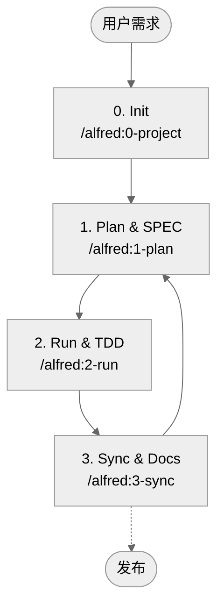

# MoAI-ADK (Agentic Development Kit)

[](https://pypi.org/project/moai-adk/)
[](https://opensource.org/licenses/MIT)
[](https://www.python.org/)
[](https://github.com/modu-ai/moai-adk/actions/workflows/moai-gitflow.yml)
[](https://codecov.io/gh/modu-ai/moai-adk)
[](https://github.com/modu-ai/moai-adk)

> **MoAI-ADK 提供与 AI 协同的开发流程，将 SPEC → TEST (TDD) → 代码 → 文档无缝衔接。**

---

## 1. MoAI-ADK 概览

| 问题 | 快速入口 |
| --- | --- |
| 第一次接触，这是做什么的？ | [MoAI-ADK 是什么？](#moai-adk-是什么) |
| 我该如何开始？ | [5 分钟快速上手](#5-分钟快速上手) |
| 想了解核心流程 | [核心工作流 (0 → 3)](#核心工作流-0--3) |
| Plan / Run / Sync 命令做什么？ | [主要命令速查](#主要命令速查) |
| SPEC、TDD、TAG 是什么？ | [核心概念速览](#核心概念速览) |
| 想知道代理和 Skills | [Sub-agent 与 Skills 概览](#sub-agent-与-skills-概览) |
| 想深入学习 | [更多资料](#更多资料) |

---

## MoAI-ADK 是什么？

MoAI-ADK（MoAI Agentic Development Kit）是一个**涵盖整个开发流程的开源 AI 工具包**。Alfred SuperAgent 会替你坚持“先写 SPEC，再用测试（TDD）验证，并保持文档与代码同步”的原则。

初学者只需记住三件事：

1. 先说明 **要做什么（SPEC）**。
2. **先写测试（TDD）**，再补实现。
3. 让系统自动保持 **文档 / README / CHANGELOG** 最新。

配合四个 `/alfred` 命令不断迭代，整个项目就能始终保持一致。

---

## 为什么需要它？

| 困扰 | MoAI-ADK 的做法 |
| --- | --- |
| “AI 写的代码不放心” | 通过 TAG 将 SPEC → TEST → IMPLEMENTATION → DOCS 串联起来。 |
| “缺少上下文，总是重复提问” | Alfred 记住关键文档与历史，随时带你回顾。 |
| “写提示词太难了” | `/alfred` 命令和内置 Skills 提供标准化提示。 |
| “文档和代码不同步” | `/alfred:3-sync` 自动对齐 README / CHANGELOG / Living Doc。 |

---

## 5 分钟快速上手

```bash
# 1.（可选）安装 uv —— 比 pip 更快的 Python 包管理器
curl -LsSf https://astral.sh/uv/install.sh | sh

# 2. 安装 MoAI-ADK（tool 模式：全局隔离运行）
uv tool install moai-adk

# 3. 创建新项目
moai-adk init my-project
cd my-project

# 4. 在 Claude Code（或 CLI）中调用 Alfred
claude  # 启动 Claude Code 后执行
/alfred:0-project "项目名称"
```

> 🔍 校验命令：`moai-adk doctor` —— 检查 Python/uv 版本、`.moai/` 结构、代理/Skills 是否就绪。

---

## 保持 MoAI-ADK 最新

### 查看当前版本
```bash
# 查看已安装版本
moai-adk --version

# 查看 PyPI 最新版本
uv tool list  # 显示当前 moai-adk 版本
```

### 升级方式

#### 方式 1：仅升级单个工具（推荐）
```bash
# 将 moai-adk 升级到最新版本
uv tool upgrade moai-adk
```

#### 方式 2：升级所有已安装工具
```bash
# 将 uv tool 中的所有工具更新到最新
uv tool update
```

#### 方式 3：安装指定版本
```bash
# 安装指定版本（例如 0.4.2）
uv tool install moai-adk==0.4.2
```

### 升级后确认
```bash
# 查看当前版本
moai-adk --version

# 确认项目正常运行
moai-adk doctor

# （可选）为旧项目应用新模板
moai-adk init .  # 不动现有代码，仅刷新 .moai/ 结构
```

> 💡 **Tip**：发布主要或次要版本时，执行 `moai-adk init .` 以引入最新的代理/Skills/模板。现有代码和自定义配置会被保留。

---

## 核心工作流 (0 → 3)

Alfred 通过四个命令驱动整个项目。



### 0. INIT — 准备项目
- 访谈项目简介、目标受众、语言、模式（locale）
- 自动生成 `.moai/config.json` 与 5 份 `.moai/project/*` 文档
- 检测语言并推荐 Skill Pack（Foundation + Essentials + Domain/Language）
- 整理模板，执行初始 Git/备份检查

### 1. PLAN — 对齐目标
- `/alfred:1-plan` 生成 EARS 结构的 SPEC（包含 `@SPEC:ID`）
- 产出 Plan Board、实现思路、风险清单
- 团队模式下自动创建分支和 Draft PR

### 2. RUN — 测试驱动开发
- 阶段 1 `implementation-planner`：设计库、目录、TAG 布局
- 阶段 2 `tdd-implementer`：执行 RED（失败测试）→ GREEN（最小实现）→ REFACTOR
- `quality-gate` 校验 TRUST 5 原则并检查覆盖率变动

### 3. SYNC — 同步文档与 PR
- 同步 Living Doc、README、CHANGELOG 等文档
- 校验 TAG 链路并找回孤立 TAG
- 生成 Sync Report，将 Draft → Ready for Review，可选 `--auto-merge`

---

## 主要命令速查

| 命令 | 功能 | 关键产物 |
| --- | --- | --- |
| `/alfred:0-project` | 收集项目信息，生成配置/文档，推荐 Skills | `.moai/config.json`, `.moai/project/*`, 初始报告 |
| `/alfred:1-plan <说明>` | 分析需求，起草 SPEC，构建 Plan Board | `.moai/specs/SPEC-*/spec.md`, plan/acceptance 文档, 功能分支 |
| `/alfred:2-run <SPEC-ID>` | 执行 TDD，负责测试/实现/重构，验证质量 | `tests/`, `src/` 实现, 质量报告, TAG 关联 |
| `/alfred:3-sync` | 同步文档/README/CHANGELOG，汇总 TAG/PR 状态 | `docs/`, `.moai/reports/sync-report.md`, 待审 PR |

> ❗ 所有命令均遵循 **Phase 0（可选）→ Phase 1 → Phase 2 → Phase 3** 循环。Alfred 会自动报告当前状态和下一步建议。

---

## 核心概念速览

### SPEC-First
- **为什么？** 就像建房先有设计图，开发前要整理需求。
- **怎么做？** `/alfred:1-plan` 产出符合 EARS 结构、包含 “WHEN… THEN…” 的 SPEC。
- **结果：** 带有 `@SPEC:ID` 的文档 + Plan Board + 验收标准。

### TDD (Test-Driven Development)
- **RED**：先写会失败的测试。
- **GREEN**：写最小的代码让测试通过。
- **REFACTOR**：优化结构，消除重复。
- `/alfred:2-run` 自动执行并记录 RED/GREEN/REFACTOR 阶段日志。

### TAG 系统
- 串联 `@SPEC:ID` → `@TEST:ID` → `@CODE:ID` → `@DOC:ID`。
- 在任意位置搜索 TAG，即可快速定位相关 SPEC、测试、文档。
- `/alfred:3-sync` 维护 TAG 清单，提示孤立 TAG。

### TRUST 5 原则
1. **Test First** — 必须先写测试
2. **Readable** — 保持函数简洁，风格一致
3. **Unified** — 架构、类型、契约保持一致
4. **Secured** — 校验输入，保护机密，执行静态分析
5. **Trackable** — TAG、Git 历史、文档同步推进

> 详细规则见 `.moai/memory/development-guide.md`。

---

## 第一个练习：Todo API 示例

1. **Plan**
   ```bash
   /alfred:1-plan "新增、查询、修改、删除待办事项的 API"
   ```
   Alfred 会生成 SPEC (`.moai/specs/SPEC-TODO-001/spec.md`) 以及 plan/acceptance 文档。

2. **Run**
   ```bash
   /alfred:2-run TODO-001
   ```
   自动生成测试 (`tests/test_todo_api.py`)、实现 (`src/todo/`) 和相关报告。

3. **Sync**
   ```bash
   /alfred:3-sync
   ```
   更新 `docs/api/todo.md`、TAG 链路和 Sync Report。

4. **验证命令**
   ```bash
   rg '@(SPEC|TEST|CODE|DOC):TODO-001' -n
   pytest tests/test_todo_api.py -v
   cat docs/api/todo.md
   ```

> 只需 15 分钟，就能完成 SPEC → TDD → 文档全部打通的 Todo API。

---

## Sub-agent 与 Skills 概览

Alfred 由 **19 人团队**（1 个 SuperAgent + 10 个核心 Sub-agent + 6 个初始化 Sub-agent + 2 个内建模块）与 **44 个 Claude Skills** 共同驱动。

### 核心 Sub-agent（Plan → Run → Sync）

| Sub-agent | 模型 | 角色 |
| --- | --- | --- |
| project-manager 📋 | Sonnet | 项目初始化与元数据访谈 |
| spec-builder 🏗️ | Sonnet | 构建 Plan Board，撰写 EARS SPEC |
| code-builder 💎 | Sonnet | 通过 `implementation-planner` + `tdd-implementer` 完成全流程 TDD |
| doc-syncer 📖 | Haiku | 同步 Living Doc、README、CHANGELOG |
| tag-agent 🏷️ | Haiku | 管理 TAG 清单，检测孤立 TAG |
| git-manager 🚀 | Haiku | 处理 GitFlow、Draft/Ready 状态、自动合并 |
| debug-helper 🔍 | Sonnet | 分析失败，给出 fix-forward 策略 |
| trust-checker ✅ | Haiku | 执行 TRUST 5 质量门控 |
| quality-gate 🛡️ | Haiku | 审查覆盖率变化及发布阻碍因素 |
| cc-manager 🛠️ | Sonnet | 优化 Claude Code 会话，部署 Skills |

### Skills（按需加载）
- **Foundation (6)**：TRUST、TAG、SPEC、EARS、Git、语言检测
- **Essentials (4)**：Debug、Refactor、Review、Performance
- **Domain (10)**：Backend、Web API、Security、Data、Mobile 等
- **Language (23)**：Python、TypeScript、Go、Rust、Java、Swift 等主流语言包
- **Claude Code Ops (1)**：会话配置、输出样式管理

> Skills 位于 `.claude/skills/`，每篇不超过 500 字。仅在需要时加载，降低上下文成本。

---

## AI 模型选择指南

| 场景 | 默认模型 | 原因 |
| --- | --- | --- |
| 规格撰写、设计、重构、问题解决 | **Claude 4.5 Sonnet** | 擅长深度推理与结构化写作 |
| 文档同步、TAG 检查、Git 自动化 | **Claude 4.5 Haiku** | 适合高频迭代和字符串密集型任务 |

- 规律性任务先用 Haiku，遇到复杂判断再切换 Sonnet。
- 如果手动切换模型，记下原因，有助于团队协作。

---

## 常见问题 (FAQ)

- **问：可以在现有项目中安装吗？**  
  答：可以。执行 `moai-adk init .`，只会新增 `.moai/` 结构，不会触碰代码。
- **问：如何运行测试？**  
  答：`/alfred:2-run` 会先执行，如有需要再运行 `pytest`、`pnpm test` 等命令。
- **问：怎样确认文档始终最新？**  
  答：`/alfred:3-sync` 会生成 Sync Report，可在 Pull Request 中查看。
- **问：能手工操作吗？**  
  答：可以，但必须遵循 SPEC → TEST → CODE → DOC 顺序，并确保 TAG 齐全。

---

## 更多资料

| 目的 | 资料 |
| --- | --- |
| Skills 结构详解 | `docs/skills/overview.md` 及各层级文档 |
| Sub-agent 详情 | `docs/agents/overview.md` |
| 工作流指南 | `docs/guides/workflow/`（Plan/Run/Sync） |
| 开发规范 | `.moai/memory/development-guide.md`, `.moai/memory/spec-metadata.md` |
| 更新计划 | `CHANGELOG.md`, `UPDATE-PLAN-0.4.0.md` |

---

## 社区与支持

- GitHub 仓库：<https://github.com/modu-ai/moai-adk>
- Issues & Discussions：欢迎提交缺陷、功能需求与想法。
- PyPI：<https://pypi.org/project/moai-adk/>
- 联系方式：请查阅 `CONTRIBUTING.md` 的贡献指南。

> 🙌 “没有 SPEC，就没有 CODE”——与 Alfred 一起体验一致的 AI 开发文化。

