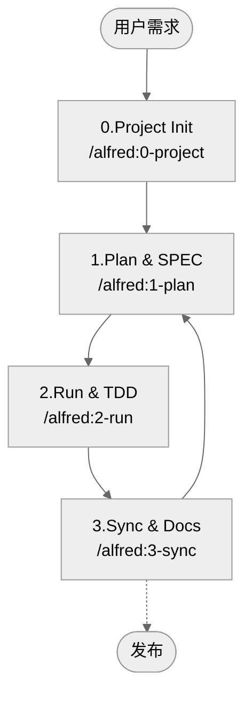

# MoAI-ADK (Agentic Development Kit)

[中文](README.zh.md) | [한국어](README.ko.md) | [English](README.md)

[](https://pypi.org/project/moai-adk/)
[](https://opensource.org/licenses/MIT)
[](https://www.python.org/)
[](https://github.com/modu-ai/moai-adk/actions/workflows/moai-gitflow.yml)
[](https://github.com/modu-ai/moai-adk)

> **MoAI-ADK 提供与 AI 协作的自然工作流，将规范（SPEC）→ 测试（TDD）→ 代码→ 文档无缝连接。**

---

## 1. MoAI-ADK 一览

MoAI-ADK 通过三个核心原则革新 AI 协作开发。使用以下导航，根据您的情况跳转到相应部分。

如果您是**第一次使用** MoAI-ADK，请从"MoAI-ADK 是什么？"开始。
**想要快速开始**，可以直接进入"5分钟快速入门"。
**已安装并想理解概念**，推荐"核心概念轻松理解"。

| 问题                                    | 快速查看                                             |
| --------------------------------------- | ----------------------------------------------------- |
| 第一次使用，这是什么？               | [MoAI-ADK 是什么？](#moai-adk-是什么)                            |
| 如何开始？                      | [5分钟快速入门](#5-分钟-快速入门)                  |
| 想了解基本流程？                    | [基本工作流 (0 → 3)](#基本-工作流-0--3)      |
| Plan / Run / Sync 命令做什么？ | [核心命令摘要](#核心-命令-摘要)                     |
| SPEC·TDD·TAG 是什么？                    | [核心概念轻松理解](#核心概念-轻松理解)   |
| 对代理/Skills 感兴趣？              | [Sub-agent & Skills 概述](#sub-agent--skills-概述)    |
| 对 Claude Code Hooks 感兴趣？            | [Claude Code Hooks 指南](#claude-code-hooks-指南) |
| 想深入学习？                 | [补充资料](#补充-资料)                               |

---

## MoAI-ADK 是什么？

### 问题：AI 开发的信任危机

如今，许多开发者希望获得 Claude 或 ChatGPT 的帮助，但无法摆脱一个根本性的怀疑："**这个 AI 生成的代码真的可以信任吗？**"

现实情况是这样的。当你让 AI "创建登录功能"时，它会输出语法完美的代码。但以下问题会反复出现：

- **需求不明确**："究竟要创建什么？"这个基本问题没有得到回答。邮箱/密码登录？OAuth？双因素认证呢？一切都依赖猜测。
- **测试遗漏**：大多数 AI 只测试"happy path"。错误密码怎么办？网络错误怎么办？3 个月后生产环境会出现 bug。
- **文档不一致**：代码被修改后，文档保持不变。"为什么这段代码在这里？"的问题会反复出现。
- **上下文丢失**：即使在同一个项目中，每次都必须从头开始解释。项目的结构、决策原因、之前的尝试都没有被记录。
- **无法识别变更影响**：当需求发生变化时，无法追踪哪些代码会受到影响。

### 解决方案：SPEC-First TDD with Alfred SuperAgent

**MoAI-ADK**（MoAI Agentic Development Kit）是一个开源框架，旨在**系统性地解决**这些问题。

核心原理简单而强大：

> **"没有代码就没有测试，没有测试就没有 SPEC"**

更准确地说，顺序是相反的：

> **"SPEC 先出现。没有 SPEC 就没有测试。没有测试和代码，文档也不完整。"**

遵循这个顺序时，您将体验到不会失败的智能体编码：

**1️⃣ 明确的需求**
使用 `/alfred:1-plan` 命令首先编写 SPEC。"登录功能"这个模糊的请求会转变为"当提供有效凭证时，系统必须发放 JWT 令牌"的**明确需求**。Alfred 的 spec-builder 使用 EARS 语法，在短短 3 分钟内创建专业的 SPEC。

**2️⃣ 测试保证**
在 `/alfred:2-run` 中自动进行测试驱动开发（TDD）。按照 RED（失败的测试）→ GREEN（最小实现）→ REFACTOR（代码清理）的顺序进行，**保证测试覆盖率达到 85% 以上**。不再有"稍后测试"。测试引领代码编写。

**3️⃣ 文档自动同步**
一个 `/alfred:3-sync` 命令就能让代码、测试、文档全部**保持最新状态同步**。README、CHANGELOG、API 文档，甚至 Living Document 都会自动更新。6 个月后，代码和文档仍然保持一致。

**4️⃣ @TAG 系统追踪**
在所有代码、测试、文档上添加 `@TAG:ID`。稍后需求变更时，`rg "@SPEC:EX-AUTH-001"` 一个命令就能**找到所有相关**的测试、实现、文档。重构时充满信心。

**5️⃣ Alfred 记住上下文**
AI 代理协作记住项目的结构、决策原因、工作历史。无需重复相同的问题。

### MoAI-ADK 的三大核心承诺

为便于初学者记忆，MoAI-ADK 的价值简化为三个：

**第一，SPEC 优先于代码**
首先明确定义要创建什么。在编写 SPEC 的过程中，您可以在实现之前发现问题。团队沟通成本大幅降低。

**第二，测试引领代码（TDD）**
在实现之前首先编写测试（RED）。编写最小实现让测试通过（GREEN）。然后清理代码（REFACTOR）。结果：bug 更少，重构有信心，代码人人都能理解。

**第三，文档与代码始终一致**
一个 `/alfred:3-sync` 命令自动更新所有文档。README、CHANGELOG、API 文档、Living Document 与代码始终同步。修改半年前的代码时不再有绝望感。

---

## 为什么需要？

### AI 开发的现实挑战

现代 AI 协作开发面临多种挑战。MoAI-ADK **系统性地解决**所有这些问题：

| 担忧                     | 传统方式的问题                        | MoAI-ADK 的解决方案                                  |
| ------------------------ | --------------------------------------- | ------------------------------------------------ |
| "无法信任 AI 代码" | 没有测试的实现，验证方法不明确      | 强制 SPEC → TEST → CODE 顺序，保证覆盖率 85%+ |
| "每次重复相同说明"    | 上下文丢失，项目历史未记录 | Alfred 记住所有信息，19 个 AI 团队协作         |
| "提示编写困难"   | 不知道如何编写好的提示          | `/alfred` 命令自动提供标准化提示     |
| "文档总是过时"       | 代码修改后忘记更新文档           | `/alfred:3-sync` 一个命令自动同步         |
| "不知道修改了哪里"   | 代码搜索困难，意图不明确           | @TAG 链接 SPEC → TEST → CODE → DOC      |
| "团队入职时间长"    | 新团队成员无法理解代码上下文           | 阅读 SPEC 立即理解意图                  |

### 立即体验的好处

从引入 MoAI-ADK 的那一刻起，您将感受到：

- **开发速度提升**：明确的 SPEC 减少来回说明时间
- **Bug 减少**：基于 SPEC 的测试提前发现问题
- **代码理解度提升**：@TAG 和 SPEC 立即把握意图
- **维护成本降低**：代码与文档始终一致
- **团队协作效率提升**：SPEC 和 TAG 实现清晰沟通

---

## ⚡ 3分钟超高速入门

使用 MoAI-ADK **三个步骤**开始您的第一个项目。初学者也能在 5 分钟内完成。

### 步骤1️⃣：安装（约1分钟）

#### UV 安装命令

```bash
# macOS/Linux
curl -LsSf https://astral.sh/uv/install.sh | sh

# Windows (PowerShell)
powershell -c "irm https://astral.sh/uv/install.ps1 | iex"
```

#### 实际输出（示例）

```bash
# UV 版本检查
uv --version
✓ uv 0.5.1 is already installed

$ uv --version
uv 0.5.1
```

#### 下一步：安装 MoAI-ADK

```bash
uv tool install moai-adk

# 结果: ✅ Installed moai-adk
```

**验证**：

```bash
moai-adk --version
# 输出: MoAI-ADK v1.0.0
```

---

### 步骤2️⃣：创建第一个项目（约2分钟）

#### 命令

```bash
moai-adk init hello-world
cd hello-world
```

#### 实际创建的内容

```
hello-world/
├── .moai/              ✅ Alfred 配置
├── .claude/            ✅ Claude Code 自动化
└── CLAUDE.md           ✅ 项目指南
```

#### 验证：核心文件检查

```bash
# 检查核心配置文件
ls -la .moai/config.json  # ✅ 存在吗？
ls -la .claude/commands/  # ✅ 有命令吗？

# 或一次性检查
moai-adk doctor
```

**输出示例**：

```
✅ Python 3.13.0
✅ uv 0.5.1
✅ .moai/ directory initialized
✅ .claude/ directory ready
✅ 16 agents configured
✅ 74 skills loaded
```

---

### 步骤3️⃣：启动 Alfred（约1-2分钟）

#### 运行 Claude Code

```bash
claude
```

#### 在 Claude Code 中输入

```
/alfred:0-project
```

#### Alfred 会询问的内容

```
Q1: 项目名称？
A: hello-world

Q2: 项目目标？
A: 学习 MoAI-ADK

Q3: 主要开发语言？
A: python

Q4: 模式？
A: personal (本地开发用)
```

#### 结果：项目准备完成！ ✅

```
✅ 项目初始化完成
✅ 配置保存到 .moai/config.json
✅ 文档创建到 .moai/project/
✅ Alfred 技能推荐完成

下一步: /alfred:1-plan "第一个功能说明"
```

---

## 🚀 下一步：10分钟完成第一个功能

现在实际**创建功能并自动生成文档**吧！

> **→ 转到下一节：["第一个10分钟实践：Hello World API"](#-第一个10分钟实践-hello-world-api)**

本节中您将：

- ✅ 用 SPEC 定义简单 API
- ✅ 完全体验 TDD (RED → GREEN → REFACTOR)
- ✅ 体验自动文档生成
- ✅ 理解 @TAG 系统

---

## 📖 安装和项目设置完整指南

快速入门后，如需更详细说明，请参考以下内容。

### 安装详细指南

**uv 安装后的额外确认**：

```bash
# PATH 设置检查（如需要）
export PATH="$HOME/.cargo/bin:$PATH"

# 再次检查
uv --version
```

**MoAI-ADK 安装后也可使用其他命令**：

```bash
moai-adk init          # 项目初始化
moai-adk doctor        # 系统诊断
moai-adk update        # 更新到最新版本
```

### MCP (Model Context Protocol) 设置指南

MoAI-ADK 使用3个核心 MCP 服务器最大化 AI 开发体验：

#### 🔧 MCP 服务器类型和用途

| MCP 服务 | 主要功能 | 目标代理 | 安装方法 |
|-----------|-----------|--------------|-----------|
| **Context7** | 最新库文档搜索 | 所有专家代理 | `npm install -g @context7/mcp-server` |
| **Figma** | 设计系统和组件规范 | ui-ux-expert | `npm install -g @figma/mcp-server` |
| **Playwright** | Web E2E 测试自动化 | frontend-expert, tdd-implementer, quality-gate | `npm install -g @playwright/mcp-server` |

#### 📦 MCP 服务器安装方法

**1. 打开 Claude Code 设置**：
```bash
# 打开 Claude Code 设置文件
claude-code settings
```

**2. 添加 MCP 服务器设置**：
```json
{
  "mcpServers": {
    "context7": {
      "command": "node",
      "args": ["node_modules/@context7/mcp-server/dist/index.js"],
      "env": {}
    },
    "figma": {
      "command": "node",
      "args": ["node_modules/@figma/mcp-server/dist/index.js"],
      "env": {
        "FIGMA_ACCESS_TOKEN": "your_figma_token_here"
      }
    },
    "playwright": {
      "command": "node",
      "args": ["node_modules/@playwright/mcp-server/dist/index.js"],
      "env": {}
    }
  }
}
```

**3. 令牌设置（仅 Figma）**：
- Figma → Account Settings → Personal Access Tokens
- 生成 `FIGMA_DESIGN_TOKEN` 后添加到设置文件

#### ✅ 安装确认

MCP 服务器正常安装后，以下代理会自动扩展功能：

- **ui-ux-expert**: Figma 设计系统集成
- **frontend-expert**: Context7 参考最新文档
- **tdd-implementer**: Playwright 自动生成测试
- **quality-gate**: Web 质量验证自动化
- **所有专家**: Context7 实时文档查询

#### 🔍 问题解决

**MCP 服务器不可见时**：
1. 重启 Claude Code
2. 检查设置文件语法
3. 用 `claude-code --version` 检查 Claude Code 版本
4. 用 `node --version` 检查 Node.js 版本（需要18+）

**详细 MCP 设置指南**: [Claude Code MCP Documentation](https://docs.claude.com/mcp)

### 项目创建详细指南

**创建新项目**：

```bash
moai-adk init my-project
cd my-project
```

**添加到现有项目**：

```bash
cd your-existing-project
moai-adk init .
```

创建的完整结构：

```
my-project/
├── .moai/                          # MoAI-ADK 项目配置
│   ├── config.json                 # 项目配置（语言、模式、所有者）
│   ├── project/                    # 项目信息
│   │   ├── product.md              # 产品愿景和目标
│   │   ├── structure.md            # 目录结构
│   │   └── tech.md                 # 技术栈和架构
│   ├── memory/                     # Alfred 的知识库（8个文件）
│   ├── specs/                      # SPEC 文件
│   └── reports/                    # 分析报告
├── .claude/                        # Claude Code 自动化
│   ├── agents/                     # 16个 Sub-agent（含专家）
│   ├── commands/                   # 4个 Alfred 命令
│   ├── skills/                     # 74个 Claude Skills
│   ├── hooks/                      # 5个事件自动化钩子
│   └── settings.json               # Claude Code 设置
└── CLAUDE.md                       # Alfred 核心指南
```

---

## 核心概念：3步循环

设置完成后，所有功能开发都重复这3个步骤：

| 步骤        | 命令                       | 执行工作                     | 时间 |
| ----------- | ---------------------------- | ----------------------------- | ---- |
| 📋 **PLAN** | `/alfred:1-plan "功能说明"` | SPEC 编写 (EARS 格式)         | 2分钟  |
| 💻 **RUN**  | `/alfred:2-run SPEC-ID`      | TDD 实现 (RED→GREEN→REFACTOR) | 5分钟  |
| 📚 **SYNC** | `/alfred:3-sync`             | 文档自动同步              | 1分钟  |

**一个周期 = 约8分钟** → **每天可完成7-8个功能** ⚡

---

## 📦 保持 MoAI-ADK 最新版本

### 版本检查

```bash
# 检查当前安装版本
moai-adk --version

# 在 PyPI 检查最新版本
uv tool list  # 检查 moai-adk 当前版本
```

### 升级

MoAI-ADK 提供**2种更新机制**：

1. **`moai-adk update`**: 包版本 + 模板同步（推荐）
2. **`uv tool upgrade`**: 标准 uv 工具升级（可选）

#### 方法1：moai-adk 自带更新命令（推荐 - 最完整）

此方法同时更新包版本并自动同步本地模板。

```bash
# 步骤1：更新 MoAI-ADK 包（+模板同步）
moai-adk update
```

**更新什么？**

- ✅ `moai-adk` 包本身（PyPI 最新版本）
- ✅ 16个 Sub-agent 模板
- ✅ 74个 Claude Skills
- ✅ 5个 Claude Code Hooks
- ✅ 4个 Alfred 命令定义

---

## 🆕 在现有项目中安装 moai-adk

想要在正在运行的项目中添加 MoAI-ADK：

### 步骤1️⃣：进入项目目录

```bash
cd your-existing-project

# 检查项目结构（可选）
ls -la
# src/, tests/, README.md 等是否存在？
```

### 步骤2️⃣：初始化 MoAI-ADK

```bash
# 在当前目录创建 .moai/, .claude/
moai-adk init .
```

**创建的文件/文件夹**

```
your-existing-project/
├── .moai/                    ✅ 新创建
│   ├── config.json
│   ├── project/
│   │   ├── product.md
│   │   ├── structure.md
│   │   └── tech.md
│   ├── memory/
│   ├── specs/
│   └── reports/
├── .claude/                  ✅ 新创建
│   ├── agents/
│   ├── commands/
│   ├── skills/
│   ├── hooks/
│   └── settings.json
├── CLAUDE.md                 ✅ 新创建
├── src/                      ✅ 保持
├── tests/                    ✅ 保持
└── README.md                 ✅ 保持
```

> ✅ **安全**：不会触碰现有代码（`src/`, `tests/` 等）。

### 步骤3️⃣：设置检查

```bash
# Alfred 设置检查
cat .moai/config.json

# 项目信息检查
ls -la .moai/project/
```

### 步骤4️⃣：运行 Claude Code

```bash
# 启动 Claude Code
claude

# 项目初始化
/alfred:0-project
```

Alfred 收集项目信息并优化设置。

---

## 基本工作流 (Project > Plan > Run > Sync)

Alfred 通过4个命令迭代开发项目。



### 0. PROJECT — 项目准备

- 项目介绍、目标、语言、模式(locale)提问
- 自动生成 `.moai/config.json`, `.moai/project/*` 5种文档
- 语言检测和推荐 Skill Pack 部署（Foundation + Essentials + Domain/Language）
- 模板整理、初始 Git/备份检查

### 1. PLAN — 创建什么 SPEC

- 用 EARS 模板编写 SPEC（包含 `@SPEC:ID`）
- Plan Board、实现想法、风险要素整理
- Team 模式下自动创建分支/初始 Draft PR
- **状态转换**: `planning` → `draft`

### 2. RUN — 测试驱动开发(TDD)

- Phase 1 `implementation-planner`: 库、文件夹、TAG 设计
- Phase 2 `tdd-implementer`: RED(失败测试) → GREEN(最小实现) → REFACTOR(清理)
- quality-gate 验证 TRUST 5原则、覆盖率变化
- **状态转换**: `draft` → `in_progress` → `testing`

### 3. SYNC — 文档&PR 整理

- Living Document、README、CHANGELOG 等文档同步
- TAG 链验证和 orphan TAG 恢复
- Sync Report 生成、Draft → Ready for Review 转换、支持 `--auto-merge` 选项
- **状态转换**: `testing` → `completed`

---

## 核心命令摘要

| 命令                        | 做什么？                                                         | 主要产出物                                                        |
| --------------------------- | ---------------------------------------------------------------------- | ------------------------------------------------------------------ |
| `/alfred:0-project`         | 项目初始化：设置收集、文档创建、技能推荐                       | `.moai/config.json`, `.moai/project/*`, 初始报告                |
| `/alfred:0-project setting` | 修改现有设置：语言、昵称、GitHub设置、报告生成选项更改        | 更新的 `.moai/config.json`                                     |
| `/alfred:0-project update`  | 模板优化：`moai-adk update` 后保留用户自定义       | 合并的 `.claude/`, `.moai/` 模板文件                            |
| `/alfred:1-plan <说明>`     | 需求分析、SPEC草案、Plan Board编写                              | `.moai/specs/SPEC-*/spec.md`, plan/acceptance文档、feature分支 |
| `/alfred:2-run <SPEC-ID>`   | TDD执行、测试/实现/重构、质量验证                              | `tests/`, `src/` 实现、质量报告、TAG连接                       |
| `/alfred:3-sync`            | 文档/README/CHANGELOG同步、TAG/PR状态整理                         | `docs/`, `.moai/reports/sync-report.md`, Ready PR                  |
| `/alfred:9-feedback`        | MoAI-ADK改进反馈GitHub Issue创建 (类型 → 标题 → 描述 → 优先级) | GitHub Issue + 自动标签 + 优先级 + URL                          |

> ❗ 所有命令都保持**Phase 0(可选) → Phase 1 → Phase 2 → Phase 3**循环结构。Alfred 自动报告执行状态和下一步建议。

---

## 核心概念轻松理解

MoAI-ADK 由5个核心概念组成。每个概念相互连接，一起工作时创建强大的开发系统。

### 核心概念1：SPEC-First（规范优先）

**比喻**：就像没有建筑师不能盖房子，没有设计图就不能编码。

**核心**：在实现之前**明确定义"要创建什么"**。这不是简单的文档，而是团队和AI可以共同理解的**可执行规范**。

**EARS 语法的5种模式**：

1. **Ubiquitous** (基本功能): "系统必须提供基于JWT的认证"
2. **Event-driven** (条件): "**当**提供有效凭证时，系统必须发放令牌"
3. **State-driven** (状态): "**当**用户处于认证状态时，系统必须允许受保护资源"
4. **Optional** (可选): "**如果**有刷新令牌，系统可以发放新令牌"
5. **Constraints** (约束): "令牌过期时间不得超过15分钟"

**如何？** `/alfred:1-plan` 命令用 EARS 格式自动创建专业 SPEC。

**获得什么**：

- ✅ 团队所有人理解的明确需求
- ✅ 基于SPEC的测试用例（已定义测试内容）
- ✅ 需求变更时用 `@SPEC:ID` TAG 追踪所有受影响的代码

---

### 核心概念2：TDD (测试驱动开发)

**比喻**：就像确定目的地后再找路，用测试确定目标再写代码。

**核心**：在**实现**之前先写**测试**。就像做饭前确认食材，实现前明确需求是什么。

**3步循环**：

1. **🔴 RED**: 先写失败的测试

   - SPEC 的每个需求成为测试用例
   - 还没有实现，所以必定失败
   - Git 提交: `test(AUTH-001): add failing test`

2. **🟢 GREEN**: 写最小实现让测试通过

   - 用最简单的方法让测试通过
   - 通过优先于完美
   - Git 提交: `feat(AUTH-001): implement minimal solution`

3. **♻️ REFACTOR**: 清理和改进代码
   - 应用 TRUST 5原则
   - 消除重复、提高可读性
   - 测试仍然必须通过
   - Git 提交: `refactor(AUTH-001): improve code quality`

**如何？** `/alfred:2-run` 命令自动进行这3步。

**获得什么**：

- ✅ 覆盖率85%以上保证（没有无测试的代码）
- ✅ 重构信心（随时可以测试验证）
- ✅ 清晰的Git历史（追踪 RED → GREEN → REFACTOR 过程）

---

### 核心概念3：@TAG 系统

**比喻**：就像快递单，必须能够追踪代码的旅程。

**核心**：在所有 SPEC、测试、代码、文档上添加 `@TAG:ID` 创建**一对一对应**。

**TAG 链**：

```
@SPEC:EX-AUTH-001 (需求)
    ↓
@TEST:EX-AUTH-001 (测试)
    ↓
@CODE:EX-AUTH-001 (实现)
    ↓
@DOC:EX-AUTH-001 (文档)
```

**TAG ID 规则**: `<域>-<3位数字>`

- AUTH-001, AUTH-002, AUTH-003...
- USER-001, USER-002...
- 一次分配**绝不更改**

**如何使用？** 需求变更时：

```bash
# 查找所有与 AUTH-001 相关的内容
rg '@TAG:AUTH-001' -n

# 结果: SPEC, TEST, CODE, DOC 一次全部显示
# → 明确要修改哪里
```

**如何？** `/alfred:3-sync` 命令验证 TAG 链，检测 orphan TAG（无对应TAG）。

**获得什么**：

- ✅ 所有代码意图明确（读SPEC就知道为什么有这段代码）
- ✅ 重构时立即掌握所有受影响的代码
- ✅ 3个月后仍能理解代码（TAG → SPEC 追踪）

---

### 核心概念4：TRUST 5原则

**比喻**：就像健康的身体，好代码必须满足5个要素。

**核心**：所有代码必须遵守以下5个原则。`/alfred:3-sync` 自动验证。

1. **🧪 Test First** (测试优先)

   - 测试覆盖率 ≥ 85%
   - 所有代码受测试保护
   - 功能添加 = 测试添加

2. **📖 Readable** (可读代码)

   - 函数 ≤ 50行, 文件 ≤ 300行
   - 变量名表达意图
   - 通过 linter(ESLint/ruff/clippy)

3. **🎯 Unified** (一致结构)

   - 保持基于 SPEC 的架构
   - 重复相同模式（学习曲线降低）
   - 类型安全或运行时验证

4. **🔒 Secured** (安全)

   - 输入验证（XSS, SQL Injection 防御）
   - 密码哈希（bcrypt, Argon2）
   - 敏感信息保护（环境变量）

5. **🔗 Trackable** (可追踪)

   - 使用 @TAG 系统
   - Git 提交包含 TAG
   - 所有决策被文档化

**如何？** `/alfred:3-sync` 命令自动执行 TRUST 验证。

**获得什么**：

- ✅ 生产质量代码保证
- ✅ 团队所有人用相同标准开发
- ✅ Bug 减少，安全漏洞提前预防

---

### 核心概念5：Alfred SuperAgent

**比喻**：就像个人助理，Alfred 处理所有复杂工作。

**核心**：AI 代理协作自动化整个开发过程：

**代理组成**：

- **Alfred SuperAgent**: 整体编排
- **Core Sub-agent**: SPEC 编写、TDD 实现、文档同步等专业工作
- **Zero-project Specialist**: 项目初始化、语言检测等
- **Built-in Agent**: 一般问题、代码库搜索

**Claude Skills**：

- **Foundation**: TRUST/TAG/SPEC/Git/EARS/Language 原则
- **Essentials**: 调试、性能、重构、代码审查
- **Alfred**: 工作流自动化
- **Domain**: 后端、前端、安全等
- **Language**: Python, JavaScript, Go, Rust 等
- **Ops**: Claude Code 会话管理

**如何？** `/alfred:*` 命令自动激活所需专家团队。

**获得什么**：

- ✅ 无需编写提示（使用标准化命令）
- ✅ 自动记住项目上下文（不重复相同问题）
- ✅ 自动组成最佳专家团队（根据情况激活相应 Sub-agent）

> **想深入了解？** 在 `.moai/memory/development-guide.md` 查看详细规则。

---

## 🚀 第一个10分钟实践：Hello World API

**目标**: 10分钟内体验 MoAI-ADK 完整工作流
**学习内容**: SPEC 编写、TDD 实现、文档自动化、@TAG 系统

> 如果已完成3分钟超高速入门，可以从本节开始！

### 前期准备

- ✅ MoAI-ADK 安装完成
- ✅ 项目创建完成（`moai-adk init hello-world`）
- ✅ Claude Code 运行中

---

### Step 1️⃣：SPEC 编写（2分钟）

#### 命令

```bash
/alfred:1-plan "GET /hello 端点 - 接收查询参数 name 返回问候语"
```

#### Alfred 自动生成

```
✅ SPEC ID: HELLO-001
✅ 文件: .moai/specs/SPEC-HELLO-001/spec.md
✅ 分支: feature/SPEC-HELLO-001
```

#### 检查生成的 SPEC

```bash
cat .moai/specs/SPEC-HELLO-001/spec.md
```

**内容示例**：

```yaml
---
id: HELLO-001
version: 0.0.1
status: draft
priority: high
---
# `@SPEC:EX-HELLO-001: Hello World API

## Ubiquitous Requirements
- 系统必须提供 HTTP GET /hello 端点

## Event-driven Requirements
- 当提供查询参数 name 时，必须返回 "Hello, {name}!"
- 当没有 name 时，必须返回 "Hello, World!"

## Constraints
- name 必须限制在最多50个字符
- 响应必须是 JSON 格式
```

✅ **验证**: `ls .moai/specs/SPEC-HELLO-001/`

---

### Step 2️⃣：TDD 实现（5分钟）

#### 命令

```bash
/alfred:2-run HELLO-001
```

#### 🔴 RED Phase: 编写失败测试

**生成文件**: `tests/test_hello.py`

```python
# `@TEST:EX-HELLO-002 | SPEC: SPEC-HELLO-001.md

import pytest
from fastapi.testclient import TestClient
from src.hello.api import app

client = TestClient(app)

def test_hello_with_name_should_return_personalized_greeting():
    """当提供 name 时，必须返回 "Hello, {name}!""""
    response = client.get("/hello?name=小明")
    assert response.status_code == 200
    assert response.json() == {"message": "Hello, 小明!"}

def test_hello_without_name_should_return_default_greeting():
    """当没有 name 时，必须返回 "Hello, World!""""
    response = client.get("/hello")
    assert response.status_code == 200
    assert response.json() == {"message": "Hello, World!"}
```

**执行**:

```bash
pytest tests/test_hello.py -v
```

**结果**: ❌ FAILED (没有 app - 正常！)

**Git 提交**:

```bash
git add tests/test_hello.py
git commit -m "🔴 test(HELLO-001): add failing hello API tests"
```

---

#### 🟢 GREEN Phase: 最小实现

**生成文件**: `src/hello/api.py`

```python
# `@CODE:EX-HELLO-001:API | SPEC: SPEC-HELLO-001.md | TEST: tests/test_hello.py

from fastapi import FastAPI

app = FastAPI()

@app.get("/hello")
def hello(name: str = "World"):
    """@CODE:EX-HELLO-001:API - Hello endpoint"""
    return {"message": f"Hello, {name}!"}
```

**执行**:

```bash
pytest tests/test_hello.py -v
```

**结果**: ✅ PASSED (全部通过！)

**Git 提交**:

```bash
git add src/hello/api.py
git commit -m "🟢 feat(HELLO-001): implement hello API"
```

---

#### ♻️ REFACTOR Phase: 代码改进

**添加验证逻辑**:

```python
from fastapi import FastAPI, HTTPException

app = FastAPI()

@app.get("/hello")
def hello(name: str = "World"):
    """@CODE:EX-HELLO-001:API - Hello endpoint with validation"""
    if len(name) > 50:
        raise HTTPException(status_code=400, detail="Name too long (max 50 chars)")
    return {"message": f"Hello, {name}!"}
```

**添加测试**:

```python
def test_hello_with_long_name_should_return_400():
    """当 name 超过50个字符时必须返回400错误"""
    long_name = "a" * 51
    response = client.get(f"/hello?name={long_name}")
    assert response.status_code == 400
```

**执行**:

```bash
pytest tests/test_hello.py -v
```

**结果**: ✅ PASSED (全部通过！)

**Git 提交**:

```bash
git add tests/test_hello.py src/hello/api.py
git commit -m "♻️ refactor(HELLO-001): add name length validation"
```

---

### Step 3️⃣：文档同步（2分钟）

#### 命令

```bash
/alfred:3-sync
```

#### Alfred 自动处理

```
✅ docs/api/hello.md - API 文档生成
✅ README.md - API 用法添加
✅ CHANGELOG.md - v0.1.0 发布笔记添加
✅ TAG 链验证 - 所有 @TAG 确认
```

#### 检查生成的 API 文档

```bash
cat docs/api/hello.md
```

**内容示例**：

````markdown
# Hello API Documentation

## GET /hello

### Description

接收名字并返回个性化问候语。

### Parameters

- `name` (query, optional): 名字（默认值: "World", 最大50个字符）

### Responses

- **200**: 成功
  ```json
  { "message": "Hello, 小明!" }
  ```

- **400**: 名字太长

### Examples

```bash
curl "http://localhost:8000/hello?name=小明"
# → {"message": "Hello, 小明!"}

curl "http://localhost:8000/hello"
# → {"message": "Hello, World!"}
```

### Traceability

- `@SPEC:EX-HELLO-001` - 需求
- `@TEST:EX-HELLO-002` - 测试
- `@CODE:EX-HELLO-001:API` - 实现
````

---

### Step 4️⃣：TAG 链验证（1分钟）

#### 命令
```bash
rg '@(SPEC|TEST|CODE|DOC):HELLO-001' -n
````

#### 输出（完全可追踪性）

```
.moai/specs/SPEC-HELLO-001/spec.md:7:# `@SPEC:EX-HELLO-001: Hello World API
tests/test_hello.py:3:# `@TEST:EX-HELLO-002 | SPEC: SPEC-HELLO-001.md
src/hello/api.py:3:# `@CODE:EX-HELLO-001:API | SPEC: SPEC-HELLO-001.md
docs/api/hello.md:24:- `@SPEC:EX-HELLO-001`
```

✅ **含义**: 需求 → 测试 → 实现 → 文档完美连接！

---

### 🎉 10分钟后：您获得了什么

#### 生成的文件

```
hello-world/
├── .moai/specs/SPEC-HELLO-001/
│   ├── spec.md              ← 需求文档
│   └── plan.md              ← 计划
├── tests/test_hello.py      ← 测试（100%覆盖率）
├── src/hello/
│   ├── api.py               ← API 实现
│   └── __init__.py
├── docs/api/hello.md        ← API 文档
├── README.md                ← 已更新
└── CHANGELOG.md             ← v0.1.0 发布笔记
```

#### Git 历史

```bash
git log --oneline | head -4
```

**输出**:

```
c1d2e3f ♻️ refactor(HELLO-001): add name length validation
b2c3d4e 🟢 feat(HELLO-001): implement hello API
a3b4c5d 🔴 test(HELLO-001): add failing hello API tests
d4e5f6g Merge branch 'develop' (initial project commit)
```

#### 学到的内容

- ✅ **SPEC**: 用 EARS 格式明确定义需求
- ✅ **TDD**: 体验 RED → GREEN → REFACTOR 循环
- ✅ **自动化**: 文档与代码一起自动生成
- ✅ **可追踪性**: @TAG 系统连接所有步骤
- ✅ **质量**: 测试100%、清晰实现、自动文档化

---

## 🚀 下一步

现在创建更复杂的功能吧：

```bash
# 开始下一个功能
/alfred:1-plan "用户数据库查询API"
```

或如需高级示例，请参考以下内容。

---

## Sub-agent & Skills 概述

Alfred 结合多个专业代理和 Claude Skills 进行工作。

### Core Sub-agents (Plan → Run → Sync)

| Sub-agent          | 模型   | 角色                                                         |
| ------------------ | ------ | ------------------------------------------------------------ |
| project-manager 📋 | Sonnet | 项目初始化、元数据访谈                           |
| spec-builder 🏗️    | Sonnet | Plan 板、EARS SPEC 编写、专家咨询推荐                  |
| code-builder 💎    | Sonnet | `implementation-planner` + `tdd-implementer`执行完整TDD |
| doc-syncer 📖      | Haiku  | Living Doc、README、CHANGELOG 同步                         |
| tag-agent 🏷️       | Haiku  | TAG 库存、orphan 检测、@EXPERT TAG 验证                  |
| git-manager 🚀     | Haiku  | GitFlow、Draft/Ready、Auto Merge                             |
| debug-helper 🔍    | Sonnet | 失败分析、fix-forward 策略                                  |
| trust-checker ✅   | Haiku  | TRUST 5 质量门限                                          |
| quality-gate 🛡️    | Haiku  | 覆盖率变化和发布阻塞条件审查                       |
| cc-manager 🛠️      | Sonnet | Claude Code 会话优化、Skill 部署                          |

### 专家代理 (SPEC 关键词自动激活)

专家代理在 `implementation-planner` 从 SPEC 文档检测到领域特定关键词时自动激活。每个专家提供自己领域的架构指南、技术推荐、风险分析。

| 专家代理    | 模型   | 专业领域                             | 自动激活关键词                                                     |
| ------------------ | ------ | ------------------------------------- | ---------------------------------------------------------------------- |
| backend-expert 🔧  | Sonnet | 后端架构、API设计、DB        | 'backend', 'api', 'server', 'database', 'deployment', 'authentication' |
| frontend-expert 💻 | Sonnet | 前端架构、组件、状态管理 | 'frontend', 'ui', 'page', 'component', 'client-side', 'web interface'  |
| devops-expert 🚀   | Sonnet | DevOps、CI/CD、部署、容器         | 'deployment', 'docker', 'kubernetes', 'ci/cd', 'pipeline', 'aws'       |
| ui-ux-expert 🎨    | Sonnet | UI/UX设计、可访问性、设计系统     | 'design', 'ux', 'accessibility', 'a11y', 'figma', 'design system'      |

**工作原理**：

- `/alfred:2-run` 开始时，`implementation-planner` 扫描 SPEC 内容
- 匹配关键词自动激活相应专家代理
- 每个专家提供领域特定架构指南
- 所有专家咨询用 `@EXPERT:DOMAIN` 标签标记以保持可追踪性

### Skills (渐进式展示)

Alfred 使用 4-tier 架构构建 Claude Skills，只在需要时进行 Just-In-Time 加载的**渐进式展示**方式。每个 Skill 是存储在 `.claude/skills/` 目录中的生产级指南。

#### Foundation Tier

包含核心 TRUST/TAG/SPEC/Git/EARS/Language 原则的基础技能

| Skill                   | 说明                                                                       |
| ----------------------- | -------------------------------------------------------------------------- |
| `moai-foundation-trust` | TRUST 5-principles (Test 85%+, Readable, Unified, Secured, Trackable) 验证 |
| `moai-foundation-tags`  | @TAG 标记扫描和库存生成 (CODE-FIRST 原则)                       |
| `moai-foundation-specs` | SPEC YAML frontmatter 和 HISTORY 部分验证                                 |
| `moai-foundation-ears`  | EARS (Easy Approach to Requirements Syntax) 需求编写指南           |
| `moai-foundation-git`   | Git 工作流自动化 (branching, TDD commits, PR 管理)                      |
| `moai-foundation-langs` | 项目语言/框架自动检测 (package.json, pyproject.toml 等)       |

#### Essentials Tier

日常开发工作所需的核心工具

| Skill                      | 说明                                           |
| -------------------------- | ---------------------------------------------- |
| `moai-essentials-debug`    | 堆栈跟踪分析、错误模式检测、快速诊断支持 |
| `moai-essentials-perf`     | 性能分析、瓶颈检测、调优策略     |
| `moai-essentials-refactor` | 重构指南、设计模式、代码改进策略     |
| `moai-essentials-review`   | 自动代码审查、SOLID 原则、代码异味检测     |

#### Alfred Tier

MoAI-ADK 内部工作流编排技能

| Skill                                  | 说明                                                                |
| -------------------------------------- | ------------------------------------------------------------------- |
| `moai-alfred-ears-authoring`           | EARS 语法验证和 requirement 模式指南                           |
| `moai-alfred-git-workflow`             | MoAI-ADK conventions (feature branch, TDD commits, Draft PR) 自动化 |
| `moai-alfred-language-detection`       | 项目语言/运行时检测和基本测试工具推荐                  |
| `moai-alfred-spec-metadata-validation` | SPEC YAML frontmatter 和 HISTORY 部分一致性验证                   |
| `moai-alfred-tag-scanning`             | @TAG 标记全扫描和库存生成 (CODE-FIRST 原则)              |
| `moai-alfred-trust-validation`         | TRUST 5-principles 合规验证                                        |
| `moai-alfred-ask-user-questions`    | Claude Code Tools AskUserQuestion TUI 菜单标准化                   |

#### Domain Tier

专业化领域专业知识

| Skill                        | 说明                                                                              |
| ---------------------------- | --------------------------------------------------------------------------------- |
| `moai-domain-backend`        | 后端架构、API设计、扩展指南                                        |
| `moai-domain-cli-tool`       | CLI工具开发、参数解析、POSIS合规、用户友好help消息                    |
| `moai-domain-data-science`   | 数据分析、可视化、统计建模、可重现研究工作流                     |
| `moai-domain-database`       | 数据库设计、模式优化、索引策略、迁移管理                  |
| `moai-domain-design-systems` | 设计系统架构、W3C DTCG 令牌、WCAG 2.2 可访问性、设计-to-代码、Figma MCP |
| `moai-domain-devops`         | CI/CD 管道、Docker 容器化、Kubernetes 编排、IaC         |
| `moai-domain-frontend`       | React/Vue/Angular 开发、状态管理、性能优化、可访问性                            |
| `moai-domain-ml`             | 机器学习模型训练、评估、部署、MLOps 工作流                                  |
| `moai-domain-mobile-app`     | Flutter/React Native 开发、状态管理、原生集成                               |
| `moai-domain-security`       | OWASP Top 10、静态分析 (SAST)、依赖安全、secrets 管理                         |
| `moai-domain-web-api`        | REST API、GraphQL 设计模式、认证、版本管理、OpenAPI 文档化                      |

#### Language Tier

编程语言最佳实践

| Skill                  | 说明                                                   |
| ---------------------- | ------------------------------------------------------ |
| `moai-lang-python`     | pytest, mypy, ruff, black, uv 包管理              |
| `moai-lang-typescript` | Vitest, Biome, strict typing, npm/pnpm                 |
| `moai-lang-javascript` | Jest, ESLint, Prettier, npm 包管理                |
| `moai-lang-go`         | go test, golint, gofmt, 标准库                |
| `moai-lang-rust`       | cargo test, clippy, rustfmt, ownership/borrow checker  |
| `moai-lang-java`       | JUnit, Maven/Gradle, Checkstyle, Spring Boot 模式      |
| `moai-lang-kotlin`     | JUnit, Gradle, ktlint, coroutines, extension functions |
| `moai-lang-swift`      | XCTest, SwiftLint, iOS/macOS 开发模式                 |
| `moai-lang-dart`       | flutter test, dart analyze, Flutter widget 模式        |
| `moai-lang-csharp`     | xUnit, .NET tooling, LINQ, async/await 模式            |
| `moai-lang-cpp`        | Google Test, clang-format, 现代 C++ (C++17/20)         |
| `moai-lang-c`          | Unity test framework, cppcheck, Make 构建系统       |
| `moai-lang-scala`      | ScalaTest, sbt, 函数式编程模式                 |
| `moai-lang-ruby`       | RSpec, RuboCop, Bundler, Rails 模式                    |
| `moai-lang-php`        | PHPUnit, Composer, PSR 标准                            |
| `moai-lang-sql`        | 测试框架、查询优化、迁移管理      |
| `moai-lang-shell`      | bats, shellcheck, POSIX 合规                           |
| `moai-lang-r`          | testthat, lintr, 数据分析模式                      |

#### Claude Code Ops

Claude Code 会话管理

| Skill              | 说明                                                                     |
| ------------------ | ------------------------------------------------------------------------ |
| `moai-claude-code` | Claude Code agents, commands, skills, plugins, settings 脚手架和监控 |

> Claude Skills 已采用 4-tier 架构（v0.4.10 100%完成）。每个 Skill 通过渐进式展示只在需要时加载，最小化上下文成本。Foundation → Essentials → Alfred → Domain/Language/Ops 层级结构，所有技能包含生产级文档和可执行 TDD 示例。

---

## AI 模型选择指南

| 情况                              | 默认模型             | 原因                               |
| --------------------------------- | --------------------- | ---------------------------------- |
| 规范/设计/重构/问题解决      | **Claude 4.5 Sonnet** | 深度推理和结构化写作能力强   |
| 文档同步、TAG 检查、Git 自动化 | **Claude 4.5 Haiku**  | 快速迭代工作、字符串处理能力强 |

- 模式化工作从 Haiku 开始，需要复杂判断时转换为 Sonnet。
- 手动更改模型时，在日志中记录"为什么转换"有助于协作。

---

## Claude Code Hooks 指南

MoAI-ADK 提供5个与开发流程流畅集成的 Claude Code Hooks。这些 Hook 在会话开始/结束、工具执行前后、提示提交时自动运行，透明地处理检查点、JIT 上下文加载、会话管理等。

### Hook 是什么？

Hook 是响应 Claude Code 会话特定事件的事件驱动脚本。在不干扰使用流程的情况下，在后台提供安全保护和生产力提升。

### 已安装的 Hooks (5个)

| Hook             | 状态    | 功能                                                                                        |
| ---------------- | ------- | ------------------------------------------------------------------------------------------- |
| SessionStart     | ✅ 激活 | 语言/Git/SPEC 进度/检查点等项目状态摘要                                         |
| PreToolUse       | ✅ 激活 | 风险检测 + 自动检查点(删除/合并/大量编辑/重要文件) + **TAG Guard** (缺失的@TAG检测) |
| UserPromptSubmit | ✅ 激活 | JIT 上下文加载(@SPEC·测试·代码·文档自动加载)                                         |
| PostToolUse      | ✅ 激活 | 代码更改后自动测试(Python/TS/JS/Go/Rust/Java 等)                                      |
| SessionEnd       | ✅ 激活 | 会话清理和状态保存                                                                      |

#### TAG Guard

在 PreToolUse Hook 中运行的自动 @TAG 验证系统：

- 自动扫描暂存、修改、未跟踪文件
- SPEC/TEST/CODE/DOC 文件缺少 @TAG 标记时警告
- 可通过 `.moai/tag-rules.json` 配置规则
- 非阻塞方式（温和通知，不中断执行）

**警告消息示例**：

```
⚠️ TAG 缺失检测：创建/修改的文件中有缺失 @TAG 的项目。
 - src/auth/service.py → 期望标签: @CODE:
 - tests/test_auth.py → 期望标签: @TEST:
推荐操作：
  1) 为 SPEC/TEST/CODE/DOC 类型匹配的 @TAG 添加到文件顶部注释或头部
  2) 用 rg 确认: rg '@(SPEC|TEST|CODE|DOC):' -n <路径>
```

**Why It Matters**: 确保代码可追踪性，保持 @TAG 链完整。防止意外遗漏 TAG。

---

## 🔧 新手问题解决指南

MoAI-ADK 启动时常遇到的错误和解决方法。

### 1️⃣ uv 未安装

**症状**：

```bash
$ uv --version
bash: uv: command not found
```

**原因**: uv 未安装或未添加到 PATH

**解决**：

**macOS/Linux**:

```bash
# 安装
curl -LsSf https://astral.sh/uv/install.sh | sh

# 重启 shell
source ~/.bashrc  # 或 ~/.zshrc

# 验证
uv --version
```

**Windows (PowerShell)**:

```powershell
powershell -c "irm https://astral.sh/uv/install.ps1 | iex"

# 验证
uv --version
```

**仍然失败**：

```bash
# 手动添加 PATH (macOS/Linux)
export PATH="$HOME/.cargo/bin:$PATH"

# 再次检查
uv --version
```

---

### 2️⃣ Python 版本不匹配

**症状**：

```
Python 3.8 found, but 3.13+ required
```

**原因**: Python 版本低于 3.13

**解决**：

**选项A: 使用 pyenv（推荐）**:

```bash
# 安装 pyenv
curl https://pyenv.run | bash

# 安装 Python 3.13
pyenv install 3.13
pyenv global 3.13

# 验证
python --version  # Python 3.13.x
```

**选项B: 用 uv 自动管理 Python**:

```bash
# uv 自动下载 Python 3.13
uv python install 3.13
uv python pin 3.13

# 验证
python --version
```

---

### 3️⃣ Git 未安装

**症状**：

```
✗ Git (runtime): not found
```

**原因**: 系统未安装 Git

**解决**：

**macOS**:

```bash
# 用 Homebrew 安装
brew install git

# 或 Xcode Command Line Tools
xcode-select --install
```

**Ubuntu/Debian**:

```bash
sudo apt update
sudo apt install git -y
```

**Windows**:

```powershell
# 用 winget 安装
winget install Git.Git

# 或手动下载
# https://git-scm.com/download/win
```

**验证**:

```bash
git --version  # git version 2.x.x
```

---

### 4️⃣ Claude Code 不识别 .moai/ 文件夹

**症状**：

```
"项目未初始化"
/alfred:0-project 命令不工作
```

**原因**: `.moai/` 或 `.claude/` 文件夹不存在或损坏

**解决**：

```bash
# 1. 检查当前目录
pwd  # /path/to/your-project

# 2. 检查 .moai/ 文件夹
ls -la .moai/config.json

# 3. 如没有则重新初始化
moai-adk init .

# 4. 重启 Claude Code
exit  # 退出 Claude Code
claude  # 重启 Claude Code
```

**验证**:

```bash
moai-adk doctor
# 所有项目应为 ✅ 显示
```

---

### 5️⃣ 测试运行时找不到模块

**症状**：

```
FAILED tests/test_hello.py - ModuleNotFoundError: No module named 'fastapi'
```

**原因**: 缺少必要包

**解决**：

```bash
# 在项目根目录安装依赖
uv sync

# 如只需安装特定包
uv add fastapi pytest

# 激活虚拟环境后重新运行
source .venv/bin/activate  # macOS/Linux
.venv\Scripts\activate     # Windows

pytest tests/ -v
```

---

### 6️⃣ /alfred 命令不工作

**症状**：

```
Unknown command: /alfred:1-plan
```

**原因**: Claude Code 版本问题或 `.claude/` 文件夹损坏

**解决**：

```bash
# 1. 检查 Claude Code 版本 (最低 v1.5.0+)
claude --version

# 2. 检查 .claude/ 文件夹
ls -la .claude/commands/

# 3. 必要时重新初始化
moai-adk init .

# 4. 重启 Claude Code
exit
claude
```

---

### 7️⃣ TAG 链损坏

**症状**：

```
✅ Fixed: @TEST:EX-HELLO-002 (TAG ID updated for consistency)
```

**原因**: SPEC 被删除或 TAG 不一致

**解决**：

```bash
# 1. 验证 TAG 链
rg '@(SPEC|TEST|CODE):HELLO-001' -n

# 2. 检查缺失的 TAG
rg '@SPEC:EX-HELLO-001' -n .moai/specs/

# 3. 如没有 SPEC 则重新生成
/alfred:1-plan "功能说明"

# 或修改测试的 TAG
# tests/test_hello.py 中修改为 @TEST:EX-HELLO-002

# 4. 同步
/alfred:3-sync
```

---

### 8️⃣ 通用调试命令

**系统状态检查**：

```bash
moai-adk doctor
```

**输出**: 所有依赖项检查 + 推荐项

**项目结构检查**：

```bash
tree -L 2 .moai/
```

**TAG 链完整性验证**：

```bash
rg '@(SPEC|TEST|CODE|DOC):' -n | wc -l
```

**输出**: 总 TAG 数

**Git 状态检查**：

```bash
git status
git log --oneline -5
```

---

### 💡 通用调试顺序

1. **阅读**: 完整阅读并复制错误消息
2. **搜索**: 用错误消息搜索 GitHub Issues
3. **验证**: 运行 `moai-adk doctor`
4. **重启**: 重启 Claude Code
5. **提问**: 在 GitHub Discussions 提问

```bash
# 快速诊断（详细信息）
moai-adk doctor --verbose
```

---

### 🆘 仍然无法解决？

- **GitHub Issues**: 搜索类似问题
- **GitHub Discussions**: 提问
- **Discord 社区**: 实时提问

**报告时应包含的信息**：

1. `moai-adk doctor --verbose` 输出
2. 完整错误消息（截图或复制）
3. 重现方法（执行了什么命令？）
4. 操作系统和版本

---

## 🚀 快速 Issue 创建：`/alfred:9-feedback`

MoAI-ADK 使用中发现 bug 或想请求功能吗？在 Claude Code 中用一行命令自动创建 Issue。

### 概述

```bash
/alfred:9-feedback
```

执行此命令后，Alfred 通过交互式问题自动创建 Issue：
- 🐛 **bug 报告** - 记录问题情况
- ✨ **功能请求** - 提出新功能
- ⚡ **改进建议** - 改进现有功能
- ❓ **问题/讨论** - 与团队讨论

### 执行示例

```bash
# 在 Claude Code 中执行
/alfred:9-feedback
```

### 交互式分步进行

**1️⃣ 选择 Issue 类型**

```
想创建什么类型的 Issue？

[ ] 🐛 Bug Report - 遇到了问题
[ ] ✨ Feature Request - 提出新功能
[ ] ⚡ Improvement - 改进现有功能
[ ] ❓ Question/Discussion - 向团队提问
```

**2️⃣ 输入 Issue 标题**

```
请输入 Issue 标题（简洁明了）：
例: moai-adk update 运行时模板同步错误
```

**3️⃣ 输入详细描述（可选）**

```
请输入详细描述（按 Enter 键可跳过）：

例:
moai-adk update 运行时出现以下错误：
- 症状: .claude/ 目录权限错误
- 环境: macOS 14.2, Python 3.13, moai-adk v0.15.0
- 期望行为: 模板应正常同步
- 实际行为: Permission denied 错误中断
```

**4️⃣ 选择优先级**

```
请选择优先级级别：

[ ] 🔴 Critical - 系统宕机、数据丢失、安全问题
[ ] 🟠 High - 主要功能故障、严重影响
[✓] 🟡 Medium - 一般优先级（默认值）
[ ] 🟢 Low - 轻微问题、可做可不做
```

### 自动 Issue 创建

Alfred 自动执行：
1. 标题添加表情符号：`🐛 [BUG] moai-adk update 运行时模板同步错误`
2. 格式化为 GitHub Issue 形式
3. 自动分配适当标签：`bug`, `reported`, `priority-high`
4. 在仓库中创建 Issue

### 完成后输出

```
✅ GitHub Issue #245 创建完成！

📋 标题: 🐛 [BUG] moai-adk update 运行时模板同步错误
🔴 优先级: High
🏷️  标签: bug, reported, priority-high
🔗 链接: https://github.com/modu-ai/moai-adk/issues/245

💡 提示: 可以在提交消息中引用此 Issue 编号
```

### 主要特点

| 特点           | 说明                                                     |
| -------------- | -------------------------------------------------------- |
| **命令简单** | 无参数只需执行 `/alfred:9-feedback`                    |
| **交互式**     | 直观的分步问题创建 Issue                        |
| **自动标签**  | 根据 Issue 类型和优先级自动分配标签           |
| **立即创建**  | 约30秒内在 GitHub 创建 Issue                      |
| **团队共享**    | 创建的 Issue 立即与团队共享并可追踪                |

---

## 常见问题（FAQ）

- **Q. 可以在现有项目中安装吗？**
  - A. 可以。执行 `moai-adk init .` 不会触碰现有代码，只添加 `.moai/` 结构。
- **Q. 如何执行测试？**
  - A. 先执行 `/alfred:2-run`，需要时再执行 `pytest`, `pnpm test` 等语言特定命令。
- **Q. 如何确认文档始终最新？**
  - A. `/alfred:3-sync` 生成 Sync Report。在 Pull Request 中查看报告。
- **Q. 可以手动进行吗？**
  - A. 可以，但必须保持 SPEC → TEST → CODE → DOC 顺序，并保留 TAG。

---

## 最新更新

| 版本        | 主要功能                                                                                                         | 日期       |
| ----------- | ----------------------------------------------------------------------------------------------------------------- | ---------- |
| **v0.17.0** | 🌍 **多语言 lint/格式架构** (Python, JS, TS, Go, Rust, Java, Ruby, PHP) - 自动语言检测 + Non-blocking 错误 | 2025-11-04 |
| **v0.16.x** | ✅ 4个 Alfred 命令100%命令式指南完成 + Hook 架构稳定化                                                  | 2025-11-03 |
| **v0.8.2**  | 📖 EARS 术语更新: "Constraints" → "Unwanted Behaviors" (明确性改进)                                         | 2025-10-29 |
| **v0.8.1**  | 🔄 命令变更: `/alfred:9-help` → `/alfred:9-feedback` + 用户反馈工作流改进                           | 2025-10-28 |
| **v0.8.0**  | 🏷️ @DOC TAG 自动生成系统 + SessionStart 版本检查强化                                                        | 2025-10-27 |
| **v0.7.0**  | 🌍 完整语言本地化系统（英语、韩语、日语、中文、西班牙语）                                             | 2025-10-26 |
| **v0.6.3**  | ⚡ 3步更新工作流：并行工作带来70-80%性能改进                                                   | 2025-10-25 |

> 📦 **立即安装**: `uv tool install moai-adk` 或 `pip install moai-adk`

### 🎯 v0.17.0 主要功能

#### 1️⃣ 多语言 lint/格式自动化（11种语言）

现在**无论用哪种语言编写项目都会自动进行 linting 和格式化**。

**支持语言**:
- Python (ruff + mypy)
- JavaScript (eslint + prettier)
- TypeScript (tsc + eslint + prettier)
- Go (golangci-lint + gofmt)
- Rust (clippy + rustfmt)
- Java (checkstyle + spotless)
- Ruby (rubocop)
- PHP (phpstan + php-cs-fixer)
- C# (dotnet)
- Kotlin (ktlint)
- SQL (迁移检测)

**主要特点**:
- ✅ **自动语言检测**: 基于项目配置文件（pyproject.toml, package.json, go.mod 等）
- ✅ **Non-blocking 错误处理**: 工具缺失/错误时也继续开发流程
- ✅ **部署前错误检测**: Write/Edit 后自动运行 linting 检查
- ✅ **自动代码格式化**: 文件修改时自动应用格式化

**实现统计**:
- 📦 13个文件（4,500+行代码）
- ✅ 103个测试（100%通过）
- 📊 160+个测试用例

---

## 补充资料

| 目的                      | 资源                                                                    |
| ------------------------- | ----------------------------------------------------------------------- |
| 📚 多语言 lint 指南     | `.claude/hooks/alfred/core/MULTILINGUAL_LINTING_GUIDE.md` (完整API)   |
| 📖 多语言安装指南     | `.claude/hooks/alfred/core/INSTALLATION_GUIDE.md` (各语言安装)        |
| 🧪 测试报告          | `.moai/reports/MULTILINGUAL_LINTING_TEST_REPORT.md` (103/103测试通过) |
| 🎯 实现摘要              | `.moai/reports/MULTILINGUAL_LINTING_IMPLEMENTATION_SUMMARY.md`            |
| Skills 详细结构          | `.claude/skills/` 目录（74个Skills）                                  |
| Sub-agent 详细            | `.claude/agents/alfred/` 目录（16个agents + 4个命令）              |
| 工作流指南         | `.claude/commands/alfred/`（4个命令: 0-project ~ 3-sync）                 |
| Alfred 命令命令式指南 | `.claude/commands/alfred/`（0-project ~ 3-sync, 100%命令式）              |
| 发布说明               | GitHub Releases: https://github.com/modu-ai/moai-adk/releases              |

---

## 社区 & 支持

| 渠道                     | 链接                                           |
| ------------------------ | ---------------------------------------------- |
| **GitHub Repository**    | https://github.com/modu-ai/moai-adk            |
| **Issues & Discussions** | https://github.com/modu-ai/moai-adk/issues     |
| **PyPI Package**         | https://pypi.org/project/moai-adk/             |
| **Latest Release**       | https://github.com/modu-ai/moai-adk/releases   |
| **Documentation**        | 参考项目内 `.moai/`, `.claude/`, `docs/` |

---

## 🚀 MoAI-ADK 的理念

> **"没有 SPEC 就没有 CODE"**

MoAI-ADK 不仅仅是生成代码的工具。Alfred SuperAgent 和19名团队成员、56个 Claude Skills 共同保证：

- ✅ **规范（SPEC）→ 测试（TDD）→ 代码（CODE）→ 文档（DOC）一致性**
- ✅ **@TAG 系统追踪整个历史**
- ✅ **覆盖率87.84%以上保证**
- ✅ **4步工作流(0-project → 1-plan → 2-run → 3-sync)迭代开发**
- ✅ **与 AI 协作，但保持透明、可追踪的开发文化**

与 Alfred 一起开始**可信 AI 开发**的新体验！ 🤖

---

**MoAI-ADK** — SPEC-First TDD with AI SuperAgent & Complete Skills + TAG Guard

- 📦 PyPI: https://pypi.org/project/moai-adk/
- 🏠 GitHub: https://github.com/modu-ai/moai-adk
- 📝 License: MIT
- ⭐ Skills: 73+ Production-Ready Guides (多语言 lint 等)
- ✅ Tests: 570+ Passing (89%+ coverage - v0.17.0 103个测试新增)
- 🏷️ TAG Guard: Automatic @TAG validation in PreToolUse Hook