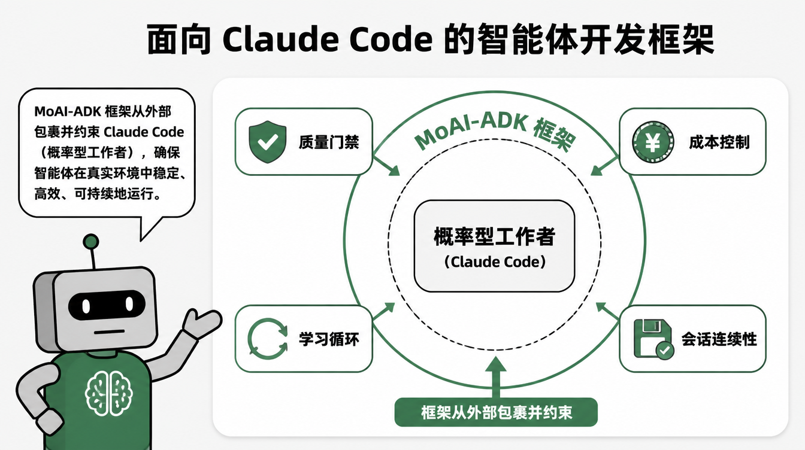
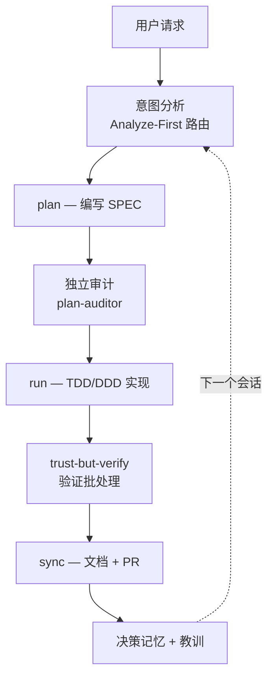
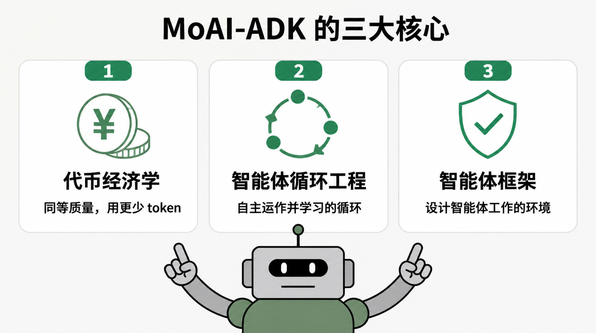
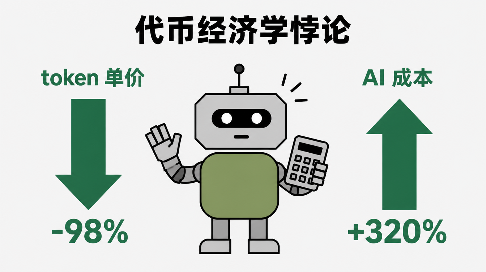
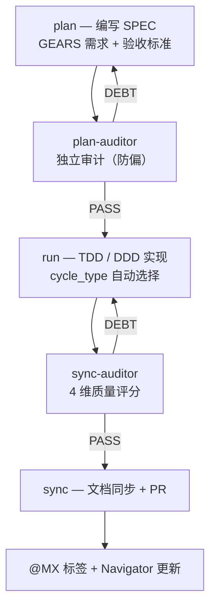
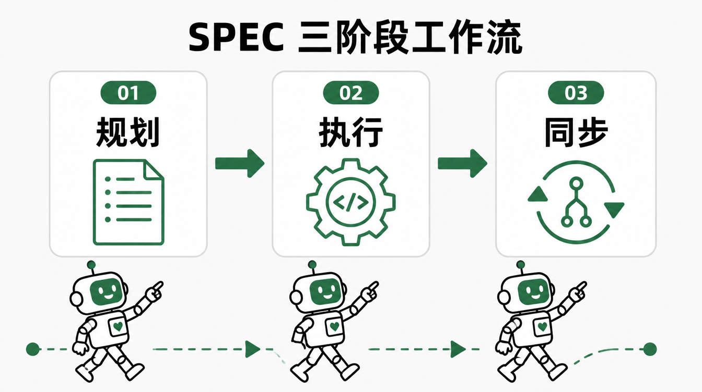
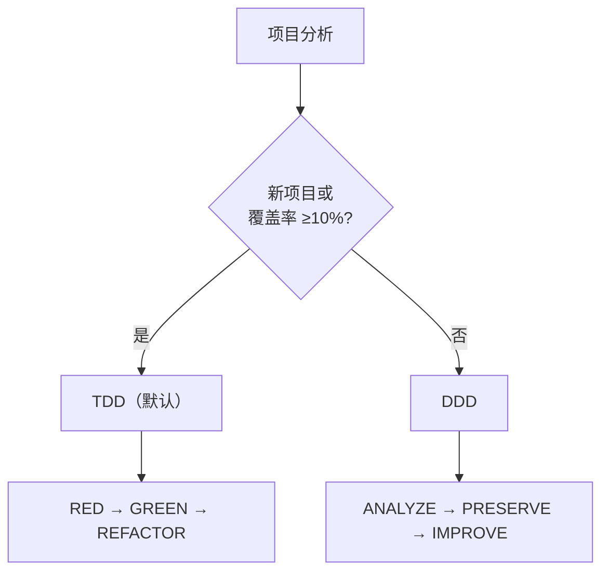
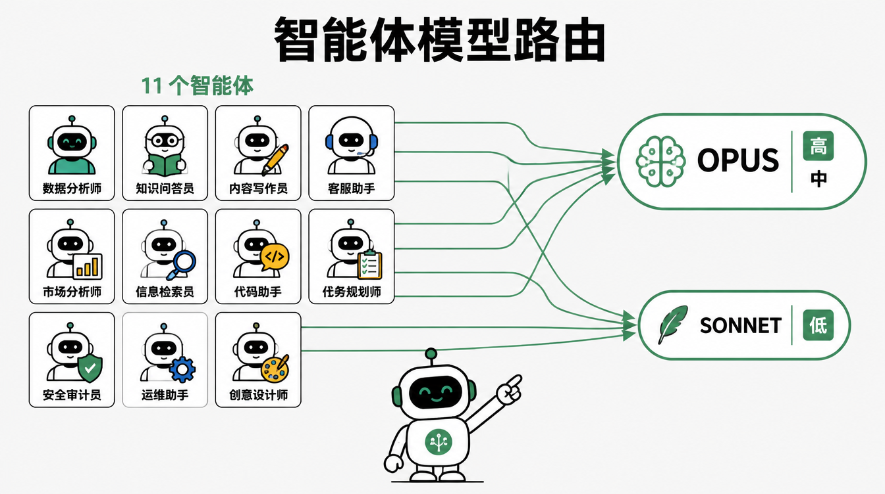

<p align="center">
  
</p>

<h1 align="center">MoAI-ADK</h1>

<p align="center">
  <strong>验证驱动的智能体编排框架 —— 让 Claude Code 写出的代码值得信赖的结构</strong>
</p>

<p align="center">
  <a href="./README.md">English</a> ·
  <a href="./README.ko.md">한국어</a> ·
  <a href="./README.ja.md">日本語</a> ·
  中文
</p>

<p align="center">
  <a href="https://github.com/modu-ai/moai-adk/actions/workflows/ci.yml"></a>
  <a href="https://github.com/modu-ai/moai-adk/actions/workflows/codeql.yml"></a>
  <a href="https://codecov.io/gh/modu-ai/moai-adk"></a>
  <br>
  <a href="https://go.dev/"></a>
  <a href="https://github.com/modu-ai/moai-adk/releases"></a>
  <a href="./LICENSE"></a>
</p>

<p align="center">
  <a href="https://adk.mo.ai.kr"><strong>官方文档</strong></a> ·
  <a href="https://adk.mo.ai.kr/book">图书：用 Claude Code 开始实战智能体编程</a> ·
  <a href="https://discord.gg/Z7E7Mdc5aN">Discord</a>
</p>

---

> **“模型是一个逐个 token 前进的概率型工作者。它无法逐轮记住这轮该花多少、做得好不好、上个会话中断在哪里。框架（harness）从外部把这三件事都强制住。”**

---

## v3.1 新功能 —— 看板模式

> v3.1 在 8 月 15 日（韩国光复节）发布。意图是让工作从“单个会话被上下文上限捆住”的旧形态中解放出来。上限本身并不会消失 —— 真正改变的点都如实写在下面。

一个会话占用一个上下文窗口。长 SPEC 会填满这个窗口，后面的工作背着前面的一切前进：已经结束的计划在评审时仍留在窗口里，评审在写文档时又还留着。常见的逃生口 `/clear` 会把来龙去脉连同负担一起扔掉。

看板模式把一项工作**从一个终端拆到四个终端**。主控会话（lead）驾驶整条链，三个伴随会话各认领 `plan`、`run`、`sync` 中的一列，**只背自己那一列的上下文**。评审不是单独的列，而是由 sync 门禁吸收 —— sync 阶段亲自运行评审视角得出结论。这不是解除上限 —— 每个会话的限额原样存在。改变的是：任何会话都不再背着三个阶段的历史，于是同样的预算能走得更远，结束的阶段可以清空而不丢失卡片。

<p align="center">
  
</p>

每一列都可以用不同的后端和推理强度。上面的画面把 Plan 跑在 Opus 5 high、Run 跑在 GLM 5.2 xhigh、Sync 跑在 GLM 5.2 上 —— 因为每一列需要的推理深度并不相同。

### 开始使用

```bash
moai cc -k                    # 主控 —— 告知 run-id 并铺设链条
moai cc -k --name plan        # 伴随会话，各自在单独的终端里
moai cc -k --name run
moai cc -k --name sync
```

伴随会话**要由人手在新的终端里逐个启动**。名字只用角色名 —— run-id 是主控会话的标识符，伴随会话不携带它；同一个角色名已被占用的会话占着时，下一个会话顺次拿编号。会话不能替别的会话启动。任何一列把 `moai cc` 换成 `moai glm`，就只有那一列跑在 GLM 后端上。

### 后端怎么搭配

打开看板时，引导信息会一并给出默认推荐 —— 若优先考虑 token 可用性：主控用 `moai glm -k`，plan 用 `moai cc -k --name plan`，run 用 `moai glm -k --name run`，sync 用 `moai cc -k --name sync`。这样安排的理由是每条泳道需要的推理种类不同：plan 和 sync 是做判断和评审的列，交给 Claude；run 以实现为主，用 GLM 压低成本。主控不是下判定的位置，而是守着队列搬卡片的位置，适合常驻等待成本不高的 GLM。GLM 主控之下需要 Claude 判定时，会经名为 `judge` 的会话绕出去 —— 这是 GLM 主控使用 Claude 的唯一途径。一个账号开始被 429 限流时，把各条泳道分散到不同账号来安排是行之有效的做法。这个组合终究只是默认推荐 —— 换别的组合、或把全部会话统一到单一后端都没问题。

### 工厂模式 —— N 条泳道同时搬运多张卡片

`-f` 打开工厂主控，这是看板的第二种形态。看板里的卡片在各列之间跳，而工厂里的卡片**整张进一条泳道**，由那条泳道在会话内串行走完 `plan → run → sync`，每个阶段都以 `Agent()` 子智能体的形式启动。泳道名为 `lane-1` … `lane-N`。

```bash
moai cc -f                    # 主控 —— 默认一条泳道 (lane-1)
moai cc -f 4                  # 主控 —— 四条泳道
moai cc -f lane-1             # 一条泳道，在自己的终端里
moai glm -f lane-3            # ……GLM 后端上的一条泳道
```

用 `moai cc -f lane-<n>` 一条一条地加泳道；编号已被活着的会话占用时顺延到下一个空号。一条泳道最多并发运行 10 个 `Agent()` 子智能体，其中承担写入的生成各自隔离在自己的工作树里。千万不要一次把所有泳道全开 —— 先起第一条，确认它真的开始产出，再激活其余。卡片绝不会被拆到多条泳道上。`-k` 依旧驱动三角色的看板链；一次启动只能带一个进入标记，所以 `-k` 与 `-f` 同时给出会报错，`moai cg` 也拒绝工厂模式。

> 详见：[看板模式 —— 工厂模式](https://adk.mo.ai.kr/zh/advanced/kanban-mode)

看板是 `backlog → plan → run → sync → done` 五列。`backlog` 刻意不设归属会话 —— 工作只有人放进去，才会进入看板。

```text
/moai todo "rename 提示过时了"   # 追加卡片
/moai todo                      # 查看队列
```

有两条规则让看板保持诚实。主控**只凭自己从卡片 `progress.md` 里读到的证据**推进卡片 —— 不凭伴随会话的回复，因为回复是主张而不是观测，而且跨会话投递并不保证送达。另外，一个阶段结束后，主控会请你手动 `/clear` 对应会话 —— `/clear` 是用户亲手敲的命令，无法当作指令发送。

### 四个会话共用的词汇

把看板文档里反复出现的词汇收进一张图。**列** (column) 是看板的阶段；**泳道** (lane) 是把一张卡片一路送到终点的“会话 + 工作树”组合 —— 区别就像站点和线路。

```text
操作者 ── /moai todo ──▶ backlog ─▶ plan ─▶ run ─▶ sync ─▶ done
                          (主控只凭读到的证据把卡片送入下一列)

泳道 —— 卡片 t0:  run 会话 + 工作树 WT-t0   ┐ 两条流共用同一块看板，
泳道 —— 卡片 t1:  run 会话 + 工作树 WT-t1   ┘ 并排流动、互不混杂
```

| 词汇 | 一句话定义 |
|---|---|
| 卡片 (card) | 一个工作单元。经 `/moai todo` 进入，以短 ID 相称 |
| 列 (column) | 看板的一个阶段 —— 五列顺序固定 |
| 积压区 (backlog) | 入口等待队列。没有归属会话，只有人能投放 |
| 泳道 (lane) | 把一张卡片送到终点的“会话+工作树”组合。一条并行工作流 |
| 主控 (lead) | 协调者会话。只凭读到的证据推进卡片，自己不写代码 |
| 伴随会话 (companion) | 坐镇某一列干活的会话。由人手逐终端启动 |
| 运行 ID (run-id) | 主控启动时告知的短标识符。它是主控会话的名字，伴随会话不携带它 |
| 工作树 (worktree) | 卡片专用的隔离检出（`WT-<卡片>` 分支）。从 run 到 sync 一棵贯通 |
| 派单 (dispatch) | 主控发给伴随会话的指令 —— 是工作的指针，不是副本 |

带定义和示例的正式术语表：[看板术语](https://adk.mo.ai.kr/zh/core-concepts/kanban-board-terms)

### 用眼睛看板

`moai web` 会启动一个本地控制台。看板画面把看板链条和 SPEC 流水线放在一起，还附带 Overview、Specs、Monitor、Settings 画面。

<p align="center">
  
</p>

详细指引：[看板模式](https://adk.mo.ai.kr/zh/advanced/kanban-mode) · [manager-lead 领导协调者](https://adk.mo.ai.kr/zh/advanced/manager-lead) · [`/moai todo`](https://adk.mo.ai.kr/zh/utility-commands/moai-todo)

---

## 为什么选择 moai-adk

智能体写代码的时代已经到来，但智能体交出的结果不能照单全收。“测试通过了”这句话到底是真跑过测试的结果，还是智能体的猜测 —— 从一开始，分辨这一点就是最大的问题。moai-adk 正是从这一点出发 —— **在系统层面禁止未经验证的完成声明**，并把每个完成主张与实际执行的命令及其输出绑定为证据。

moai-adk 是从外部包裹 Claude Code 的框架（harness）。它不取代 Claude Code，而是用结构接管过去要你亲手照看的部分 —— 用哪个模型、推理多深、怎么验证结果、会话断了怎么接续、并行运行时怎么隔开才不互相踩踏。验证完整性、SPEC 生命周期、带真实边界的自主执行、活的代码库导航器、自我改进循环、并行安全结构。这六件事构成 moai-adk 的身份。

<p align="center">
  
</p>

这份身份整理为三个核心 (three axes) —— 用更少的 token 拿到同样质量的**成本**（token 经济学）、把观测变成规则、越跑越聪明的**自我改进**（智能体循环工程），以及从结构上防止返工的**质量管理**（SPEC 生命周期 · TRUST 5 门禁 · 隔离）。单独哪一个都不够 —— 下面看它们为什么彼此需要。

### 八个差异点

| 差异点 | 说明 |
|---|---|
| **没有虚假验证** | “测试通过”的主张必须归因于实际执行的命令及其输出。系统禁止把没跑过的验证说成成功 —— 验证主张完整性（verification-claim integrity）绑定在每个智能体和编排器表面上。 |
| **自主 + 真实边界** | 用 `/moai goal` 声明完成条件，会话就会自主工作直到条件满足。同时绑着四道硬边界 —— 轮次上限（默认 30）、停滞守卫、墙钟预算、事前审批门 —— 不会掉进无限循环。 |
| **并行安全** | 每个 SPEC 独占一棵工作树，分支状态守卫拦住主检出里误切的分支，启动写入型智能体前先检查与远端的差距。两个可写智能体从不同时运行。 |
| **长程延续** | 工作跨过 `/clear` 存续。进度留在 `progress.md`，交接消息留在记忆，路由决策留在决策记忆。下一个会话从上一个学会的地方起步，而不是从零开始。 |
| **成本高效** | 按工作阶段和 SPEC 尺寸声明式地指派模型与推理深度。Claude 主控 + GLM 工人的 CG 模式在实现密集型工作上省 60–70% 成本。复用提示缓存、把长输出排到磁盘，保持上下文轻量。 |
| **16 种编程语言同等支持** | Go、Python、TypeScript、JavaScript、Rust、Java、Kotlin、C#、Ruby、PHP、Elixir、C++、Scala、R、Flutter、Swift —— 十六种编程语言作为一个集合，用基于标记的自动检测统一处理。没有任何一种受到优待。 |
| **自我改进** | 观测到反复出现的失败模式就上升为规则修改提案。绝不悄悄应用 —— 先审批再落地。路由决策和门禁证据沉淀进决策记忆，成为下一次运行的材料。 |
| **母语友好** | 韩语、日语、中文、英语四个语言区在同一 PR 内维护，禁止翻译腔，每种语言各有自己的母语行文。绝不强迫母语用户使用英语。 |

### 有什么不同

| | Claude Code 单独 | 一般框架 | **moai-adk** |
|---|---|---|---|
| 完成主张的证据归因 | 用户亲手核对 | 通常没有 | 系统强制（5 段证据报告格式） |
| SPEC 生命周期 | 无 | 有限 | plan→run→sync 三阶段 + Tier S/M/L |
| 自主循环的硬边界 | 不适用 | 多半只有轮次上限 | 轮次上限 + 停滞守卫 + 墙钟 + 审批门 |
| 并行工作隔离 | 手动 | 有限 | worktree + 分支守卫 + 启动前同步检查 |
| 会话延续性 | `/clear` 后中断 | 有限 | 交接 + 记忆 + 进度文件 |
| 16 种编程语言同等对待 | 不适用 | 不适用 | 标记自动检测 + 各语言工具链 |
| 自我改进循环 | 无 | 有限 | 失败观测 → 规则晋升（审批制） |


```mermaid
flowchart TD
    User["用户请求"] --> Analyze["意图分析<br/>Analyze-First 路由"]
    Analyze --> Plan["plan — 编写 SPEC"]
    Plan --> Audit["独立审计<br/>plan-auditor"]
    Audit --> Run["run — TDD/DDD 实现"]
    Run --> Verify["trust-but-verify<br/>验证批处理"]
    Verify --> Sync["sync — 文档 + PR"]
    Sync --> Learn["决策记忆 + 教训"]
    Learn -.下一个会话.-> Analyze
```

### 三个核心互相撑住

只压成本，质量会悄悄垮掉 —— 返工和调试循环随之而来，而返工是所有 token 支出里最贵的。只有质量门禁而没有学习循环，同样的错误每个会话重演一遍。没有成本上限的自主循环，一个失控任务就能烧光配额。三个核心互相撑住 —— **质量挡住返工，成本才保得住经济性；循环捕捉有效的做法，质量才始终可强制；成本门禁在超额前刹停，循环才留在付得起的范围内。**

每一项设计决策都服务于这三个核心之一。用哪个模型、推理多深、上下文怎么花 —— 没有一件被丢给每轮的临场发挥。系统来决定，并把决定记录下来，让下一次运行更聪明。

<p align="center">
  
</p>

### 成本由指派决定，不由单价决定

三年间 token 价格**跌了 98%**（Linux Foundation），同期企业 AI 支出却**涨了 320%**。用量增长把降价整个盖了过去。智能体为解决一个任务要转几十到几百步，token 按比例烧掉。在按量计费下这直接变成账单；在订阅制下，它蚕食所有模型共享的每周配额。

Uber 把 Claude Code 部署给 5,000 名工程师，**四个月烧掉一年的编码预算**，随后引入月度 token 限额。Meta、Amazon、Microsoft 也各自撤回了无限 AI 政策。把任务匹配给合适模型、提升 token 效率的 **token 经济学**成了科技行业的新基线。

传统成本控制是为单价上涨设计的，在这道悖论面前无能为力：价格在跌、总支出在涨。瓶颈不是单价而是用量 —— 更准确地说，是智能体在完成任务前转的步数。

DeepSWE 排行榜（113 项任务、按努力度分视图）证明了这一点。同一个 Claude 家族内部，单任务成本跟着模型**多高效地完成**走，而不是跟着 token 单价走。

| 模型 [effort] | 得分 | 单任务成本 | 备注 |
|---|---|---|---|
| opus-5 [low] | 58%±2 | **$1.66** | |
| opus-5 [medium] | **69%±1** | **$3.29** | **性价比拐点** |
| opus-5 [high] | 73%±2 | $6.08 | 得分 +4，成本 1.8 倍 |
| opus-5 [xhigh] | 73%±3 | $9.07 | 纯亏损 —— 与 high 持平，只多花 49% |
| opus-5 [max] | 74%±4 | $11.84 | |
| glm-5.2 [max] | 44%±2 | $3.92 | API 计费下吃亏 · z.ai 包月制下有用 |
| sonnet-5 [max] | 54%±4 | $26.40 | 被 opus-5 [low] 支配 |

Opus 5 用最低努力度跑，得分反而高于 Sonnet 5 用最高努力度（58% vs 54%），单任务成本只有十六分之一（$1.66 vs $26.40）—— 尽管 Sonnet 的 token 单价更便宜。原因是 268 步对 36 步：写账单的是重试循环，不是 token 费率。成本由**给每个任务指派合适的模型和推理深度**决定。

<p align="center">
  
</p>


> 来源：[DeepSWE v1.1 排行榜](https://deepswe.datacurve.ai)（datacurve.ai，113 项任务，2026-07-25）

---

## 快速开始

### 安装

#### macOS / Linux / WSL

```bash
curl -fsSL https://adk.mo.ai.kr/install.sh | bash
```

#### Windows (PowerShell 7.x+)

```powershell
irm https://adk.mo.ai.kr/install.ps1 | iex
```

#### 从源码构建 (Go 1.26+)

```bash
git clone https://github.com/modu-ai/moai-adk.git
cd moai-adk && make build
```

已安装过？用 `moai update` 升到最新版本。

> 💡 **想省成本 —— 推荐 z.ai GLM**：通过[这个链接](https://z.ai/subscribe?ic=1NDV03BGWU)注册 z.ai 可获得一定量的赠送 token。这个链接也是赞助 moai-adk 开源开发的途径。也有免费模型（GLM-4.7-Flash、GLM-4.5-Flash），参见 [z.ai 定价](https://docs.z.ai/guides/overview/pricing)。

### 初始化项目

```bash
moai init my-project
cd my-project
```

交互式向导自动检测语言、框架和方法论，选好模型策略后一直生成到 Claude Code 集成文件。

### 第一个工作流

```bash
claude        # 或者 moai cc —— 在项目里运行 Claude Code
```

```text
/moai plan "添加 JWT 登录"         # 编写 SPEC
/moai run SPEC-AUTH-001            # TDD/DDD 实现
/moai sync SPEC-AUTH-001           # 文档同步 + 创建 PR
```

自然语言也可以。像 `/moai "修一下登录 bug"` 这样写，意图分析（Analyze-First 路由）会读出请求并转入合适的工作流。

### 环境要求

| 平台 | 支持环境 | 备注 |
|---|---|---|
| macOS | Terminal, iTerm2 | 完全支持 |
| Linux | Bash, Zsh | 完全支持 |
| Windows | **推荐 WSL**，PowerShell 7.x+ | 原生 cmd.exe 不支持 |

- **Git** —— 所有平台必备
- **Claude Code** —— moai-adk 是为 Claude Code 准备的框架
- **建议**：`gh` CLI（PR 自动化）、`tmux`（CG 模式）、所用语言的 lint/测试工具链（如 `golangci-lint`）

---

## 核心功能

### 单一入口 `/moai`

自然语言和 16 个子命令进入同一条流水线。`/moai plan`、`/moai run`、`/moai sync` 是 SPEC 流水线的主轴；`goal`、`loop`、`fix`、`review`、`gate`、`clean`、`codemaps`、`e2e`、`mx`、`feedback`、`project`、`harness`、`todo` 补齐四周。

> 已退役的 4 个子命令 —— `design` · `brain` · `coverage` · `security`。`security` 的职责由 `moai-ref-owasp-checklist` + `moai-ref-llm-security` 技能接手。

### MCP 服务器

`moai init` 默认恰好准备**一个**启用的 MCP 条目 —— 自带的 `moai mcp-server`（本地 stdio 服务器）。它向 Claude Code 暴露分成六组的 21 个 MoAI 工具。四个已记载但未启用的条目（`context7`、`chrome-devtools`、`playwright`、`ast-grep`）用 `moai mcp add <名称>` 打开。`moai mcp add|remove|list` CLI 通过 atomic-RWM seam 管理条目，用户无需手改 `.mcp.json`。

| 组 | 工具 | 用途 |
|------|------|------|
| SPEC 生命周期 | `spec_progress`, `spec_audit`, `spec_drift` | 时代分类 + 漂移检测 |
| 验证 | `verify_snapshot`, `verify_trend` | 按键的证照快照 |
| 目标 + 会话 | `goal_arm`, `goal_status`, `session_list` | 自主循环 + 多会话协调 |
| 跨模型审计 | `audit_multi`, `codex_audit`, `glm_audit`, `audit_cache` | 多审计者收敛 |
| codex 委派 | `codex_task`, `codex_setup`, `codex_job_*` | 后台跨模型作业 |
| GLM 委派 | `glm_task`, `glm_job_status`, `glm_job_result`, `glm_job_cancel` | GLM（z.ai）后台作业委派 |

所有后端都是 fail-open —— GLM（`~/.moai/.env.glm`）和 codex（`~/.codex/auth.json`）是可选的；不可用的后端返回 `inconclusive`，绝不是 hard error。

> 详见：[MCP 服务器指南](https://adk.mo.ai.kr/zh/guides/mcp-server) · [Claude Code MCP](https://adk.mo.ai.kr/zh/claude-code/extensibility/mcp)

### goal 引擎 —— 带真实边界的自主循环

声明完成条件，会话就自主工作直到条件满足。轮次上限、停滞守卫、墙钟预算、事前审批门一起绑着，掉不进无限循环。机械条件（命令退出码）和模型条件（对话记录里的主张）都能用。`--max-turns 0` 还能武装 auto-compact 驱动的无限 goal —— 此时由 `--max-duration` 和停滞守卫提供边界。

### 并行 worktree

每个 SPEC 独占一棵工作树。用 `moai cc -w <名称>` 进入；加 `--spawn` 则在保留当前会话的同时开新窗口。分支状态守卫拦住主检出里误切的分支。

### 看板模式

`--kanban`（短写 `-k`）是会话启动器开关，在主控会话的指挥下把单个 SPEC 沿 `plan → run → sync` 推进，并用多会话看板协调。看板的骨架是 **Origin-Trail Chain** —— 一棵 append-only 的 JSONL 谱系树，追踪 worktree 祖先、解决深度遗忘（`/clear` 之后从根到叶恢复链条）、并通过心跳陈旧度检出死掉的主控会话。

| 概念 | 作用 |
|------|--------|
| Origin-Trail Chain | `.moai/state/chain/events.jsonl` 的 append-only JSONL 事件流 |
| WorktreeNode（13 字段） | 每会话状态：ID、父节点、深度、origin 链、里程碑、恢复目标 |
| CWD 冲突消解 | 用 `(worktree_path, session_id)` 对区分复用路径 |
| 深度上限 | 限制嵌套复杂度 |

> **现在就能用**：`moai cc -k`（或 `moai glm -k`）启动主控，用 `-k --name <role>` 逐个接入伴随会话 —— 每终端一个，手动启动。`moai chain <status|lineage|back|list|prune>` 读谱系，`moai todo`（不带参数查看队列，`add`·`list`·`next`·`done`·`unpick`，两个以上的词直接当作追加卡片）运营 `backlog` 列。启动顺序见上文“v3.1 新功能 —— 看板模式”一节。

> 详见：[看板模式指南](https://adk.mo.ai.kr/zh/advanced/kanban-mode)

### CG 模式 —— Claude 主控 + GLM 工人

Claude 负责战略、计划和审计；GLM 扛大批量实现。两者通过 tmux 会话级环境隔离接起来，在实现密集型工作上省 60–70% 成本。

<p align="center">
  
</p>

### 16 种编程语言同等支持

Go、Python、TypeScript、JavaScript、Rust、Java、Kotlin、C#、Ruby、PHP、Elixir、C++、Scala、R、Flutter、Swift。基于标记的自动检测驱动每种语言的标准 lint/格式化/测试工具链。

### 自动质量门禁

TRUST 5（Tested · Readable · Unified · Secured · Trackable）作用于每一次变更。`/moai gate` 一趟跑完 lint + 格式化 + 类型 + 测试，sync-auditor 按功能、安全、做工、一致性四个维度打分。

### @MX 标签

让智能体之间交接上下文、不变量和危险区的行内代码标注。只给高扇入、复杂或危险的代码做标记。

### Navigator —— 活的代码库地图

`@NAV:DEC`、`@NAV:SYM`、`@MX:SPEC` 三类 token 绑进一张可寻址的图（`nav-graph.json`）。设计决策、SPEC 和代码符号双向相连 —— 改代码时，决策的来龙去脉跟着一起到。

### 会话交接

工作跨过 `/clear` 存续。6 段式 paste-ready resume 消息把进度带到下一个会话；自动注入模式下，一条消息即可恢复会话。

### loop / fix —— 错误驱动开发

`/moai loop` 并行扫过 LSP 诊断、AST-grep 和 linter，把抓到的问题按级别归组，直到队列清空。`/moai fix` 是一趟搞定的一次性修缮。

### review --deep

`/moai review --deep` 运行多智能体对抗式漏洞扫描，背后跟着 OWASP · LLM 安全 · 供应链 · DevSecOps 参考技能。

### 四语言区文档

韩语、日语、中文、英语文档在同一 PR 内维护。禁止翻译腔，每种语言各有母语行文，四语言区一致性检查绑在构建门禁上。

### moai web 控制台

<p align="center">
  
</p>

`moai web` 打开一个只监听本地主机的控制台。画面共五个 —— Overview、Kanban、Specs、Monitor、Settings；设置画面分成十一个标签页：Identity、Language、LLM、3rd Party LLM、Workflow、Git & Worktree、Audit、Agents、Report、MCP、Cross-Session。档案的创建、改名、删除也在同一画面完成。

### ref / domain 技能

`moai-ref-api-patterns`、`moai-ref-owasp-checklist`、`moai-ref-llm-security`、`moai-ref-react-patterns`、`moai-ref-testing-pyramid`、`moai-ref-ui-polish`、`moai-ref-secops`、`moai-ref-supply-chain`、`moai-ref-seo`、`moai-ref-git-workflow` 与 `moai-domain-backend`、`moai-domain-frontend`、`moai-domain-database`、`moai-domain-testing`、`moai-domain-uiux` 向智能体注入现场知识。

### 跨平台

一个无额外依赖的 Go 单一二进制，跑在 macOS、Linux、Windows 上。钩子系统机械地强制门禁，状态栏实时显示成本和上下文。

---

## 它是如何工作的

### SPEC 三阶段生命周期

所有工作沿 plan → run → sync 三个阶段流动。Tier S/M/L 尺寸分级决定验证深度和 PR 路由。GEARS 格式的需求与验收标准以证据判定完成。


```mermaid
flowchart TD
    P["plan — 编写 SPEC<br/>GEARS 需求 + 验收标准"] --> PA["plan-auditor<br/>独立审计（防偏）"]
    PA -->|PASS| R["run — TDD / DDD 实现<br/>cycle_type 自动选择"]
    PA -->|DEBT| P
    R --> SA["sync-auditor<br/>4 维质量评分"]
    SA -->|PASS| S["sync — 文档同步 + PR"]
    SA -->|DEBT| R
    S --> MX["@MX 标签 + Navigator 更新"]
```

<p align="center">
  
</p>

方法论（TDD/DDD）由项目状态挑选。`moai init` 看覆盖率自动决定。


```mermaid
flowchart TD
    A["项目分析"] --> B{"新项目或<br/>覆盖率 ≥10%?"}
    B -->|"是"| C["TDD（默认）"]
    B -->|"否"| D["DDD"]
    C --> F["RED → GREEN → REFACTOR"]
    D --> G["ANALYZE → PRESERVE → IMPROVE"]
```

| 方法论 | 循环 | 适用 |
|---|---|---|
| **TDD**（默认） | RED → GREEN → REFACTOR | 新项目、功能开发 |
| **DDD** | ANALYZE → PRESERVE → IMPROVE | 覆盖率低于 10% 的存量代码 |

### 12 智能体目录

| 分类 | 智能体 | 成本 | 职责 |
|------|------|------|------|
| **管理者** | manager-spec | 🔴 | plan 阶段编写 SPEC |
| | manager-develop | 🔴 | run 阶段 TDD/DDD/autofix 实现 |
| | manager-docs | 🔵 | sync 阶段文档 |
| | manager-git | 🩵 | PR 创建与路由 |
| | manager-design | 🟠 | 设计阶段协作（Claude Design） |
| | manager-lead | 🔴 | 层级团队 Tier L 协调 + 看板·工厂领导会话派工（唯一的 Agent 携带者，深度 2 封印） |
| **评审者** | plan-auditor | 🔴 | 独立 plan 审计（防偏） |
| | sync-auditor | 🔴 | 4 维质量评分（功能性 40 · 安全 25 · 做工 20 · 一致性 15） |
| **构建者** | builder-harness | 🟠 | 项目专用智能体、技能、命令、钩子的脚手架 |
| **顾问** | super-advisor | 🔵 | 按需高推理咨询（E1-E4 升级） |
| **专员** | e2e-tester | 🟠 | Web/移动/桌面 E2E 测试执行（CLI 优先） |
| **内置** | Explore | ⚪ | 只读代码库探查 |

成本颜色跟随默认 `medium` 档位的模型×推理单元（用 `moai model profile` 查看）：🔴 opus+high · 🟠 opus+medium · 🔵 opus+low · 🩵 sonnet+low · ⚪ 继承会话模型（用户自加智能体）。切换档位（`high`/`low`）后指派随之变化。写作和审计从一开始就分给别人 —— 写的人永远不给自己的作业打分。

### trust-but-verify —— 给完成主张绑上证据

智能体报告“测试通过了”时，编排器不照单全收，而是亲自跑验证批。七个只读验证（测试、覆盖率、子智能体边界、哨兵扫描、CLI 冒烟、基准、lint）在一轮里并行执行，各自的退出码和输出留作证据。

验证主张完整性（verification-claim integrity）规则在背后托住这条流程 —— 不许把没跑过的验证说成成功、不许把以前量过的值冒充新测量、不许把没观测到的东西当空档放过。5 段报告格式（主张 · 证据 · baseline 归因 · 未验证 · 残余风险）绑定每个智能体和编排器的每份完成报告。

### 削减验证成本，在超额前刹停

验证是必要的；验证输出坐进上下文则不是。冗长的验证输出排到磁盘文件，上下文里只留退出码和截断的尾巴（最多 50 行）。复用提示缓存（缓存读取只要 0.1 倍费用）让窗口保持轻量，上下文瘦身 `/clear` 策略在阈值（1M 50% / 200K 90%）处发出建议。

预算侧由 token 断路器守着 —— 在硬上限（默认 90%）中止执行，把进度存进 `progress.md`，并发出一条贴上就能续跑的 resume 消息。状态栏始终显示上下文用量、缓存命中率和限额消耗，超额不会悄悄溜过去。

### 读懂状态栏

```
🤖 Opus │ 🧠 xhigh·t │ ♻️ 87% │ 🔅 cc v2.1.212 │ 🗿 v3.1.1 │ ⏳ 2h 34m │ 💬 MoAI
🪫 CW: ████████░░ 88% (⚠️/clear) │ 🔋 5H: ████░░░░░░ 45% (4h 30m) │ 🪫 7D: ████████░░ 82% (Jan 21)
📁 moai-adk-go │ 📡 modu-ai/moai-adk | 🅱️ feat/statusline ↑2 +3 │ 📫 +1 M2 ?0 │ 📋 [run SPEC-AUTH-001-run] │ 💌 PR #1042 (⌥approved)
🏷️ run │ 🔄 TODO: 1 / 3 │ 🔀 2 / 1
```

| 元素 | 含义 |
|------|------|
| 🤖 模型 | 当前活动模型 |
| 🧠 effort | 推理强度 —— 扩展推理开启时带 `·t` 后缀 |
| ♻️ 缓存命中率 | 提示缓存命中率 |
| CW: 上下文 | 上下文窗口使用率 + 两段式 `/clear` 标记（⚠️ 软性、🛑 硬性） |
| 5H / 7D | 套餐使用率 + 重置时间 |
| 📁 目录 | 项目目录名 |
| 📡 仓库 | GitHub 仓库 `owner/name`（与 PR 图标 🔀 相区分） |
| 🅱️ 分支 | 当前分支 + `↑`领先 `↓`落后 + `+`改动数 |
| 📫 git 状态 | 信箱图标（📬 已暂存 / 📫 已修改 / 📪 未跟踪 / 📭 干净）+ 计数 |
| 📋 任务 | 活动 SPEC 工作流 `[命令 SPEC-ID-阶段]` |
| 💌 PR | 活动 GitHub PR 编号 + 评审状态（`⌥状态`） |
| 🏷️ 会话行 | 末行按条件显示 —— 会话名 · 👤 智能体 · 🔄 `TODO: 进行中 / 待办` 积压 · 🔀 打开的 issue/PR 数 |

> 详见：[状态栏指南](https://adk.mo.ai.kr/zh/advanced/statusline)

---

## 工作流示例

### 做一个新功能（TDD）

```text
/moai plan "添加用户头像上传"
/moai run SPEC-PROFILE-001
/moai sync SPEC-PROFILE-001
```

新代码或覆盖率足够的代码配 TDD（RED → GREEN → REFACTOR）。`moai init` 检测项目状态，在 TDD 和 DDD 里挑一个。

### 长时间运行（goal）

```text
/moai plan "重构支付模块"
/moai run SPEC-PAY-001
/moai goal "go test ./... exits 0 && lint clean, or stop after 20 turns"
```

声明完成条件，会话就自主工作直到条件满足。轮次上限默认 30，并绑着停滞守卫。上下文到阈值（1M 50% / 200K 90%）时建议 `/clear`，并把进度存进 `progress.md`。

### 并行运行（worktree）

```bash
moai cc -w feature-auth        # 打开 auth 工作树
moai cc -w feature-billing --spawn   # billing 开新窗口，保留当前会话
```

```text
# 在 auth 树里
/moai run SPEC-AUTH-001

# 在 billing 树里
/moai run SPEC-BILL-001
```

每个 SPEC 独占一棵工作树，两个智能体互不踩踏。分支状态守卫拦住主检出里误切的分支。

### 降低成本（CG 模式）

```bash
moai glm sk-your-glm-api-key   # 存一次密钥
moai cg                        # 进入 CG 模式（Claude 主控 + GLM 工人）
```

```text
/moai run SPEC-DATA-001        # 实现密集型工作 → GLM 工人扛大批量实现
```

CG 模式由 Claude 主控负责战略、计划和审计，GLM 工人扛大批量实现 —— 在实现密集型工作上省 60–70%。框架、SPEC 工作流和质量门禁在三种模式下完全一致。

### 自动抓 bug（loop）

```text
/moai loop
```

并行扫过 LSP 诊断、AST-grep 和 linter，按级别归组抓到的问题，直到队列清空。单个问题用 `/moai fix` 一趟了结。

---

## 配置与档案

### `.moai/config/sections/`

项目配置拆成一组 YAML 切面文件。

| 切面 | 职责 |
|---|---|
| `language.yaml` | 用户名 · 对话语言 · 代码注释语言 · 提交信息语言 |
| `quality.yaml` | 质量门禁 · 开发模式（TDD/DDD）· 覆盖率 |
| `harness.yaml` | 框架深度（minimal · standard · thorough）· 自动检测 |
| `workflow.yaml` | 工作流行为 |
| `lsp.yaml` | LSP 门禁阈值（SSOT） |
| `user.yaml` | 用户信息 |

环境变量覆盖文件值。优先级细节和完整切面清单见 [CLI 参考](https://adk.mo.ai.kr/zh/cli-reference)。

### 模型档案 —— high / medium / low

`moai model profile` 解析 11 个智能体 × 3 个档案 = 33 个单元的 `{model, effort}` 组合。

<p align="center">
  
</p>

| 档案 | 性格 | 何时用 |
|---|---|---|
| **high** | 以 Opus 为主、高推理 | 复杂规划 · 安全审计 · 疑难调试 |
| **medium**（默认） | 均衡 | 常规 SPEC |
| **low** | Sonnet + 低推理 | 机械重复 · 文档 · 单发任务 |

指派跟着工作阶段（plan / run / sync）和 SPEC 尺寸（Tier S / M / L）走 —— 需要深推理的规划阶段配强推理模型，机械重复的实现阶段配轻量模型。按 No-Haiku 三档策略，单发、输入主导的任务交给 Sonnet low，所有多轮智能体任务一律交给 Opus。

### settings.json / settings.local.json 分离

| 文件 | 职责 | 模板 |
|---|---|---|
| `.claude/settings.json` | 从模板渲染 —— 项目共享配置 | 包含 |
| `.claude/settings.local.json` | 运行时管理 —— 每台机器的值（tmux pane ID · API 令牌 · 绝对路径） | **绝不包含** |

`settings.local.json` 由 `moai glm`、`moai cc`、`moai cg` 在运行时修改，SessionStart 钩子填充环境。误提交了就用 `git rm --cached .claude/settings.local.json` 摘掉。

---

## 随处可用

### 16 种编程语言同等支持

| | | | |
|---|---|---|---|
| Go | Python | TypeScript | JavaScript |
| Rust | Java | Kotlin | C# |
| Ruby | PHP | Elixir | C++ |
| Scala | R | Flutter | Swift |

按项目标记自动检测每种语言，并运行该语言的标准 lint/格式化/测试工具链。缺失的工具悄悄跳过。Dart/Flutter 的正式名称是 "flutter"。没有任何一种受到优待。

### 四语言区文档

| 语言区 | 站点 |
|---|---|
| 한국어 | adk.mo.ai.kr/ko |
| English | adk.mo.ai.kr/en |
| 日本語 | adk.mo.ai.kr/ja |
| 中文 | adk.mo.ai.kr/zh |

四个语言区在同一 PR 内维护，四区一致性检查绑在构建门禁上。禁止翻译腔，每种语言各有母语行文。

### 操作系统

| 平台 | 状态 |
|---|---|
| macOS | 完全支持（Terminal、iTerm2） |
| Linux | 完全支持（Bash、Zsh） |
| Windows | 推荐 WSL，支持 PowerShell 7.x+，原生 cmd.exe 不支持 |

### Claude + GLM

z.ai GLM 作为 Claude Code 的替代后端。只换环境变量，代码原样不动。共三种运行模式。

| 命令 | 主控 | 工人 | tmux | 省成本 |
|---|---|---|---|---|
| `moai cc` | Claude | Claude | 不需要 | — |
| `moai glm` | GLM | GLM | 建议 | 约 70% |
| `moai cg` | Claude | GLM | 必需 | 约 60% |

GLM Coding Plan 每月 $10 起。可用 glm-5.3、glm-4.7、glm-4.5-air 以及免费模型（GLM-4.7-Flash、GLM-4.5-Flash）。

Claude 的每一档通过 `ANTHROPIC_DEFAULT_*_MODEL` 环境变量映射到 GLM 模型：

| Claude 档位 | GLM 模型 | 上下文 |
|---|---|---|
| Opus | glm-5.3 | 1M |
| Sonnet | glm-5.3 | 1M |
| Haiku | glm-5.3 | 1M |
| Fable | glm-5.3 | 1M |

> 详见：[Multi-LLM 指南](https://adk.mo.ai.kr/zh/multi-llm) · [z.ai 定价](https://docs.z.ai/guides/overview/pricing)

---

## 文档与学习

### 官方文档 —— adk.mo.ai.kr

[adk.mo.ai.kr](https://adk.mo.ai.kr) 在线文档分为 12 个板块。

| 板块 | 说明 |
|---|---|
| [快速上手](https://adk.mo.ai.kr/zh/getting-started) | 简介 · 安装 · Windows 指南 · init 向导 · 快速入门 · CLI 概览 · FAQ |
| [核心概念](https://adk.mo.ai.kr/zh/core-concepts) | 身份 · 宪章 · 框架工程 · 基于 SPEC 的开发 · DDD · TRUST 5 |
| [工作流命令](https://adk.mo.ai.kr/zh/workflow-commands) | `plan` · `run` · `sync` —— SPEC 流水线主轴 |
| [实用命令](https://adk.mo.ai.kr/zh/utility-commands) | `fix` · `loop` · `gate` · `review` · `clean` · `codemaps` · `e2e` · `feedback` · `goal` · `todo` |
| [CLI 参考](https://adk.mo.ai.kr/zh/cli-reference) | 终端 `moai` 二进制的全部命令（共 36 个） |
| [Claude Code 指南](https://adk.mo.ai.kr/zh/claude-code) | Claude Code 集成 —— 基础 · 上下文/记忆 · 智能体 · 扩展性 |
| [Multi-LLM](https://adk.mo.ai.kr/zh/multi-llm) | CG 模式与模型策略 |
| [成本优化](https://adk.mo.ai.kr/zh/cost-optimization) | 提示缓存策略与 token 成本削减 |
| [指南](https://adk.mo.ai.kr/zh/guides) | CI 自治化 · 多 LLM CI 等实战运维配方 |
| [Git Worktree](https://adk.mo.ai.kr/zh/worktree) | 并行 SPEC 开发的工作树指南 |
| [Advanced](https://adk.mo.ai.kr/zh/advanced) | token 经济学 · token 预算 · 状态栏 · settings.json · 钩子 · @MX 标签 · 技能 · Harness v4 Builder · 自我进化 · 决策记忆 |
| [参与贡献](https://adk.mo.ai.kr/zh/contributing) | 开源贡献指南 |

### 图书

[**用 Claude Code 开始实战智能体编程**](https://adk.mo.ai.kr/book) —— moai-adk 作者写的实战框架工程指南。[book.mo.ai.kr](https://book.mo.ai.kr)

### CLI 命令表（常用 14 个）

| 命令 | 说明 |
|---|---|
| `moai init` | 交互式项目初始化（自动检测语言/框架/方法论） |
| `moai doctor` | 系统状态诊断与环境校验 |
| `moai status` | 项目状态摘要（Git 分支、质量指标） |
| `moai update` | 升级到最新版（删除前备份 · 支持自动回滚） |
| `moai graph <build\|query>` | 生成/查询代码库图（edges.jsonl）—— 找调用方、波及范围、里程碑交叉检查 |
| `moai cc` / `moai glm` / `moai cg` | Claude 专用 / GLM 专用 / 混合会话 |
| `moai worktree <sync\|done\|remove\|clean\|recover\|snapshot\|verify\|restore>` | Git worktree 维护（进出工作树是启动器的职责） |
| `moai session <list\|register\|current>` | 多会话协调 |
| `moai spec <audit\|archive\|lint\|list\|new>` | SPEC 生命周期工具 |
| `moai goal <arm\|status\|clear>` | goal 引擎 CLI |
| `moai harness <status\|apply\|rollback\|disable>` | 框架学习生命周期 |
| `moai handoff <save\|list>` | 会话交接记录 |
| `moai preference <list\|decay-scan\|toggle>` | 决策记忆管理 |
| `moai web` | 网页控制台 —— 5 个画面（Overview · Kanban · Specs · Monitor · Settings）、11 标签页设置 |

> 全部 36 个命令：[CLI 参考](https://adk.mo.ai.kr/zh/cli-reference)

### ref / domain 技能

**ref（现场知识）**：`moai-ref-api-patterns`、`moai-ref-owasp-checklist`、`moai-ref-llm-security`、`moai-ref-react-patterns`、`moai-ref-testing-pyramid`、`moai-ref-ui-polish`、`moai-ref-secops`、`moai-ref-supply-chain`、`moai-ref-seo`、`moai-ref-git-workflow`

**domain（专业领域）**：`moai-domain-backend`、`moai-domain-frontend`、`moai-domain-database`、`moai-domain-testing`、`moai-domain-uiux`、`moai-domain-html-report`、`moai-domain-humanize`、`moai-domain-svg-infographic`

### CHANGELOG

最近的变更见 [CHANGELOG.md](./CHANGELOG.md)。

### 代码质量要求

每次贡献都要过 TRUST 5 门禁 —— 覆盖率 85% 以上 · lint 错误 0 · 类型错误 0 · Conventional commits。存量代码先用特征化测试固定行为再渐进改进（DDD），新代码走 RED → GREEN → REFACTOR（TDD）。

---

## 常见问题

### 为什么不是每个函数都有 @MX 标签？

正常。标签只标高扇入、复杂或危险的代码。任何项目里的大多数代码都够不到标签阈值 —— 没有标签的文件不是缺陷。

### 状态栏里的版本显示是什么意思？

```
🗿 v3.1.0 ⬆️ v3.1.1
```

前一个值是当前安装的 moai-adk 版本，箭头表示有可用更新。运行 `moai update` 后消失。

### 不用 GLM、只用 Claude 可以吗？

可以。`moai cc` 启动纯 Claude 会话。CG 模式（`moai cg`，Claude 主控 + GLM 工人）和纯 GLM（`moai glm`）是省钱选项；框架、SPEC 工作流和质量门禁在三种模式下完全一致。

### 在已有项目上能用吗？

能。`moai init` 检测项目状态并选择方法论 —— 覆盖率低于 10% 的存量代码用 DDD（先特征化测试固定行为、再渐进改进），新项目或测试充分的代码用 TDD。

---

## 一起参与

### 贡献

随时欢迎贡献。详细流程见 [CONTRIBUTING.md](CONTRIBUTING.md)。

1. 复刻（fork）仓库
2. 建功能分支：`git checkout -b feature/my-feature`
3. 写测试 —— 新代码用 TDD，存量代码用特征化测试
4. 确认测试、lint、格式化通过：`make test` · `make lint` · `make fmt`
5. 用 Conventional commit 信息提交并开拉取请求

**代码质量要求**：覆盖率 85% 以上 · lint 错误 0 · 类型错误 0 · Conventional commits

### 反馈

在 Claude Code 里用 `/moai feedback` 直接把 bug 报告和功能请求发成 GitHub issue。终端里则用 [GitHub Issues](https://github.com/modu-ai/moai-adk/issues)。

### 社区

- [Discord](https://discord.gg/Z7E7Mdc5aN) —— 实时讨论与技巧
- [GitHub Issues](https://github.com/modu-ai/moai-adk/issues) —— bug 报告 · 功能请求

### 许可证

[Apache License 2.0](./LICENSE) —— 详情见 LICENSE 文件。

---

## Star 历史

<a href="https://www.star-history.com/?type=date&repos=modu-ai%2Fmoai-adk">
 <picture>
   <source media="(prefers-color-scheme: dark)" srcset="https://api.star-history.com/chart?repos=modu-ai/moai-adk&type=date&theme=dark&legend=top-left&sealed_token=9wFuBO5GMKxHZsaknxlIW3oypXLJlyW1qqq8T--aTRyfp6j9EK9KTR2vJvyAG8AKSs3Lindw7LUt-m-I6ysz9BoV6kdtrKlJYTViQAYR56A_3ie4ZVOqIw" />
   <source media="(prefers-color-scheme: light)" srcset="https://api.star-history.com/chart?repos=modu-ai/moai-adk&type=date&legend=top-left&sealed_token=9wFuBO5GMKxHZsaknxlIW3oypXLJlyW1qqq8T--aTRyfp6j9EK9KTR2vJvyAG8AKSs3Lindw7LUt-m-I6ysz9BoV6kdtrKlJYTViQAYR56A_3ie4ZVOqIw" />
   
 </picture>
</a>

<p align="center">
  <sub>MoAI-ADK 团队出品 · <a href="https://adk.mo.ai.kr">adk.mo.ai.kr</a></sub>
</p>
