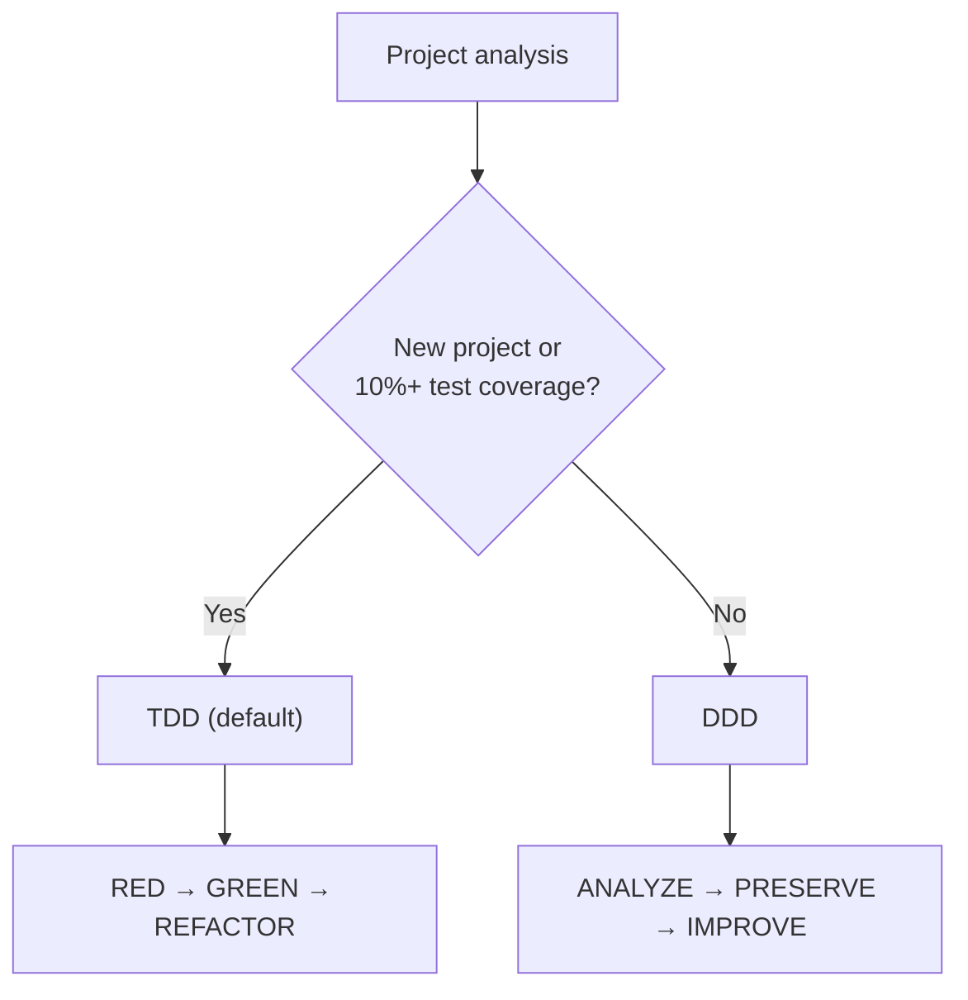

<p align="center">
  
</p>

<h1 align="center">MoAI-ADK</h1>

<p align="center">
  <strong>为 Tokenomics 而设计的 Agentic 开发套件</strong>
</p>

<p align="center">
  <a href="./README.md">English</a> ·
  <a href="./README.ko.md">한국어</a> ·
  <a href="./README.ja.md">日本語</a> ·
  中文
</p>

<p align="center">
  <a href="https://book.mo.ai.kr" target="_blank"><strong>官方图书《Claude Code 实战 Agentic 编程》</strong></a><br>
  MoAI-ADK 作者亲写的 Harness 工程实战指南 — <a href="https://book.mo.ai.kr" target="_blank">book.mo.ai.kr</a>
</p>

<p align="center">
  <a href="https://github.com/modu-ai/moai-adk/actions/workflows/ci.yml"></a>
  <a href="https://github.com/modu-ai/moai-adk/actions/workflows/codeql.yml"></a>
  <a href="https://codecov.io/gh/modu-ai/moai-adk"></a>
  <br>
  <a href="https://go.dev/"></a>
  <a href="https://github.com/modu-ai/moai-adk/releases"></a>
  <a href="./LICENSE"></a>
</p>

<p align="center">
  <a href="https://adk.mo.ai.kr"><strong>官方文档</strong></a> ·
  <a href="https://adk.mo.ai.kr/book">图书：Claude Code 实战 Agentic 编程</a> ·
  <a href="https://discord.gg/Z7E7Mdc5aN">Discord</a>
</p>

---

> **"Tokenomics 是一个旨在让 Token 消费变得经济的 Harness。"**

---

## MoAI-ADK 是一个 Tokenomics Harness

MoAI-ADK（Agentic Development Kit）让 Claude Code 生成代码，然后以可预测的成本让这些代码变得可靠。Harness 是从外部包裹模型的系统。模型是按 Token 计费的随机工作者 — 它既不记得预算，也不记得质量标准，更不记得上个会话在哪里中断。成本上限、通过的测试套件、跨越 `/clear` 的连续性 — 这些属性无法靠每回合重新提示来植入，必须由外部系统强制执行。

所有设计决策服务于一个目标：Tokenomics —— 用更少的 Token 达到同样的质量，用同样的 Token 换取更高的质量。使用哪个模型、推理多深、如何消耗上下文 —— 这些都不再听天由命，而是由系统决定。

它不取代 Claude Code。它只是把 Claude Code 留给用户自行处理的部分 —— 模型路由、质量门、成本控制、会话连续性 —— 用结构包裹起来。用 Go 编写的单一二进制文件，在 macOS、Linux、Windows 上零依赖即可运行。

---

## 为什么是 Tokenomics

Token 单价持续下降，但实际 Agent 工作流的支出却在上升。Agent 为解决单个任务要运行几十到几百步，消耗成比例的 Token。按量计费中这直接变成账单，订阅制中则是消耗所有模型共享的周额度配额。

### 成本由配分决定，而非模型单价

DeepSWE 排行榜（113 tasks）的实测数据展示了这个问题。即使在同一个 Claude 系列内，以同样的 max effort 运行，单任务成本也差异巨大。

| 模型 [max] | Pass@1 | 单任务成本 | $/解决任务 | Token/解决任务 | 步数 |
|---|---|---|---|---|---|
| claude-opus-4.8 | 59% | $13.22 | **$22.4** | 229k | 120 |
| claude-fable-5 | 70% | $21.63 | $30.9 | 170k | 88 |
| claude-sonnet-5 | 54% | $26.40 | **$48.9** | 396k | 268 |

Sonnet 5 max 比 Opus 4.8 max **单任务更贵**（$26.40 vs $13.22）但分数更低（54% vs 59%）。原因是 268 步 —— 在 max effort 下重试循环爆炸。"用弱模型跑得更狠就能省钱"的直觉不成立。反而跑三倍步数，消耗更多配额。成本由**为任务分配合适的模型和推理深度**决定，而非单价。

MoAI-ADK 将这种分配系统化，不再听天由命。

---

## 三轴经济化

### 路由 — 为每个任务分配合适的模型和推理深度

**Tier×Phase 矩阵**。根据工作阶段（plan / run / sync）和 SPEC 大小（Tier S / M / L）声明式分配模型和推理深度（effort）。需要深度推理的计划阶段分配高推理模型，机械重复较多的实现阶段分配轻量模型。最大化成本质量比。

**No-Haiku 3 层模型策略**。将 Haiku 从路由模型集中排除，工作分散到 3 层结构（Sonnet / Opus / Fable）。机械任务分配 Sonnet low effort 最小化步数，推理关键处分配上层模型。

**配置矩阵**。单一的 per-agent 配置矩阵将每个保留 agent 映射到一个 `{model, effort}` 对。单一配置文件轴 —— `max` / `medium`（默认）/ `low`，通过 `llm.profile`（`moai init --profile`、`moai update --profile`）选择 —— 选取活动列；`moai model profile` 解析每个 agent 的格。10 个分组 agent 从矩阵获取 model+effort（任何位置都没有 Haiku），而 `Explore` 和用户自定义 agent 继承会话模型。

**CG 模式（Claude + GLM）**。`moai cg` 是结合 Claude 领导和 GLM Worker 的混合模式。战略、规划、审计在 Claude 上运行；大批量实现在 GLM 上运行。实现密集型工作负载节省 **60-70% 成本**。

### 验证经济 — 减肥上下文，证据落地磁盘

**verify-diet**。将冗长验证输出重定向到磁盘文件，上下文中只保留退出码和 bounded tail（最多 50 行）。这个文件重定向契约在保持验证证据完整性的同时减少上下文消耗。证据持久化在 `.moai/state/verify/<session>/` 下。

**Prompt 缓存**。当请求前缀与上次请求相同时，重用该部分而非重新处理。缓存读取的成本是基础输入单价的 0.1 倍。最小化常驻指令，命中率就会直接上升。Statusline 缓存命中率段（`♻️`）提供实时监控。

**上下文减脂**。应用 `/clear` 策略。SPEC 阶段完成后 `/clear`，将进度保存到 `progress.md`，然后发布可粘贴的 resume 消息。上下文窗口阈值（1M 模型 50% / 200K 模型 90%）时自动出现建议。

### 预算防御 — 超支前停止，下个会话继续

**Token Circuit Breaker**。当 Agent Token 使用量达到 hard-limit（默认 90%）时执行安全中断。将进度保存到 `progress.md`，发布可粘贴的 resume 消息，绝不自动 `/clear`。系统只推荐 `/clear`，由用户判断并执行。

**Statusline**。始终在终端底部显示上下文使用率（CW%）、Prompt 缓存命中率、Rate limit 耗尽率。CW% 旁边的 `(⚠️/clear)` 标记在模型特定阈值出现。

---

## 基础设施支撑 Tokenomics 持续运转

### 质量结构 — 防止返工和调试循环（Token 浪费最差情况）

**SPEC 3 阶段生命周期**。plan → run → sync。Tier S/M/L 大小分类决定验证深度和 PR 路由。GEARS 格式要求 + 验收标准按证据判定完成。

**TRUST 5 质量门**。Tested（85%+ 覆盖率）·Readable · Unified · Secured · Trackable，应用于所有变更。门控判定验证，而非 Agent 自判。

**11-Agent 目录**。MoAI 自定义 10 个 + 内置 Explore。规划和审计从一开始分离，编写方不能给自己的工作打分。

### 学习循环 — 循环越跑 Token 效率越高

**`/moai goal`·`/moai loop`**。声明一个完成条件，会话自动运行直到满足或达到回合限制（默认 30）。`/moai loop` 并行扫描 LSP 诊断·AST-grep·linter，按问题分级分桶，队列空尽为止。

**Routing Ledger**。将路由决策和门控证据记录为隐私保护摘要。观察升级为规则。

**4 层学习阶梯**。观察（≥1）→ 启发式（≥3）→ 规则（≥5）→ 自动更新（≥10，需用户批准）；信任度下限 0.70。所有应用可通过 `moai harness rollback` 回滚。挽具编辑（规则/智能体/钩子修改）遵循预测–验证纪律：每次编辑记录一条可证伪的预测，须通过 held-in/held-out 双重检查方可采纳，被否决的编辑也会留档。

**决策记忆**。问题在不确定性最高处（p ≈ 0.5）出现；推荐跟随观察到的统计多数，而非系统默认。

### 扩展点 — 复用已验证模式提升项目特定复用效率

**Harness v4 Builder**。自然语言请求 → 领域·目标·约束提取 → 批准门控 → 项目专用 agent·skill·command·hook 脚手架。

**@MX 标签**。AI Agent 之间交换上下文、不变契约、危险区的内联代码注释。

**worktree 隔离**。通过 `/moai plan --worktree` 为每个 SPEC 附加并行开发隔离 worktree。

---


---

## 快速开始

### 安装

#### macOS / Linux / WSL

```bash
curl -fsSL https://raw.githubusercontent.com/modu-ai/moai-adk/main/install.sh | bash
```

#### Windows (PowerShell 7.x+)

```powershell
irm https://raw.githubusercontent.com/modu-ai/moai-adk/main/install.ps1 | iex
```

#### 从源码构建（Go 1.26+）

```bash
git clone https://github.com/modu-ai/moai-adk.git
cd moai-adk && make build
```

### 项目初始化

```bash
moai init my-project
```

交互式向导自动检测语言、框架、方法论，选择模型策略，并生成 Claude Code 集成文件。

### 第一个工作流

```bash
claude        # launch Claude Code inside the project
```

```text
/moai plan "Add JWT login"      # 编写 SPEC
/moai run SPEC-AUTH-001         # TDD/DDD 实现
/moai sync SPEC-AUTH-001        # 同步文档 + 创建 PR
```

自然语言也可以。`/moai "fix the login bug"` 会触发意图分析（Analyze-First 路由），读取请求并路由到合适的工作流。

### 系统要求

| 平台 | 支持环境 | 备注 |
|----------|----------------------|-------|
| macOS | Terminal, iTerm2 | 完全支持 |
| Linux | Bash, Zsh | 完全支持 |
| Windows | **WSL（推荐）**, PowerShell 7.x+ | 原生 cmd.exe 不支持 |

**前置要求**

- 所有平台必须安装 **Git**
- **Claude Code** — MoAI-ADK 是 Claude Code 的 Harness
- **推荐**：`gh` CLI（PR 自动化）· `tmux`（CG 模式）· 语言的 lint/test 工具链（例如 `golangci-lint`）

---

## 参考

### /moai 斜杠命令（16 个）

| 子命令 | 职责 |
|------------|------|
| `plan` / `run` / `sync` | SPEC 3 阶段流水线 |
| `project` / `harness` / `design` | 项目文档+harness 生成 · harness 生命周期 · Design 阶段协作 |
| `goal` / `loop` / `fix` | 声明式 goal 循环 · 迭代修复 · 单次修复 |
| `review` / `gate` / `clean` | 代码审查 · pre-commit 质量门控 · 死代码移除 |
| `mx` / `codemaps` / `feedback` | @MX 注解 · 架构文档 · GitHub issue 报告 |
| `e2e` | 多平台 E2E 测试（Web/移动/桌面，CLI 优先） |
| *（自然语言）* | Analyze-First 路由：自主 plan → run → sync 流水线 |

> → 详情：[Workflow Commands](https://adk.mo.ai.kr/zh/workflow-commands) · [Utility Commands](https://adk.mo.ai.kr/zh/utility-commands)

### CLI 命令（常用 12 个）

| 命令 | 说明 |
|---------|-------------|
| `moai init` | 交互式项目设置（自动检测语言/框架/方法论） |
| `moai doctor` | 系统状态诊断和环境验证 |
| `moai status` | 项目状态摘要（Git 分支、质量指标） |
| `moai update` | 更新到最新版本（支持自动回滚） |
| `moai cc` / `moai glm` / `moai cg` | Claude 专用 / GLM 专用 / 混合 Claude 领导 + GLM Worker 会话 |
| `moai worktree <new|list|switch|sync|remove|clean|go>` | Git worktree 管理并行 SPEC 开发 |
| `moai session <list|register|current>` | 多会话协调 |
| `moai spec <audit|archive|lint|list|new>` | SPEC 生命周期工具 |
| `moai goal <arm|status|clear>` | Goal 引擎 CLI |
| `moai harness <status|apply|rollback|disable>` | Harness 学习生命周期 |
| `moai handoff <save|list>` | 会话交接记录 |
| `moai preference <list|decay-scan|toggle>` | 决策记忆管理 |
| `moai web` | Web Console — 6 标签设置控制台 |

> 全部 36 个命令：[CLI Reference](https://adk.mo.ai.kr/zh/cli-reference)

### 11-Agent 目录

| 分类 | Agent | 成本 | 职责 |
|----------|-------|------|------|
| **Manager** | manager-spec | 🔴 | Plan-phase SPEC 编写 |
| | manager-develop | 🔴 | Run-phase TDD/DDD/autofix 实现 |
| | manager-docs | 🔵 | Sync-phase 文档化 |
| | manager-git | 🩵 | PR 创建和路由 |
| | manager-design | 🟠 | Design-phase 协作（Claude Design） |
| **Evaluator** | plan-auditor | 🔴 | 独立计划审计（偏见防止） |
| | sync-auditor | 🔴 | 4 维质量评分（Functionality 40 · Security 25 · Craft 20 · Consistency 15） |
| **Builder** | builder-harness | 🟠 | 项目专用 agent·skill·command·hook 脚手架 |
| **Advisor** | super-advisor | 🔵 | 按需高推理咨询（E1-E4 升级） |
| **Specialist** | e2e-tester | 🟠 | Web/移动/桌面 E2E 测试执行（CLI 优先） |
| **Built-in** | Explore | ⚪ | 只读代码库探索 |

成本颜色以默认 `medium` 配置文件的 model×effort 单元为准（用 `moai model profile` 查看）：🔴 opus+high · 🟠 opus+medium · 🔵 sonnet+medium / fable+low · 🩵 sonnet+low · ⚪ 继承会话模型。切换配置文件（`max`/`low`）时分配会变化。长期委托的进度记录在 Task 通道，由编排器以图标 Progress Board 转达。

### TRUST 5 质量门控

| 准则 | 含义 | 验证 |
|-----------|---------|------------|
| **T**ested | 已测试 | 85%+ 覆盖率、特性化测试、单元测试通过 |
| **R**eadable | 可读 | 清晰命名、一致风格、lint 错误 0 |
| **U**nified | 统一 | 一致格式、import 顺序、项目结构合规 |
| **S**ecured | 安全 | OWASP 合规、输入验证、安全警告 0 |
| **T**rackable | 可追溯 | Conventional commits、issue 引用、结构化日志 |

### 方法论选择（TDD vs DDD）


```mermaid
flowchart TD
    A["Project analysis"] --> B{"New project or<br/>10%+ test coverage?"}
    B -->|"Yes"| C["TDD (default)"]
    B -->|"No"| D["DDD"]
    C --> F["RED → GREEN → REFACTOR"]
    D --> G["ANALYZE → PRESERVE → IMPROVE"]
```

| 方法论 | 周期 | 对象 |
|-------------|-------|-----|
| **TDD**（默认） | RED → GREEN → REFACTOR | 新项目和功能工作 |
| **DDD** | ANALYZE → PRESERVE → IMPROVE | 覆盖率 <10% 的现有代码 |

---

## 读取 Statusline

```
🤖 Opus │ 🧠 xhigh·t │ ♻️ 87% │ 🔅 v2.1.212 │ 🗿 v3.0.0 │ ⏳ 2h 34m │ 💬 MoAI
🪫 CW: ████████░░ 88% (⚠️/clear) │ 🔋 5H: ████░░░░░ 45% (4h 30m) │ 🪫 7D: ████████░░ 82% (Jan 21)
📁 moai-adk-go │ 🔀 modu-ai/moai-adk | 🅱️ feat/statusline ↑2 +3 │ 💾 +1 M2 ?0 │ 📋 [run SPEC-AUTH-001-run] │ 💌 PR #1042 (⌥approved)
```

| 元素 | 含义 |
|------|------|
| 🤖 模型 | 当前激活模型 |
| 🧠 effort | 推理努力等级 — 扩展思考启用时 `·t` 后缀 |
| ♻️ 缓存命中率 | Prompt 缓存命中率 |
| CW: 上下文 | 上下文窗口使用率 + 2 阶段 `/clear` 标记（⚠️ 软度，🛑 硬度） |
| 5H / 7D | 计费方案使用率 + 重置时间 |
| 📁 目录 | 项目目录名 |
| 🔀 仓库 | GitHub 仓库 identity `owner/name` |
| 🅱️ 分支 | 当前分支 + `↑`ahead `↓`behind + `+`dirty 计数 |
| 💾 git 状态 | staged / modified / untracked 计数 |
| 📋 任务 | 活跃 SPEC 工作流 `[命令 SPEC-ID-阶段]` |
| 💌 PR | 活跃 GitHub PR 编号 + 审查状态（`⌥state`） |

> 详情：[Statusline 指南](https://adk.mo.ai.kr/zh/advanced/statusline)

---

## FAQ

### Q: 为什么不是每个函数都有 @MX 标签？

正常。标签只标记高扇入、复杂或危险的代码。任何项目中大部分代码都不符合任何标签阈值，没有标签的文件不是缺陷。

### Q: Statusline 版本显示是什么意思？

```
🗿 v3.0.0 ⬆️ v3.0.1
```

第一个值是当前安装的 MoAI-ADK 版本；箭头表示有可用更新。运行 `moai update` 后消失。

### Q: 不用 GLM 只用 Claude 可以吗？

可以。`moai cc` 启动 Claude 专用会话。CG 模式（`moai cg`，Claude 领导 + GLM Worker）和 GLM 专用（`moai glm`）是成本节省选项；harness·SPEC 工作流·质量门控在所有三种模式中完全相同。

### Q: 适用于现有项目吗？

适用。`moai init` 检测项目状态并选择方法论 —— 对覆盖率 <10% 的现有代码使用 DDD（特性化测试固定行为后渐进改进），对新/充分测试的代码使用 TDD。

---

## 社区与文档

### 贡献

随时欢迎贡献。详细流程见 [CONTRIBUTING.md](CONTRIBUTING.md)。

1. Fork 仓库
2. 创建功能分支：`git checkout -b feature/my-feature`
3. 编写测试（新代码用 TDD，现有代码用特性化测试）
4. 验证测试、lint、format 通过：`make test` · `make lint` · `make fmt`
5. 使用 Conventional commit 提交并打开 PR

**代码质量要求**：85%+ 覆盖率 · lint 错误 0 · 类型错误 0 · Conventional commits

### 社区

- [Discord](https://discord.gg/Z7E7Mdc5aN) — 实时讨论和技巧
- [Issues](https://github.com/modu-ai/moai-adk/issues) — 错误报告、功能请求（Claude Code 内使用 `/moai feedback`）

### 许可证

[Apache License 2.0](./LICENSE) — 详情见 LICENSE 文件。

### 文档指南

[adk.mo.ai.kr](https://adk.mo.ai.kr) 在线文档分为 12 个章节。

| 章节 | 说明 |
|---------|-------------|
| [Getting Started](https://adk.mo.ai.kr/zh/getting-started) | 介绍、安装、Windows 指南、init 向导、快速开始、CLI 概览、FAQ |
| [Core Concepts](https://adk.mo.ai.kr/zh/core-concepts) | MoAI-ADK 同一性、宪法、harness 工程、SPEC 基于开发、DDD、TRUST 5 |
| [Workflow Commands](https://adk.mo.ai.kr/zh/workflow-commands) | `plan` · `run` · `sync` — SPEC 流水线主干 |
| [Utility Commands](https://adk.mo.ai.kr/zh/utility-commands) | `fix` · `loop` · `gate` · `review` · `clean` · `codemaps` · `e2e` · `feedback` · `goal` |
| [CLI Reference](https://adk.mo.ai.kr/zh/cli-reference) | `moai` 二进制所有命令 — `status`, `profile`, `doctor`, `update`, `web`, `goal`, `handoff`, `harness`, `init`, `worktree` 等 |
| [Claude Code Guide](https://adk.mo.ai.kr/zh/claude-code) | Claude Code 集成 — 基础、上下文·记忆、agentic、扩展性（skill·hook·plugin） |
| [Multi-LLM](https://adk.mo.ai.kr/zh/multi-llm) | CG 模式和模型策略 |
| [Cost Optimization](https://adk.mo.ai.kr/zh/cost-optimization) | Prompt 缓存策略和 Token 成本降低 |
| [Guides](https://adk.mo.ai.kr/zh/guides) | CI 自动化、multi-LLM CI 等实战运营配方 |
| [Git Worktree](https://adk.mo.ai.kr/zh/worktree) | 并行 SPEC 开发用 worktree 指南、示例、FAQ |
| [Advanced](https://adk.mo.ai.kr/zh/advanced) | Tokenomics 概述、Token 预算、statusline、settings.json、hook、@MX 标签、skill 指南、Harness v4 Builder、自进化、决策记忆、目录系统、安全笔记、CLAUDE.md/agent 指南 |
| [Contributing](https://adk.mo.ai.kr/zh/contributing) | 开源贡献指南 |

### 链接

- [官方文档](https://adk.mo.ai.kr)
- [图书：Claude Code 实战 Agentic 编程](https://adk.mo.ai.kr/book)
- [CHANGELOG](./CHANGELOG.md)
- [Claude Code](https://code.claude.com/docs/en)
- [Discord 社区](https://discord.gg/Z7E7Mdc5aN)
