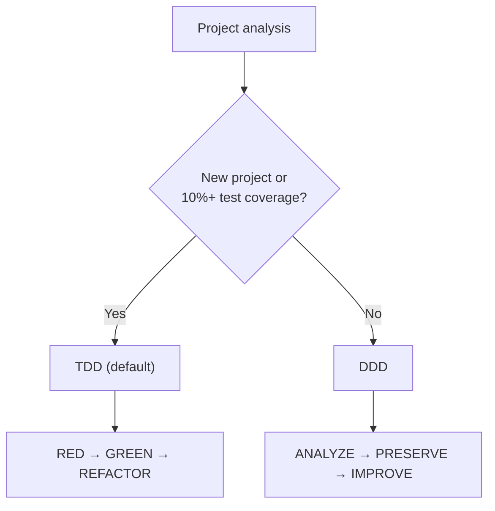

<p align="center">
  
</p>

<h1 align="center">MoAI-ADK</h1>

<p align="center">
  <strong>为 Claude Code 打造的 Agentic 开发 Harness</strong>
</p>

<p align="center">
  <a href="./README.md">English</a> ·
  <a href="./README.ko.md">한국어</a> ·
  <a href="./README.ja.md">日本語</a> ·
  中文
</p>

<p align="center">
  <a href="https://book.mo.ai.kr" target="_blank"><strong>官方图书《Claude Code 实战 Agentic 编程》</strong></a><br>
  MoAI-ADK 作者亲写的 Harness 工程实战指南 — <a href="https://book.mo.ai.kr" target="_blank">book.mo.ai.kr</a>
</p>

<p align="center">
  <a href="https://github.com/modu-ai/moai-adk/actions/workflows/ci.yml"></a>
  <a href="https://github.com/modu-ai/moai-adk/actions/workflows/codeql.yml"></a>
  <a href="https://codecov.io/gh/modu-ai/moai-adk"></a>
  <br>
  <a href="https://go.dev/"></a>
  <a href="https://github.com/modu-ai/moai-adk/releases"></a>
  <a href="./LICENSE"></a>
</p>

<p align="center">
  <a href="https://adk.mo.ai.kr"><strong>官方文档</strong></a> ·
  <a href="https://adk.mo.ai.kr/book">图书：Claude Code 实战 Agentic 编程</a> ·
  <a href="https://discord.gg/Z7E7Mdc5aN">Discord</a>
</p>

---

> **"不要写代码。去设计那个会写代码的环境。"**

---

## MoAI-ADK 是什么？

MoAI-ADK（Agentic Development Kit）是一个从外部包裹 Claude Code 的 harness，让模型随机性的输出变得可靠。模型是一个逐 token 推进的 worker — 它既不记得预算，也不记得质量标准，更不记得上个会话在哪里中断。成本上限、通过的测试套件、自我改进的循环、跨越 `/clear` 的连续性 — 这类属性无法靠每一回合重新提示来植入，必须由系统从外部强制执行。

它不取代 Claude Code。它只是把 Claude Code 留给用户自行处理的部分 — 模型路由、质量门、成本控制、学习循环、会话连续性 — 用结构包裹起来。它是用 Go 编写的单一二进制文件，在 macOS、Linux、Windows 上零额外依赖即可运行。


---

## Harness 的三大支柱

MoAI-ADK 的价值建立在三大支柱上 — 这正是[官方文档站](https://adk.mo.ai.kr/zh/core-concepts)所围绕组织的三个。每个支柱回答一个关于智能体系统应当如何运转的问题。


| 支柱 | 核心问题 |
|---|---|
| 🪙 **代币经济学** | 如何用更少的 token 拿到同等质量？ |
| 🧠 **智能体循环工程** | 循环如何自主运转并学习？ |
| 🛡️ **智能体挽具** | 如何设计让智能体高效工作的环境？ |

### 🪙 代币经济学 — 同等质量，更少 token

Token 单价三年内跌了 **98%**（Linux Foundation），但同期企业 AI 支出反而涨了 **320%**。使用量暴增盖过了单价下降。智能体为解决单个任务要跑几十到几百步，按比例烧掉 token — 按量计费下这直接变成账单，订阅制下则是吃掉所有模型共享的周配额。

Uber 给 5,000 名工程师部署了 Claude Code，**四个月烧完一年的编码预算**，随后被迫施加月度 token 限额。Meta、Amazon、Microsoft 相继收回无限制 AI 政策。**代币经济学** — 把模型匹配到任务以提升 token 效率 — 成为科技行业的新基线。


传统的成本控制是为单价上涨而设计的，面对"单价在跌但总支出在涨"这个悖论便束手无策。瓶颈不在单价，而在使用量 — 更准确地说，是智能体收尾前要跑多少步。

**成本由分配决定，而非单价。** DeepSWE 排行榜（113 tasks，按 effort 分级视图）的实测数据展示了这一点。在同一个 Claude 系列内，单任务成本取决于模型*完成*任务的效率 — 而非一个 token 的价格。

| 模型 [effort] | Pass@1 | 单任务成本 | 输出 token | 步数 |
|---|---|---|---|---|
| claude-opus-5 [low] | 58% | **$1.66** | 20k | 36 |
| claude-opus-5 [medium] | 69% | $3.29 | 37k | 52 |
| claude-opus-5 [high] | 73% | $6.08 | 64k | 73 |
| claude-opus-5 [max] | 74% | $11.84 | 118k | 99 |
| claude-sonnet-5 [max] | 54% | **$26.40** | 214k | 268 |

Opus 5 在**最低** effort 下的分数高于 Sonnet 5 在**最高** effort 下的分数（58% vs 54%），而单任务成本只有其十六分之一（$1.66 vs $26.40）— 尽管 Sonnet 的单 token 价格更低。原因是 268 步对 36 步：写出账单的是重试循环，而不是 token 费率。成本由**为每个任务分配合适的模型和推理深度**决定，而非由单价决定。

#### 四个阶段：测量 → 路由 → 减脂 → 防御

代币经济学分四个阶段运作。每个阶段各自承担成本的一个面，合起来形成一个闭环。测量必须先行，路由和减脂的效果才能被验证；没有防御，一次预算超支就会掐断整个会话。


**测量 — SPEC 级 token 核算。** 每个 SPEC 消耗的 token 都被透明记账：transcript JSONL 的 usage 汇总后记录到 `progress.md` 的 token 核算块，通过 `moai spec audit` 的列查询。这一层是另外三层的基线。

**路由 — 为每个任务分配合适的模型和推理深度。** 按工作阶段（plan / run / sync）和 SPEC 规模（Tier S / M / L）声明式分配模型和推理 effort（low / medium / high / max）。需要深度推理的计划阶段分配高推理模型，机械重复较多的实现阶段分配轻量模型。

- **No-Haiku 3 层策略** — 将 Haiku 从路由模型集中排除；Sonnet 以 low effort 承担单次完成、以输入为主的工作，Opus 承担所有多轮代理式行。
- **配置矩阵** — 11 个 agent × 3 个 profile = 33 格。`moai model profile` 解析每个 agent 的 `{model, effort}` 对。
- **CG 模式** — `moai cg` 结合 Claude 领导（战略、规划、审计）与 GLM worker（大批量实现）。实现密集型工作负载节省 **60-70% 成本**。


**实测性价比 — Opus 5 的拐点在 medium。** 路由的依据是 DeepSWE v1.1（datacurve.ai，113 tasks · 91 repos · 5 languages，2026-07-25）。

| 模型 [effort] | 分数 | 单任务成本 | 备注 |
|---|---|---|---|
| opus-5 [low] | 58%±2 | $1.66 | |
| opus-5 [medium] | **69%±1** | **$3.29** | **性价比拐点** |
| opus-5 [high] | 73%±2 | $6.08 | 分数 +4pt，成本 1.8 倍 |
| opus-5 [xhigh] | 73%±3 | $9.07 | **纯损失** — 与 high 同分，成本却 +49% |
| opus-5 [max] | 74%±4 | $11.84 | |
| glm-5.2 [max] | 44%±2 | $3.92 | API 按量计费下劣势 · z.ai 定额订阅下有价值 |
| sonnet-5 [max] | 54%±4 | $26.40 | 被 opus-5 [low] 帕累托支配 |


> 数据来源：[DeepSWE v1.1 排行榜](https://deepswe.datacurve.ai)（datacurve.ai，113 tasks，2026-07-25）

`medium` 是实现 agent 的默认锚点，`xhigh` 已从矩阵中退役。应用 `high` profile 能同时拿下**成本 −33%、质量 +3.3pt** — 更便宜的同时更准确。

**验证经济 — 上下文减脂，证据落到磁盘。** 把冗长的验证输出重定向到磁盘文件，上下文中只保留退出码和 bounded tail（最多 50 行）。Prompt 缓存复用（缓存读取成本 0.1×）加上上下文减脂的 `/clear` 策略（1M 模型 50% / 200K 模型 90% 阈值时自动推荐）让窗口保持轻盈。

**预算防御 — 超支前停止，下个会话继续。** Token Circuit Breaker 在硬上限（默认 90%）时中止，把进度保存到 `progress.md`，并发布可粘贴的 resume 消息。Statusline 始终把上下文使用率、缓存命中率、rate limit 耗尽率显示在眼前。

### 🧠 智能体循环工程 — 自主运转并学习的循环

Harness 不是静态结构。循环自主运转，观察沿途积累，指导随每个周期进化。

**声明式循环。** `/moai goal "<condition>"` 让会话持续工作，直到声明的完成条件满足或达到回合限制（默认 30）。`/moai loop` 并行扫描 LSP 诊断 · AST-grep · linter，按问题级别分桶，队列空尽为止。循环不被每一步的提示驱动 — 它自主向声明的终态推进。

**4 层学习阶梯。** 观察沿阶梯升级为指导：观察（≥1）→ 启发式（≥3）→ 规则（≥5）→ 自动更新（≥10，需用户批准）；信任度下限 0.70。路由决策和门控证据记录为隐私保护摘要。所有应用可通过 `moai harness rollback` 回滚。Harness 编辑（规则/agent/hook 修改）遵循预测–验证纪律：每次编辑记录一条可证伪预测，须通过 held-in/held-out 双重检查方可采纳，被否决的编辑也会留档。

**决策记忆。** 问题在不确定性最高处（p ≈ 0.5）出现；推荐跟随观察到的统计多数，而非系统默认。Harness 学习你倾向于做哪些决策，并在合适时机浮出对的选项，而非一个通用默认。

### 🛡️ 智能体挽具 — 设计智能体工作的环境

与其自己写代码，不如去设计一个让智能体高效工作的环境。这一支柱是让另外两个成为可能的结构。

**SPEC 3 阶段生命周期。** plan → run → sync。Tier S/M/L 规模分类决定验证深度和 PR 路由。GEARS 格式要求 + 验收标准按证据判定完成。


**TRUST 5 质量门。** Tested（85%+ 覆盖率）· Readable · Unified · Secured · Trackable，应用于所有变更。门控判定的是验证，而非 agent 自判。

**11-Agent 目录。** MoAI 自定义 10 个 + 内置 Explore。规划与审计从一开始就分离，编写方无法给自己的工作打分。

**扩展点。** Harness v4 Builder 把自然语言请求变成项目专用的 agent · skill · command · hook 脚手架。`@MX` 标签让 AI agent 在代码中内联交换上下文、不变契约、危险区。`worktree` 隔离通过 `/moai plan --worktree` 为每个 SPEC 附加隔离工作区，支持并行开发。

---

## 快速开始

### 安装

#### macOS / Linux / WSL

```bash
curl -fsSL https://raw.githubusercontent.com/modu-ai/moai-adk/main/install.sh | bash
```

#### Windows (PowerShell 7.x+)

```powershell
irm https://raw.githubusercontent.com/modu-ai/moai-adk/main/install.ps1 | iex
```

#### 从源码构建（Go 1.26+）

```bash
git clone https://github.com/modu-ai/moai-adk.git
cd moai-adk && make build
```

### 项目初始化

```bash
moai init my-project
```

交互式向导自动检测语言、框架、方法论，选择模型策略，并生成 Claude Code 集成文件。

### 第一个工作流

```bash
claude        # launch Claude Code inside the project
```

```text
/moai plan "Add JWT login"      # 编写 SPEC
/moai run SPEC-AUTH-001         # TDD/DDD 实现
/moai sync SPEC-AUTH-001        # 同步文档 + 创建 PR
```

自然语言也可以。`/moai "fix the login bug"` 会触发意图分析（Analyze-First 路由），读取请求并路由到合适的工作流。

### 系统要求

| 平台 | 支持环境 | 备注 |
|----------|----------------------|-------|
| macOS | Terminal, iTerm2 | 完全支持 |
| Linux | Bash, Zsh | 完全支持 |
| Windows | **WSL（推荐）**, PowerShell 7.x+ | 原生 cmd.exe 不支持 |

**前置要求**

- 所有平台必须安装 **Git**
- **Claude Code** — MoAI-ADK 是 Claude Code 的 Harness
- **推荐**：`gh` CLI（PR 自动化）· `tmux`（CG 模式）· 语言的 lint/test 工具链（例如 `golangci-lint`）

---

## 参考

### /moai 斜杠命令（15 个）

| 子命令 | 职责 |
|------------|------|
| `plan` / `run` / `sync` | SPEC 3 阶段流水线 |
| `project` / `harness` | 项目文档生成 · Harness 生命周期 |
| `goal` / `loop` / `fix` | 声明式 goal 循环 · 迭代修复 · 单次修复 |
| `review` / `gate` / `clean` | 代码审查（`--deep` 启用多 agent 对抗式漏洞扫描）· 提交前质量门 · 死代码移除 |
| `mx` / `codemaps` / `feedback` | @MX 注解 · 架构图 · GitHub issue 报告 |
| `e2e` | 多平台 E2E 测试（Web/移动/桌面，CLI 优先） |
| *（自然语言）* | Analyze-First 路由：自主 plan → run → sync 流水线 |

> **已退役（Retired）的 4 个子命令**：`design` · `brain` · `coverage` · `security`（SPEC-SUBCOMMAND-RETIRE-001，status: completed）。`security` 由 `moai-ref-owasp-checklist` + `moai-ref-llm-security` 技能替代，`e2e` 经 E2E-REVIVAL 复活为现役。

> → 详情：[Workflow Commands](https://adk.mo.ai.kr/zh/workflow-commands) · [Utility Commands](https://adk.mo.ai.kr/zh/utility-commands)

### CLI 命令（常用 13 个）

| 命令 | 说明 |
|---------|-------------|
| `moai init` | 交互式项目设置（自动检测语言/框架/方法论） |
| `moai doctor` | 系统状态诊断和环境验证 |
| `moai status` | 项目状态摘要（Git 分支、质量指标） |
| `moai update` | 更新到最新版本（支持自动回滚） |
| `moai cc` / `moai glm` / `moai cg` | Claude 专用 / GLM 专用 / 混合 Claude 领导 + GLM worker 会话 |
| `moai worktree <new|list|switch|sync|remove|clean|go>` | Git worktree 管理并行 SPEC 开发 |
| `moai session <list|register|current>` | 多会话协调 |
| `moai spec <audit|archive|lint|list|new>` | SPEC 生命周期工具 |
| `moai goal <arm|status|clear>` | Goal 引擎 CLI |
| `moai harness <status|apply|rollback|disable>` | Harness 学习生命周期 |
| `moai handoff <save|list>` | 会话交接记录 |
| `moai preference <list|decay-scan|toggle>` | 决策记忆管理 |
| `moai web` | Web Console — 6 标签设置控制台 |

> 全部 36 个命令：[CLI Reference](https://adk.mo.ai.kr/zh/cli-reference)

### 11-Agent 目录

| 分类 | Agent | 成本 | 职责 |
|----------|-------|------|------|
| **Manager** | manager-spec | 🔴 | Plan-phase SPEC 编写 |
| | manager-develop | 🔴 | Run-phase TDD/DDD/autofix 实现 |
| | manager-docs | 🔵 | Sync-phase 文档化 |
| | manager-git | 🩵 | PR 创建和路由 |
| | manager-design | 🟠 | Design-phase 协作（Claude Design） |
| **Evaluator** | plan-auditor | 🔴 | 独立计划审计（偏见防止） |
| | sync-auditor | 🔴 | 4 维质量评分（Functionality 40 · Security 25 · Craft 20 · Consistency 15） |
| **Builder** | builder-harness | 🟠 | 项目专用 agent·skill·command·hook 脚手架 |
| **Advisor** | super-advisor | 🔵 | 按需高推理咨询（E1-E4 升级） |
| **Specialist** | e2e-tester | 🟠 | Web/移动/桌面 E2E 测试执行（CLI 优先） |
| **Built-in** | Explore | ⚪ | 只读代码库探索 |

成本颜色以默认 `medium` profile 的 model×effort 单元为准（用 `moai model profile` 查看）：🔴 opus+high · 🟠 opus+medium · 🔵 opus+low · 🩵 sonnet+low · ⚪ 继承会话模型（用户添加的 agent）。切换 profile（`high`/`low`）时分配会变化。长期委托的进度记录在 Task 通道，由编排器以图标 Progress Board 转达。

### TRUST 5 质量门

| 准则 | 含义 | 验证 |
|-----------|---------|------------|
| **T**ested | 已测试 | 85%+ 覆盖率、特性化测试、单元测试通过 |
| **R**eadable | 可读 | 清晰命名、一致风格、lint 错误 0 |
| **U**nified | 统一 | 一致格式、import 顺序、项目结构合规 |
| **S**ecured | 安全 | OWASP 合规、输入验证、安全警告 0 |
| **T**rackable | 可追溯 | Conventional commits、issue 引用、结构化日志 |

### 方法论选择（TDD vs DDD）


```mermaid
flowchart TD
    A["Project analysis"] --> B{"New project or<br/>10%+ test coverage?"}
    B -->|"Yes"| C["TDD (default)"]
    B -->|"No"| D["DDD"]
    C --> F["RED → GREEN → REFACTOR"]
    D --> G["ANALYZE → PRESERVE → IMPROVE"]
```

| 方法论 | 周期 | 对象 |
|-------------|-------|-----|
| **TDD**（默认） | RED → GREEN → REFACTOR | 新项目和功能工作 |
| **DDD** | ANALYZE → PRESERVE → IMPROVE | 覆盖率 <10% 的现有代码 |

---

## 读取 Statusline

```
🤖 Opus │ 🧠 xhigh·t │ ♻️ 87% │ 🔅 v2.1.212 │ 🗿 v3.0.0 │ ⏳ 2h 34m │ 💬 MoAI
🪫 CW: ████████░░ 88% (⚠️/clear) │ 🔋 5H: ████░░░░░░ 45% (4h 30m) │ 🪫 7D: ████████░░ 82% (Jan 21)
📁 moai-adk-go │ 🔀 modu-ai/moai-adk | 🅱️ feat/statusline ↑2 +3 │ 💾 +1 M2 ?0 │ 📋 [run SPEC-AUTH-001-run] │ 💌 PR #1042 (⌥approved)
```

| 元素 | 含义 |
|------|------|
| 🤖 模型 | 当前激活模型 |
| 🧠 effort | 推理努力等级 — 扩展思考启用时 `·t` 后缀 |
| ♻️ 缓存命中率 | Prompt 缓存命中率 |
| CW: 上下文 | 上下文窗口使用率 + 2 阶段 `/clear` 标记（⚠️ 软，🛑 硬） |
| 5H / 7D | 计费方案使用率 + 重置时间 |
| 📁 目录 | 项目目录名 |
| 🔀 仓库 | GitHub 仓库 identity `owner/name` |
| 🅱️ 分支 | 当前分支 + `↑`ahead `↓`behind + `+`dirty 计数 |
| 💾 git 状态 | staged / modified / untracked 计数 |
| 📋 任务 | 活跃 SPEC 工作流 `[命令 SPEC-ID-阶段]` |
| 💌 PR | 活跃 GitHub PR 编号 + 审查状态（`⌥state`） |

> 详情：[Statusline 指南](https://adk.mo.ai.kr/zh/advanced/statusline)

---

## FAQ

### Q: 为什么不是每个函数都有 @MX 标签？

正常。标签只标记高扇入、复杂或危险的代码。任何项目中大部分代码都不符合任何标签阈值，没有标签的文件不是缺陷。

### Q: Statusline 版本显示是什么意思？

```
🗿 v3.0.0 ⬆️ v3.0.1
```

第一个值是当前安装的 MoAI-ADK 版本；箭头表示有可用更新。运行 `moai update` 后消失。

### Q: 不用 GLM 只用 Claude 可以吗？

可以。`moai cc` 启动 Claude 专用会话。CG 模式（`moai cg`，Claude 领导 + GLM worker）和 GLM 专用（`moai glm`）是成本节省选项；harness · SPEC 工作流 · 质量门在三种模式中完全相同。

### Q: 适用于现有项目吗？

适用。`moai init` 检测项目状态并选择方法论 — 对覆盖率 <10% 的现有代码使用 DDD（特性化测试固定行为后渐进改进），对新/充分测试的代码使用 TDD。

---

## 社区与文档

### 贡献

随时欢迎贡献。详细流程见 [CONTRIBUTING.md](CONTRIBUTING.md)。

1. Fork 仓库
2. 创建功能分支：`git checkout -b feature/my-feature`
3. 编写测试（新代码用 TDD，现有代码用特性化测试）
4. 验证测试、lint、format 通过：`make test` · `make lint` · `make fmt`
5. 使用 Conventional commit 提交并打开 PR

**代码质量要求**：85%+ 覆盖率 · lint 错误 0 · 类型错误 0 · Conventional commits

### 社区

- [Discord](https://discord.gg/Z7E7Mdc5aN) — 实时讨论和技巧
- [Issues](https://github.com/modu-ai/moai-adk/issues) — 错误报告、功能请求（Claude Code 内使用 `/moai feedback`）

### 许可证

[Apache License 2.0](./LICENSE) — 详情见 LICENSE 文件。

### 文档指南

[adk.mo.ai.kr](https://adk.mo.ai.kr) 在线文档分为 12 个章节。

| 章节 | 说明 |
|---------|-------------|
| [Getting Started](https://adk.mo.ai.kr/zh/getting-started) | 介绍、安装、Windows 指南、init 向导、快速开始、CLI 概览、FAQ |
| [Core Concepts](https://adk.mo.ai.kr/zh/core-concepts) | MoAI-ADK 同一性、宪法、harness 工程、SPEC 基于开发、DDD、TRUST 5 |
| [Workflow Commands](https://adk.mo.ai.kr/zh/workflow-commands) | `plan` · `run` · `sync` — SPEC 流水线主干 |
| [Utility Commands](https://adk.mo.ai.kr/zh/utility-commands) | `fix` · `loop` · `gate` · `review` · `clean` · `codemaps` · `e2e` · `feedback` · `goal` |
| [CLI Reference](https://adk.mo.ai.kr/zh/cli-reference) | `moai` 二进制所有命令 — `status`, `profile`, `doctor`, `update`, `web`, `goal`, `handoff`, `harness`, `init`, `worktree` 等 |
| [Claude Code Guide](https://adk.mo.ai.kr/zh/claude-code) | Claude Code 集成 — 基础、上下文·记忆、agentic、扩展性（skill·hook·plugin） |
| [Multi-LLM](https://adk.mo.ai.kr/zh/multi-llm) | CG 模式和模型策略 |
| [Cost Optimization](https://adk.mo.ai.kr/zh/cost-optimization) | Prompt 缓存策略和 token 成本降低 |
| [Guides](https://adk.mo.ai.kr/zh/guides) | CI 自动化、multi-LLM CI 等实战运营配方 |
| [Git Worktree](https://adk.mo.ai.kr/zh/worktree) | 并行 SPEC 开发用 worktree 指南、示例、FAQ |
| [Advanced](https://adk.mo.ai.kr/zh/advanced) | 代币经济学概述、token 预算、statusline、settings.json、hook、@MX 标签、skill 指南、Harness v4 Builder、自进化、决策记忆、目录系统、安全笔记、CLAUDE.md/agent 指南 |
| [Contributing](https://adk.mo.ai.kr/zh/contributing) | 开源贡献指南 |

### 链接

- [官方文档](https://adk.mo.ai.kr)
- [图书：Claude Code 实战 Agentic 编程](https://adk.mo.ai.kr/book)
- [CHANGELOG](./CHANGELOG.md)
- [Claude Code](https://code.claude.com/docs/en)
- [Discord 社区](https://discord.gg/Z7E7Mdc5aN)
