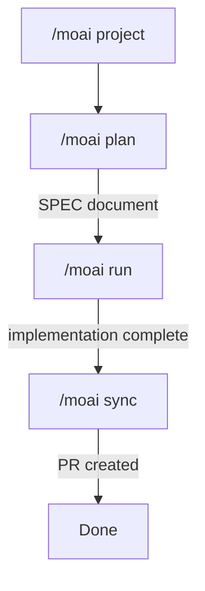
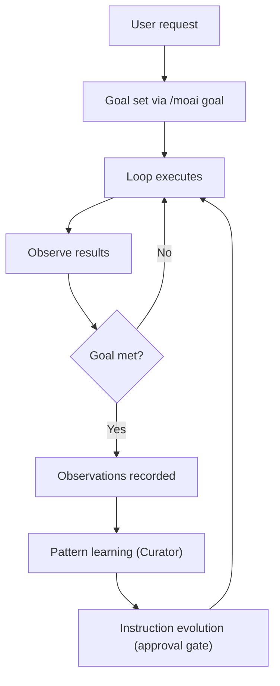
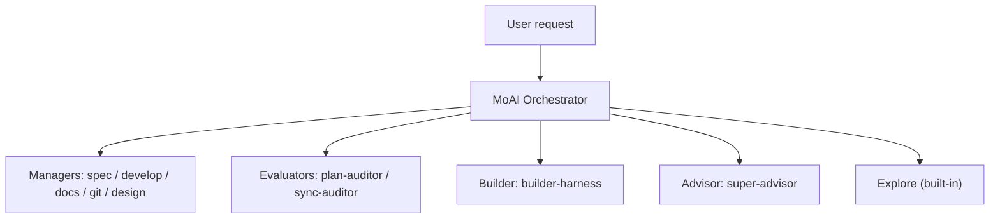
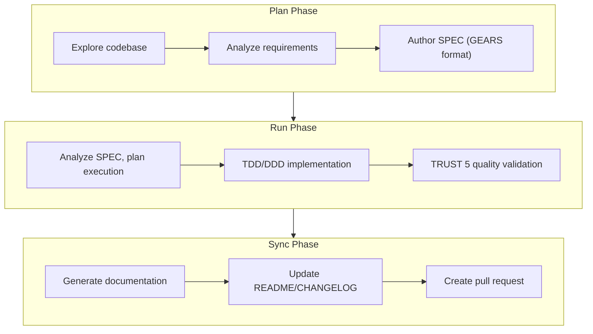
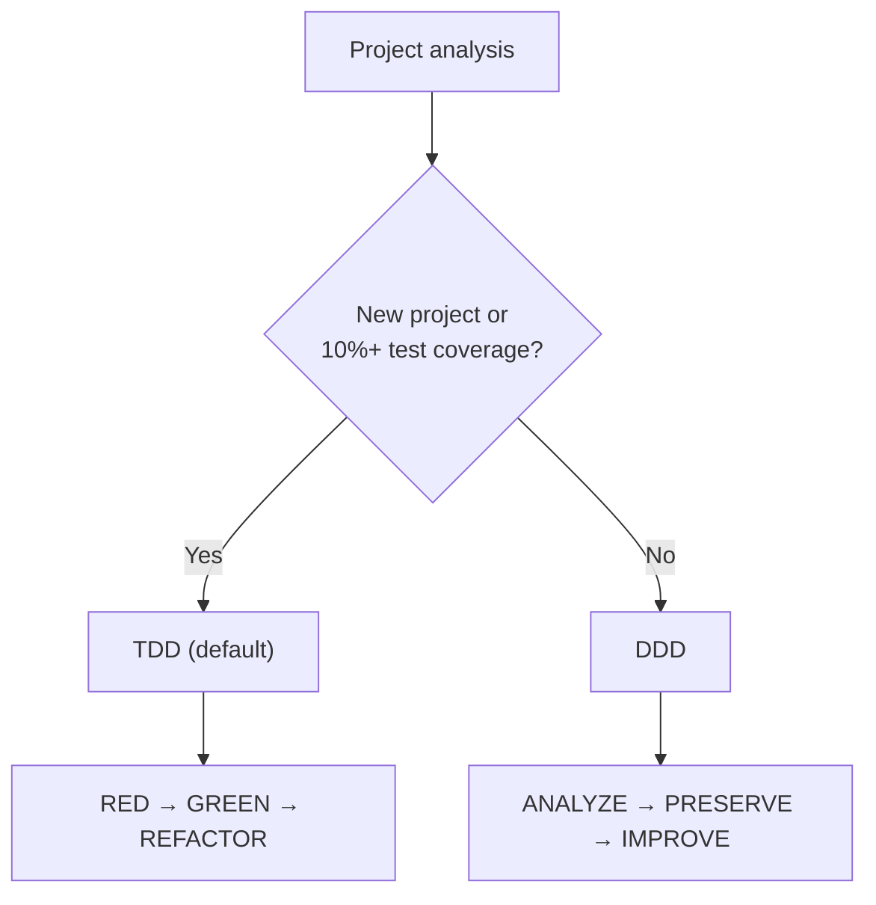

<p align="center">
  
</p>

<h1 align="center">MoAI-ADK</h1>

<p align="center">
  <strong>为 Tokenomics 而构建的 Agentic 开发套件</strong>
</p>

<p align="center">
  <a href="./README.md">English</a> ·
  <a href="./README.ko.md">한국어</a> ·
  <a href="./README.ja.md">日本語</a> ·
  中文
</p>

<p align="center">
  <a href="https://github.com/modu-ai/moai-adk/actions/workflows/ci.yml"></a>
  <a href="https://github.com/modu-ai/moai-adk/actions/workflows/codeql.yml"></a>
  <a href="https://codecov.io/gh/modu-ai/moai-adk"></a>
  <br>
  <a href="https://go.dev/"></a>
  <a href="https://github.com/modu-ai/moai-adk/releases"></a>
  <a href="./LICENSE"></a>
</p>

<p align="center">
  <a href="https://adk.mo.ai.kr"><strong>官方文档</strong></a> ·
  <a href="https://adk.mo.ai.kr/book">图书：Claude Code 实战 Agentic 编程</a> ·
  <a href="https://discord.gg/Z7E7Mdc5aN">Discord</a>
</p>

---

> **"Vibe Coding 的目的不是快速的生产力，而是代码质量。"**

MoAI-ADK (Agentic Development Kit) 是一套以 **Tokenomics** (Token 经济学) 为北极星的 Agentic 开发套件：用更少的 Token 达到同样的代码质量，用同样的 Token 达到更高的质量。模型选择、推理深度和上下文使用由系统管理——而非听天由命。

以 Go 编写的单一二进制文件。在 macOS、Linux、Windows 上零依赖即刻运行。

---

## Agentic 编程的账单

Agentic 编程起步很快，维持却很昂贵。当新鲜感褪去后，三种成本浮现出来：

- **Token 开销随会话增长而累积。** 单 Token 价格持续下降，但编码代理的总账单却依然上升——每多一个回合都要重新读取累积的上下文，长时间运行的工作把这份基础成本乘以数十个回合。Token 更便宜，账单却更高。
- **AI 生成的代码未经验证就交付。** 模型断言变更是正确的，却没有任何东西为它把关。测试、lint、覆盖率和安全检查沦为可有可无的事后补充，于是质量只是一种主张，而非每次合并都具备的属性。
- **长会话在上下文上限处夭折并丢失工作。** 当上下文窗口填满时，会话在任务中途停滞。若没有交接，进行中的工作及其背后的推理都会消失，下一个会话只能从头开始。

MoAI-ADK 把这三者都视为可用机制解决的工程问题，而非无法改变的现实。

---

## MoAI-ADK 如何解决

每个痛点都对应一个具体机制，并配有可衡量的证据。

| 痛点 | 机制 | 证据 |
|------|-----------|----------|
| 实现阶段的 Token 成本 | **CG 模式** —— Claude leader 负责规划与审计；GLM worker 承担大量实现工作 (`moai cg`) | 在实现密集型工作上 **降低 60-70% 成本** |
| 单个会话内的失控开销 | **Token 断路器 + 预算跟踪** —— 状态栏成本/CW% 计量表，在预算超支前优雅中止 | 在爆表之前而非之后停下；成本每回合可见 |
| 未经验证的质量 | **SPEC 三阶段生命周期 + TRUST 5 质量门 + 独立审计员** (plan-auditor、sync-auditor) | 每次合并都通过测试 / lint / 覆盖率门；作者绝不为自己的工作打分 |
| 上下文上限处的会话丢失 | **会话交接自动恢复** —— 在上下文窗口阈值处提供可直接粘贴的恢复消息 | `/clear` 之后一次粘贴即可恢复进度、已应用的教训与前置条件 |
| 任务用错模型 | **No-Haiku 三层模型策略** —— 按阶段与 SPEC 规模声明式配置模型 + effort | 需要之处交给 Opus 级判断，仅在安全之处使用廉价模型 |

这些数字由该工具所强制的同一套纪律赢得：从 v2.14.0 到 v3.0.0-rc12 (**80 天**)，**2,373 次提交** 构建了 **480+ 个 SPEC 文档**、**27** 个模板管理的技能，以及横跨 **16** 种支持语言的 **36** 个顶级 CLI 命令——每一次变更都经由下方的 plan → run → sync 流水线驱动。

---

## 单独使用 Claude Code vs Claude Code + MoAI-ADK

MoAI-ADK 是一套运行在 Claude Code **之上** 的 Harness——它并不取代 Claude Code。它所增加的，是围绕 Claude Code 交给你自行处理的那些部分构建的结构。

| 维度 | 单独使用 Claude Code | Claude Code + MoAI-ADK |
|-----------|-------------------|------------------------|
| 模型路由 | 手动——每次都要自己选模型 | 按阶段与 SPEC 规模声明式配置的 No-Haiku 三层策略 (max / medium / low) |
| 质量门 | 不强制 | 每次变更都通过 TRUST 5 (Tested / Readable / Unified / Secured / Trackable) |
| Spec / 需求 | 临时性提示 | SPEC 三阶段生命周期 (plan → run → sync)，配 GEARS 格式需求 + 验收标准 |
| 成本控制 | 无 | 预算跟踪 + Token 断路器 + CG 混合模式 (节省 60-70%) |
| 会话连续性 | `/clear` 后手动重新提示 | 自动交接——一次粘贴即可恢复进度与前置条件 |
| 学习 | 跨会话保持静态 | 自我进化的 Harness (观察 → 启发式 → 规则 → 自动更新)，始终置于批准门之后 |
| 多代理 | 手动、逐提示 | 11 代理目录，配 Analyze-First 路由与分离的规划/审计角色 |

---

## 5 分钟上手

`moai init` 完成的那一刻，你就拥有了一个可用的 Harness：Claude Code 终端里的状态栏成本/上下文计量表、接入工作流的 TRUST 5 质量门，以及在聊天中随时可用的完整 `/moai` 命令集。

### 1. 安装

#### macOS / Linux / WSL

```bash
curl -fsSL https://raw.githubusercontent.com/modu-ai/moai-adk/main/install.sh | bash
```

#### Windows (PowerShell 7.x+)

> **推荐**：为获得最佳体验，请使用 WSL 并执行上面的 Linux 安装命令。

```powershell
irm https://raw.githubusercontent.com/modu-ai/moai-adk/main/install.ps1 | iex
```

> 需要先安装 [Git for Windows](https://gitforwindows.org/)。

#### 从源码构建 (Go 1.26+)

```bash
git clone https://github.com/modu-ai/moai-adk.git
cd moai-adk && make build
```

> 预构建的二进制文件可在 [Releases](https://github.com/modu-ai/moai-adk/releases) 页面获取。

### 2. 初始化项目

```bash
moai init my-project
```

交互式向导会自动检测你的语言、框架和方法论，选择模型策略，并生成 Claude Code 集成文件。

### 3. 用 Claude Code 开始开发

```bash
claude        # 在项目内启动 Claude Code
```

```text
/moai plan "Add JWT login"      # 编写 SPEC
/moai run SPEC-AUTH-001         # TDD/DDD 实现
/moai sync SPEC-AUTH-001        # 同步文档 + 创建 PR
```

你也可以直接用自然语言提问——`/moai "fix the login bug"` 会经过意图分析 (Analyze-First 路由) 并落到正确的工作流，任何对话语言均可。


```mermaid
flowchart TD
    A["/moai project"] --> B["/moai plan"]
    B -->|"SPEC document"| C["/moai run"]
    C -->|"implementation complete"| D["/moai sync"]
    D -->|"PR created"| E["Done"]
```

### 4. Windows 注意事项：非 ASCII 用户名路径

如果你的 Windows 用户名包含非 ASCII 字符 (韩文、中文等)，可能会遇到由 Windows 8.3 短文件名转换引起的 `EINVAL` 错误。解决办法：

```powershell
# Option 1: point MoAI at an ASCII-only temp directory
$env:MOAI_TEMP_DIR="C:\temp"
New-Item -ItemType Directory -Path "C:\temp" -Force

# Option 2: disable 8.3 filename generation (requires admin)
fsutil 8dot3name set 1
```

第三个选项是创建一个仅含 ASCII 用户名的 Windows 账户。

---

## 系统要求

| 平台 | 支持的环境 | 备注 |
|----------|----------------------|-------|
| macOS | Terminal, iTerm2 | 完全支持 |
| Linux | Bash, Zsh | 完全支持 |
| Windows | **WSL (推荐)**, PowerShell 7.x+ | 不支持原生 cmd.exe |

**前置条件：**

- 所有平台必须安装 **Git**
- **Claude Code** —— MoAI-ADK 是面向 Claude Code 的 Harness
- **Windows 用户**：**必须** 安装 [Git for Windows](https://gitforwindows.org/) (含 Git Bash)；**不支持** 旧版 Windows PowerShell 5.x 和 cmd.exe
- **推荐**：`gh` CLI (PR 自动化) · `tmux` (CG 模式) · 你所用语言的 lint/测试工具链 (例如 `golangci-lint`)

---

## 工作原理

MoAI-ADK 建立在三个理念之上：**Tokenomics** (每个阶段使用恰当的模型与推理深度，从而最大化每美元的质量)、**Agentic Loop Engineering** (递归自我学习——循环积累观察，Harness 从中进化)，以及 **Agentic Harness** (你设计代理工作的环境，而不是直接编写代码)。本节其余部分讲述这些理念是如何构建的。

### 递归自我学习

代理通过两个动作从自身运行中学习：积累观察的循环，以及从中进化的 Harness。


```mermaid
flowchart TD
    A["User request"] --> B["Goal set via /moai goal"]
    B --> C["Loop executes"]
    C --> D["Observe results"]
    D --> E{"Goal met?"}
    E -->|"No"| C
    E -->|"Yes"| F["Observations recorded"]
    F --> G["Pattern learning (Curator)"]
    G --> H["Instruction evolution (approval gate)"]
    H --> C
```

### 自我进化的 Harness

```
loop runs → observations accumulate (Routing Ledger) → patterns learned (Curator) → instructions evolve (approval gate)
```

- **Routing Observation Ledger** (`internal/harness/routing/`) —— 以保护隐私的摘要形式记录路由决策与门禁证据
- **四层学习阶梯** (`internal/harness/learner.go`) —— 观察 (≥1) → 启发式 (≥3) → 规则 (≥5) → 自动更新 (≥10，需用户批准)；置信度下限 0.70
- **五层安全管线** —— observer (`internal/harness/observer.go`) → learner → applier (`internal/harness/applier.go`，快照优先的受限编辑) → 配置/标记更新器 → 用户批准门；每次应用都可通过 `moai harness rollback` 撤销
- 产物位于 `.moai/harness/` 下 (`usage-log.jsonl`、已学习的规则)

```bash
moai harness status      # learning state: observations, patterns, proposals
moai harness apply       # apply a proposal (passes the user approval gate)
moai harness rollback    # revert the last application
moai harness disable     # turn learning off
```

### /moai goal — 声明式 Agentic 循环

声明一个完成条件，会话就会持续工作，直到条件成立或达到回合上限 (默认 30)。在 `internal/goal/` 中实现为按会话的目标状态 (`.moai/state/goal/<session-id>.json`)，配备混合双层 Stop-hook 评估器——Tier 1 机械检查 (退出码、grep 计数、文件存在性、回合上限) 与 Tier 2 通过检查点进行的编排器自我评估。

```text
/moai goal "go test ./... exits 0 and every AC is recorded as PASS"
/moai goal status
/moai goal clear
```

### /moai loop vs /moai fix — 诊断式自我修复

`/moai loop` 是构建在 Ralph Engine (`internal/ralph/engine.go`) 之上的目标引擎预设：它并行运行 LSP 诊断 + AST-grep + linter 扫描，将发现从 Level 1 (可自动修复) 到 Level 4 (需要人工) 分类，并迭代直到队列清空——配备在同一错误重复出现时切换策略的收敛检测，以及作为安全停止的硬性迭代上限。

| 命令 | 目标 | 执行方式 | 使用时机 |
|---------|------|-----------|-------------|
| `/moai fix` | 单遍修复 | 一次 扫描-分类-修复-验证 | 明确的错误、快速修复 |
| `/moai loop` | 重复直到完成 | 诊断 → 分类 → 修复 → 验证 循环 | 复合错误、根因修复 |

### Analyze-First 路由

与语言无关的意图分析是 `/moai` 的默认路由。请求按语义分类——绝不依赖英文关键词匹配——因此任何对话语言都适用：

1. 意图分析 (与语言无关的分类)
2. 上下文充分性检查 (上下文不足时触发苏格拉底式访谈)
3. 执行计划组合 (技能 / 代理 / 动态工作流链)
4. 编排模式选择 (solo-sequential / parallel-subagents / dynamic-workflow)

### 会话交接自动恢复

在上下文窗口阈值处 (1M 上下文模型为 50%，200K 模型为 90%)，MoAI 发出一条可直接粘贴的恢复消息——包含进度状态、已应用的教训和可验证的前置条件——`/clear` 之后只需粘贴一次，下一个会话即可继续。

→ 阅读更多：[自我进化的 Harness](https://adk.mo.ai.kr/zh/advanced/self-evolving) · [决策记忆](https://adk.mo.ai.kr/zh/advanced/decision-memory)

### 11 代理目录

11 个保留代理：10 个 MoAI 自定义代理加上 Anthropic 内置的 `Explore`。

| 类别 | 代理 | 角色 |
|----------|-------|------|
| **Manager** | manager-spec | plan 阶段 SPEC 编写 |
| | manager-develop | run 阶段 TDD/DDD/autofix 实现 |
| | manager-docs | sync 阶段文档 |
| | manager-git | PR 创建与路由 |
| | manager-design | design 阶段协作 (Claude Design) |
| **Evaluator** | plan-auditor | 独立计划审计 (防止偏见) |
| | sync-auditor | 四维质量评分 (Functionality 40 · Security 25 · Craft 20 · Consistency 15) |
| **Builder** | builder-harness | 搭建项目专属的代理、技能、命令与钩子 |
| **Advisor** | super-advisor | 按需高推理咨询 (E1-E4 升级) |
| **Specialist** | e2e-tester | Web/移动端/桌面端 E2E 测试执行 (CLI 优先) |
| **Built-in** | Explore | 只读代码库探索 |

规划与审计在设计上是分离的——作者绝不为自己的工作打分。


```mermaid
flowchart TD
    U["User request"] --> M["MoAI Orchestrator"]
    M --> MG1["Managers: spec / develop / docs / git / design"]
    M --> EV["Evaluators: plan-auditor / sync-auditor"]
    M --> BD["Builder: builder-harness"]
    M --> AD["Advisor: super-advisor"]
    M --> EX["Explore (built-in)"]
```

### SPEC 三阶段生命周期

```
/moai plan → [plan-auditor audit] → Implementation Kickoff Approval (human gate) → /moai run → /moai sync → [sync-auditor scoring]
```

- 生命周期恰好三个阶段——**plan → run → sync**
- Tier S/M/L 规模分级决定验证深度与 PR 路由
- GEARS 格式需求加验收标准 (AC) —— 完成与否由证据判定，而非"看起来完成了"


```mermaid
flowchart TB
    subgraph Plan ["Plan Phase"]
        P1["Explore codebase"] --> P2["Analyze requirements"]
        P2 --> P3["Author SPEC (GEARS format)"]
    end

    subgraph Run ["Run Phase"]
        R1["Analyze SPEC, plan execution"] --> R2["TDD/DDD implementation"]
        R2 --> R3["TRUST 5 quality validation"]
    end

    subgraph Sync ["Sync Phase"]
        S1["Generate documentation"] --> S2["Update README/CHANGELOG"]
        S2 --> S3["Create pull request"]
    end

    Plan --> Run
    Run --> Sync
```

### 开发方法论 — TDD 与 DDD

MoAI-ADK 在 `moai init` 时根据项目状态选择方法论 (`--mode <ddd|tdd>`，默认：tdd)；之后可通过 `.moai/config/sections/quality.yaml` 中的 `development_mode` 更改。


```mermaid
flowchart TD
    A["Project analysis"] --> B{"New project or<br/>10%+ test coverage?"}
    B -->|"Yes"| C["TDD (default)"]
    B -->|"No"| D["DDD"]
    C --> F["RED → GREEN → REFACTOR"]
    D --> G["ANALYZE → PRESERVE → IMPROVE"]
```

| 方法论 | 循环 | 适用于 |
|-------------|-------|-----|
| **TDD** (默认) | RED (失败测试) → GREEN (最小化通过) → REFACTOR (在绿灯测试下提升质量) | 新项目与功能开发 |
| **DDD** | ANALYZE (依赖、领域边界) → PRESERVE (特征测试) → IMPROVE (在测试保护下增量变更) | 覆盖率 < 10% 的既有代码 |

### TRUST 5 质量门

每次代码变更都按五项标准校验：

| 标准 | 含义 | 校验 |
|-----------|---------|------------|
| **T**ested | 已测试 | 85%+ 覆盖率、特征测试、单元测试通过 |
| **R**eadable | 可读 | 命名清晰、风格一致、0 lint 错误 |
| **U**nified | 统一 | 格式一致、import 排序、遵循项目结构 |
| **S**ecured | 安全 | OWASP 合规、输入校验、0 安全警告 |
| **T**rackable | 可追踪 | 约定式提交、issue 引用、结构化日志 |

### Harness v4 Builder

```text
/moai harness "build me a harness for CLI template development"
```

自然语言请求经过领域/目标/约束提取和批准门，然后生成项目专属的代理、技能与命令。`/moai project` 生成项目文档 (product.md、structure.md、tech.md、codemaps/) 并同时自动配置一个 Harness。

### 编排原语

静态 Agent Teams 层已在 v3 退役。保留三种编排原语，按"计划由谁持有"选择：

| 原语 | 形态 | 适用场景 |
|-----------|-------|----------|
| 顺序子代理 | 编排器逐回合委派 | 编码密集型工作 |
| 并行扇出 | 单回合内多个只读 `Agent()` 调用 | 研究、评审、审计 |
| 动态工作流 | 脚本编排数十个代理；结果保存在脚本变量中 | 代码库扫描、大型迁移 |

原生 Claude Code teammate 运行时 (`moai cg` tmux pane) 不受此次退役影响。

### Ultracode —— xhigh 强度 + 自动编排

```text
/effort ultracode
```

`/effort ultracode` 将 `xhigh` 推理强度与自动动态工作流编排相结合 (Claude Code v2.1.154+)：对会话中的每个实质性任务，自动选择最优的编排原语，大规模扇出以脚本形式运行，其中间结果保存在脚本变量中，而非会话上下文里。适合用于大型并行扫描、审计与迁移 —— 整个代码库扫描或数百个独立任务 —— 这类场景中扇出本身就是主要成本。若只针对单个请求，则在请求前加上 `ultracode` 关键词，而无需切换整个会话。

→ 阅读更多：[动态工作流与 Ultracode](https://adk.mo.ai.kr/zh/advanced/ultracode-workflows)

### 决策记忆

MoAI-ADK 捕获你的 AskUserQuestion 决策并个性化未来的推荐：

- **三层记忆** —— Core (热门偏好) / Recall (近期会话) / Archival (28 天 TTL，软删除)
- **自适应放置** —— 问题在不确定性最高处触发 (p ≈ 0.5)；推荐遵循你被观察到的统计多数，而非系统默认值
- **衰减策略** —— 幂律权重 `(age+1)^(-0.5)`；使用某偏好会刷新它
- **控制** —— `moai preference list | decay-scan | toggle`；敏感的安全领域给出附带披露的中立推荐

→ 阅读更多：[Harness v4 Builder](https://adk.mo.ai.kr/zh/advanced/harness-v4-builder) · [Catalog 系统](https://adk.mo.ai.kr/zh/advanced/catalog-system)

---

## 工具参考

### `/moai` 斜杠子命令

> **重要区分**：`moai` (终端 CLI) ≠ `/moai` (Claude Code 斜杠命令)。前者是在 shell 中运行的 Go 二进制 (`moai init`、`moai doctor`)；后者是在 Claude Code 聊天中运行的 AI 工作流路由器 (`/moai plan`、`/moai run`)。它们是不同的工具。

→ 详情：[工作流命令](https://adk.mo.ai.kr/zh/workflow-commands) · [实用命令](https://adk.mo.ai.kr/zh/utility-commands)

16 个入口——15 个具名子命令加上自然语言默认入口：

| 子命令 | 角色 |
|------------|------|
| `plan` / `run` / `sync` | SPEC 三阶段流水线 |
| `goal` / `loop` / `fix` | 声明式目标循环 · 迭代修复 · 单遍修复 |
| `project` / `harness` | 项目文档 + Harness 生成 · Harness 生命周期 |
| `review` / `gate` / `clean` | 代码评审 · 提交前质量门 · 死代码清除 |
| `codemaps` / `feedback` | 架构文档 · GitHub issue 报告 |
| `e2e` | 多平台 E2E 测试 (Web/移动端/桌面端，CLI 优先) |
| *(自然语言)* | Analyze-First 路由进入自主的 plan → run → sync 流水线 |

### CLI 命令 (36 个顶级命令)

`moai` 二进制注册了 36 个顶级命令。其中 `goal`、`handoff`、`harness`、`init`、`launchers`、`loop`、`pr`、`session`、`spec`、`tool-policy`、`worktree` 等 **11 个命令在文档站点拥有独立的 CLI 参考页面**。

→ 详情：[CLI 参考](https://adk.mo.ai.kr/zh/cli-reference)

日常常用集合：

| 命令 | 描述 |
|---------|-------------|
| `moai init` | 交互式项目设置 (语言/框架/方法论自动检测) |
| `moai doctor` | 系统健康诊断与环境验证 |
| `moai status` | 项目状态摘要 (Git 分支、质量指标) |
| `moai update` | 更新到最新版本 (支持自动回滚) |
| `moai update -c` | 重新运行 init 向导以编辑配置 (不同步模板) |
| `moai cc` / `moai glm` / `moai cg` | 纯 Claude / 纯 GLM / Claude-leader + GLM-workers 混合会话 |
| `moai worktree <new\|list\|switch\|sync\|remove\|clean\|go>` | 面向并行 SPEC 开发的 Git worktree 管理 |
| `moai session <list\|register\|current>` | 多会话协调 |
| `moai spec <audit\|archive\|lint\|list\|new>` | SPEC 生命周期工具 |
| `moai goal <arm\|status\|clear>` | 目标引擎 CLI |
| `moai harness <status\|apply\|rollback\|disable>` | Harness 学习生命周期 |
| `moai handoff <save\|list>` | 会话交接记录 |
| `moai preference <list\|decay-scan\|toggle>` | 决策记忆管理 |
| `moai hook <event>` | Claude Code 钩子分发器 |
| `moai web` | Web 控制台 —— 设置 CRUD、SPEC 看板、代理配置 (en/ko/ja/zh) |
| `moai inventory` | 会话、worktree 与 Harness 的只读清单 (支持 `--json`) |
| `moai version` | 版本、提交哈希与构建日期 |

另有注册：`clean`、`codemaps`、`feedback`、`loop`、`lsp`、`ast-grep`、`agent`、`workflow`、`statusline`、`telemetry`、`constitution`、`state`、`tool-policy`、`migrate`、`profile`、`pr`、`github`、`research`。

### 钩子

→ 详情：[钩子指南](https://adk.mo.ai.kr/zh/advanced/hooks-guide) · [钩子参考](https://adk.mo.ai.kr/zh/advanced/hooks-reference)

所有钩子事件都遵循 Claude Code hooks 协议，通过 JSON stdin/stdout 通信：

- **27 种事件类型** —— SessionStart、PreToolUse、PostToolUse、SessionEnd、Stop、SubagentStop、PreCompact、PostCompact、TeammateIdle、TaskCompleted 等
- **4 种钩子类型** —— command (shell 脚本)、prompt (LLM 评估)、agent (子代理验证)、http (webhook 端点)
- 任务指标捕获到 `.moai/logs/task-metrics.jsonl`，用于会话分析与成本跟踪

### 状态栏

→ 详情：[状态栏](https://adk.mo.ai.kr/zh/advanced/statusline)

MoAI 在 Claude Code 终端底部渲染丰富的状态栏：模型层级/effort、MoAI 版本 (含更新标记)、Git 分支与变更状态、上下文窗口用量 (CW%)、缓存命中率，以及会话成本/Token。

CW% 带有两阶段 `/clear` 标记——在模型特定阈值处的软警告 (Opus 4.8、GLM-5.2[1m] 等 1M 上下文模型为 50%；200K 模型为 90%)，以及在绝对上限处的硬标记。Claude Code 会把 GLM-5.2 误报为 200K 模型 (上游 Issue #653)；MoAI 在 `internal/statusline/memory.go` 中将其修正为 1M，因此请信任 MoAI 状态栏的 CW%。

### 输出风格

→ 详情：[进阶主题](https://adk.mo.ai.kr/zh/advanced)

| 风格 | 特点 | 受众 |
|-------|-----------|----------|
| **MoAI** (expert) | 密集、简洁 | 有经验的开发者 |
| **MoAI-Easy** (basic) | 友好、解释性 —— 产品默认值 | 新用户 |
| **MoAI-Learn** (learn) | 苏格拉底式导师 | 学习者 |

通过 `/config` 切换 (存储在优先级最高的 `settings.local.json` 中)。输出风格在会话开始时只读取一次——更改在 `/clear` 或新会话后生效。

### @MX 标签系统

→ 详情：[@MX 标签](https://adk.mo.ai.kr/zh/advanced/mx-tags)

@MX 标签是内联代码注解，在 AI 代理之间传递上下文、不变量契约与危险区域。

```go
// @MX:ANCHOR: [AUTO] Hook registry dispatch - 5+ callers
// @MX:REASON: [AUTO] Central entry point for all hook events, changes have wide impact
func DispatchHook(event string, data []byte) error {
    // ...
}
```

| 标签 | 用途 | 触发条件 |
|-----|---------|---------|
| `@MX:ANCHOR` | 不变量契约 | fan_in >= 3 —— 变更影响面广 |
| `@MX:WARN` | 危险区域 | goroutine、复杂度 >= 15、全局状态变更 |
| `@MX:NOTE` | 上下文 | 魔法常量、缺失文档、业务规则 |
| `@MX:TODO` | 未完成的工作 | 缺失测试、未实现的功能 |

该系统优化信噪比：**只有 AI 必须最先注意到的代码才有标签。** 大多数代码不符合任何标准且不带标签——这是正常且有意为之的。阈值和每文件上限在 `.moai/config/sections/mx.yaml` 中配置；标签在 plan/run/sync 阶段内自动创建与维护。

### Worktree 隔离

→ 详情：[Git Worktree](https://adk.mo.ai.kr/zh/worktree)

`/moai plan --worktree` 为每个 SPEC 提供隔离的 git worktree 以进行并行开发；`moai worktree` 管理其生命周期 (`new --tmux` 会在 worktree 内自动创建 tmux 会话)。

### 支持的 16 种语言

→ 详情：[CLI 参考](https://adk.mo.ai.kr/zh/cli-reference)

go · python · typescript · javascript · rust · java · kotlin · csharp · ruby · php · elixir · cpp · scala · r · flutter · swift —— 通过项目标记检测，每种语言运行各自的标准 lint/格式化/测试工具链。未安装的工具会被优雅跳过。

---

## FAQ

### Q: 为什么不是每个函数都有 @MX 标签？

**这是正常的。** 标签只标记高扇入、复杂或危险的代码。每个项目中的大多数代码都不符合任何标签标准——未打标签的文件不是缺陷。

### Q: 状态栏里的版本指示器是什么意思？

```
🗿 v3.0.0-rc11 ⬆️ v3.0.0-rc12
```

第一个值是已安装的 MoAI-ADK 版本；箭头表示有可用更新 (运行 `moai update` 即可清除)。它与 Claude Code 自身的版本指示器是分开的。

## 贡献

欢迎贡献！详细指南见 [CONTRIBUTING.md](CONTRIBUTING.md)。

1. Fork 本仓库
2. 创建功能分支：`git checkout -b feature/my-feature`
3. 编写测试 (新代码用 TDD，既有代码用特征测试)
4. 确保测试、lint 与格式化通过：`make test` · `make lint` · `make fmt`
5. 使用约定式提交消息并打开 pull request

**代码质量要求**：85%+ 覆盖率 · 0 lint 错误 · 0 类型错误 · 约定式提交

### 社区

- [Discord](https://discord.gg/Z7E7Mdc5aN) —— 实时讨论与技巧
- [Issues](https://github.com/modu-ai/moai-adk/issues) —— 缺陷报告、功能请求 (也可以在 Claude Code 内使用 `/moai feedback`)

---

## 许可证

[Apache License 2.0](./LICENSE) —— 详见 LICENSE 文件。

## 文档导航

完整文档位于 [adk.mo.ai.kr](https://adk.mo.ai.kr)，按以下 12 个章节组织 (中文版路径)：

| 章节 | 简介 |
|------|------|
| [入门指南](https://adk.mo.ai.kr/zh/getting-started) | 介绍、安装、Windows 指南、初始化向导、快速开始、CLI、FAQ |
| [核心概念](https://adk.mo.ai.kr/zh/core-concepts) | MoAI-ADK 是什么、宪章、Harness 工程、SPEC 开发、DDD、TRUST 5 |
| [工作流命令](https://adk.mo.ai.kr/zh/workflow-commands) | plan、run、sync、project、harness、design |
| [实用命令](https://adk.mo.ai.kr/zh/utility-commands) | fix、loop、gate、review、clean、codemaps、e2e、feedback、goal、moai |
| [CLI 参考](https://adk.mo.ai.kr/zh/cli-reference) | status、profile、doctor、inventory、update、web 等 36 个顶级命令的逐条参考 |
| [Claude Code 指南](https://adk.mo.ai.kr/zh/claude-code) | 基础、上下文与记忆、Agentic 模式、可扩展性 |
| [多 LLM](https://adk.mo.ai.kr/zh/multi-llm) | CG 模式、模型策略 |
| [成本优化](https://adk.mo.ai.kr/zh/cost-optimization) | 提示缓存 (Prompt Caching) |
| [指南](https://adk.mo.ai.kr/zh/guides) | CI 自治、多 LLM CI |
| [Git Worktree](https://adk.mo.ai.kr/zh/worktree) | 指南、示例、FAQ |
| [进阶](https://adk.mo.ai.kr/zh/advanced) | Tokenomics、Token 预算、状态栏、settings.json、钩子、技能、Harness v4、自我进化、决策记忆、安全笔记、目录系统等 |
| [贡献](https://adk.mo.ai.kr/zh/contributing) | 参与贡献本项目 |

## 链接

- [官方文档](https://adk.mo.ai.kr)
- [图书：Claude Code 实战 Agentic 编程](https://adk.mo.ai.kr/book)
- [CHANGELOG](./CHANGELOG.md)
- [Claude Code](https://docs.anthropic.com/en/docs/claude-code)
- [Discord 社区](https://discord.gg/Z7E7Mdc5aN)
