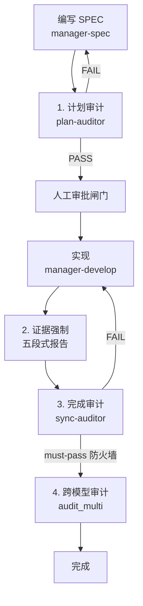

<p align="center">
  
</p>

<h1 align="center">MoAI-ADK</h1>

<p align="center">
  <strong>把写代码的智能体和评判这段代码的智能体分开的 Claude Code 框架</strong>
</p>

<p align="center">
  <a href="./README.md">English</a> ·
  <a href="./README.ko.md">한국어</a> ·
  <a href="./README.ja.md">日本語</a> ·
  中文
</p>

<p align="center">
  <a href="https://book.mo.ai.kr" target="_blank"><strong>官方书籍：用 Claude Code 做实战智能体编程</strong></a><br>
  MoAI-ADK 作者撰写的框架工程实践指南 — <a href="https://book.mo.ai.kr" target="_blank">book.mo.ai.kr</a>
</p>

<p align="center">
  <a href="https://github.com/modu-ai/moai-adk/actions/workflows/ci.yml"></a>
  <a href="https://github.com/modu-ai/moai-adk/actions/workflows/codeql.yml"></a>
  <a href="https://codecov.io/gh/modu-ai/moai-adk"></a>
  <br>
  <a href="https://go.dev/"></a>
  <a href="https://github.com/modu-ai/moai-adk/releases"></a>
  <a href="./LICENSE"></a>
</p>

<p align="center">
  <a href="https://adk.mo.ai.kr/zh"><strong>官方文档</strong></a> ·
  <a href="https://adk.mo.ai.kr/zh/getting-started">快速上手</a> ·
  <a href="https://adk.mo.ai.kr/book">书籍</a>
</p>

---

> **「让智能体写出代码，如今已不是难事。难的是——说这代码没问题的，究竟是谁。」**

---

## 智能体在给自己的答卷打分

把一个功能交给智能体，代码就会回来。测试也一并回来，末尾还附上一句「测试已通过」。

这句话 **是主张，不是事实。** 写代码的主体和判定这段代码没问题的主体是同一个。考生自己批改了自己的卷子，而没有任何人复核这份批改。

第二个问题叠加其上。语言模型在结构上 **偏向于附和。** MoAI-ADK 对所有审计智能体施加的规约，直接点名了这种偏差。

> 抵抗附和：RLHF 的训练梯度偏向迎合，因此凡是没有证据却想给出 PASS 的冲动，都应视为迎合信号，而非判定结果。
>
> — `.claude/rules/moai/core/agent-common-protocol.md`

自我评分与附和偏差一旦叠加，结果只有一个：**报告通过的次数，永远多于实际通过的次数。**

氛围编程（vibe coding）用速度掩盖了这个问题。成果出得够快，验证的单薄就不容易被看见。MoAI-ADK 选了相反的方向：让出一部分速度，**把判定的主体从编写的主体上剥离出来。**

## 把编写方与判定方分开

难以反驳的正是这一点。

> **某个智能体声称自己验证了自己的工作，若没有另一个主体去验证这项声称，那它就不是验证。**

这是结构问题，不是模型能力问题。所以「我们的模型很诚实」并不能作为回答。换用更强的模型，自我评分会更准确，但自我评分这一事实不会改变。只要判定主体不分离，问题就一直在。

MoAI-ADK 为编写 SPEC、实现、审计计划、审计完成分别设置了不同的智能体。审计方不读实现方的报告，而是自己执行命令、亲眼看输出。

## 四重交叉验证

一项工作要被认定为完成，必须通过四道关卡，每一道的判定主体都不相同。


```mermaid
flowchart TD
    A[编写 SPEC<br/>manager-spec] --> B[1. 计划审计<br/>plan-auditor]
    B -->|PASS| C[人工审批闸门]
    C --> D[实现<br/>manager-develop]
    D --> E[2. 证据强制<br/>五段式报告]
    E --> F[3. 完成审计<br/>sync-auditor]
    F -->|must-pass 防火墙| G[4. 跨模型审计<br/>audit_multi]
    G --> H[完成]
    B -->|FAIL| A
    F -->|FAIL| D
```

### 1. 计划审计 —— 在写下第一行之前

`plan-auditor` 以对抗性视角审查 SPEC 文档。门槛随规模变化：Tier S 为 0.75，M 为 0.80，L 为 0.85。

关键在于评分方式。

- **各维度独立评分。** 某一领域的 PASS 不能抵消另一领域的 FAIL。
- **没有证据的 PASS 自动降级。** 拿不出证据的 PASS 判定会降为 UNVERIFIED，而在 must-pass 标准中按 FAIL 计。
- **分数下滑就停下。** 若复审得分低于上一轮，智能体给出 STOP，转而请人类收窄范围，而不是无限迭代。

在计划阶段拦下的缺陷，远比在实现阶段拦下同一缺陷便宜。

### 2. 证据强制 —— 逼你写下没看过的部分

每份验证报告都要填满五个部分。

| 部分 | 内容 |
|---|---|
| Claim | 主张的内容 |
| Evidence | 实际执行的命令，以及 **其原始输出**（不接受摘要） |
| Baseline-attribution | 对照什么测量的 |
| **Gaps** | **未**验证的部分 |
| Residual-risk | 即便有证据仍可能出错之处 |

第四部分是这套格式的支点。逼人把未观察到的写下来，未经检验的项目就无法伪装成已通过而悄悄溜过去。

同一规约在反方向同样成立。声称缺陷 **存在** 也必须用工具确认。从文本模式推断出的缺陷是假设，不是发现。

详见：[验证主张完整性](https://adk.mo.ai.kr/zh/core-concepts/verification-claim-integrity)

### 3. 完成审计 —— 平均值盖不住短板

`sync-auditor` 从四个维度为实现结果打分：Functionality 40%、Security 25%、Craft 20%、Consistency 15%。

有两点让这道关卡与众不同。

- **must-pass 防火墙。** Functionality 与 Security 必须各自独立达标。任一不达标，无论其他分数多高，整体判 FAIL。
- **调和平均而非算术平均。** 一个维度偏低，会把整体拉下来，强项无法掩盖弱项。

审计方不采信实现方的任何说法。它自己跑测试，再把输出与 SPEC 的验收标准表逐项对照。

### 4. 跨模型审计 —— 去问另一家的模型

如果同一系列的模型共享同一种偏差，那么在这个系列内部再怎么拆分，也过滤不掉它。`audit_multi` 让 Claude、codex、GLM **各自独立** 作出判定，再收敛结果；判定分歧时，把分歧本身摆到台面上，而不是取平均抹平。

某个后端不可用也不会中断审计。无响应的后端只返回 `inconclusive`，并不构成错误。

### 撑起这四重的基础

交叉验证不是免费的。判定主体越多，消耗的 token 越多，会话也越长。以下是让这份成本可以承受的底座。

| | |
|---|---|
| **成本管理** | 按角色路由模型与推理强度，并管理上下文预算，使审计层数增加时成本不呈线性上升 |
| **16 种语言** | Go、Python、TypeScript、Rust、Java 等 16 种语言被平等识别，各自以本语言的标准 lint 与 test 工具接受审计 |
| **会话连续性** | 触及上下文上限时，生成可直接粘贴的续接消息，让下一个会话从同一处接手 |
| **并行安全** | 每个智能体在隔离的 git worktree 中作业，同时运行的判定主体不会覆盖彼此的工作树 |

## 智能体之间如何通信

交叉验证要真正运转，判定主体就必须活在不同的上下文里。处在同一段对话中，后面的判断会被前面的主张染色。

看板模式把每个阶段拉起为 **独立会话**。主导会话在六个栏（`backlog → plan → run → review → sync → done`）之间移动卡片，并通过消息向负责各栏的伴随会话下达指令。

主导会话守着一条规约。

> **主导方不凭报告移动卡片，而是自己读证据再移动。**

伴随会话回一句「做完了」并不足以推动卡片。主导方会打开该阶段留下的证据文件；若文件缺失、无法读取或已过期，卡片就留在原处，并说明理由。没有失败信号，并不等于通过的证据。

在更大规模的工作中，`manager-kanban` 还会针对逐条验收标准的 PASS 主张，发起由其他智能体执行的交叉验证。

而且任何分数都越不过人。实现启动前的审批闸门，不因审计得分多高而被绕开。

详见：[看板模式](https://adk.mo.ai.kr/zh/advanced/kanban-mode)

## 有什么不同

| | 单用 Claude Code | 一般框架 | MoAI-ADK |
|---|---|---|---|
| 生成代码 | 可以 | 可以 | 可以 |
| 由谁判定质量 | 作者本人 | 作者本人 | **分离的审计方** |
| 计划阶段审查 | 无 | 大多没有 | 按 Tier 设阈值 |
| 证据要求 | 无 | 视约定而异 | 五段式，Gaps 必填 |
| 未验证的 PASS | 通过 | 通过 | **降级为 FAIL** |
| 维度之间的抵消 | 不适用 | 被平均掩盖 | **must-pass 防火墙** |
| 由另一系列模型复核 | 无 | 罕见 | claude + codex + GLM 收敛 |
| 判定主体的上下文 | 共享 | 大多共享 | 按会话与 worktree 分离 |

MoAI-ADK 不替代 Claude Code。它用结构补上 Claude Code 留给使用者的那部分——分离判定主体、约定证据、设置审计闸门、跨会话延续状态。它是一个用 Go 写成的单一二进制文件，在 macOS、Linux 与 Windows 上无需额外依赖即可运行。

## 快速上手

### 安装

```bash
# macOS / Linux / WSL
curl -fsSL https://adk.mo.ai.kr/install.sh | bash
```

```powershell
# Windows (PowerShell 7.x+)
irm https://adk.mo.ai.kr/install.ps1 | iex
```

```bash
# 从源码构建 (Go 1.26+)
git clone https://github.com/modu-ai/moai-adk.git
cd moai-adk && make build
```

### 第一个项目

```bash
moai init my-project
```

交互式向导会自动识别语言、框架与方法论，选定模型策略，并生成 Claude Code 集成文件。

### 第一条工作流

```bash
claude        # 在项目内启动 Claude Code
```

```text
/moai plan "添加 JWT 登录"      # 编写 SPEC → 计划审计
/moai run SPEC-AUTH-001         # TDD/DDD 实现 → 记录证据
/moai sync SPEC-AUTH-001        # 完成审计 → 同步文档 → PR
```

自然语言同样可用。写下 `/moai "修一下登录的 bug"`，系统会解析意图并路由到合适的工作流。

### 环境要求

- **Git** —— 所有平台均为必需
- **Claude Code** —— MoAI-ADK 是包裹它的框架
- 推荐：`gh` CLI（PR 自动化）· `tmux`（CG 模式）· 项目语言的 lint 与 test 工具

Windows 上 **推荐使用 WSL**。PowerShell 7.x 及以上受支持，原生 `cmd.exe` 不受支持。

详见：[安装指南](https://adk.mo.ai.kr/zh/getting-started) · [快速开始](https://adk.mo.ai.kr/zh/getting-started/quickstart)

## 文档

完整文档位于 [adk.mo.ai.kr](https://adk.mo.ai.kr/zh)。

| 你在找什么 | 文档 |
|---|---|
| MoAI-ADK 是什么，为何这样设计 | [核心概念](https://adk.mo.ai.kr/zh/core-concepts) |
| 从安装到第一份 SPEC | [快速上手](https://adk.mo.ai.kr/zh/getting-started) |
| `plan` · `run` · `sync` 三段式流水线 | [工作流命令](https://adk.mo.ai.kr/zh/workflow-commands) |
| `review` · `gate` · `fix` 等其余命令 | [实用命令](https://adk.mo.ai.kr/zh/utility-commands) |
| 全部 CLI 参数与选项 | [CLI 参考](https://adk.mo.ai.kr/zh/cli-reference) |
| 并行作业的 worktree 隔离 | [Worktree](https://adk.mo.ai.kr/zh/worktree) |
| 降低 token 成本的方法 | [成本优化](https://adk.mo.ai.kr/zh/cost-optimization) |
| 同时使用 Claude 与 GLM | [多 LLM](https://adk.mo.ai.kr/zh/multi-llm) |
| 定制智能体、钩子与配置 | [进阶](https://adk.mo.ai.kr/zh/advanced) |
| 按实战场景分的示例 | [指南](https://adk.mo.ai.kr/zh/guides) |
| Claude Code 自身的功能 | [Claude Code](https://adk.mo.ai.kr/zh/claude-code) |
| 各版本的变更内容 | [变更日志](https://adk.mo.ai.kr/zh/changelog) |
| 外部资料与链接汇总 | [资源](https://adk.mo.ai.kr/zh/resources) |

## 一起打造

欢迎提 Issue 与 PR。贡献方式整理在[贡献指南](https://adk.mo.ai.kr/zh/contributing)中。

- **报告缺陷、提议功能** —— [GitHub Issues](https://github.com/modu-ai/moai-adk/issues)
- **在会话中直接反馈** —— `/moai feedback`
- **许可证** —— [Apache-2.0](./LICENSE)

## Star History

<a href="https://star-history.com/#modu-ai/moai-adk&Date">
  
</a>
