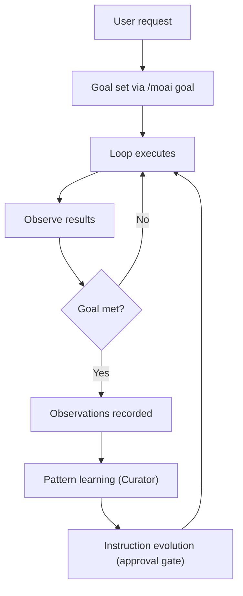
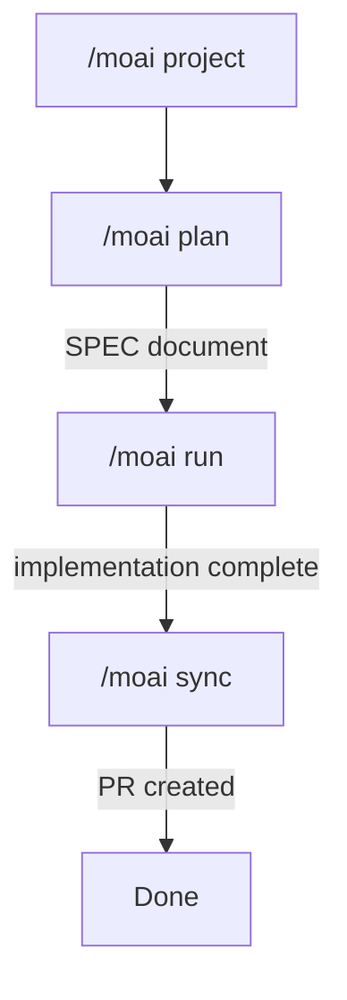
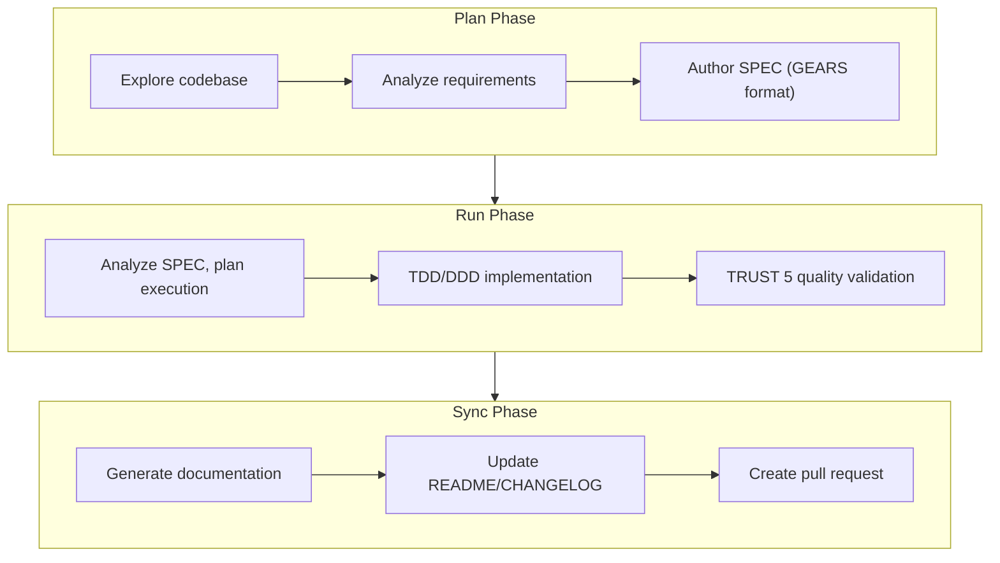
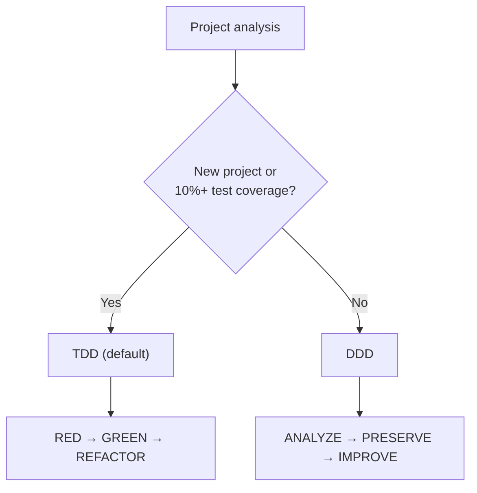
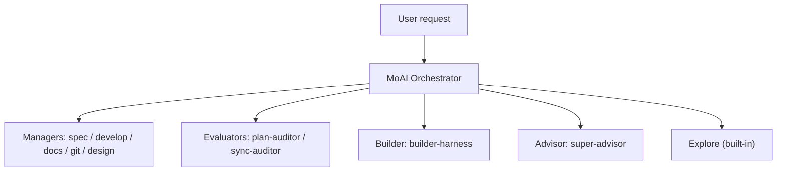

<p align="center">
  
</p>

<h1 align="center">MoAI-ADK</h1>

<p align="center">
  <strong>为 Tokenomics 而设计的 Agentic 开发套件</strong>
</p>

<p align="center">
  <a href="./README.md">English</a> ·
  <a href="./README.ko.md">한국어</a> ·
  <a href="./README.ja.md">日本語</a> ·
  中文
</p>

<p align="center">
  <a href="https://github.com/modu-ai/moai-adk/actions/workflows/ci.yml"></a>
  <a href="https://github.com/modu-ai/moai-adk/actions/workflows/codeql.yml"></a>
  <a href="https://codecov.io/gh/modu-ai/moai-adk"></a>
  <br>
  <a href="https://go.dev/"></a>
  <a href="https://github.com/modu-ai/moai-adk/releases"></a>
  <a href="./LICENSE"></a>
</p>

<p align="center">
  <a href="https://adk.mo.ai.kr"><strong>官方文档</strong></a> ·
  <a href="https://adk.mo.ai.kr/book">图书：Claude Code 实战 Agentic 编程</a> ·
  <a href="https://discord.gg/Z7E7Mdc5aN">Discord</a>
</p>

---

> **"Vibe Coding 的目的不是快速的生产力，而是代码质量。"**

---

## 什么是 MoAI-ADK

MoAI-ADK（Agentic Development Kit）是一套叠加在 Claude Code **之上** 的 Harness。Harness 是从外部包裹模型的系统。模型是按 Token 计费的随机工作者，它既不记得预算，也不记得质量标准，更不记得上一个会话在哪里中断。成本上限、通过的测试套件、跨越 `/clear` 的连续性——这些属性无法靠每回合重新提示来植入，必须由外部的系统来强制。那个系统就是 Harness。

所有设计都指向 Tokenomics（Token 经济学）——用更少的 Token 达到同样的质量，用同样的 Token 换取更高的质量。用哪个模型、推理到多深、如何消耗上下文，都不再听天由命，而是由系统决定。

它不取代 Claude Code。它只是把 Claude Code 留给用户自行处理的那些部分——模型路由、质量门、成本控制、会话连续性——用结构包裹起来。以 Go 编写的单一二进制文件，在 macOS、Linux、Windows 上零依赖即刻运行。

---

## 为什么选择 MoAI-ADK

仅靠 Claude Code 也能写出代码。问题在于，这些代码能否每次都以相同的质量、可预测的成本产出。采用这套 Harness 的理由可以压缩为三条论据。

### 论据 1 —— 质量来自结构，而非提示词

靠提示词植入的纪律，在上下文被压缩的那一刻就会消失。"测试先行"、"覆盖率 85%"、"作者与审查者分离"这类标准无法每个回合重复宣讲——即使宣讲了，模型也无法向自己证明它遵守了。MoAI-ADK 把这些标准强制为流水线：所有变更都要通过 SPEC 三阶段（plan → run → sync），TRUST 5 质量门（含 85%+ 覆盖率）要求通过证据，撰写计划的代理与审计的代理相互分离，杜绝自己给自己打分。判定完成的不是"看起来做完了"，而是测试输出和验收标准。

### 论据 2 —— 成本由分配决定，而非模型单价

正如下方 [从 2.0 到 3.0](#从-20-到-30) 一节的实测所示，即使在同一 Claude 系列内部，每个已解决任务的成本也相差两倍以上——把较弱的模型以最高 effort 运行反而更贵、得分更低。这种分配无法靠人在每个任务上手动调校。MoAI-ADK 通过 Tier×Phase 矩阵声明式地分配模型与推理深度，把验证日志重定向到磁盘为上下文瘦身，并用 Token Circuit Breaker 守住预算。成本控制从个人习惯变成系统属性。

### 论据 3 —— 会话会中断，工作却在延续

上下文窗口是有限的，`/clear` 不可避免。在裸的 Claude Code 中，每逢这样的边界，进度、经验、前置条件都会蒸发。MoAI-ADK 在会话边界自动生成交接（handoff），粘贴一次即可让下一个会话无缝续接；循环积累的观察沿学习阶梯晋升为 Harness 指令。工作的单位从会话变成项目。

### 两个预期中的反驳

- **"把提示词写好不就行了？"** —— 提示词是请求，Harness 是强制。能跨越上下文压缩、会话边界、模型切换而存活的规则，只有以文件和质量门形式存在的规则。
- **"引入开销会不会很大？"** —— 只是一个零依赖的 Go 单一二进制。`moai init` 完成的那一刻起，状态栏、质量门、`/moai` 命令即刻可用。它包裹而非取代你现有的 Claude Code 工作流，原有用法原样保留。

一句话总结——**Claude Code 负责写代码，MoAI-ADK 让这些代码值得信赖、成本可预测。**

---

## 从 2.0 到 3.0

要用 v3 的理由不是功能变多了，而是系统接管了成本与学习这两个轴。如果说 v2 是把一个个操纵杆（缓存、GLM）递到你手上的工具，那么 v3 则把这些操纵杆绑进一个闭环，让它们成为系统属性。

### 问题 —— Token 单价降了，成本却涨了

Token 单价一路下探，可 Agentic 工作负载的实际支出反而上升。代理为解一道题要跑几十到几百步，每一步都在烧 Token。在按量计费下这直接就是账单，在订阅制下则蚕食全模型共享的周配额。于是"用哪个模型、推理到多深"这条 Token 纪律成了竞争轴。单价下降并不能解决这个问题。

### 证据 —— 即便在同一个生态里，成本也能差出两倍多

同为 Claude 系、同以最高 effort（max）运行，解同一道题的成本也会拉得很开。下面是内部报告整理的 DeepSWE 排行榜（113 tasks）实测数字。

| 模型 [max] | Pass@1 | 每任务成本 | $/已解决任务 | Token/已解决任务 | 步数 |
|---|---|---|---|---|---|
| claude-opus-4.8 | 59% | $13.22 | **$22.4** | 229k | 120 |
| claude-fable-5 | 70% | $21.63 | $30.9 | 170k | 88 |
| claude-sonnet-5 | 54% | $26.40 | $48.9 | 396k | 268 |

关键在于：sonnet-5 max 比 opus-4.8 max **更贵（每任务 $26.40 对 $13.22），分数却更低（54% 对 59%）**。原因是 268 步、214k 输出 Token——在最高 effort 下重试循环失控暴涨。"把弱模型往死里跑就便宜"这条通常的直觉并不成立，反而多跑了三倍步数、更快烧光配额。也就是说，成本不是由模型单价、而是由 **把合适的模型与推理深度配给合适的任务** 决定的。

### v3 的答案 —— 把成本变成系统属性

v3 不把这项配给交给临场运气，而是用四层 Tokenomics 栈把它闭合。

1. **计量** —— 以 SPEC 为单位做 Token 会计。状态栏每回合暴露成本、CW% 和缓存命中率，并把验证实测留存到 `.moai/state/verify/`。
2. **路由** —— 用 Tier（S/M/L）×Phase 矩阵声明式地配给模型与 effort，再叠上区分按量计费与订阅制的 plan_type 画像。上面的实测就直接成了策略——推理交给上位模型，执行以 high 为上限，机械作业用最低价。
3. **验证经济** —— verify-diet。验证日志原文重定向到磁盘，上下文里只留退出码和尾部摘要。
4. **预算防御** —— Token Circuit Breaker 在预算超支之前优雅停下并生成交接。

v2 也有缓存和 GLM 这些操纵杆。v3 则把它们绑成计量 → 路由 → 瘦身 → 防御，让成本不再是"配一次就完事"的设置，而是每回合都维持的系统属性。

### 第二个轴 —— 越用越好

v2 的 Harness 会话一结束就停在原地。v3 则让循环（`/moai goal`、`/moai loop`）积累观察，再由这些观察去打磨技能与代理指令。四层学习阶梯（观察 ≥1 → 启发式 ≥3 → 规则 ≥5 → 自动更新 ≥10，必须经用户批准、置信度下限 0.70）实现于 `internal/harness/learner.go` 并在运行，所有应用都可通过 `moai harness rollback` 撤销。把观察提升为规则的 Curator 管线仍在打磨中，但学习阶梯引擎本身已经上线。详细行为见下方 [递归自我学习](#递归自我学习--harness-进化) 一节。

### 那么，究竟改变了什么（证据）

下表右列的所有条目，都是在 v2.14.0 → v3.0.0 区间新加入的。

| 轴 | v2.x | v3.x |
|-----|-------|-------|
| 模型策略 | 不分阶段与规模的手动选择 | **No-Haiku 三层模型策略**（max / medium / low）+ 资费感知的 plan_type 画像 |
| 成本控制 | 事后确认 | **Token Circuit Breaker** —— 预算超支前优雅中止 + 生成交接 |
| 学习 · 循环 | 跨会话静态 | **自我进化的 Harness**（Routing Ledger + Curator）· **决策记忆** · **`/moai goal` 条件声明式循环** |
| 代理组成 | 多代理、角色混杂 | **11 代理目录** —— 规划/审计角色分离，以更少的代理换更省的委派 |
| 多 LLM | 单一后端 | **CG 模式**（Claude leader + GLM worker）—— 实现工作省 60-70% |
| 终端 UX | 早期 CLI | **TUX v3** —— 基于 Charm 的向导、变更预览、实时进度显示 |

### 造就 v3 的 8 个主题

把 v2.14.0 之后累积的提交按主题归类，可分为八支。下列提交数以提交标题为准统计，展示的是相对规模而非绝对量，是一种信号。

| 主题 | 证据（SPEC 系列 / 关键词提交数） | v3 产出 |
|------|-----------------------------------|-----------|
| Harness 深化 | `harness` 283 · HARNESS-EVOLVE 34 · HARNESS-V4 18 | 自我进化 Harness（Ledger+Curator）、Harness v4 Builder |
| Web Console | WEB-CONSOLE 134 · WEBCONF-SIMPLIFY 21 · `web` 188 | `moai web` 6 标签设置控制台 + 4 色层级徽章 |
| 代理目录 · 团队退役 | `agent` 182 · AGENT-TEAM-REBUILD 15 · AGENT-TEAM-RETIRE 13 | 目录整备 → 11 个，静态 Agent Teams 退役 |
| 会话连续性 · 自动化循环 | `handoff` 91 · `session` 83 · `loop` 52 · `goal` 38 | auto-resume 交接、`/moai goal` 引擎、Ralph 循环、决策记忆 |
| CLI/终端 UX | CLI-TUX-V3 56 · `tux` 56 | Charm（huh v2/bubbletea v2）向导、变更预览 |
| Tokenomics | `glm` 49 · `token` 44 · `cache` 28 · model-policy 21 · WORKFLOW-CACHE-OPT 12 | No-Haiku 三层、plan_type、CG/GLM、Circuit Breaker、提示缓存 |
| 文档 · i18n 重构 | DOCS-V3-REBUILD 49 · `docs-site` 38 · HUMANIZE 19 | geekdoc 迁移、4-locale、文档 humanize |
| 安全 · 隔离 · 中立性 | SEC-HARDEN 41 · TEMPLATE-ISOLATION 23 · `permission` 16 | 8 层设置合并、OS 沙箱、模板中立性守卫 |

### 用数字看 v3

从 v2.14.0（2026-04-24）到 v3.0.0（2026-07-16）的 **80 天** 里，累积了 **2,373 次提交**（**feat 816** · fix 252 · docs 581）。结果如下。

- 基于 **500 个** SPEC 文档的开发（`.moai/specs/`）
- **moai-\* 27 个** 模板管理技能 · **36 个** 顶级 CLI 命令 · **16 个** `/moai` 子命令（+ 自然语言默认入口）
- **11 代理** 目录（MoAI 自定义 10 + 内置 Explore）· **16 种** 支持语言

所有这些变更无一例外都通过了 plan → run → sync 流水线。

---

## MoAI 3.0 的核心价值与能力

驱动 MoAI 3.0 的价值有三。每项价值之下，都附上了实现它的能力。命令与表格在 [参考](#参考) 中详述。

### Tokenomics —— 让系统管理成本

成本不由模型价格、而由 Token 的运用方式决定。为每个任务配给合适的模型与推理深度，为上下文瘦身，让系统守住预算。

- **No-Haiku 三层模型策略** —— 按阶段与 SPEC 规模（Tier S/M/L）声明式地配给模型与推理努力（effort）。策略只有三种——max / medium / low。
- **plan_type 画像** —— 资费感知。为 API 按量计费与订阅资费套用不同的 Tier×Phase 矩阵，并给 GLM 后端叠加 effort 覆盖层。
- **CG 模式** —— `moai cg` 是 Claude leader 负责规划与审计、GLM worker 承担大量实现的混合模式。在实现密集型工作上 **降低 60-70% 成本**。
- **Token Circuit Breaker + 状态栏** —— 状态栏每回合显示成本、CW%（上下文窗口使用率）与缓存命中率，并在预算超支前安全中止。CW% 旁的两阶段 `/clear` 标记会在各模型的阈值（1M 上下文模型 50%，200K 模型 90%）处出现。Claude Code 会把 GLM-5.2 误报为 200K 模型（上游 Issue #653），MoAI 在 `internal/statusline/memory.go` 中将其修正为 1M。
- **上下文瘦身 + 提示缓存** —— 把常驻加载的指令降到最低，验证日志重定向到磁盘、上下文里只留摘要。缓存命中率暴露在状态栏，瘦身效果即刻可测。

> → 详情：[模型策略](https://adk.mo.ai.kr/zh/multi-llm/model-policy) · [No-Haiku 三层](https://adk.mo.ai.kr/zh/advanced/no-haiku-3tier) · [plan_type 画像](https://adk.mo.ai.kr/zh/advanced/plan-type-profiles) · [CG 模式](https://adk.mo.ai.kr/zh/multi-llm/cg-mode) · [状态栏](https://adk.mo.ai.kr/zh/advanced/statusline) · [Token 预算](https://adk.mo.ai.kr/zh/advanced/token-budget) · [提示缓存](https://adk.mo.ai.kr/zh/cost-optimization/prompt-caching)

### 递归自我学习 —— Harness 进化

代理在自己工作的同时学习。循环积累观察，Harness 从这些观察中进化。


```mermaid
flowchart TD
    A["User request"] --> B["Goal set via /moai goal"]
    B --> C["Loop executes"]
    C --> D["Observe results"]
    D --> E{"Goal met?"}
    E -->|"No"| C
    E -->|"Yes"| F["Observations recorded"]
    F --> G["Pattern learning (Curator)"]
    G --> H["Instruction evolution (approval gate)"]
    H --> C
```

- **Routing Observation Ledger** —— 以保护隐私的摘要形式记录路由决策与门禁证据。
- **四层学习阶梯** —— 观察（≥1）→ 启发式（≥3）→ 规则（≥5）→ 自动更新（≥10，必须经用户批准）；置信度下限 0.70。
- **Curator + 五层安全管线** —— 快照优先的受限编辑。每次应用都可通过 `moai harness rollback` 撤销。
- **`/moai goal`** —— 只需声明一个完成条件，会话就会自行工作，直到条件成立或触及回合上限（默认 30）。实现位于 `internal/goal/`，状态存于 `.moai/state/goal/<session-id>.json`，判定由双层 Stop-hook 评估器负责（Tier 1 机械检查 · Tier 2 编排器自我评估）。
- **会话交接 auto-resume** —— 在上下文窗口阈值（1M 模型 50% / 200K 模型 90%）处，一次粘贴就能让下一个会话接上。进度状态、教训、前置条件都会自动附带。
- **决策记忆** —— 三层（Core / Recall / Archival 28 天 TTL）。问题在不确定性最高处（p ≈ 0.5）触发，推荐遵循被观察到的统计多数，而非系统默认值。衰减策略采用幂律权重 `(age+1)^(-0.5)`，控制通过 `moai preference list | decay-scan | toggle` 进行。

```bash
moai harness status      # learning state: observations, patterns, proposals
moai harness apply       # apply a proposal (passes the user approval gate)
moai harness rollback    # revert the last application
moai harness disable     # turn learning off
```

```text
/moai goal "go test ./... exits 0 and every AC is recorded as PASS"
/moai goal status
/moai goal clear
```

> → 详情：[自我进化的 Harness](https://adk.mo.ai.kr/zh/advanced/self-evolving) · [决策记忆](https://adk.mo.ai.kr/zh/advanced/decision-memory) · [目录系统](https://adk.mo.ai.kr/zh/advanced/catalog-system)

### Agentic Harness —— 设计代理工作的环境

不去直接编写代码，而是设计一个让代理能好好工作的环境。

- **SPEC 三阶段生命周期** —— plan → run → sync。Tier S/M/L 规模分级决定验证深度与 PR 路由，GEARS 格式需求 + 验收标准以证据判定完成。
- **TRUST 5 质量门** —— Tested（85%+ 覆盖率）· Readable · Unified · Secured · Trackable，适用于每次变更。
- **11 代理目录** —— MoAI 自定义 10 个 + 内置 Explore。从设计阶段就把规划与审计分离，让编写者不给自己的工作打分。
- **Harness v4 Builder** —— 自然语言请求 → 领域/目标/约束提取 → 批准门 → 生成项目专属的代理、技能、命令。
- **@MX 标签** —— 在 AI 代理之间传递上下文、不变量契约与危险区域的内联代码注解。
- **worktree 隔离** —— 用 `/moai plan --worktree` 为每个 SPEC 附上一个用于并行开发的隔离 worktree。
- **Web Console** —— `moai web` 提供在浏览器里编辑设置的 6 标签控制台 + 子代理 4 色层级徽章（en/ko/ja/zh）。
- **OS 沙箱 + 8 层设置合并** —— 用 OS 级沙箱（Bubblewrap/Seatbelt/Docker）隔离工具执行，配置以 8 层优先级合并做确定性解析。

> → 详情：[工作流命令](https://adk.mo.ai.kr/zh/workflow-commands) · [Harness v4 Builder](https://adk.mo.ai.kr/zh/advanced/harness-v4-builder) · [@MX 标签](https://adk.mo.ai.kr/zh/advanced/mx-tags)

---

## 快速开始

`moai init` 结束的那一刻，Harness 就即刻运行。Claude Code 状态栏上会出现成本/上下文计量表，TRUST 5 质量门接入工作流，`/moai` 全套命令都可在聊天中使用。

### 安装

#### macOS / Linux / WSL

```bash
curl -fsSL https://raw.githubusercontent.com/modu-ai/moai-adk/main/install.sh | bash
```

#### Windows (PowerShell 7.x+)

> **推荐**：为获得最佳体验，请使用 WSL 并执行上面的 Linux 安装命令。

```powershell
irm https://raw.githubusercontent.com/modu-ai/moai-adk/main/install.ps1 | iex
```

> 需要先安装 [Git for Windows](https://gitforwindows.org/)。

#### 从源码构建 (Go 1.26+)

```bash
git clone https://github.com/modu-ai/moai-adk.git
cd moai-adk && make build
```

> 预构建的二进制文件可在 [Releases](https://github.com/modu-ai/moai-adk/releases) 页面获取。

### 初始化项目

```bash
moai init my-project
```

交互式向导会自动检测语言、框架与方法论，选择模型策略，并生成 Claude Code 集成文件。

### 第一个工作流

```bash
claude        # launch Claude Code inside the project
```

```text
/moai plan "Add JWT login"      # author a SPEC
/moai run SPEC-AUTH-001         # TDD/DDD implementation
/moai sync SPEC-AUTH-001        # sync docs + create PR
```

也可以直接用自然语言。像 `/moai "fix the login bug"` 这样写，意图分析（Analyze-First 路由）就会读取请求并交给合适的工作流。任何对话语言都适用。


```mermaid
flowchart TD
    A["/moai project"] --> B["/moai plan"]
    B -->|"SPEC document"| C["/moai run"]
    C -->|"implementation complete"| D["/moai sync"]
    D -->|"PR created"| E["Done"]
```

### 系统要求

| 平台 | 支持的环境 | 备注 |
|----------|----------------------|-------|
| macOS | Terminal, iTerm2 | 完全支持 |
| Linux | Bash, Zsh | 完全支持 |
| Windows | **WSL (推荐)**, PowerShell 7.x+ | 不支持原生 cmd.exe |

**前置条件**

- 所有平台必须安装 **Git**
- **Claude Code** —— MoAI-ADK 是面向 Claude Code 的 Harness
- **Windows 用户**：**必须** 安装 [Git for Windows](https://gitforwindows.org/)（含 Git Bash）；**不支持** 旧版 Windows PowerShell 5.x 和 cmd.exe
- **推荐**：`gh` CLI（PR 自动化）· `tmux`（CG 模式）· 你所用语言的 lint/测试工具链（例如 `golangci-lint`）

### Windows 非 ASCII 用户名路径

如果 Windows 用户名里混有非 ASCII 字符（韩文、中文等），可能会因 8.3 短文件名转换而报 `EINVAL` 错误。绕开办法如下。

```powershell
# Option 1: point MoAI at an ASCII-only temp directory
$env:MOAI_TEMP_DIR="C:\temp"
New-Item -ItemType Directory -Path "C:\temp" -Force

# Option 2: disable 8.3 filename generation (requires admin)
fsutil 8dot3name set 1
```

第三种办法是新建一个仅含 ASCII 用户名的 Windows 账户。

---

## 参考

把每项价值所附的能力——命令表、流水线、代理、注解——汇集到了一处。各条目的深入文档请沿每张表下方的链接前往。

### /moai 斜杠子命令

> **容易混淆的区分**：`moai`（终端 CLI）与 `/moai`（Claude Code 斜杠命令）是不同的工具。前者是在 shell 中运行的 Go 二进制（`moai init`、`moai doctor`），后者是在 Claude Code 聊天中调用的 AI 工作流路由器（`/moai plan`、`/moai run`）。

16 个具名子命令 + 自然语言默认入口：

| 子命令 | 角色 |
|------------|------|
| `plan` / `run` / `sync` | SPEC 三阶段流水线 |
| `project` / `harness` / `design` | 项目文档+Harness 生成 · Harness 生命周期 · Design 阶段协作 |
| `goal` / `loop` / `fix` | 声明式 goal 循环 · 迭代修复 · 单遍修复 |
| `review` / `gate` / `clean` | 代码评审 · 提交前质量门 · 死代码清除 |
| `mx` / `codemaps` / `feedback` | @MX 注解 · 架构文档 · GitHub issue 报告 |
| `e2e` | 多平台 E2E 测试（Web/移动端/桌面端，CLI 优先） |
| *(自然语言)* | Analyze-First 路由进入自主的 plan → run → sync 流水线 |

> → 详情：[工作流命令](https://adk.mo.ai.kr/zh/workflow-commands) · [实用命令](https://adk.mo.ai.kr/zh/utility-commands)

### CLI 命令（36 个顶级命令）

`moai` 二进制注册的顶级命令共 36 个。先看其中最常上手的一批。

| 命令 | 描述 |
|---------|-------------|
| `moai init` | 交互式项目设置（语言/框架/方法论自动检测） |
| `moai doctor` | 系统健康诊断与环境验证 |
| `moai status` | 项目状态摘要（Git 分支、质量指标） |
| `moai update` | 更新到最新版本（支持自动回滚） |
| `moai update -c` | 重新运行 init 向导以编辑配置（不同步模板） |
| `moai cc` / `moai glm` / `moai cg` | 纯 Claude / 纯 GLM / Claude-leader + GLM-worker 混合会话 |
| `moai worktree <new\|list\|switch\|sync\|remove\|clean\|go>` | 面向并行 SPEC 开发的 Git worktree 管理 |
| `moai session <list\|register\|current>` | 多会话协调 |
| `moai spec <audit\|archive\|lint\|list\|new>` | SPEC 生命周期工具 |
| `moai goal <arm\|status\|clear>` | Goal 引擎 CLI |
| `moai harness <status\|apply\|rollback\|disable>` | Harness 学习生命周期 |
| `moai handoff <save\|list>` | 会话交接记录 |
| `moai preference <list\|decay-scan\|toggle>` | 决策记忆管理 |
| `moai hook <event>` | Claude Code 钩子分发器 |
| `moai web` | Web Console —— 6 标签设置控制台（identity, language, launch, git_strategy, llm, agentfm）+ 子代理 4 色层级徽章（en/ko/ja/zh） |
| `moai inventory` | 会话、worktree、Harness 的只读清单（支持 `--json`） |
| `moai version` | 版本、提交哈希与构建日期 |

其余已注册命令如下：`agent`、`ast-grep`、`clean`、`constitution`、`github`、`loop`、`lsp`、`migrate`、`migration`、`mx`、`profile`、`pr`、`research`、`state`、`telemetry`、`tool-policy`、`verify`、`workflow`。

> 每个命令在 docs-site 上都备有参考页面。尤其在 v3 里，`goal`、`handoff`、`harness`、`init`、`launchers`、`loop`、`pr`、`session`、`spec`、`tool-policy`、`worktree` 等 **11 个 CLI 参考页面** 是新加入的。
> → 详情：[CLI 参考](https://adk.mo.ai.kr/zh/cli-reference)

### SPEC 三阶段 · 开发方法论 · TRUST 5

```
/moai plan → [plan-auditor audit] → Implementation Kickoff Approval (human gate) → /moai run → /moai sync → [sync-auditor scoring]
```

`/moai` 的默认路由是与语言无关的意图分析——它按语义而非英文关键词对请求分类，因此任何对话语言都适用。

1. 意图分析（与语言无关的分类）
2. 上下文充分性检查（不足时触发苏格拉底式访谈）
3. 执行计划组合（技能 / 代理 / 动态工作流链）
4. 编排模式选择（solo-sequential / parallel-subagents / dynamic-workflow）


```mermaid
flowchart TB
    subgraph Plan ["Plan Phase"]
        P1["Explore codebase"] --> P2["Analyze requirements"]
        P2 --> P3["Author SPEC (GEARS format)"]
    end

    subgraph Run ["Run Phase"]
        R1["Analyze SPEC, plan execution"] --> R2["TDD/DDD implementation"]
        R2 --> R3["TRUST 5 quality validation"]
    end

    subgraph Sync ["Sync Phase"]
        S1["Generate documentation"] --> S2["Update README/CHANGELOG"]
        S2 --> S3["Create pull request"]
    end

    Plan --> Run
    Run --> Sync
```

方法论由 `moai init` 观察项目状态来决定（`--mode <ddd|tdd>`，默认 tdd）。之后要更改，只需改动 `.moai/config/sections/quality.yaml` 里的 `development_mode`。


```mermaid
flowchart TD
    A["Project analysis"] --> B{"New project or<br/>10%+ test coverage?"}
    B -->|"Yes"| C["TDD (default)"]
    B -->|"No"| D["DDD"]
    C --> F["RED → GREEN → REFACTOR"]
    D --> G["ANALYZE → PRESERVE → IMPROVE"]
```

| 方法论 | 循环 | 适用于 |
|-------------|-------|-----|
| **TDD**（默认） | RED（失败的测试）→ GREEN（最小化通过）→ REFACTOR（在绿灯测试下提升质量） | 新项目与功能开发 |
| **DDD** | ANALYZE（依赖、领域边界）→ PRESERVE（特征测试）→ IMPROVE（在测试保护下增量变更） | 覆盖率不足 10% 的既有代码 |

| 标准 | 含义 | 校验 |
|-----------|---------|------------|
| **T**ested | 已测试 | 85%+ 覆盖率、特征测试、单元测试通过 |
| **R**eadable | 可读 | 命名清晰、风格一致、0 lint 错误 |
| **U**nified | 统一 | 格式一致、import 排序、遵循项目结构 |
| **S**ecured | 安全 | OWASP 合规、输入校验、0 安全警告 |
| **T**rackable | 可追踪 | 约定式提交、issue 引用、结构化日志 |

`/moai loop` 是叠加在 Ralph Engine（`internal/ralph/engine.go`）之上的 goal 引擎预设，它并行扫描 LSP 诊断、AST-grep、linter，把发现的问题从 Level 1（可自动修复）到 Level 4（需要人工）分类，然后迭代到队列清空为止。

| 命令 | 目标 | 执行 | 使用时机 |
|---------|------|-----------|-------------|
| `/moai fix` | 单遍修复 | 一次 扫描-分类-修复-验证 | 明确的错误、快速修复 |
| `/moai loop` | 重复直到完成 | 诊断 → 分类 → 修复 → 验证 循环 | 复合错误、根因修复 |

### 11 代理目录 · 编排原语

11 个保留代理：MoAI 自定义 10 个 + Anthropic 内置 `Explore`。

| 类别 | 代理 | 角色 |
|----------|-------|------|
| **Manager** | manager-spec | Plan 阶段 SPEC 编写 |
| | manager-develop | Run 阶段 TDD/DDD/autofix 实现 |
| | manager-docs | Sync 阶段文档 |
| | manager-git | PR 创建与路由 |
| | manager-design | Design 阶段协作（Claude Design） |
| **Evaluator** | plan-auditor | 独立计划审计（防止偏见） |
| | sync-auditor | 四维质量评分（Functionality 40 · Security 25 · Craft 20 · Consistency 15） |
| **Builder** | builder-harness | 搭建项目专属的代理、技能、命令与钩子 |
| **Advisor** | super-advisor | 按需高推理咨询（E1-E4 升级） |
| **Specialist** | e2e-tester | Web/移动端/桌面端 E2E 测试执行（CLI 优先） |
| **Built-in** | Explore | 只读代码库探索 |


```mermaid
flowchart TD
    U["User request"] --> M["MoAI Orchestrator"]
    M --> MG1["Managers: spec / develop / docs / git / design"]
    M --> EV["Evaluators: plan-auditor / sync-auditor"]
    M --> BD["Builder: builder-harness"]
    M --> AD["Advisor: super-advisor"]
    M --> EX["Explore (built-in)"]
```

静态 Agent Teams 层在 v3 退役。如今保留的是三种编排原语，按"计划由谁持有"来选择。

| 原语 | 形态 | 适用场景 |
|-----------|-------|----------|
| 顺序子代理 | 编排器逐回合委派 | 编码密集型工作 |
| 并行扇出 | 单回合内多个只读 `Agent()` 调用 | 研究、评审、审计 |
| 动态工作流 | 脚本编排数十个代理；结果保存在脚本变量中 | 代码库扫描、大型迁移 |

原生 Claude Code teammate 运行时（`moai cg` tmux pane）不受此次退役影响，照常运行。要用一个请求跑大规模并行扫描、审计、迁移，可以用 `/effort ultracode`（xhigh 努力 + 自动动态工作流编排，Claude Code v2.1.154+），或者只在请求前加上 `ultracode` 关键词。

> → 详情：[动态工作流与 Ultracode](https://adk.mo.ai.kr/zh/advanced/ultracode-workflows)

### @MX 标签 · 钩子 · 输出风格

@MX 标签是在 AI 代理之间传递上下文、不变量契约与危险区域的内联代码注解。

```go
// @MX:ANCHOR: [AUTO] Hook registry dispatch - 5+ callers
// @MX:REASON: [AUTO] Central entry point for all hook events, changes have wide impact
func DispatchHook(event string, data []byte) error {
    // ...
}
```

| 标签 | 用途 | 触发条件 |
|-----|---------|---------|
| `@MX:ANCHOR` | 不变量契约 | fan_in >= 3 —— 变更影响面广 |
| `@MX:WARN` | 危险区域 | goroutine、复杂度 >= 15、全局状态变更 |
| `@MX:NOTE` | 上下文 | 魔法常量、缺失文档、业务规则 |
| `@MX:TODO` | 未完成的工作 | 缺失测试、未实现的功能 |

关键在于信噪比。只有 AI 必须最先注意到的代码才会带标签。大多数代码不符合任何标准而不带标签，这不是缺陷，而是有意为之的设计。阈值和每文件上限在 `.moai/config/sections/mx.yaml` 中调整，标签在 plan/run/sync 阶段内自动创建与维护。

钩子遵循以 JSON stdin/stdout 通信的 Claude Code 钩子协议。

- **26 种事件类型** —— SessionStart、PreToolUse、PostToolUse、SessionEnd、Stop、SubagentStop、PreCompact、PostCompact、TeammateIdle、TaskCompleted 等
- **4 种钩子类型** —— command（shell 脚本）、prompt（LLM 评估）、agent（子代理验证）、http（webhook 端点）
- 任务指标记录到 `.moai/logs/task-metrics.jsonl`，用于会话分析与成本跟踪

输出风格有三种。通过 `/config` 切换（所选值存于优先级最高的 `settings.local.json`），会话开始时只读取一次，因此在 `/clear` 或新会话后生效。

| 风格 | 特点 | 受众 |
|-------|-----------|----------|
| **MoAI**（expert） | 密集、简洁 | 有经验的开发者 |
| **MoAI-Easy**（basic） | 友好、解释性 —— 产品默认值 | 新用户 |
| **MoAI-Learn**（learn） | 苏格拉底式导师 | 学习者 |

**16 种支持语言**：go · python · typescript · javascript · rust · java · kotlin · csharp · ruby · php · elixir · cpp · scala · r · flutter · swift —— 通过项目标记检测，每种语言运行各自的标准 lint/格式化/测试工具链。未安装的工具会被静默跳过。

> → 详情：[@MX 标签系统](https://adk.mo.ai.kr/zh/advanced/mx-tags) · [钩子指南](https://adk.mo.ai.kr/zh/advanced/hooks-guide) · [钩子参考](https://adk.mo.ai.kr/zh/advanced/hooks-reference) · [Git Worktree 指南](https://adk.mo.ai.kr/zh/worktree) · [进阶指南](https://adk.mo.ai.kr/zh/advanced)

---

## FAQ

### Q: 为什么不是每个函数都有 @MX 标签？

**这是正常的。** 标签只挑高扇入、复杂或危险的代码来标记。任何项目里，大多数代码都不符合任何标签标准，未打标签的文件不是缺陷。

### Q: 状态栏里的版本指示器是什么意思？

```
🗿 v3.0.0 ⬆️ v3.0.1
```

前一个值是当前已安装的 MoAI-ADK 版本，箭头表示有可用更新（运行 `moai update` 即可清除）。它与 Claude Code 自身的版本指示器是分开的。

### Q: 不用 GLM，只用 Claude 可以吗？

**可以。** `moai cc` 就是纯 Claude 会话。CG 模式（`moai cg`，Claude leader + GLM worker）与纯 GLM（`moai glm`）只是为省成本准备的选项，Harness、SPEC 工作流、质量门在三种模式下都同样运行。

### Q: 对既有项目也适用吗？

**适用。** `moai init` 会检测项目状态来决定方法论——覆盖率不足 10% 的既有代码用 DDD（先以特征测试固定行为、再增量改进），新建或已充分测试的代码用 TDD。

---

## 社区与文档

### 参与贡献

随时欢迎贡献。详细流程整理在 [CONTRIBUTING.md](CONTRIBUTING.md)。

1. Fork 本仓库
2. 创建功能分支：`git checkout -b feature/my-feature`
3. 编写测试（新代码用 TDD，既有代码用特征测试）
4. 确认测试、lint、格式化通过：`make test` · `make lint` · `make fmt`
5. 用约定式提交消息提交并打开 pull request

**代码质量要求**：85%+ 覆盖率 · 0 lint 错误 · 0 类型错误 · 约定式提交

### 社区

- [Discord](https://discord.gg/Z7E7Mdc5aN) —— 实时讨论与技巧
- [Issues](https://github.com/modu-ai/moai-adk/issues) —— 缺陷报告、功能请求（在 Claude Code 内可用 `/moai feedback`）

### 许可证

[Apache License 2.0](./LICENSE) —— 详细内容参见 LICENSE 文件。

### 文档导航

[adk.mo.ai.kr](https://adk.mo.ai.kr) 在线文档分为 12 个章节。这里整理了各章节讲什么、该从哪里进入。

| 章节 | 简介 |
|------|------|
| [入门指南](https://adk.mo.ai.kr/zh/getting-started) | 介绍、安装、Windows 指南、init 向导、快速开始、CLI 概览、FAQ |
| [核心概念](https://adk.mo.ai.kr/zh/core-concepts) | MoAI-ADK 是什么、宪章、Harness 工程、SPEC 开发、DDD、TRUST 5 |
| [工作流命令](https://adk.mo.ai.kr/zh/workflow-commands) | `plan` · `run` · `sync` · `project` · `harness` · `design` —— SPEC 流水线的主轴 |
| [实用命令](https://adk.mo.ai.kr/zh/utility-commands) | `fix` · `loop` · `gate` · `review` · `clean` · `codemaps` · `e2e` · `feedback` · `goal` · `moai` |
| [CLI 参考](https://adk.mo.ai.kr/zh/cli-reference) | 终端 `moai` 二进制的所有命令 —— `status`、`profile`、`doctor`、`update`、`web`、`goal`、`handoff`、`harness`、`init`、`worktree` 等 |
| [Claude Code 指南](https://adk.mo.ai.kr/zh/claude-code) | Claude Code 集成 —— 基础、上下文与记忆、Agentic、可扩展性（技能·钩子·插件） |
| [多 LLM](https://adk.mo.ai.kr/zh/multi-llm) | CG 模式（Claude leader + GLM worker）与模型策略 |
| [成本优化](https://adk.mo.ai.kr/zh/cost-optimization) | 提示缓存策略与 Token 成本节省 |
| [指南](https://adk.mo.ai.kr/zh/guides) | CI 自治、多 LLM CI 等实战运营配方 |
| [Git Worktree](https://adk.mo.ai.kr/zh/worktree) | 面向并行 SPEC 开发的 worktree 指南、示例、FAQ |
| [进阶](https://adk.mo.ai.kr/zh/advanced) | Tokenomics 概览、Token 预算、状态栏、settings.json、钩子、@MX 标签、技能指南、Harness v4 Builder、自我进化、决策记忆、目录系统、安全笔记、CLAUDE.md/代理指南等进阶主题 |
| [贡献](https://adk.mo.ai.kr/zh/contributing) | 开源贡献指南 |

### 链接

- [官方文档](https://adk.mo.ai.kr)
- [图书：Claude Code 实战 Agentic 编程](https://adk.mo.ai.kr/book)
- [CHANGELOG](./CHANGELOG.md)
- [Claude Code](https://docs.anthropic.com/en/docs/claude-code)
- [Discord 社区](https://discord.gg/Z7E7Mdc5aN)
