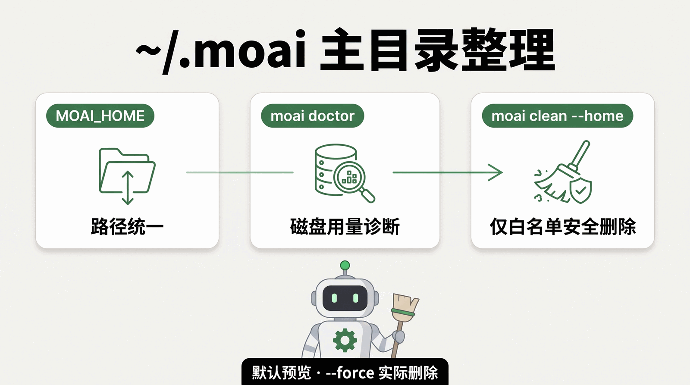
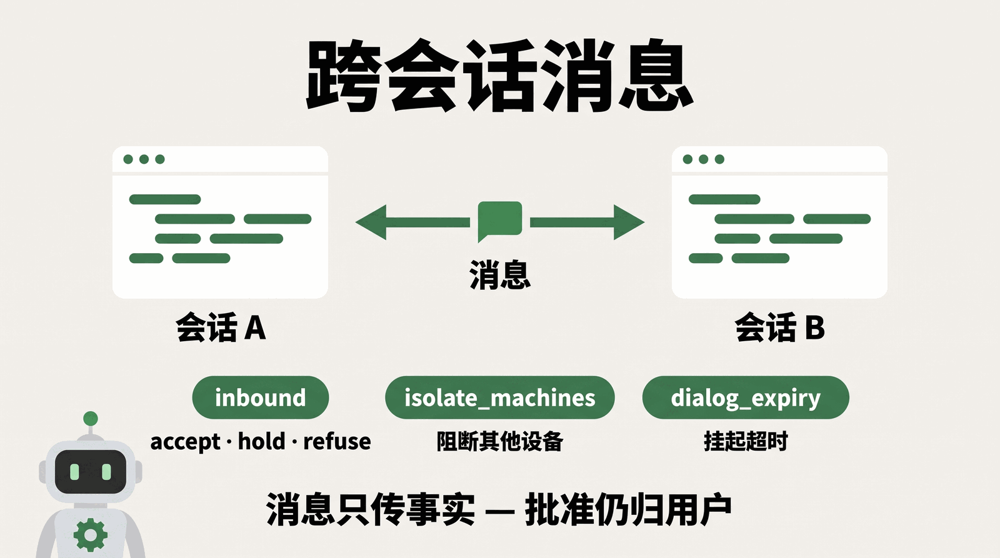
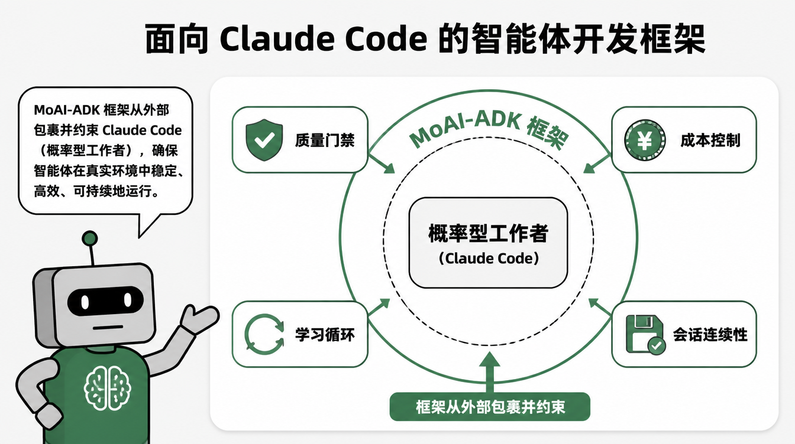
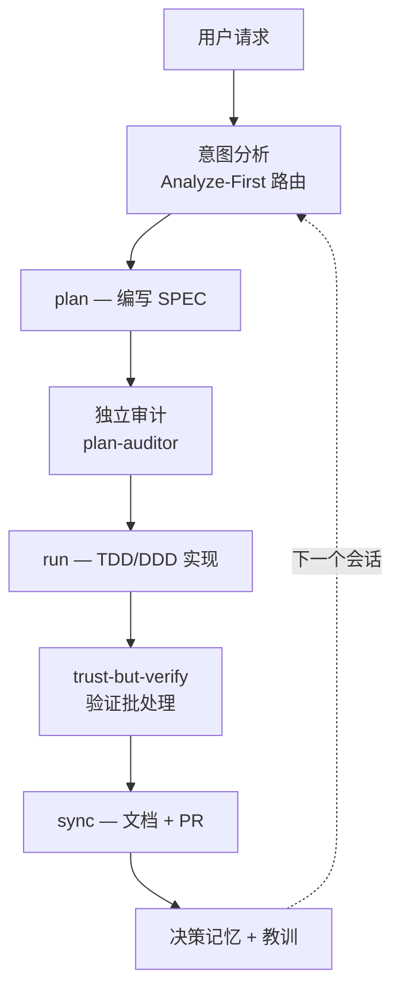
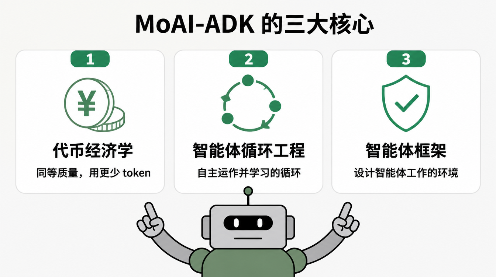
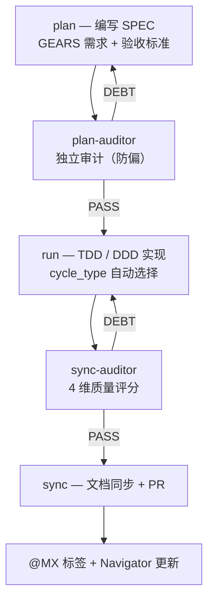
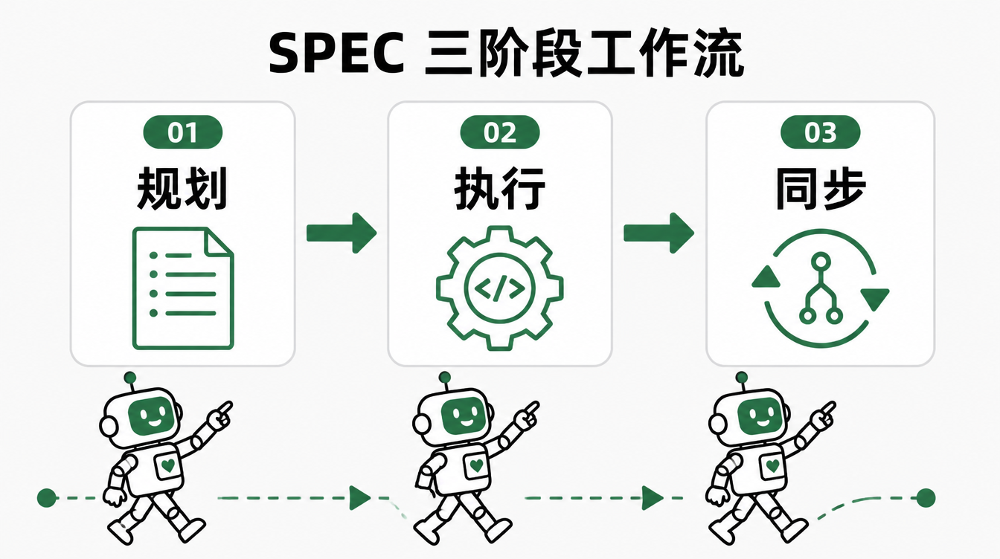
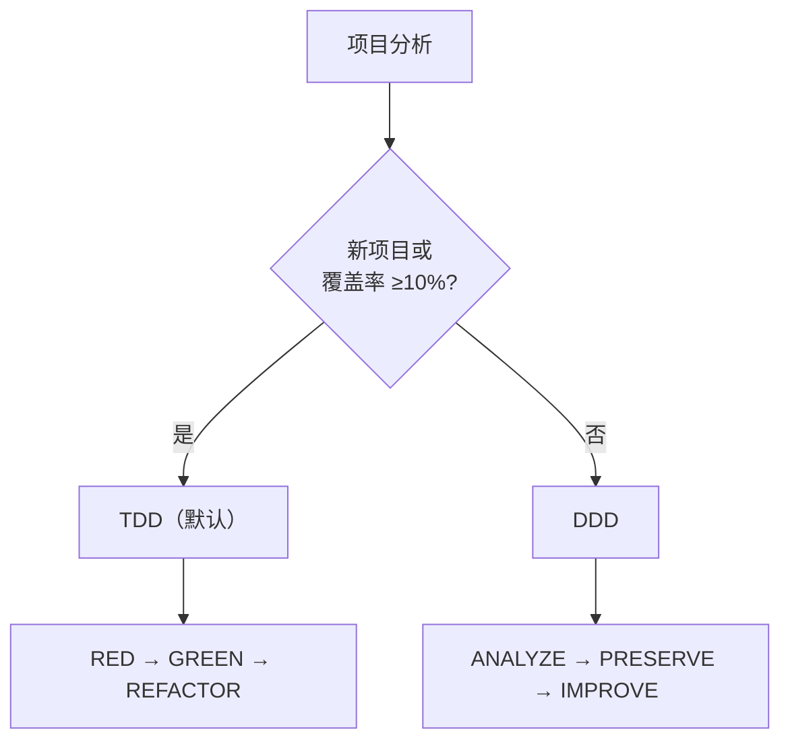

<p align="center">
  
</p>

<h1 align="center">MoAI-ADK</h1>

<p align="center">
  <strong>验证驱动的智能体编排框架 —— 让 Claude Code 写出的代码值得信赖的结构</strong>
</p>

<p align="center">
  <a href="./README.md">English</a> ·
  <a href="./README.ko.md">한국어</a> ·
  <a href="./README.ja.md">日本語</a> ·
  中文
</p>

<p align="center">
  <a href="https://github.com/modu-ai/moai-adk/actions/workflows/ci.yml"></a>
  <a href="https://github.com/modu-ai/moai-adk/actions/workflows/codeql.yml"></a>
  <a href="https://codecov.io/gh/modu-ai/moai-adk"></a>
  <br>
  <a href="https://go.dev/"></a>
  <a href="https://github.com/modu-ai/moai-adk/releases"></a>
  <a href="./LICENSE"></a>
</p>

<p align="center">
  <a href="https://adk.mo.ai.kr"><strong>官方文档</strong></a> ·
  <a href="https://adk.mo.ai.kr/book">图书：用 Claude Code 开始实战智能体编程</a> ·
  <a href="https://discord.gg/Z7E7Mdc5aN">Discord</a>
</p>

---

> **“模型是一个逐个 token 前进的概率型工作者。它无法逐轮记住这轮该花多少、做得好不好、上个会话中断在哪里。框架（harness）从外部把这三件事都强制住。”**

---

## v3.2 新功能 —— 工厂模式

一个会话占用一个上下文窗口。长 SPEC 会填满这个窗口，后面的工作背着前面的一切前进：已经结束的计划在评审时仍留在窗口里，评审在写文档时又还留着。常见的逃生口 `/clear` 会把来龙去脉连同负担一起扔掉。

工厂模式把一项工作拆给**一个主导会话和若干带编号的泳道会话**。主导守着队列，把卡片交给空闲的泳道。卡片不会每过一个阶段就换一次会话，而是**整张进一条泳道**，由那条泳道在自己的会话里依次走完 `plan → run → sync`。每个阶段都以 `Agent()` 子智能体的形式启动，泳道自己只负责编排。这不是解除上限 —— 每个会话的限额原样存在。改变的是：一张卡片的历史只堆在负责它的泳道里。同样的预算因此能走得更远，泳道每做完一张卡片就清空上下文，再接下一张。

### 开始使用

```bash
moai cc -f                    # 主导 —— 打开工厂
moai cc -l                    # 泳道，各自在单独的终端里 —— 按下一个空号加入
moai cc -l                    # 按 lane-1、lane-2 …… 的顺序依次编号
moai glm -l                   # GLM 后端的泳道
moai codex -l                 # Codex 泳道
```

`-f`（长形式 `--factory`）打开主导，`-l`（长形式 `--lane`）以泳道身份加入正在运行的工厂。两者都不带参数。泳道编号不由操作者挑选，而是自动分配。泳道**要由人手在新的终端里逐个启动**，会话不能替别的会话启动。`moai codex` 没有主导入口，只能以泳道身份加入。

一次启动只能带一个进入令牌，所以 `-f` 与 `-l` 同时给出会报错。带了值的形式（`moai cc -f <值>`、`moai cc -l lane-2`）会被一行错误拒绝，错误信息会指出正确的形式。早先那种多会话分列运行的模式所用的 `-k` 已被移除；`moai cg` 会显示迁移提示后退出（可先用 `moai migrate cg` 预览）。`moai gpt` 不存在，GPT 模型通过 `moai codex` 运行。

### 后端怎么搭配

后端按泳道分别选择：`moai cc -l` 是 Claude 泳道，`moai glm -l` 是 GLM 泳道，`moai codex -l` 是 Codex 泳道。主导不是下判定的位置，而是守着队列搬卡片的位置，适合常驻等待成本不高的 GLM（`moai glm -f`）。一个账号开始被 429 限流时，把各条泳道分散到不同账号是行之有效的做法。这只是一种搭配，把全部会话统一到单一后端也没问题。

### N 条泳道同时搬运多张卡片

想加泳道，再执行一次 `-l` 即可。编号自动分配，所以同时给 `--name`/`-n` 会报错。只有被存活会话占用的编号才会被跳过。泳道死了，它的占用不再挡住那个编号，但自动分配总是取存活最高编号 +1，不会回填中间的空号。泳道归属记录在 `~/.moai/db/<project-key>/factory/factory.db` 中。启动目录是临时目录时（没有绝对 `MOAI_HOME` 覆盖），则记录在项目本地的 `<base>/.moai/db/<project-key>/factory/` 下，与 backlog 队列同一例外。旧的 `.moai/state/factory/workers.json` 只导入一次，之后仅作为回滚凭据保留。

一条泳道最多并发运行 10 个 `Agent()` 子智能体，其中承担写入的生成各自隔离在自己的工作树里。不要一次把所有泳道全开：先起第一条，确认它真的开始产出，再启动其余。卡片绝不会被拆到多条泳道上。

工厂 run 会记录持有它的会话的进程标识，因此主导已经死掉的 run，会在下一条泳道加入时自动退役，那次加入不会卡在 `AMBIGUOUS_FACTORY` 上。反方向同样有闸门：泳道加入时若运行记录缺失或已退役，而主导会话还活着，加入会先验证该主导（pid 加进程启动指纹，目标用长形式 `--leader <名称>` 指定，默认 `leader`），恢复其运行记录后照常加入。验证通过的主导有两个或更多时，逐一点名候选并失败关闭。`--leader` 是只能与 `-l`/`--lane` 搭配的选择器，不是任何进入令牌的短形式。`moai factory runs` 列出每个 run 及其属主的存活状态，`moai factory runs --retire <run-id>` 手动退役指定的 run，属主没有真正死掉就会被拒绝。

run 死掉或被替换之后，泳道会话仍然指向环境里固定下来的旧 run。这条泳道用 `moai factory relaunch` 重新接回存活的 run。该命令原样重新执行各提供方自己的泳道加入行（`moai cc -l`、`moai glm -l`，Codex 只有 `moai codex -l`），选项为 `--provider`、`--lane`、`--run`、`--from-run <run-id>`、`--dry-run`。`-l` 不带参数，所以给了 `--lane` 也不会带到加入行上：命令会在 stderr 里说明，泳道按下一个空号加入。`--from-run` 只在该 run 仍为活动且属主已死时才先将其退役，`--dry-run` 只打印启动行，不改动任何东西。它是一次性命令，有别于在同一个 run 里逐张处理卡片的 `--clear-policy relaunch` 循环。stale-run 提示也不再是一段文字，而是直接打印填好参数的这条命令。

> 详见：[工厂模式](https://adk.mo.ai.kr/zh/advanced/factory-mode)

卡片从队列出发。`backlog` 刻意不设归属会话 —— 工作只有人放进去，才会进入队列。

```text
/moai gtd "rename 提示过时了"   # 追加卡片
/moai gtd                      # 查看队列
```

`/moai gtd` 是正式的任务管理入口。`/moai todo` 作为兼容名称继续保留，两者共用同一 SQLite 队列、卡片 ID、顺序以及归档和恢复行为。`moai gtd capture|clarify|organize|reflect|engage` 会把 Capture → Clarify → Organize → Reflect → Engage 保存为连续的 SQLite 状态，再让获准工作进入原有 `backlog → plan → run → sync → done` 开发流程。操作 receipt 与权威状态回读会防止中断恢复后重复发布、选择或调度。

有两条规则让工厂保持诚实。主导**只凭自己从卡片 `progress.md` 里读到的证据**推进卡片 —— 不凭泳道的回复，因为回复是主张而不是观测，而且跨会话投递并不保证送达。另外，一张卡片做完后，泳道会请你 `/clear`。`/clear` 是用户亲手敲的命令，无法当作指令发送（可用 `--clear-policy` 改变这一行为）。

### 工厂里的常用词

把工厂文档里反复出现的词汇收在一处。**主导** (leader) 是守着队列搬卡片的会话；**泳道** (lane) 是把一张卡片一路送到终点的“会话 + 工作树”组合。

| 词 | 一句话定义 |
|---|---|
| 卡片 (card) | 一个工作单元。经 `/moai gtd` 进入，以短 ID 相称 |
| 积压区 (backlog) | 入口等待队列。没有归属会话，只有人能投放 |
| 主导 (leader) | 负责协调的会话。只凭读到的证据推进卡片，自己不写代码 |
| 泳道 (lane) | 把一张卡片送到终点的“会话+工作树”组合。一条并行工作流，编号 `lane-1`、`lane-2` …… 自动分配 |
| 运行 ID (run-id) | 指向某一次工厂运行的短标识。同时有多个运行存活时，用 `--factory-run <run-id>` 选择加入哪一个 |
| 工作树 (worktree) | 卡片专属的隔离检出。目录名是卡片 ID，分支是记录所做之事的 `WT-<slug>` |
| 派单 (dispatch) | 主导发给泳道的指令 —— 指向工作的指针，不是工作的副本 |

卡片的形状不同，泳道经过的阶段也不同。主导在卡片离开队列时把它归为三类之一，并在派单里写明。

| 类别 | 形状 | 捷径 |
|---|---|---|
| A —— 直接关闭 | 一个文件、一行，没有设计判断，回归由 CI 兜底 | 一条泳道一路做到 PR（跳过 `plan`） |
| B —— 原因未明的缺陷 | 明显出了问题，但原因尚未查清 | `run → sync`（没有 `plan`，没有 SPEC） |
| C —— 设计变更 | 含有一项决定，或横跨多个子系统 | 三个阶段全走 |

A 类只凭经确认的证据认定，不凭一句主张：拿不出实测为单文件的 diff 和即将合并的 HEAD 上的绿色 CI，就不是 A 类。B 类只跳过 `plan`，sync 门禁的评审照常运行，确立原因的证据（复现命令及其输出）要留在卡片的进展记录里。

### 用眼睛看工厂

`moai web` 会启动一个本地控制台。Factory 画面把工厂泳道和 SPEC 流水线放在一起看，还附带 Overview、Specs、Monitor、Settings、Todo 画面。

<p align="center">
  
</p>

详细指引：[工厂模式](https://adk.mo.ai.kr/zh/advanced/factory-mode) · [manager-lead 主导协调者](https://adk.mo.ai.kr/zh/advanced/manager-lead) · [`/moai todo`](https://adk.mo.ai.kr/zh/utility-commands/moai-todo)

### v3.1.1 新增的部分

此前的 v3.1.1 带来了下面这些。每一项都在后面对应的章节里细讲。

**主目录清理。** 用得越久，`~/.moai` 里堆的历史运行产物就越多。`moai clean --home` 只在允许清单的范围内清理它们 —— 默认是 dry-run，先把要删的东西摆出来给你看，真删要加 `--force`。从几天前的东西开始清由 `state.home_retention_days` 决定（默认 30 天，填 `0` 就关掉）。眼下膨胀到多大，`moai doctor` 的 Home Disk Usage 项会告诉你。主目录本身可以用 `MOAI_HOME` 环境变量挪走 —— 只接受绝对路径。不过读这个变量的只有 Go 进程，路径挪了，状态栏和 shell 钩子照旧看 `$HOME/.moai`。`.env.glm` 这类 shell 侧的凭据和状态栏数据就留在原地，状态悄悄裂成两处。

<p align="center">
  
</p>

**跨会话消息设置。** 别的 Claude Code 会话发来的消息，是直接收下、先经审批再收下、还是干脆挡掉，由 `crosssession.yaml` 决定。要求走出这台机器的消息必须先经审批的开关也在这里。

<p align="center">
  
</p>

**状态栏支持 GitLab。** 用 `statusline.forge` 选择在 GitHub 还是 GitLab 上统计打开中的工作。留空就按 origin 远端的主机判断。

**裸 `/loop` 变成工厂工头。** 不带参数只敲 `/loop`，转起来的是这样一个循环：盯着积压队列，把操作者已经标成 `picked` 的下一张卡片派给隔离的工人，完成与否不看主张、只看读到的证据，然后汇报。这是没人盯着的位置，所以往队列里放卡片和挑卡片都是操作者的事，工头不挑，只负责搬运。

---

## 为什么选择 moai-adk

智能体写代码的时代已经到来，但智能体交出的结果不能照单全收。“测试通过了”这句话到底是真跑过测试的结果，还是智能体的猜测 —— 从一开始，分辨这一点就是最大的问题。moai-adk 正是从这一点出发 —— **在系统层面禁止未经验证的完成声明**，并把每个完成主张与实际执行的命令及其输出绑定为证据。

moai-adk 是从外部包裹 Claude Code 的框架（harness）。它不取代 Claude Code，而是用结构接管过去要你亲手照看的部分 —— 用哪个模型、推理多深、怎么验证结果、会话断了怎么接续、并行运行时怎么隔开才不互相踩踏。验证完整性、SPEC 生命周期、带真实边界的自主执行、活的代码库导航器、自我改进循环、并行安全结构。这六件事构成 moai-adk 的身份。

<p align="center">
  
</p>

这份身份整理为三个核心 (three axes) —— 用更少的 token 拿到同样质量的**成本**（token 经济学）、把观测变成规则、越跑越聪明的**自我改进**（智能体循环工程），以及从结构上防止返工的**质量管理**（SPEC 生命周期 · TRUST 5 门禁 · 隔离）。单独哪一个都不够 —— 下面看它们为什么彼此需要。

### 八个差异点

| 差异点 | 说明 |
|---|---|
| **没有虚假验证** | “测试通过”的主张必须归因于实际执行的命令及其输出。系统禁止把没跑过的验证说成成功 —— 验证主张完整性（verification-claim integrity）绑定在每个智能体和编排器表面上。 |
| **自主 + 真实边界** | 用 `/moai goal` 声明完成条件，会话就会自主工作直到条件满足。同时绑着四道硬边界 —— 轮次上限（默认 30）、停滞守卫、墙钟预算、事前审批门 —— 不会掉进无限循环。 |
| **并行安全** | 每个 SPEC 独占一棵工作树，分支状态守卫拦住主检出里误切的分支，启动写入型智能体前先检查与远端的差距。两个可写智能体从不同时运行。 |
| **长程延续** | 工作跨过 `/clear` 存续。进度留在 `progress.md`，交接消息留在记忆，路由决策留在决策记忆。下一个会话从上一个学会的地方起步，而不是从零开始。 |
| **成本高效** | 会话的模型与推理强度选定一次，所有智能体就原样继承。复用提示缓存、把长输出排到磁盘，保持上下文轻量。 |
| **16 种编程语言同等支持** | Go、Python、TypeScript、JavaScript、Rust、Java、Kotlin、C#、Ruby、PHP、Elixir、C++、Scala、R、Flutter、Swift —— 十六种编程语言作为一个集合，用基于标记的自动检测统一处理。没有任何一种受到优待。 |
| **自我改进** | 观测到反复出现的失败模式就上升为规则修改提案。绝不悄悄应用 —— 先审批再落地。路由决策和门禁证据沉淀进决策记忆，成为下一次运行的材料。 |
| **母语友好** | 韩语、日语、中文、英语四个语言区在同一 PR 内维护，禁止翻译腔，每种语言各有自己的母语行文。绝不强迫母语用户使用英语。 |

### 有什么不同

| | Claude Code 单独 | 一般框架 | **moai-adk** |
|---|---|---|---|
| 完成主张的证据归因 | 用户亲手核对 | 通常没有 | 系统强制（5 段证据报告格式） |
| SPEC 生命周期 | 无 | 有限 | plan→run→sync 三阶段 + Tier S/M/L |
| 自主循环的硬边界 | 不适用 | 多半只有轮次上限 | 轮次上限 + 停滞守卫 + 墙钟 + 审批门 |
| 并行工作隔离 | 手动 | 有限 | worktree + 分支守卫 + 启动前同步检查 |
| 会话延续性 | `/clear` 后中断 | 有限 | 交接 + 记忆 + 进度文件 |
| 16 种编程语言同等对待 | 不适用 | 不适用 | 标记自动检测 + 各语言工具链 |
| 自我改进循环 | 无 | 有限 | 失败观测 → 规则晋升（审批制） |


```mermaid
flowchart TD
    User["用户请求"] --> Analyze["意图分析<br/>Analyze-First 路由"]
    Analyze --> Plan["plan — 编写 SPEC"]
    Plan --> Audit["独立审计<br/>plan-auditor"]
    Audit --> Run["run — TDD/DDD 实现"]
    Run --> Verify["trust-but-verify<br/>验证批处理"]
    Verify --> Sync["sync — 文档 + PR"]
    Sync --> Learn["决策记忆 + 教训"]
    Learn -.下一个会话.-> Analyze
```

### 三个核心互相撑住

只压成本，质量会悄悄垮掉 —— 返工和调试循环随之而来，而返工是所有 token 支出里最贵的。只有质量门禁而没有学习循环，同样的错误每个会话重演一遍。没有成本上限的自主循环，一个失控任务就能烧光配额。三个核心互相撑住 —— **质量挡住返工，成本才保得住经济性；循环捕捉有效的做法，质量才始终可强制；成本门禁在超额前刹停，循环才留在付得起的范围内。**

每一项设计决策都服务于这三个核心之一。用哪个模型、推理多深、上下文怎么花 —— 没有一件被丢给每轮的临场发挥。系统来决定，并把决定记录下来，让下一次运行更聪明。

<p align="center">
  
</p>

### 成本由指派决定，不由单价决定

三年间 token 价格**跌了 98%**（Linux Foundation），同期企业 AI 支出却**涨了 320%**。用量增长把降价整个盖了过去。智能体为解决一个任务要转几十到几百步，token 按比例烧掉。在按量计费下这直接变成账单；在订阅制下，它蚕食所有模型共享的每周配额。

Uber 把 Claude Code 部署给 5,000 名工程师，**四个月烧掉一年的编码预算**，随后引入月度 token 限额。Meta、Amazon、Microsoft 也各自撤回了无限 AI 政策。把任务匹配给合适模型、提升 token 效率的 **token 经济学**成了科技行业的新基线。

传统成本控制是为单价上涨设计的，在这道悖论面前无能为力：价格在跌、总支出在涨。瓶颈不是单价而是用量 —— 更准确地说，是智能体在完成任务前转的步数。

DeepSWE 排行榜（113 项任务、按努力度分视图）证明了这一点。同一个 Claude 家族内部，单任务成本跟着模型**多高效地完成**走，而不是跟着 token 单价走。

| 模型 [effort] | 得分 | 单任务成本 | 备注 |
|---|---|---|---|
| opus-5 [low] | 58%±2 | **$1.66** | |
| opus-5 [medium] | **69%±1** | **$3.29** | **性价比拐点** |
| opus-5 [high] | 73%±2 | $6.08 | 得分 +4，成本 1.8 倍 |
| opus-5 [xhigh] | 73%±3 | $9.07 | 纯亏损 —— 与 high 持平，只多花 49% |
| opus-5 [max] | 74%±4 | $11.84 | |
| glm-5.2 [max] | 44%±2 | $3.92 | API 计费下吃亏 · z.ai 包月制下有用 |
| sonnet-5 [max] (Sonnet 5) | 54%±4 | $26.40 | 被 opus-5 [low] 支配 |

Opus 5 用最低努力度跑，得分反而高于 Sonnet 5 用最高努力度（58% vs 54%），单任务成本只有十六分之一（$1.66 vs $26.40）—— 尽管 Sonnet 的 token 单价更便宜。原因是 268 步对 36 步：写账单的是重试循环，不是 token 费率。成本由**给每个任务指派合适的模型和推理深度**决定。

上表是在 Opus 5 上测得的数值。MoAI 的 `opus` 别名现在指向 Opus 5.5（需要 Claude Code v2.1.280 或更高版本，默认 effort 为 `medium`），`sonnet` 别名现在指向 Sonnet 5.5（按官方文档为 1M 上下文）。两者都尚未重新测量。

<p align="center">
  
</p>


> 来源：[DeepSWE v1.1 排行榜](https://deepswe.datacurve.ai)（datacurve.ai，113 项任务，2026-07-25）

---

## 快速开始

### 安装

#### macOS / Linux / WSL

```bash
curl -fsSL https://adk.mo.ai.kr/install.sh | bash
```

#### Windows (PowerShell 7.x+)

```powershell
irm https://adk.mo.ai.kr/install.ps1 | iex
```

#### 从源码构建 (Go 1.26+)

```bash
git clone https://github.com/modu-ai/moai-adk.git
cd moai-adk && make build
```

已安装过？用 `moai update` 升到最新版本。从 v3.2.0 起，`moai update` 以保留优先的方式更新已有项目 —— 不再清空重铺模板管理目录。你自己放进去的文件原地保留，对模板文件的修改会做 3-way 合并（冲突时保留你的修改，新版本以 `<path>.moai-new.N` sidecar 放在旁边），模板不再携带的文件在删除前先移入 `.moai/archive/files/` —— 汇总会按路径报告全部刷新、合并、冲突、保留与归档。

> 💡 **想省成本 —— 推荐 z.ai GLM**：通过[这个链接](https://z.ai/subscribe?ic=1NDV03BGWU)注册 z.ai 可获得一定量的赠送 token。这个链接也是赞助 moai-adk 开源开发的途径。也有免费模型（GLM-4.7-Flash、GLM-4.5-Flash），参见 [z.ai 定价](https://docs.z.ai/guides/overview/pricing)。

### 初始化项目

```bash
moai init my-project
cd my-project
```

交互式向导自动检测语言、框架和方法论，一直生成到 Claude Code 集成文件。

#### 选择代理框架

向导会询问要为项目部署并接入哪个代理框架；`--llm` 参数可在非交互模式下做出同样的选择：

| 选择 | 项目根目录生成的内容 |
|---|---|
| `claude`（默认） | 完整的 `.claude/` 表面与 `AGENTS.md` — 沿用至今的默认行为 |
| `gpt` | 仅 Codex 部署：只安装 `AGENTS.md` 与 Codex 表面（`.codex/`、`.agents/skills/`、`.moai/`）。不会生成 `.claude/` 目录、`CLAUDE.md` 和 `.mcp.json`。Claude 专属运行时功能（AskUserQuestion、子代理、output style、斜杠命令、Workflow 脚本）不可用 |
| `both` | 在 `claude` 部署之上追加 `.codex/` 接入。`.mcp.json` 供应强制开启 |

#### 部署模式：插件默认与完整本地部署

默认路径（插件模式）下，技能与命令不再复制进项目 —— 由 moai 插件承载。`.claude/` 表面的其余部分（代理、规则、钩子注册、设置）照旧部署。要把技能和命令保留为本地文件，用 `--no-plugin`（完整本地部署 —— 含 `.mcp.json` 的 moai 条目与 Codex 镜像）；要把可选包目录也一并本地部署，用 `--all`。部署模式记录在 `.moai/config/sections/llm.yaml` 的 `deployment_mode`，`moai update` 按该记录保持同样的范围。插件安装未能得到确认的项目会记录在安全的一侧，即 `local`。


> **GPT 网关已撤回（2026-09-16）。** 通过内置翻译网关把 GPT 模型接入 Claude Code 的旧 `moai gpt`
> 启动器已移除。GPT 模型请通过原生 harness 使用：`moai codex`（Codex CLI）。上方的 `--llm gpt`
> init 值不受影响 —— 它选择的是 Codex 专用部署，而不是已撤回的启动器。
```bash
moai init my-project --llm gpt   # 仅 Codex 项目
```

在此选项存在之前初始化的项目没有 `llm.harness` 键，update 时仍保持 claude 行为 — 无需迁移。

### 第一个工作流

```bash
claude        # 或者 moai cc —— 在项目里运行 Claude Code
```

```text
/moai plan "添加 JWT 登录"         # 编写 SPEC
/moai run SPEC-AUTH-001            # TDD/DDD 实现
/moai sync SPEC-AUTH-001           # 文档同步 + 创建 PR
```

自然语言也可以。像 `/moai "修一下登录 bug"` 这样写，意图分析（Analyze-First 路由）会读出请求并转入合适的工作流。

### 环境要求

| 平台 | 支持环境 | 备注 |
|---|---|---|
| macOS | Terminal, iTerm2 | 完全支持 |
| Linux | Bash, Zsh | 完全支持 |
| Windows | **推荐 WSL**，PowerShell 7.x+ | 原生 cmd.exe 不支持 |

- **Git** —— 所有平台必备
- **Claude Code** —— moai-adk 是为 Claude Code 准备的框架
- **建议**：`gh` CLI（PR 自动化）、`tmux`（工作树窗口）、所用语言的 lint/测试工具链（如 `golangci-lint`）

---

## 核心功能

### 单一入口 `/moai`

自然语言和 16 个子命令进入同一条流水线。`/moai plan`、`/moai run`、`/moai sync` 是 SPEC 流水线的主轴；`goal`、`loop`、`fix`、`review`、`gate`、`clean`、`codemaps`、`e2e`、`mx`、`feedback`、`project`、`harness`、`todo` 补齐四周。

> 已退役的 4 个子命令 —— `design` · `brain` · `coverage` · `security`。`security` 的职责由 `moai-ref-owasp-checklist` + `moai-ref-llm-security` 技能接手。

### MCP 服务器

`moai init` 默认恰好准备**一个**启用的 MCP 条目 —— 自带的 `moai mcp-server`（本地 stdio 服务器）。它向 Claude Code 暴露 MoAI 工具。下表只列出主要分组 —— 完整列表见 [MCP 服务器指南](https://adk.mo.ai.kr/zh/guides/mcp-server)，工具数量与列表以已安装二进制通过 `tools/list` 返回的列表为准。四个已记载但未启用的条目（`context7`、`chrome-devtools`、`playwright`、`ast-grep`）用 `moai mcp add <名称>` 打开。`moai mcp add|remove|list` CLI 通过 atomic-RWM seam 管理条目，用户无需手改 `.mcp.json`。

| 组 | 工具 | 用途 |
|------|------|------|
| SPEC 生命周期 | `spec_progress`, `spec_audit`, `spec_drift` | 时代分类 + 漂移检测 |
| 验证 | `verify_snapshot`, `verify_trend` | 按键的证照快照 |
| 目标 + 会话 | `goal_arm`, `goal_status`, `session_list` | 自主循环 + 多会话协调 |
| 跨模型审计 | `audit_multi`, `claude_audit`, `codex_audit`, `glm_audit`, `audit_cache` | 多审计者收敛 |
| codex 委派 | `codex_task`, `codex_setup`, `codex_job_*` | 后台跨模型作业 |
| GLM 委派 | `glm_task`, `glm_job_status`, `glm_job_result`, `glm_job_cancel` | GLM（z.ai）后台作业委派 |

所有后端都是 fail-open —— GLM（`~/.moai/.env.glm`）和 codex（`~/.codex/auth.json`）是可选的；不可用的后端返回 `inconclusive`，绝不是 hard error。

在启用 Codex 的 harness（`moai init --llm gpt|both`）下，Codex 的状态栏只支持内置标识符数组（`tui.status_line`），因此 goal、todo、SPEC 状态等 MoAI 专属条目无法显示 —— 这是在 openai/codex#17827 落地命令驱动的状态栏之前的已知限制。

> 详见：[MCP 服务器指南](https://adk.mo.ai.kr/zh/guides/mcp-server) · [Claude Code MCP](https://adk.mo.ai.kr/zh/claude-code/extensibility/mcp)

### goal 引擎 —— 带真实边界的自主循环

声明完成条件，会话就自主工作直到条件满足。轮次上限、停滞守卫、墙钟预算、事前审批门一起绑着，掉不进无限循环。机械条件（命令退出码）和模型条件（对话记录里的主张）都能用。`--max-turns 0` 还能武装 auto-compact 驱动的无限 goal —— 此时由 `--max-duration` 和停滞守卫提供边界。

`moai goal --auto "<任务>"` 会另建一个 `mission_mode=auto` 草案，`approve` 一次封存范围、行为、证据与上限，之后由 `run`、`status`、`revoke` 和受策略限制的 `resume` 使用该持久合同。`super-advisor` 仅提供不具约束力的建议，`manager-todo` 的只读判定子角色生成结构化决策，确定性 owner adapter 执行带 receipt 的队列与调度、显式路径提交以及带 lease 的 local develop `--no-ff` 合并。若真实供应方尚未证明持久运行能力，模式会降为 `active-session-only`；远程 push、PR 与合并完成仍未经证明。[GTD 与 auto 任务指南](https://adk.mo.ai.kr/zh/utility-commands/moai-gtd)

最终执行边界更严格：`run --supervise` 有界执行 publish→pick→带 lease 的磁盘调度→commit→local develop `--no-ff`。受监督的 Git 效果必须分别提供 `--card-worktree` 与 `--develop-worktree`；仅使用旧 `--repo` 时效果数为 0。完成还需要 `0600` `--completion-receipt` 封存判定为 true 的 typed evidence 与合并 ancestry，不能仅因动作列表耗尽而完成；重放已完成任务的效果数同样为 0。`--recommend` 不授予权限，每项效果都必须同时持有仓库内 `0600` governor receipt 与独立审计 PASS receipt。未配置的远程与 release provider 返回 `provider_unsupported`，不会伪装成功。

### 并行 worktree

每个 SPEC 独占一棵工作树。用 `moai cc -w <名称>` 进入；加 `--spawn` 则在保留当前会话的同时开新窗口。分支状态守卫拦住主检出里误切的分支。

### 工厂模式

`-f`（`--factory`）打开工厂主导，`-l`（`--lane`）打开泳道。两者都不带参数。一个主导把队列里的卡片交给带编号的泳道，泳道则把一张卡片从 `plan → run → sync` 一路做完。启动顺序见上文“v3.2 新功能 —— 工厂模式”一节。

会话的谱系由 **Origin-Trail Chain** 另行负责。它与工厂模式相互独立，不需要主导，也不需要泳道，凡是像 `moai cc -w <名称>` 这样指定了 worktree 的会话，都会记入链条。它用一棵 append-only 的 JSONL 谱系树追踪 worktree 祖先、解决深度遗忘（`/clear` 之后从根到叶恢复链条），并把心跳停了的会话标为 `stale`。

| 概念 | 作用 |
|------|--------|
| Origin-Trail Chain | `.moai/state/chain/events.jsonl` 的 append-only JSONL 事件流 |
| WorktreeNode（13 字段） | 每会话状态：ID、父节点、深度、origin 链、里程碑、恢复目标 |
| CWD 冲突消解 | 用 `(worktree_path, session_id)` 对区分复用路径 |
| 深度上限 | 限制嵌套复杂度 |

> **现在就能用**：`moai chain <status|lineage|back|list|prune>` 读谱系，`moai todo`（不带参数查看队列，`add`·`list`·`next`·`done`·`unpick`·`drop`·`undrop`·`edit`·`move`·`analyze`，两个以上的词直接当作追加卡片）运营 `backlog` 队列。

> 详见：[工厂模式](https://adk.mo.ai.kr/zh/advanced/factory-mode) · [会话谱系链](https://adk.mo.ai.kr/zh/advanced/origin-trail-chain)

### CG 停用与配置迁移

`moai cg` 已停用。它会显示迁移提示并退出，不会启动 Claude 或 GLM，也不是 `moai cc` 的别名。项目中若仍有 `llm.team_mode: cg`，必须先明确选择迁移方案，才能启动会话。

```bash
moai migrate cg
moai migrate cg --target claude-only --apply --accept-role-change
```

迁移会写入 `llm.team_mode: claude`、`llm.gateway.teammate_mode: in-process` 和 `llm.gateway.teammate_provider: inherit`。这会取消原有混合角色分配，并不会保留 Claude 领队与 GLM 队友窗格的分工。

`claude-glm` 表示 Claude 领队搭配 tmux 中的 GLM 队友。目前 TEAMMATE 集成验证尚未通过，因此不能应用或启动该方案，只能预览。安装 tmux 或设置 `verified: true` 都不能解除限制。

### 16 种编程语言同等支持

Go、Python、TypeScript、JavaScript、Rust、Java、Kotlin、C#、Ruby、PHP、Elixir、C++、Scala、R、Flutter、Swift。基于标记的自动检测驱动每种语言的标准 lint/格式化/测试工具链。

### 自动质量门禁

TRUST 5（Tested · Readable · Unified · Secured · Trackable）作用于每一次变更。`/moai gate` 一趟跑完 lint + 格式化 + 类型 + 测试，sync-auditor 按功能、安全、做工、一致性四个维度打分。

### @MX 标签

让智能体之间交接上下文、不变量和危险区的行内代码标注。只给高扇入、复杂或危险的代码做标记。

### Navigator —— 活的代码库地图

`@NAV:DEC`、`@NAV:SYM`、`@MX:SPEC` 三类 token 绑进一张可寻址的图（`nav-graph.json`）。设计决策、SPEC 和代码符号双向相连 —— 改代码时，决策的来龙去脉跟着一起到。

### 会话交接

工作跨过 `/clear` 存续。6 段式 paste-ready resume 消息把进度带到下一个会话；自动注入模式下，一条消息即可恢复会话。

### loop / fix —— 错误驱动开发

`/moai loop` 并行扫过 LSP 诊断、AST-grep 和 linter，把抓到的问题按级别归组，直到队列清空。`/moai fix` 是一趟搞定的一次性修缮。

### review --deep

`/moai review --deep` 运行多智能体对抗式漏洞扫描，背后跟着 OWASP · LLM 安全 · 供应链 · DevSecOps 参考技能。

### 四语言区文档

韩语、日语、中文、英语文档在同一 PR 内维护。禁止翻译腔，每种语言各有母语行文，四语言区一致性检查绑在构建门禁上。

### moai web 控制台

<p align="center">
  
</p>

`moai web` 打开一个只监听本地主机的控制台。画面共六个 —— Overview、Factory、Specs、Monitor、Settings、Todo；设置画面分成以下标签页：Identity、Language、Claude settings、GLM Settings、Codex settings、Workflow、Git & Worktree、Audit、Report、MCP、Cross-Session、Feedback、Quality Gate。Codex 标签页把分散的 codex 设置汇总到一屏，是只读画面，取值仍在各自所属的标签页里修改。档案的创建、改名、删除也在同一画面完成。

### ref / domain 技能

ref 技能 11 个（`moai-ref-api-patterns`、`moai-ref-owasp-checklist`、`moai-ref-llm-security`、`moai-ref-react-patterns`、`moai-ref-testing-pyramid`、`moai-ref-ui-polish`、`moai-ref-secops`、`moai-ref-supply-chain`、`moai-ref-seo`、`moai-ref-git-workflow`、`moai-ref-cross-model-audit`）与 domain 技能 7 个（`moai-domain-backend`、`moai-domain-frontend`、`moai-domain-database`、`moai-domain-design-dna`、`moai-domain-html-report`、`moai-domain-humanize`、`moai-domain-svg-infographic`）向智能体注入现场知识。

### SVG 技术信息图

`moai-domain-svg-infographic` 技能生成可编辑的 SVG 技术信息图。写标记之前先用数值算出坐标，完成的文件要通过对确定性源码 lint 和带尺寸校验的 2 倍分辨率 PNG 渲染。通过外部目录基准实测了九种形态——审批门流程、前后对比、KPI 卡片网格、决策矩阵、分层堆叠、嵌套作用域、流程图、路线图时间线、组件拓扑——确认九种全部可复现（分形态产物与判定：`.moai/reports/t272/verdict.md`）。

### 跨平台

一个无额外依赖的 Go 单一二进制，跑在 macOS、Linux、Windows 上。钩子系统机械地强制门禁，状态栏实时显示成本和上下文。

---

## 它是如何工作的

### SPEC 三阶段生命周期

所有工作沿 plan → run → sync 三个阶段流动。Tier S/M/L 尺寸分级决定验证深度和 PR 路由。GEARS 格式的需求与验收标准以证据判定完成。


```mermaid
flowchart TD
    P["plan — 编写 SPEC<br/>GEARS 需求 + 验收标准"] --> PA["plan-auditor<br/>独立审计（防偏）"]
    PA -->|PASS| R["run — TDD / DDD 实现<br/>cycle_type 自动选择"]
    PA -->|DEBT| P
    R --> SA["sync-auditor<br/>4 维质量评分"]
    SA -->|PASS| S["sync — 文档同步 + PR"]
    SA -->|DEBT| R
    S --> MX["@MX 标签 + Navigator 更新"]
```

<p align="center">
  
</p>

方法论（TDD/DDD）由项目状态挑选。`moai init` 看覆盖率自动决定。


```mermaid
flowchart TD
    A["项目分析"] --> B{"新项目或<br/>覆盖率 ≥10%?"}
    B -->|"是"| C["TDD（默认）"]
    B -->|"否"| D["DDD"]
    C --> F["RED → GREEN → REFACTOR"]
    D --> G["ANALYZE → PRESERVE → IMPROVE"]
```

| 方法论 | 循环 | 适用 |
|---|---|---|
| **TDD**（默认） | RED → GREEN → REFACTOR | 新项目、功能开发 |
| **DDD** | ANALYZE → PRESERVE → IMPROVE | 覆盖率低于 10% 的存量代码 |

### 13 智能体目录

| 分类 | 智能体 | 职责 |
|------|------|------|
| **管理者** | manager-spec | plan 阶段编写 SPEC |
| | manager-develop | run 阶段 TDD/DDD/autofix 实现 |
| | manager-docs | sync 阶段文档 |
| | manager-git | PR 创建与路由 |
| | manager-design | 设计阶段协作（Claude Design） |
| | manager-lead | 层级团队 Tier L 协调 + 工厂主导会话派工（唯一的 Agent 携带者，深度 2 封印） |
| **评审者** | plan-auditor | 独立 plan 审计（防偏） |
| | sync-auditor | 4 维质量评分（功能性 40 · 安全 25 · 做工 20 · 一致性 15） |
| **构建者** | builder-harness | 项目专用智能体、技能、命令、钩子的脚手架 |
| **顾问** | super-advisor | 按需高推理咨询（E1-E4 升级） |
| **专员** | e2e-tester | Web/移动/桌面 E2E 测试执行（CLI 优先） |
| | manager-todo | 待办队列管理（队列生命周期、`/moai:todo --auto` 串行循环、调度指导）— 对已封存快照的只读判定子角色只返回一个判定，从不自己执行（由 GTD 工作流调用，因此不占选择决策树的行） |
| **内置** | Explore | 只读代码库探查 |

所有智能体都原样继承会话的模型与推理强度 —— 会话用什么模型和 effort 起跑，就是全体的指派。写作和审计从一开始就分给别人 —— 写的人永远不给自己的作业打分。

十三个里有十二个是 moai-adk 自造的智能体，`Explore` 是 Claude Code 本来就有的内置智能体。

### trust-but-verify —— 给完成主张绑上证据

智能体报告“测试通过了”时，编排器不照单全收，而是亲自跑验证批。七个只读验证（测试、覆盖率、子智能体边界、哨兵扫描、CLI 冒烟、基准、lint）在一轮里并行执行，各自的退出码和输出留作证据。

验证主张完整性（verification-claim integrity）规则在背后托住这条流程 —— 不许把没跑过的验证说成成功、不许把以前量过的值冒充新测量、不许把没观测到的东西当空档放过。5 段报告格式（主张 · 证据 · baseline 归因 · 未验证 · 残余风险）绑定每个智能体和编排器的每份完成报告。

### 削减验证成本，在超额前刹停

验证是必要的；验证输出坐进上下文则不是。冗长的验证输出排到磁盘文件，上下文里只留退出码和截断的尾巴（最多 50 行）。复用提示缓存（缓存读取只要 0.1 倍费用）让窗口保持轻量，上下文瘦身 `/clear` 策略在阈值（1M 50% / 200K 90%）处发出建议。

预算侧由 token 断路器守着 —— 在硬上限（默认 90%）中止执行，把进度存进 `progress.md`，并发出一条贴上就能续跑的 resume 消息。状态栏始终显示上下文用量、缓存命中率和限额消耗，超额不会悄悄溜过去。

### 读懂状态栏

```
🤖 Opus | 🧠 xhigh·t | ♻️ 87% | 🔅 v2.1.212 | 🗿 v3.1.3 | ⏳ 2h 34m | 💬 MoAI
🪫 CW: ████████░░ 88% (⚠️/clear) | 🔋 5H: ████░░░░░░ 45% (4h 30m) | 🪫 7D: ████████░░ 82% (Jan 21)
📁 moai-adk-go | 📡 modu-ai/moai-adk, 7/3 | 🅱️ [WT] release/v3.1.3 +3 | 💾 +1 M2 ?0 | 📋 [run SPEC-AUTH-001-run] | 💌 PR #1042 (⌥approved)
🏷️ run | 👤 manager-develop | 🔄 TODO: 1/3
```

| 元素 | 含义 |
|------|------|
| 🤖 模型 | 当前活动模型 |
| 🧠 effort | 推理强度 —— 扩展推理开启时带 `·t` 后缀 |
| ♻️ 缓存命中率 | 提示缓存命中率 |
| CW: 上下文 | 上下文窗口使用率 + 两段式 `/clear` 标记（⚠️ 软性、🛑 硬性） |
| 5H / 7D | 套餐使用率 + 重置时间 |
| 📁 目录 | 项目目录名 |
| 📡 仓库 | GitHub 仓库 `owner/name` + 打开的 issue/PR 数对（`, 7/3`；读不到则 `, -/-`） |
| 🅱️ 分支 | 当前分支 —— 工作树会标 `[WT]`，`+` 是改动数（已修改+已暂存+未跟踪） |
| 💾 git 状态 | 已暂存 `+` · 已修改 `M` · 未跟踪 `?` 计数 —— 任何状态下都只用 💾 一个图标 |
| 📋 任务 | 活动 SPEC 工作流 `[命令 SPEC-ID-阶段]` |
| 💌 PR | 活动 GitHub PR 编号 + 评审状态（`⌥状态`） |
| 🏷️ 会话行 | 末行按条件显示 —— 会话名 · 👤 智能体 · 🔄 `TODO: 进行中/待办` 积压 |

> 详见：[状态栏指南](https://adk.mo.ai.kr/zh/advanced/statusline)

---

## 工作流示例

### 做一个新功能（TDD）

```text
/moai plan "添加用户头像上传"
/moai run SPEC-PROFILE-001
/moai sync SPEC-PROFILE-001
```

新代码或覆盖率足够的代码配 TDD（RED → GREEN → REFACTOR）。`moai init` 检测项目状态，在 TDD 和 DDD 里挑一个。

### 长时间运行（goal）

```text
/moai plan "重构支付模块"
/moai run SPEC-PAY-001
/moai goal "go test ./... exits 0 && lint clean, or stop after 20 turns"
```

声明完成条件，会话就自主工作直到条件满足。轮次上限默认 30，并绑着停滞守卫。上下文到阈值（1M 50% / 200K 90%）时建议 `/clear`，并把进度存进 `progress.md`。

### 并行运行（worktree）

```bash
moai cc -w feature-auth        # 打开 auth 工作树
moai cc -w feature-billing --spawn   # billing 开新窗口，保留当前会话
```

```text
# 在 auth 树里
/moai run SPEC-AUTH-001

# 在 billing 树里
/moai run SPEC-BILL-001
```

每个 SPEC 独占一棵工作树，两个智能体互不踩踏。分支状态守卫拦住主检出里误切的分支。

### CG 停用与配置迁移

`moai cg` 已停用。它会显示迁移提示并退出，不会启动 Claude 或 GLM，也不是 `moai cc` 的别名。项目中若仍有 `llm.team_mode: cg`，必须先明确选择迁移方案，才能启动会话。

```bash
moai migrate cg
moai migrate cg --target claude-only --apply --accept-role-change
```

迁移会写入 `llm.team_mode: claude`、`llm.gateway.teammate_mode: in-process` 和 `llm.gateway.teammate_provider: inherit`。这会取消原有混合角色分配，并不会保留 Claude 领队与 GLM 队友窗格的分工。

`claude-glm` 表示 Claude 领队搭配 tmux 中的 GLM 队友。目前 TEAMMATE 集成验证尚未通过，因此不能应用或启动该方案，只能预览。安装 tmux 或设置 `verified: true` 都不能解除限制。

### 自动抓 bug（loop）

```text
/moai loop
```

并行扫过 LSP 诊断、AST-grep 和 linter，按级别归组抓到的问题，直到队列清空。单个问题用 `/moai fix` 一趟了结。

---

## 配置与档案

### `.moai/config/sections/`

项目配置拆成一组 YAML 切面文件。`moai init` 铺下的切面文件一共 30 个，其中经常动的是下面这六个。

| 切面 | 职责 |
|---|---|
| `language.yaml` | 用户名 · 对话语言 · 代码注释语言 · 提交信息语言 |
| `quality.yaml` | 质量门禁 · 开发模式（TDD/DDD）· 覆盖率 |
| `harness.yaml` | 框架深度（minimal · standard · thorough）· 自动检测 |
| `workflow.yaml` | 工作流行为 |
| `lsp.yaml` | LSP 门禁阈值（SSOT） |
| `user.yaml` | 用户信息 |

v3.1.1 又多了四个值得一动的切面。

| 切面 | 职责 |
|---|---|
| `crosssession.yaml` | 跨会话消息的处置。`inbound`（留空 · `accept` · `hold` · `refuse`）、`isolate_machines`（本机之外的消息是否要求审批）、`dialog_expiry`（被挂起的消息，其审批对话的期限） |
| `cache.yaml` | 提示缓存的配置文件。存放 `session_ttl`（`1h` · `5m` · `off`）、`spec_ttl` 和值得缓存的最小片段大小，在 `moai web` 设置编辑器里原样往返。但目前没有代码读取这些值，改了也不会改变行为 |
| `state.yaml` | `home_retention_days` —— `moai clean --home` 从几天前的东西开始清。只从 HOME 层（`~/.moai/config/sections/state.yaml`）读取，默认 30 天，填 `0` 就关掉主目录清理 |
| `statusline.yaml` | 在原有的主题与段落开关之上多了 `forge` 键。取 `github` · `gitlab` · `none` 之一，决定状态栏在哪个托管平台上统计打开中的工作。留空则按 origin 远端的主机判断，所以自建实例上要自己写明 |

`gate.yaml` 的 `ast_grep_gate.rules_dir` 不是新键，而是**默认值变了的键**。原本是空字符串的默认值现在成了 `.moai/config/astgrep-rules`，`moai init`/`moai update` 会把捆绑的规则集铺在那个位置。代码一侧的回退路径已经取消，所以这个键现在是规则集位置的唯一出处 —— 把规则挪到别处的话，这个值也要一起改，门禁才找得到规则。

环境变量覆盖文件值。优先级细节和完整切面清单见 [CLI 参考](https://adk.mo.ai.kr/zh/cli-reference)。

### settings.json / settings.local.json 分离

| 文件 | 职责 | 模板 |
|---|---|---|
| `.claude/settings.json` | 从模板渲染 —— 项目共享配置 | 包含 |
| `.claude/settings.local.json` | 运行时管理 —— 每台机器的值（tmux pane ID · API 令牌 · 绝对路径） | **绝不包含** |

`settings.local.json` 由 `moai glm`、`moai cc` 在运行时修改，SessionStart 钩子填充环境。误提交了就用 `git rm --cached .claude/settings.local.json` 摘掉。

---

## 随处可用

### 16 种编程语言同等支持

| | | | |
|---|---|---|---|
| Go | Python | TypeScript | JavaScript |
| Rust | Java | Kotlin | C# |
| Ruby | PHP | Elixir | C++ |
| Scala | R | Flutter | Swift |

按项目标记自动检测每种语言，并运行该语言的标准 lint/格式化/测试工具链。缺失的工具悄悄跳过。Dart/Flutter 的正式名称是 "flutter"。没有任何一种受到优待。

### 四语言区文档

| 语言区 | 站点 |
|---|---|
| 한국어 | adk.mo.ai.kr/ko |
| English | adk.mo.ai.kr/en |
| 日本語 | adk.mo.ai.kr/ja |
| 中文 | adk.mo.ai.kr/zh |

四个语言区在同一 PR 内维护，四区一致性检查绑在构建门禁上。禁止翻译腔，每种语言各有母语行文。

### 操作系统

| 平台 | 状态 |
|---|---|
| macOS | 完全支持（Terminal、iTerm2） |
| Linux | 完全支持（Bash、Zsh） |
| Windows | 推荐 WSL，支持 PowerShell 7.x+，原生 cmd.exe 不支持 |

### Claude + GLM

z.ai GLM 作为 Claude Code 的替代后端。只换环境变量，代码原样不动。

| 命令 | 主导 | 工人 | tmux | 省成本 |
|---|---|---|---|---|
| `moai cc` | Claude | Claude | 不需要 | — |
| `moai glm` | GLM | GLM | 建议 | 约 70% |

GLM Coding Plan 每月 $10 起。可用 glm-5.3-flash（默认）、glm-5.3、glm-4.7、glm-4.5-air 以及免费模型（GLM-4.7-Flash、GLM-4.5-Flash）。

Claude 的每一档通过 `ANTHROPIC_DEFAULT_*_MODEL` 环境变量映射到 GLM 模型：

| Claude 档位 | GLM 模型 | 上下文 |
|---|---|---|
| Opus | glm-5.3-flash | 1M |
| Sonnet | glm-5.3-flash | 1M |
| Haiku | glm-5.3-flash | 1M |
| Fable | glm-5.3-flash | 1M |

> glm-5.3 在任何档位插槽都仍然可选（`llm.yaml` 的 `llm.glm.models.*`）；把插槽改回去也只是一行配置改动。

> 详见：[Multi-LLM 指南](https://adk.mo.ai.kr/zh/multi-llm) · [z.ai 定价](https://docs.z.ai/guides/overview/pricing)

---

## 文档与学习

### 官方文档 —— adk.mo.ai.kr

[adk.mo.ai.kr](https://adk.mo.ai.kr) 在线文档分为 12 个板块。

| 板块 | 说明 |
|---|---|
| [快速上手](https://adk.mo.ai.kr/zh/getting-started) | 简介 · 安装 · Windows 指南 · init 向导 · 快速入门 · CLI 概览 · FAQ |
| [核心概念](https://adk.mo.ai.kr/zh/core-concepts) | 身份 · 宪章 · 框架工程 · 基于 SPEC 的开发 · DDD · TRUST 5 |
| [工作流命令](https://adk.mo.ai.kr/zh/workflow-commands) | `plan` · `run` · `sync` —— SPEC 流水线主轴 |
| [实用命令](https://adk.mo.ai.kr/zh/utility-commands) | `fix` · `loop` · `gate` · `review` · `clean` · `codemaps` · `e2e` · `feedback` · `goal` · `gtd`（`todo` 兼容） |
| [CLI 参考](https://adk.mo.ai.kr/zh/cli-reference) | 终端 `moai` 二进制的全部命令（共 49 个） |
| [Claude Code 指南](https://adk.mo.ai.kr/zh/claude-code) | Claude Code 集成 —— 基础 · 上下文/记忆 · 智能体 · 扩展性 |
| [Multi-LLM](https://adk.mo.ai.kr/zh/multi-llm) | CG 迁移与模型策略 |
| [成本优化](https://adk.mo.ai.kr/zh/cost-optimization) | 提示缓存策略与 token 成本削减 |
| [指南](https://adk.mo.ai.kr/zh/guides) | CI 自治化 · 多 LLM CI 等实战运维配方 |
| [Git Worktree](https://adk.mo.ai.kr/zh/worktree) | 并行 SPEC 开发的工作树指南 |
| [Advanced](https://adk.mo.ai.kr/zh/advanced) | token 经济学 · token 预算 · 状态栏 · settings.json · 钩子 · @MX 标签 · 技能 · Harness v4 Builder · 自我进化 · 决策记忆 |
| [参与贡献](https://adk.mo.ai.kr/zh/contributing) | 开源贡献指南 |

### 图书

[**用 Claude Code 开始实战智能体编程**](https://adk.mo.ai.kr/book) —— moai-adk 作者写的实战框架工程指南。[book.mo.ai.kr](https://book.mo.ai.kr)

### CLI 命令表（常用 17 个）

| 命令 | 说明 |
|---|---|
| `moai init` | 交互式项目初始化（自动检测语言/框架/方法论） |
| `moai doctor` | 系统状态诊断与环境校验 —— Home Disk Usage 项会告诉你 `~/.moai` 膨胀到了多大 |
| `moai status` | 项目状态摘要（Git 分支、质量指标） |
| `moai update` | 升级到最新版（保留本地文件 · 3-way 合并与冲突 sidecar · 删除前归档） |
| `moai graph <build\|query>` | 生成/查询代码库图（edges.jsonl）—— 找调用方、波及范围、里程碑交叉检查 |
| `moai cc` / `moai glm` | Claude 专用 / GLM 专用会话 |
| `moai codex [cli\|status\|app]` | Codex 启动器 — 不带动词调用即启动 Codex CLI；`status` 只显示就绪状态，不启动任何东西 |
| `moai worktree <sync\|done\|sweep\|hoist\|remove\|clean\|recover\|snapshot\|verify\|restore>` | Git worktree 维护（进出工作树是启动器的职责） |
| `moai session <list\|register\|current>` | 多会话协调 |
| `moai spec <audit\|archive\|lint\|list\|new>` | SPEC 生命周期工具 |
| `moai goal <arm\|status\|clear>` | goal 引擎 CLI |
| `moai harness <status\|apply\|rollback\|disable>` | 框架学习生命周期 |
| `moai handoff <save\|show\|clear>` | 会话交接记录 |
| `moai preference <list\|decay-scan\|toggle>` | 决策记忆管理 |
| `moai memory <doctor\|archive>` | 智能体记忆体检与旧条目归档 |
| `moai tokens record` | 按池记录 token 使用台账 |
| `moai clean [--home] [--codex-skills] [--reports-archive]` | 清理旧的运行产物。加上 `--home` 就在允许清单范围内清理 `~/.moai`；加上 `--codex-skills` 则从 `~/.codex/config.toml` 删除那些声明路径已被证明不存在的 `[[skills.config]]` 注册。加上 `--reports-archive` 则把 `.moai/reports/` 里过期的证据目录移入 `archive/<YYYY-MM>/` — 只移动、不删除(默认保留 90 天，`--reports-archive-days`)。一次只能选一个范围。默认是 dry-run，要加 `--force` 才真正删除 |
| `moai web` | 网页控制台 —— 6 个画面（Overview · Factory · Specs · Monitor · Settings · Todo）、设置标签页 |

> 全部 49 个命令：[CLI 参考](https://adk.mo.ai.kr/zh/cli-reference)

### ref / domain 技能

**ref（现场知识）11 个**：`moai-ref-api-patterns`、`moai-ref-owasp-checklist`、`moai-ref-llm-security`、`moai-ref-react-patterns`、`moai-ref-testing-pyramid`、`moai-ref-ui-polish`、`moai-ref-secops`、`moai-ref-supply-chain`、`moai-ref-seo`、`moai-ref-git-workflow`、`moai-ref-cross-model-audit`

**domain（专业领域）7 个**：`moai-domain-backend`、`moai-domain-frontend`、`moai-domain-database`、`moai-domain-design-dna`、`moai-domain-html-report`、`moai-domain-humanize`、`moai-domain-svg-infographic`

`moai-domain-design-dna` 是 v3.1.1 新加的。给它一份要参考的设计 —— 截图也好、一组图片也好、活的 URL 也好 —— 它会把颜色、间距、圆角、字体这些量得出来的值，连同那份设计的气质和特殊渲染效果，一并反推成一份 Design DNA JSON。再把这份 JSON 喂回去，它就造出气质相同的新产物 —— 这是把“做成这个画面的样子”从话语搬到数值上的路径。也支持图表配置档案：激活档案的标记保存在项目根目录的 `.design-dna/` 下，能活过 `moai update`；可选开启的 mermaid、drawio 导入器把来源当作不可信输入 —— 坐标、颜色、字体、版式一概不带过来。

### CHANGELOG

最近的变更见 [CHANGELOG.md](./CHANGELOG.md)。

### 代码质量要求

每次贡献都要过 TRUST 5 门禁 —— 覆盖率 85% 以上 · lint 错误 0 · 类型错误 0 · Conventional commits。存量代码先用特征化测试固定行为再渐进改进（DDD），新代码走 RED → GREEN → REFACTOR（TDD）。

---

## 常见问题

### 为什么不是每个函数都有 @MX 标签？

正常。标签只标高扇入、复杂或危险的代码。任何项目里的大多数代码都够不到标签阈值 —— 没有标签的文件不是缺陷。

### 状态栏里的版本显示是什么意思？

```
🗿 v3.1.2 -> 🗿 v3.1.3
```

前一个值是当前安装的 moai-adk 版本，箭头表示有可用更新。运行 `moai update` 后消失。

### 不用 GLM、只用 Claude 可以吗？

可以。`moai cc` 可在不使用 GLM 的情况下启动 Claude 会话。只有保留旧 CG 配置的项目才需要先迁移。

### 在已有项目上能用吗？

能。`moai init` 检测项目状态并选择方法论 —— 覆盖率低于 10% 的存量代码用 DDD（先特征化测试固定行为、再渐进改进），新项目或测试充分的代码用 TDD。

---

## 一起参与

### 贡献

随时欢迎贡献。详细流程见 [CONTRIBUTING.md](CONTRIBUTING.md)。

1. 复刻（fork）仓库
2. 建功能分支：`git checkout -b feature/my-feature`
3. 写测试 —— 新代码用 TDD，存量代码用特征化测试
4. 确认测试、lint、格式化通过：`make test` · `make lint` · `make fmt`
5. 用 Conventional commit 信息提交并开拉取请求

**代码质量要求**：覆盖率 85% 以上 · lint 错误 0 · 类型错误 0 · Conventional commits

### 反馈

在 Claude Code 里用 `/moai feedback` 直接把 bug 报告和功能请求发成 GitHub issue。终端里则用 [GitHub Issues](https://github.com/modu-ai/moai-adk/issues)。

### 社区

- [Discord](https://discord.gg/Z7E7Mdc5aN) —— 实时讨论与技巧
- [GitHub Issues](https://github.com/modu-ai/moai-adk/issues) —— bug 报告 · 功能请求

### 许可证

[Apache License 2.0](./LICENSE) —— 详情见 LICENSE 文件。

---

## Star 历史

<a href="https://www.star-history.com/?type=date&repos=modu-ai%2Fmoai-adk">
 <picture>
   <source media="(prefers-color-scheme: dark)" srcset="https://api.star-history.com/chart?repos=modu-ai/moai-adk&type=date&theme=dark&legend=top-left&sealed_token=9wFuBO5GMKxHZsaknxlIW3oypXLJlyW1qqq8T--aTRyfp6j9EK9KTR2vJvyAG8AKSs3Lindw7LUt-m-I6ysz9BoV6kdtrKlJYTViQAYR56A_3ie4ZVOqIw" />
   <source media="(prefers-color-scheme: light)" srcset="https://api.star-history.com/chart?repos=modu-ai/moai-adk&type=date&legend=top-left&sealed_token=9wFuBO5GMKxHZsaknxlIW3oypXLJlyW1qqq8T--aTRyfp6j9EK9KTR2vJvyAG8AKSs3Lindw7LUt-m-I6ysz9BoV6kdtrKlJYTViQAYR56A_3ie4ZVOqIw" />
   
 </picture>
</a>

<p align="center">
  <sub>MoAI-ADK 团队出品 · <a href="https://adk.mo.ai.kr">adk.mo.ai.kr</a></sub>
</p>
