# 🗿 MoAI-ADK: AI 智能体开发框架


**可用语言:** [🇰🇷 한국어](./README.ko.md) | [🇺🇸 English](./README.md) | [🇯🇵 日本語](./README.ja.md) | [🇨🇳 中文](./README.zh.md)

[](https://pypi.org/project/moai-adk/)
[](./LICENSE)
[](https://www.python.org/)

> **"Vibe Coding的目的不是快速生产力，而是代码质量。"**

MoAI-ADK提供**高质量代码的AI开发环境**。SPEC-First TDD、测试驱动开发、持续重构和20个专业AI智能体协同工作。

---

## 🎁 MoAI-ADK赞助商: z.ai GLM 4.7

**💎 经济高效的AI开发最佳解决方案**

MoAI-ADK通过**z.ai GLM 4.7**合作伙伴关系为开发者提供经济高效的AI开发环境。

### 🚀 GLM 4.7 特别优惠

| 优惠                 | 说明                                           |
| -------------------- | ---------------------------------------------- |
| **💰 70% 成本节省**  | Claude的1/7价格获得同等性能                   |
| **⚡ 快速响应**      | 优化的基础设施提供低延迟响应                  |
| **🔄 兼容性**        | 与Claude Code完全兼容，无需修改代码           |
| **📈 无限使用**      | 无每日/每周令牌限制，自由使用                 |

### 🎁 注册特别折扣

**👉 [GLM 4.7 注册 (10% 额外折扣)](https://z.ai/subscribe?ic=1NDV03BGWU)**

通过此链接注册:

- ✅ **额外10%折扣**优惠
- ✅ 为**MoAI开源开发**做贡献 (奖励积分用于开源项目)

### 💡 使用指南

```bash
# 1. 获取GLM API密钥
通过上方链接注册后获取API密钥

# 2. 在MoAI-ADK中配置GLM
moai glm YOUR_API_KEY
```

> **💡 提示**: 在Worktree环境中使用GLM 4.7，用Opus设计并用GLM大量实现，最多可节省70%成本。

---

## 🌟 核心价值

- **🎯 SPEC-First**: 清晰的规格说明减少90%返工
- **🔴 TDD强制**: 自动保证85%+测试覆盖率
- **🤖 AI编排**: 20个专业智能体 + 48个技能
- **🌐 多语言路由**: 自动支持韩语/英语/日语/中文
- **🌳 Worktree并行开发**: 完全隔离环境中无限并行工作
- **🏆 MoAI Rank**: 通过Vibe Coding排行榜获得动力

---

## 1. 30秒安装

```bash
# 步骤1: 安装uv (macOS/Linux)
curl -LsSf https://astral.sh/uv/install.sh | sh

# 步骤2: 安装MoAI-ADK
uv tool install moai-adk
```

### 🎨 交互式设置向导

运行`moai init`命令时，**9步交互式向导**启动:


---

#### 步骤1: 语言选择

选择对话语言。之后所有指南将以所选语言显示。

```
🌐 Language Selection
❯ Select your conversation language: [↑↓] Navigate  [Enter] Select
❯ Korean (한국어)
  English
  Japanese (日本語)
  Chinese (中文)
```

---

#### 步骤2: 输入姓名

输入您的姓名。AI将提供个性化响应。

```
👤 用户设置
❯ 输入用户名 (可选):
```

---

#### 步骤3: 输入GLM API密钥

输入Z.AI公司的GLM API密钥。

```
🔑 API 密钥输入
GLM CodePlan API key (optional - press Enter to skip)

✓ 找到现有GLM API密钥: 99c1a2df...
按Enter保留现有密钥，输入新密钥将替换

? 输入GLM API密钥:
```

> 🎁 **GLM注册优惠**: 如果您没有GLM账户，请通过下方链接注册!
>
> **👉 [GLM 注册 (10% 额外折扣)](https://z.ai/subscribe?ic=1NDV03BGWU)**
>
> 通过此链接注册可获得**额外10%折扣**。
> 此外，通过链接注册产生的奖励将用于**MoAI开源开发**。🙏

---

#### 步骤4: 项目设置

输入项目名称。

```
📁 项目设置
❯ 项目名称: MoAI-ADK
```

---

#### 步骤5: Git设置

选择Git模式。

```
🔀 Git设置
❯ 选择Git模式: [↑↓] Navigate  [Enter] Select
❯ manual (仅本地) - 仅使用本地仓库
  personal (GitHub个人) - 使用GitHub个人账户
  team (GitHub团队) - 使用GitHub团队/组织
```

---

#### 步骤6: GitHub用户名

选择personal/team时输入GitHub用户名。

```
❯ GitHub用户名:
```

---

#### 步骤7: 提交消息语言

选择Git提交消息使用的语言。

```
🗣️ 输出语言设置
❯ 提交消息语言: [↑↓] Navigate  [Enter] Select
  English
❯ Korean (한국어)
  Japanese (日本語)
  Chinese (中文)
```

---

#### 步骤8: 代码注释语言

选择代码注释使用的语言。

```
❯ 代码注释语言: [↑↓] Navigate  [Enter] Select
  English
❯ Korean (한국어)
  Japanese (日本語)
  Chinese (中文)
```

---

#### 步骤9: 文档语言

选择文档使用的语言。

```
❯ 文档语言: [↑↓] Navigate  [Enter] Select
  English
❯ Korean (한국어)
  Japanese (日本語)
  Chinese (中文)
```

> 💡 **令牌优化策略**: 指导智能体的内部提示固定为**英语**。
>
> **原因**: 非英语语言在Claude中**额外消耗12%~20%令牌**。当无限重复的智能体工作增多时，会对成本和每周令牌限制产生重大影响，因此MoAI将内部智能体指导固定为英语，**仅用用户语言提供一般对话**。
>
> 这是MoAI**减少令牌浪费的努力**。

---

#### 安装完成

所有设置完成后，5步安装自动进行:

```
🚀 Starting installation...

Phase 1: Preparation and backup...        ████████████████ 100%
Phase 2: Creating directory structure...  ████████████████ 100%
Phase 3: Installing resources...          ████████████████ 100%
Phase 4: Generating configurations...     ████████████████ 100%
Phase 5: Validation and finalization...   ████████████████ 100%

✅ Initialization Completed Successfully!
────────────────────────────────────────────────────────────────

📊 Summary:
  📁 Location:   /path/to/my-project
  🌐 Language:   Auto-detect (use /moai:0-project)
  🔀 Git:        manual (github-flow, branch: manual)
  🌍 Locale:     ko
  📄 Files:      47 created
  ⏱️  Duration:   1234ms

🚀 Next Steps:
  1. Run cd my-project to enter the project
  2. Run /moai:0-project in Claude Code for full setup
  3. Start developing with MoAI-ADK!
```

### 添加到现有项目

```bash
cd your-existing-project
moai init .
# 现有文件保持不变
```

---

### 🔄 MoAI-ADK更新

将现有项目更新到最新版本。

```bash
moai update
```

**3步智能更新工作流**:

```
Stage 1: 📦 检查包版本
         └─ 从PyPI检查最新版本 → 必要时自动升级

Stage 2: 🔍 比较配置版本
         └─ 比较包模板 vs 项目配置
         └─ 相同则跳过 (性能提升70-80%)

Stage 3: 📄 同步模板
         └─ 创建备份 → 更新模板 → 恢复用户配置
```

**主要选项**:

```bash
# 仅检查版本 (不更新)
moai update --check

# 仅同步模板 (跳过包升级)
moai update --templates-only

# 配置编辑模式 (重新运行init向导)
moai update --config
moai update -c

# 无备份强制更新
moai update --force

# All is well~ 自动模式 (自动批准所有确认)
moai update --yes
```

**合并策略选择**:

```
🔀 Choose merge strategy:
  [1] Auto-merge (default)
      → 自动保留模板 + 用户更改
  [2] Manual merge
      → 创建备份 + 合并指南 (直接控制)
```

```bash
# 强制自动合并 (默认)
moai update --merge

# 强制手动合并
moai update --manual
```

**自动保留项目**:

| 项目                | 说明                                          |
| ------------------- | --------------------------------------------- |
| **用户设置**        | `.claude/settings.local.json` (MCP, GLM设置) |
| **自定义智能体**    | 模板中不存在的用户创建智能体                  |
| **自定义命令**      | 用户定义斜杠命令                              |
| **自定义技能**      | 用户定义技能                                  |
| **自定义钩子**      | 用户定义钩子脚本                              |
| **SPEC文档**        | `.moai/specs/` 整个文件夹                    |
| **报告**            | `.moai/reports/` 整个文件夹                  |

> 💡 **更新提示**: 使用`moai update -c`随时更改语言、API密钥、Git设置。
> 建议在moai以外的文件夹中创建您的命令、智能体、技能、钩子。

---

## 2. 项目文档生成 (可选)

在新项目或现有项目中**自动生成帮助Claude Code理解项目的项目文档**:

```
> /moai:0-project
```

### 生成的3个文件

| 文件                         | 目标          | 主要内容                                                  |
| ---------------------------- | ------------- | --------------------------------------------------------- |
| `.moai/project/product.md`   | **产品概述**  | 项目名称/描述、目标用户、核心功能、用例                   |
| `.moai/project/structure.md` | **结构分析**  | 目录树、主要文件夹目的、核心文件位置、模块组成            |
| `.moai/project/tech.md`      | **技术栈**    | 使用技术、框架选择原因、开发环境、构建/部署设置            |

### 为什么需要?

- **提供上下文**: Claude Code快速掌握项目上下文
- **保持一致性**: 团队成员间共享项目理解
- **加速入职**: 缩短新开发者的项目掌握时间
- **优化AI协作**: 更准确的代码建议和审查

> 💡 **提示**: 在项目初期或结构变更时运行`/moai:0-project`以最新状态更新文档。

---

## 3. 核心命令集合

### 🎯 `/moai:0-project` - 项目初始化

```bash
> /moai:0-project
```

自动分析项目当前状态并配置最佳开发环境。检测编程语言和框架，自动设置Git工作流和质量保证标准。所有配置完成后立即可开始开发。

**工作内容**:

- ✅ 分析项目结构
- ✅ 检测编程语言/框架
- ✅ 生成`.moai/config/config.yaml`
- ✅ 设置Git工作流
- ✅ 配置会话内存系统
- ✅ 设置质量保证标准

---

### 📋 `/moai:1-plan` - SPEC编写

```bash
> /moai:1-plan "功能描述"
```

使用EARS格式自动生成无歧义的规格说明。包含需求定义、成功标准、测试场景，明确指明开发方向。生成的SPEC作为开发团队和AI共享理解的单一来源(Single Source of Truth)。

**自动生成**:

- EARS格式规格说明
- 需求定义
- 成功标准
- 测试场景

**示例**:

```bash
> /moai:1-plan "用户档案页面"
# → 生成SPEC-002

> /moai:1-plan "支付API"
# → 生成SPEC-003
```

**重要**: 之后必须执行`> /clear`

---

### 💻 `/moai:2-run` - TDD实现

```bash
> /moai:2-run SPEC-001
```

通过Red-Green-Refactor循环先编写测试，然后实现通过的代码。所有实现必须通过85%以上测试覆盖率以及linting、类型检查、安全检查。自动验证TRUST 5质量原则，只提交稳定的代码。

**自动执行**:

- 🔴 先编写测试 (Red)
- 🟢 测试通过代码 (Green)
- 🔵 重构 (Refactor)
- ✅ TRUST 5验证

**验证项目**:

- 测试覆盖率 >= 85%
- Linting通过
- 类型检查通过
- 安全检查通过

---

### 📚 `/moai:3-sync` - 文档同步

```bash
> /moai:3-sync SPEC-001
```

从质量验证开始执行文档同步、Git提交、PR自动化。自动生成API文档、架构图、README、CHANGELOG并保持最新状态。自动提交更改，团队模式下将PR从Draft转换为Ready。

**自动执行任务**:

1. **阶段1: 质量验证**
   - 测试执行 (pytest, jest, go test等)
   - Linter检查 (ruff, eslint, golangci-lint等)
   - 类型检查器 (mypy, tsc, go vet等)
   - 代码审查 (manager-quality)

2. **阶段2-3: 文档同步**
   - 自动生成API文档
   - 更新架构图
   - 更新README
   - 同步SPEC文档

3. **阶段4: Git自动化**
   - 提交更改
   - PR Draft → Ready转换
   - (可选) Auto-merge

**执行模式**:

- `auto` (默认): 仅同步更改的文件
- `force`: 重新生成所有文档
- `status`: 仅执行状态检查
- `project`: 同步整个项目

**详细内容**: 参考命令文件

---

### 🚀 `/moai:alfred` - 完全自主自动化

```bash
> /moai:alfred "功能描述"
```

用户提出目标，AI自行执行探索、计划、实现、验证。通过并行探索分析代码库，通过自主循环自行修复问题。检测到完成标记(`<promise>DONE</promise>`)时自动终止，开发者只需确认最终结果。

**一次性执行**:

1. **阶段0**: 并行探索 (Explore + Research + Quality)
2. **阶段1**: SPEC生成 (EARS格式)
3. **阶段2**: TDD实现 (自主循环)
4. **阶段3**: 文档同步

**选项**:

- `--loop`: 启用自主重复修复 (AI自行解决问题)
- `--max N`: 指定最大重复次数 (默认: 100)
- `--parallel`: 启用并行探索 (更快分析)
- `--branch`: 自动创建功能分支
- `--pr`: 完成后创建Pull Request
- `--resume SPEC`: 继续

**示例**:

```bash
# 基本自主执行
> /moai:alfred "JWT认证添加"

# 自动循环 + 并行探索
> /moai:alfred "JWT认证" --loop --parallel

# 继续
> /moai:alfred resume SPEC-AUTH-001
```

---

### 🔁 `/moai:loop` - 自主重复修复

```bash
> /moai:loop
```

AI自行诊断LSP错误、测试失败、覆盖率不足并重复修复。通过并行诊断同时执行LSP、AST-grep、Tests、Coverage，快3-4倍解决问题。检测到完成标记或达到最大重复次数时自主执行。

**自主循环流程**:

```text
并行诊断 → 生成TODO → 执行修复 → 验证 → 重复
    ↓
检测完成标记 → <promise>DONE</promise>
```

**选项**:

- `--max N`: 最大重复次数 (默认: 100)
- `--auto`: 启用自动修复 (Level 1-3)
- `--parallel`: 执行并行诊断 (推荐)
- `--errors`: 仅修复错误
- `--coverage`: 包含覆盖率 (目标85%)
- `--resume ID`: 恢复快照

**示例**:

```bash
# 基本自主循环
> /moai:loop

# 并行 + 自动修复
> /moai:loop --parallel --auto

# 最多重复50次
> /moai:loop --max 50

# 恢复快照
> /moai:loop --resume latest
```

---

### 🔧 `/moai:fix` - 单次自动修复

```bash
> /moai:fix
```

并行扫描LSP错误、linting问题并一次性修复。Level 1-2立即修复，Level 3需用户批准后修复，Level 4报告需要手动修复。使用`--dry`选项预览后应用实际修复。

**并行扫描**:

```text
LSP ├─┐
    ├─→ 综合结果 (快3.75倍)
AST ├─┤
    ├─┘
Linter
```

**修复级别**:

| Level | 说明      | 批准   | 示例                 |
| ----- | --------- | ------ | -------------------- |
| 1     | 立即修复 | 不需要 | import排序、空白     |
| 2     | 安全修复 | 仅日志 | 变量名、类型添加     |
| 3     | 需要批准 | 需要   | 逻辑变更、API修改    |
| 4     | 手动需要 | 不可能 | 安全、架构           |

**选项**:

- `--dry`: 仅预览 (无实际修复)
- `--parallel`: 并行扫描 (推荐)
- `--level N`: 最大修复级别 (默认: 3)
- `--errors`: 仅修复错误
- `--security`: 包含安全检查
- `--no-fmt`: 跳过格式化

**示例**:

```bash
# 基本修复
> /moai:fix

# 并行扫描
> /moai:fix --parallel

# 预览
> /moai:fix --dry

# 特定文件
> /moai:fix src/auth.py
```

---

### ⏹️ `/moai:cancel-loop` - 取消循环

```bash
> /moai:cancel-loop
```

安全取消正在运行的自主循环并将所有进度保存为快照。取消时TODO状态、修复历史、重复次数全部保留，之后可以继续。使用`--list`选项查看以前的快照并恢复到特定时间点。

**选项**:

- `--force`: 无确认取消
- `--snapshot`: 保存快照
- `--keep`: 保留state文件
- `--reason TEXT`: 记录取消原因
- `--list`: 查看快照列表

**恢复**:

```bash
# 恢复最新快照
> /moai:loop --resume latest

# 恢复特定快照
> /moai:loop --resume cancel-20240111-105230
```

**示例**:

```bash
# 基本取消 (确认后)
> /moai:cancel-loop

# 强制取消
> /moai:cancel-loop --force

# 保存快照
> /moai:cancel-loop --snapshot

# 快照列表
> /moai:cancel-loop --list
```

**实际输出结果**:

```
⏺ ✅ 循环取消完成

  状态报告

  ═══════════════════════════════════════════════════════
           Loop: Cancelled (No Active Loop)
  ═══════════════════════════════════════════════════════

  ### Status
  - 运行中的循环: 无
  - 完成的工作: 100%
  - 剩余TODO: 0个

  ### Completed Tasks
  ✅ README.ko.md "3. 核心命令集合" 部分更新
  ✅ Fenced code blocks语言指定添加 (MD040) - 9项
  ✅ Emphasis → Heading变更 (MD036) - 2项
  ✅ Table column style修改 (MD060) - 2项

  ### Changes Summary
  - 命令数量: 4个 → 8个 (loop, fix, cancel-loop添加)
  - 说明风格: 简单列表 → 3句以上详细说明
  - Markdown linting: 13项问题 → 0项

  ═══════════════════════════════════════════════════════

  最终文件状态

  README.ko.md:
  - 所有markdown linting问题已解决
  - 8个核心命令详细说明完成
  - 标准markdown格式符合

  ---
  所有工作已成功完成! 🎉
```


---

## 4. Mr.Alfred和Sub-Agents

### 🎩 Mr.Alfred - 超级智能体 (首席编排者)

**角色**: 分析用户请求并委派给适当的专业智能体

**工作流程**:

1. **Understand**: 请求分析和明确化
2. **Plan**: 通过Plan智能体建立执行计划
3. **Execute**: 委派专业智能体 (顺序/并行)
4. **Integrate**: 整合结果并向用户报告

### 🌐 多语言自动路由 (NEW)

Alfred自动识别4种语言请求并调用正确的智能体:

| 请求语言 | 示例                        | 调用智能体     |
| -------- | --------------------------- | -------------- |
| 英语     | "Design backend API"        | expert-backend |
| 韩语     | "백엔드 API 설계해줘"       | expert-backend |
| 日语     | "バックエンドAPIを設計して" | expert-backend |
| 中文     | "设计后端API"               | expert-backend |

---

### 🔧 Tier 1: 领域专家 (8个)

| 智能体              | 专业领域                  | 使用示例              |
| ------------------- | ------------------------- | --------------------- |
| **expert-backend**  | FastAPI, Django, DB设计   | API设计、查询优化     |
| **expert-frontend** | React, Vue, Next.js       | UI组件、状态管理      |
| **expert-security** | 安全分析、OWASP           | 安全审计、漏洞分析    |
| **expert-devops**   | Docker, K8s, CI/CD        | 部署自动化、基础设施  |
| **expert-debug**    | Bug分析、性能             | 问题诊断、瓶颈解决    |
| **expert-perf**     | 性能分析、优化            | 响应时间改善          |
| **expert-refactor** | 代码重构、AST-Grep        | 大规模代码转换        |
| **expert-testing**  | 测试策略、E2E             | 测试计划、覆盖率      |

---

### 🎯 Tier 2: 工作流管理器 (8个)

| 智能体               | 角色           | 自动调用时机      |
| -------------------- | -------------- | ----------------- |
| **manager-spec**     | SPEC编写 (EARS) | `/moai:1-plan`    |
| **manager-tdd**      | TDD自动执行    | `/moai:2-run`     |
| **manager-docs**     | 文档自动生成   | `/moai:3-sync`    |
| **manager-quality**  | TRUST 5验证    | 实现完成后        |
| **manager-strategy** | 执行策略建立   | 复杂规划时        |
| **manager-project**  | 项目初始化     | `/moai:0-project` |
| **manager-git**      | Git工作流      | 分支/PR管理       |
| **manager-claude**   | Claude Code集成| 设置优化          |

---

### 🏗️ Tier 3: Claude Code Builder (4个)

| 智能体            | 角色           | 使用示例            |
| ----------------- | -------------- | ------------------- |
| **builder-agent** | 创建新智能体   | 组织专家智能体      |
| **builder-skill** | 创建新技能     | 团队专用技能模块    |
| **builder-command**| 创建新命令     | 自定义工作流        |
| **builder-plugin**| 创建插件       | 分发用插件          |

---

## 5. Agent-Skills

### 📚 技能库结构

```text
🏗️ Foundation (5)    → 核心哲学、执行规则
🎯 Domain (4)        → 领域专业知识
💻 Language (16)     → 16种编程语言
🚀 Platform (10)     → 云/BaaS集成
📋 Workflow (7)      → 自动化工作流
📚 Library (4)       → 特殊库
🛠️ Tool (2)         → 开发工具
```

### 常用技能组合

| 目标              | 技能组合                                                                |
| ----------------- | ---------------------------------------------------------------------- |
| **后端API**       | `moai-lang-python` + `moai-domain-backend` + `moai-platform-supabase` |
| **前端UI**        | `moai-lang-typescript` + `moai-domain-frontend` + `moai-library-shadcn` |
| **文档生成**      | `moai-library-nextra` + `moai-workflow-docs` + `moai-library-mermaid` |
| **测试**          | `moai-lang-python` + `moai-workflow-testing` + `moai-foundation-quality`|

### 技能使用法

```python
# 方法1: 直接调用 (智能体)
Skill("moai-lang-python")

# 方法2: Alfred自动选择 (一般用户)
"FastAPI服务器制作"
→ Alfred自动选择moai-lang-python
```

---

## 5. TRUST 5质量原则

MoAI-ADK的所有项目遵循**TRUST 5**质量框架。

### 🏆 TRUST 5 = Test + Readable + Unified + Secured + Trackable

```mermaid
graph TD
    T1["🔴 T: Test-First<br/>━━━━━━━━<br/>• TDD Red-Green-Refactor<br/>• 85%+覆盖率<br/>• 自动测试"]
    R["📖 R: Readable<br/>━━━━━━━━<br/>• 清晰命名<br/>• 代码注释<br/>• Linter符合"]
    U["🔄 U: Unified<br/>━━━━━━━━<br/>• 一致风格<br/>• 标准模式<br/>• 错误处理"]
    S["🔒 S: Secured<br/>━━━━━━━━<br/>• OWASP Top 10<br/>• 漏洞扫描<br/>• 加密政策"]
    T2["📋 T: Trackable<br/>━━━━━━━━<br/>• 清晰提交<br/>• Issue跟踪<br/>• CHANGELOG"]

    T1 --> R --> U --> S --> T2 --> Deploy["✅ Production Ready"]
```



### T - Test-First (测试优先)

**原则**: 所有实现从测试开始

**验证**:

- 测试覆盖率 >= 85%
- 先编写失败的测试 (Red)
- 测试通过的代码 (Green)
- 重构 (Refactor)

### R - Readable (可读性)

**原则**: 代码必须清晰易懂

**验证**:

- 清晰的变量名
- 复杂逻辑的注释
- 代码审查通过
- Linter检查通过

### U - Unified (统一性)

**原则**: 项目整体保持一致的风格

**验证**:

- 遵循项目风格指南
- 一致的命名规则
- 统一的错误处理
- 标准文档格式

### S - Secured (安全性)

**原则**: 所有代码通过安全检查

**验证**:

- OWASP Top 10检查
- 依赖漏洞扫描
- 加密政策符合
- 访问控制验证

### T - Trackable (可追踪性)

**原则**: 所有更改清晰可追踪

**验证**:

- 清晰的提交消息
- Issue跟踪 (GitHub Issues)
- 维护CHANGELOG
- 代码审查记录

---

## 6. 自动质量检查

### 🔍 AST-Grep结构化检查

**AST-Grep**分析**代码结构**而非文本:

| 功能            | 说明             | 示例                                  |
| --------------- | ---------------- | ------------------------------------- |
| **结构化搜索**  | AST模式匹配      | 查找未参数化的SQL查询                 |
| **安全扫描**    | 自动漏洞检测     | SQL Injection、XSS、硬编码密钥        |
| **模式重构**    | 安全代码转换     | 批量更改变量名、提取函数              |
| **多语言支持**  | 40+种语言        | Python、TypeScript、Go、Rust...       |

### 自动检查流程

```text
代码编写
    ↓
[Hook] AST-Grep自动扫描
    ↓
⚠️  发现漏洞时立即通知
    ↓
✅ 重构为安全代码
```

**检测示例**:

```bash
⚠️  AST-Grep: src/auth.py:47潜在SQL注入
   Pattern: execute(f"SELECT * FROM users WHERE id={user_id}")
   Suggestion: execute("SELECT * FROM users WHERE id=%s", (user_id,))
```

---

## 7. 🌳 Worktree并行开发

MoAI-ADK的核心创新: **通过Worktree完全隔离、无限并行开发**

### 💡 为什么选择Worktree?

**问题**: 使用`moai glm`/`moai cc`更改LLM时，适用于**所有打开的会话**。在同一会话中更改模型会导致认证错误，难以继续。

**解决方案**: 通过Git Worktree完全隔离每个SPEC，保持独立的LLM设置

---

### 📦 Worktree工作流

```text
┌─────────────────────────────────────────────────────────────────┐
│  终端1 (Claude Opus) - SPEC设计专用                              │
│  ━━━━━━━━━━━━━━━━━━━━━━━━━━━━━━━━━━━━━━━━━━━━━━━━━━━━━━━━━━━━━  │
│  $ cd my-project                                                │
│  $ claude                                                        │
│                                                                  │
│  > /moai:1-plan "用户认证系统" --worktree                        │
│  ✅ SPEC-AUTH-001生成完成                                        │
│  ✅ Worktree创建: ~/moai/worktrees/my-project/SPEC-AUTH-001       │
│  ✅ Branch: feature/SPEC-AUTH-001                                │
│                                                                  │
│  > /moai:1-plan "支付系统" --worktree                            │
│  ✅ SPEC-PAY-002生成完成                                         │
│  ✅ Worktree创建: ~/moai/worktrees/my-project/SPEC-PAY-002        │
│                                                                  │
│  > /moai:1-plan "仪表板UI" --worktree                            │
│  ✅ SPEC-UI-003生成完成                                          │
│  ✅ Worktree创建: ~/moai/worktrees/my-project/SPEC-UI-003         │
│                                                                  │
│  💡 用Opus完成所有SPEC规划 (会话保持中...)                        │
└─────────────────────────────────────────────────────────────────┘

┌─────────────────────────────────────────────────────────────────┐
│  终端2 - SPEC-AUTH-001 Worktree (GLM 4.7)                       │
│  ━━━━━━━━━━━━━━━━━━━━━━━━━━━━━━━━━━━━━━━━━━━━━━━━━━━━━━━━━━━━━  │
│  $ moai-worktree go SPEC-AUTH-001                                │
│  # 或简写: moai-wt go SPEC-AUTH-001                              │
│                                                                  │
│  📁 当前位置: ~/moai/worktrees/my-project/SPEC-AUTH-001         │
│  🔀 Branch: feature/SPEC-AUTH-001                                │
│                                                                  │
│  $ moai glm                                                       │
│  ✅ Switched to GLM backend                                      │
│                                                                  │
│  $ claude                                                        │
│  > /moai:2-run SPEC-AUTH-001                                     │
│  🔄 TDD执行中... (Red → Green → Refactor)                         │
│  ✅ 实现完成!                                                    │
│  ✅ 测试通过 (Coverage: 92%)                                     │
│                                                                  │
│  > /moai:3-sync SPEC-AUTH-001                                    │
│  ✅ 文档同步完成                                                 │
│                                                                  │
│  # 完成后合并                                                    │
│  $ git checkout main                                             │
│  $ git merge feature/SPEC-AUTH-001                               │
│  $ moai-worktree clean --merged-only                             │
└─────────────────────────────────────────────────────────────────┘

┌─────────────────────────────────────────────────────────────────┐
│  终端3 - SPEC-PAY-002 Worktree (GLM 4.7)                        │
│  ━━━━━━━━━━━━━━━━━━━━━━━━━━━━━━━━━━━━━━━━━━━━━━━━━━━━━━━━━━━━━  │
│  $ moai-wt go SPEC-PAY-002                                       │
│  $ moai glm                                                       │
│  $ claude                                                        │
│                                                                  │
│  > /moai:alfred SPEC-PAY-002                                     │
│  🔄 Plan → Run → Sync自动执行                                    │
│  ✅ 完成!                                                        │
│                                                                  │
│  $ git checkout main && git merge feature/SPEC-PAY-002           │
└─────────────────────────────────────────────────────────────────┘

┌─────────────────────────────────────────────────────────────────┐
│  终端4 - SPEC-UI-003 Worktree (GLM 4.7)                         │
│  ━━━━━━━━━━━━━━━━━━━━━━━━━━━━━━━━━━━━━━━━━━━━━━━━━━━━━━━━━━━━━  │
│  $ moai-wt go SPEC-UI-003                                        │
│  $ moai glm                                                       │
│  $ claude                                                        │
│  > /moai:alfred SPEC-UI-003                                      │
│  ✅ 完成!                                                        │
└─────────────────────────────────────────────────────────────────┘
```

---

### 🎯 核心工作流

#### 阶段1: 用Claude 4.5 Opus规划 (终端1)

```bash
/moai:1-plan "功能描述" --worktree
```

- ✅ 生成SPEC文档
- ✅ 自动创建Worktree
- ✅ 自动创建功能分支

#### 阶段2: 用GLM 4.7实现 (终端2, 3, 4...)

```bash
moai-wt go SPEC-ID
moai glm
claude
> /moai:2-run SPEC-ID
> /moai:3-sync SPEC-ID
```

- ✅ 独立工作环境
- ✅ GLM成本效率
- ✅ 无冲突并行开发

**阶段3: 合并和清理**

```bash
git checkout main
git merge feature/SPEC-ID
moai-wt clean --merged-only
```

---

### ✨ Worktree优势

| 优势            | 说明                                      |
| --------------- | ----------------------------------------- |
| **完全隔离**    | 每个SPEC独立Git状态，无文件冲突           |
| **LLM独立**     | 每个Worktree可设置不同LLM                 |
| **无限并行**    | 无依赖无限SPEC并行开发                     |
| **安全合并**    | 仅将完成的SPEC按顺序合并到main             |

---

### 📊 Worktree命令

| 命令                   | 说明                             | 使用示例                      |
| ---------------------- | -------------------------------- | ----------------------------- |
| `moai-wt new SPEC-ID`   | 创建新Worktree                   | `moai-wt new SPEC-AUTH-001`   |
| `moai-wt go SPEC-ID`    | 进入Worktree (打开新shell)        | `moai-wt go SPEC-AUTH-001`    |
| `moai-wt list`         | 查看Worktree列表                 | `moai-wt list`                |
| `moai-wt remove SPEC-ID`| 删除Worktree                     | `moai-wt remove SPEC-AUTH-001`|
| `moai-wt status`       | 查看Worktree状态和注册表         | `moai-wt status`              |
| `moai-wt sync [SPEC-ID]`| 同步Worktree                     | `moai-wt sync --all`          |
| `moai-wt clean`        | 清理已合并的Worktree             | `moai-wt clean --merged-only` |
| `moai-wt recover`      | 从磁盘恢复注册表                 | `moai-wt recover`             |
| `moai-wt config`       | 查看Worktree配置                 | `moai-wt config root`         |

---

## 8. MoAI Rank介绍

**智能体编程的新维度**: 追踪您的编程之旅，与全球开发者竞争!

### 为什么选择MoAI Rank?

| 功能                   | 说明                       |
| ---------------------- | -------------------------- |
| **📊 令牌追踪**        | 自动记录每个会话AI使用量   |
| **🏆 全球排行榜**      | 日/周/月/全部排名          |
| **🎭 编程风格分析**    | 发现您独有的开发模式       |
| **📈 仪表板**          | 可视化统计和洞察           |

---

### 🚀 CLI命令

```bash
❯ moai rank
Usage: moai rank [OPTIONS] COMMAND [ARGS]...

  MoAI Rank - Token usage leaderboard.

  Track your Claude Code token usage and compete on the leaderboard.
  Visit https://rank.mo.ai.kr for the web dashboard.

Commands:
  register   Register with MoAI Rank via GitHub OAuth.
  status     Show your current rank and statistics.
  exclude    Exclude a project from session tracking.
  include    Re-include a previously excluded project.
  logout     Remove stored MoAI Rank credentials.
```

---

### 步骤1: GitHub OAuth注册

```bash
❯ moai rank register

╭──────────────────────────── Registration ────────────────────────────╮
│ MoAI Rank Registration                                               │
│                                                                      │
│ This will open your browser to authorize with GitHub.                │
│ After authorization, your API key will be stored securely.           │
╰──────────────────────────────────────────────────────────────────────╯

Opening browser for GitHub authorization...
Waiting for authorization (timeout: 5 minutes)...

╭───────────────────────── Registration Complete ──────────────────────╮
│ Successfully registered as your-github-id                            │
│                                                                      │
│ API Key: moai_rank_a9011fac_c...                                     │
│ Stored in: ~/.moai/rank/credentials.json                             │
╰──────────────────────────────────────────────────────────────────────╯

╭───────────────────────── Global Hook Installed ──────────────────────╮
│ Session tracking hook installed globally.                            │
│                                                                      │
│ Your Claude Code sessions will be automatically tracked.             │
│ Hook location: ~/.claude/hooks/moai/session_end__rank_submit.py      │
│                                                                      │
│ To exclude specific projects:                                        │
│   moai rank exclude /path/to/project                                 │
╰──────────────────────────────────────────────────────────────────────╯
```

---

### 步骤2: 查看我的排名

```bash
❯ moai rank status

╭────────────────────────────── MoAI Rank ─────────────────────────────╮
│ your-github-id                                                       │
│                                                                      │
│ 🏆 Global Rank: #42                                                  │
╰──────────────────────────────────────────────────────────────────────╯
╭───── Daily ──────╮  ╭───── Weekly ─────╮  ╭──── Monthly ─────╮  ╭──── All Time ────╮
│ #12              │  │ #28              │  │ #42              │  │ #156             │
╰──────────────────╯  ╰──────────────────╯  ╰──────────────────╯  ╰──────────────────╯
╭─────────────────────────── Token Usage ──────────────────────────────╮
│ 1,247,832 total tokens                                               │
│                                                                      │
│ Input  ██████████████░░░░░░ 847,291 (68%)                            │
│ Output ██████░░░░░░░░░░░░░░ 400,541 (32%)                            │
│                                                                      │
│ Sessions: 47                                                         │
╰──────────────────────────────────────────────────────────────────────╯

● Hook: Installed  |  https://rank.mo.ai.kr
```

---

### 步骤3: 网页仪表板


**[https://rank.mo.ai.kr](https://rank.mo.ai.kr)**

在仪表板中:

- 令牌使用趋势
- 工具使用统计
- 按模型的使用分析
- 周/月报告

📖 **详细信息**: 参考[modu-ai/moai-rank](https://github.com/modu-ai/moai-rank)仓库。

---

### 步骤4: 收集的指标

| 指标        | 说明                          |
| ----------- | ----------------------------- |
| **令牌使用** | 输入/输出令牌、缓存令牌       |
| **工具使用** | Read、Edit、Bash等使用次数    |
| **模型使用** | Opus、Sonnet、Haiku按量       |
| **代码指标** | 添加/删除行、修改文件         |
| **会话信息** | 持续时间、轮数、时间戳        |

### 🔒 隐私保护

```bash
# 排除当前项目
moai rank exclude

# 排除特定路径
moai rank exclude /path/to/private

# 通配符模式
moai rank exclude "*/confidential/*"

# 查看排除列表
moai rank list-excluded
```

**保证**: 收集的数据**仅数值指标** (不发送代码内容、文件路径)

---

## 9. FAQ 5个

### Q1: SPEC总是必需的吗?

| 条件          | SPEC需求         |
| ------------- | ---------------- |
| 1-2个文件修改 | 可选 (可省略)    |
| 3-5个文件修改 | 推荐             |
| 10+个文件修改| 必需             |
| 新功能添加   | 推荐             |
| Bug修复      | 可选             |

### Q2: 需要安装MCP服务器吗?

**必需 (2个)**:

- **Context7**: 最新库文档、Skill参考生成时使用

**可选**:

- claude-in-chrome: 浏览器中使用Claude及Web自动化测试
- Playwright: Web自动化测试
- Figma: 设计系统

### Q3: MoAI Rank有费用吗?

免费。仅自动收集会话数据。

### Q4: GLM设置是必需的吗?

不是。仅使用Claude也可以。但为节省成本推荐。

### Q5: 可以应用到现有项目吗?

可以。使用`moai init .`保持现有文件不变。

---

## 17. 社区 & 支持

### 🌐 参与

- **Discord (官方)**: [https://discord.gg/umywNygN](https://discord.gg/umywNygN)
- **GitHub**: [https://github.com/modu-ai/moai-adk](https://github.com/modu-ai/moai-adk)
- **开发者博客**: [https://goos.kim](https://goos.kim)

### 🆘 支持

- 电子邮件: [support@mo.ai.kr](mailto:support@mo.ai.kr)
- 文档: [https://adk.mo.ai.kr](https://adk.mo.ai.kr)

---

## 📝 许可证

Copyleft License (COPYLEFT-3.0) - [LICENSE](./LICENSE)

---

## 🙏 由MoAI-ADK团队用❤️制作

**最后更新:** 2026-01-11
**哲学**: SPEC-First TDD + 智能体编排 + 混合LLM
**MoAI**: MoAI意为"所有人的AI (Modu-ui AI)"。

> **"无限可能主义 - 所有人的AI"**
