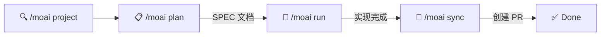
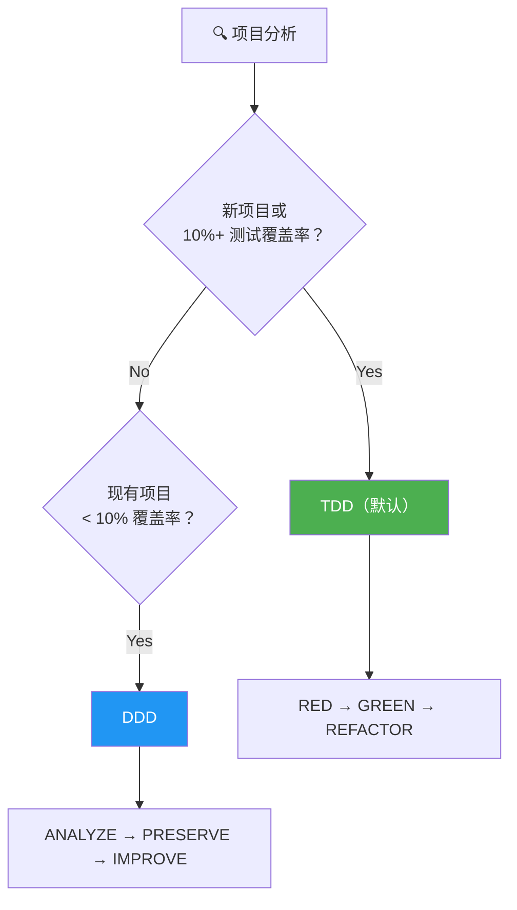
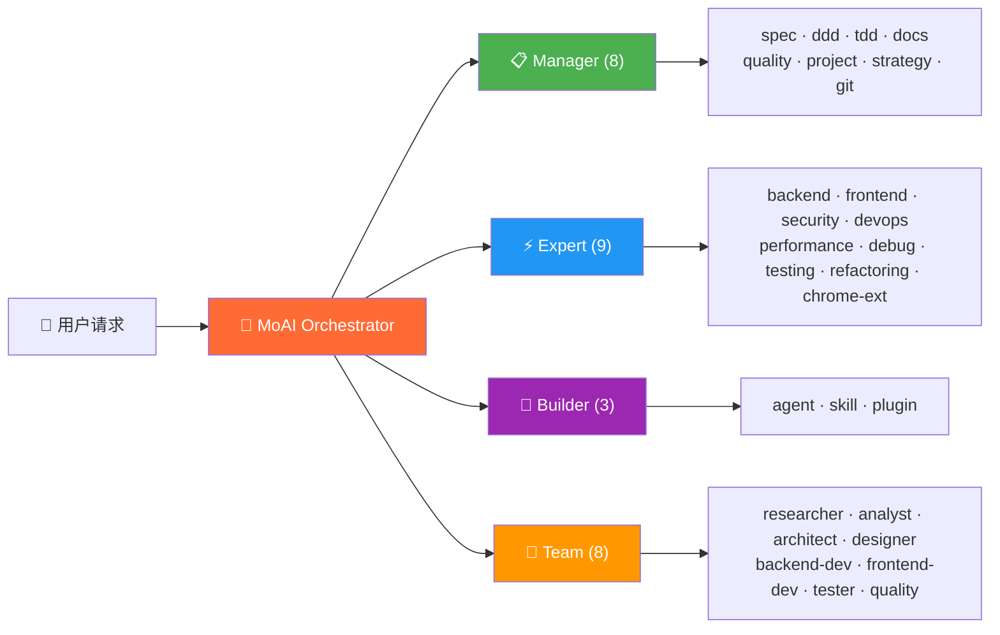
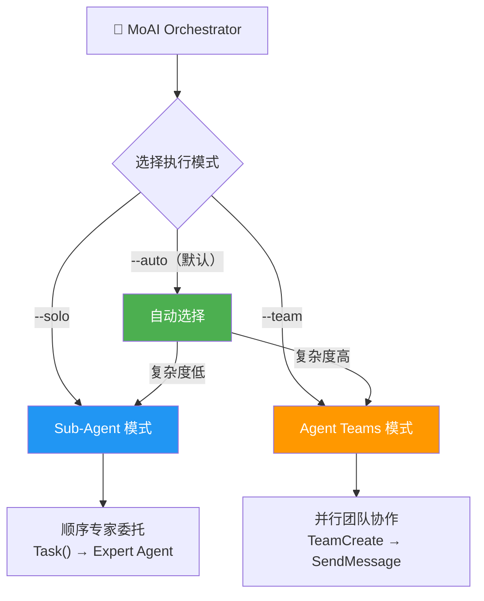
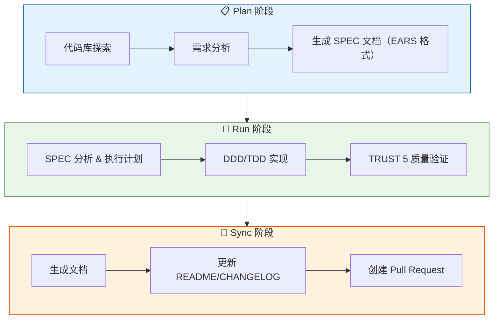

<p align="center">
  
</p>

<h1 align="center">MoAI-ADK</h1>

<p align="center">
  <strong>Claude Code 的 Agentic Development Kit</strong>
</p>

<p align="center">
  <a href="./README.md">English</a> ·
  <a href="./README.ko.md">한국어</a> ·
  <a href="./README.ja.md">日本語</a> ·
  <a href="./README.zh.md">中文</a>
</p>

<p align="center">
  <a href="https://github.com/modu-ai/moai-adk/actions/workflows/ci.yml"></a>
  <a href="https://github.com/modu-ai/moai-adk/actions/workflows/codeql.yml"></a>
  <a href="https://codecov.io/gh/modu-ai/moai-adk"></a>
  <br>
  <a href="https://go.dev/"></a>
  <a href="https://github.com/modu-ai/moai-adk/releases"></a>
  <a href="./LICENSE"></a>
</p>

<p align="center">
  <a href="https://adk.mo.ai.kr"><strong>Official Documentation</strong></a>
</p>

---

> 📚 **[官方文档](https://adk.mo.ai.kr)** | **[GitHub Discussions](https://github.com/modu-ai/moai-adk/discussions)**

---

> **"氛围编程的目的不是追求速度，而是代码质量。"**

MoAI-ADK 是专为 Claude Code 打造的**高性能 AI 开发环境**。28 个专业 AI 智能体与 52 个技能协同工作，助力产出高质量代码。新项目和功能开发默认采用 TDD，覆盖率低于 10% 的现有项目自动采用 DDD，并支持 Sub-Agent 与 Agent Teams 双执行模式。

使用 Go 编写的单一可执行文件 -- 零依赖，全平台即刻运行。

---

## 为什么选择 MoAI-ADK？

我们将基于 Python 的 MoAI-ADK（约 73,000 行）用 Go 完全重写。

| 项目 | Python 版 | Go 版 |
|------|-----------|-------|
| 部署 | pip + venv + 依赖管理 | **单一可执行文件**，零依赖 |
| 启动时间 | ~800ms 解释器启动 | **~5ms** 原生执行 |
| 并发性 | asyncio / threading | **原生 goroutines** |
| 类型安全 | 运行时（mypy 可选） | **编译时强制** |
| 跨平台 | 需要 Python 运行时 | **预构建二进制**（macOS、Linux、Windows） |
| 钩子执行 | Shell 包装器 + Python | **编译后的二进制**，JSON 协议 |

### 核心数据

- **34,220 行** Go 代码，**32 个**包
- **85-100%** 测试覆盖率
- **28 个**专业 AI 智能体 + **52 个**技能
- **18 种**编程语言支持
- **8 个** Claude Code 钩子事件

---

## 系统要求

| 平台 | 支持环境 | 备注 |
|------|---------|------|
| macOS | Terminal, iTerm2 | 完全支持 |
| Linux | Bash, Zsh | 完全支持 |
| Windows | **WSL（推荐）**, PowerShell 7.x+ | 原生 cmd.exe 不支持 |

**前置条件：**
- 所有平台必须安装 **Git**
- **Windows 用户**：必须安装 [Git for Windows](https://gitforwindows.org/)（包含 Git Bash）
  - 推荐使用 **WSL**（适用于 Linux 的 Windows 子系统）
  - 也支持 PowerShell 7.x 及以上版本
  - 旧版 Windows PowerShell 5.x 和 cmd.exe **不受支持**

---

## 快速入门

### 1. 安装

#### macOS / Linux / WSL

```bash
curl -fsSL https://raw.githubusercontent.com/modu-ai/moai-adk/main/install.sh | bash
```

#### Windows（PowerShell 7.x+）

> **推荐**：为获得最佳体验，请在 WSL 中使用上面的 Linux 安装命令。

```powershell
irm https://raw.githubusercontent.com/modu-ai/moai-adk/main/install.ps1 | iex
```

> 需要先安装 [Git for Windows](https://gitforwindows.org/)。

#### 从源码构建（Go 1.25+）

```bash
git clone https://github.com/modu-ai/moai-adk.git
cd moai-adk && make build
```

> 预构建二进制可在 [Releases](https://github.com/modu-ai/moai-adk/releases) 页面下载。

### 2. 初始化项目

```bash
moai init my-project
```

交互式向导将自动检测语言、框架和方法论，并生成 Claude Code 集成文件。

### 3. 在 Claude Code 中开始开发

```bash
# 启动 Claude Code 后
/moai project                            # 生成项目文档（product.md, structure.md, tech.md）
/moai plan "添加用户认证功能"              # 生成 SPEC 文档
/moai run SPEC-AUTH-001                   # DDD/TDD 实现
/moai sync SPEC-AUTH-001                  # 文档同步 & 创建 PR
```



---

## MoAI 开发方法论

MoAI-ADK 根据项目状态自动选择最优的开发方法论。



### TDD 方法论（默认）

新项目和功能开发推荐的默认方法论。先写测试，再实现代码。

| 阶段 | 说明 |
|------|------|
| **RED** | 编写定义期望行为的失败测试 |
| **GREEN** | 编写使测试通过的最小代码 |
| **REFACTOR** | 在保持测试绿色的同时提升代码质量 |

对于棕地项目（现有代码库），TDD 增加了 **RED 前分析步骤**：在编写测试前先阅读现有代码，了解当前行为。

### DDD 方法论（覆盖率 < 10% 的现有项目）

专为测试覆盖率较低的现有项目安全重构而设计的方法论。

```
ANALYZE   → 分析现有代码和依赖关系，识别领域边界
PRESERVE  → 编写特征测试，捕获当前行为快照
IMPROVE   → 在测试保护下渐进改进
```

> 方法论在 `moai init` 时自动选定（`--mode <ddd|tdd>`，默认: tdd），可在 `.moai/config/sections/quality.yaml` 的 `development_mode` 中修改。

---

## AI 智能体编排

MoAI 是一个**战略编排器**。它不直接编写代码，而是将任务委托给 28 个专业智能体。



### 智能体分类

| 分类 | 数量 | 智能体 | 职责 |
|------|------|--------|------|
| **Manager** | 8 | spec, ddd, tdd, docs, quality, project, strategy, git | 工作流编排、SPEC 生成、质量管理 |
| **Expert** | 9 | backend, frontend, security, devops, performance, debug, testing, refactoring, chrome-extension | 领域专业实现、分析、优化 |
| **Builder** | 3 | agent, skill, plugin | 创建新的 MoAI 组件 |
| **Team** | 8 | researcher, analyst, architect, designer, backend-dev, frontend-dev, tester, quality | 并行团队协作开发 |

### 52 个技能（渐进式披露）

为优化 Token 效率，采用三级渐进式披露系统管理：

| 分类 | 技能数 | 示例 |
|------|--------|------|
| **Foundation** | 5 | core, claude, philosopher, quality, context |
| **Workflow** | 11 | spec, project, ddd, tdd, testing, worktree, thinking... |
| **Domain** | 5 | backend, frontend, database, uiux, data-formats |
| **Language** | 18 | Go, Python, TypeScript, Rust, Java, Kotlin, Swift, C++... |
| **Platform** | 9 | Vercel, Supabase, Firebase, Auth0, Clerk, Railway... |
| **Library** | 3 | shadcn, nextra, mermaid |
| **Tool** | 2 | ast-grep, svg |
| **Specialist** | 11 | Figma, Flutter, Chrome Extension, Pencil... |

---

## 模型策略（Token 优化）

MoAI-ADK 根据您的 Claude Code 订阅方案，为 28 个智能体分配最优 AI 模型。在方案的速率限制内最大化质量。

| 策略 | 方案 | 🟣 Opus | 🔵 Sonnet | 🟡 Haiku | 适用场景 |
|------|------|------|--------|-------|----------|
| **High** | Max $200/月 | 23 | 1 | 4 | 最高质量，最大吞吐量 |
| **Medium** | Max $100/月 | 4 | 19 | 5 | 质量与成本平衡 |
| **Low** | Plus $20/月 | 0 | 12 | 16 | 经济实惠，无 Opus |

> **为什么重要？** Plus $20 方案不包含 Opus。设置为 `Low` 后，所有智能体仅使用 Sonnet 和 Haiku，避免速率限制错误。更高级方案可在关键智能体（安全、策略、架构）上使用 Opus，常规任务使用 Sonnet/Haiku。

### 各档位智能体模型分配

#### Manager Agents

| 智能体 | High | Medium | Low |
|--------|------|--------|-----|
| manager-spec | 🟣 opus | 🟣 opus | 🔵 sonnet |
| manager-strategy | 🟣 opus | 🟣 opus | 🔵 sonnet |
| manager-ddd | 🟣 opus | 🔵 sonnet | 🔵 sonnet |
| manager-tdd | 🟣 opus | 🔵 sonnet | 🔵 sonnet |
| manager-project | 🟣 opus | 🔵 sonnet | 🟡 haiku |
| manager-docs | 🔵 sonnet | 🟡 haiku | 🟡 haiku |
| manager-quality | 🟡 haiku | 🟡 haiku | 🟡 haiku |
| manager-git | 🟡 haiku | 🟡 haiku | 🟡 haiku |

#### Expert Agents

| 智能体 | High | Medium | Low |
|--------|------|--------|-----|
| expert-backend | 🟣 opus | 🔵 sonnet | 🔵 sonnet |
| expert-frontend | 🟣 opus | 🔵 sonnet | 🔵 sonnet |
| expert-security | 🟣 opus | 🟣 opus | 🔵 sonnet |
| expert-debug | 🟣 opus | 🔵 sonnet | 🔵 sonnet |
| expert-refactoring | 🟣 opus | 🔵 sonnet | 🔵 sonnet |
| expert-devops | 🟣 opus | 🔵 sonnet | 🟡 haiku |
| expert-performance | 🟣 opus | 🔵 sonnet | 🟡 haiku |
| expert-testing | 🟣 opus | 🔵 sonnet | 🟡 haiku |
| expert-chrome-extension | 🟣 opus | 🔵 sonnet | 🟡 haiku |

#### Builder Agents

| 智能体 | High | Medium | Low |
|--------|------|--------|-----|
| builder-agent | 🟣 opus | 🔵 sonnet | 🟡 haiku |
| builder-skill | 🟣 opus | 🔵 sonnet | 🟡 haiku |
| builder-plugin | 🟣 opus | 🔵 sonnet | 🟡 haiku |

#### Team Agents

| 智能体 | High | Medium | Low |
|--------|------|--------|-----|
| team-architect | 🟣 opus | 🟣 opus | 🔵 sonnet |
| team-analyst | 🟣 opus | 🔵 sonnet | 🟡 haiku |
| team-designer | 🟣 opus | 🔵 sonnet | 🟡 haiku |
| team-backend-dev | 🟣 opus | 🔵 sonnet | 🔵 sonnet |
| team-frontend-dev | 🟣 opus | 🔵 sonnet | 🔵 sonnet |
| team-tester | 🟣 opus | 🔵 sonnet | 🟡 haiku |
| team-researcher | 🟡 haiku | 🟡 haiku | 🟡 haiku |
| team-quality | 🟡 haiku | 🟡 haiku | 🟡 haiku |

### 配置方法

```bash
# 项目初始化时
moai init my-project          # 交互式向导中选择模型策略

# 重新配置现有项目
moai update -c                # 重新运行配置向导
```

> 默认策略为 `High`。运行 `moai update` 后，会提示您通过 `moai update -c` 配置此设置。

---

## 双执行模式

MoAI-ADK 同时提供 Claude Code 支持的 **Sub-Agent** 和 **Agent Teams** 两种执行模式。



### Sub-Agent 模式 (`--solo`)

利用 Claude Code 的 `Task()` API 实现顺序智能体委托方式。

- 将任务委托给一个专业智能体并获取结果
- 按步骤依次执行 Manager → Expert → Quality
- 适用于简单且可预测的工作流

```bash
/moai run SPEC-AUTH-001 --solo    # 强制 Sub-Agent 模式
```

### Agent Teams 模式 (`--team`)

利用 Claude Code 的 Agent Teams API 实现并行团队协作开发方式。

- 多个智能体同时工作，通过共享任务列表协作
- 通过 `TeamCreate`、`SendMessage`、`TaskList` 进行实时协调
- 适用于大规模功能开发和多领域任务

```bash
/moai plan "大型功能" --team      # Plan: researcher + analyst + architect 并行
/moai run SPEC-XXX --team         # Run: backend-dev + frontend-dev + tester 并行
```

### 自动模式 (`--auto`，默认值)

分析项目复杂度后自动选择最优模式：

| 条件 | 选择模式 |
|------|----------|
| 领域 3 个以上 | Agent Teams |
| 影响文件 10 个以上 | Agent Teams |
| 复杂度评分 7 以上 | Agent Teams |
| 其他 | Sub-Agent |

---

## MoAI 工作流

### Plan → Run → Sync 流水线

MoAI 的核心工作流由三个阶段组成：



### 自主开发循环（Ralph Engine）

结合 LSP 诊断和 AST-grep 的自主错误修复引擎：

```bash
/moai fix       # 单次执行：扫描 → 分类 → 修复 → 验证
/moai loop      # 循环修复：重复执行直到检测到完成标记（最多 100 次）
```

**Ralph Engine 工作流程：**
1. **并行扫描**：同时运行 LSP 诊断 + AST-grep + Linter
2. **自动分类**：将错误分为 Level 1（自动修复）至 Level 4（需用户介入）
3. **收敛检测**：相同错误重复出现时启用备选策略
4. **完成条件**：0 错误、0 类型错误、85%+ 覆盖率

---

## TRUST 5 质量框架

所有代码变更均通过五项质量标准验证：

| 标准 | 说明 | 验证项 |
|------|------|--------|
| **T**ested | 已测试 | 85%+ 覆盖率、特征测试、单元测试通过 |
| **R**eadable | 可读性 | 清晰的命名规范、一致的代码风格、0 Lint 错误 |
| **U**nified | 统一性 | 一致的格式化、导入顺序、遵循项目结构 |
| **S**ecured | 安全性 | OWASP 合规、输入验证、0 安全警告 |
| **T**rackable | 可追溯 | 约定式提交、Issue 引用、结构化日志 |

---

## CLI 命令

| 命令 | 说明 |
|------|------|
| `moai init` | 交互式项目设置（自动检测语言/框架/方法论） |
| `moai doctor` | 系统状态诊断与环境验证 |
| `moai status` | 项目状态概览：Git 分支、质量指标等 |
| `moai update` | 更新到最新版本（支持自动回滚） |
| `moai update --check` | 仅检查更新，不安装 |
| `moai update --project` | 仅同步项目模板 |
| `moai worktree new <name>` | 创建新 Git worktree（并行分支开发） |
| `moai worktree list` | 列出活跃的 worktree |
| `moai worktree switch <name>` | 切换 worktree |
| `moai worktree sync` | 与上游同步 |
| `moai worktree remove <name>` | 移除 worktree |
| `moai worktree clean` | 清理过期 worktree |
| `moai worktree go <name>` | 在当前 Shell 中导航到 worktree 目录 |
| `moai hook <event>` | Claude Code 钩子分发器 |
| `moai version` | 版本、提交哈希、构建日期信息 |

---

## 架构

```
moai-adk/
├── cmd/moai/             # 应用程序入口
├── internal/             # 核心私有包
│   ├── astgrep/          # AST-grep 集成
│   ├── cli/              # Cobra CLI 命令定义
│   ├── config/           # 线程安全 YAML 配置管理
│   ├── core/
│   │   ├── git/          # Git 操作（分支、worktree、冲突检测）
│   │   ├── project/      # 项目初始化、语言/框架检测
│   │   └── quality/      # TRUST 5 质量门禁、并行验证器
│   ├── defs/             # 语言定义和框架检测
│   ├── git/              # Git 约定验证引擎
│   ├── hook/             # 编译后的钩子系统（8 个事件、JSON 协议）
│   ├── loop/             # Ralph 反馈循环（状态机、收敛检测）
│   ├── lsp/              # LSP 客户端（16+ 种语言、并行服务器管理）
│   ├── manifest/         # 文件来源追踪（SHA-256 完整性）
│   ├── merge/            # 三路合并引擎（6 种策略）
│   ├── rank/             # MoAI Rank 同步和记录管理
│   ├── resilience/       # 重试策略和熔断器
│   ├── shell/            # Shell 集成（worktree 导航）
│   ├── statusline/       # Claude Code 状态栏集成
│   ├── template/         # 模板部署（go:embed）、配置生成
│   ├── ui/               # 交互式 TUI（选择器、复选框、向导）
│   └── update/           # 二进制自更新机制
├── pkg/                  # 公共库包
│   ├── models/           # 共享数据模型
│   └── version/          # 构建版本元数据
└── Makefile              # 构建自动化
```

### 主要包覆盖率

| 包 | 用途 | 覆盖率 |
|----|------|--------|
| `foundation` | EARS 模式、TRUST 5、18 种语言定义 | 98.4% |
| `core/quality` | 并行验证器、阶段门禁 | 96.8% |
| `ui` | 交互式 TUI 组件 | 96.8% |
| `config` | 线程安全 YAML 配置 | 94.1% |
| `loop` | Ralph 反馈循环、收敛检测 | 92.7% |
| `cli` | Cobra 命令 | 92.0% |
| `ralph` | 收敛决策引擎 | 100% |
| `statusline` | Claude Code 状态栏 | 100% |

---

## 赞助商

### z.ai GLM 5

MoAI-ADK 通过与 **z.ai GLM 5** 的合作伙伴关系，提供经济高效的 AI 开发环境。

| 优势 | 说明 |
|------|------|
| 节省 70% 成本 | 仅为 Claude 1/7 的价格，性能相当 |
| 完全兼容 | 无需修改代码即可与 Claude Code 配合使用 |
| 无限使用 | 无每日/每周 Token 限制，自由使用 |

**[注册 GLM 5（额外 10% 折扣）](https://z.ai/subscribe?ic=1NDV03BGWU)** -- 注册奖励将用于 MoAI 开源开发。

---

## 贡献

欢迎贡献！详细指南请参阅 [CONTRIBUTING.md](CONTRIBUTING.md)。

### 快速入门

1. Fork 本仓库
2. 创建功能分支：`git checkout -b feature/my-feature`
3. 编写测试（新代码用 TDD，现有代码用特征测试）
4. 确认所有测试通过：`make test`
5. 确认 Lint 通过：`make lint`
6. 格式化代码：`make fmt`
7. 使用约定式提交信息提交
8. 提交 Pull Request

**代码质量要求**：85%+ 覆盖率 · 0 Lint 错误 · 0 类型错误 · 约定式提交

### 社区

- [GitHub Discussions](https://github.com/modu-ai/moai-adk/discussions) -- 提问、想法、反馈
- [Issues](https://github.com/modu-ai/moai-adk/issues) -- Bug 报告、功能请求

---

## Star History

[](https://www.star-history.com/#modu-ai/moai-adk&type=date&legend=top-left)

---

## 许可证

[Copyleft 3.0](./LICENSE) -- 详情请参阅 LICENSE 文件。

## 相关链接

- [官方文档](https://adk.mo.ai.kr)
- [Claude Code](https://docs.anthropic.com/en/docs/claude-code)
- [GitHub Discussions](https://github.com/modu-ai/moai-adk/discussions) -- 提问、想法、社区
