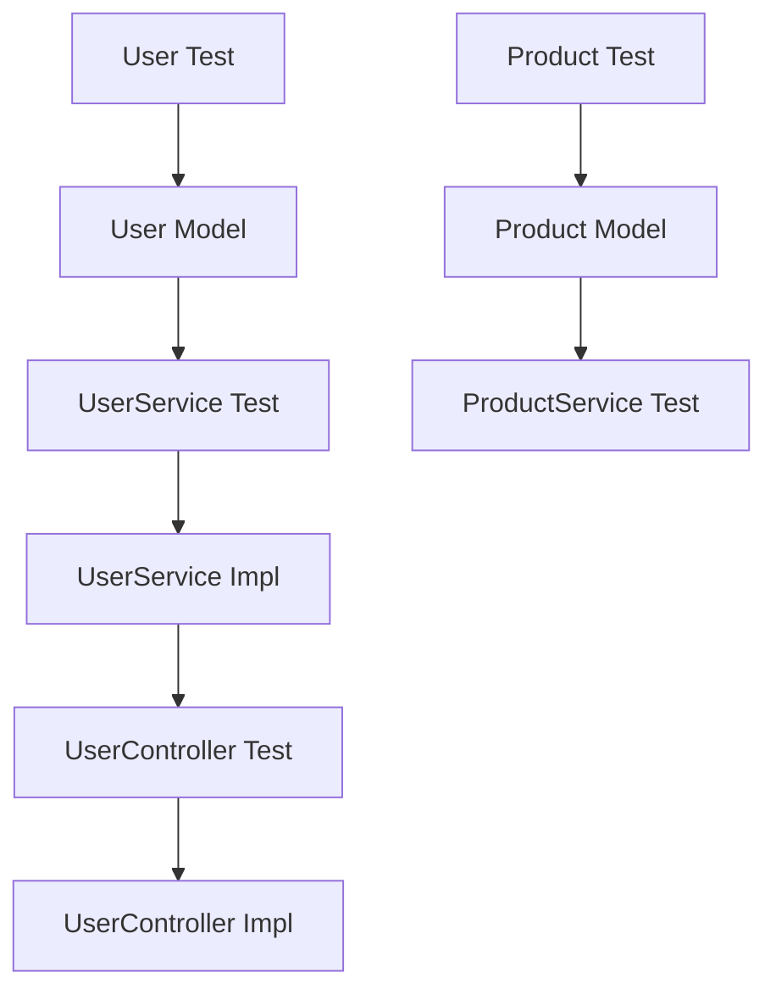

# 🧩 MoAI-ADK TDD 작업 분해 시스템

수립된 계획을 실제 구현 가능한 작업 단위로 분해하는 핵심 단계로, TDD(Test-Driven Development) 방법론에 엄격히 따라 테스트가 먼저 작성되도록 작업 순서를 결정합니다. [P] 마커를 통해 병렬 실행 가능한 작업을 식별하고, 의존성 그래프를 최적화하여 개발 속도를 극대화합니다.

> 참고: `.moai/memory/common.md` 와 스택별 메모는 작업 분해 시 고려해야 할 언어/프레임워크별 테스트·품질 기준을 제공합니다.

## 🎯 실행 플로우

```mermaid
flowchart TD
    A[plan.md 로드] --> B{계획 문서 존재?}
    B -->|없음| C[❌ ERROR: No plan found]
    B -->|존재| D[📚 설계 문서 분석]
    
    D --> E[📋 data-model.md 분석]
    E --> F[📄 contracts/ 분석]
    F --> G[🏗️ 태스크 생성 규칙 적용]
    
    G --> H[🔢 태스크 번호 매기기]
    H --> I[🕸️ 의존성 그래프 생성]
    I --> J[✅ 검증 체크리스트]
    
    J --> K{검증 통과?}
    K -->|실패| L[⚠️ 경고 및 수정 제안]
    K -->|성공| M[📝 tasks.md 생성]
    M --> N[🚀 /moai:5-dev 준비 완료]
```



## 🤖 자연어 체이닝 오케스트레이션

🤖 **TDD 기반 작업 분해를 전문 에이전트 체인으로 완전 자동화합니다.**

**계획 분석 단계**: Task tool을 사용하여 task-analyzer 에이전트를 호출하여 plan.md, data-model.md, contracts/ 문서를 종합 분석하고 구현 가능한 작업 단위로 분해합니다.

**의존성 최적화 단계**: Task tool을 사용하여 dependency-optimizer 에이전트를 호출하여 작업 간 의존성 그래프를 생성하고 병렬 실행([P] 마커)을 통한 최적화된 실행 순서를 결정합니다.

**TDD 순서 보장 단계**: Task tool을 사용하여 tdd-sequencer 에이전트를 호출하여 모든 구현 작업 전에 테스트가 먼저 작성되도록 Red-Green-Refactor 사이클을 강제하는 순서를 확정합니다.

## 🏗️ 태스크 생성 규칙

### 1. TDD 우선 원칙 (Test-First)
```markdown
모든 기능 구현은 테스트가 먼저 작성되어야 함:

✅ 올바른 순서:
T001: [TEST] User 모델 테스트 작성
T002: [CODE] User 모델 구현
T003: [TEST] UserService 테스트 작성  
T004: [CODE] UserService 구현

❌ 잘못된 순서:
T001: [CODE] User 모델 구현
T002: [TEST] User 모델 테스트 작성
```

### 2. 파일 기반 병렬/순차 분류
```markdown
━━━━━━━━━━━━━━━━━━━━━━━━━━━━━━━━━━━━━━━━
🔄 병렬 실행 [P] - 다른 파일 수정
━━━━━━━━━━━━━━━━━━━━━━━━━━━━━━━━━━━━━━━━

T001: [P] User.test.ts 작성
T002: [P] Product.test.ts 작성  
T003: [P] Order.test.ts 작성
→ 동시 실행 가능 (다른 파일)

━━━━━━━━━━━━━━━━━━━━━━━━━━━━━━━━━━━━━━━━
➡️ 순차 실행 - 같은 파일 수정
━━━━━━━━━━━━━━━━━━━━━━━━━━━━━━━━━━━━━━━━

T004: User.ts 기본 구조 생성
T005: User.ts 검증 로직 추가
T006: User.ts 비즈니스 메서드 추가
→ 순차 실행 필수 (같은 파일)
```

### 3. 태스크 타입 분류
```markdown
[TEST]: 테스트 코드 작성
[CODE]: 구현 코드 작성
[API]: API 엔드포인트 구현
[MODEL]: 데이터 모델 정의
[SERVICE]: 비즈니스 로직 구현
[UI]: 사용자 인터페이스 구현
[INTEGRATION]: 통합 테스트
[E2E]: End-to-End 테스트
```

## 🔢 태스크 번호 체계

### 번호 매기기 규칙
```markdown
T001, T002, T003... (3자리 0 패딩)

T001-T099: 모델 계층 (데이터, 엔티티)
T100-T199: 서비스 계층 (비즈니스 로직)  
T200-T299: API 계층 (컨트롤러, 라우팅)
T300-T399: UI 계층 (컴포넌트, 화면)
T400-T499: 통합 테스트
T500-T599: E2E 테스트
T600-T699: 배포 및 인프라
T700-T799: 문서화
T800-T899: 성능 최적화
T900-T999: 리팩토링 및 개선
```

### 우선순위 표기
```markdown
[P0]: 긴급 (프로젝트 차단 요소)
[P1]: 높음 (핵심 기능)
[P2]: 보통 (일반 기능)
[P3]: 낮음 (부가 기능)
```

## 🕸️ 의존성 그래프 생성

### 의존성 관계 정의
```markdown
# 의존성 그래프 예시

T001 [TEST] User 모델 테스트
  ↓
T002 [CODE] User 모델 구현
  ↓
T003 [TEST] UserService 테스트 (depends: T002)
  ↓
T004 [CODE] UserService 구현 (depends: T002)
  ↓
T005 [TEST] UserController 테스트 (depends: T004)
  ↓
T006 [API] UserController 구현 (depends: T004)

병렬 실행 가능:
- T001, T007, T013 (각각 다른 모델의 첫 테스트)
- T002, T008, T014 (각각 다른 모델 구현)
```

### 의존성 최적화 전략
```markdown
1. **Critical Path 식별**: 가장 긴 의존성 체인 우선
2. **병렬화 극대화**: 독립적 작업 동시 실행
3. **블로킹 최소화**: 의존성 순환 방지
4. **리소스 효율화**: 개발자 수에 맞는 병렬 작업 수 조정
```

## ✅ 검증 체크리스트

### 1. 완전성 검증
```markdown
✓ 모든 데이터 모델에 대한 테스트가 있는가?
✓ 모든 API 계약에 대한 구현 태스크가 있는가?
✓ 모든 비즈니스 로직에 대한 테스트가 있는가?
✓ 통합 테스트 및 E2E 테스트가 포함되어 있는가?
```

### 2. TDD 순서 검증  
```markdown
✓ 모든 구현 전에 테스트가 먼저 작성되는가?
✓ Red-Green-Refactor 사이클을 따르는가?
✓ 테스트 커버리지가 목표치(80%)에 도달할 수 있는가?
```

### 3. 의존성 검증
```markdown
✓ 순환 의존성이 없는가?
✓ 병렬 실행 가능한 작업이 올바르게 표시되었는가?
✓ 크리티컬 패스가 최적화되어 있는가?
✓ 블로킹 요소가 최소화되어 있는가?
```

## 📝 tasks.md 생성 형식

```markdown
# SPEC-001 구현 작업 분해

## 📊 작업 통계
- 총 작업 수: 45개
- 병렬 실행 가능: 18개 ([P] 마커)
- 순차 실행 필요: 27개
- 예상 개발 시간: 12-15일 (3명 개발팀 기준)

## 🏷️ 태그 매핑
@TASK:T001-T099 → @REQ:USER-MANAGEMENT
@TASK:T100-T199 → @REQ:AUTHENTICATION  
@TASK:T200-T299 → @REQ:API-ENDPOINTS

## 📋 작업 목록

### 🏗️ Phase 1: 모델 계층 (T001-T050)

#### T001 [P] [P1] User 모델 테스트 작성
- **파일**: `tests/unit/models/User.test.ts`
- **의존성**: 없음
- **예상 시간**: 2시간
- **태그**: @TEST:USER-MODEL @REQ:USER-001
- **설명**: User 엔티티의 생성, 검증, 변환 로직 테스트

#### T002 [P1] User 모델 구현
- **파일**: `src/models/User.ts`
- **의존성**: T001 (테스트 통과)
- **예상 시간**: 3시간
- **태그**: @MODEL:USER @REQ:USER-001  
- **설명**: User 엔티티 클래스 구현, 검증 로직 포함

#### T003 [P] [P1] UserService 테스트 작성
- **파일**: `tests/unit/services/UserService.test.ts`
- **의존성**: T002 (User 모델 완료)
- **예상 시간**: 3시간
- **태그**: @TEST:USER-SERVICE @REQ:USER-002
- **설명**: 사용자 CRUD 및 비즈니스 로직 테스트

### 🔧 Phase 2: 서비스 계층 (T100-T150)
[계속...]

## 🕸️ 의존성 그래프



## ⚡ 병렬 실행 최적화

### Wave 1 (동시 실행 가능)
- T001: User 모델 테스트
- T005: Product 모델 테스트  
- T010: Order 모델 테스트
- T015: Category 모델 테스트

### Wave 2 (Wave 1 완료 후)
- T002: User 모델 구현
- T006: Product 모델 구현
- T011: Order 모델 구현
- T016: Category 모델 구현
```

## ⚠️ 에러 처리

### plan.md 파일 없음
```markdown
❌ ERROR: plan.md 파일을 찾을 수 없습니다.

먼저 다음 명령으로 계획을 수립해주세요:
> /moai:3-plan SPEC-XXX

계획 파일 경로: .moai/specs/SPEC-XXX/plan.md
```

### 설계 문서 불완전
```markdown
⚠️ WARNING: 설계 문서가 불완전합니다.

누락된 문서:
- data-model.md: 데이터 모델 정의 필요
- contracts/: API 계약 정의 필요

/moai:3-plan 명령을 다시 실행하여 완성해주세요.
```

### 의존성 순환 감지
```markdown
🔴 ERROR: 순환 의존성이 감지되었습니다.

순환 경로:
T004 → T008 → T012 → T004

해결 방법:
1. 의존성 역전 원칙 적용
2. 인터페이스 분리를 통한 디커플링
3. 공통 기능의 별도 모듈 분리
```

## 🎯 사용 예시

### 기본 사용법
```bash
# SPEC-001에 대한 작업 분해
> /moai:4-tasks SPEC-001

# 병렬 작업만 표시
> /moai:4-tasks SPEC-001 --parallel-only

# 순차 작업만 표시  
> /moai:4-tasks SPEC-001 --sequential-only

# 실제 생성 없이 미리보기
> /moai:4-tasks SPEC-001 --dry-run
```

### 고급 사용법
```bash
# 특정 우선순위만 포함
> /moai:4-tasks SPEC-001 --priority=P1,P2

# 특정 레이어만 분해
> /moai:4-tasks SPEC-001 --layers=model,service

# 커스텀 번호 시작점
> /moai:4-tasks SPEC-001 --start-from=T100
```

## ✅ 완료 시 산출물

```markdown
✅ TDD 작업 분해가 완료되었습니다!

📊 분해 결과:
  - 총 작업 수: 45개
  - 병렬 실행: 18개 ([P] 마커)
  - 순차 실행: 27개
  - 예상 기간: 12-15일 (3명 팀 기준)

📁 생성된 파일:
  ├── .moai/specs/SPEC-001/
  │   ├── tasks.md          # 상세 작업 분해
  │   ├── dependency-graph.md  # 의존성 시각화
  │   └── parallel-waves.md    # 병렬 실행 계획
  └── .moai/indexes/
      └── tasks-T001-T045.json # 태스크 인덱스

🕸️ 의존성 최적화:
  - Critical Path: 8일 (T001→T002→...→T045)
  - 병렬화 효과: 65% 시간 단축
  - 리소스 효율: 3명 최적 배치

🚀 다음 단계:
  1. 첫 Wave 작업 시작: /moai:5-dev T001
  2. 병렬 작업 동시 진행: /moai:5-dev T001,T005,T010
  3. 진행 상황 모니터링: /moai:6-sync status

💡 Pro Tip: Hook 시스템이 TDD 순서를 자동으로 강제합니다.
각 작업마다 테스트가 먼저 통과해야 다음 단계로 진행 가능합니다.
```

## 🔄 `all` 옵션 - 전체 SPEC 병렬 작업 분해

### 기능 개요
- `.moai/specs/` 디렉터리의 모든 계획된 SPEC(plan.md 존재)을 자동 감지
- 각 SPEC별로 TDD 작업 분해를 병렬 실행 (**최대 10개 동시 실행**)
- **task-decomposer 에이전트**가 의존성 없는 작업 분해를 병렬 분산 처리
- Sprint 단위로 전체 프로젝트 일정을 균등 분배

### 실행 과정
```mermaid
flowchart TD
    A[/moai:4-tasks all 실행] --> B[SPEC 디렉터리 스캔]
    B --> C[plan.md가 있는 SPEC 선별]
    C --> D[우선순위별 정렬 P0→P1→P2]

    D --> E[병렬 작업 분해 시작]
    E --> F[각 SPEC별 task-decomposer 에이전트 호출]
    F --> G[병렬 실행: TASKS-001, TASKS-002, TASKS-003...]
    G --> H[TDD 순서 최적화]
    H --> I[전체 완료 보고]
```

### 생성 결과
```bash
**전체 SPEC 작업 분해 완료**:

처리된 SPEC 목록:
├── SPEC-001: 사용자 인증 시스템 (P0) → 12개 태스크 ✅
├── SPEC-002: 결제 처리 시스템 (P0) → 18개 태스크 ✅
├── SPEC-003: 실시간 알림 시스템 (P1) → 8개 태스크 ✅
├── SPEC-004: 관리자 대시보드 (P1) → 15개 태스크 ✅
└── SPEC-005: 모니터링 시스템 (P2) → 10개 태스크 ✅

작업 분해 통계:
- 총 태스크 수: 63개
- 병렬 실행 가능: 28개 ([P] 마커)
- 순차 실행 필요: 35개
- 예상 Sprint: 3-4 Sprint (2주 단위)

총 처리 시간: 2분 45초
병렬 처리 효과: 단일 처리 대비 75% 시간 단축 (최대 10개 동시 실행)
전문 에이전트 활용: task-decomposer 에이전트가 독립적으로 각 SPEC 작업 분해

다음 단계:
> /moai:5-dev all  # 전체 태스크 병렬 구현
```

### 고급 사용법
```bash
# Sprint 단위 분해
/moai:4-tasks all --sprint 2weeks

# 병렬 작업만 추출
/moai:4-tasks all --parallel-only

# 특정 우선순위만
/moai:4-tasks all --priority P0,P1
```

## 🔍 참고 문서

이 명령어는 다음 방법론을 구현합니다:
- **TDD-First**: 모든 구현 전 테스트 우선 작성
- **Dependency Optimization**: 의존성 그래프 기반 최적 실행 순서
- **Parallel Execution**: 파일 기반 병렬 작업 식별
- **Quality Gates**: 각 단계별 자동 검증 체크포인트
## 🔁 응답 구조(필수)
항상 3단계 구조로 응답: 1) Phase 1 Results  2) Phase 2 Plan  3) Phase 3 Implementation.  
작업 분해는 TDD/Clean Code 원칙을 포함: @.claude/memory/three_phase_process.md, @.claude/memory/tdd_guidelines.md
