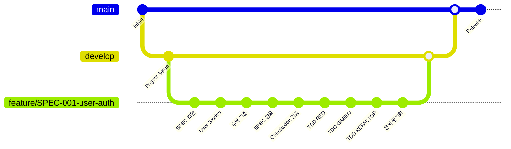

# MoAI-ADK  GitFlow 통합 가이드

> **사용자는 Git 명령어를 전혀 알 필요가 없습니다. 모든 것이 자동으로 처리됩니다.**

## 🗿 개요

MoAI-ADK 은 GitFlow를 완전히 통합하여 버전 관리가 완전히 투명하게 처리됩니다. 사용자는 MoAI 명령어만 실행하면 Git 작업이 자동으로 수행됩니다.

## 🔄 자동화된 GitFlow 워크플로우

### 전체 흐름도



## 📋 단계별 자동화

### 1단계: `/moai:1-spec` - SPEC 작성 + GitFlow

```bash
/moai:1-spec "JWT 기반 사용자 인증 시스템"
```

**자동으로 수행되는 Git 작업:**

1. **브랜치 생성**
   ```bash
   # 자동 실행 (사용자 불가시)
   git checkout develop
   git pull origin develop
   git checkout -b feature/SPEC-001-user-auth
   git push -u origin feature/SPEC-001-user-auth
   ```

2. **단계별 커밋** (4단계)
   ```bash
   # 1. SPEC 초안
   git add .moai/specs/SPEC-001/spec.md
   git commit -m "feat(SPEC-001): Add initial EARS requirements draft"

   # 2. User Stories
   git add .moai/specs/SPEC-001/user-stories.md
   git commit -m "feat(SPEC-001): Add user stories US-001~005"

   # 3. 수락 기준
   git add .moai/specs/SPEC-001/acceptance.md
   git commit -m "feat(SPEC-001): Add acceptance criteria with GWT scenarios"

   # 4. SPEC 완료
   git add .moai/specs/SPEC-001/
   git commit -m "feat(SPEC-001): Complete SPEC-001 user authentication system"
   ```

3. **Draft PR 자동 생성**
   ```bash
   # gh CLI 사용
   gh pr create --draft \
     --title "SPEC-001: 사용자 인증 시스템" \
     --body-file .moai/templates/pr-spec-template.md
   ```

**결과 출력:**
```bash
✅ SPEC 작성 + GitFlow 완료!

🔀 Git 작업 결과 (자동 완료):
├── feature/SPEC-001-user-auth 브랜치 생성 ✓
├── 4단계 커밋 완료
└── Draft PR #42 생성: "SPEC-001: 사용자 인증 시스템" ✓

🎯 다음 단계: /moai:2-build SPEC-001
```

### 2단계: `/moai:2-build` - TDD 구현 + GitFlow

```bash
/moai:2-build SPEC-001
```

**자동으로 수행되는 Git 작업:**

1. **Constitution 검증 커밋**
   ```bash
   git add .moai/plans/
   git commit -m "feat(SPEC-001): Constitution 5원칙 검증 완료"
   ```

2. **TDD 3단계 커밋**
   ```bash
   # RED 단계
   git add tests/
   git commit -m "test(SPEC-001): Add failing tests (RED phase)"

   # GREEN 단계
   git add src/ tests/
   git commit -m "feat(SPEC-001): Implement core functionality (GREEN phase)"

   # REFACTOR 단계
   git add src/ tests/
   git commit -m "refactor(SPEC-001): Code optimization and cleanup (REFACTOR phase)"
   ```

3. **PR 자동 업데이트**
   - 각 단계마다 PR에 진행 상황 댓글 추가
   - 라벨 자동 업데이트 (`stage:build`, `progress:50-85`)
   - GitHub Actions 자동 실행

### 3단계: `/moai:3-sync` - 문서 동기화 + PR Ready

```bash
/moai:3-sync
```

**자동으로 수행되는 Git 작업:**

1. **문서 동기화 커밋**
   ```bash
   git add docs/ README.md
   git commit -m "docs(SPEC-001): Update documentation and README"
   ```

2. **TAG 시스템 업데이트**
   ```bash
   git add .moai/indexes/tags.json
   git commit -m "chore(SPEC-001): Update TAG system and traceability"
   ```

3. **PR Ready 상태 변경**
   ```bash
   gh pr ready  # Draft → Ready for Review
   gh pr edit --add-reviewer "team-leads"  # 리뷰어 자동 할당
   ```

## 🔧 브랜치 전략

### 기본 브랜치 구조

```
main (프로덕션)
├── develop (개발 통합)
└── feature/ (기능 개발)
    ├── SPEC-001-user-auth      # 사용자 인증
    ├── SPEC-002-post-mgmt      # 게시글 관리
    └── SPEC-003-comment-sys    # 댓글 시스템
```

### 브랜치 명명 규칙

| 브랜치 유형 | 패턴 | 예시 |
|-------------|------|------|
| Feature | `feature/SPEC-XXX-{name}` | `feature/SPEC-001-user-auth` |
| Release | `release/v{version}` | `release/` |
| Hotfix | `hotfix/v{version}` | `hotfix/v0.2.2` |

### 자동 브랜치 관리

- **생성**: SPEC ID와 설명으로 자동 생성
- **전환**: 작업 시작 시 자동 체크아웃
- **동기화**: develop과 자동 동기화
- **정리**: 머지 후 자동 삭제 (설정 가능)

## 🤖 GitHub Actions 자동화

### 트리거 조건

| 이벤트 | 브랜치 | 동작 |
|--------|--------|------|
| Push | `feature/SPEC-*` | 품질 검증, SPEC 검증, PR 업데이트 |
| Push | `develop` | 통합 테스트, Constitution 검증 |
| Push | `main` | 배포 준비, 릴리스 태그 생성 |
| PR Open | `develop`, `main` | 전체 파이프라인 실행 |

### 자동화 기능

1. **코드 품질 검증**
   - Ruff 린팅 + 포맷팅
   - MyPy 타입 검사
   - Bandit 보안 스캔

2. **SPEC 문서 검증**
   - 필수 파일 존재 확인
   - EARS 키워드 개수 검증
   - User Stories 완성도 확인

3. **Constitution 5원칙 검증**
   - Simplicity: 파일 개수 제한
   - Architecture: 모듈형 구조 확인
   - Testing: TDD 체크리스트
   - Observability: 로깅 설정 확인
   - Versioning: GitFlow 적용 확인

4. **테스트 자동화**
   - 단위 테스트 실행
   - 통합 테스트 실행
   - 커버리지 80% 이상 검증

5. **PR 자동화**
   - 진행률 자동 업데이트
   - 라벨 자동 관리
   - Draft → Ready 자동 전환
   - 리뷰어 자동 할당

## 📊 진행률 모니터링

### PR 댓글 자동 업데이트

```markdown
## 🔄 TDD GREEN 단계 완료

JWT 기반 사용자 인증 시스템

진행률: 70% ██████████████░░░░░░

### 📋 최근 변경사항
- **커밋**: `a1b2c3d`
- **단계**: TDD GREEN
- **시간**: 2024-01-15 14:30:25

### 🎯 다음 단계
- TDD 구현 진행

---
🤖 MoAI-ADK  자동 업데이트
```

### 라벨 자동 관리

| 진행률 | Stage 라벨 | Progress 라벨 | Status 라벨 |
|--------|------------|---------------|-------------|
| 0-25% | `stage:spec` | `progress:0-25` | `draft` |
| 25-50% | `stage:constitution` | `progress:25-50` | `draft` |
| 50-85% | `stage:build` | `progress:50-85` | `draft` |
| 85-100% | `stage:sync` | `progress:85-100` | `ready-for-review` |

## 🔧 설정 및 커스터마이징

### 기본 리뷰어 설정

```bash
# 기본 리뷰어 설정
git config moai.default-reviewers "team-lead,senior-dev"

# 자동 브랜치 삭제 설정
git config moai.auto-delete-merged true

# 커밋 메시지 템플릿 설정
git config moai.commit-template ".moai/templates/commit-template.txt"
```

### GitHub CLI 설정

```bash
# GitHub CLI 인증 (최초 1회)
gh auth login

# 기본 에디터 설정
gh config set editor "code --wait"

# PR 생성 기본값 설정
gh config set git_protocol https
```

### 환경 변수 설정

```bash
# .env 파일
MOAI_DEFAULT_REVIEWERS=team-lead,senior-dev
MOAI_AUTO_DELETE_BRANCHES=true
MOAI_COMMIT_GPG_SIGN=true
MOAI_SLACK_WEBHOOK_URL=https://hooks.slack.com/...
```

## 🚨 문제 해결

### 일반적인 이슈

1. **GitHub CLI 인증 오류**
   ```bash
   # 재인증
   gh auth logout && gh auth login
   ```

2. **브랜치 충돌**
   ```bash
   # 자동 해결
   python .moai/scripts/gitflow_helper.py resolve-conflicts SPEC-001
   ```

3. **PR 생성 실패**
   ```bash
   # 수동 PR 생성 가이드
   echo "Go to: https://github.com/your-repo/compare/feature/SPEC-001-user-auth"
   ```

4. **커밋 메시지 형식 오류**
   ```bash
   # 마지막 커밋 메시지 수정
   git commit --amend -m "feat(SPEC-001): Correct commit message format"
   ```

### 복구 시나리오

1. **잘못된 브랜치에서 작업한 경우**
   ```bash
   # 자동 브랜치 이동
   python .moai/scripts/gitflow_helper.py move-commits SPEC-001 user-auth
   ```

2. **실수로 main에 커밋한 경우**
   ```bash
   # 커밋 취소 및 올바른 브랜치로 이동
   git reset --hard HEAD~1
   git checkout -b feature/SPEC-001-hotfix
   git cherry-pick <commit-hash>
   ```

## 📚 고급 기능

### 병렬 SPEC 개발

```bash
# 여러 SPEC을 동시에 개발할 때
/moai:1-spec --project  # 프로젝트 전체 분석
# 자동으로 feature/SPEC-001, feature/SPEC-002, ... 브랜치 생성
```

### 릴리스 자동화

```bash
# develop → main 머지 시 자동 실행
# GitHub Actions가 자동으로:
# 1. 버전 태그 생성 (v0.2.1 → v0.2.2)
# 2. Release Notes 생성
# 3. 배포 트리거
```

### 핫픽스 워크플로우

```bash
# 긴급 버그 수정 시
git checkout main
git checkout -b hotfix/v0.2.2
# 수정 작업
git checkout main && git merge hotfix/v0.2.2
git checkout develop && git merge hotfix/v0.2.2
```

## 📈 성과 지표

### 자동 수집 메트릭

- **개발 속도**: 브랜치 생성부터 머지까지 시간
- **품질 지표**: CI/CD 통과율, 테스트 커버리지
- **협업 효율성**: PR 리뷰 시간, 머지까지 걸리는 시간

### 대시보드 뷰

```bash
# 프로젝트 상태 대시보드
/moai:dashboard

📊 GitFlow 상태:
├── 활성 브랜치: 3개 (SPEC-001, SPEC-002, SPEC-003)
├── 대기 중인 PR: 2개
├── 평균 머지 시간: 2.3일
└── CI/CD 성공률: 94%
```

---

> **🗿 "Git을 몰라도 됩니다. MoAI가 모든 것을 처리합니다."**
>
> **MoAI-ADK 로 완전 자동화된 GitFlow 경험을 누려보세요!**