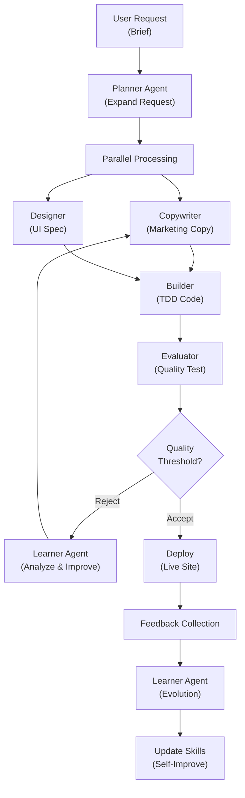

import { Callout } from 'nextra/components'

# AI Agency

<Callout type="info">
AI Agency is a self-evolving creative production system that automatically learns from feedback and improves its output quality with every project.
</Callout>

## What is AI Agency?

AI Agency is a creative production platform that transforms client briefs into professional websites and web applications through an intelligent pipeline of specialized agents. Unlike traditional development tools, Agency **learns and adapts** to your specific brand voice, design preferences, and project patterns through a sophisticated feedback loop.

Each project teaches Agency more about your business, your audience, and your quality standards. Over time, the system becomes increasingly optimized for your specific needs—copywriting improves, design decisions become more aligned with your brand, and the entire workflow becomes faster and more efficient.

## How It Differs from MoAI-ADK

While MoAI-ADK is a **development-focused orchestration framework** for building APIs, backends, and infrastructure, AI Agency is a **creative-focused production system** for designing and building customer-facing web experiences.

| Dimension | MoAI-ADK | AI Agency |
|-----------|----------|-----------|
| **Domain** | Backend/API/Infrastructure | Marketing/SaaS/Web Apps |
| **Input** | Technical specifications | Client briefs & brand context |
| **Output** | Tested, production code | Deployed websites & apps |
| **Quality Metric** | Test coverage & LSP validation | Design quality & conversion optimization |
| **Adaptation** | SPEC-driven, static approach | Self-evolving, feedback-driven |
| **Audience** | Engineering teams | Product/Marketing teams |

## Key Features

### Self-Evolving Skills

Agency learns from every project. A feedback loop captures what works, identifies patterns, and gradually improves the system's decision-making. After 10 projects, Agency understands your brand better than a human copywriter.

### GAN Loop for Quality

A generator (creative agents) and evaluator (quality criteria) work in continuous feedback. The evaluator rejects low-quality output; the generator improves. This adversarial loop produces professional-quality results without manual revision cycles.

### Brand Context as Constitution

Your brand guidelines, target audience, and business goals become the **frozen constitution** of the system. Every agent decision is constrained by your brand context, ensuring consistency across all outputs.

### Dual Zone Architecture

**Frozen Zone** (immutable): Identity, safety, brand constitution, and ethical guidelines that never change.

**Evolvable Zone** (learning): Copywriting rules, design patterns, and decision heuristics that improve over time.

### Upstream Sync with MoAI-ADK

Agency is built on MoAI-ADK's foundation but extends it for creative workflows. Updates to the core framework flow automatically to Agency, while Agency's learnings stay isolated to creative domains.

## Pipeline Architecture

**Phase Breakdown:**

1. **Planner** - Expands brief into comprehensive project specification with goals, outcomes, and constraints
2. **Copywriter & Designer** - Work in parallel to create marketing content and UI specifications
3. **Builder** - Implements code using TDD methodology, ensuring quality and testability
4. **Evaluator** - Runs automated quality tests against weighted criteria
5. **GAN Loop** - If quality insufficient, learner analyzes failures and improves
6. **Deploy** - Launch to production
7. **Learner** - Collects feedback and improves future generations

## Use Cases

**Landing Pages** - Product launches, SaaS onboarding, promotional campaigns

**Marketing Websites** - Company portfolios, service showcases, content hubs

**SaaS Platforms** - Dashboards, admin panels, user-facing applications

**E-commerce** - Product catalogs, checkout flows, customer accounts

**Web Apps** - Collaborative tools, content management, analytics platforms

## Comparison Matrix

| Feature | Static Generator | Template-Based | AI Agency |
|---------|------------------|----------------|-----------|
| **Setup Time** | 2-4 weeks | 2-4 days | 2-4 hours |
| **Customization** | High effort | Limited | Minimal (rules-based) |
| **Learning Curve** | Steep | Moderate | Shallow (natural language) |
| **Brand Consistency** | Manual | Template-locked | Automatic (constitution) |
| **Quality Adaptation** | None | None | Continuous |
| **Cost** | High (dev team) | Medium | Low (automated) |

## Next Steps

Start with [Getting Started](/en/agency/getting-started) to run your first project, or explore [Agents & Skills](/en/agency/agents-and-skills) to understand the system architecture.
