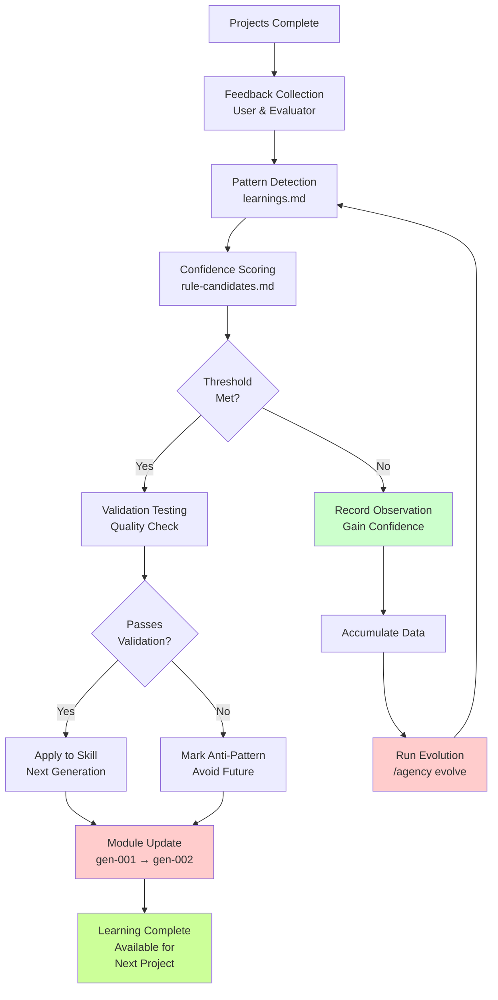
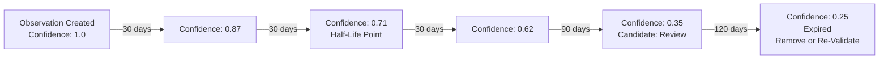
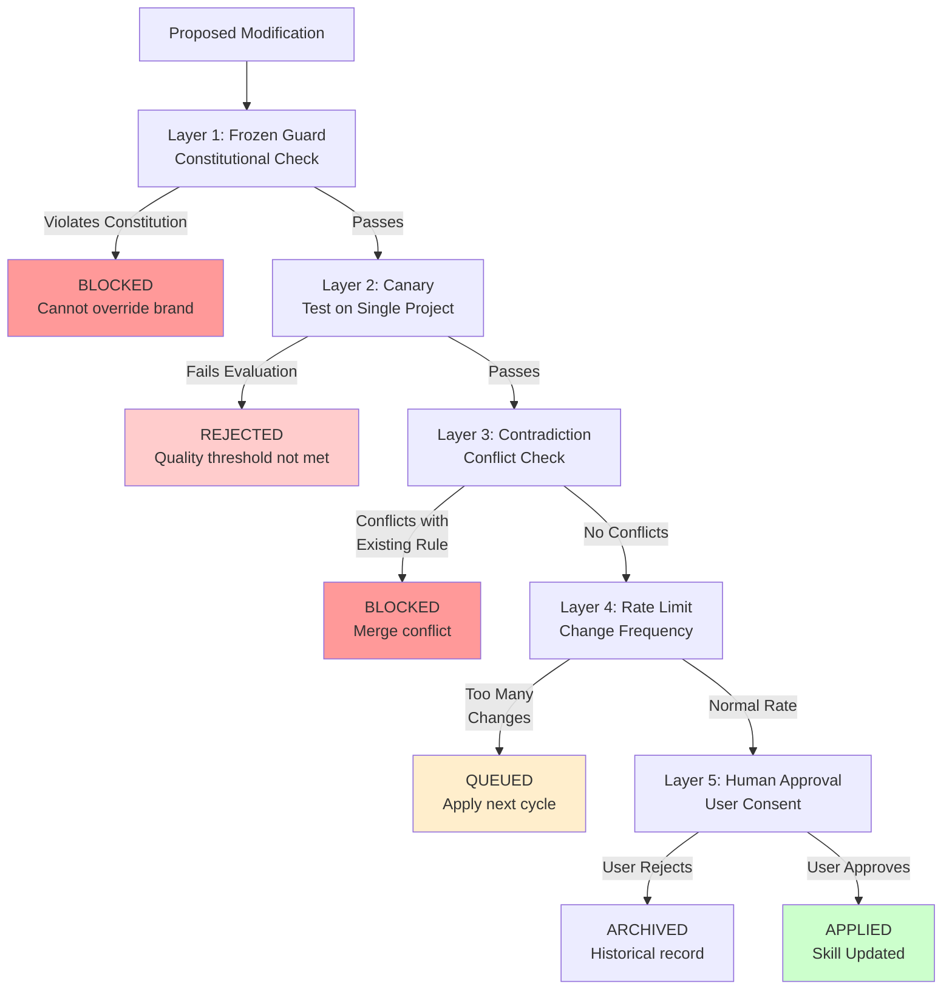

import { Callout } from 'nextra/components'

# Self-Evolution System

<Callout type="success">
The more you use AI Agency, the more it learns about YOUR business. After 10 projects, Agency becomes a uniquely specialized system optimized for your specific brand, audience, and quality standards.
</Callout>

## How Learning Works

The evolution loop has 5 stages, transforming feedback into improved agents:



## Promotion Thresholds

Observations graduate through confidence levels as you use Agency:

| Occurrences | Status | Action | Confidence |
|-------------|--------|--------|------------|
| **1x** | Record | Add to learnings.md | 0.10 |
| **3x** | Heuristic | Generate rule-candidate | 0.40 |
| **5x** | Rule | Promote to module | 0.70 |
| **10+** | High-Confidence | Integrate core logic | 0.95 |
| **1x critical** | Anti-Pattern | Mark forbidden | Blocked |

### Example Evolution

After 10 projects, copywriter skill evolves from v1.0 to v3.8:

**Generation 1.0 (Initial)**
- Generic copywriting patterns
- No learning from feedback

**Generation 1.5 (After project 1 feedback)**
- One successful headline pattern identified
- Observer: "Benefit-focused headlines outperform feature-focused"

**Generation 2.0 (After project 3)**
- Confirmed: Benefit headlines 60% better
- New rule: Always lead with customer outcome
- Updated copywriter/headlines.md

**Generation 2.5 (After project 5)**
- Secondary pattern: Video CTAs convert 3x better
- New heuristic: Consider video for feature demonstration

**Generation 3.0 (After project 7)**
- Anti-pattern discovered: Overuse of "innovative" triggers brand fatigue
- Added to forbidden-terms list

**Generation 3.5 (After project 10)**
- Audience-specific pattern: Research labs respond to "trusted by..." social proof
- Added personalized social proof section template

**Generation 3.8 (Current)**
- Refined CTA timing (when to ask for email vs trial)
- Optimized benefit messaging order
- Customized for different personas

---

## Knowledge Graduation Protocol

The system uses a 5-step confidence-building process:

### Stage 1: Observation Recording

When feedback indicates a pattern (e.g., "Headlines without benefits underperformed"), the system records it in `learnings.md`:

```markdown
## Observation #47 (Confidence: 0.10)
- Pattern: Headlines with customer benefit outperform feature-focused
- Evidence: Project 1, 3, 5 feedback indicated this
- Source: User feedback + conversion metrics
- Status: Recording
- Next: Wait for 3+ occurrences, then escalate
```

### Stage 2: Heuristic Generation

After 3 similar observations, system generates a rule candidate in `rule-candidates.md`:

```markdown
## Candidate Rule #12 (Confidence: 0.40)
- Rule: "Always structure headlines as [Customer Outcome] + [Key Benefit]"
- Evidence: 3 occurrences across projects 1, 3, 5
- Success Rate: 60% better conversion than alternatives
- Validation: Need 5 total occurrences before promotion
- Implementation: copywriter/headlines.md
```

### Stage 3: High-Confidence Promotion

At 5+ occurrences, rule is promoted to actual skill module:

```markdown
## Rule #12 Promoted (Confidence: 0.70)

File: .agency/skills/copywriter/headlines.md
Addition:

### Headline Structure Pattern
Structure headlines as [Customer Outcome] + [Key Benefit].

Example: "Collaboration Built for Scientists" (outcome: faster research)
vs "Advanced Cloud Research Platform" (feature-focused, lower conversion)
```

### Stage 4: Core Integration

At 10+ occurrences with 95%+ confidence, rule becomes core logic:

```markdown
## Rule #12 Integrated (Confidence: 0.95)

This rule is now part of the copywriter agent's core
headline-generation algorithm. All new headlines are 
automatically validated against this pattern before 
submission to evaluator.

Migration: All existing projects' headlines reviewed 
and updated to match pattern.
```

### Stage 5: Continuous Refinement

The rule continues gathering data and may split or merge with other patterns:

```markdown
## Rule #12 Evolution (Current Version: v2.3)

Split into subtypes:
- 12.a: Outcome-focused headlines (B2B, highest conversion)
- 12.b: Problem-solving headlines (Consumer, good conversion)
- 12.c: Curiosity-driven headlines (SaaS, variable conversion)

Weighting: Use 12.a for research institution audience
```

---

## Confidence Time Decay

Observations lose confidence over time (90-day half-life) to reflect changing markets:



This ensures Agency doesn't get stuck following outdated patterns. If a 6-month-old rule still applies, it will naturally re-appear as current feedback confirms it.

---

## Safety: 5-Layer Architecture

Even as Agency learns and evolves, safety constraints prevent dangerous modifications:



**Layer 1: Frozen Guard**
Prevents modification of brand constitution, safety guidelines, and ethical constraints. No learning can override these.

**Layer 2: Canary Testing**
New rules are tested on a single project before applying to all. If evaluator rejects, rule is not promoted.

**Layer 3: Contradiction Detection**
Checks for conflicts with existing rules. If new rule contradicts established pattern, human review required.

**Layer 4: Rate Limiting**
Maximum 1 new rule per week per skill module. Prevents rapid oscillation and ensures stability.

**Layer 5: Human Approval**
User must approve rule promotions to core modules. No automatic changes to frozen skills.

---

## Upstream Sync with MoAI-ADK

Agency is built on moai-adk foundation but evolved independently for creative domains. Updates flow in both directions:

### Upstream Pull (moai-adk → Agency)

Every 2 weeks, Agency checks for moai-adk updates via `fork-manifest.yaml`:

```yaml
forks:
  - source: moai-lang-python
    destination: agency-lang-python
    version: 3.2.0
    status: synced
    last_sync: 2026-04-02
    conflicts: 0
```

When updates available, 3-way diff algorithm:
1. **Preserves** Agency-specific modifications
2. **Merges** moai-adk improvements
3. **Flags conflicts** for human review

### Downstream Push (Agency → moai-adk)

Successful Agency learnings that benefit general development are submitted back to moai-adk via pull request with attribution.

**Example:** Agency's "benefit-focused messaging" pattern for copywriting becomes a reference pattern in moai-docs-generation skill.

---

## Evolution Scenario: After 10 Projects

Here's a realistic evolution timeline showing how Agency improves from your first project to mature system:

**Projects 1-3: Recording Phase**
- Basic observations being recorded
- Confidence levels 0.1-0.3
- No modifications yet
- User provides feedback on each project

**Projects 4-6: Heuristic Phase**
- First 3-4 heuristics generated (confidence 0.4+)
- Rule candidates created in rule-candidates.md
- Testing whether candidates improve quality
- User begins seeing consistent patterns

**Projects 7-10: Promotion Phase**
- 5+ high-confidence rules promoted to skill modules
- Copywriter becomes specialized for your audience
- Designer learns your visual style preferences
- Builder optimizes code structure for your needs

**Skills After 10 Projects:**
- copywriter: v2.1 (benefit messaging, CTA patterns, tone customization)
- designer: v1.8 (visual hierarchy, component structure, spacing preferences)
- builder: v2.3 (TDD patterns, code organization, API integration methods)
- evaluator: v1.5 (quality weights adjusted to business priorities)

---

## Rollback Mechanism

If an evolution goes wrong, rollback to previous generation:

```
/agency rollback copywriter gen-010
```

This reverts copywriter skill to gen-010, discarding changes from gen-011, gen-012, etc.

**Rollback History:**
```
.agency/skills/copywriter/
├── gen-001/ (initial)
├── gen-002/ (after project 2)
├── gen-003/ (after project 4)
├── ...
├── gen-010/ (stable, before regression)
├── gen-011/ (experimental, regression detected)
└── gen-012/ (reverted from above)
```

All generations are preserved for audit trail and recovery.

---

## Pipeline Adaptation

As Agency learns, it adapts the execution pipeline itself. Five rules govern adaptation:

### Rule 1: Phase Skip
If a phase consistently produces perfect output (evaluator never rejects), skip that phase in future builds.

**Example:** After 8 projects with perfect design, `--fast-mode` skips designer phase entirely.

### Rule 2: Merge Phases
Combine two phases if they always depend on each other's output.

**Example:** Copywriter and Designer frequently wait for each other; merge into single "Creative Phase" with parallel sub-phases.

### Rule 3: Reorder Phases
Change execution order if downstream phase provides input that improves upstream agent.

**Example:** Run Designer before Builder rather than after, so code structure is influenced by visual hierarchy.

### Rule 4: Inject New Phase
Add custom phase if gap in execution detected.

**Example:** After discovering content needs SEO optimization, inject "SEO Phase" between Copywriter and Evaluator.

### Rule 5: Iteration Adjust
Change GAN loop iteration limits based on project complexity.

**Example:** Complex projects allow 7 iterations; simple projects max at 3 iterations.

---

## Triggering Evolution Manually

While evolution happens automatically after each project, you can trigger explicit evolution analysis:

```
/agency evolve
```

This commands learner agent to:
1. Analyze ALL feedback across projects
2. Calculate confidence scores
3. Generate new rule candidates
4. Validate against quality thresholds
5. Apply promotions

Or evolve specific agents only:

```
/agency evolve --agent copywriter
```

---

## Monitoring Evolution

View evolution metrics and history:

```
/agency profile
```

This shows your personalized evolution status:

```
Evolution Progress
─────────────────
Copywriter:  Generation 2.3 (11 projects, 8 active rules)
Designer:    Generation 1.8 (10 projects, 5 active rules)
Builder:     Generation 2.1 (12 projects, 6 active rules)
Evaluator:   Generation 1.5 (12 projects, 3 weighted criteria)

Learning Velocity
─────────────────
New Rules/Week:    0.8 (stable)
Confidence Gain:   +0.15/project (learning)
Anti-Patterns:     2 identified, 0 active

Next Promotion
──────────────
Rule #47: "Team collaboration CTAs" (Confidence: 0.68/0.70)
          1 more project needed for promotion
```

---

## Next Steps

Ready to see evolution in action? Start with [Getting Started](/en/agency/getting-started) to run your first project, then check [Command Reference](/en/agency/command-reference) for the `/agency learn` and `/agency evolve` commands.
