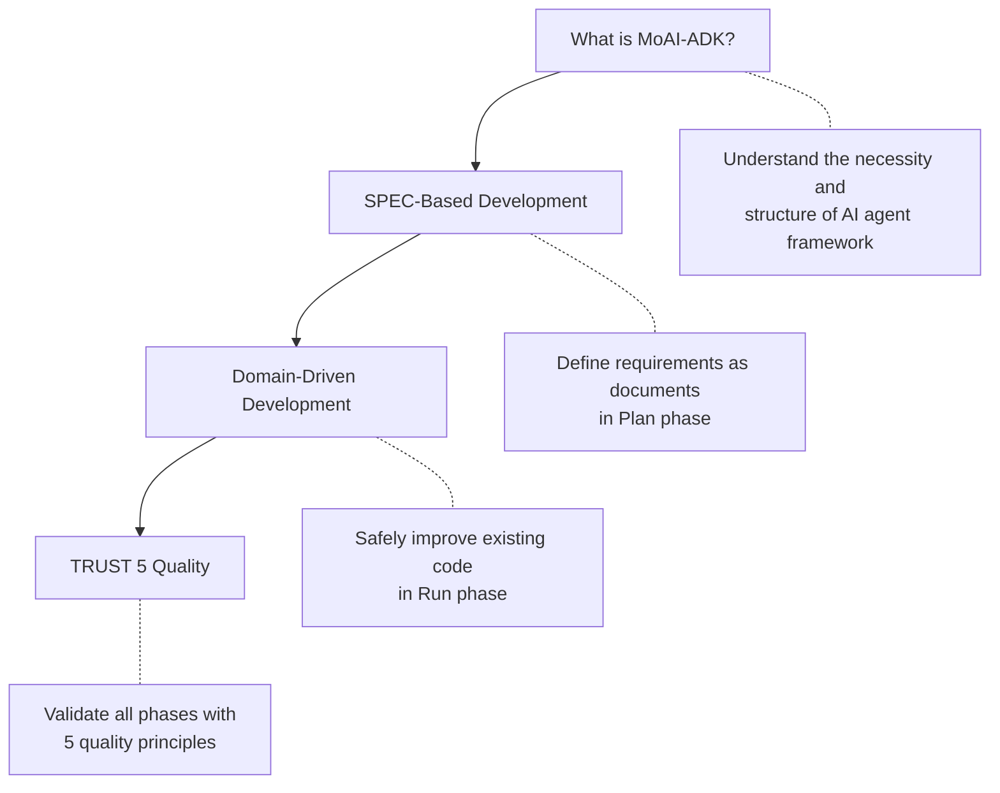

import { Callout } from 'nextra/components'

# Core Concepts

Introduction to 4 core concepts for understanding MoAI-ADK.

<Callout type="info">
New here? Read from top to bottom to naturally understand the full picture of MoAI-ADK.
</Callout>

## Learning Order

| Order | Document | Key Question |
|-------|----------|--------------|
| 1 | [What is MoAI-ADK?](/core-concepts/what-is-moai-adk) | Why do we need AI development tools, and how are they structured? |
| 2 | [SPEC-Based Development](/core-concepts/spec-based-dev) | How do we clearly define and manage requirements? |
| 3 | [Domain-Driven Development](/core-concepts/ddd) | How do we improve code without breaking existing functionality? |
| 4 | [TRUST 5 Quality](/core-concepts/trust-5) | What standards ensure code quality? |

<Callout type="tip">
Each document can be read independently, but reading in order naturally connects MoAI-ADK's development philosophy. Define **what** to make with **SPEC**, safely make it with **DDD**, and validate quality with **TRUST 5**.
</Callout>
