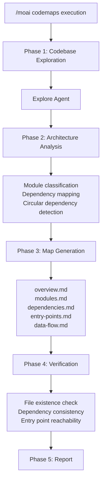
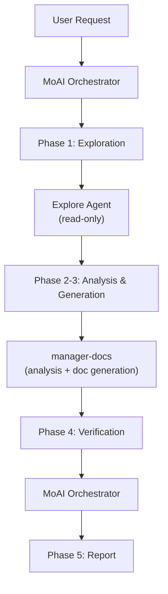

import { Callout } from 'nextra/components'

# /moai codemaps

A command that scans the codebase and automatically generates **architecture documentation**.

<Callout type="tip">
**One-line summary**: `/moai codemaps` is an "Architecture Cartographer". It analyzes the codebase and **automatically generates structural documentation** including module maps, dependency graphs, and entry point catalogs.
</Callout>

<Callout type="info">
**Slash Command**: Type `/moai:codemaps` in Claude Code to run this command directly. Type `/moai` alone to see the full list of available subcommands.
</Callout>

## Overview

When joining a new project or understanding a large codebase, grasping the architecture is the most important first step. `/moai codemaps` automatically analyzes the codebase to generate module maps, dependency graphs, entry point catalogs, and data flow documentation.

Generated documents are stored in the `.moai/project/codemaps/` directory, helping both humans and AI agents quickly understand the codebase.

## Usage

```bash
# Generate architecture docs for entire codebase
> /moai codemaps

# Regenerate ignoring existing docs
> /moai codemaps --force

# Analyze specific area only
> /moai codemaps --area api

# Include Mermaid diagrams
> /moai codemaps --format mermaid

# Limit exploration depth
> /moai codemaps --depth 3
```

## Supported Flags

| Flag | Description | Example |
|------|-------------|---------|
| `--force` (alias `--regenerate`) | Regenerate all codemaps ignoring existing docs | `/moai codemaps --force` |
| `--area AREA` | Focus analysis on a specific area | `/moai codemaps --area auth` |
| `--format FORMAT` | Output format (markdown, mermaid, json, default: markdown) | `/moai codemaps --format mermaid` |
| `--depth N` | Maximum directory exploration depth (default: 4) | `/moai codemaps --depth 3` |

### --force Flag

Deletes all existing codemap documents and regenerates from scratch:

```bash
> /moai codemaps --force
```

Useful when the codebase has undergone major changes.

### --area Flag

Analyzes only a specific area and its dependencies:

```bash
# Analyze API module only
> /moai codemaps --area api

# Analyze auth module only
> /moai codemaps --area auth
```

Results are stored in `.moai/project/codemaps/{area}/`.

### --format Flag

Specifies the output format:

```bash
# Include Mermaid diagrams
> /moai codemaps --format mermaid

# Generate additional JSON output
> /moai codemaps --format json
```

## Execution Process

`/moai codemaps` runs in 5 phases.



### Phase 1: Codebase Exploration

The `Explore` agent deeply explores the codebase:

| Exploration Target | Description |
|-------------------|-------------|
| Directory Structure | Map top-level and significant subdirectories |
| Module Boundaries | Identify package/module boundaries and responsibilities |
| Entry Points | Find main entry points (main.go, index.ts, app.py, etc.) |
| Public APIs | List exported functions, types, and interfaces |
| Dependency Graph | Map inter-module dependencies (imports, requires) |
| External Dependencies | Catalog third-party dependencies |
| Configuration Files | Identify build, deployment, and config files |

### Phase 2: Architecture Analysis

The `manager-docs` agent analyzes exploration results:

- Classify modules by layer (presentation, business, data, infrastructure)
- Identify high fan-in modules (`@MX:ANCHOR` candidates)
- Detect circular dependencies
- Map request/data flow paths
- Identify domain boundaries
- Recognize architecture patterns (MVC, Clean, Hexagonal, etc.)

### Phase 3: Map Generation

Generates 5 documents in the `.moai/project/codemaps/` directory:

| File | Content |
|------|---------|
| `overview.md` | High-level architecture summary with module descriptions |
| `modules.md` | Detailed module catalog (responsibilities, dependencies) |
| `dependencies.md` | Dependency graph (text and Mermaid diagrams) |
| `entry-points.md` | Entry point catalog with invocation paths |
| `data-flow.md` | Key data flow paths through the system |

With `--area` flag:
- `.moai/project/codemaps/{area}/overview.md`
- `.moai/project/codemaps/{area}/modules.md`
- `.moai/project/codemaps/{area}/dependencies.md`

### Phase 4: Verification

- Verify all referenced files and modules actually exist
- Check dependency relationships for bidirectional consistency
- Validate entry point reachability
- Compare with existing codemaps to highlight changes (unless `--force`)

### Phase 5: Report

```
## Codemaps Generation Report

### Generated Files
- .moai/project/codemaps/overview.md
- .moai/project/codemaps/modules.md
- .moai/project/codemaps/dependencies.md
- .moai/project/codemaps/entry-points.md
- .moai/project/codemaps/data-flow.md

### Architecture Highlights
- Pattern: Clean Architecture
- Module count: 12
- Entry points: 3 (API server, CLI, Worker)

### Potential Issues
- Circular dependency: pkg/auth <-> pkg/user
- High coupling: pkg/core (fan_in: 8)
- Orphaned module: pkg/legacy (no consumers)
```

## Agent Delegation Chain



**Agent Roles:**

| Agent | Role | Key Tasks |
|-------|------|-----------|
| **MoAI Orchestrator** | Workflow coordination, verification, report | Flag parsing, verification, user interaction |
| **Explore** | Codebase exploration (read-only) | Directory structure, module boundaries, dependency mapping |
| **manager-docs** | Architecture analysis and doc generation | Module classification, dependency analysis, codemap file creation |

## FAQ

### Q: How often should codemaps be regenerated?

After major refactoring or new module additions. Running `/moai sync` also automatically updates codemaps.

### Q: Do --area codemaps conflict with full codemaps?

No. Area-specific codemaps are stored in separate subdirectories. They're managed independently from full codemaps.

### Q: Can I manually edit generated codemaps?

Yes, manual edits are fine. However, `--force` regeneration will overwrite manual edits. Without `--force`, existing documents are used for incremental updates.

### Q: Which architecture patterns are recognized?

Major patterns including MVC, Clean Architecture, Hexagonal, and Layered Architecture. Recognized patterns are documented in `overview.md`.

## Related Documentation

- [/moai review - Code Review](/quality-commands/moai-review)
- [/moai coverage - Coverage Analysis](/quality-commands/moai-coverage)
- [/moai mx - @MX Tag Scan](/utility-commands/moai-mx)
