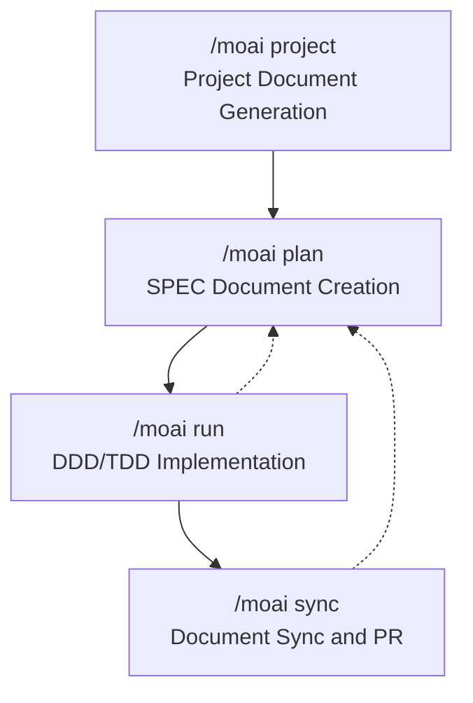

import { Callout } from 'nextra/components'

# Workflow Commands

Complete a systematic development cycle with MoAI-ADK's 4 workflow commands.

## Development Cycle Overview

MoAI-ADK supports the entire process from project initialization to deployment preparation through **4-phase workflow commands**. Each command is managed by a specialized AI agent, and executing them in sequence allows you to consistently create high-quality software.



## Command Summary

| Command | Phase | Responsible Agent | Token Budget | Purpose |
|---------|-------|-------------------|--------------|---------|
| [`/moai project`](./moai-project) | Phase 0 | manager-project | - | Automatic project document generation |
| [`/moai plan`](./moai-plan) | Phase 1 | manager-spec | 30K | SPEC document creation |
| [`/moai run`](./moai-run) | Phase 2 | manager-ddd / manager-tdd | 180K | DDD/TDD-based implementation |
| [`/moai sync`](./moai-sync) | Phase 3 | manager-docs | 40K | Document synchronization and PR creation |

<Callout type="tip">
If you're using it for the first time, start with `/moai project`. Project documents are needed for AI to accurately understand and work on the project in subsequent phases.
</Callout>

## Quick Start

```bash
# Phase 0: Project document generation (first time only)
> /moai project

# Phase 1: SPEC creation
> /moai plan "Implement user authentication feature"
> /clear

# Phase 2: DDD implementation
> /moai run SPEC-AUTH-001
> /clear

# Phase 3: Document synchronization and PR
> /moai sync SPEC-AUTH-001
```

## Related Documents

- [SPEC-based Development](/core-concepts/spec-based-dev) - Detailed explanation of SPEC and EARS format
- [DDD Methodology](/core-concepts/ddd) - Detailed explanation of ANALYZE-PRESERVE-IMPROVE cycle
- [TRUST 5 Quality System](/core-concepts/trust-5) - Detailed explanation of quality gates
- [Quick Start](/getting-started/quickstart) - Tutorial from start to finish
