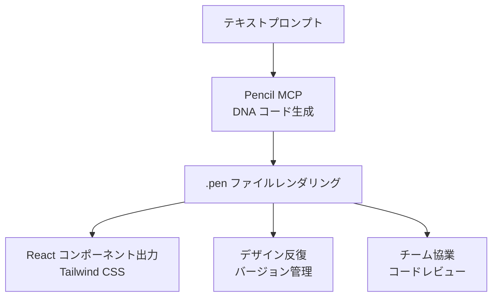
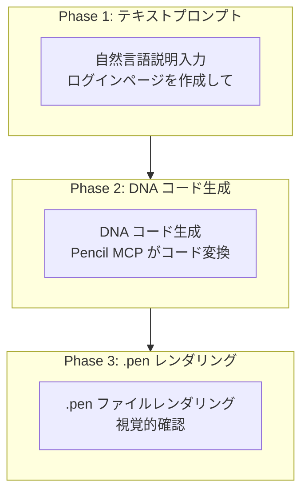
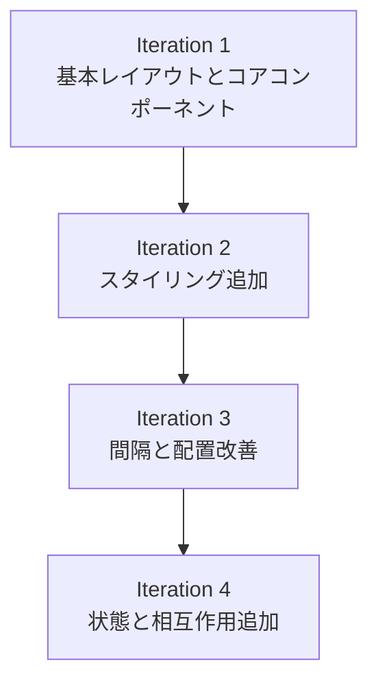
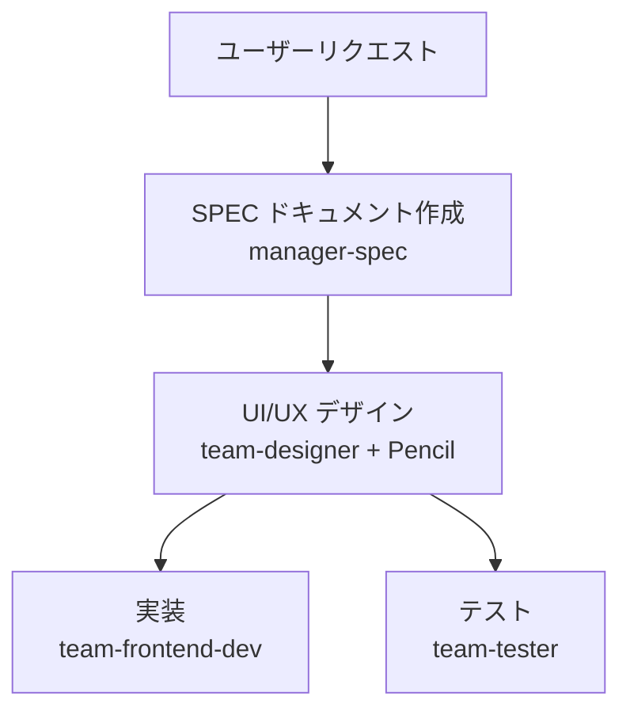

import { Callout } from 'nextra/components'

# Pencil ガイド

Pencil MCP サーバーを活用して AI ベース UI/UX デザインを作成する方法を詳細に解説します。

<Callout type="tip">
**一言でいうと**: Pencil は **コードファースト デザインツール**です。MCP サーバーを通じて Claude Code で直接 UI を作成し、.pen ファイルで管理し、本番コードに出力できます。
</Callout>

## Pencil とは？

Pencil は開発環境で直接作業できる **AI ベース デザインツール**です。デザインとコードのギャップを解消し、Figma のような別のデザインツールなくても一貫した UI を作成できます。



### 主な機能

| 機能 | 説明 |
|------|------|
| **DNA コード** | UI を宣言的コードで表現（バージョン管理可能） |
| **テキスト-ツー-デザイン** | 自然言語説明で UI 画面を作成 |
| **.pen ファイル** | 暗号化されたデザインファイル形式 |
| **React 出力** | Tailwind CSS 適用本番コード生成 |
| **無限キャンバス** | 大規模デザインプロジェクト対応 |
| **チーム協業** | コードベースデザインレビュー |

<Callout type="info">
Pencil は **オープンソース デザインフォーマット** を使用しており、.pen ファイルはコードベースで直接管理できます。https://pencil.dev で詳細情報を確認してください。
</Callout>

## 事前準備

Pencil MCP を使用するには以下の設定が必要です。

### Step 1: Pencil インストール

Pencil は IDE 拡張機能またはデスクトップアプリケーションとして利用可能です。

#### VS Code 拡張機能

1. VS Code を開く
2. 拡張機能パネルを開く (Cmd/Ctrl + Shift + X)
3. "Pencil" を検索
4. インストールをクリック

#### Cursor 拡張機能

1. Cursor を開く
2. 拡張機能パネルを開く
3. "Pencil" を検索
4. インストールをクリック

#### デスクトップアプリケーション (macOS/Linux)

1. [Pencil ウェブサイト](https://pencil.dev) から最新版をダウンロード
2. アプリケーションフォルダにドラッグ
3. Pencil を起動

### Step 2: Claude Code CLI 認証

```bash
# Claude Code CLI をインストール
npm install -g @anthropic-ai/claude-code-cli

# または公式インストーラーを使用
curl https://claude.ai/cli/install.sh | sh

# Claude Code にログイン
claude
```

<Callout type="info">
Pencil MCP サーバーは **Pencil 使用時に自動的に起動** します。別途インストールや API キーの設定は不要です。
</Callout>

## MCP 設定

### Pencil MCP の仕組み

Pencil MCP (Model Context Protocol) サーバーは **Pencil 使用時に自動的に起動** します。

- MCP サーバーはローカルで実行されます
- AI アシスタントが `.pen` ファイルを読み取り・変更するための API を提供します
- 追加のインストールや API キー設定は不要です

<Callout type="info">
**重要**: Pencil MCP は完全にローカルで実行されます。デザインファイルは常にあなたのマシン上に残り、外部に送信されることはありません。
</Callout>

### セキュリティとプライバシー

| 特徴 | 説明 |
|------|------|
| **ローカル専用** | MCP サーバーはあなたのマシンで実行されます |
| **リモートアクセスなし** | デザインファイルはローカルに残ります |
| **プライベートリポジトリ** | ソースコードは公開されません |
| **ツール検査** | IDE 設定で利用可能なツールを確認できます |

### 対応 AI アシスタント

Pencil は MCP を介して複数の AI ツールと連携します：

| AI アシスタント | 説明 |
|----------------|------|
| **Claude Code** | CLI および IDE で動作 |
| **Claude Desktop** | デスクトップアプリケーション |
| **Cursor** | AI 搭載 IDE |
| **Windsurf IDE** | Codeium 搭載 IDE |
| **Codex CLI** | OpenAI 搭載 CLI |
| **Antigravity IDE** | AI 搭載 IDE |
| **OpenCode CLI** | CLI ツール |

### 接続確認

設定が完了すると Claude Code で Pencil ツールを使用できます。

```bash
# Claude Code で実行
> Pencil でログインボタンを作成して
```

## MCP ツール一覧

Pencil MCP は様々なツールを提供します。

### デザインツール

| ツール | 用途 |
|------|------|
| `batch_design` | デザイン要素の作成、変更、操作（挿入、コピー、更新、置換、移動、削除、画像生成） |
| `batch_get` | デザインコンポーネントと階層の読み取り、パターン検索、構造検査 |

### 分析ツール

| ツール | 用途 |
|------|------|
| `get_screenshot` | デザインプレビューのレンダリング、視覚的出力の確認 |
| `snapshot_layout` | レイアウト構造の分析、配置問題の検出、重なり要素の特定 |
| `get_editor_state` | 現在のエディタコンテキスト、選択情報、アクティブファイル詳細 |

### 変数とテーマ

| ツール | 用途 |
|------|------|
| `get_variables` | デザイントークンの読み取り |
| `set_variables` | テーマ値の更新、CSS との同期 |

### ドキュメントツール

| ツール | 用途 |
|------|------|
| `open_document` | 新しい .pen ファイル作成または既存ファイルを開く |
| `get_guidelines` | デザインガイドライン取得（コード、テーブル、Tailwind、ランディングページ） |
| `get_style_guide` | スタイルガイド取得（タグまたは名前で指定） |
| `get_style_guide_tags` | デザインインスピレーションのためのスタイルガイドタグ取得 |

### その他のツール

| ツール | 用途 |
|------|------|
| `find_empty_space_on_canvas` | キャンバス上の空き領域検索 |
| `search_all_unique_properties` | ノードツリー全体の一意なプロパティを再帰的に検索 |
| `replace_all_matching_properties` | ノードツリー全体の一致するプロパティを再帰的に置換 |

### ツール選択ガイド

| 目的 | 使用するツール |
|------|---------------|
| 新しいデザイン開始 | `open_document` |
| コンポーネント作成 | `batch_design` |
| デザインプレビュー | `get_screenshot` |
| レイアウト分析 | `snapshot_layout` |
| デザイン出力 | Pencil Editor で Export |
| スタイル参照 | `get_style_guide` |
| トークン管理 | `get_variables` / `set_variables` |

## DNA コードフォーマット

Pencil は DNA コードという宣言的フォーマットを使用して UI を表現します。

### 基本構造

```dna
// ボタンコンポーネント DNA コード
component Button {
  variant: primary
  size: medium
  content: "クリックしてください"
  onClick: handleSubmit
}
```

### レイアウト構造

```dna
// ログインフォームレイアウト
layout LoginForm {
  direction: column
  spacing: 16
  children: [
    Input {
      placeholder: "メールアドレス"
      type: email
    }
    Input {
      placeholder: "パスワード"
      type: password
    }
    Button {
      variant: primary
      content: "ログイン"
    }
  ]
}
```

### デザイントークン

```dna
// トークン参照
color: primary.500
spacing: md
radius: lg

// トークン定義
tokens {
  primary.500 = #3B82F6
  md = 16px
  lg = 8px
}
```

## デザイン生成ワークフロー

Pencil でデザインを作成する 3 段階パターンです。



### 実践例: E コマースカード

```bash
# Phase 1: テキストプロンプトでデザインリクエスト
> 商品カードを作成して。上部に商品画像、中央にタイトルと価格、
# 下部にカートボタン。シンプルなミニマルスタイルで

# Phase 2: Pencil が DNA コードを生成
# → component ProductCard { ... }

# Phase 3: .pen ファイルにレンダリング
# → open_document 後に batch_design で作成
```

<Callout type="tip">
**核**: Pencil は **デザインをコードで管理** します。.pen ファイルは Git でバージョン管理でき、コードレビュープロセスに統合できます。
</Callout>

## React コンポーネント出力

Pencil Editor で .pen ファイルを React コンポーネントに出力できます。

### 出力設定

```typescript
// pencil.config.js
module.exports = {
  framework: 'react',
  styling: 'tailwind',
  output: './src/components/generated',
  options: {
    typescript: true,
    responsive: true,
    accessibility: true
  }
};
```

### 生成されたコンポーネント例

```typescript
export interface ButtonProps {
  variant?: 'primary' | 'secondary' | 'tertiary';
  size?: 'small' | 'medium' | 'large';
  isLoading?: boolean;
}

export const Button = ({ variant = 'primary', size = 'medium', isLoading, children, ...props }: ButtonProps) => {
  const baseStyles = 'inline-flex items-center justify-center font-medium rounded-md transition-colors';

  const variantStyles = {
    primary: 'bg-blue-600 text-white hover:bg-blue-700',
    secondary: 'bg-gray-200 text-gray-900 hover:bg-gray-300',
    tertiary: 'bg-transparent text-gray-700 hover:bg-gray-100'
  };

  const sizeStyles = {
    small: 'px-3 py-1.5 text-sm',
    medium: 'px-4 py-2 text-base',
    large: 'px-6 py-3 text-lg'
  };

  return (
    <button className={`${baseStyles} ${variantStyles[variant]} ${sizeStyles[size]}`} {...props}>
      {isLoading ? 'ローディング中...' : children}
    </button>
  );
};
```

## プロンプト作成ガイド

Pencil で良い結果を得るには、構造化されたプロンプトが重要です。

### 良いプロンプト vs 悪いプロンプト

| 悪いプロンプト | 良いプロンプト |
|--------------|------------|
| "かっこいいボタンを作成して" | "青い背景の中サイズ基本ボタン。「確認」テキスト、16px パディング" |
| "ダッシュボード" | "サイドバーナビがある分析ダッシュボード。上部 3 つの指標カード（売上、ユーザー、転換率）、ラインチャート、テーブル" |
| "もっといい感じにして" | "ボタンパディングを 16px に増やして、色を青に変更してください" |
| "レスポンシブ" | "モバイル: 縦積み、デスクトップ: 3 列グリッド" |

### 効果的なプロンプトテンプレート

```
[コンポーネントタイプ]を作成して。
[コンポーネントリスト]を含む。
[レイアウト]で配置。
[スタイル]を適用。
[レスポンシブ]を考慮。
```

### デザイン作成プロンプト

- 「サイドバーとメインコンテンツエリアがあるダッシュボードをデザインして」
- 「3 つの価格帯の価格表を作成して」
- 「見出しと CTA ボタンがあるヒーローセクションを追加して」

### デザイン修正プロンプト

- 「すべての基本ボタンを青に変更してください」
- 「サイドバーを狭くしてください」
- 「これらの要素の間に間隔を追加してください」

### デザインシステムプロンプト

- 「バリアントを持つボタンコンポーネントを作成してください」
- 「#3b82f6 をベースにカラーパレットを生成してください」
- 「タイポグラフィスケールを構築してください」

### コード統合プロンプト

- 「このコンポーネントの React コードを生成してください」
- 「コードベースから Header をインポートしてください」
- 「これらの変数から Tailwind 設定を作成してください」

<Callout type="info">
**黄金ルール**: プロンプトは **具体的であるほど** 良いです。色、間隔、配置、相互作用を明確に指定してください。また、既存のコンポーネントや変数を参照すると一貫性が保たれます。
</Callout>

## 高度なワークフロー

### 自動デザイン生成

**スタイルガイド活用**:

```bash
> Material Design の原則を使用してダッシュボードを作成してください
> モダンでミニマルな美学を持つランディングページをデザインしてください
> design-system.pen のデザインシステムに従ってコンポーネントを構築してください
```

**バッチ操作**:

```bash
> このボタンコンポーネントの 5 つのバリエーションを作成してください
> すべての入力タイプを含む完全なフォームを生成してください
> ヒーロー、機能、価格、フッターを持つ完全なランディングページをデザインしてください
```

### デザインシステム管理

**一貫性の強制**:

```bash
> すべてのボタンがプライマリーカラー変数を使用するようにしてください
> すべての見出しをタイポグラフィスケールに更新してください
> すべての要素に 8px 間隔グリッドを適用してください
```

**コンポーネントライブラリ**:

```bash
> すべてのバリアントを持つ完全なボタンコンポーネントを作成してください
> フォーム入力コンポーネント（テキスト、選択、チェックボックス、ラジオ）を生成してください
> 画像、タイトル、説明、アクションを持つカードコンポーネントを構築してください
```

### コードとデザインのワークフロー

**既存アプリのインポート**:

```bash
> src/components からすべてのコンポーネントを Pencil で再作成してください
> Tailwind 設定からデザインシステムをインポートしてください
> コードベースを分析して一致するデザインを作成してください
```

**変更の同期**:

```bash
> Pencil デザインに合わせてすべての React コンポーネントを更新してください
> 新しいカラースキームをデザインとコードの両方に適用してください
> CSS と Pencil の間でタイポグラフィ変数を同期してください
```

### 反復的デザイン

1. **広範な開始**: 「ダッシュボードレイアウトを作成してください」
2. **洗練**: 「ナビゲーションアイテムを持つサイドバーを追加してください」
3. **詳細**: 「ナビゲーションアイテムにホバー状態でスタイルを設定してください」
4. **研磨**: 「8px グリッドに合わせるように間隔を調整してください」

### 検証

AI が変更を行った後：

1. **視覚的なレビュー**をキャンバスで行う
2. **構造のチェック**をレイヤーパネルで行う
3. **相互作用のテスト**（該当する場合）
4. **スクリーンショットの要求**で複雑なレイアウトを確認

## Cursor での使用

### セットアップ

1. Cursor に Pencil 拡張機能をインストール
2. アクティベーションを完了
3. Claude Code に認証
4. MCP 接続を確認: 設定 → ツールと MCP

### Cursor 固有の機能

**インライン編集**:

- Pencil で要素を選択
- Cursor の AI チャットを使用して変更
- 変更が `.pen` ファイルに適用されます

**コードベース対応**:

- Cursor はコードとデザインの両方を確認できます
- コンポーネント間の同期を依頼できます
- 自動的に一貫性を維持できます

### 一般的な問題

**「Cursor Pro が必要」**:

- 一部の機能は Cursor Pro サブスクリプションが必要な場合があります
- 現在の制限については Cursor の価格設定を確認してください

**プロンプトパネルが見つからない**:

- アクティベーション/ログインステータスを確認してください
- Cursor を再起動してください
- 設定で MCP 接続を確認してください

## Codex CLI での使用

### セットアップ

1. **まず Pencil を実行** - デスクトップアプリまたは IDE 拡張機能を起動
2. ターミナルで Codex を開く
3. MCP 接続を確認: `/mcp`
4. MCP サーバーリストに Pencil が表示されます

### Codex での作業

**ターミナルでのデザインプロンプト**:

```bash
# Codex CLI で
> design.pen にボタンコンポーネントを作成してください
> ランディングページにヒーローセクションを追加してください
> 青をベースにカラースキームを生成してください
```

**メリット**:

- コマンドラインワークフロー
- スクリプト可能なデザイン生成
- ビルドツールとの統合

### 既知の問題

**Codex config.toml の変更**:

- Pencil が設定を変更または複製する場合があります
- 問題は認識されており、調査中です
- 最初の使用前に設定をバックアップしてください

## トラブルシューティング

### 接続の問題

**「Claude Code が接続されていません」**:

1. Claude Code にログインしているか確認: `claude`
2. Pencil を再起動してください
3. プロジェクトディレクトリでターミナルを開き、`claude` を実行してください

**MCP サーバーが表示されない**:

1. Pencil が実行されているか確認してください
2. IDE の MCP 設定を確認してください
3. Pencil と AI アシスタントの両方を再起動してください

### 権限の問題

**「フォルダにアクセスできません」**:

- 権限プロンプトを受け入れてください
- システムのフォルダ権限を確認してください
- 適切な権限で IDE/Pencil を実行してください

**「権限プロンプトが表示されない」**:

- 別の Claude Code セッションで操作を試してください
- 通知設定を確認してください
- IDE の権限を確認してください

### AI 出力の問題

**「無効な API キー」**:

- Claude Code を再認証してください: `claude`
- 競合する認証設定がないか確認してください
- 環境変数をクリアしてください

**AI が予期しない変更を行う**:

- プロンプトをより具体的にしてください
- 適用する前に説明を依頼してください
- 必要に応じてバージョン管理を使用して元に戻してください

### インストールの問題

**拡張機能がインストールされていますが接続されない**:

- Claude Code にログインしているか確認してください
- アクティベーションプロセスを完了してください
- IDE を再起動してください

**アクティベーションメールが届かない**:

- スパム/迷惑メールフォルダを確認してください
- 別のメールアドレスを試してください
- 拡張機能を再インストールしてください

## ベストプラクティス

| 原則 | 説明 |
|------|------|
| **コードファースト** | デザインをコードで管理してバージョン管理と協業を容易に |
| **段階的アプローチ** | 基本レイアウトから作成開始、詳細を段階的に追加 |
| **アクセシビリティ** | ARIA ラベル、キーボードナビゲーションを常に指定 |
| **レスポンシブ** | モバイルとデスクトップの動作を常に含める |
| **デザインシステム** | 一貫したトークンとコンポーネントを使用 |
| **検証** | 変更後に視覚的レビューと構造チェックを行う |

### 段階的改善戦略

複雑な画面は複数回に分けて作成すると品質が向上します。



## 使用例

```bash
# 1. Pencil と Claude Code を起動
claude

# 2. IDE で design.pen を開く
# 3. Cmd + K を押してデザインを開始

ユーザー: "モダンなランディングページのヒーローセクションを作成してください"
AI: [見出し、サブ見出し、CTA ボタンでヒーローを作成]

ユーザー: "3 列の機能セクションを追加してください"
AI: [ヒーローの下に機能セクションを追加]

ユーザー: "CTA ボタンにプライマリーカラー変数を使用してください"
AI: [ボタンをカラーバリアブルを使用するように更新]

ユーザー: "このページ全体の React コードを生成してください"
AI: [Tailwind CSS を使用した React コンポーネントにエクスポート]

# 4. レビューと洗練
# 5. Git にコミット
git add design.pen src/pages/landing.tsx
git commit -m "ランディングページのデザインと実装を追加"
```

## MoAI と一緒に使用

MoAI は Pencil MCP と統合して UI デザインを自動化できます。

```bash
# MoAI が Pencil を使用して UI を生成
> /moai run --team
# team-designer エージェントが Pencil MCP を使用してデザイン生成
```

### チームモードデザインワークフロー



## 関連ドキュメント

- [MCP サーバーガイド](/advanced/mcp-servers) - MCP プロトコル概要
- [settings.json ガイド](/advanced/settings-json) - MCP サーバー権限設定
- [エージェントガイド](/advanced/agent-guide) - MoAI エージェントシステム
- [スキルガイド](/advanced/skill-guide) - moai-design-tools スキル

<Callout type="tip">
**ヒント**: Pencil を最大限に活用する核は **デザインをコードで管理** することです。.pen ファイルを Git で管理すると、デザインバージョントラッキングと協業がはるかに容易になります。
</Callout>
