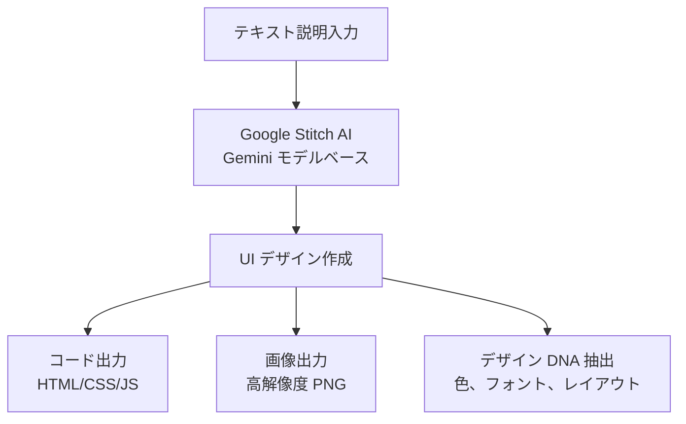
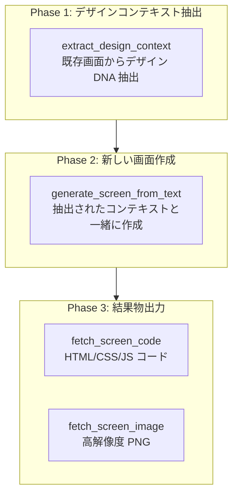
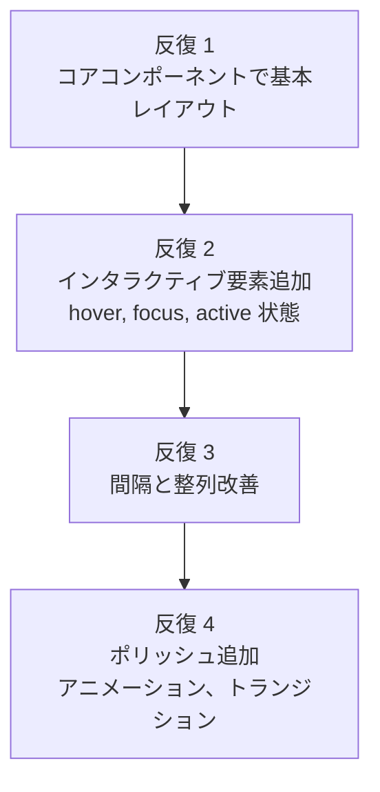

import { Callout } from 'nextra/components'

# Google Stitch ガイド

Google Stitch MCP サーバーを活用して AI ベース UI/UX デザインを作成する方法を詳細に解説します。

<Callout type="tip">
**一言でいうと**: Google Stitch は**テキスト説明だけで優れた UI 画面を作成する AI デザインツール**です。MCP サーバーを通じて Claude Code で直接 UI を作成し、デザインコンテキストを抽出し、本番コードに出力できます。
</Callout>

## Google Stitch とは？

Google Stitch は Google Labs で開発された AI ベース UI/UX デザイン作成ツールです。Gemini AI モデルを使用して自然言語説明を専門家レベルの UI 画面に変換します。

デザイナーがいない開発環境でも Stitch を活用すると一貫したデザインシステムを維持しながら素早く UI をプロトタイピングできます。



### 主な機能

| 機能 | 説明 |
|------|------|
| **AI デザイン作成** | テキストプロンプトで完全な UI 画面を作成 |
| **デザイン DNA 抽出** | 既存画面から色、フォント、レイアウトパターンを抽出 |
| **コード出力** | HTML/CSS/JavaScript 本番コードを生成 |
| **画像出力** | 高解像度 PNG スクリーンショットをダウンロード |
| **プロジェクト管理** | 画面をプロジェクト単位で構成および管理 |
| **Figma 連携** | 作成されたデザインを Figma にコピー可能 |

<Callout type="info">
Google Stitch は**無料**で使用できます。Standard Mode で月 350 回、Experimental Mode で月 50 回生成可能です。Google アカウントがあればすぐに使用できます。
</Callout>

## 事前準備

Google Stitch MCP を使用するには以下の 4 段階設定が必要です。

### Step 1: Google Cloud プロジェクト作成

Google Cloud Console で新しいプロジェクトを作成するか、既存のプロジェクトを選択します。

```bash
# gcloud CLI がない場合はまずインストール
# https://cloud.google.com/sdk/docs/install

# Google Cloud 認証
gcloud auth login

# プロジェクト設定 (既存プロジェクト使用時)
gcloud config set project YOUR_PROJECT_ID
```

### Step 2: Stitch API 有効化

```bash
# beta コンポーネントインストール (最初の 1 回のみ)
gcloud components install beta

# Stitch API 有効化
gcloud beta services mcp enable stitch.googleapis.com --project=YOUR_PROJECT_ID
```

### Step 3: Application Default Credentials 設定

```bash
# アプリケーションデフォルト認証情報ログイン
gcloud auth application-default login

# 割り当てプロジェクト設定
gcloud auth application-default set-quota-project YOUR_PROJECT_ID
```

### Step 4: 環境変数設定

```bash
# .bashrc または .zshrc に追加
export GOOGLE_CLOUD_PROJECT="YOUR_PROJECT_ID"
```

<Callout type="warning">
**Google Cloud プロジェクトで請求** (Billing) が有効化されている必要があります。Stitch 自体は無料ですが、API 呼び出しには請求が設定されたプロジェクトが必要です。また、プロジェクトに `roles/serviceusage.serviceUsageConsumer` IAM ロールが付与されている必要があります。
</Callout>

## MCP 設定

### .mcp.json 設定

プロジェクトルートの `.mcp.json` ファイルに Stitch MCP サーバーを追加します。

```json
{
  "mcpServers": {
    "stitch": {
      "command": "${SHELL:-/bin/bash}",
      "args": ["-l", "-c", "exec npx -y stitch-mcp"],
      "env": {
        "GOOGLE_CLOUD_PROJECT": "YOUR_PROJECT_ID"
      }
    }
  }
}
```

`YOUR_PROJECT_ID` を実際の Google Cloud プロジェクト ID に置き換えてください。

### settings.json 権限設定

MCP ツールを使用するには `permissions.allow` に登録する必要があります。

```json
{
  "permissions": {
    "allow": [
      "mcp__stitch__*"
    ]
  }
}
```

### settings.local.json 有効化

個人環境で Stitch MCP を有効化します。

```json
{
  "enabledMcpjsonServers": ["stitch"]
}
```

### 接続確認

設定が完了したら Claude Code でプロジェクトリストを照会して接続を確認します。

```bash
# Claude Code で実行
> Stitch プロジェクトリストを表示して
```

## MCP ツールリスト

Stitch MCP は 9 つのツールを提供します。

### ツール全体リスト

| ツール | 用途 |
|------|------|
| `create_project` | 新しい Stitch プロジェクト (ワークスペース) 作成 |
| `get_project` | プロジェクト詳細メタデータ照会 |
| `list_projects` | アクセス可能なすべてのプロジェクト一覧表示 |
| `list_screens` | プロジェクト内のすべての画面一覧表示 |
| `get_screen` | 個別画面メタデータ照会 |
| `generate_screen_from_text` | テキストプロンプトで新しい UI 画面を作成 |
| `fetch_screen_code` | 画面の HTML/CSS/JS コードダウンロード |
| `fetch_screen_image` | 画面の高解像度スクリーンショットダウンロード |
| `extract_design_context` | 画面のデザイン DNA 抽出 (色、フォント、レイアウト) |

### ツール選択ガイド

| 目的 | 使用するツール |
|------|-------------|
| 新しいデザインを作成したい | `generate_screen_from_text` |
| 既存のデザインを分析したい | `extract_design_context` |
| デザインをコードで出力したい | `fetch_screen_code` |
| デザイン画像が必要 | `fetch_screen_image` |
| 複数のデザインをプロジェクトで管理したい | `create_project`, `list_projects` |

## Designer Flow ワークフロー

AI エージェントで複数の画面を作成する時の最大の問題は**デザイン一貫性**です。各画面を独立して作成するとフォント、色、レイアウトがバラバラになります。

**Designer Flow** はこの問題を解決する 3 段階パターンです。



### 実戦例: E-コマースアプリ

```bash
# Phase 1: 既存ホーム画面からデザインコンテキスト抽出
> ホーム画面のデザインコンテキストを抽出して
# → extract_design_context(screen_id="home-screen-001")
# → カラーパレット、フォント、間隔パターン抽出

# Phase 2: 抽出されたコンテキストで商品リスト画面作成
> 商品リストページを作成して。3 列グリッド、左側フィルタサイドバー、
#   各カードに画像/タイトル/価格/カートボタンを含む
# → generate_screen_from_text(prompt=..., design_context=抽出されたコンテキスト)

# Phase 3: コードと画像出力
> 作成された画面のコードと画像を出力して
# → fetch_screen_code(screen_id="product-listing-001")
# → fetch_screen_image(screen_id="product-listing-001")
```

<Callout type="tip">
**重要**: 新しい画面を作成する前に**必ず**既存画面で `extract_design_context` を実行してください。这样可以在整个项目中保持一致的设计。
</Callout>

## プロンプト作成ガイド

Stitch で良い結果を得るには構造化されたプロンプトが重要です。

### 5-Part プロンプト構造

| 順序 | 要素 | 説明 | 例示 |
|------|------|------|------|
| 1 | **コンテキスト** | 画面の目的と対象ユーザー | "E-コマース商品リストページ" |
| 2 | **デザイン** | 全体的な視覚スタイル | "ミニマルモダン、明るい背景" |
| 3 | **コンポーネント** | 必要な UI 要素の全体リスト | "ヘッダー、検索、フィルター、カードグリッド" |
| 4 | **レイアウト** | コンポーネント配置方式 | "3 列グリッド、左側フィルタサイドバー" |
| 5 | **スタイル** | 色、フォント、視覚属性 | "青を主色、Inter フォント" |

### 良いプロンプト vs 悪いプロンプト

| 悪いプロンプト | 良いプロンプト |
|--------------|--------------|
| "素晴らしいログインページを作成して" | "ログイン画面: メール/パスワード入力、ログインボタン (青色プライマリ)、ソーシャルログイン (Google, Apple)、パスワード検索リンク。センターカードレイアウト、モバイル縦積み" |
| "ダッシュボードを一つ作成して" | "分析ダッシュボード: 上部 3 つの指標カード (売上、ユーザー、コンバージョン率)、下部ラインチャート、最下部最近の取引テーブル。サイドバーナビゲーション。モバイル: サイドバー非表示、カード縦配置" |
| "375px 幅のボタン" | "モバイル全幅ボタン、大きなタッチ領域" |

### 効果的なプロンプトテンプレート

```
[画面タイプ]を作成して。[コンポーネントリスト]を含む。
[レイアウトタイプ]で配置し[コンテンツ階層]を適用。
[インタラクティブ要素]と[レスポンシブ動作]を含む。
[デザインスタイル/コンテキスト]を適用。
```

<Callout type="info">
**Golden Rule**: プロンプトあたり**1 つの画面**、**1 つか 2 つの調整**のみリクエストしてください。プロンプトは **500 文字以下**に維持するのが良いです。複雑な画面は基本レイアウトから開始して徐々に改善してください。
</Callout>

## ベストプラクティス

| 原則 | 説明 |
|------|------|
| **一貫性優先** | 新しい画面作成前には常に `extract_design_context` を実行してデザイン一貫性を維持します |
| **漸進的アプローチ** | 基本レイアウトから作成し、後続プロンプトでインタラクションと詳細を追加します |
| **アクセシビリティ包含** | ARIA ラベル、キーボードナビゲーション、フォーカスインジケーターを常に明記します |
| **レスポンシブ明記** | モバイルとデスクトップ動作を常にプロンプトに含めます |
| **セマンティック HTML** | header, main, section, nav, footer などセマンティック要素をリクエストします |
| **プロジェクト構成** | 関連画面を同じプロジェクトにグループ化して管理します |

### 漸進的改善戦略

複雑な画面は複数回に分けて作成すると品質が向上します。



## 避けるべきアンチパターン

<Callout type="warning">
以下のパターンを避けるとより良い結果を得られます。

- **過度な仕様**: "375px 幅"、"48px 高さボタン" のようなピクセル単位指定の代わりに "モバイル幅"、"大きなタッチ領域" のような相対的な用語を使用してください
- **曖昧なプロンプト**: "素晴らしいログインページ" ではなくコンポーネントリスト、レイアウト、コンテンツ階層を具体的に明記してください
- **デザインコンテキスト無視**: 既存画面があれば必ず `extract_design_context` で抽出後に渡してください
- **関心事の混合**: "サイドバーを追加してヘッダーも固定して" のようにレイアウト変更とコンポーネント追加を 1 つのプロンプトに混ぜないでください
- **長いプロンプト**: 500 文字を超えると結果が不安定になります。核心要素のみを含み徐々に改善してください
- **レスポンシブ未指定**: Stitch は自動的にモバイル最適化をしません。モバイル/デスクトップ動作を常に明記してください
</Callout>

## トラブルシューティング

| 問題 | 原因 | 解決方法 |
|------|------|-----------|
| 認証エラー | ADC 設定未完了 | `gcloud auth application-default login` 再実行 |
| API 未有効化 | Stitch API 無効状態 | `gcloud beta services mcp enable stitch.googleapis.com` 実行 |
| 権限拒否 | IAM ロール未付与 | プロジェクトに Owner または Editor ロール確認、請求有効化確認 |
| 割り当て超過 | 日次/月次使用量制限 | 割り当てリセット待機 (Standard: 月 350 回、Experimental: 月 50 回) |
| 作成結果不良 | プロンプトが曖昧 | コンポーネントリスト、レイアウトタイプ、コンテンツ階層を追加 |
| 一貫性不足 | design_context 未使用 | 既存画面で `extract_design_context` 後に渡す |

### 認証問題解決

```bash
# 1. 再認証
gcloud auth application-default login

# 2. API 有効化確認
gcloud services list --enabled | grep stitch

# 3. プロジェクト ID 確認
echo $GOOGLE_CLOUD_PROJECT

# 4. API 有効化 (無効な場合)
gcloud beta services mcp enable stitch.googleapis.com --project=YOUR_PROJECT_ID
```

## 関連ドキュメント

- [MCP サーバー活用](/advanced/mcp-servers) - MCP プロトコル概要および他の MCP サーバー
- [settings.json ガイド](/advanced/settings-json) - MCP サーバー権限設定
- [スキルガイド](/advanced/skill-guide) - moai-platform-stitch スキル活用
- [エージェントガイド](/advanced/agent-guide) - エージェントシステムとの連携

<Callout type="tip">
**ヒント**: Google Stitch を最大限に活用するコツは **Designer Flow パターン**です。既存画面からデザインコンテキストを抽出した後新しい画面を作成すると、プロジェクト全体で一貫したデザインを維持できます。
</Callout>
