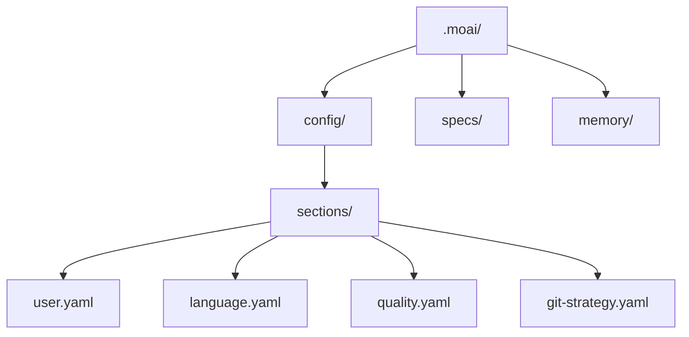
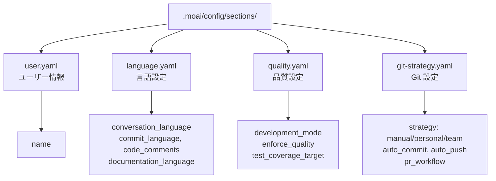

import { Callout } from 'nextra/components'

# 初期設定

MoAI-ADK の対話型セットアップウィザードを使用して最初のセットアップを完了します。9 ステップで開発用にシステムを設定します。

## セットアップウィザードの開始

### 新しいプロジェクトの作成

新しいプロジェクトを作成して初期化するには:

```bash
moai init my-project
```

これにより `my-project` フォルダーが作成され、MoAI-ADK が初期化されます。

### 現在のフォルダーにインストール

既存のプロジェクトに MoAI-ADK をインストールするには、そのフォルダーに移動して実行します:

```bash
cd my-existing-project
moai init
```

<Callout type="tip">
`moai init` は現在のフォルダーに直接インストールします。新しいプロジェクトには `moai init <project-name>` を使用してください。
</Callout>

## 9 ステップのセットアッププロセス

### ステップ 1: 会話言語の選択

Claude が応答する言語を選択します。

```bash
? 会話言語を選択してください:
▸ English - English
  Korean (한국어) - Korean
  Japanese (日本語) - Japanese
  Chinese (中文) - Chinese
```

<Callout type="tip">
言語は後で `.moai/config/sections/language.yaml` で変更できます。
</Callout>

### ステップ 2: 名前の入力

設定ファイルに使用されます。Enter キーでスキップできます。

```bash
? 名前を入力してください: [name]
```

### ステップ 3: Git 自動化モードの選択

Claude が実行できる Git 操作の範囲を設定します。

```bash
? Git 自動化モードを選択してください:
▸ Manual - AI はコミットやプッシュを行いません
  Personal - AI はブランチ作成とコミットが可能
  Team - AI はブランチ作成、コミット、PR 作成が可能
```

**Manual**: AI は Git 操作を実行しません。すべてのコミットとプッシュはユーザーが直接実行します。
**Personal**: AI はブランチを作成してコミットできます。個人プロジェクトに適しています。
**Team**: AI はブランチ作成、コミット、PR 作成まで実行します。チームコラボレーションワークフローに最適化されています。

<Callout type="info">
Git 設定は `.moai/config/sections/git-strategy.yaml` に保存されます。`moai update -c` コマンドでいつでも再設定できます。
</Callout>

### ステップ 4: Git プロバイダーの選択

プロジェクトの Git ホスティングプラットフォームを選択します。

```bash
? Git プロバイダーを選択してください:
▸ GitHub - GitHub.com
  GitLab - GitLab.com またはセルフホスト GitLab
```

### ステップ 5: Git コミットメッセージ言語の選択

コミットメッセージの作成に使用する言語を選択します。

```bash
? Git コミットメッセージ言語を選択してください:
▸ Korean (한국어) - 韓国語でコミット
  English - 英語でコミット
  Japanese (日本語) - 日本語でコミット
  Chinese (中文) - 中国語でコミット
```

<Callout type="tip">
コミットメッセージの言語はコードコメントの言語とは別に設定できます。
</Callout>

### ステップ 6: コードコメント言語の選択

コードコメントに使用する言語を選択します。

```bash
? コードコメント言語を選択してください:
▸ Korean (한국어) - 韓国語でコメント
  English - 英語でコメント
  Japanese (日本語) - 日本語でコメント
  Chinese (中文) - 中国語でコメント
```

<Callout type="info">
ほとんどのプロジェクトでは、コードコメントに英語を使用することが推奨されます。
</Callout>

### ステップ 7: ドキュメント言語の選択

ドキュメントファイルに使用する言語を選択します。

```bash
? ドキュメント言語を選択してください:
▸ Korean (한국어) - 韓国語でドキュメント
  English - 英語でドキュメント
  Japanese (日本語) - 日本語でドキュメント
  Chinese (中文) - 中国語でドキュメント
```

### ステップ 8: Agent Teams 実行モードの選択

MoAI が Agent Teams (並列) または sub-agents (順次) を使用するよう設定します。

```bash
? Agent Teams 実行モードを選択してください:
▸ Auto (推奨) - タスク複雑度に基づくインテリジェント選択
  Sub-agent (クラシック) - 従来の単一エージェントモード
  Team (実験的) - 並列 Agent Teams (実験的機能が必要)
```

**Auto**: タスクの複雑度に応じて自動的に最適なモードを選択します。ほとんどの場合に推奨されます。
**Sub-agent**: 単一エージェントがタスクを順次処理します。依存性が高いタスクに適しています。
**Team**: 複数の専門エージェントが並列で協働します。`CLAUDE_CODE_EXPERIMENTAL_AGENT_TEAMS=1` 環境変数が必要です。

### ステップ 9: チームメンバー表示モードの選択

Agent チームメンバーの表示方法を設定します。分割画面には tmux が必要です。

```bash
? チームメンバー表示モードを選択してください:
▸ Auto (推奨) - tmux が使用可能な場合は tmux、そうでなければ in-process (デフォルト)
  In-Process - 同じターミナルで実行 (どこでも動作)
  Tmux - tmux 分割画面 (tmux/iTerm2 が必要)
```

**Auto**: tmux のインストール状況を自動的に検出し、最適な表示モードを選択します。
**In-Process**: チームメンバーの作業が同じターミナルウィンドウで実行されます。tmux なしでも動作します。
**Tmux**: tmux 分割画面でチームメンバーの作業を視覚的に確認できます。

## セットアップの完了

すべてのステップを完了すると、設定ファイルが作成されます:



生成された設定ファイルを確認します:

```bash
cat .moai/config/sections/user.yaml
```

## 設定構造



## 設定の変更

設定はいつでも変更できます:

### 手動での変更

```bash
# ユーザー設定
vim .moai/config/sections/user.yaml

# 言語設定
vim .moai/config/sections/language.yaml

# 品質設定
vim .moai/config/sections/quality.yaml

# Git 設定
vim .moai/config/sections/git-strategy.yaml
```

### 設定のリセット

すべての設定を再設定するにはセットアップウィザードを再実行します:

```bash
# セットアップウィザードを再実行 (推奨)
moai update -c

# または完全にリセット
moai init --reset
```

<Callout type="tip">
`moai update -c` では、既存の設定を保持しながら、変更したい項目のみを選択的にリセットできます。
</Callout>

<Callout type="warning">
`moai init --reset` はすべての既存設定を上書きします。重要な設定をバックアップしてください。
</Callout>

## 設定の検証

設定が正しく構成されていることを確認します:

```bash
moai doctor
```

出力例:

```bash
moai doctor
システム診断を実行中...

┏━━━━━━━━━━━━━━━━━━━━━━━━━━━━━━━━━━━━━━━━━━┳━━━━━━━━┓
┃ Check                                    ┃ Status ┃
┡━━━━━━━━━━━━━━━━━━━━━━━━━━━━━━━━━━━━━━━━━━╇━━━━━━━━┩
│ Python >= 3.11                           │   ✓    │
│ Git installed                            │   ✓    │
│ Project structure (.moai/)               │   ✓    │
│ Config file (.moai/config/config.yaml)   │   ✓    │
└──────────────────────────────────────────┴────────┘

✓ すべてのチェックに合格しました
```

このコマンドは以下を確認します:

- Python >= 3.11 がインストールされている
- Git がインストールされている
- プロジェクト構造 (`.moai/` フォルダー)
- 設定ファイル (`.moai/config/config.yaml`)

## 次のステップ

セットアップが完了したら、[クイックスタート](./quickstart)ガイドに従って最初のプロジェクトを作成します。

```bash
moai --help
```

すべてのコマンドとオプションを確認できます。

---

## 次のステップ

[クイックスタート](./quickstart)で最初のプロジェクトの作成方法を学んでください。
