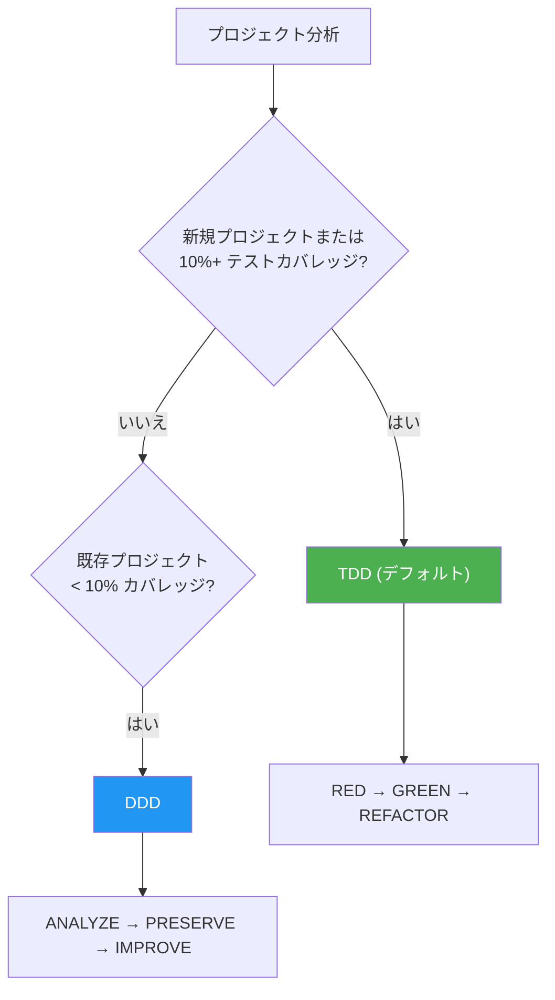
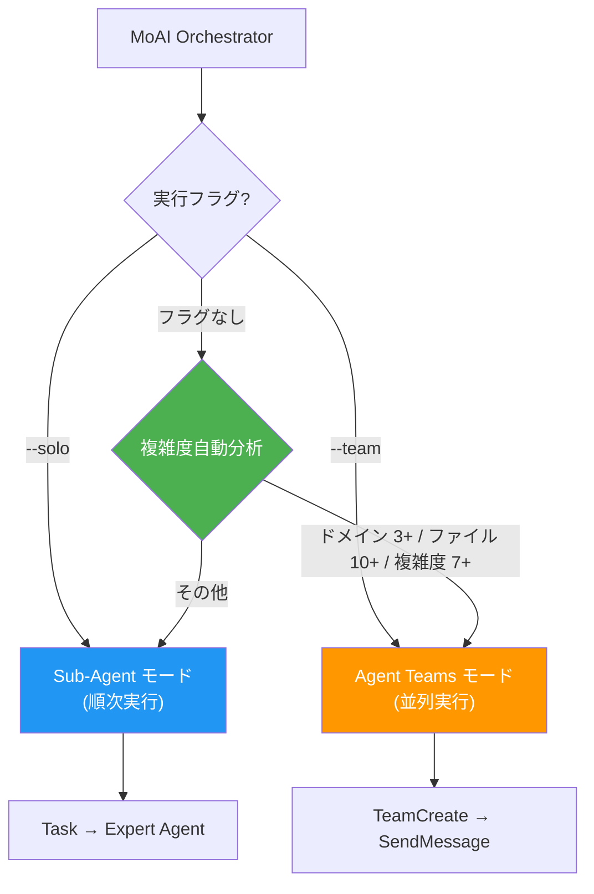
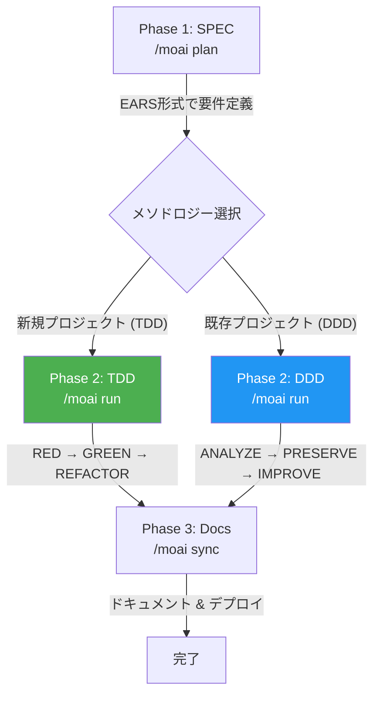

import { Callout } from 'nextra/components'

# はじめに

MoAI-ADK は AI ベースの開発環境であり、高品質なコードを効率的に生成するための包括的なツールキットです。

## 表記について

このドキュメントでは、コマンドプレフィックスで実行環境を示します:

- **Claude Code** チャットウィンドウで入力するコマンド
  ```bash
  > /moai plan "機能の説明"
  ```

- **Terminal** ターミナルで入力するコマンド
  ```bash
  moai init my-project
  ```

## コアコンセプト

MoAI-ADK は **SPEC ベース TDD/DDD** メソドロジーに基づいており、**TRUST 5** 品質フレームワークを通じてコード品質を保証します。

### SPEC とは? (わかりやすく)

**SPEC** (Specification) は「AI との会話を文書化すること」です。

**Vibe Coding** の最大の問題は **コンテキストの消失** です:
- 😰 AI と 1 時間議論した内容がセッション終了時に **消えてしまう**
- 😰 翌日作業を続けるには、**最初から説明し直す必要がある**
- 😰 複雑な機能では **結果が意図と異なる**

**SPEC はこの問題を解決します:**
- ✅ **ファイルに保存すること**で要件を永続的に保持
- ✅ セッションが終了しても SPEC を読むだけで作業を **継続できる**
- ✅ **EARS 形式** を使用して明確に定義

<Callout type="tip">
**要約:** 昨日の「JWT 認証 + 1 時間有効期限 + リフレッシュトークン」についての議論 - 今日再説明する必要はありません。`/moai run SPEC-AUTH-001` と入力するだけで、すぐに実装を開始できます!
</Callout>

### TDD とは? (わかりやすく)

**TDD** (Test-Driven Development) は「テストを先に書いてから開発する方法」です。

試験問題の作成に例えると:
- 📝 **採点基準 (テスト) を先に書きます** — 機能がないので当然失敗
- 💡 **基準を通過する最小限のコードを書きます** — 必要な分だけ
- ✨ **より良いコードに磨き上げます** — テストを維持しながら改善

MoAI-ADK は **RED-GREEN-REFACTOR** サイクルでこのプロセスを自動化します:

| フェーズ | 意味 | 内容 |
|---------|------|------|
| 🔴 **RED** | 失敗 | まだない機能のテストを先に作成 |
| 🟢 **GREEN** | 通過 | テストを通過する最小限のコードを作成 |
| 🔵 **REFACTOR** | 改善 | テストを維持しながらコード品質を向上 |

### DDD とは? (わかりやすく)

**DDD** (Domain-Driven Development) は「安全なコード改善方法」です。

家のリフォームに例えると:
- 🏠 **既存の家を壊さずに**、一度に一部屋を改善
- 📸 **リフォーム前に現状の写真を撮る** (= キャラクタリゼーションテスト)
- 🔧 **一度に一部屋ず作業し、毎回確認** (= 段階的改善)

MoAI-ADK は **ANALYZE-PRESERVE-IMPROVE** サイクルでこのプロセスを自動化します:

| フェーズ | 意味 | 内容 |
|------|---------|--------------|
| **ANALYZE** | 分析 | 現在のコード構造と問題を理解 |
| **PRESERVE** | 保存 | テストで現在の動作を記録 (安全網) |
| **IMPROVE** | 改善 | テストが通る状態で段階的に改善 |

### 開発メソドロジーの選択

MoAI-ADK はプロジェクトの状態に基づいて最適な開発メソドロジーを自動的に選択します。



| メソドロジー | 対象 | サイクル |
|--------------|------|----------|
| **TDD** | 新規プロジェクトまたは 10%+ カバレッジ | RED → GREEN → REFACTOR |
| **DDD** | 10% 未満のカバレッジの既存プロジェクト | ANALYZE → PRESERVE → IMPROVE |

<Callout type="info">
MoAI-ADK v2.5.0+ はバイナリメソドロジー選択 (TDD または DDD のみ) を使用します。明確性と一貫性のため、ハイブリッドモードは削除されました。メソドロジーは `moai init` 時に自動選択され、`.moai/config/sections/quality.yaml` の `development_mode` で変更できます。
</Callout>

### TRUST 5 品質フレームワーク

TRUST 5 は 5 つのコア原則に基づいています:

| 原則 | 説明 |
|-----------|-------------|
| **T**ested (テスト済み) | 85% カバレッジ、キャラクタリゼーションテスト、動作保持 |
| **R**eadable (読みやすい) | 明確な命名規則、一貫したフォーマット |
| **U**nified (統一された) | 統一されたスタイルガイド、自動フォーマット |
| **S**ecured (安全な) | OWASP 準拠、セキュリティ検証、脆弱性分析 |
| **T**rackable (追跡可能な) | 構造化されたコミット、変更履歴の追跡 |

## Go Edition の特徴

MoAI-ADK 2.5 は Python Edition を Go で完全に書き直し、パフォーマンスと効率を最大化しました。

| 項目 | Python Edition | Go Edition |
|------|----------------|------------|
| 配布 | pip + venv + 依存関係 | **単一バイナリ**、依存関係なし |
| 起動時間 | ~800ms インタプリタ起動 | **~5ms** ネイティブ実行 |
| 並行性 | asyncio / threading | **ネイティブ goroutines** |
| 型安全性 | ランタイム (mypy オプション) | **コンパイル時強制** |
| クロスプラットフォーム | Python ランタイム必要 | **プリビルドバイナリ** (macOS, Linux, Windows) |

### 主要な数値

- **34,220 行**の Go コード、**32** パッケージ
- **85-100%** テストカバレッジ
- **28** の専門 AI エージェント + **52** のスキル
- **18** のプログラミング言語サポート
- **16** の Claude Code フックイベント

## システム要件

| プラットフォーム | サポート環境 | 備考 |
|-----------------|-------------|------|
| macOS | Terminal, iTerm2 | 完全サポート |
| Linux | Bash, Zsh | 完全サポート |
| Windows | **WSL (推奨)**, PowerShell 7.x+ | ネイティブ cmd.exe は非対応 |

**前提条件:**
- **Git** がすべてのプラットフォームにインストールされている必要があります
- **Windows ユーザー**: 最高の体験のために WSL (Windows Subsystem for Linux) の使用を推奨します

## コアバリュー

MoAI-ADK は以下のコアバリューを提供します:

- **SPEC ベース TDD/DDD**: 要件を文書化し、段階的に開発する構造化されたメソドロジー (新規プロジェクトは TDD、レガシーコードは DDD)
- **TRUST 5 品質フレームワーク**: テスト、可読性、統一性、セキュリティ、追跡可能性を保証する 5 つの原則
- **28 の専門エージェント**: 各開発フェーズに特化した AI エージェントチーム
- **52 のスキル**: さまざまな開発シナリオをサポートする拡張可能なスキルライブラリ
- **多言語サポート**: 韓国語、英語、日本語、中国語の 4 言語をサポート
- **Sequential Thinking MCP**: ステップバイステップ推論による構造化された問題解決
- **Ralph-Style LSP Integration**: LSP ベースの自律ワークフローとリアルタイム品質フィードバック

## 主な機能

MoAI-ADK は 28 の専門 AI エージェントと 52 のスキルを提供し、開発ワークフロー全体を自動化・最適化します。

### エージェントカテゴリ

| カテゴリ | 数 | 主なエージェント |
|----------|-------|------------|
| **Manager** | 8 | spec, ddd, tdd, docs, quality, project, strategy, git |
| **Expert** | 8 | backend, frontend, security, devops, performance, debug, testing, refactoring |
| **Builder** | 3 | agent, skill, plugin |
| **Team** | 8 | researcher, analyst, architect, designer, backend-dev, frontend-dev, tester, quality |

### モデルポリシー (トークン最適化)

MoAI-ADK は Claude Code サブスクリプションプランに基づいて 28 エージェントに最適な AI モデルを割り当てます。プランのレート制限内で品質を最大化します。

| ポリシー | プラン | 🟣 Opus | 🔵 Sonnet | 🟡 Haiku | 用途 |
|----------|--------|---------|-----------|----------|------|
| **High** | Max $200/月 | 23 | 1 | 4 | 最高品質、最大スループット |
| **Medium** | Max $100/月 | 4 | 19 | 5 | 品質とコストのバランス |
| **Low** | Plus $20/月 | 0 | 12 | 16 | 経済的、Opus アクセスなし |

<Callout type="tip">
Plus $20 プランには Opus アクセスが含まれていません。**Low** に設定すると、すべてのエージェントが Sonnet と Haiku のみを使用し、レート制限エラーを防ぎます。上位プランでは、重要なエージェント (セキュリティ、戦略、アーキテクチャ) に Opus を、通常タスクに Sonnet/Haiku を配分します。
</Callout>

#### 主要エージェントモデル割り当て

| エージェント | High | Medium | Low |
|--------------|------|--------|-----|
| manager-spec, manager-strategy, expert-security | 🟣 opus | 🟣 opus | 🔵 sonnet |
| manager-ddd/tdd, expert-backend/frontend | 🟣 opus | 🔵 sonnet | 🔵 sonnet |
| manager-quality, team-researcher | 🟡 haiku | 🟡 haiku | 🟡 haiku |

### デュアル実行モード

`--solo` (Sub-Agent モード) と `--team` (Agent Teams モード) の 2 つの実行モードを提供します。どちらのモードも順次または並列実行を自律的に判断します。フラグなしで実行すると、タスクの複雑度を分析して最適なモードを自動選択します。



| フラグ | モード | 実行方式 |
|--------|--------|----------|
| `--solo` | Sub-Agent モード | 専門エージェントへの順次委任 |
| `--team` | Agent Teams モード | チームエージェントの並列協調 |
| (なし) | 自動選択 | 複雑度に基づいて自律判断 |

```bash
/moai run SPEC-AUTH-001          # 自動選択
/moai run SPEC-AUTH-001 --team   # Agent Teams 強制 (並列)
/moai run SPEC-AUTH-001 --solo   # Sub-Agent 強制 (順次)
```

### SPEC-First ワークフロー

MoAI-ADK は 3 段階の開発ワークフローに従います。Run フェーズのメソドロジーはプロジェクト状態に応じて自動選択されます:



### 推奨ワークフローチェーン

**新機能開発:**
```
/moai plan → /moai run SPEC-XXX → /moai sync SPEC-XXX
```

**バグ修正:**
```
/moai fix (または /moai loop) → /moai review → /moai sync
```

**リファクタリング:**
```
/moai plan → /moai clean → /moai run SPEC-XXX → /moai review → /moai coverage → /moai codemaps
```

**ドキュメント更新:**
```
/moai codemaps → /moai sync
```

## 多言語サポート

MoAI-ADK は 4 つの言語をサポートしています:

- 🇰🇷 **韓国語** (Korean)
- 🇺🇸 **英語** (English)
- 🇯🇵 **日本語** (Japanese)
- 🇨🇳 **中国語** (Chinese)

インストールウィザードで好みの言語を選択するか、設定ファイルで直接変更できます。

## LSP 統合

**LSP** (Language Server Protocol) はコードエディタと言語ツール間の標準通信プロトコルです。コードエラー、型エラー、Lint 結果をリアルタイムで検出し、即座にフィードバックを提供します。

**Ralph-Loop Style** は LSP 診断結果をフィードバックループとして活用する自律ワークフローです。品質問題が検出されると修正エージェントを自動的に呼び出し、品質基準を達成するまで繰り返します。

MoAI-ADK は Ralph-Loop Style LSP 統合を通じて自律ワークフローを提供します:

- **LSP ベース完了マーカー自動検出**: コード品質状態をリアルタイムでモニタリング
- **リアルタイム回帰検出**: 変更が既存機能に与える影響を即座に検出
- **自動完了条件**: 0 エラー、0 タイプエラー、85% カバレッジ達成時に自動完了処理

<Callout type="info">
Ralph-Loop Style LSP 統合は開発ワークフローの品質ゲートを自動化し、手動介入なしでも高いコード品質を維持できるようにします。
</Callout>

## 💡 GLM でトークンを 50~70% 節約

GLM は Claude Code と完全互換の AI モデルです。**CG モード**では、Claude Opus リーダーと GLM-5 チームメンバーを組み合わせることで、実装作業のトークンを **50~70% 節約**できます。

### CG モード: Claude + GLM エージェントチーム

CG モードでは、Claude Opus がワークフロー全体をオーケストレーションし、GLM-5 チームメンバーが低コストで実装作業を並列処理します。

| 役割 | モデル | 担当作業 |
|------|-------|---------|
| **リーダー** | Claude Opus | オーケストレーション、アーキテクチャ決定、コードレビュー |
| **チームメンバー** | GLM-5 | コード実装、テスト作成、ドキュメント化 |

| 作業タイプ | 推奨モード | 節約効果 |
|-----------|----------|---------|
| 実装重視 SPEC (`/moai run`) | CG モード | **50~70% 節約** |
| コード生成、テスト、ドキュメント | CG モード | **50~70% 節約** |
| アーキテクチャ設計、セキュリティレビュー | Claude 専用 | Opus 推論が必要 |

### GLM への切り替え

```bash
# GLM バックエンドに切り替え
moai glm

# GLM Worker モード開始 (Opus リーダー + GLM-5 チームメンバー)
moai glm --team

# CG モード (Claude リーダー + GLM チームメイト、tmux 必須)
moai cg

# Claude バックエンドに戻る
moai cc
```

<Callout type="tip">
GLM アカウントをお持ちでない方は、[z.ai (追加 10% 割引)](https://z.ai/subscribe?ic=1NDV03BGWU) からご登録ください。リンク登録による報酬は **MoAI オープンソース開発**に使用されます。🙏
</Callout>

## はじめに

MoAI-ADK を始めるには:

1. **[インストール](/getting-started/installation)** - システムに MoAI-ADK をインストール
2. **[初期設定](/getting-started/installation)** - 対話型セットアップウィザードを実行
3. **[クイックスタート](/getting-started/quickstart)** - 最初のプロジェクトを作成
4. **[コアコンセプト](/core-concepts/what-is-moai-adk)** - MoAI-ADK の理解を深める

## 主なメリット

| メリット | 説明 |
|---------|-------------|
| **品質保証** | TRUST 5 フレームワークで一貫した品質を維持 |
| **生産性** | AI エージェント自動化で開発時間を短縮 |
| **コスト効率** | GLM 5 で 70% のコスト削減 |
| **スケーラブル** | モジュラーアーキテクチャで柔軟に拡張 |
| **多言語** | 4 つの言語をサポート |

## 追加リソース

- [GitHub リポジトリ](https://github.com/modu-ai/moai-adk)
- [ドキュメントサイト](https://adk.mo.ai.kr)
- [コミュニティフォーラム](https://github.com/modu-ai/moai-adk/discussions)

---

## 次のステップ

[インストールガイド](./installation)で MoAI-ADK のインストール方法を学んでください。
