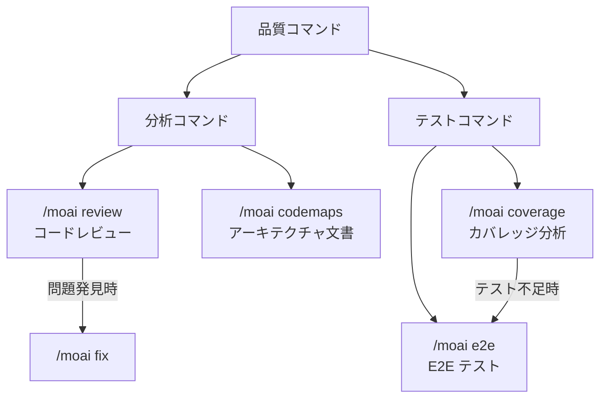

import { Callout } from 'nextra/components'

# 品質コマンド

MoAI-ADK のコード品質管理コマンドを紹介します。

<Callout type="info">
品質コマンドは、**コードレビュー、テストカバレッジ、E2E テスト、アーキテクチャ分析**に特化したコマンドです。コード品質を体系的に管理・改善できます。
</Callout>

## コマンド比較

| コマンド | 目的 | 実行方式 | 使用タイミング |
|----------|------|----------|----------------|
| `/moai review` | コードレビュー | セキュリティ/性能/品質/UX の 4 観点分析 | PR 前にコードレビューが必要なとき |
| `/moai coverage` | カバレッジ分析 | テストギャップ分析とテスト生成 | テストカバレッジを向上させたいとき |
| `/moai e2e` | E2E テスト | ブラウザ自動化テストの作成/実行 | ユーザーフローを検証したいとき |
| `/moai codemaps` | アーキテクチャ文書 | コードベース構造分析と文書化 | プロジェクトアーキテクチャを把握したいとき |

## コマンド関係図

<Callout type="tip">
**どのコマンドを使えばいいかわからない場合**

- コード品質を全体的にチェックしたい → `/moai review`
- テストが不足している部分を見つけて補強したい → `/moai coverage`
- ユーザー視点でアプリが正しく動作するか確認したい → `/moai e2e`
- プロジェクト構造を理解して文書化したい → `/moai codemaps`
</Callout>
