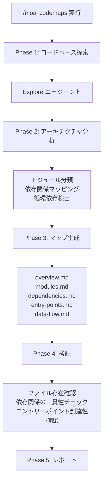
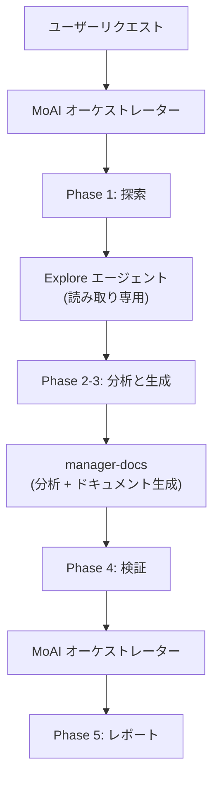

import { Callout } from 'nextra/components'

# /moai codemaps

コードベースをスキャンして **アーキテクチャドキュメント** を自動生成するコマンドです。

<Callout type="tip">
**一言まとめ**: `/moai codemaps` は「アーキテクチャ地図作成者」です。コードベースを分析して、モジュールマップ、依存関係グラフ、エントリーポイントカタログなど **構造ドキュメントを自動生成** します。
</Callout>

<Callout type="info">
**スラッシュコマンド**: Claude Code で `/moai:codemaps` と入力すると、このコマンドを直接実行できます。`/moai` だけ入力すると、利用可能なすべてのサブコマンドの一覧が表示されます。
</Callout>

## 概要

新しいプロジェクトに参加したり大規模なコードベースを把握する際、アーキテクチャの理解が最も重要です。`/moai codemaps` はコードベースを自動的に分析し、モジュールマップ、依存関係グラフ、エントリーポイントカタログ、データフロードキュメントを生成します。

生成されたドキュメントは `.moai/project/codemaps/` ディレクトリに保存され、人間と AI エージェントの両方がコードベースを素早く理解できるようにします。

## 使用法

```bash
# コードベース全体のアーキテクチャドキュメント生成
> /moai codemaps

# 既存ドキュメントを無視して再生成
> /moai codemaps --force

# 特定エリアのみ分析
> /moai codemaps --area api

# Mermaid ダイアグラムを含む
> /moai codemaps --format mermaid

# 探索深度を制限
> /moai codemaps --depth 3
```

## サポートされるフラグ

| フラグ | 説明 | 例 |
|--------|------|----|
| `--force` (エイリアス `--regenerate`) | 既存ドキュメントを無視して全コードマップを再生成 | `/moai codemaps --force` |
| `--area AREA` | 特定エリアに集中して分析 | `/moai codemaps --area auth` |
| `--format FORMAT` | 出力形式 (markdown, mermaid, json、デフォルト: markdown) | `/moai codemaps --format mermaid` |
| `--depth N` | 最大ディレクトリ探索深度 (デフォルト: 4) | `/moai codemaps --depth 3` |

### --force フラグ

既存のコードマップドキュメントをすべて削除し、最初から再生成します:

```bash
> /moai codemaps --force
```

コードベースに大きな変更があった場合に便利です。

### --area フラグ

特定エリアとその依存関係のみを分析します:

```bash
# API モジュールのみ分析
> /moai codemaps --area api

# 認証モジュールのみ分析
> /moai codemaps --area auth
```

結果は `.moai/project/codemaps/{area}/` に保存されます。

### --format フラグ

出力形式を指定します:

```bash
# Mermaid ダイアグラムを含む
> /moai codemaps --format mermaid

# JSON 形式も追加生成
> /moai codemaps --format json
```

## 実行プロセス

`/moai codemaps` は5段階で実行されます。



### Phase 1: コードベース探索

`Explore` エージェントがコードベースを深く探索します:

| 探索対象 | 説明 |
|----------|------|
| ディレクトリ構造 | 最上位と重要なサブディレクトリのマッピング |
| モジュール境界 | パッケージ/モジュール境界と責務の特定 |
| エントリーポイント | メインエントリーポイントの探索 (main.go, index.ts, app.py など) |
| パブリック API | エクスポートされた関数、型、インターフェースのリスト |
| 依存関係グラフ | モジュール間依存関係のマッピング (import, require) |
| 外部依存関係 | サードパーティ依存関係のカタログ |
| 設定ファイル | ビルド、デプロイ、設定ファイルの特定 |

### Phase 2: アーキテクチャ分析

`manager-docs` エージェントが探索結果を分析します:

- レイヤー別モジュール分類 (プレゼンテーション、ビジネス、データ、インフラ)
- 高い fan-in モジュールの特定 (`@MX:ANCHOR` 候補)
- 循環依存の検出
- リクエスト/データフローパスのマッピング
- ドメイン境界の特定
- アーキテクチャパターンの認識 (MVC, Clean, Hexagonal など)

### Phase 3: マップ生成

`.moai/project/codemaps/` ディレクトリに5つのドキュメントを生成します:

| ファイル | 内容 |
|---------|------|
| `overview.md` | 高レベルアーキテクチャ要約とモジュール説明 |
| `modules.md` | 詳細モジュールカタログ (責務、依存関係) |
| `dependencies.md` | 依存関係グラフ (テキストと Mermaid ダイアグラム) |
| `entry-points.md` | エントリーポイントカタログと呼び出しパス |
| `data-flow.md` | 主要データフローパス |

`--area` フラグ使用時:
- `.moai/project/codemaps/{area}/overview.md`
- `.moai/project/codemaps/{area}/modules.md`
- `.moai/project/codemaps/{area}/dependencies.md`

### Phase 4: 検証

- 参照されたすべてのファイルとモジュールの実在確認
- 依存関係の双方向一貫性チェック
- エントリーポイントの到達可能性検証
- 既存コードマップとの変更点比較 (`--force` でない場合)

### Phase 5: レポート

```
## コードマップ生成レポート

### 生成されたファイル
- .moai/project/codemaps/overview.md
- .moai/project/codemaps/modules.md
- .moai/project/codemaps/dependencies.md
- .moai/project/codemaps/entry-points.md
- .moai/project/codemaps/data-flow.md

### アーキテクチャハイライト
- パターン: Clean Architecture
- モジュール数: 12個
- エントリーポイント: 3個 (API サーバー, CLI, ワーカー)

### 潜在的な問題
- 循環依存: pkg/auth <-> pkg/user
- 高い結合度: pkg/core (fan_in: 8)
- 孤立モジュール: pkg/legacy (使用箇所なし)
```

## エージェント委任チェーン



**エージェントの役割:**

| エージェント | 役割 | 主な作業 |
|-------------|------|----------|
| **MoAI オーケストレーター** | ワークフロー調整、検証、レポート | フラグ解析、検証、ユーザーインタラクション |
| **Explore** | コードベース探索 (読み取り専用) | ディレクトリ構造、モジュール境界、依存関係マッピング |
| **manager-docs** | アーキテクチャ分析とドキュメント生成 | モジュール分類、依存関係分析、コードマップファイル作成 |

## よくある質問

### Q: コードマップはどのくらいの頻度で再生成すべきですか?

大規模なリファクタリングや新しいモジュールの追加後に再生成することをお勧めします。`/moai sync` を実行すると、コードマップも自動的に更新されます。

### Q: --area で生成したコードマップは全体コードマップと競合しますか?

いいえ。エリア固有のコードマップは別のサブディレクトリに保存されます。全体コードマップとは独立して管理されます。

### Q: 生成されたコードマップを手動で編集できますか?

はい、手動編集は可能です。ただし、`--force` で再生成すると手動編集は上書きされます。`--force` なしで実行すると、既存ドキュメントを参考にした増分更新が行われます。

### Q: どのアーキテクチャパターンを認識しますか?

MVC、Clean Architecture、Hexagonal、Layered Architecture などの主要パターンを認識します。認識されたパターンは `overview.md` に記録されます。

## 関連ドキュメント

- [/moai review - コードレビュー](/quality-commands/moai-review)
- [/moai coverage - カバレッジ分析](/quality-commands/moai-coverage)
- [/moai mx - @MX タグスキャン](/utility-commands/moai-mx)
