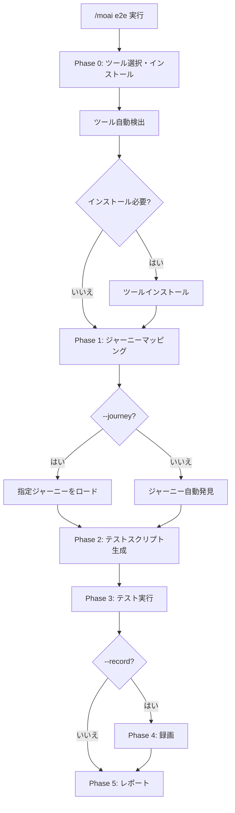
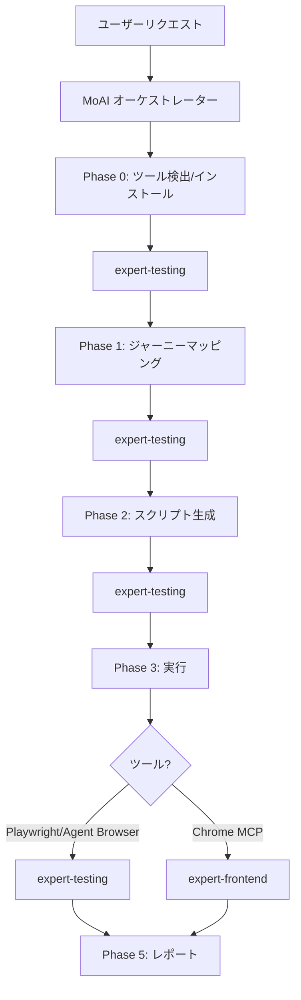

import { Callout } from 'nextra/components'

# /moai e2e

ブラウザ自動化ツールを使用して **E2E (エンドツーエンド) テスト** を作成・実行するコマンドです。

<Callout type="tip">
**一言まとめ**: `/moai e2e` は「ユーザージャーニーテスター」です。**3つのブラウザツール** から最適なものを選択し、ユーザーフローを自動テストします。
</Callout>

<Callout type="info">
**スラッシュコマンド**: Claude Code で `/moai:e2e` と入力すると、このコマンドを直接実行できます。`/moai` だけ入力すると、利用可能なすべてのサブコマンドの一覧が表示されます。
</Callout>

## 概要

E2E テストは、実際のユーザーの視点からアプリケーションが正しく動作するかを検証します。`/moai e2e` は3つのブラウザ自動化ツールをサポートし、プロジェクト環境に適したツールを自動選択します。

ユーザージャーニーを自動的に発見し、テストスクリプトを生成し、実行結果をレポートします。GIF 録画機能で視覚的な検証も可能です。

## 使用法

```bash
# 自動ツール選択で E2E テスト実行
> /moai e2e

# Playwright を指定
> /moai e2e --tool playwright

# GIF 録画を含む
> /moai e2e --record

# 特定 URL を対象
> /moai e2e --url http://localhost:3000

# 特定のユーザージャーニーのみ実行
> /moai e2e --journey login

# ヘッドレスモードを無効化 (デバッグ用)
> /moai e2e --headless false
```

## サポートされるフラグ

| フラグ | 説明 | 例 |
|--------|------|----|
| `--tool TOOL` | ブラウザツールの選択 (agent-browser, playwright, chrome-mcp) | `/moai e2e --tool playwright` |
| `--record` | ブラウザ操作を GIF で録画 | `/moai e2e --record` |
| `--url URL` | テスト対象 URL (デフォルト: プロジェクト設定から自動検出) | `/moai e2e --url http://localhost:3000` |
| `--journey NAME` | 特定のユーザージャーニーのみ実行 | `/moai e2e --journey login` |
| `--headless` | ヘッドレスモード (デフォルト: true) | `/moai e2e --headless false` |
| `--browser BROWSER` | Playwright のブラウザ選択 (chromium, firefox, webkit) | `/moai e2e --browser firefox` |
| `--timeout N` | テストタイムアウト (秒、デフォルト: 30) | `/moai e2e --timeout 60` |
| `--retry N` | 失敗テストのリトライ回数 (デフォルト: 1) | `/moai e2e --retry 3` |

## ブラウザ自動化ツール

### ツール比較

| 機能 | Agent Browser | Playwright CLI | Claude in Chrome |
|------|--------------|----------------|------------------|
| **トークンコスト** | 低 (CLI 出力) | 低 (CLI 出力) | 高 (MCP ラウンドトリップ) |
| **セットアップ** | npm install | npx playwright install | Chrome 拡張必要 |
| **ヘッドレス** | 対応 | 対応 | 非対応 (Chrome 必要) |
| **クロスブラウザ** | Chromium のみ | Chromium, Firefox, WebKit | Chrome のみ |
| **GIF 録画** | Playwright trace | Playwright trace | MCP GIF creator |
| **AI ナビゲーション** | 内蔵 AI エージェント | スクリプトベース | MCP ツールベース |
| **適した用途** | AI 探索テスト | 決定的テストスイート | インタラクティブデバッグ |
| **CI/CD** | 対応 | 対応 | 非対応 |

### 自動選択ロジック

`--tool` フラグを指定しない場合、タスク特性に応じて最適なツールを自動選択します:

| 条件 | 選択されるツール | 理由 |
|------|----------------|------|
| `--record` フラグ使用 | Claude in Chrome | 最高の GIF 録画機能 |
| CI/CD 環境検出 | Playwright CLI | 最も安定したヘッドレスサポート |
| AI 探索が必要なジャーニー | Agent Browser | 内蔵 AI ナビゲーション |
| 決定的テストが必要 | Playwright CLI | 最も安定、クロスブラウザ |
| インタラクティブデバッグ | Claude in Chrome | リアルタイムの視覚フィードバック |
| デフォルト | Playwright CLI | 機能とトークン効率の最適バランス |

## 実行プロセス

`/moai e2e` は5段階 (+インストール段階) で実行されます。



### Phase 0: ツール選択・インストール

3つのツールのインストール状態を並列で確認します:

```bash
# 自動検出コマンド (並列実行)
npx agent-browser --version     # Agent Browser
npx playwright --version         # Playwright
# Chrome MCP ツールの可用性確認    # Claude in Chrome
```

インストールが必要な場合:

| ツール | インストールコマンド |
|--------|-------------------|
| **Playwright** | `npx playwright install --with-deps chromium` |
| **Agent Browser** | `npm install -g agent-browser` |
| **Claude in Chrome** | Chrome 拡張インストール (自動インストール不可) |

### Phase 1: ジャーニーマッピング

`--journey` フラグがない場合、アプリケーションを分析して主要なユーザージャーニーを自動発見します:

- プロジェクトドキュメント (`.moai/project/product.md`) の分析
- ルート定義の分析 (`routes.ts`, `urls.py`, `router.go`)
- フォーム要素、認証フロー、CRUD 操作の特定
- クリティカルなユーザーパスのマッピング (ログイン、主要機能、エラー処理)

### Phase 2: テストスクリプト生成

選択されたツールに合わせたテストファイルを生成します:

| ツール | テストファイル形式 | 場所 |
|--------|-------------------|------|
| **Playwright** | `{journey-name}.spec.ts` | `e2e/` |
| **Agent Browser** | `{journey-name}.agent.ts` | `e2e/` |
| **Claude in Chrome** | 構造化された MCP プロンプト | メモリ内 |

Playwright テストに含まれるもの:
- Page Object Model パターン
- ステップごとのアサーション
- スクリーンショットキャプチャ
- ネットワークレスポンス検証
- アクセシビリティチェック (`@axe-core/playwright`)

### Phase 3: テスト実行

| ツール | 実行方法 |
|--------|----------|
| **Playwright** | `npx playwright test e2e/` (CLI、トークン効率的) |
| **Agent Browser** | `npx agent-browser --task "..."` (CLI、AI ナビゲーション) |
| **Claude in Chrome** | MCP ツール呼び出し (リアルタイム、高トークンコスト) |

### Phase 4: 録画 (オプション)

`--record` フラグ使用時:

| ツール | 録画方法 | 出力 |
|--------|----------|------|
| **Playwright** | `npx playwright test --trace on` | `e2e/traces/` |
| **Agent Browser** | `npx agent-browser --task "..." --trace` | `e2e/recordings/` |
| **Claude in Chrome** | `mcp__claude-in-chrome__gif_creator` | `e2e/recordings/{journey}.gif` |

### Phase 5: レポート

```
## E2E テストレポート

### 使用ツール: Playwright CLI

### 結果サマリー
| ジャーニー | ステータス | 所要時間 | スクリーンショット |
|-----------|-----------|---------|-------------------|
| ログイン | PASS | 2.3秒 | 3枚 |
| 決済 | FAIL | 5.1秒 | 4枚 |

### 失敗詳細
- 決済 (ステップ4): /confirmation へのリダイレクト期待、/error に遷移
  - スクリーンショット: e2e/screenshots/checkout-step4.png
  - エラー: TimeoutError: 30000ms タイムアウト超過

### 録画 (--record 使用時)
- e2e/recordings/login_flow.gif
- e2e/recordings/checkout_process.gif

### カバレッジ
- テスト済みユーザージャーニー: 5/7
- カバー済みクリティカルパス: 3/3
- テスト済みエラーシナリオ: 2/4
```

## エージェント委任チェーン



**エージェントの役割:**

| エージェント | 役割 | 主な作業 |
|-------------|------|----------|
| **MoAI オーケストレーター** | ワークフロー調整、ユーザーインタラクション | レポート出力、次のステップ案内 |
| **expert-testing** | ツール検出、ジャーニーマッピング、スクリプト生成、実行 | E2E テストパイプライン全体 |
| **expert-frontend** | Chrome MCP 実行 (Chrome モードのみ) | ブラウザ自動化、GIF 録画 |

## よくある質問

### Q: どのツールを選ぶべきですか?

ほとんどの場合、**Playwright CLI** が最良の選択です。CI/CD サポート、クロスブラウザテスト、低トークンコストを提供します。AI ベースの探索には Agent Browser、視覚的デバッグには Claude in Chrome を使用してください。

### Q: CI/CD パイプラインで使用できますか?

Playwright CLI と Agent Browser は CI/CD をサポートします。Claude in Chrome は実際の Chrome ブラウザが必要なため、CI/CD では使用できません。

### Q: GIF 録画のトークンコストは?

Playwright/Agent Browser は CLI trace を使用するため、追加トークンコストはありません。Claude in Chrome の GIF 録画は MCP ラウンドトリップにより、トークンコストが高くなります。

### Q: 既存の E2E テストがある場合は?

既存のテストを検出し、既存パターンに合わせて新しいテストを追加します。既存テストは上書きされません。

## 関連ドキュメント

- [/moai coverage - カバレッジ分析](/quality-commands/moai-coverage)
- [/moai review - コードレビュー](/quality-commands/moai-review)
- [/moai fix - ワンショット自動修正](/utility-commands/moai-fix)
