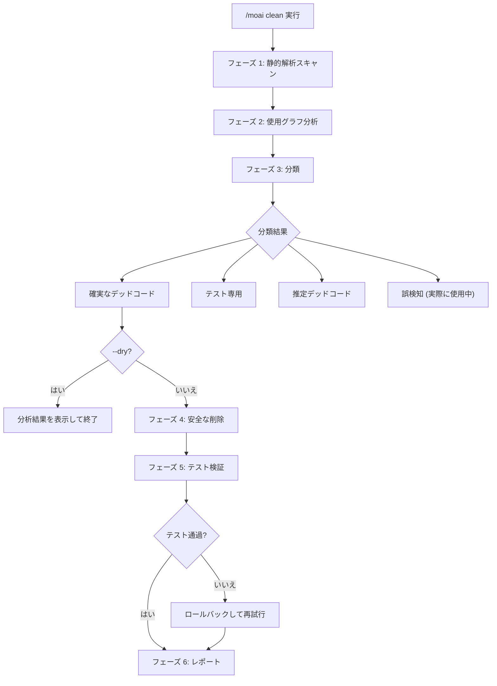
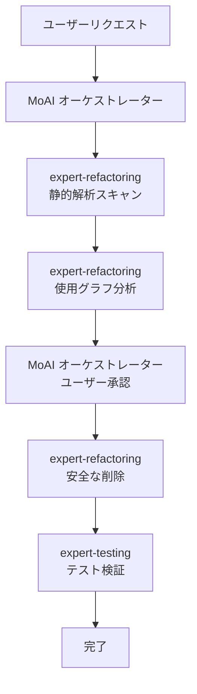

import { Callout } from 'nextra/components'

# /moai clean

デッドコードの特定と安全な削除コマンドです。静的解析と使用グラフ分析により、**未使用コードを見つけて安全に削除**します。

<Callout type="tip">
**一行要約**: `/moai clean` は「コードダイエットツール」です。使用されていない関数、変数、import、ファイルを**自動で見つけて安全に削除**します。
</Callout>

<Callout type="info">
**スラッシュコマンド**: Claude Code で `/moai:clean` と入力すると、このコマンドを直接実行できます。`/moai` だけ入力すると、利用可能なすべてのサブコマンドの一覧が表示されます。
</Callout>

## 概要

プロジェクトが成長すると、使用されなくなったコードが蓄積されます。未使用の import、呼び出されない関数、参照されない型がコードベースを複雑にします。`/moai clean` は静的解析でデッドコードを検出し、テスト検証を経て安全に削除します。

## 使用方法

```bash
# 基本的な使用方法
> /moai clean

# プレビュー (変更なしで確認のみ)
> /moai clean --dry

# 確実なデッドコードのみ削除
> /moai clean --safe-only

# 特定のファイル/ディレクトリのみ分析
> /moai clean --file src/auth/

# 特定のコードタイプのみ分析
> /moai clean --type functions
```

## サポートされるフラグ

| フラグ | 説明 | 例 |
|-------|------|------|
| `--dry` (または `--dry-run`) | 削除せずに分析結果のみ表示 | `/moai clean --dry` |
| `--safe-only` | 確実なデッドコードのみ削除 (不確実な項目をスキップ) | `/moai clean --safe-only` |
| `--file PATH` | 特定のファイルまたはディレクトリのみ分析 | `/moai clean --file src/utils/` |
| `--type TYPE` | 特定のコードタイプのみ分析 | `/moai clean --type imports` |
| `--aggressive` | 低使用コードも含める (1 つの呼び出し元もデッドコードの場合) | `/moai clean --aggressive` |

### --type フラグオプション

| タイプ | 説明 |
|--------|------|
| `functions` | 呼び出されない関数/メソッド |
| `imports` | 参照されない import 文 |
| `types` | 使用されない型定義 |
| `variables` | 宣言後に使用されない変数 |
| `files` | どこからも import されないファイル |

### --dry フラグ

実際のコードを変更せずに、どの項目がデッドコードとして分類されるかを事前に確認します:

```bash
> /moai clean --dry
```

削除前に分析結果を確認したい場合に便利です。

## 実行プロセス

`/moai clean` は 6 段階で実行されます。



### フェーズ 1: 静的解析スキャン

言語別のツールを使用してデッドコード候補を検出します:

| 言語 | 分析ツール | 検出対象 |
|------|-----------|----------|
| **Go** | `go vet`, `staticcheck`, `deadcode` | 未使用変数、関数、型 |
| **Python** | `vulture`, `autoflake` | デッドコード、未使用 import |
| **TypeScript/JavaScript** | `ts-prune`, ESLint `no-unused-vars` | 未使用 export、変数 |
| **Rust** | `cargo clippy`, `cargo udeps` | デッドコード警告、未使用依存関係 |

### フェーズ 2: 使用グラフ分析

静的解析結果を検証するための使用グラフを構築します:

- 各候補についてコードベース全体で参照を検索
- 間接的な使用を確認 (インターフェース、リフレクション、動的ディスパッチ)
- テスト専用の使用を確認 (テストのみで使用、プロダクションコードでは未使用)

### フェーズ 3: 分類

| 分類 | 説明 | 削除の安全性 |
|------|------|-------------|
| **確実なデッドコード** | コードベースのどこにも参照なし | 安全 |
| **テスト専用** | テストファイルのみで使用 | 概ね安全 |
| **推定デッドコード** | 低信頼度 (動的使用の可能性) | 注意が必要 |
| **誤検知** | 実際に使用中 (リフレクション等) | 削除不可 |

### フェーズ 4: 安全な削除

依存関係グラフの逆順で削除します (リーフノードから):

- 関連コードをグループで削除 (関数 + プライベートヘルパー)
- `@MX:ANCHOR` タグのあるコードは明示的な承認なしに削除しない

### フェーズ 5: テスト検証

削除後にテストスイートを実行して回帰がないことを検証します。テストが失敗した場合、該当の削除をロールバックします。

### フェーズ 6: レポート

削除結果、保持された項目、テスト結果、コードベースの削減量を表示します。

## エージェント委任チェーン



| エージェント | 役割 | 主要タスク |
|-------------|------|----------|
| **expert-refactoring** | 分析と削除 | 静的解析、使用グラフ、安全な削除 |
| **expert-testing** | 検証 | テストスイート実行、回帰確認 |
| **MoAI オーケストレーター** | 調整 | ユーザー承認、@MX タグクリーンアップ |

## よくある質問

### Q: デッドコードを誤って削除した場合は?

Git で元に戻せます。MoAI は依存関係の逆順で削除し、テストを実行するため、問題が発生した場合は自動でロールバックされます。

### Q: --aggressive はいつ使用しますか?

呼び出し元が 1 つで、その呼び出し元もデッドコードの場合を含めたい時に使用します。大規模リファクタリング後のクリーンアップに有用です。

### Q: リフレクションで使用されるコードも削除されますか?

`--safe-only` モードでは「確実なデッドコード」のみ削除されます。リフレクションや動的ディスパッチで使用されるコードは「誤検知」として保持されます。

## 関連ドキュメント

- [/moai fix - ワンショット自動修正](/utility-commands/moai-fix)
- [/moai mx - @MX タグスキャン](/utility-commands/moai-mx)
- [/moai review - コードレビュー](/quality-commands/moai-review)
- [/moai coverage - カバレッジ分析](/quality-commands/moai-coverage)
