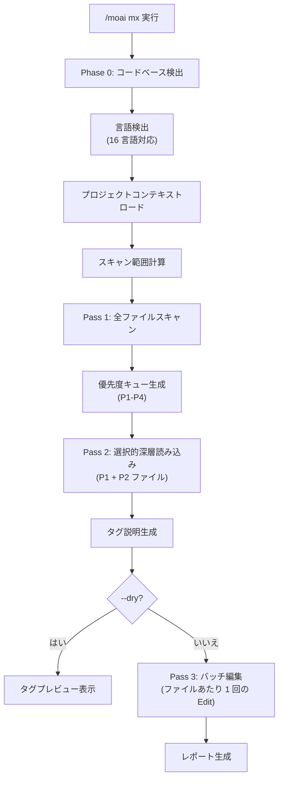

import { Callout } from 'nextra/components'

# /moai mx

コードベースをスキャンして @MX コードレベルアノテーションを追加するコマンドです。AI エージェントが**コードコンテキストを迅速に理解できるよう**自動的にコメントを挿入します。

<Callout type="tip">
**一行要約**: `/moai mx` は「コードナビゲーション標識」を自動設置します。危険なコード、重要な関数、テスト不足などを **@MX タグでマーキング**し、AI エージェントのコード理解を向上させます。
</Callout>

<Callout type="info">
**スラッシュコマンド**: Claude Code で `/moai:mx` と入力すると、このコマンドを直接実行できます。`/moai` だけ入力すると、利用可能なすべてのサブコマンドの一覧が表示されます。
</Callout>

## 概要

@MX タグはコードに付与するメタデータアノテーションです。AI エージェントがコードを読む際に、重要な関数、危険なパターン、未完了の作業を即座に把握できるようにします。`/moai mx` は 3 パススキャンでコードベースを分析し、適切なタグを自動挿入します。

### @MX タグタイプ

| タグ | 用途 | 使用タイミング |
|------|------|--------------|
| `@MX:ANCHOR` | 不変契約 | fan_in >= 3 (3 箇所以上から呼び出し) |
| `@MX:WARN` | 危険ゾーン | 複雑度 >= 15、goroutine/async パターン |
| `@MX:NOTE` | コンテキスト伝達 | マジックナンバー、ビジネスルールの説明 |
| `@MX:TODO` | 未完了作業 | テスト不足、SPEC 未実装 |

## 使用方法

```bash
# コードベース全体をスキャン
> /moai mx --all

# プレビュー (変更なしで確認のみ)
> /moai mx --dry

# P1 優先度のみ (高 fan_in 関数)
> /moai mx --priority P1

# 既存タグを強制上書き
> /moai mx --all --force

# 特定言語のみスキャン
> /moai mx --all --lang go,python

# fan_in しきい値を下げる
> /moai mx --all --threshold 2
```

## サポートされるフラグ

| フラグ | 説明 | 例 |
|-------|------|------|
| `--all` | コードベース全体をスキャン | `/moai mx --all` |
| `--dry` | プレビューのみ - ファイル変更なしでタグ表示 | `/moai mx --dry` |
| `--priority P1-P4` | 優先度レベルフィルター (デフォルト: 全て) | `/moai mx --priority P1` |
| `--force` | 既存の @MX タグを上書き | `/moai mx --force` |
| `--exclude PATTERN` | 追加の除外パターン (カンマ区切り) | `/moai mx --exclude "vendor/**"` |
| `--lang LANGS` | 特定言語のみスキャン (デフォルト: 自動検出) | `/moai mx --lang go,ts` |
| `--threshold N` | fan_in しきい値のオーバーライド (デフォルト: 3) | `/moai mx --threshold 2` |
| `--no-discovery` | Phase 0 コードベース検出をスキップ | `/moai mx --no-discovery` |
| `--team` | 言語別並列スキャン (エージェントチームモード) | `/moai mx --team` |

## 優先度レベル

| 優先度 | 条件 | タグタイプ |
|--------|------|----------|
| **P1** | fan_in >= 3 (3 箇所以上から呼び出し) | `@MX:ANCHOR` |
| **P2** | goroutine/async、複雑度 >= 15 | `@MX:WARN` |
| **P3** | マジックナンバー、docstring 不足 | `@MX:NOTE` |
| **P4** | テスト不足 | `@MX:TODO` |

## 実行プロセス

`/moai mx` は 3 パスで実行されます。



### Phase 0: コードベース検出

16 言語対応の自動検出を行います。言語別の設定ファイルとコメント構文を特定します。

### Pass 1: 全ファイルスキャン

全ソースファイルをスキャンし、優先度キューを生成します:

- **Fan-in 分析**: 関数/メソッドの参照回数カウント
- **複雑度検出**: 行数、分岐数、ネスト深度
- **パターン検出**: 言語固有の危険パターン

### Pass 2: 選択的深層読み込み

P1 と P2 ファイルを深層分析し、正確なタグ説明を生成します。

### Pass 3: バッチ編集

ファイルあたり 1 回の Edit 呼び出しでタグを挿入します。既存の @MX タグは保持されます (`--force` 除く)。

## バッチチェックポイント

大規模スキャン (50+ ファイル) はバッチ処理を使用します:

- **バッチサイズ**: 50 ファイル/反復
- **自動コミット**: 各バッチ完了後に中間結果をコミット
- **進捗追跡**: `.moai/cache/mx-scan-progress.json`
- **再開可能**: 中断されたスキャンの続行

<Callout type="info">
レートリミット検出時、現在のバッチを保存してグレースフルに停止します。`/moai mx` を再実行すると最後のチェックポイントから再開されます。
</Callout>

## 他のワークフローとの統合

| ワークフロー | MX 統合方法 |
|-------------|------------|
| `/moai sync` | 同期中にMX検証を自動実行 (SPEC-MX-002) |
| `/moai edit` | ファイル編集時に@MXタグを自動検証 (v2.7.8+) |
| `/moai run` | DDD ANALYZE フェーズで自動トリガー |
| `/moai review` | MX タグコンプライアンスチェックを含む |

## よくある質問

### Q: @MX タグはコード実行に影響しますか?

いいえ、@MX タグはコメントとしてのみ存在します。コード実行やパフォーマンスには一切影響しません。

### Q: 既存のタグがある場合はどうなりますか?

デフォルトでは既存タグを保持します。`--force` フラグを使用すると上書きされます。

### Q: 自動生成ファイルもタグ付けされますか?

いいえ。`.moai/config/sections/mx.yaml` の除外パターンに基づき、生成ファイル、vendor、mock ファイルは自動的にスキップされます。

## 関連ドキュメント

- [/moai clean - デッドコード削除](/utility-commands/moai-clean)
- [/moai review - コードレビュー](/quality-commands/moai-review)
- [/moai - 完全自動自動化](/utility-commands/moai)
